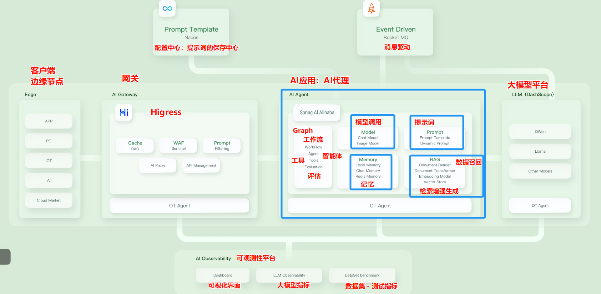
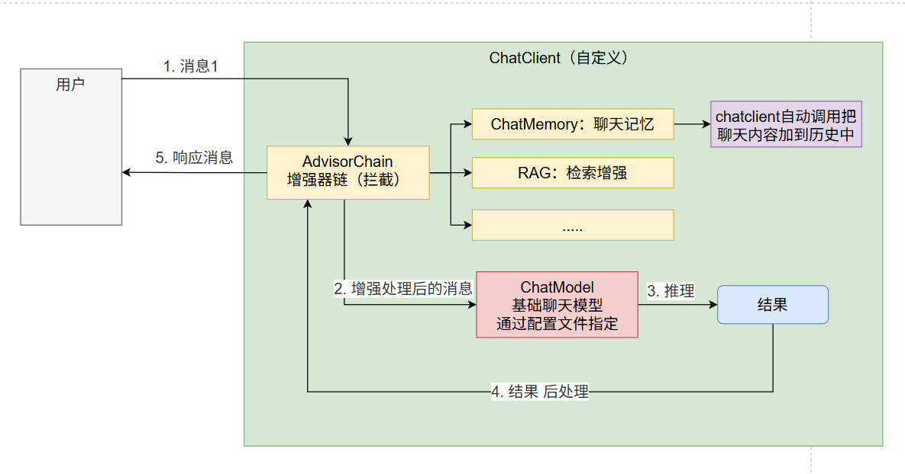

# 6. 快速上手 - Spring Alibaba AI

> 官方提供的案例

https://github.com/spring-ai-alibaba/examples.git

# AI应用开发生态架构

> Java AI应用开发：（Spring AI系列、LangChain4j）
> 
> 1. 开通云平台大模型调用权限（ApiKey）；Dashscope、DeepSeek；
>   1. 也可以使用 ollama（gguf），调用本地模型； 也是ollama暴露端口发请求
>   2. **不是所有的模型，ollama 都支持下载和运行**
> 2. 配置平台地址、ApiKey、模型名称、模型简单参数设置；
> 3. 本质就是给大模型发送请求；

> > 完全发挥AI能力、必然使用Python
> 
> Python AI应用开发：LangChain
> 
> 1. 开通云平台大模型调用权限（ApiKey）；Dashscope、DeepSeek；
> 2. 配置平台地址、ApiKey、模型名称、模型简单参数设置；
> 3. 本质就是给大模型发送请求；
> 4. **Python 原生支持**，huggingface所有模型下载、推理、训练（微调）

# 简单案例

https://github.com/GTyingzi/spring-ai-tutorial

> ChatClient 核心机制

# 完整案例

https://github.com/spring-ai-alibaba/examples.git

# RAG

https://developer.aliyun.com/article/1670698

# DeepResearch