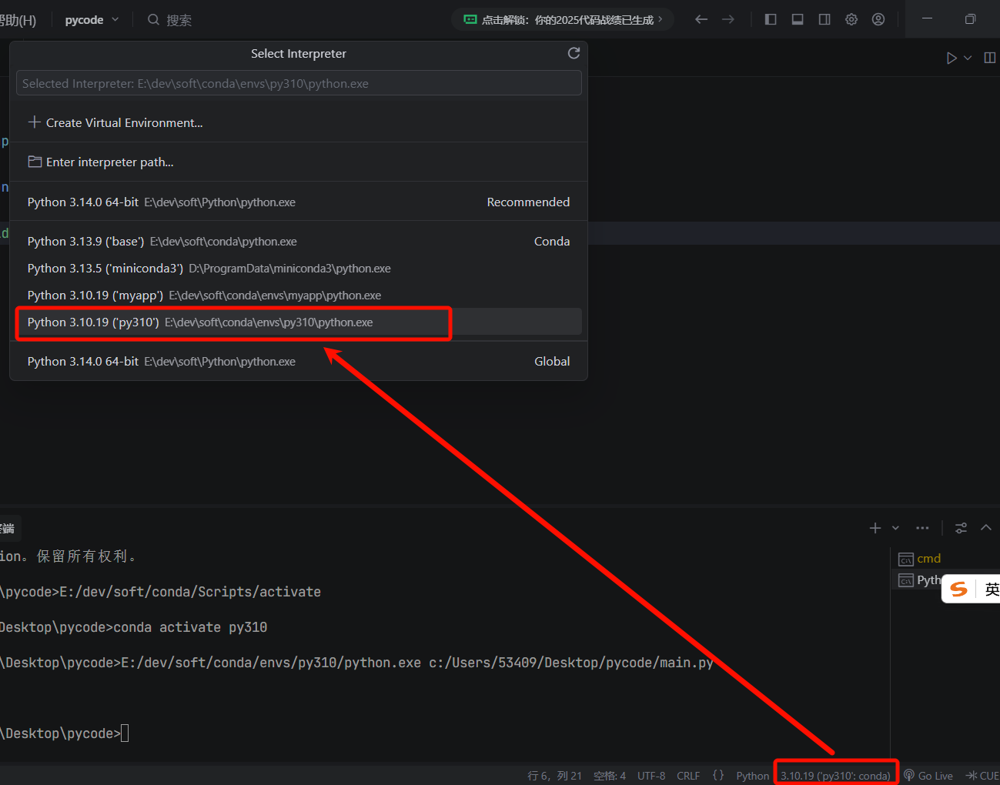
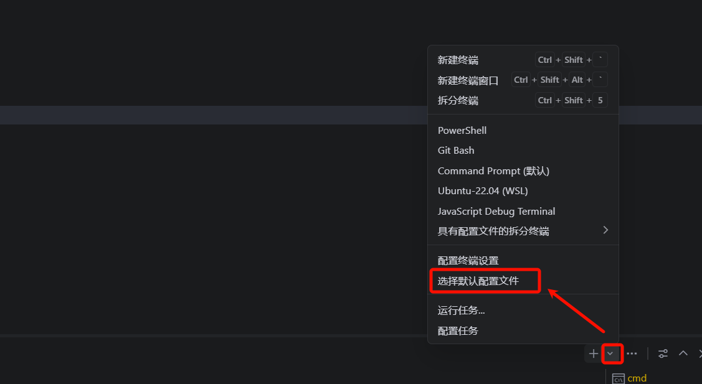
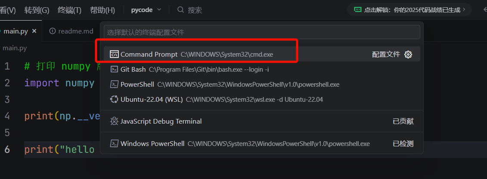

# 1. Conda 工程化环境

# 1. Conda 环境配置

## 下载

https://www.anaconda.com/download


## 链接

下载conda： https://repo.anaconda.com/miniconda/Miniconda3-latest-Windows-x86_64.exe

# Conda 命令

## 国内镜像

 conda有时候安装软件会非常慢。设置国内镜像的话可以使安装更快捷一些。设置方法如下所示：

```bash
conda config --add channels https://mirrors.tuna.tsinghua.edu.cn/anaconda/pkgs/main/
conda config --add channels https://mirrors.tuna.tsinghua.edu.cn/anaconda/cloud/conda-forge/
conda config --add channels https://mirrors.tuna.tsinghua.edu.cn/anaconda/cloud/bioconda/
```

> **设置搜索时显示通道地址**

`conda config --set show_channel_urls yes`

> **设置pip镜像**

`pip config set global.index-url ``https://pypi.tuna.tsinghua.edu.cn/simple`

## conda命令

| 分类 | 命令 | 功能说明 |
| --- | --- | --- |
| 环境管理 | conda create -n env_name python=3.10 | 创建一个名为 env_name 的新环境，并指定 Python 版本 |
|   | conda activate env_name | 激活名为 env_name 的环境 |
|   | conda deactivate | 退出当前环境 |
|   | conda env list 或 conda info --envs | 显示所有环境列表 |
|   | conda remove -n env_name --all | 删除指定环境 |
| 包管理 | conda install package_name | 安装包到当前环境 |
|   | conda install -n env_name package_name | 向指定环境安装包 |
|   | conda uninstall package_name | 卸载包 |
|   | conda update package_name | 更新某个包到最新版本 |
|   | conda update --all | 更新当前环境中所有包 |
|   | conda list | 列出当前环境中已安装的所有包 |
| 通道管理 | conda config --show channels | 查看当前配置的通道列表 |
|   | conda config --add channels channel_name | 添加新通道 |
|   | conda config --remove channels channel_name | 删除通道 |
| 环境导出与克隆 | conda env export > environment.yml | 导出当前环境配置 |
|   | conda env create -f environment.yml | 从配置文件创建环境 |
|   | conda create --name new_env --clone old_env | 克隆一个已有环境 |
| 信息查看与清理 | conda info | 查看 Conda 的总体信息 |
|   | conda search package_name | 搜索可用包 |
|   | conda clean --all | 清理未使用的包缓存等文件 |

# conda与pip

> `conda install`和 `pip install` 都能安装 Python 包，但它们有重要的区别和适用场景。
> 
> conda install numpy
> 
> pip install numpy

## 🧩 1. 核心区别概览

| 对比项 | conda install | pip install |
| --- | --- | --- |
| 包来源 | 来自 Conda 仓库（如 defaults, conda-forge） | 来自 PyPI（Python 官方包索引） |
| 管理的对象 | 不仅可安装 Python 包，还能安装 C 库、系统依赖（如 MKL、CUDA 等） | 只能安装 Python 代码包 |
| 环境隔离 | 由 Conda 环境系统管理 | 通常安装到当前解释器环境 |
| 速度与依赖性 | 下载安装速度较快，依赖解决能力强 | 可能出现依赖冲突（especially with native libs） |
| 包格式 | .tar.bz2 / .conda 格式，由 Conda 打包 | .whl (wheel) 或 .tar.gz 格式 |
| 兼容性 | 适配 Anaconda/Miniconda 环境最佳 | 通用（只要有 Python） |

---

## 🧠 2. 什么时候该用哪个？

| 场景 | 推荐命令 | 说明 |
| --- | --- | --- |
| 🚀 科学计算类库（如 NumPy、Pandas、SciPy、TensorFlow） | ✅ conda install | Conda 提供的预编译二进制包包含高性能库（MKL、BLAS、OpenMP 等），更稳定快速。 |
| 🧪 一般纯 Python 库（比如 requests、flask 等） | ✅ pip install | 没有 C 扩展或复杂依赖时，pip 就足够了。 |
| 🌍 需要安装非 Python 工具或依赖（如 ffmpeg, graphviz） | ✅ conda install | Conda 可以管理这些系统级工具和库。 |
| 🧩 Conda 仓库没有的包 | ✅ pip install | 有些小众项目只在 PyPI 上发布。 |
| 💡 最佳实践：结合使用 | conda install 安装主要依赖，pip install 补充不存在于 Conda 的包。 |   |

> **优先用 **`conda install`** 管理环境和主要依赖，只有在 Conda 仓库没有包时，再用 **`pip install`**。**

## ⚠️ 3. 需要注意的几点

| 注意点 | 说明 |
| --- | --- |
| 🚫 不混装同名包 | 同一个环境中不要既用 conda install 又用 pip install 安装相同的包。 |
| 🧩 Conda 环境内自带 pip | 不需要单独安装 pip，Conda 会自动准备好对应版本。 |
| 📦 可用 requirements.txt | 用 pip 管理依赖时，可以用 pip freeze > requirements.txt 来导出依赖列表。 |
| 🔄 如果需要系统库依赖 | 仍然用 conda 安装更保险（例如 ffmpeg, graphviz）。 |

# 最佳实践

## 工程创建

> 推荐工具：https://www.trae.cn/
> 
> 

 

纯 Python 项目的推荐方式：

```python
# 创建隔离环境
conda create -n myapp python=3.10

# 激活环境
conda activate myapp

# 安装依赖
pip install -r requirements.txt
```

项目部署时，你的文档可以这样写：

```plain text
# 在项目 README.md 中说明
conda create -n myapp python=3.10
conda activate myapp
pip install -r requirements.txt
```

## 编辑器设置

### 默认conda环境



### 命令行终端设置



