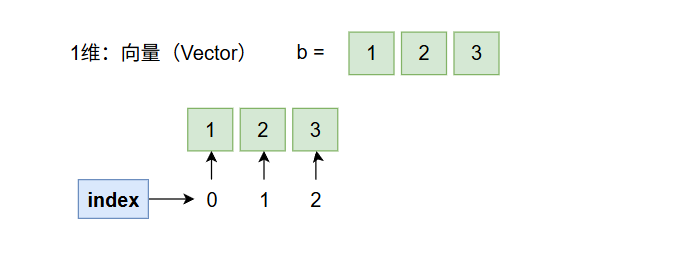
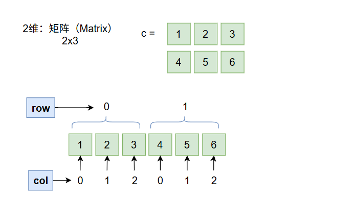
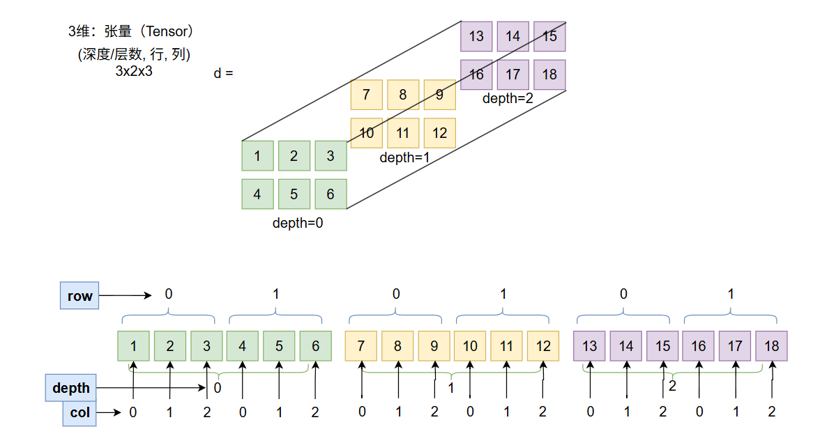
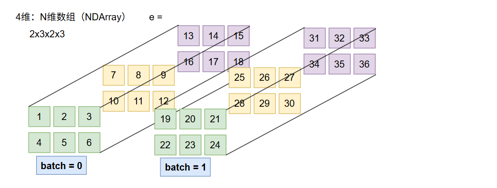

# 1. Numpy 实战

> NumPy（Numerical Python）是 Python 中用于**高性能科学计算的核心库**。它提供了：
> 
> -  **高性能的多维数组对象**（ndarray）
> -  **丰富的数学函数库**
> -  **线性代数、傅里叶变换等工具**
> -  **与 C/C++ 代码集成的能力**

## 导入NumPy

> 使用import命令导入numpy包，.__version__命令可以查看当前包的版本

### 安装NumPy

```python
# 使用 pip 安装
pip install numpy

# 使用 conda 安装
conda install numpy
```

### 导入NumPy

```python
import numpy as np  # 约定俗成的导入方式

# 检查版本
print(np.__version__)
```

## 为什么用NumPy

### 内存连续

```python
import numpy as np

# Python 列表
my_list = [1, 2, 3, 4, 5]

# 转换为 NumPy 数组
my_array = np.array(my_list)
```


### 高性能测试

```python
# Python 列表 vs NumPy 数组的性能对比
import time

# Python 列表
python_list = list(range(1000000))
start = time.time()
result = [x * 2 for x in python_list]
print(f"Python 列表耗时: {time.time() - start:.4f}秒")
# ===================================================
# NumPy 数组
import numpy as np
numpy_array = np.arange(1000000)
start = time.time()
result = numpy_array * 2
print(f"NumPy 数组耗时: {time.time() - start:.4f}秒")
# NumPy 通常快 10-100 倍！
```

##  **数组基础**

> Numpy数组创建指通过使用Numpy库来生成数组的过程。在Python中，Numpy库提供了多种创建数组的方法，可以调用这些方法来生成不同维度和元素的数组，这些创建的数组可用于存储和操作大量数据，进行各种数值计算和数据分析。

### 理解 ndarray

> **ndarray**（N-dimensional array）是 NumPy 的核心数据结构，**表示 N 维数组**。


0维：标量：Scalar

1维：向量：Vector

2维：矩阵：Matrix

3维：张量：Tensor

N维：多维数组：ND Array

### 图解维度

> 即使再高维度的数组，**在底层都是一维连续空间**；NumPy会自动转化索引，**多维**是为了给人们逻辑理解方便而设置的

#### 1维：向量



#### 2维：矩阵



#### 3维：张量



#### 4维：N维数组



#### 代码

```python
import numpy as np
# 标量
a = 1
print(a)

# 向量
b = np.array([1, 2, 3])
print(b)
print("向量b的第二个元素:",b[1])
print("===============")

# 矩阵 [1,2,3]  [4,5,6]; 2x3
c = np.array([[1,2,3],[4,5,6]])
print(c)
print("矩阵c的第二行第二个元素:",c[1][1])
print("===============")

# 张量：3维数组 # [[1,2,3],[4,5,6]] # [[7，8,9],[10,11,12]]
# 创建 3x2x3 张量。值从1开始一直到18填充满
d = np.arange(1,19).reshape(3,2,3)
print("3维数组d:",d)
print("3维数组d的第3层第2个元素的第1个元素:",d[2][1][0])
print("=========")
# 4维数组 #[[[1,2,3],[4,5,6]],[[7,8,9],[10,11,12]]]  [[[1,2,3],[4,5,6]],[[7,8,9],[10,11,12]]]
# 生成 2x3x2x3 四维数组，值从1开始一直到36填充满
e = np.arange(1,37).reshape(2,3,2,3)
print("4维数组e:",e)
print("4维数组e的第2层第3个元素的第2个元素:",e[1][1][0][1])
print("===============")

```

### 数组创建

#### 从列表创建

```python
# 从 Python 列表创建
arr = np.array([1, 2, 3, 4, 5])

# 指定数据类型
arr_float = np.array([1, 2, 3], dtype=float)
print(arr_float)  # [1. 2. 3.]

arr_int = np.array([1.5, 2.7, 3.9], dtype=int)
print(arr_int)  # [1 2 3]  (截断小数部分)
```

#### 使用内置函数创建

```python
# zeros - 创建全 0 数组
zeros_1d = np.zeros(5)           # [0. 0. 0. 0. 0.]
zeros_2d = np.zeros((3, 4))      # 3行4列的全0矩阵

# ones - 创建全 1 数组
ones_1d = np.ones(5)             # [1. 1. 1. 1. 1.]
ones_2d = np.ones((2, 3))        # 2行3列的全1矩阵

# full - 创建指定值的数组
full_arr = np.full((2, 3), 7)    # 全是7的2x3矩阵

# empty - 创建未初始化的数组（速度快，但值随机）
empty_arr = np.empty((2, 2))

# eye / identity - 创建单位矩阵
identity = np.eye(3)
# [[1. 0. 0.]
#  [0. 1. 0.]
#  [0. 0. 1.]]
```

#### 使用范围函数创建

```python
# arange - 类似 Python 的 range
arr1 = np.arange(10)           # [0 1 2 3 4 5 6 7 8 9]
arr2 = np.arange(2, 10)        # [2 3 4 5 6 7 8 9]
arr3 = np.arange(2, 10, 2)     # [2 4 6 8]  步长为2
arr4 = np.arange(0, 1, 0.1)    # [0.  0.1 0.2 ... 0.9]

# linspace - 创建等间隔数组
arr5 = np.linspace(0, 10, 5)   # [0.  2.5  5.  7.5 10.]
# 从0到10，均匀分成5个数

# logspace - 创建对数间隔数组
arr6 = np.logspace(0, 2, 5)    # [1. 3.16... 10. 31.6... 100.]
# 从 10^0 到 10^2，均匀分成5个数
```

#### 常见方法对比

| 函数 | 说明 | 示例 |
| --- | --- | --- |
| np.array() | 从列表创建 | np.array([1,2,3]) |
| np.zeros() | 全0数组 | np.zeros((2,3)) |
| np.ones() | 全1数组 | np.ones((2,3)) |
| np.full() | 指定值数组 | np.full((2,3), 5) |
| np.eye() | 单位矩阵 | np.eye(3) |
| np.arange() | 等差数列 | np.arange(0,10,2) |
| np.linspace() | 等分数列 | np.linspace(0,1,5) |

### 数组属性

```python
arr = np.array([[1, 2, 3, 4],
                [5, 6, 7, 8],
                [9, 10, 11, 12]])

# 形状
print(arr.shape)      # (3, 4) - 3行4列

# 维度数
print(arr.ndim)       # 2 - 二维数组

# 元素总数
print(arr.size)       # 12 - 共12个元素

# 数据类型
print(arr.dtype)      # int64 (或 int32)

# 每个元素的字节数
print(arr.itemsize)   # 8 (64位整数占8字节)

# 数组总字节数
print(arr.nbytes)     # 96 (12个元素 × 8字节)
```

## 索引与切片

### 一维索引

```python
arr = np.array([10, 20, 30, 40, 50])

# 正向索引（从0开始）
print(arr[0])    
# 10
print(arr[2])   # 30
 # 负向索引（从-1开始，表示最后一个）
print(arr[-1])   # 50
print(arr[-2])   # 40
# 索引图解
#  索引:   0    1    2    3    4
#        ┌────┬────┬────┬────┬────┐
#  值:   │ 10 │ 20 │ 30 │ 40 │ 50 │
#        └────┴────┴────┴────┴────┘
# 负索引: -5   -4   -3   -2   -1
```

### 一维数组切片

```python
arr = np.array([0, 1, 2, 3, 4, 5, 6, 7, 8, 9])

# 基本切片 [start:stop:step]
print(arr[2:7])      # [2 3 4 5 6]  从索引2到6
print(arr[:5])       # [0 1 2 3 4]  从开头到索引4
print(arr[5:])       # [5 6 7 8 9]  从索引5到结尾
print(arr[::2])      # [0 2 4 6 8]  每隔2个取一个
print(arr[::-1])     # [9 8 7 6 5 4 3 2 1 0]  反转数组
```

### 二维数组索引

```python
arr = np.array([[1, 2, 3],
                [4, 5, 6],
                [7, 8, 9]])

# 单个元素 [行, 列]
print(arr[0, 0])     # 1  (第0行第0列)
print(arr[1, 2])     # 6  (第1行第2列)
print(arr[-1, -1])   # 9  (最后一行最后一列)

# 整行
print(arr[1])        # [4 5 6]  第1行
print(arr[1, :])     # [4 5 6]  同上

# 整列
print(arr[:, 1])     # [2 5 8]  第1列

# 子矩阵
print(arr[0:2, 1:3])
# [[2 3]
#  [5 6]]
```

### 高级索引

```python
arr = np.array([10, 20, 30, 40, 50])

# 花式索引（使用数组作为索引）
indices = [0, 2, 4]
print(arr[indices])  # [10 30 50]

# 布尔索引
mask = arr > 25
print(mask)          # [False False  True  True  True]
print(arr[mask])     # [30 40 50]

# 条件筛选
print(arr[arr > 25])  # [30 40 50]
print(arr[(arr > 15) & (arr < 45)])  # [20 30 40]
```

## 数组运算

## 广播机制

## 数组变形

## 数学函数

## 线性代数

## 统计函数

## 随机数生成

> 以上，我们详细学习了Numpy的安装、数组的创建、数组的操作以及数组间的运算，对于研究学习来说，已经足够了，**由于Pandas这个工具已经为我们整合并封装了大量实用的计算功能**，无需过多地深入NumPy的所有底层功能和细节。在日常的数据分析和处理工作中，我们可以直接调用Pandas的相关功能来完成任务，使数据处理工作变得更加高效和便捷。

> NumPy 是 Python 数据科学生态系统的基石。掌握 NumPy 后，你可以：
> 
> 1. ✅ 高效处理大规模数值数据
> 2. ✅ 进行复杂的数学和统计计算
> 3. ✅ 为学习 Pandas、Scikit-learn、TensorFlow 等打下基础
> 4. ✅ 实现各种科学计算和数据分析任务