# 2. Pandas 实战

> 本节将首先学习Pandas的安装方法，并开始熟悉如何使用Pandas创建数据集，数据集在经管领域通常用于存储和处理大量的结构化数据。接着，学习者将掌握Pandas数据的基本操作，如选择特定的行、列、筛选数据等。这些操作对于数据的清洗和预处理至关重要。除此之外，Pandas还提供了数据重塑的功能，如pivot、melt、stack和unstack等操作，它们能够帮助学生根据不同的分析需求灵活地调整数据的结构。

## Pandas环境

> Pandas是一个开源的Python数据分析库。它基于NumPy，旨在提供简单高效的数据处理和分析工具,Pandas提供了名为DataFrame的数据结构，用于存储和处理表格数据，以及一系列用于数据清洗、处理、分析和可视化的方法和功能。

### 安装

> 安装pandas包使用pip install+包的名称，如果要安装指定的numpy包，可==具体的版本号。

```python
#安装包
pip install pandas # 最新版本
pip install pandas==xxx # 指定版本下载，xxx为版本号
#镜像站安装
pip install pandas -i https://pypi.tuna.tsinghua.edu.cn/simple

#升级包
pip install --upgrade pandas # 升级至最新版本
pip install --upgrade pandas==xxx # 指定版本下载，xxx为版本号

#卸载包
pip uninstall pandas
```

> 升级包使用--upgrade+包的名称，可升级到最新版，如果要安装指定的pandas包，可==具体的版本号。

> 卸载包可使用pip uninstall+包的名称，即可卸载

### 导入pandas包

使用import命令导入pandas包，并将pandas重命名为pd，起一个别名，这是Python数据科学社区中的标准做法，这样可以简化后续的代码，并使其更符合惯例。

> pd.__version__命令可以查看当前包的版本

```python
import sys #导入sys库用于查看Python的版本
import pandas as pd #导入pandas
print('当前使用 Python 版本为： ' + sys.version)
print('当前使用 Pandas 版本为： ' + pd.version)
```

> 一个包含有多种属性和方法，dir(包的名称)可查看该包所有的可用属性和方法，使用dir方法，用于了解该包提供了哪些功能。

```python
#查看包的方法
import pandas
print(dir(pandas))#这里的属性和方法包含很多，只需要掌握常用的即可
```

['Categorical', 'CategoricalDtype', 'CategoricalIndex', 'DataFrame', 'DateOffset', 'DatetimeIndex', 'DatetimeTZDtype', 'ExcelFile', 'ExcelWriter', 'Float64Index', 'Grouper', 'HDFStore', 'Index', 'IndexSlice', 'Int16Dtype', 'Int32Dtype', 'Int64Dtype', 'Int64Index', 'Int8Dtype', 'Interval', 'IntervalDtype', 'IntervalIndex', 'MultiIndex', 'NaT', 'Panel', 'Period', 'PeriodDtype', 'PeriodIndex', 'RangeIndex', 'Series', 'SparseArray', 'SparseDataFrame', 'SparseDtype', 'SparseSeries', 'TimeGrouper', 'Timedelta', 'TimedeltaIndex', 'Timestamp', 'UInt16Dtype', 'UInt32Dtype', 'UInt64Dtype', 'UInt64Index', 'UInt8Dtype', '**builtins**', '**cached**', '**doc**', '**docformat**', '**file**', '**git_version**', '**loader**', '**name**', '**package**', '**path**', '**spec**', '**version**', '_hashtable', '_lib', '_libs', '_np_version_under1p13', '_np_version_under1p14', '_np_version_under1p15', '_np_version_under1p16', '_np_version_under1p17', '_tslib', '_version', 'api', 'array', 'arrays', 'bdate_range', 'compat', 'concat', 'core', 'crosstab', 'cut', 'date_range', 'datetime', 'describe_option', 'errors', 'eval', 'factorize', 'get_dummies', 'get_option', 'infer_freq', 'interval_range', 'io', 'isna', 'isnull', 'lreshape', 'melt', 'merge', 'merge_asof', 'merge_ordered', 'notna', 'notnull', 'np', 'offsets', 'option_context', 'options', 'pandas', 'period_range', 'pivot', 'pivot_table', 'plotting', 'qcut', 'read_clipboard', 'read_csv', 'read_excel', 'read_feather', 'read_fwf', 'read_gbq', 'read_hdf', 'read_html', 'read_json', 'read_msgpack', 'read_parquet', 'read_pickle', 'read_sas', 'read_sql', 'read_sql_query', 'read_sql_table', 'read_stata', 'read_table', 'reset_option', 'set_eng_float_format', 'set_option', 'show_versions', 'test', 'testing', 'timedelta_range', 'to_datetime', 'to_msgpack', 'to_numeric', 'to_pickle', 'to_timedelta', 'tseries', 'unique', 'util', 'value_counts', 'wide_to_long']

> Pandas拥有众多实用方法。通过查阅帮助文档，我们可以了解这些函数的参数设置。理解参数的作用能帮助我们更好地掌握函数的使用方法。只需在函数名后加个问号(?)，即可轻松调用帮助文档。如下是调用read_excel的帮助文档。

```python
#帮助文档
pd.read_excel?
```

后面将详细学习pd.read_excel函数的用法，该函数可用于导入本地Excel数据，更多帮助文档的内容可供我们学习，比如pd.pivot_table?可做数据透视表。

## 数据集

> Series与DataFrame：Pandas可以手动创建Series和DataFrame两种数据集。其中，Series是一维数据结构，它只包含一个维度，DataFrame是二维数据结构，它包含行和列，类似于Excel表格，简单来说，DataFrame的列就相当于一个Series。

**创建方法：**Pandas手动创建数据集可以使用数组、列表、字典的形式来创建数据集

**pd.Series()：**用于创建一个 Series 对象的函数，能够保存任何数据类型整数、字符串、浮点数、Python对象等。

**函数签名：**pandas.Series(data=None, index=None, dtype=None, name=None, copy=False, fastpath=False)

**参数解释：**

- data：输入数据。数据可以采取各种形式，如列表、numpy数组、标量值等；
- index：索引值。它必须是可迭代的且长度与数据相匹配。如果没有提供索引，那么默认会创建一个0到N的整数索引，其中N是数据的长度；
- dtype：数据类型。它是可选的，如果没有提供，那么会尝试从数据中推断数据类型；
- name：系列的名称。它是可选的；
- copy：这个布尔参数默认为False，表示数据是被引用而不是被复制。设置为True会创建数据的拷贝；
- fastpath：尝试更快、更直接的途径创建系列。此参数在大多数情况下并不需要。

### 数组创建Series

数组创建Series使用np.random.randint()创建一个随机数组，用于创建Series。

```python
import pandas as pd
import numpy as np

生成6个介于100和999之间的随机整数
s = pd.Series(np.random.randint(100,1000,size=6),
              index=pd.date_range('20231101', periods=6),
              )
s
```

2023-11-01    672

2023-11-02    725

2023-11-03    293

2023-11-04    777

2023-11-05    657

2023-11-06    419

Freq: D, dtype: int64

```python
import pandas as pd
import numpy as np

#返回一个包含10个从标准正态分布中随机抽取的数值的数组
s = pd.Series(data=np.random.randn(10),
               index=pd.date_range('20231101',periods=10),
             )
s
```

2023-11-01    0.396903

2023-11-02   -0.086777

2023-11-03   -1.893741

2023-11-04   -2.261258

2023-11-05   -0.563267

2023-11-06   -1.672555

2023-11-07   -1.398504

2023-11-08    0.256618

2023-11-09    0.767690

2023-11-10    0.113171

Freq: D, dtype: float64

### 列表创建Series

列表创建Series创建列表[...]，用于创建Series。

```python
import pandas as pd  
  
data = [1, 2, 3, 4, 5, 6, 7, 8, 9, 10]  
s = pd.Series(data,index=list('ABCDEFGHIJ'))#index指定索引

s
```

A     1

B     2

C     3

D     4

E     5

F     6

G     7

H     8

I     9

J    10

dtype: int64

### 字典创建Series

字典创建Series需构建一个字典{...}，用于创建Series。

```python
import pandas as pd  
  
data = {'a': 1, 'b': 2, 'c': 3, 'd': 4, 'e': 5}  
s = pd.Series(data)  

s
```

a    1

b    2

c    3

d    4

e    5

dtype: int64

## DataFrame

**pd.DataFrame()**：用于创建一个DataFrame对象的函数。可以存储多种类型的数据，并允许行列索引。

**函数签名**: pandas.DataFrame(data=None, index=None, columns=None, dtype=None, copy=False)

**参数解释**：

- data：输入数据，可以为多种形式，如：如列表的列表、numpy 数组等。一个字典，其中键表示列名，值表示各列的数据，数据可以是多种形式,如列表、数组、序列等；
- index：行标签，即数据框的索引。如果没有提供，将默认生成一个整数索引；
- columns：列标签。当数据参数为字典时，此参数不必提供，因为字典的键将被用作列标签；
- dtype：数据类型，可选。指定数据框中的数据的数据类型；
- copy：布尔值，默认为False。当设置为True时，将复制输入数据，而不是直接引用。

### 数组创建DataFrame

数组创建DataFrame，data传入一个数组即可。

```python
import pandas as pd
import numpy as np

#通过传递一个数组，时间索引以及列标签来创建一个DataFrame
dates = pd.date_range('20231101',periods=10)
df = pd.DataFrame(np.random.randn(10,4),
                  index=dates,
                  columns=list('ABCD'))
df
```

A        B        C        D

2023-11-01        1.393532        0.671141        -2.201934        -0.034600

2023-11-02        -0.517057        -0.786379        0.284153        -0.176815

2023-11-03        -1.689679        -0.441222        -1.920524        0.264716

2023-11-04        -1.112860        -0.016110        0.476773        -1.032548

2023-11-05        1.139061        -0.753033        0.897143        0.481196

2023-11-06        -0.587708        0.785786        -0.314617        -1.818471

2023-11-07        -0.142970        -1.680156        1.549863        0.712661

2023-11-08        0.867526        -1.745085        -0.632177        -0.665809

2023-11-09        0.637286        -0.303844        0.639904        -0.843654

2023-11-10        0.085418        -0.728691        -0.839071        -0.153010

### 列表创建DataFrame

列表创建DataFrame，data需要传入一个列表。

```python
#使用列表创建一个数据集
import pandas as pd

df = pd.DataFrame([['1001','2023-11-01','北京',23,'男',3200],
                  ['1002','2023-11-02','上海',30,'女',1356],
                  ['1003','2023-11-03','广州',54,'男',2133],
                  ['1004','2023-11-04','上海',32,'女',3986],
                  ['1005','2023-11-05','杭州',34,'男',2980],
                  ['1006','2023-11-06','北京',32,'男',3452]],
                  columns=['员工ID','日期','城市','年龄','性别','销售额'])
df
```

员工ID        日期        城市        年龄        性别        销售额

0        1001        2023-11-01        北京        23        男        3200

1        1002        2023-11-02        上海        30        女        1356

2        1003        2023-11-03        广州        54        男        2133

3        1004        2023-11-04        上海        32        女        3986

4        1005        2023-11-05        杭州        34        男        2980

5        1006        2023-11-06        北京        32        男        3452

### 字典创建DataFrame

字典创建DataFrame，data需要传入一个字典。

```python
#使用字典创建一个数据集
import pandas as pd

df = pd.DataFrame({'员工ID':['1000','1001','1002','1003','1004','1005'],
                   '日期':pd.date_range('20231101',periods=6),
                   '城市':['北京', '上海', '广州', '上海', '杭州', '北京'],
                   '年龄':[23,30,54,32,34,32],
                   '性别':['男','女','男','女','男','男'],
                   '销售额':[3200,1356,2133,3986,2980,3452]},
                   columns =['员工ID','日期','城市','年龄','性别','销售额'])
df
```

员工ID        日期        城市        年龄        性别        销售额

0        1000        2023-11-01        北京        23        男        3200

1        1001        2023-11-02        上海        30        女        1356

2        1002        2023-11-03        广州        54        男        2133

3        1003        2023-11-04        上海        32        女        3986

4        1004        2023-11-05        杭州        34        男        2980

5        1005        2023-11-06        北京        32        男        3452

> Pandas作为Python中强大的数据处理库，提供了众多方法来操作数据。其中，对于数据的增加、删除和修改是常见且基础的操作，在实际的数据分析过程中，熟练掌握这些基本操作是非常重要，可以使得数据处理任务变得更加简单。

## 数据操作

pandas数据操作是数据分析过程中必备的技能之一。其中，常见的操作包括新增列、新增行、删除列、删除行等，这些pandas数据操作在数据分析中经常用到，掌握它们对于数据处理和分析的能力提升具有重要意义。

通过新增列，可将新的特征或计算结果添加到数据表中，丰富数据集的内容。新增行则可以将新的观测数据添加到数据表中，使分析结果更全面。而删除列和删除行则可以去除不需要的数据，减少数据的维度和冗余信息，提高分析的效率和准确性。

### 构建数据集

```python
#构建一个数据集
import pandas as pd

df = pd.DataFrame({'员工ID':['1000','1001','1002','1003','1004','1005'],
                   '日期':pd.date_range('20231101',periods=6),
                   '城市':['北京', '上海', '广州', '上海', '杭州', '北京'],
                   '年龄':[23,30,54,32,34,32],
                   '性别':['男','女','男','女','男','男'],
                   '销售额':[3200,1356,2133,3986,2980,3452]},
                   columns =['员工ID','日期','城市','年龄','性别','销售额'])
df
```

员工ID        日期        城市        年龄        性别        销售额

0        1000        2023-11-01        北京        23        男        3200

1        1001        2023-11-02        上海        30        女        1356

2        1002        2023-11-03        广州        54        男        2133

3        1003        2023-11-04        上海        32        女        3986

4        1004        2023-11-05        杭州        34        男        2980

5        1005        2023-11-06        北京        32        男        3452

### 新增列

- **insert():** insert函数是pandas DataFrame类的一个方法，用于在数据框的指定位置插入一列。
- **函数签名:** DataFrame.insert(loc,column='',value=None,allow_duplicates=False)
- **参数解释**:
  - loc：整数。需要插入的列的索引位置。例如，loc=0 会在数据框的最左边插入一列；
  - column：标签。插入列的名称；
  - value：scalar, series, or dataframe。要插入的数据。可以是标量、序列或数据框。如果是序列或数据框，其长度应与数据框的行数相匹配；
  - allow_duplicates：布尔值，默认为 False。如果为 True，允许插入重复的列。

```python
#可以选择插入的位置，1代表在第二列新增一列
df.insert(1,'所属部门',['技术部','技术部','业务部','业务部','销售部','销售部'],allow_duplicates=True)
df
```

员工ID        所属部门        日期        城市        年龄        性别        销售额

0        1000        技术部        2023-11-01        北京        23        男        3200

1        1001        技术部        2023-11-02        上海        30        女        1356

2        1002        业务部        2023-11-03        广州        54        男        2133

3        1003        业务部        2023-11-04        上海        32        女        3986

4        1004        销售部        2023-11-05        杭州        34        男        2980

5        1005        销售部        2023-11-06        北京        32        男        3452

### 默认在末尾插入一列

```bash
df['部门归属']=['技术类','技术类','业务类','业务类','销售类','销售类']
df
```

员工ID        所属部门        日期        城市        年龄        性别        销售额        部门归属

0        1000        技术部        2023-11-01        北京        23        男        3200        技术类

1        1001        技术部        2023-11-02        上海        30        女        1356        技术类

2        1002        业务部        2023-11-03        广州        54        男        2133        业务类

3        1003        业务部        2023-11-04        上海        32        女        3986        业务类

4        1004        销售部        2023-11-05        杭州        34        男        2980        销售类

5        1005        销售部        2023-11-06        北京        32        男        3452        销售类

### 新增行

```bash
#使用列表新增一行数据，直接在原始数据中新增
df = pd.DataFrame([['1001','2021-10-01','北京',23,'男',3200],
                  ['1002','2021-10-02','上海',30,'女',1356],
                  ['1003','2021-10-03','广州',54,'男',2133],
                  ['1004','2021-10-04','上海',32,'女',3986],
                  ['1005','2021-10-05','杭州',34,'男',2980],
                  ['1006','2021-10-06','北京',32,'男',3452],
                  ['1006','2021-10-06','北京',32,'男',3452]],#新增行数据
                  columns=['员工ID','日期','城市','年龄','性别','销售额'])
df
```

员工ID        日期        城市        年龄        性别        销售额

0        1001        2021-10-01        北京        23        男        3200

1        1002        2021-10-02        上海        30        女        1356

2        1003        2021-10-03        广州        54        男        2133

3        1004        2021-10-04        上海        32        女        3986

4        1005        2021-10-05        杭州        34        男        2980

5        1006        2021-10-06        北京        32        男        3452

6        1006        2021-10-06        北京        32        男        3452

### 删除列

- **drop()**：drop函数是pandas DataFrame类的一个方法，用于删除数据框中的行或列。
- **函数签名：**DataFrame.drop(labels=None, axis=0, index=None, columns=None, level=None, inplace=False, errors='raise')
- **参数解释**：
  - labels：要移除的行或列的标签；
  - axis：要删除的是行还是列。0 或 'index' 是行，1 或 'columns' 是列；
  - index 和 columns：分别是要删除的行标签和列标签，这两个参数是为了方便，和 labels 参数配合使用，不过一般推荐使用 labels 参数；
  - level：用于多层次索引（MultiIndex）；
  - inplace：布尔值，默认为False。如果为 True，则进行操作并在原数据上进行更改。如果为False，返回新的数据框；
  - errors：如果尝试删除的行或列不存在时如何处理。'raise'（默认）会引发错误，'ignore' 会忽略错误。

```python
#删除年龄,性别,销售额这三列
df_drop_column1=df.drop(['年龄','性别','销售额'],axis=1)
df_drop_column1
```

员工ID        日期        城市

0        1001        2021-10-01        北京

1        1002        2021-10-02        上海

2        1003        2021-10-03        广州

3        1004        2021-10-04        上海

4        1005        2021-10-05        杭州

5        1006        2021-10-06        北京

6        1006        2021-10-06        北京

```python
#也可以传入columns字段，将这三列删除
df_drop_column2=df.drop(columns=['年龄','性别','销售额'])
df_drop_column2
```

员工ID        日期        城市

0        1001        2021-10-01        北京

1        1002        2021-10-02        上海

2        1003        2021-10-03        广州

3        1004        2021-10-04        上海

4        1005        2021-10-05        杭州

5        1006        2021-10-06        北京

6        1006        2021-10-06        北京

### 删除行

```python
#传入index，指定位置删除第1行、第2行、第3行
df_drop_row1=df.drop(df.index[[0,1,2]],axis=0)
df_drop_row1
```

员工ID        日期        城市        年龄        性别        销售额

3        1004        2021-10-04        上海        32        女        3986

4        1005        2021-10-05        杭州        34        男        2980

5        1006        2021-10-06        北京        32        男        3452

6        1006        2021-10-06        北京        32        男        3452

```python
#传入index，指定行索引删除第1行、第2行、第3行
df_set_index=df.set_index('员工ID')#设置索引列
df_drop_row1=df_set_index.drop(index=['1001','1002','1003'])
df_drop_row1
```

日期        城市        年龄        性别        销售额

员工ID                                        

1004        2021-10-04        上海        32        女        3986

1005        2021-10-05        杭州        34        男        2980

1006        2021-10-06        北京        32        男        3452

1006        2021-10-06        北京        32        男        3452

## 数据重塑

Pandas数据重塑是一个非常重要的技术，它包含宽表转长表和长表转宽表两方面内容。宽表转长表 是将具有多个指标的宽表转换为具有较少指标但包含更多观测值的长表，这样可以更方便地进行某些类型的数据分析。相反，长表转宽表 则是将具有多个观测值的长表转换为具有更多指标但较少观测值的宽表，这样可以更直观地观察数据并提取更多有用信息。

掌握Pandas数据重塑技术，可以帮助数据分析学习者更好地处理和分析数据，为决策提供更加准确和全面的支持。因此，应该深入学习并掌握这一技术，以便更好地应对实际工作中的数据分析和处理任务。

### 宽表转长表

宽表转长表可以使用melt()和stack()这两个函数，首先使用列表创建一个宽表，用于宽表的转化。

```python
import pandas as pd
#使用列表创建一个宽表
wide_table = pd.DataFrame([['北京',2020,746,677,443,256],
                           ['上海',2020,917,969,809,981],
                           ['广州',2020,908,758,698,755],
                           ['深圳',2020,490,747,788,749],
                           ['杭州',2020,394,164,789,626],
                           ['北京',2021,443,362,832,746],
                           ['上海',2021,366,201,683,182],
                           ['广州',2021,141,240,192,318],
                           ['深圳',2021,314,910,269,671],
                           ['杭州',2021,300,546,467,814]],
                          columns=['城市','年份','第一季度','第二季度','第三季度','第四季度'])
wide_table
```

城市        年份        第一季度        第二季度        第三季度        第四季度

0        北京        2020        746        677        443        256

1        上海        2020        917        969        809        981

2        广州        2020        908        758        698        755

3        深圳        2020        490        747        788        749

4        杭州        2020        394        164        789        626

5        北京        2021        443        362        832        746

6        上海        2021        366        201        683        182

7        广州        2021        141        240        192        318

8        深圳        2021        314        910        269        671

9        杭州        2021        300        546        467        814

- **melt()**： 用于重塑数据框DataFrame的结构，可将数据框从宽格式转换为长格式。
- **函数签名**：pandas.melt(frame, id_vars=None, value_vars=None, var_name=None, value_name='value', col_level=None, ignore_index=True)
- **参数解释**：
  - frame：需要融合的数据框（DataFrame）；
  - id_vars：保持不变的列名或列名列表。这些列不会被融合；
  - value_vars：需要被融合的列名或列名列表。如果未指定，则会使用除id_vars外的所有列；
  - var_name：用于存储原始数据框中变量名的新列的名称。默认为None，这时会使用frame.columns.name或'variable'；
  - value_name：用于存储融合后数据值的新列的名称。默认为'value'；
  - col_level：如果数据框的列是多层索引的，可以通过此参数指定在哪一层进行融合。默认为None；
  - ignore_index：布尔值，默认为True。如果为True，则重置索引。否则，保留原始索引。

```python
#下面将宽表转化为长表，应用长表可以做数据透视
long_table=wide_table.melt(id_vars=['城市','年份'],var_name='季度',value_name='销售量')
long_table.head(10)
```

城市        年份        季度        销售量

0        北京        2020        第一季度        746

1        上海        2020        第一季度        917

2        广州        2020        第一季度        908

3        深圳        2020        第一季度        490

4        杭州        2020        第一季度        394

5        北京        2021        第一季度        443

6        上海        2021        第一季度        366

7        广州        2021        第一季度        141

8        深圳        2021        第一季度        314

9        杭州        2021        第一季度        300

- **stack()：**用于将数据的宽格式转变为长格式，将表格型数据转为树形数据，起到数据重塑的作用。
- **函数签名:** DataFrame.stack(level=-1, dropna=True)
- **参数解释**:
  - level：代表多重索引的层级。默认为-1，表示在内层级上进行堆叠；
  - dropna：布尔值，默认为True。如果为True，则删除所有项都是NaN的列。

要将宽表转化为长表，首先调用set_index函数将'城市'和'年份设置为行索引，保持行索引不变，然后调用stack方法将列索引也转换为行索引，最后使用reset_index()方法将索引重置，重置后的索引是默认的，这里可以使用columns函数传入新的列名。

```python
long_table=wide_table.set_index(['城市','年份']).stack().reset_index()
long_table.columns=['城市','年份','季度','销售量']
long_table.head(10)
```

城市        年份        季度        销售量

0        北京        2020        第一季度        746

1        北京        2020        第二季度        677

2        北京        2020        第三季度        443

3        北京        2020        第四季度        256

4        上海        2020        第一季度        917

5        上海        2020        第二季度        969

6        上海        2020        第三季度        809

7        上海        2020        第四季度        981

8        广州        2020        第一季度        908

9        广州        2020        第二季度        758

### 长表转宽表

长表转宽表使用pivot_table()函数，相当于数据透视操作，可以将长表重塑为宽表，更方便数据分析和数据查看。

- **pivot_table()**：pivot_table用于数据汇总和重塑，可将一个长格式的数据表转换为一个宽格式的摘要表，可以指定多个字段作为行索引和列索引，并选择一个或多个聚合函数来计算汇总值。
- **函数签名**:  pandas.pivot_table(data, values=None, index=None, columns=None, aggfunc='mean', fill_value=None, margins=False, dropna=True, margins_name='All')
- **参数解释**：
  - data：用作数据透视表的数据源，可以是DataFrame、Series或其他类似的数据结构；
  - values：用于聚合的列或列的列表；
  - index：数据透视表的索引列或列的列表；
  - columns：数据透视表的列名列或列的列表；
  - aggfunc：用于聚合的函数或函数列表，默认为'mean'，也可以用其他函数，如'sum', 'count', 'min', 'max'等，或者使用numpy的函数，如np.sum。当传入函数列表时，返回一个DataFrame，每个函数对应一列；
  - fill_value：在透视表中用于填充缺失值的值；
  - margins：是否添加行/列小计和总计，默认为False；
  - dropna：是否删除所有项都是NaN的列，默认为True；
  - margins_name：添加到总计行/列的名称，默认为'All'。

```sql
wide_table=long_table.pivot_table(index=['城市','年份'],columns='季度',values='销售量').reset_index()
wide_table=wide_table[['城市','年份','第一季度','第二季度','第三季度','第四季度']]
wide_table
```

季度        城市        年份        第一季度        第二季度        第三季度        第四季度

0        上海        2020        917        969        809        981

1        上海        2021        366        201        683        182

2        北京        2020        746        677        443        256

3        北京        2021        443        362        832        746

4        广州        2020        908        758        698        755

5        广州        2021        141        240        192        318

6        杭州        2020        394        164        789        626

7        杭州        2021        300        546        467        814

8        深圳        2020        490        747        788        749

9        深圳        2021        314        910        269        671

## 数据概览

> 对于数据分析学习者来说，数据概览是数据处理和分析的起点，对于整个数据分析的过程至关重要，它包含数据导入、数据信息查看、数据导出三方面内容。通过掌握数据概览的这三个方面，数据分析学习者能够建立起对数据的初步认知和理解，为后续的数据处理和分析工作奠定坚实基础。

1. 首先，数据导入是将原始数据加载到分析环境中的关键步骤，通过合适的数据导入方法，学习者可以将各种格式和来源的数据高效导入。
2. 其次，数据信息查看是对导入数据进行初步探索的过程，通过查看数据的基本信息、统计指标、分布情况等，学习者可以快速了解数据的特征和质量，为后续分析打下基础。
3. 最后，数据导出是将处理和分析后的数据结果进行保存和分享的环节，学习者可以根据需要将数据导出为各种常见格式，以便与他人协作、汇报或后续使用。

> 我们后面需要用到下面测试数据；需提前下载

[📎 用户下单数据.csv](<files/用户下单数据.csv>)

[📎 电商销售数据.xlsx](<files/电商销售数据.xlsx>)

### 数据导入

pandas导入数据是一个常见的数据操作。.xlsx和.csv是两种常见的数据文件格式，pandas提供了相应的方法来导入这两种格式的数据。

#### 导入.xlsx数据

**pandas.read_excel()**： 用于读取Excel文件。

**函数签名**：pandas.read_excel(io,sheet_name=0,header=0,index_col=None,usecols=None,queeze=False,dtype=None,

skiprows=None,nrows=None,parse_dates=False,date_parser=None,thousands=None,comment=None,skipfooter=0,

storage_options=None)

**参数详解**：

- io：文件路径、URL、文件型对象或类似文件的对象，用于指定要读取的Excel文件；
- sheet_name：要读取的工作表名或工作表索引。默认为0，表示读取第一个工作表。可以传入工作表名字、索引列表，或者设置为None读取所有工作表；
- header：用作列名的行。默认为0，表示第一行是列名。也可以传入多行如[0,1,2]；
- index_col：用作行索引的列。可以是列名或整数位置。如果为序列，则创建多层索引；
- usecols：返回一个数据子集的列。可以传入列的名字或者位置；
- squeeze：如果数据解析后只有一列，则返回Series，否则返回DataFrame；
- dtype：指定列的数据类型。如{'A': np.float64, 'B': np.int32}；
- skiprows：需要跳过的行数（从文件开始处算起）；
- nrows：读取的行数；
- parse_dates：需要解析为日期的列。可以是列的名字或者位置列表，或者字典指定日期和时间的格式；
- date_parser：用于解析日期的函数；
- thousands：千位分隔符，如,或者.。适用于数字列；
- comment：注释的前缀。例如，如果Excel中的注释为'#NAME'，则可以传入'#'来读取这些注释；
- skipfooter：跳过的尾部行数。这对于有表尾注释的文件很有用；
- storage_options：用于文件存储的选项，比如压缩等，这在处理大型文件时尤其有用。

```python
import pandas as pd
df_sale=pd.read_excel(r'/home/电商销售数据.xlsx',#指定文件路径
                      dtype={'订单号':str},#指定列的数据类型
                      parse_dates=['日期']#解析为日期列
                     )

df_sale
```

#### 导入.csv数据

**pandas.read_csv()：** 用于读取CSV数据。在使用上与pandas.read_excel()类似，但专门针对CSV文件格式。

**函数签名：**

pandas.read_csv(filepath_or_buffer,sep=',',delimiter=None,header='infer',index_col=None,usecols=None,dtype=None,parse_dates=False,date_parser=None,nrows=None,skiprows=None,thousands=None,comment=None,encoding=None,error_bad_lines=True)

**参数详解**：

- filepath_or_buffer：需要读取的CSV文件的路径或类文件对象；
- sep：默认为 ','。用来分割字段的字符；
- delimiter：默认值为 None。字段分隔符，与sep参数功能相同；
- header：行号(s) 来作为列名。默认行为是推断列名，如果没有列名则设为None；
- index_col：列来作为索引。如果为序列，则使用多层索引；
- usecols：返回一个数据子集的列。如果列表，则所有列将被包括；
- dtype：数据类或列到类的字典，默认为None；
- parse_dates：解析日期时间。布尔值列表或名称或列表的列表或字典；
- date_parser：用于解析日期的函数；
- nrows：读取的行数；
- skiprows：要跳过的行号（从0开始）或返回要跳过的行号的可调用函数（基于行索引）；
- thousands：千位分隔符，如 ',' 或 '.'；
- comment：标识注释的字符，例如 '#'；
- encoding：用于解码的编码类型，例如 'utf-8'；
- error_bad_lines：如果为False，则忽略错误行，否则引发异常。

```python
df_user=pd.read_csv(r'/home/用户下单数据.csv',#指定文件路径
                    engine='python',#使用Python编写的引擎
                    encoding='gbk',#用于解码的编码类型
                    dtype={'用户ID':str},#指定列的数据类型
                    parse_dates=['用户出生日期'],#解析为日期列
                    usecols=['用户ID','用户出生日期','性别','婚姻状况','文化程度']#导入指定列
                   ) 

df_user
```

### 信息查看

> DataFrame提供了大量的方法来操作和分析数据，这里列举一些常用的方法，包括查看数据的基本信息、统计指标、分布情况等，通过这些方法的学习，对于经管学习者可以快速了解数据的特征和质量，为后续分析打下基础。

- **head() 和 tail()**：返回DataFrame的前n行或后n行；
- **sample()**：随机抽取DataFrame的n行数据；
- **info()**：显示 DataFrame 的简要摘要，包括索引类型、列名、非空值计数和数据类型；
- **dtypes**：查看数据的数据类型；
- **describe()：**生成DataFrame的描述性统计信息，包括均值、标准差、最小值、最大值及25%、50%、75%分位数；
- **shape**：返回数据的形状（行数，列数）；
- **index**：返回DataFrame行索引；
- **columns**：返回DataFrame的列名；
- **value_counts()**：对于Series中的唯一值，返回其计数，常用于统计分类数据；
- **unique()**：查看数据唯一值。

```python
import pandas as pd
df_sale=pd.read_excel(r'/home/mw/input/User_Orders4000/电商销售数据.xlsx',
                      dtype={'订单号':str},#指定列的数据类型
                      parse_dates=['日期']#解析为日期列
                     )

#默认显示前5行,用于快速查看数据集的一小部分
df_sale.head()

#指定显示前10行数据
df_sale.head(10)

#与head()类似，但是返回的是后n行，默认显示后5行数据
df_sale.tail()

#随机抽取5行数据
df_sale.sample(5)

#提供数据的简要摘要，包括索引类型、列名、非空值计数和数据类型等
df_sale.info()

#数据类型
df_sale.dtypes

#生成数据的描述性统计信息，包括计数、均值、标准差、最小值、四分位数和最大值
df_sale.describe().round(0)

#返回数据的形状（行数，列数）
df_sale.shape

#返回DataFrame行索引
df_sale.index

#返回DataFrame的列名
df_sale.columns

#对于Series中的唯一值，返回其计数，常用于统计分类数据。
df_sale['商品品类'].value_counts()

#查看数据唯一值
df_sale['商品品类'].unique()
```

### 数据导出

pandas可以导出为.xlsx数据格式，以及可以按照不同的sheet表分别将数据导出。

#### 导出.xlsx数据

- **DataFrame.to_excel**： to_excel函数可以将数据导出为Excel（.xlsx）文件。
- **函数签名**：DataFrame.to_excel(excel_writer,sheet_name='Sheet1',na_rep='',float_format=None,columns=None,header=True,index=True,index_label=None,startrow=0,startcol=0,engine='xlsxwriter',merge_cells=True,encoding=None,inf_rep='inf',verbose=False,freeze_panes=None)
- **参数详解**：
  - excel_writer：文件路径或现有的ExcelWriter对象；
  - sheet_name：字符串，默认为'Sheet1'，表示要写入的Excel表的名字；
  - na_rep：缺失数据的表示方式，默认为空字符串；
  - float_format：浮点数的格式，例如'%.2f'表示保留两位小数；
  - columns：要写入的列。可以是列的名字或者是列的索引；
  - header：是否写入列名。默认为True；
  - index：是否写入行索引。默认为True；
  - index_label：索引的列标签。如果没有给出，并且header和index都为True，则使用索引名。如果是多级索引，应该用一个序列给出各级索引的列标签；
  - startrow：整数，起始写入的行数，默认为0；
  - startcol：整数，起始写入的列数，默认为0；
  - engine：字符串，写入引擎，默认为'xlsxwriter'。另一个选项是'openpyxl'；
  - merge_cells：布尔值，是否合并单元格，默认为True；
  - encoding：字符串，表示要使用的编码，默认为None；
  - inf_rep：表示无穷大的字符串，默认为'inf'；
  - verbose：是否显示导出过程的日志，默认为False；
  - freeze_panes：元组，指定分割窗格的位置。例如，freeze_panes=(1, 0)将首行冻结。

```python
import pandas as pd
import numpy as np

#通过传递一个数组，时间索引以及列标签来创建一个DataFrame
dates = pd.date_range('20231101',periods=10)
df = pd.DataFrame(np.random.randn(10,4),
                  index=dates,
                  columns=list('ABCD'))

df.to_excel('out_table.xlsx', #导出数据路径
            sheet_name='Sheet1',#写入的Excel表的名字
            index=False,#不显示行索引
            na_rep=0#缺失数据显示为0
           )
```

#### 导出为不同sheet表

- **pd.ExcelWriter**： ExcelWriter函数可以用于将数据写入Excel文件，可导出为不同sheet表数据。
- **函数签名：**pandas.ExcelWriter(path_or_buf,engine=None,mode='w',engine_kwargs,if_sheet_exists,date_format,datetime_format)
- **参数详解**：
  - path_or_buf：表示文件路径。或是一个类似文件的对象，确保在完成写入后关闭它；
  - engine：代表所使用的引擎。默认为'xlsxwriter'，但也可以使用'openpyxl'等其他引擎；
  - mode：指定写入模式。默认为'w'，代表写入模式，如果文件已存在，则会被覆盖。如果设置为'a'，则数据将被追加到已存在的文件中；
  - engine_kwargs：此参数用于传递特定引擎的参数。它是一个可选的关键字参数字典，其中的参数会传递给底层的引擎；
  - if_sheet_exists：当在追加模式下(mode='a')并且工作表已存在时，该参数决定如何处理。它有三个选项：'error'(引发错误)、'new'(创建一个新工作表)、'replace'(删除现有工作表并创建一个新的)。默认为'error'；
  - date_format：字符串，指定日期格式。这可以用于Excel日期格式的字符串。例如：'YYYY-MM-DD'；
  - datetime_format：类似于date_format，但是用于datetime数据类型；

```python
import pandas as pd
import numpy as np

#初始化ExcelWriter对象
writer = pd.ExcelWriter('out_sheet.xlsx', #指定文件路径
                        engine='openpyxl', #代表所使用的引擎
                        mode='w', #写入模式
                        )

#生成随机数据
df1 = pd.DataFrame(np.random.randn(10,4),
                  columns=list('ABCD'))

df2 = pd.DataFrame(np.random.randint(0,100,size=(10,4)),
                   columns=["col1", "col2", "col3", "col4"])

#使用to_excel()方法写入数据
df1.to_excel(writer, sheet_name='Sheet1',index=False)
df2.to_excel(writer, sheet_name='Sheet2',index=False)

#保存并关闭ExcelWriter对象
#writer.save() #保存
writer.close() #关闭
```

> 在with语句块中，当退出块时，会自动调用save()和close()方法，这种方法不需要显式调用这两个方法。这也确保了即使在发生错误时，文件也会被正确保存和关闭。

```python
with pd.ExcelWriter('output.xlsx', engine='openpyxl') as writer:
    df1.to_excel(writer, sheet_name='Sheet1',index=False)
    df2.to_excel(writer, sheet_name='Sheet2',index=False)
```

## 数据清洗

> 对于数据分析学习者来说，数据清洗是数据处理和分析过程中至关重要的一步。数据清洗主要包括数据类型转化、缺失值处理、重复值处理和数据筛选等一系列操作。这些操作能够帮助数据分析学习者更好地整理和理解数据，为后续的数据分析和决策提供坚实的基础。

- **数据类型转化**： 可以将数据统一为所需的数据类型，便于后续分析和计算；
- **数据分列**： 可以将包含多个信息的列拆分为多个独立的列，提高数据的可读性和易用性；
- **行列聚合**： 则可以将多个行或列的数据进行汇总计算，提取出更高级别的信息；
- **行列转置**： 可以调整数据的行列结构，使其更符合分析的需求；
- **缺失值处理和重复值处理**： 是保证数据准确性和可靠性的重要步骤，通过合适的处理方法可以减小对分析结果的影响；
- **数据筛选**： 可以根据设定的条件对数据进行过滤，提取出符合特定需求的数据子集进行深入分析。

首先，导入电商销售案例数据。

```python
import pandas as pd
DP_table=pd.read_excel(r'/home/电商销售数据.xlsx',
                       sheet_name='销售数据_清洗')#导入数据处理这个sheet表

DP_table.head()
```

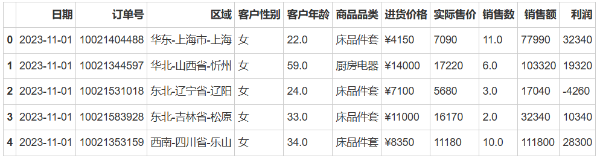

### 数据类型转化

```python
#数据类型
DP_table.dtypes
```

日期      datetime64[ns]

订单号              int64

区域              object

客户性别            object

客户年龄           float64

商品品类            object

进货价格            object

实际售价             int64

销售数            float64

销售额              int64

利润               int64

dtype: object

- datetime64[ns]包含日期和具体的时间（小时，分钟，秒，毫秒，微秒，纳秒）
- datetime64[D]仅包含日期信息，不包含具体的时间信息。

---

- **df.astype()**： astype()函数用于更改DataFrame中一列或多列的数据类型。
- **函数签名**：DataFrame.astype(dtype, copy=True, errors='raise', **kwargs)
- **参数解释**：
  - **dtype**: 字典或标量，指定列的数据类型。如果传递的是字典，则字典的键应为列名，值应为要转换的数据类型。如果传递的是标量，则会将该数据类型应用于所有列；
  - **copy**: 布尔值，默认为True，指定是否返回新对象。如果是False，则会在原地更改DataFrame；
  - **errors**:{'raise', 'ignore'}，默认为'raise'，指定如何处理无效的数据类型转换。如果设置为'raise'，则无效转换会引发异常。如果设置为'ignore'，则无效转换会被忽略；
  - ****kwargs**：其他关键字参数。

```python
#将时间类型数据转换日期型数据
DP_table['日期'] = DP_table['日期'].astype('datetime64[D]')
DP_table['日期'].dtype
```

> dtype('<M8[ns]')

```python
#转换为字符型数据
DP_table['订单号']= DP_table['订单号'].astype(str)
DP_table['订单号'].dtype
```

> dtype('O')

### 数据分列

> 数据分列是数据处理和分析中一个重要的步骤，它能够将复杂的数据进行拆解和整理，使之变得更为简洁、易读，并更方便进行后续的分析和操作。对于经管专业的学生或从事相关工作的人来说，掌握数据分列的技能是非常有价值的。

- **str.split()：** str.split可以在某一列上将数据进行分列。
- **函数签名**：DataFrame[column].str.split(pat, n=None, expand=False)
- **参数解释**：
  - pat：字符串，分隔符，默认是空格；
  - n：整数，可选参数，指定最大的分割次数；
  - expand：布尔值，默认为False。如果为True，则返回DataFrame。如果为False，则返回Series，其中每个条目都是字符串列表。

```python
df_split=DP_table['区域'].str.split(pat='-',expand=True)#数据拆分

DP_table['区域']=df_split.iloc[:,0]
DP_table['省份']=df_split.iloc[:,1]
DP_table['城市']=df_split.iloc[:,2]

DP_table
```

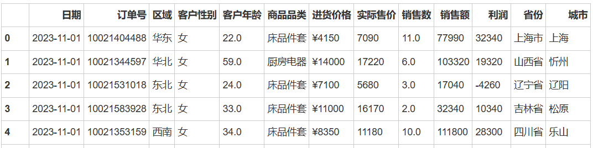

..........

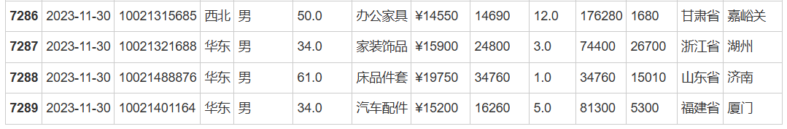

**7290 rows × 13 columns**

### 行列聚合

> 要做行列的操作，apply与lambda可以组合使用，可用于操作DataFrame中的数据，用于行列操作。
> 
> > **apply与lambda**： 
> > 
> > - **apply是pandas DataFrame和Series的一个方法**，它可以应用一个函数到DataFrame的行或列上。
> > - **lambda是Python中的一个关键字，用于定义匿名函数**。它常常与apply结合使用，以快速定义一些简单的操作。

- **apply函数签名**：
  - DataFrame.apply(func,axis=0,broadcast=False,raw=False,reduce=None,result_type=None,args=(),**kwds)
- **参数解释：**
  - func: 要应用的函数;
  - axis: {0 or 1}, 默认是0。0表示将函数应用到每一列，1表示将函数应用到每一行;
  - broadcast: 是否广播结果到原始形状，默认为 False;
  - raw: 是否将每一块作为 ndarray 对象传递给函数，默认为 False;
  - reduce: 是否尝试使用减少的方式,如：使用 numpy.sum来处理结果，默认为 None;
  - result_type: 结果的数据类型，默认为 None;
  - args: 传递给函数的额外位置参数;
  - **kwds: 传递给函数的额外关键字参数。

- **lambda语法**：lambda arguments: expression
- **参数解释：**
  - **arguments**：参数列表，用逗号分隔。这些参数可以是位置参数，也可以是默认参数。不过由于lambda是匿名函数，通常我们不会为其定义复杂的参数列表，大多数情况下只是接收一到两个参数;
  - **expression**：单个表达式，定义了lambda函数的行为。当函数被调用时，这个表达式会被求值，并返回结果，例如：lambda x: x ** 2。

```python
#行列聚合
df_group = DP_table.groupby(['区域'])
           .apply(lambda x: x['商品品类'].unique()).reset_index() 
df_group.rename(columns={0:'商品品类'},inplace=True)#重命名
df_group
```

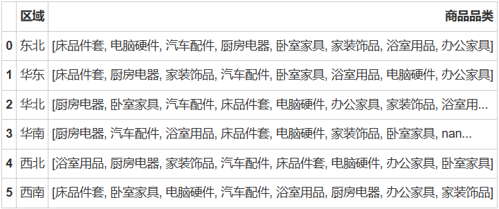

### 缺失值处理

> 针对数据分析学习者，缺失值处理是数据分析过程中不可避免的一个环节。需要我们掌握缺失值处理的基本方法和技巧，以确保数据的完整性和准确性，提高数据分析的质量和可靠性。通过合理处理缺失值，我们可以更全面地利用数据，获得更准确的分析结果和决策依据。它主要分为两个部分：

1. **识别缺失值：**在处理数据之前，我们首先需要确定数据中是否存在缺失值，这可以通过观察数据、使用统计指标或可视化工具等方法来实现。识别缺失值的重要性在于，它能够帮助我们了解数据的完整性和可靠性，为后续的处理和分析提供准确的基础。
2. **缺失值填充：**一旦识别出缺失值，下一步就是选择合适的方法对其进行填充。常见的填充方法包括文字填充和数字填充两种。文字填充通常用于类别型数据，我们可以为缺失值指定一个特定的字符串，例如“未知”或“缺失”。而数字填充则更常用于数值型数据，可以通过插值、均值、中位数等方式来估算缺失值。选择合适的填充方法需要考虑数据的特性和分析需求，以确保填充后的数据既能保持原始数据的特性，又能尽量减少对分析结果的影响。

```python
#导入数据
DP_table=pd.read_excel(r'/home/电商销售数据.xlsx',
                       sheet_name='销售数据_清洗')#导入数据处理这个sheet表

DP_table.head()
```

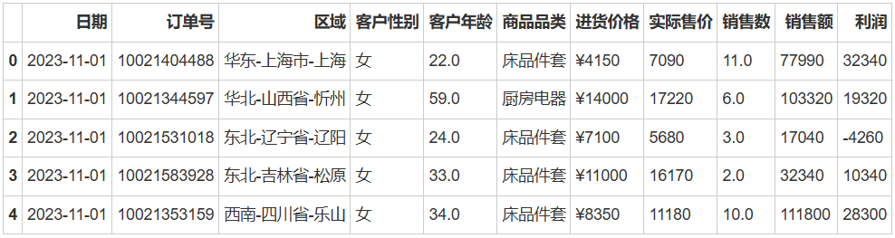

#### 识别缺失值

**df.isnull()：** 是pandas中DataFrame的一个方法，用于识别缺失值数据。

**df.isnull()** 方法将返回一个布尔型的DataFrame，其中True表示对应位置的元素是NaN，False表示对应位置的元素不是NaN，后面使用.sum()函数可统计缺失值的总数。

```python
#缺失值统计
DP_table.isnull().sum()
```

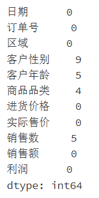

```python
DP_table.info()
```

#### 缺失值文字填充

- **df.fillna()**： fillna是pandas中DataFrame的一个方法，用于填充缺失值。
- **函数签名**：DataFrame.fillna(value=None, method=None, axis=None, inplace=False, limit=None, downcast=None, **kwargs)
- **参数解释：**
  - **value**：用于填充的值。可以是数字、字符串、字典或Series。如果是字典或Series，则按其对应的列或索引进行填充。如果不指定该参数，将使用默认值NaN；
  - **method**：填充方法。可选参数包括bfill使用下一个非缺失值进行填充和ffill使用前一个非缺失值进行填充；
  - **axis**：轴方向，用于确定填充方向。可以是‘index’（默认值）或‘columns’；
  - **inplace**：布尔值，是否在原地进行修改。如果为True，则直接修改原始DataFrame，不返回新的对象；
  - **limit**：如果指定了方法，这是向前或向后填充的最大连续 NaN 值的数量；
  - **downcast**：可能的数据类型向下转换，例如，float64转换为float32。这可以减少内存使用。默认为None，即不进行转换；

```python
#缺失值填充
DP_table=DP_table.fillna({'客户性别':'性别缺失','商品品类':'品类缺失'})

#筛选性别缺失的数据
DP_table_sex=DP_table[DP_table['客户性别']=='性别缺失']
DP_table_sex
```

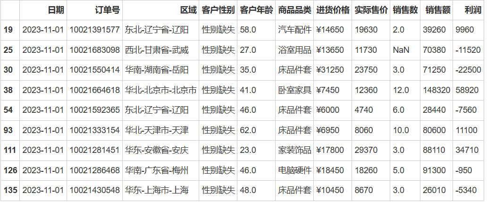

```python
#筛选品类缺失的数据
DP_table_cate=DP_table[DP_table['商品品类']=='品类缺失']
DP_table_cate
```

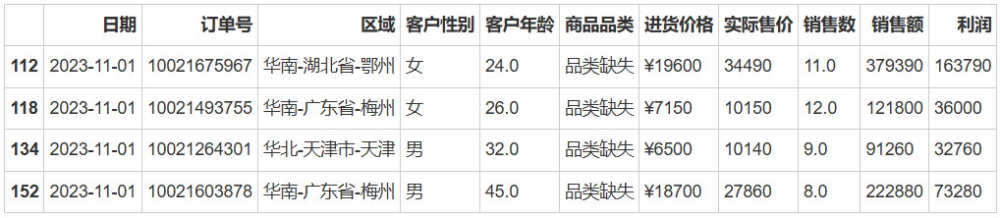

```python
#删除缺失值
DP_table.dropna(inplace=True) #how='all',全部为缺失值时才删除
DP_table.isnull().sum()
```

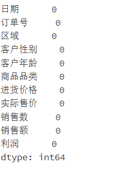

#### 缺失值数字填充

```python
#导入数据
DP_table=pd.read_excel(r'/home/电商销售数据.xlsx',
                       sheet_name='销售数据_清洗')#导入数据处理这个sheet表

DP_table#.head()

print('{}该列缺失值共计:   {}个'.format('客户年龄',DP_table['客户年龄'].isnull().sum()))
print('{}该列非缺失值共计: {}个'.format('客户年龄',DP_table[DP_table['客户年龄'].notnull()]['客户年龄'].count()))
print('---'*10)
print('{}该列缺失值共计:   {}个'.format('商品品类',DP_table['商品品类'].isnull().sum()))
print('{}该列非缺失值共计: {}个'.format('商品品类',DP_table[DP_table['商品品类'].notnull()]['商品品类'].count()))
```

> 客户年龄该列缺失值共计:   5个
> 
> 客户年龄该列非缺失值共计: 7285个
> 
> ---
> 
> 商品品类该列缺失值共计:   4个
> 
> 商品品类该列非缺失值共计: 7286个

```python
#查看客户年龄为空的是那几行
DP_table[DP_table['客户年龄'].isnull().values==True]
```

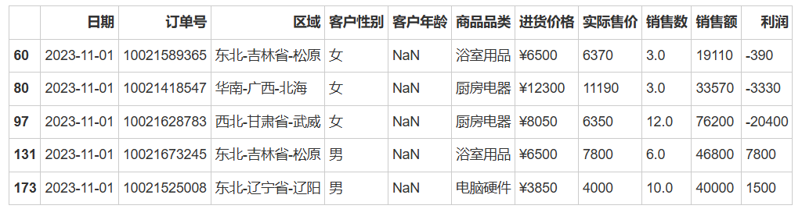

**使用平均值填充缺失值，DataFrame.fillna(value=df['cloumn'].mean())**

```python
#使用均值填充
DP_table['客户年龄'].mean()
#客户平均年龄：42.11649951916472

DP_age=DP_table[DP_table['客户年龄'].isnull().values==True]
DP_age=DP_age.fillna(DP_table['客户年龄'].mean())
DP_age
```

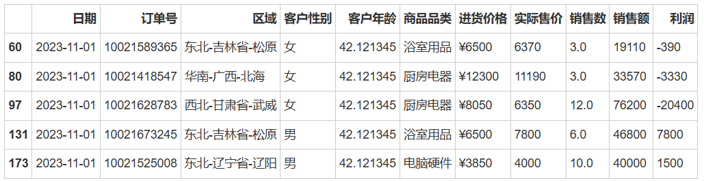

```python
#查看销售数为空的是那几行
DP_sale=DP_table[DP_table['销售数'].isnull().values==True]
DP_sale
```

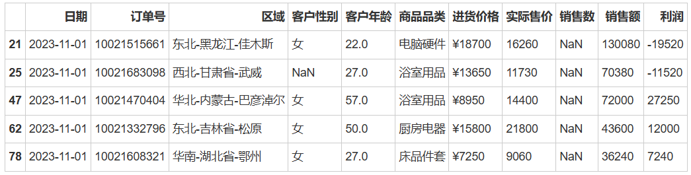

---

- **df.interpolate**： interpolate是pandas中DataFrame的一个方法，用于通过线性插值的方式填充缺失值。
- **函数签名**：DataFrame.interpolate(method='linear', axis=0, limit=None, inplace=False, limit_direction='forward', limit_area=None, downcast=None, **kwargs)
- **参数解释**：
  - method：插值方法，默认为linear。可选的方法包括linear,time,index,values,nearest,zero,slope,pchip,cubic, akima,barycentric等；
  - axis：进行插值的轴，可以是0或index（按行应用插值）或1或 columns（按列应用插值）；
  - limit：在沿着插值轴的方向上，最大连续 NaN 的数量，超过这个数量的 NaN 将不会被填充；
  - inplace：如果为True，则直接在原数据上进行修改，并返回None。否则返回新的DataFrame；
  - limit_direction：如果指定了limit，此参数确定填充的方向。如果为forward，则只从前向后填充。如果为 backward，则只从后向前填充。如果为both，则从两个方向填充；
  - limit_area：如果是一组二元元组，则只填充指定的列对。例如，如果设置为 [('A', 'B'), ('B', 'C')]，则只填充 (A, B) 和 (B, C) 的缺失值；
  - downcast：可能的向下转换的数据类型，例如从float64到float32。默认为None，表示不进行转换。

```python
#按照线性差值来填充数据
DP_table['销售数'].interpolate(method='linear',inplace=True)

#按照缺失值得行索引筛选数据
selected_data = DP_table.loc[DP_sale[DP_sale.isnull().any(axis=1)].index,]
selected_data
```

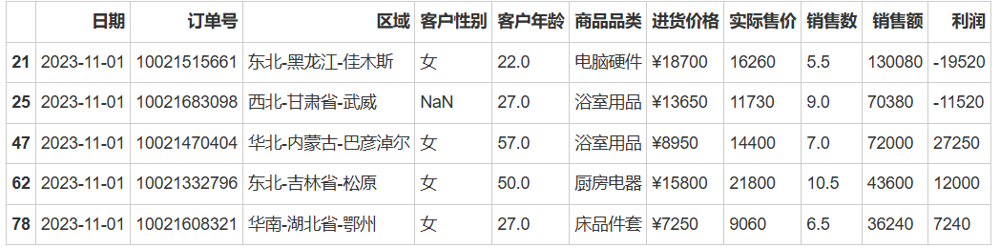

### 重复值处理

> 重复值处理在数据分析中也是一个重要的环节，通过掌握重复值处理的这两个部分，数据分析的学习者能够提升数据质量，增强数据分析的可信度，并且为后续的数据建模和决策分析提供坚实的基础。它主要涉及两个部分。

1. **识别重复值**。在处理数据时，学习者需要通过相应的技术方法来检测出数据集中的重复观测或记录。这可以通过比较数据行之间的相似性或者依据特定列的值进行判别。识别重复值的目的在于确保数据的准确性和可靠性，同时减少冗余信息对分析结果的干扰。
2. **重复值处理**。一旦重复值被识别出来，数据分析学习者需要根据具体情况决定如何处理这些重复值。常见的处理方法包括删除重复值、保留唯一值，或者根据某种规则合并重复值等。选择适当的处理方法要考虑分析目的、数据量以及重复值对结果的影响等因素，以确保处理后的数据更加规范、简洁，并且保持分析的准确性和有效性。

#### 查看重复值

```python
# 查找整个DataFrame中的重复行
duplicates_in_df = DP_table[DP_table.duplicated()]  
duplicates_in_df
```

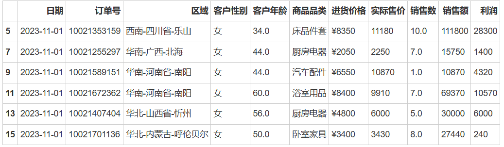

#### 重复值处理

**df.drop_duplicates()**： drop_duplicates是DataFrame的一个方法，用于删除DataFrame中的重复行。

- **函数签名：**DataFrame.drop_duplicates(subset=None, keep='first', inplace=False, ignore_index=False)
- **参数解释：**
  - subset：用于识别重复项的列的名称。默认情况下，使用所有列。如果指定了多列，则考虑这些列的组合。可以传入列名的字符串或者字符串列表；
  - keep：指定要保留的重复项。可以是first（保留第一次出现的重复项，删除其余重复项）、last（保留最后一次出现的重复项，删除其余重复项）或False（删除所有重复项）。默认为first；
  - inplace：如果为True，则直接在原数据上进行修改，并返回None。否则返回新的DataFrame，不修改原数据；
  - ignore_index：如果为 True，则重置 DataFrame 的索引。默认为 False。

```python
# 删除整个DataFrame中的重复行，保留第一个出现的行
df_no_duplicates = DP_table.drop_duplicates()  
df_no_duplicates
```

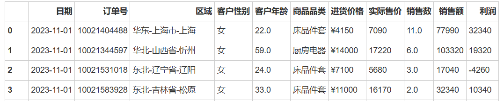

.......................................

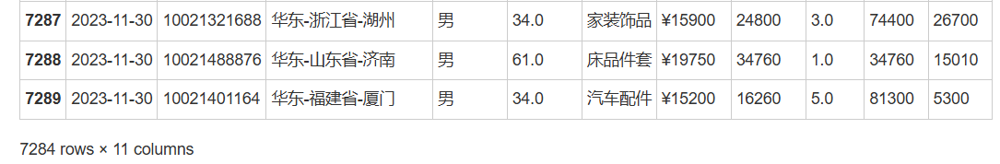

### 数据筛选

> pandas数据筛选是数据分析过程中常用且重要的技术之一。在pandas中，数据筛选可以通过多种方法来实现，比如布尔索引、isin方法、loc与iloc方法等。掌握这些方法，经管专业的学习者能够更加灵活高效地进行数据筛选，提取出符合特定条件的数据，以支持更准确的数据分析和决策。

```python
#导入数据
DP_table=pd.read_excel(r'/home/电商销售数据.xlsx',
                       sheet_name='销售数据_清洗',#导入数据处理这个sheet表
                       dtype={'日期':'datetime64[D]'})

DP_table.head()
```

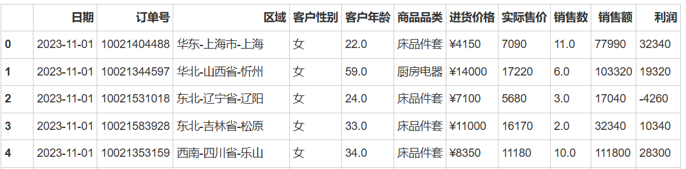

#### 布尔索引

> 布尔索引通常是通过一个或多个条件表达式生成一个布尔值数组，然后将这个数组用作索引来选择满足条件的行，比如使用`df[条件表达式]`的形式来筛选数据，同时也可以使用多个条件通过 &（逻辑与）和 |（逻辑或）操作符多条件筛选。

```sql
DP_table[(DP_table['客户性别']=='女') & (DP_table['客户年龄']>61)][['区域','商品品类','销售数','销售额','利润']]
```

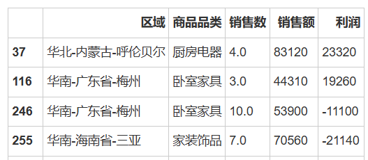

.... 

104 rows × 5 columns

#### isin()方法

当需要筛选特定列中包含某些特定值的行时，可以使用isin()方法。

- **isin()：**是pandas中Series和DataFrame的一个方法，返回一个与调用者相同大小的布尔类型（bool）的Series或 DataFrame，表示每个元素是否存在于给定的values中。
- **函数签名**：
  - Series.isin(values)
  - DataFrame.isin(values)
- **参数解释**：
  - values：用于检查是否存在的值或值的列表、序列、集合或数据框。

```python
DP_table[DP_table['商品品类'].isin(['床品件套', '家装饰品'])]
```

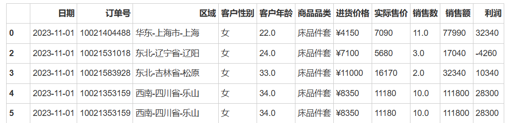

..... 2337 rows × 11 columns

#### loc和iloc方法

**loc使用标签进行索引从而筛选数据，而iloc使用整数位置进行索引从而筛选数据**。

- loc：它基于标签进行索引。
  - 语法格式为 `df.loc[row_indexer,column_indexer] `
  - row_indexer为行索
  - column_indexer为列索引。

- iloc：它基于整数位置进行索引。
  - 语法格式为` df.iloc[row_position,column_position] `
  - row_position为行位置
  - column_position为列位置。

```python
#按照索引标签选择
DP_table.loc[[0,2,4,6,8,10]][['区域','商品品类','销售数','销售额','利润']]
```

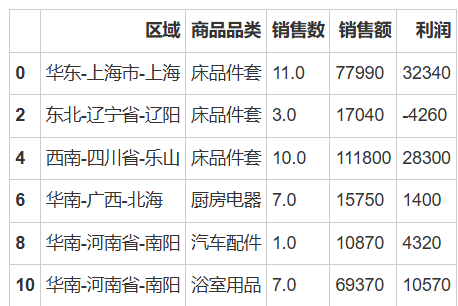

```python
#选择特定列
DP_table.iloc[:,[0,2,4]]
```

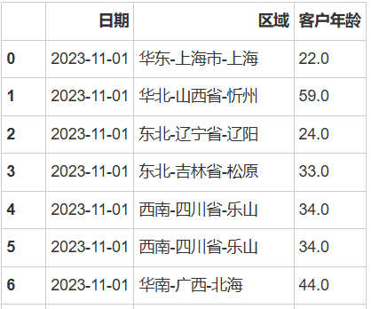

.....

```python
#选择连续列
DP_table.iloc[:,0:4]
```

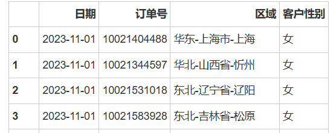

....

```python
#选择特定行
DP_table.iloc[[0,2,4,6],]
```

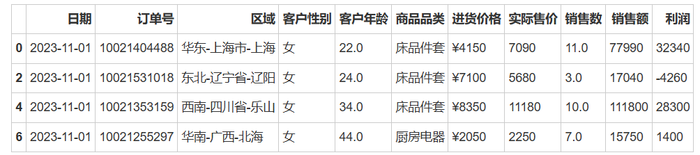

```python
#选择连续行
DP_table.iloc[0:7,]
```

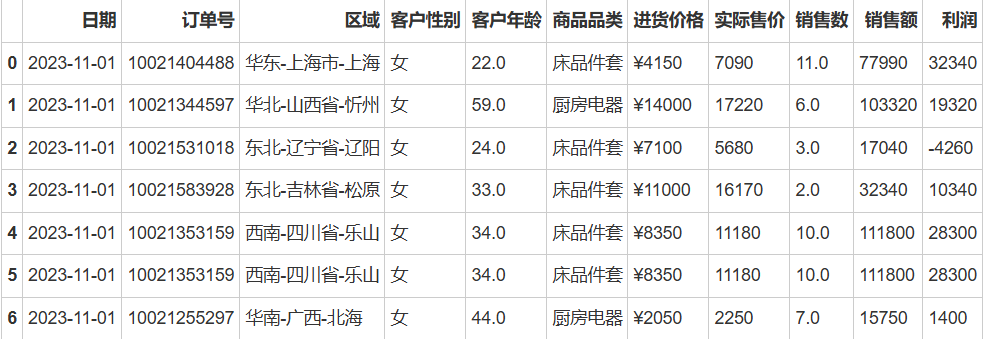

#### query()方法：

> 使用query方法基于一个或多个条件来筛选数据，query是pandas库中DataFrame对象的一个方法，用于通过条件表达式对数据进行筛选。
> 
> **语法格式**：df.query(expr) ，其中，expr是一个字符串，表示要应用于DataFrame的条件表达式。表达式的形式为'A > 2 '或者'A > 2 & B < 40' 。

```python
DP_table.query('利润 > 300000')
```

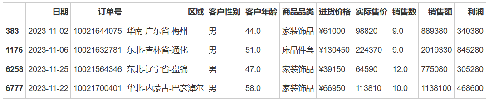

#### between()方法

> **between**是Series对象的一个方法，它用于筛选处于两个值之间的数据。
> 
> 语法： Series.between(left, right, inclusive=True)
> 
> - left：左边界
> - right：右边界
> - inclusive：是否包含边界值，默认为 True，表示包含。

```python
DP_table[DP_table['日期'].between('2023-11-11', '2023-11-13')]
```

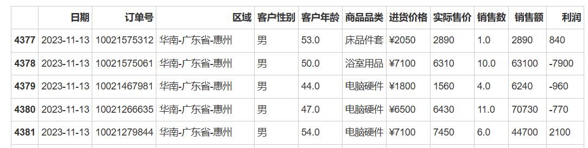

......

#### 使用特定字符串方法

> pandas提供了许多字符串数据筛选的方法，如str.contains(), str.startswith(), str.endswith()，这些方法为pandas中Series对象的方法，都返回布尔类型的Series，表示每个字符串是否满足相应的条件，包含指定模式、以指定字符串开头或以指定字符串结尾。在字符串处理和分析中非常有用，可根据具体需求使用适当的参数进行匹配和筛选。

`str.contains(pat, case=True, flags=0, na=np.nan, regex=True)`

- **pat**: 要检查的子字符串或正则表达式。可以是字符串、正则表达式对象或列表/集合中的多个模式。
- **case**: 布尔值，指定是否区分大小写。默认为True，表示区分大小写。如果设置为False，则不区分大小写。
- **flags**: 用于正则表达式的标志，例如re模块中的标志。默认为0。
- **na**: 填充缺失值的值。默认为np.nan。当Series中存在缺失值时，可以使用该参数指定在结果中填充的值。
- **regex**: 布尔值，指定是否将pat解释为正则表达式。默认为True，表示将pat作为正则表达式进行匹配。如果设置为False，则将pat解释为字面字符串。

`str.startswith(pat, na=np.nan)`

- **pat**: 要检查开头是否匹配的子字符串。可以是字符串或列表/集合中的多个字符串。
- **na**: 填充缺失值的值。默认为np.nan。当Series中存在缺失值时，可以使用该参数指定在结果中填充的值。

`str.endswith(pat, na=np.nan)`

- **pat**: 要检查结尾是否匹配的子字符串。可以是字符串或列表/集合中的多个字符串。
- **na:** 填充缺失值的值。默认为np.nan。当Series中存在缺失值时，可以使用该参数指定在结果中填充的值。

```python
DP_table[DP_table['区域'].str.contains('甘肃省')]
```

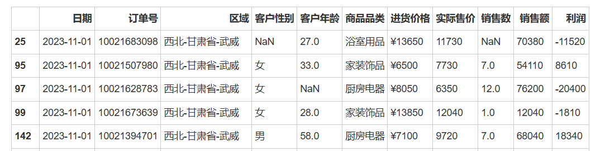

......

```python
DP_table[DP_table['区域'].str.startswith('西北')]
```

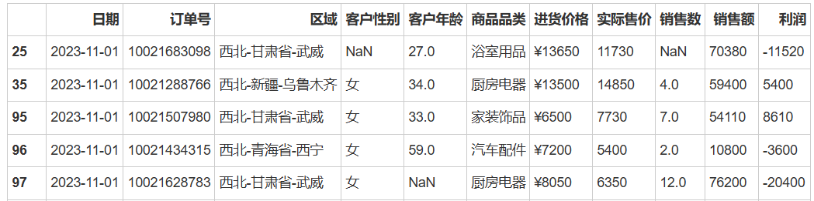

```python
DP_table[DP_table['区域'].str.contains('兰州')]
```

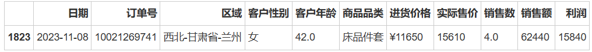

## 数值操作

> Pandas数值操作涵盖了日常数据分析中经常需要用到的操作技巧。其中，数值替换允许在不改变原始数据的情况下，快速地替换特定数值或根据条件替换数值，这在数据预处理中尤为常用。而数值排序则能按照特定列或自定义的排序规则对数据进行排序，以发现数据中的规律和趋势。此外，表格的纵向拼接和横向拼接也是非常重要的操作技能，纵向拼接能将多个数据集按行堆叠，而横向拼接则能将多个数据集按列拼接，这为整合和分析来自不同来源的数据提供了方便。

### 数值替换

> 数值替换是Pandas数值操作中的重要操作之一。在数据处理和分析的过程中，常常会遇到需要替换特定数值的情况。数值替换能够帮助学习者处理数据中的异常值、错误值或者不符合分析需求的数值，使数据更符合预期和分析的要求。

```python
import pandas as pd
DP_table=pd.read_excel(r'/home/电商销售数据.xlsx',
                       sheet_name='销售数据')#导入数据处理这个sheet表

DP_table.head()
```

#### 字符替换

- **str.replace()：** str.replace是pandas中的Series对象的一个方法，用于替换字符串中的指定模式。
- **语法**：Series.str.replace(pat, repl, n=-1, case=True, flags=0)
- **参数解释**：
  - **pat**：要被替换的模式，可以是字符串或正则表达式。
  - **repl**：用于替换模式的字符串。也可以是一个函数或字典，用于更复杂的替换逻辑。
  - **n**：可选参数，指定每个字符串中最多进行多少次替换。默认为-1，表示进行所有可能的替换。
  - **case**：布尔值，指定是否区分大小写。默认为True，表示区分大小写。
  - **flags**：用于正则表达式的可选标志，例如re模块中的标志。默认为0。

```python
DP_table['进货价格']=DP_table['进货价格'].str.replace('¥','').astype('float')
DP_table
```

### 数值排序

> 数值排序是Pandas数值操作中的重要内容之一。在经济、金融等经管领域中，经常需要对数据进行排序操作，以便更好地观察和分析数据之间的规律和关联。Pandas提供了强大的数值排序功能，可以满足经管学习者在数据分析过程中的多样化需求。

- **sort_values()**： sort_values用于对数据进行排序，默认是升序排列。
- **函数签名**：DataFrame.sort_values(by, axis=0, ascending=True, inplace=False, kind='quicksort', na_position='last', ignore_index=False, key=None)
- **参数解释**：
  - **by**：字符串或列表，指定要排序的列名。如果要按多列排序，可以传入列名的列表。默认值是None，表示按所有列进行排序。
  - **axis**：排序的轴，可以是0或1。0或index表示按行排序（默认），1或columns表示按列排序。
  - **ascending**：布尔值或列表，默认为True。如果为True，则按升序排序；如果为False，则按降序排序。也可以传入一个布尔列表，用于指定多列的排序顺序。
  - **inplace**：布尔值，默认为False。如果为True，则直接在原数据上进行排序并修改原数据，不返回新的DataFrame。如果为False，则返回新的排序后的DataFrame，原数据不变。
  - **kind**：排序算法的类型，可以是quicksort（快速排序，默认）,mergesort（归并排序）或heapsort（堆排序）。
  - **na_position**：字符串，默认为last。表示缺失值在排序后的位置，可以是first或last，表示放在最前或最后。
  - **ignore_index**：布尔值，默认为False。如果为True，则重置索引以反映新的排序结果。
  - **key**：可选参数，是一个函数，用于在从每行中提取比较键时使用。

#### 降序排列

```python
#降序排列(单列)
DP_table['利润'].sort_values(ascending=False).head(10)
```

> 1170    845280
> 
> 6771    468600
> 
> 377     340380
> 
> 6252    305280
> 
> 4420    284520
> 
> 224     263780
> 
> 3121    253260
> 
> 246     251100
> 
> 262     249000
> 
> 6023    245980
> 
> Name: 利润, dtype: int64

```python
#降序排列（整表）
DP_table.sort_values(by='利润',ascending=False).head(10)
```

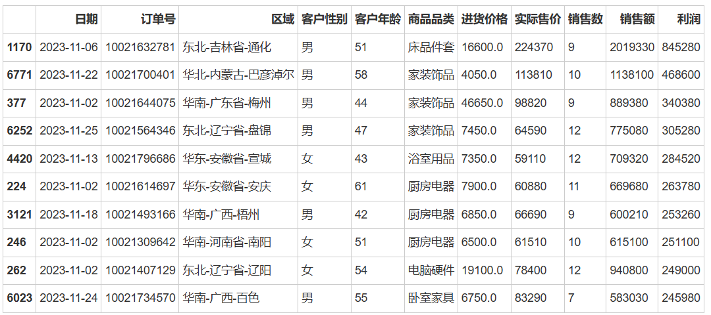

#### 自定义排序

```python
#自定义排序
DP_table.sort_values(by=['商品品类','利润'],ascending=[False,True]).head(10) #False降序，True升序
```

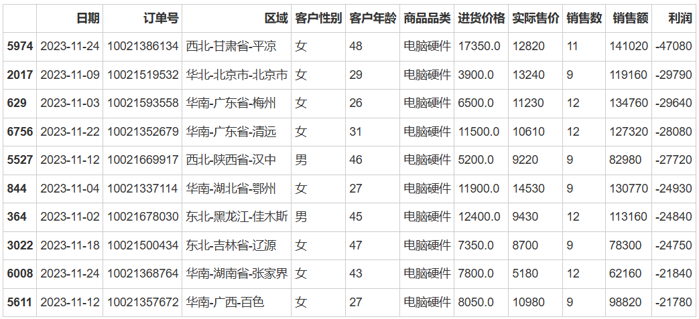

```python
#秩排序
DP_table['利润'].rank(method='first').head(10)
```

> 0    5813.0
> 
> 1    4902.0
> 
> 2    1032.0
> 
> 3    3935.0
> 
> 4    5576.0
> 
> 5    2167.0
> 
> 6    2891.0
> 
> 7    3965.0
> 
> 8    3220.0
> 
> 9    1908.0
> 
> Name: 利润, dtype: float64

### 表格纵向拼接

> 当需要进行表格的纵向拼接时，可以使用append和concat两种方法。这两种方法都是Pandas提供的用于在垂直方向上连接表格的功能，但在使用方式和具体细节上存在一些差异。

1. **append() 函数**。append()函数用于将一行或多行数据追加到一个DataFrame的末尾。它允许学习者将新的数据行添加到原始表格的下方，实现表格的纵向扩展。通过指定相应的参数，学习者还可以灵活设置是否保留索引、是否忽略索引等选项，以满足不同的拼接需求。
2. **concat() 函数**。concat()函数相比于append()函数更为强大和灵活，它可以拼接多个DataFrame，不仅可以在垂直方向进行拼接，也可以在水平方向进行拼接。在表格的纵向拼接中，学习者可以将多个表格作为参数传递给concat()函数，通过设置axis参数为0，实现在垂直方向上的拼接操作。

- **append**： append用于在列表末尾添加新的元素，在Pandas中，append方法也被用于在DataFrame末尾添加新的行。
- **函数签名**：DataFrame.append(new_data, ignore_index=False, verify_integrity=False, sort=None)
- **参数解释**：
  - new_data：需要添加的数据，可以是新的DataFrame，Series，字典，或者列表。
  - ignore_index：布尔值，默认为False。如果为True，则重置索引。
  - verify_integrity：布尔值，默认为False。如果为True，当新数据与原有数据有重复索引时会抛出ValueError。
  - sort：布尔值，默认为None。该参数将在未来版本中被移除，目前建议不使用。

#### append用法

```python
append0=pd.DataFrame([[11,12],[13,14]],columns=['二班','一班'],index=['优','良'])
append0
```

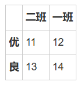

```python
append1=pd.DataFrame([[15,16]],columns=['二班','三班'],index=['差'])
append1
```

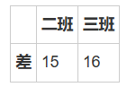

```python
#append函数拼接，排序
append0.append(append1,
               sort=True,
               ignore_index=False) #ignore_index=True去除索引
```

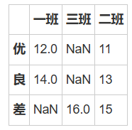

#### concat用法

- **concat**： concat是Pandas库中的一个函数，用于沿一条轴将多个对象堆叠到一起。
- **函数签名：**pandas.concat(objs, axis=0, join='outer', ignore_index=False, keys=None, levels=None, names=None, verify_integrity=False, sort=False)
- **参数解释**：
  - objs：一个或多个DataFrame或Series对象的序列或映射。如果传递了映射（例如字典），则排序的键将用作键参数，除非传递了键参数；
  - axis：要连接的轴。 0或'index'表示按行连接（默认），1或'columns'表示按列连接；
  - join：如何处理其他轴上的索引。 'outer'表示采用并集（默认），'inner'表示采用交集；
  - ignore_index：布尔值，默认为False。如果为True，则重置并忽略连接轴上的索引；
  - keys：序列，默认为None。使用传递的键作为最外层构建分层索引。如果传递了多个级别的序列，则应包含元组；
  - levels：序列列表，默认为None。用于构建MultiIndex的特定级别（唯一值）。否则它们将从键参数推断出来；
  - names：由此产生的分层索引的名称列表；
  - verify_integrity：布尔值，默认为False。检查新的串联轴是否包含重复项。这对于实际的大型数据集可能代价高昂；
  - sort：布尔值，默认为False。不要对结果进行排序。如果为True，将按照出现在连接轴上的顺序对结果进行排序。这会在大多数情况下导致性能下降，具体取决于数据的性质。

```python
#构造数据集concat0
concat0 = pd.DataFrame({'用户ID':[1001,1002,1003,1004,1005,1006],
                    '日期':pd.date_range('20231101',periods=6),
                    '城市':['北京', '上海', '广州', '上海', '杭州', '北京'],
                    '年龄':[23,44,54,32,34,32],
                    '性别':['F','M','M','F','F','F'],
                    '成交量':[3200,1356,2133,6733,2980,3452]},
                     columns =['用户ID','日期','城市','年龄','性别','成交量'])
concat0
```

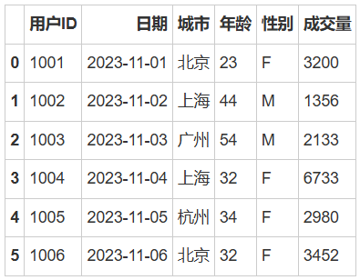

```python
#构造数据集concat1
concat1 = pd.DataFrame({'用户ID':[1007,1008,1009],
                    '日期':pd.date_range('20231107',periods=3),
                    '城市':['北京', '上海', '广州'],
                    '年龄':[33,34,34,],
                    '成交量':[4200,3356,2633]},
                    columns =['用户ID','日期','城市','年龄','成交量'])
concat1
```

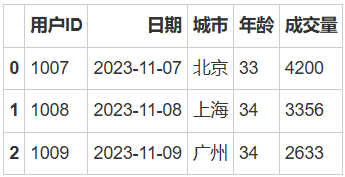

```python
数据集的纵向合并
concat_out = pd.concat([concat0,concat1],# 指定需要合并的对象
                keys=['concat0','concat1'],# 为合并后的数据添加新索引，用于区分各个数据部分
                sort=True, #按照列名排序
                ignore_index=True #对index进行重新排序
                )
concat_out
```

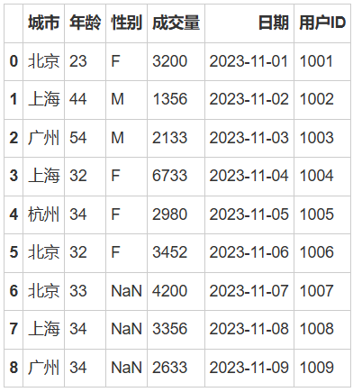

### 表格横向拼接

> - **merge函数**是Pandas库中的一个强大工具，用于在表格之间进行横向拼接操作。通过merge函数，可以将两个或多个具有共同列的表格按照指定的列进行合并，形成更广泛、更全面的数据集。比如可以合并不同来源的数据、添加额外的特征等。
> - 在使用merge函数进行表格横向拼接时，需要指定用于合并的共同列，并确定合并的方式（如内连接、左连接、右连接或全连接）。这样，merge函数将根据指定的列和连接方式进行表格的拼接操作，返回一个新的DataFrame对象，其中包含了合并后的数据。

- **merge：** merge用于通过一个或多个键将两个DataFrame的行连接起来。
- **函数签名：**
  - pandas.merge(left,right,how='inner',on=None,left_on=None,right_on=None,left_index=False,right_index=False, sort=True,suffixes=('_x', '_y'),copy=True,indicator=False,validate=None)
- **参数解释：**
  - left：参与合并的左侧DataFrame；
  - right：参与合并的右侧DataFrame；
  - how：合并类型，可以是以下之一：
    - left：左连接，使用右侧DataFrame中的匹配键，只保留左侧DataFrame中的所有行；
    - right：右连接，使用左侧DataFrame中的匹配键，只保留右侧DataFrame中的所有行；
    - outer：全连接，保留两个DataFrame中的所有行，不匹配的部分填充NaN；
    - inner：内连接（默认），只保留两个DataFrame中存在匹配键的行；
  - on：用于连接的列名，必须同时存在于两个DataFrame中。如果未指定，并且left_index和right_index为False，则必须通过left_on和right_on指定；
  - left_on：左侧DataFrame中用作连接键的列名。如果未指定，并且on和left_index为False，则将通过推断进行连接；
  - right_on：右侧DataFrame中用作连接键的列名。如果未指定，并且on和right_index为False，则将通过推断进行连接；
  - left_index：布尔值，默认为False。如果为True，则使用左侧DataFrame的索引作为连接键；
  - right_index：布尔值，默认为False。如果为True，则使用右侧DataFrame的索引作为连接键；
  - sort：布尔值，默认为True。如果为False，则不排序合并结果；
  - suffixes：用于重叠列的后缀元组。默认为('_x', '_y')；
  - copy：布尔值，默认为True。总是复制数据，即使不必要也要这样做。如果设置为False，并且数据不需要复制，则可以避免复制数据以提高性能。但不能保证总是这样；
  - indicator：布尔值或字符串，默认为False。如果为True，将添加一个名为"_merge"的列到结果集中，其中包含每个观测值的来源信息（只适用于合并类型为"outer"或"indicator"的情况）。如果为字符串，则使用该字符串作为列名；
  - validate：如果指定，检查合并是否为指定的类型。可以是以下字符串之一：
    - one_to_one：每个键只出现在左侧和右侧DataFrame中一次；
    - one_to_many：每个键在左侧DataFrame中最多出现一次，在右侧DataFrame中可以出现多次；
    - many_to_one：每个键在右侧DataFrame中最多出现一次，在左侧DataFrame中可以出现多次；
    - many_to_many：不做任何检查。

```python
#构造数据集merge0
merge0 = pd.DataFrame({'用户ID':[1001,1002,1003,1004,1005,1006],
                    '日期':pd.date_range('20231101',periods=6),
                    '城市':['北京', '上海', '广州', '上海', '杭州', '北京'],
                    '年龄':[23,44,54,32,34,32],
                    '性别':['F','M','M','F','F','F'],
                    '成交量':[3200,1356,2133,6733,2980,3452]},
                     columns =['用户ID','日期','城市','年龄','性别','成交量'])
merge0
```

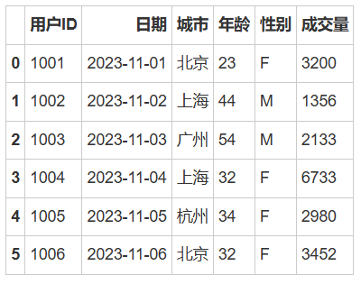

```python
#构造构造列名不同的merge1
merge1 = pd.DataFrame({"id":[1001,1002,1003,1004,1005,1006,1007,1008,1009,1010],
                    "平台":['京东','淘宝','京东','天猫','唯品会','苏宁','天猫','淘宝','美团','拼多多'],
                    "收入额":[100000,320000,240000,445000,340000,640000,300000,460000,540000,230000]},
                    columns =['id','平台','收入额'])
merge1
```

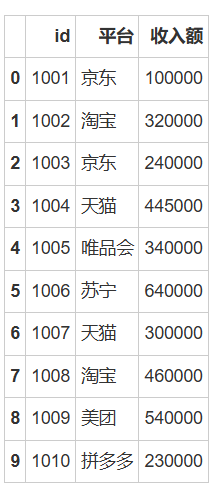

```python
# 将merge0和merge1连接起来
merge_table = pd.merge(left=merge0,right=merge1,how='left',left_on='用户ID',right_on='id')
merge_table
```

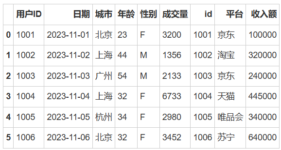

```python

#构造列名相同的merge2
merge2 = pd.DataFrame({"用户ID":[1001,1002,1003,1004,1005,1006,1007,1008,1009,1010],
                    "平台":['京东','淘宝','京东','天猫','唯品会','苏宁','天猫','淘宝','美团','拼多多'],
                    "收入额":[100000,320000,240000,445000,340000,640000,300000,460000,540000,230000],
                    '日期':pd.date_range('20231101',periods=10)},
                    columns =['用户ID','平台','收入额','日期'])
merge2
```

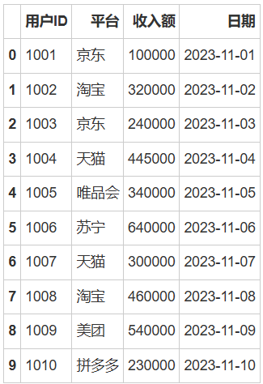

```python
# 指定用户ID连接
merge_table0 = pd.merge(left=merge0,right=merge2,how='left',on='用户ID',suffixes=["","1"])
merge_table0
```

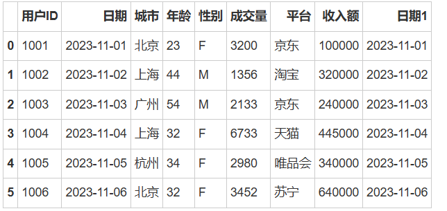

### 创建日期表

> 以表格间的拼接操作为例，我们可以借助日期表进行举例。在经管分析中，日期表是经常使用的数据类型之一。当我们需要合并多个日期表时，Pandas提供了便捷的表格拼接功能。通过拼接操作，可以将不同日期表按照指定的列进行合并，形成一个更完整的数据集。比如在电商数据分析中，我们可以将不同商品品类的销售数据按照日期进行拼接，以得到更全面的信息。

- **pd.date_range()**： 用于生成一个固定频率的日期索引，类似于日期序列，这对于时间序列数据的生成和处理非常有用，该函数将返回一个DatetimeIndex对象，它是一个具有指定频率的日期序列。
- **函数签名：**pandas.date_range(start=None, end=None, periods=None, freq='D', tz=None, normalize=False, name=None, closed=None, **kwargs)
- **参数解释**：
  - start: 字符串或日期时间，序列的开始日期；
  - end: 字符串或日期时间，序列的结束日期；
  - periods: 整数，序列中的日期数；
  - freq: 字符串或偏移量别名，生成的间隔频率。例如，'D' 表示日，'M' 表示月，'H' 表示小时等。也可以使用偏移量别名，如 '2H' 表示两小时；
  - tz: 字符串或时区对象，可选的时区；
  - normalize: 布尔值，默认为 False。如果为 True，则将开始和结束日期规范化为午夜；
  - name: 结果索引的名称；
  - closed: 可以是 'left' 或 'right'，表示区间是左闭右开还是右闭左开。

```python
import numpy as np 
import pandas as pd
df=pd.DataFrame(np.random.randn(5,2),
                columns=['A','B'],
                index=pd.date_range('20231101',periods=5))
df
```

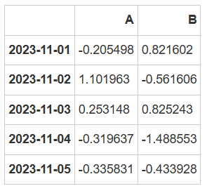

```bash
#Jupyter notebook打印多个变量结果
from IPython.core.interactiveshell import InteractiveShell
InteractiveShell.ast_node_interactivity='all'

#提取年
df['year']=df.index.year
df['year']

#提取月
df['month']=df.index.month
df['month']

#提取日
df['day']=df.index.day
df['day']

df['年月']=df.index.strftime("%Y年%m月")
df['年月']
```

> 2023-11-01    2023
> 
> 2023-11-02    2023
> 
> 2023-11-03    2023
> 
> 2023-11-04    2023
> 
> 2023-11-05    2023
> 
> Freq: D, Name: year, dtype: int64
> 
> 2023-11-01    11
> 
> 2023-11-02    11
> 
> 2023-11-03    11
> 
> 2023-11-04    11
> 
> 2023-11-05    11
> 
> Freq: D, Name: month, dtype: int64
> 
> 2023-11-01    1
> 
> 2023-11-02    2
> 
> 2023-11-03    3
> 
> 2023-11-04    4
> 
> 2023-11-05    5
> 
> Freq: D, Name: day, dtype: int64
> 
> 2023-11-01    2023年11月
> 
> 2023-11-02    2023年11月
> 
> 2023-11-03    2023年11月
> 
> 2023-11-04    2023年11月
> 
> 2023-11-05    2023年11月
> 
> Freq: D, Name: 年月, dtype: object

```bash
pd.concat([df['year'],df['month'],df['day'],df['年月']],# 指定需要合并的对象
          ignore_index=True, #对index进行重新排序
          axis=1# 横向合并对象
         )
```

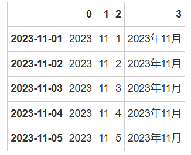

## 数值计算

> **Pandas数值计算包括统计分析、数据分组和数据透视等重要功能**。掌握这些功能，能够更好地处理和分析大量的数据，提取有价值的信息，为决策制定和学术研究提供准确的数据支持。

1. **统计分析**是Pandas数值计算的核心内容之一。通过Pandas提供的统计函数和方法，可以轻松地对数据进行描述性统计分析，如计算均值、标准差、最大值、最小值等指标，以揭示数据的中心趋势、离散程度和分布特点。
2. **数据分组**是Pandas数值计算中的另一重要功能。在实际分析中，经常需要将数据按照某个变量进行分组，以便更好地比较不同组之间的差异和特点。Pandas提供了灵活的数据分组功能，可以使用groupby方法将数据按照指定的列进行分组，并对每个组进行聚合计算，如求和、计数、均值等。可以更细致地洞察数据的内在结构和规律。
3. **数据透视**是Pandas数值计算中的高级功能之一。数据透视表是一种用于数据汇总和分析的表格形式，可以直观地展示数据之间的关系和汇总结果。Pandas的数据透视功能通过pivot_table方法实现，可以根据需要指定行索引、列索引、数值列和聚合函数等参数，生成定制化的数据透视表。这对于复杂的数据分析任务非常有用，可以更全面地理解数据的内涵和关系。

### 统计分析

> 描述统计是通过统计方法对数据资料进行整理、分析和描述，以揭示数据的分布特征、数字特性以及变量之间的关系。它是一种重要的统计分析方法，旨在提炼数据中的关键信息和规律。

描述统计中常用的指标包括以下几类：

1. **集中趋势指标**：用于反映数据的集中程度。主要的统计指标有：
  - **平均数**：所有数据之和除以数据个数，易于理解，但容易受到极端值的影响。
  - **中位数**：将数据由小到大排列后，位于中间位置的数。它不易受到极端值的影响。
  - **众数**：数据中出现次数最多的数。它反映了数据的集中趋势，尤其适合描述定类数据。

1. **离散程度指标：**用于反映数据之间的离散或差异程度。主要的统计指标有：

- **极差**：数据中最大值与最小值的差，简单明了但容易受到极端值影响。
- **方差与标准差**：描述数据与其平均数之间的离散程度。方差是每个数据与平均数差的平方的平均数，而标准差是方差的平方根。

1. **偏态与峰态指标**：用于描述数据分布的形状。

- **偏态**：衡量数据分布的不对称性。正偏态表示数据向左倾斜，负偏态表示数据向右倾斜。
- **峰态**：衡量数据分布的尖峰或扁平程度。峰态大于3表示分布尖峰，小于3表示分布扁平。

这些描述统计指标可以帮助我们更好地理解和分析数据的基本特征和分布规律。

#### 描述统计

> Pandas描述统计方法可以帮助我们计算各种统计指标，如均值、中位数、标准差等，这些指标能够描述数据的中心趋势、分散程度、分布形态等特征。除了这些基本的统计指标，Pandas还提供了一些更为高级的描述统计方法，如分位数、众数等，这些方法能够进一步帮助我们了解数据的分布情况和特征。

> 比如，在电商领域，通过分析电商利润的收益率、波动率等统计指标，可以评估电商市场的风险和投资机会；在市场营销领域，通过描述统计方法可以了解消费者的购买行为和偏好，为市场策略制定提供依据。

Pandas提供的描述统计方法对于数据分析和决策制定来说是一大利器，能更好地理解和总结数据，进而做出更明智的决策，以下是Pandas描述统计的常用方法。

- **describe()**：生成描述性统计的汇总表，包括计数、平均值、标准差、最小值、最大值等。默认情况下，它只适用于数值型列。可以通过传递参数来包括其他统计信息和非数值型列。
- **count()**：计算每列中非空值的数量；
- **value_counts()**：用于统计分类数据中各个唯一值的频数；
- **sum()**：计算每列的和；
- **max()**：计算每列的最小值；
- **min()**：计算每列的最大值；
- **mean()**：计算每列的平均值；
- **mode()**：计算每列的众数；
- **var()**：计算每列的方差；
- **std()**：计算每列的标准差。

```python
import pandas as pd
DP_table=pd.read_excel(r'/home/电商销售数据.xlsx',
                       dtype={'订单号':str},
                       sheet_name='销售数据')#导入销售数据sheet表

df_split=DP_table['区域'].str.split(pat='-',expand=True)#数据拆分

DP_table['区域']=df_split.iloc[:,0]
DP_table['省份']=df_split.iloc[:,1]
DP_table['城市']=df_split.iloc[:,2]

DP_table.head()
```

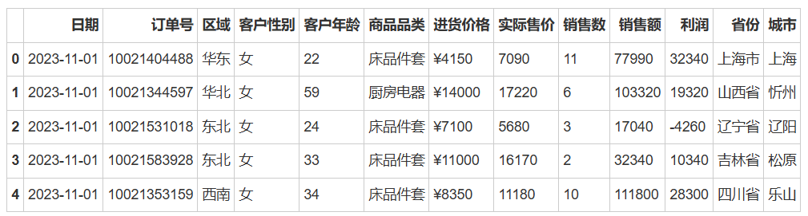

```python
#全表描述统计
DP_table.describe().round()
```

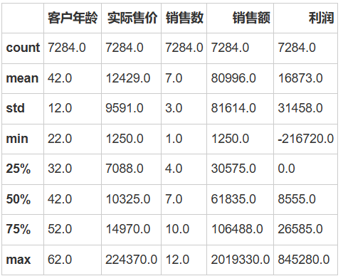

```python
#订单号计数
DP_table['订单号'].count()
```

> 7284

```python
#商品品类计数
DP_table['商品品类'].value_counts()
```

> 床品件套    1360
> 
> 汽车配件    1113
> 
> 浴室用品    1078
> 
> 家装饰品     978
> 
> 厨房电器     961
> 
> 卧室家具     840
> 
> 电脑硬件     781
> 
> 办公家具     173
> 
> Name: 商品品类, dtype: int64

```python
#销售数求和
DP_table['销售数'].sum()
```

> 47534

```python
#利润求最大值
DP_table['利润'].max()
```

> 845280

```python
#利润求最小值
DP_table['利润'].min()
```

> -216720

```python
#利润求平均值
DP_table['利润'].mean()
```

> 16873.46650192202

```python
#利润求分位数
print('下四分位数: {}'.format(DP_table['利润'].quantile(0.25)))
print('中位数:     {}'.format(DP_table['利润'].quantile(0.50)))
print('上四分位数: {}'.format(DP_table['利润'].quantile(0.75)))
```

> 下四分位数: 0.0
> 
> 中位数:     8555.0
> 
> 上四分位数: 26585.0

```python
#销售额求众数
DP_table['销售额'].mode()
```

> 0    65520
> 
> dtype: int64

```python
#销售额求方差
DP_table['销售额'].var()
```

> 6660917458.557836

```python
#销售额求标准差
DP_table['销售额'].std()
```

> 81614.44393339843

#### 相关分析

> 相关分析是一种探索性的统计分析方法，用于研究两个或两个以上变量间是否存在相关性，并探讨其相关方向和程度，可帮助我们理解和预测变量之间的关系，相关系数的取值一般为-1到1，越接近于1，相关强度越强，越接近于-1，相关强度越弱。

- **df.corr()：** df.corr()是 Pandas DataFrame的一个方法，用于计算数据框中列之间的相关系数。
- **函数签名**：DataFrame.corr(method='pearson', min_periods=1)
- **参数解释**：
  - method：可选值为 {'pearson', 'kendall', 'spearman'}，表示计算相关系数的方法；
  - 'pearson'：皮尔逊相关系数，用于衡量两个变量之间的线性关系，取值范围为 -1 到 1；
  - 'kendall'：肯德尔等级相关系数，用于衡量两个有序分类变量之间的相关性；
  - 'spearman'：斯皮尔曼等级相关系数，用于衡量两个变量之间的单调关系，不受异常值影响；
  - min_periods：样本中至少需要有多少个非NA值。如果数据中没有足够的非NA值，则结果将为NA。

```python
#相关系数
DP_table.corr()
```

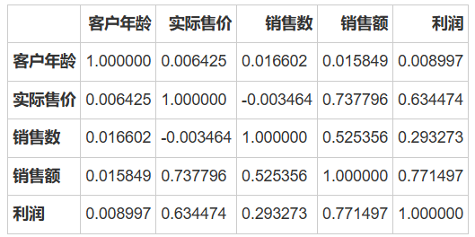

```python
#相关系数
DP_table['实际售价'].corr(DP_table['销售额'])
```

> 0.7377957833534723

### 数据分组

> 数据分组是数据处理和分析过程中常用且重要的技术。Pandas提供了多种方法来进行数据分组，其中包括pd.qcut()自动分组、pd.cut()手动分组，以及df.groupby()数据分析方法，这些方法可以满足不同的分组需求。

1. **当数据量较大且分布不均匀时，使用pd.qcut()自动分组是一种便捷的选择**。该方法可以根据数据的分布情况，将数据自动划分为若干个等频分组，使得每个组内的数据数量大致相等。可以省去手动分组的繁琐工作，同时能更好地观察数据的分布情况和规律。
2. **pd.cut()手动分组方法则允许根据自定义的分组条件来进行数据分组。**可以自行指定分组的边界和范围，将数据划分到指定的组中。这种分组方式更加灵活，可以根据分析目的和特定需求来进行个性化的分组操作，更准确地把握数据的特征和细节。
3. **df.groupby() 方法是Pandas中一种强大的数据分析工具，它可以在数据分组的基础上进行更复杂的分析和计算**。通过df.groupby()方法，可以对分组后的数据进行聚合运算、统计分析、数据转换等操作，进一步挖掘数据中的有价值信息。

#### 区间分组

- **pd.qcut()自动分组 **： pd.qcut()用于将连续型变量离散化为具有相等频率的区间/分箱，是基于分位数的切割方法。
- **函数签名**：pandas.qcut(x, q, labels=None, retbins=False, precision=3, duplicates='raise', include_lowest=False)
- **参数解释**：
  - x：一维数组或类似数组的对象，需要被分箱的数据。
  - q：整数或分位数列表，表示要切割成的分箱数量或指定的分位数。例如，q=5 表示将数据切割成5个等分箱；q=[0, 0.25, 0.5, 0.75, 1] 表示将数据按照指定的分位数进行切割。
  - labels：可选参数，用于指定每个分箱的标签。如果不提供，则使用整数标记。
  - retbins：布尔值，默认为 False。如果为 True，则返回分箱的边界。
  - precision：整数，默认为 3。表示分箱边界的小数位数。
  - duplicates：字符串，默认为 'raise'。如果设置为 'drop'，则删除重复的分箱边界。
  - include_lowest：布尔值，默认为 False。如果为 True，则最低边界将被包含在内。

```python
print('利润最小值: {}'.format(DP_table['利润'].min()))
print('利润平均值: {}'.format(DP_table['利润'].mean()))
print('利润最大值: {}'.format(DP_table['利润'].max()))

```

> 利润最小值: -216720
> 利润平均值: 16873.46650192202
> 利润最大值: 845280

```python
#自动分组
profit_qcut=pd.qcut(DP_table['利润'],100)
DP_table['qcut分组']=profit_qcut
DP_table.head(10)
```

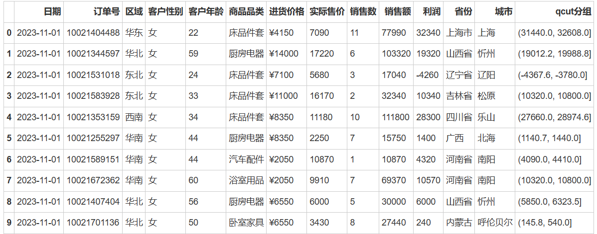

- **pd.cut()手动分组**： pd.cut()用于将连续变量划分为指定的离散区间/分箱。与pd.qcut()不同，pd.cut()不是基于分位数的，而是基于用户定义的边界进行切割。
- **函数签名：**
  - pandas.cut(x,bins,right=True,labels=None,retbins=False,precision=3,include_lowest=False,duplicates='raise')
- **参数解释：**
  - x：一维数组或类似数组的对象，需要被分箱的数据。
  - bins：整数或序列。如果是一个整数，定义了 x 范围内的均匀间隔的 bin 边界。如果是一个序列，定义了非均匀的 bin 边界。也就是说，bins 参数定义了分箱的边界。
  - right：布尔值，默认为 True，表示每个区间是右闭左开的，即区间包含右边界，但不包含左边界。
  - labels：可选参数，一个长度与 bins 相同的列表，用于指定每个区间的标签。如果不提供，则使用整数标记。
  - retbins：布尔值，默认为 False。如果为 True，返回 bin 的边界。
  - precision：整数，默认为3，表示存储和显示bin标签的小数位数。
  - include_lowest：布尔值，默认为 False。如果为 True，则第一个区间将包含最低值。
  - duplicates：默认为 'raise'，如果 bins 中有重复值则抛出 ValueError。如果设置为 'drop'，则删除重复的分箱边界。

```python
#手动分组
profit_cut=pd.cut(DP_table['利润'],bins=[-300000,-200000,-100000,0,100000,200000,300000,400000,500000,600000,700000,800000,900000])
DP_table['cut分组']=profit_cut
DP_table.head(10)
```

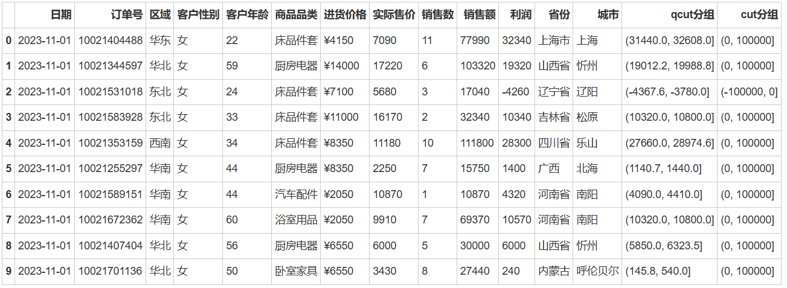

#### 数据分组

- **df.groupby()：** df.groupby()用于根据一个或多个列对数据进行分组。
- **函数签名：**
  - DataFrame.groupby(by=None,axis=0,level=None,as_index=True,sort=True,group_keys=True,squeeze=False,observed=False,dropna=True)
- **参数解释：**
  - by：用于分组的列名或列名的列表。也可以是一个函数，应用于索引或列；
  - axis：默认为0，表示按行进行分组。如果是1，表示按列进行分组；
  - level：在MultiIndex（分层索引）的情况下，用于分组的级别名称；
  - as_index：默认为True，表示分组标签将被用作结果索引的一部分。如果设置为False，则分组标签将被返回为常规列；
  - sort：默认为True，表示在分组前对数据进行排序。如果设置为False，则不进行排序；
  - group_keys：默认为True，表示在访问分组后的数据时，将分组标签作为索引的一部分。如果设置为False，则不保留分组标签；
  - squeeze：如果设置为True，且结果只包含一个列，则返回Series而不是DataFrame；
  - observed：默认为False，如果设置为True，则只返回实际观察到的值；
  - dropna：默认为True，如果设置为False，则组别的键将包括空值，并且空值也将被考虑在内。

> 以上只是使用groupby()函数进行分组，实际上还没有进行任何计算，可以调用聚合函数（如count,sum,mean等）或者应用自定义的函数进行数值运算，比如下面按照各商品品类订单号计数，可以调用.count()聚合函数。

```python
#各商品品类订单号计数
DP_table.groupby('商品品类')['订单号'].count()
```

> 商品品类
> 
> 办公家具     173
> 
> 卧室家具     840
> 
> 厨房电器     961
> 
> 家装饰品     978
> 
> 床品件套    1360
> 
> 汽车配件    1113
> 
> 浴室用品    1078
> 
> 电脑硬件     781
> 
> Name: 订单号, dtype: int64

reset_index()主要用于重置DataFrame的索引，新的索引将会是默认的整数索引 0, 1, 2, ...，下面分组计数后可以重置索引。

```python
#各商品品类订单号计数,降序排列
DP_table.groupby('商品品类')['订单号'].count().reset_index().sort_values('订单号',ascending=False)
```

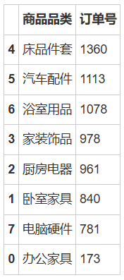

对于各区域不同商品类别订单数计数，可以在groupby函数中添加一个列表['区域','商品品类']

```python
#各区域不同商品类别订单数
DP_table.groupby(['区域','商品品类'])['订单号'].count().reset_index().head(10)
```


**对各产品销售额求和，可以调用.sum()聚合函数。**

```python
#各产品销售额求和
DP_table.groupby('商品品类')['销售额'].sum().reset_index()
```


**aggregate函数是groupby对象的一个方法，用于在分组后的数据上应用聚合操作。它允许对每个组应用各种聚合函数，如求和、均值、最大值、最小值等。aggregate方法提供了灵活的方式来计算和汇总分组后的数据。**

比如，这里对各区域的订单数计数和求和，可以在aggregate函数中添加一个列表 ['count','sum']，可分别进行数值运算。

```python
#各区域订单数计数、求和
DP_table.groupby('区域')['销售数'].aggregate(['count','sum']).reset_index()
```


### 数据透视

> - pivot_table()是Pandas库中用于创建数据透视表的重要方法。数据透视表是一种用于数据汇总和分析的强大工具，它能够将原始数据进行重新排列和整理，以更直观的方式展示数据之间的关系和汇总结果，通过该方法生成的数据透视表能够简化复杂数据的呈现方式，使数据分析过程更加高效和直观。
> 
> - pivot_table()方法提供了灵活的参数选项，可以根据自己的需求定制数据透视表的生成。通过指定行索引、列索引、数值列以及聚合函数等参数，可以轻松地创建出符合自己分析需求的数据透视表。例如，可以将某个类别变量作为行索引，将另一个类别变量作为列索引，然后用聚合函数计算数值列的统计指标，如总和、均值等。
> 
> - 对于数据分析学习者来说，掌握pivot_table()方法的使用非常重要。数据透视表能够帮助他们快速汇总和分析大量数据，发现数据背后的模式和趋势，为决策制定提供有力支持。比如，在市场营销分析中，可以利用数据透视表分析不同产品在不同地区的销售情况，通过聚合计算得出各地区各产品的销售总额，进而帮助决策者找出销售热点和市场机会。

#### 数据透视表

- **pd.pivot_table()：** pd.pivot_table()于创建透视表的函数，与Excel数据透视表相似。
- **函数签名**：pd.pivot_table(data, values=None, index=None, columns=None, aggfunc='mean', fill_value=None, margins=False, dropna=True, margins_name='All')
- **参数解释**：
  - data: 需要创建透视表的 DataFrame；
  - index: 透视表的行标签或标签列表；
  - values: 用于聚合的列或列的列表；
  - columns: 透视表的列标签或标签列表；
  - aggfunc: 聚合函数或函数列表，默认为 'mean'。可以是内置的聚合函数，如 'sum'、'mean'、'count'、'min'、'max' 等，也可以是自定义的函数；
  - fill_value: 在透视表中用于填充缺失值的值；
  - margins: 是否添加行/列小计和总计，默认为 False；
  - dropna: 是否删除所有项都是 NaN 的列，默认为 True；
  - margins_name: 添加到总计行/列的名称，默认为 'All'。

对各区域的销售额数据透视，index为'区域',values为'销售额'。

```python
#各区域销售额情况
pd.pivot_table(DP_table,index=['区域'],values='销售额')
```


对各个区域的不同产品销售额数据透视，可以在index中添加新的列表字段，如 ['区域','商品品类']。

```python
#各区域不同产品销售额情况
pd.pivot_table(DP_table,index=['区域','商品品类'],values='销售额').head(10)
```


reset_index()函数用于重置DataFrame的索引，对于多级索引的DataFrame，.reset_index()可用于减少索引的级数，或者将多级索引转换为列。

```python
#各区域不同产品销售额情况，重置索引
pd.pivot_table(DP_table,index=['区域','商品品类'],values='销售额').reset_index().head(10)
```


设置参数margins=True，可以给行/列添加总计，margins_name='总计'，添加名称，fill_value=0，将缺失值填充为0。

```python
#各区域不同产品销售额情况，加总计,缺失值填充为0
pd.pivot_table(DP_table,
               index=['区域','商品品类'],
               values='销售额',
               margins=True,
               margins_name='总计',
               fill_value=0
              ).tail()
```


对于各区域不同产品订单数计数，销售额求和，使用aggfunc函数，传入一个字典 {'订单号':'count','销售额':'sum'}，对订单号字段计数，对销售额字段求和。

```python
#各区域不同产品订单数，销售额情况，加总计,缺失值填充为0(长表)
pd.pivot_table(DP_table,index=['区域','商品品类','客户性别'],
               values=['订单号','销售额'],
               aggfunc={'订单号':'count','销售额':'sum'},
               margins=True,
               margins_name='总计',
               fill_value=0
              )
```


传入columns参数，可分别对不同性别的用户做数据透视。

```python
#各销售平台不同产品订单数，销售额情况，加总计,缺失值填充为0（宽表）
pd.pivot_table(DP_table,index=['区域','商品品类'],
               columns=['客户性别'],
               values=['订单号','销售额'],
               aggfunc={'订单号':'count','销售额':'sum'},
               margins=True,
               margins_name='总计',
               fill_value=0)
```


对于数据透视表的数据，可以使用.loc函数进行筛选。

```python
#加筛选器
table=pd.pivot_table(DP_table,
                     index=['区域','商品品类'],
                     columns=['客户性别'],
                     values=['订单号','销售额'],
                     aggfunc={'订单号':'count','销售额':'sum'},
                     margins=True,
                     margins_name='总计',
                     fill_value=0)
table.loc[['华东','西北'],'销售额']
```

