# 1. Matplotlib 实战

matplotlib基础知识这一部分内容将涵盖matplotlib的安装方法，让数据分析学习者了解如何正确配置和使用这一强大工具。接下来，学习者将掌握图表设置的基础技巧，包括如何调整颜色、线型、标题、图例等基本元素，以确保图表符合个性化与专业化的需求。在这部分内容中，学习者还将深入了解图表的基本设置，学习如何对坐标轴、刻度、标签等进行调整，使图表更加清晰易读。

# Matplotlib 快速入门

## Matplotlib安装

> **Matplotlib是一个Python 2D绘图库**，它可以在各种平台上以各种硬拷贝格式和交互式环境生成出具有出版品质的图形，它是Python中最常用的可视化工具之一，功能非常强大，可以通过调用函数轻松方便地绘制数据分析中常见的各种图像，比如折线图、条形图、柱状图、散点图、饼图等。

###  环境准备

```shell
#安装包
pip install matplotlib # 最新版本
pip install matplotlib==xxx # 指定版本下载，xxx为版本号
#镜像站安装
pip install matplotlib -i https://pypi.tuna.tsinghua.edu.cn/simple

#升级包
pip install --upgrade matplotlib # 升级至最新版本
pip install --upgrade matplotlib==xxx # 升级为指定版本，xxx为版本号

#卸载包
pip uninstall matplotlib
```

### 导入matplotlib包

```python
#导入matplotlib
import matplotlib 
print('当前使用 Matplotlib 版本为： ' + matplotlib.version)
#查看包的方法
print(dir(matplotlib))#这里的属性和方法包含很多，只需要掌握常用的即可


```

```python
# 导入matplotlib包，并按照惯例将其命名为plt，这样可以简化代码
import matplotlib.pyplot as plt #导入matplotlib包
```

## Matplotlib 图表设置

### 中文乱码设置

```python

# 导入matplotlib包，并按照惯例将其命名为plt，这样可以简化代码
import matplotlib.pyplot as plt #导入matplotlib包
plt.rcParams["font.sans-serif"] = 'Microsoft YaHei' #解决中文乱码问题
plt.rcParams['axes.unicode_minus'] = False #解决负号无法显示
```

> Tips：魔法命令是指在IPython和Jupyter Notebook等特殊环境中，以百分号(%)或双百分号(%%)为前缀的特殊命令。这些命令提供了常规Python语法中无法实现或不容易实现的功能，使开发者能更轻松地执行特定任务。

```python
#魔法命令，用于在笔记本内联显示matplotlib图表
%matplotlib inline 
#确保图表以SVG格式显示
%config InlineBackend.figure_format = 'svg' 
```

### 图表样式设置

plt.style.available是Matplotlib库中的一个属性，用于列出所有可用的图表样式。Matplotlib预先定义了很多不同图表样式，使用这些样式，你可以轻松地改变图表的外观，例如颜色、线条风格等。

```python
plt.style.available#查看matplotlib库的绘图样式
```

> ['ggplot',
> 
>  'grayscale',
> 
>  'fast',
> 
>  'classic',
> 
>  'seaborn',
> 
>  'seaborn-white',
> 
>  'seaborn-muted',
> 
>  'seaborn-darkgrid',
> 
>  'seaborn-dark-palette',
> 
>  'fivethirtyeight',
> 
>  'tableau-colorblind10',
> 
>  'seaborn-pastel',
> 
>  'seaborn-ticks',
> 
>  'seaborn-poster',
> 
>  'seaborn-dark',
> 
>  'bmh',
> 
>  'seaborn-talk',
> 
>  '_classic_test',
> 
>  'seaborn-bright',
> 
>  'seaborn-whitegrid',
> 
>  'seaborn-colorblind',
> 
>  'seaborn-paper',
> 
>  'seaborn-deep',
> 
>  'Solarize_Light2',
> 
>  'dark_background',
> 
>  'seaborn-notebook']

```python
#选择设置图表演示为ggplot类型
plt.style.use("ggplot")
```

### 建立画布

**在绘制图表之前，通常会先使用 plt.figure()来初始化图形窗口**，这样可以确保接下来的绘图操作都在这个特定的窗口上进行。同时，通过指定 figsize参数值，可以控制图形的大小。简单来讲，建立画布就相当于你选择多大的一块“布”去作画。

- **plt.figure()**是matplotlib库中的一个重要函数，用于创建一个新的图形窗口。
- **函数签名**：figure(num=None, figsize=(8, 6), dpi=80, facecolor='w', edgecolor='k')
- 参数解释
  - num：整数或字符串。图形的编号或名称。默认情况下，将从1开始编号。如果提供了一个已存在的编号或名称，则将激活对应的图形。
  - figsize：(float, float)。以英寸为单位的图形的宽和高。例如，figsize=(8, 6)将会创建一个8x6英寸的图形。
  - dpi：整数。图形的分辨率，即每英寸的点数。例如，dpi=80。
  - facecolor：图形的背景颜色。可以是任何有效的matplotlib颜色。例如，facecolor='w'将背景颜色设为白色。
  - edgecolor：图形的边缘颜色。也可以是任何有效的matplotlib颜色。例如，edgecolor='k'将边缘颜色设为黑色。

```python
#设置图表画布大小，设置其尺寸为宽9英寸和高6英寸
plt.figure(figsize = (9, 6))
```

> <Figure size 648x432 with 0 Axes>
> 
> <Figure size 648x432 with 0 Axes>

## 基本元素设置

> **坐标轴标题、轴显示、图表标题、图例设置**

在使用matplotlib进行图表绘制时，我们经常会进行一系列的设置以确保图表具有清晰、直观的视觉效果。这些设置包括:

- 坐标轴标题的设置，用于标明每个坐标轴所代表的数据含义；
- 图表标题设置，用于给整个图表添加一个描述性的标题，帮助观众快速理解图表的主题；
- 图例设置，当图表中包含多条数据曲线或多种数据标记时，可以通过图例来区分不同的数据系列，使得图表更加易于解读；
- 轴显示设置，可以控制坐标轴的显示方式，如刻度的间隔、范围等；

> Tips：使用plt.plot()命令，只要在括号()传入数据，即可生成一个折线图，但是，对于做可视化来说，最难的是里面的图表元素设置，只有通过细致的设置图表元素，一张精美的图表才会成型。

```python
# 绘制一个简单的折线图
import numpy as np
plt.plot(np.random.randn(100))
```

[<matplotlib.lines.Line2D at 0x7f58c9f48438>]

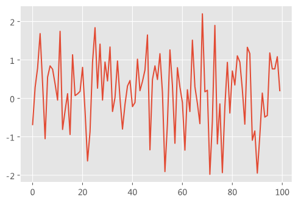

### 坐标轴标题

- **plt.xlabel()**函数是用于为matplotlib图中的x轴设置标签的函数。
- **函数签名**: plt.xlabel(xlabel, fontdict=None, labelpad=None, fontsize, loc='center', **kwargs)
- **参数解释**
  - xlabel：字符串类型，表示要设置的标签文本
  - fontdict：字典类型，用于设置标签字体的属性。可以在这个字典中指定字体的大小、颜色、样式等
  - loc：设置标签的位置。默认是在x轴下方，但你可以修改它来调整标签的位置
  - linespacing：标签与轴线之间的距离
  - color：标签的颜色
  - fontsize：标签的字体大小
  - horizontalalignment, va, ha：这些参数用于调整标签的水平和对齐方式
  - rotation：旋转角度，用于旋转x轴的标签。例如，如果x轴的标签很长，可能会彼此重叠，这时可以使用旋转来避免这种情况
  - labelpad：标签与轴之间的距离。增加此值可以增加标签与x轴之间的空间
  - **kwargs：其他关键字参数将传递给底层文本对象，例如size，color等。

---

- **plt.ylabel()**函数是用于为matplotlib图中的y轴设置标签的函数。
- **函数签名**：plt.ylabel(ylabel, fontdict=None, labelpad=None, fontsize, loc='center', **kwargs)
- **参数解释**：
  - ylabel：字符串类型，表示要设置的标签文本
  - fontdict：字典类型，用于设置标签字体的属性。可以在这个字典中指定字体的大小、颜色、样式等
  - loc：设置标签的位置。默认是在x轴下方，但你可以修改它来调整标签的位置
  - linespacing：标签与轴线之间的距离
  - color：标签的颜色
  - fontsize：标签的字体大小
  - horizontalalignment, va, ha：这些参数用于调整标签的水平和对齐方式
  - rotation：旋转角度，用于旋转x轴的标签。例如，如果x轴的标签很长，可能会彼此重叠，这时可以使用旋转来避免这种情况
  - labelpad：标签与轴之间的距离。增加此值可以增加标签与x轴之间的空间
  - **kwargs：其他关键字参数将传递给底层文本对象，例如size，color等。

```python
import pandas as pd
import numpy as np

#使用Series模拟一组数据
s = pd.Series(data=np.random.randn(3600),
               index=pd.date_range('20130101',periods=3600),
             )

cs = s.cumsum()#累计和
cs.plot(figsize = (9, 6))#设置图表大小

plt.xlabel("年份",labelpad = 20) #设置X轴距离，labelpad控制标题到图表的距离
plt.ylabel("网页浏览量",labelpad = 20) #设置Y轴距离，labelpad控制标题到图表的距离
Text(0, 0.5, '网页浏览量')
```

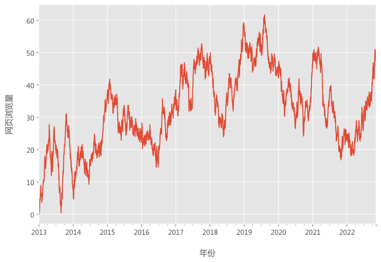

### 图表标题

- **plt.title()**用于设置图表标题，主要参数如下：
- **函数签名：**plt.title(label, fontdict=None, loc='center', pad=None, , y=None, *kwargs)
- 参数解释：
  - label：字符串类型，表示要设置的标题文本。
  - fontsize：设置标题的字体大小。可以通过指定一个整数值来选择合适的大小。
  - color：设置标题的字体颜色。可以使用常见的颜色名称、十六进制颜色代码或RGB值来指定颜色。
  - loc：设置标题的位置。可以使用预设的字符串值，如 'center'（默认居中）、'left'（左对齐）或 'right'（右对齐）。
  - pad：设置标题与图表顶部之间的距离。可以指定一个数值来增加或减少间距。
  - fontweight：设置标题字体的粗细。可以设置为 'normal'（正常）或 'bold'（加粗）等。
  - **kwargs：其他关键字参数，用于传递额外的属性给底层的文本对象。

```python
import pandas as pd
import numpy as np

#模拟一组数据
s = pd.Series(data=np.random.randn(3600),
               index=pd.date_range('20130101',periods=3600),
             )

cs = s.cumsum()#累计和
cs.plot(figsize = (9, 6))#设置图表大小

plt.title('近10年网页浏览量数据趋势', loc = "center")

```

Text(0.5, 1.0, '近10年网页浏览量数据趋势')

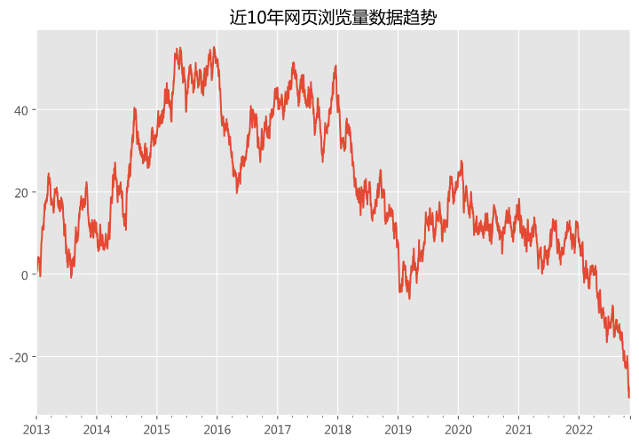

### 图表图例

- **plt.legend()**：方法用于显示图例，图例显示了图表中不同数据系列的标识和对应的标签.
- **函数签名**：plt.legend(labels, loc, fontsize, ncol, shadow, **kwargs)
- **参数解释**：
  - labels：用于设置图例标签的列表。当图表中有多个数据系列时，可以通过此参数指定每个系列的标签
  - loc：设置图例的位置。可以使用预设的字符串值，例如 'upper left'、'upper right'、'lower left'、'lower right' 等，来指定图例在图表中的位置
  - fontsize：设置图例字体的大小
  - ncol：设置图例的列数。当图例中有较多标签时，可以通过增加列数来排列标签，使其更加紧凑
  - borderpad：图例边框的内边距
  - labelspacing：图例中标签之间的垂直间距
  - handlelength：图例中标识符（如线条、标记）的长度
  - handletextpad：图例中标识符与标签之间的间距
  - borderaxespad：图例边框与坐标轴之间的间距
  - title：给图例添加一个标题
  - frameon：图例是否显示例外框
  - fancybox：图例外框是否为圆角
  - shadow：图例是否显示阴影

```python
import pandas as pd
import numpy as np

#模拟一组数据
s = pd.Series(data=np.random.randn(3600),
               index=pd.date_range('20130101',periods=3600),
             )

cs = s.cumsum()#累计和
cs.plot(figsize = (9, 6))#设置图表大小

#frameon=False,图例去除边框
plt.legend(loc = "upper center",title='浏览量',title_fontsize=10,frameon=False)
```

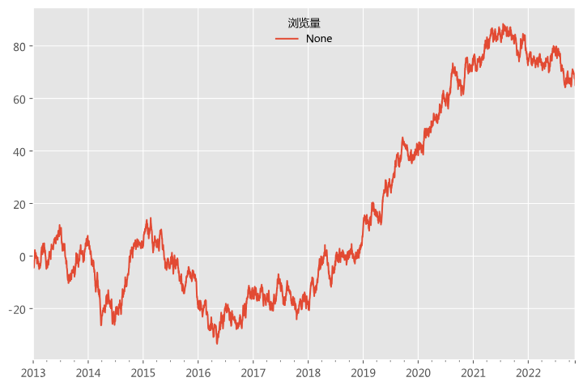

### 轴显示设置

- **plt.axis()**用于设置坐标轴范围。
- **函数签名**：plt.axis(option, args, *kwargs)
- 参数解释
  - option：字符串类型，用于指定要执行的操作。以下是几个常用的选项：
    - 'off'：关闭坐标轴标签和刻度线。
    - 'on'：打开坐标轴标签和刻度线（默认）。
    - 'tight'：设置坐标轴范围以适应数据范围，即坐标轴紧密地包围数据。
    - 'equal'：设置等比例的坐标轴，使得 x 和 y 轴具有相同的刻度间隔。
    - 'scaled'：设置坐标轴范围以适应数据的比例，与'equal'相反。
  - *args：根据所选的 option，可以传递额外的参数来设置坐标轴范围。例如，如果选择了 'tight'，则可以传递两个数值参数来手动指定数据范围的最小值和最大值。
  - **kwargs：其他关键字参数可以用于进一步自定义坐标轴的外观和行为，例如设置坐标轴标签的字体大小、颜色等。

```python
import pandas as pd
import numpy as np

#模拟一组数据
s = pd.Series(data=np.random.randn(3600),
               index=pd.date_range('20130101',periods=3600),
             )

cs = s.cumsum()#累计和
cs.plot(figsize = (9, 6))

plt.axis("off") #简化图表，可关闭坐标轴及标题
```

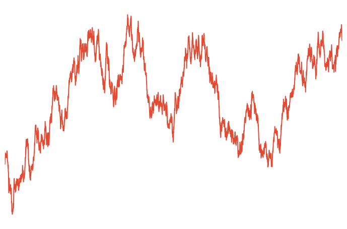

## 基本图表设置

### 点、线设置

- **df.plot()**默认是做折线图，但是可以通过设置一些参数来控制点的颜色、类型、线条的颜色、类型等。
- **函数签名**：df.plot(kind='line', ax=None, subplots=False, sharex=None, sharey=False, layout=None, figsize=None, use_index=True, title=None, grid=None, legend=True, style=None, logx=False, logy=False, loglog=False, xticks=None, yticks=None, xlim=None, ylim=None, rot=None, fontsize=None, colormap=None, table=False, yerr=None, xerr=None, label=None, secondary_y=False, sort_columns=False, **kwds)
- **参数解释**
  - kind：指定绘制的图形类型。常用值包括：'line'（线图）、'bar'（条形图）、'barh'（水平条形图）、'hist'（直方图）、'box'（箱线图）、'kde'（Kernel Density Estimation 图）等。
  - ax：用于绘制图形的 matplotlib 轴对象。如果没有指定，则使用当前活动的轴。
  - subplots：如果为 True，则为每个数据列创建一个子图。
  - sharex、sharey：如果为 True，则 x 或 y 轴将在子图之间是共享的。
  - layout：用于指定子图布局的元组。例如，(rows, columns)。
  - figsize：用于指定图形大小的元组，如 (width, height)。
  - use_index：如果为 True，则使用 DataFrame 的索引作为 x 轴。
  - title：图形的标题。
  - grid：是否显示网格。
  - legend：是否显示图例。
  - style：传递给 matplotlib 的样式参数。可以是字符串或列表/字典。
  - logx、logy、loglog：是否对 x 轴、y 轴或两者都使用对数刻度。
  - xticks、yticks：用于指定 x 轴和 y 轴的刻度的值。
  - xlim、ylim：用于指定 x 轴和 y 轴的范围。
  - rot：用于旋转 x 轴刻度标签的角度。
  - fontsize：用于指定刻度标签的字体大小。
  - colormap：用于指定颜色映射。
  - table：如果为 True，则在图形中添加一个表格。
  - yerr、xerr：用于绘制误差条的 y 和 x 的误差值。
  - label：用于指定图例标签。
  - secondary_y：如果为 True，则在右侧显示第二个 y 轴。
  - sort_columns：如果为 True，则按照列名对数据进行排序。

```python
import pandas as pd
import numpy as np

df=pd.DataFrame(data=np.random.randint(low=100,high=1000,size=30),
                index=pd.date_range('20231101',periods=30),
                columns=['销量'])

df.plot(color = "red",linestyle = "--", linewidth = 2, marker = "o", markersize = 10, figsize = (9, 6))
```

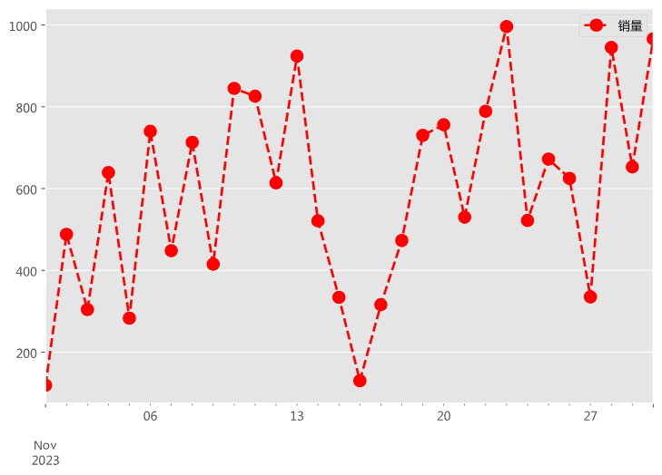

### 坐标轴刻度

- **plt.xticks()**用于设置 x 轴刻度和刻度标签。
- **函数签名**：plt.xticks(ticks, labels=None, *kwargs)
- **参数解释**
  - ticks：用于设置 x 轴上的刻度位置。可以传入一个列表或数组，指定刻度的位置
  - labels：用于设置每个刻度的标签文本。可以传入一个字符串列表，用于指定每个刻度的标签
  - rotation：用于设置刻度标签的旋转角度。可以传入一个数值，指定标签的旋转角度
  - fontsize：用于设置刻度标签的字体大小。可以传入一个数值，指定字体的大小
  - color：用于设置刻度标签的颜色。可以传入一个颜色字符串，指定标签的颜色
  - **kwargs：其他关键字参数可用于控制刻度和标签的外观和属性，例如字体大小、颜色、旋转角度等。这些参数通常包括 fontsize、color、rotation 等

  

- **plt.yticks()**用于设置 y 轴刻度和刻度标签。
- **函数签名**：plt.yticks(ticks, labels=None, *kwargs)
- **参数解释**：
  - ticks：用于设置 x 轴上的刻度位置。可以传入一个列表或数组，指定刻度的位置
  - labels：用于设置每个刻度的标签文本。可以传入一个字符串列表，用于指定每个刻度的标签
  - rotation：用于设置刻度标签的旋转角度。可以传入一个数值，指定标签的旋转角度
  - fontsize：用于设置刻度标签的字体大小。可以传入一个数值，指定字体的大小
  - color：用于设置刻度标签的颜色。可以传入一个颜色字符串，指定标签的颜色
  - **kwargs：其他关键字参数可用于控制刻度和标签的外观和属性，例如字体大小、颜色、旋转角度等。这些参数通常包括 fontsize、color、rotation 等

```python
import pandas as pd
import numpy as np

df=pd.DataFrame(data=np.random.randint(low=100,high=1000,size=30),
                index=pd.date_range('20231101',periods=30),
                columns=['销量'])

df.plot()

plt.xticks(ticks = pd.date_range('20231101',periods=30), labels = ['{}日'.format(i+1) for i in range(30)],rotation=45)#设置X坐标轴刻度
plt.yticks(ticks = np.arange(100,1100,100),labels = ['{}单'.format(i*100) for i in range(10)])#设置Y坐标轴刻度
```

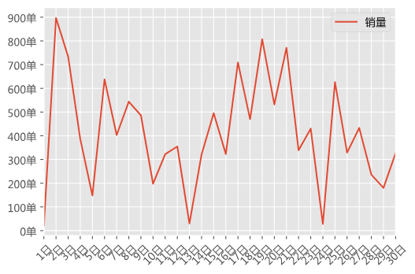

### 坐标轴范围

- **plt.ylim()**用于设置y轴范围，即y轴范围的最大值和最小值。
- **函数签名**：plt.ylim(bottom, top)
- **参数解释**
  - bottom：设置 y 轴的下限。
  - top：设置 y 轴的上限。

```python
import pandas as pd
import numpy as np

df=pd.DataFrame(data=np.random.randint(low=100,high=1000,size=30),
                index=pd.date_range('20231101',periods=30),
                columns=['销量'])

df.plot()

plt.ylim(0,1200)#设置Y轴坐标最小值与最大值(0, 1200)
```

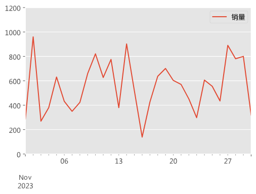

### 数据标签

- **plt.text()**可在指定的坐标位置添加文本，循环遍历每个数据点，并在每个数据点的位置添加一个标签。
- **函数签名:** plt.text(x, y, s, fontdict=None, withdash=False, **kwargs)
- **参数解释**
  - x, y：这两个参数指定文本在图形中的坐标位置。x 是横坐标，y 是纵坐标；
  - s：这是一个字符串参数，表示要显示的文本内容；
  - fontdict：这是一个可选的字典参数，用于设置文本的字体属性；
  - withdash：这是一个布尔值参数，如果为 True，则使用破折号（~）表示的文本。通常用于表示删除线效果；
  - **kwargs：其他可选的关键字参数，用于进一步控制文本的外观和属性，例如 ha（水平对齐方式有：center、left、right三个值可选）、va（垂直对齐方式：有center、top、bottom三个值可选）、rotation（旋转角度）等。

```python
import pandas as pd
import numpy as np

df=pd.DataFrame(data=np.random.randint(low=100,high=1000,size=30),
                index=pd.date_range('20231101',periods=30),
                columns=['销量'])

df.plot()

for x,y in zip(pd.date_range('20231101',periods=30), df['销量'].values):
    plt.text(x,y,y, ha = "center", va = "bottom", fontsize = 9)
```

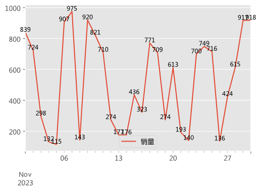

### 网格线

- **plt.grid()** 是 Matplotlib 库中用于显示或隐藏图表网格线的函数。
- **函数签名**：plt.grid(b=None, which='major', axis='both', **kwargs)
- **参数解释**
  - b：布尔值，可选参数。决定是否显示网格线。如果为 True，显示网格线；如果为 False，不显示网格线。默认值为 None，表示使用 rcParams['axes.grid'] 的值；
  - which：字符串，可选参数。用于指定要显示的网格线的类型。可选值包括 'major'（主刻度线）、'minor'（次刻度线）和 'both'（同时显示主刻度和次刻度线）。默认值为 'major'；
  - axis：字符串，可选参数。用于指定在哪个轴上显示网格线。可选值包括 'both'（同时显示在 x 轴和 y 轴上）、'x'（仅在 x 轴上显示）、'y'（仅在 y 轴上显示）。默认值为 'both'；
  - color：用于设置网格线的颜色，可以传入一个颜色字符串，如 'red'；
  - linestyle：用于设置网格线的线型。可以是 '-'、'--'、'-.'、':' 等；
  - linewidth：用于设置网格线的宽度。你可以传入一个数值；
  - alpha：用于设置网格线的透明度。你可以传入一个0到1之间的数值，其中0表示完全透明，1表示不透明；
  - which：用于控制显示哪些网格线，可以是 'both'（默认），'major' 或 'minor'；
  - axis：用于控制在哪个轴上显示网格线，可以是 'both'（默认），'x' 或 'y'；
  - visible：一个布尔值，用于直接控制网格线是否可见；
  - **kwargs：其他关键字参数。这些参数可用于进一步控制网格线的样式和属性，例如线条颜色、线条样式、线条宽度等。例如，color='red' 可以将网格线的颜色设置为红色。

```python
import pandas as pd
import numpy as np

df=pd.DataFrame(data=np.random.randint(low=100,high=1000,size=30),
                index=pd.date_range('20231101',periods=30),
                columns=['销量'])

df.plot()

plt.grid(color='red', linestyle='--', alpha=0.3, axis='y', visible = True,)#设置网格线为虚线,axis='y'可只对Y轴打开网格线
```

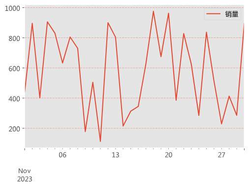

## 共轴坐标轴

在图表制作中，共享坐标轴指的是多个子图之间共享相同的Y轴或X轴。通过共享坐标轴，可以更好地比较不同子图之间的数据，因为它们都在相同的尺度上进行展示，特别是当需要对比多个相关图表时，共享坐标轴可以更能展现数据上的差异。

### 共Y坐标轴

做多个数据系列折线图时默认是共用Y轴的，以下是多个系列数据共用一个Y坐标轴，可以展示不同系列数据在时间趋势上的波动变化。

```python
import pandas as pd
import numpy as np

df = pd.DataFrame(np.random.randn(2000,4),
                  index=pd.Series(pd.date_range('20230101',periods=2000)),
                  columns=list('ABCD')
                 )

df = df.cumsum()
df.plot(figsize=(9,6))
plt.legend(loc='best')
```

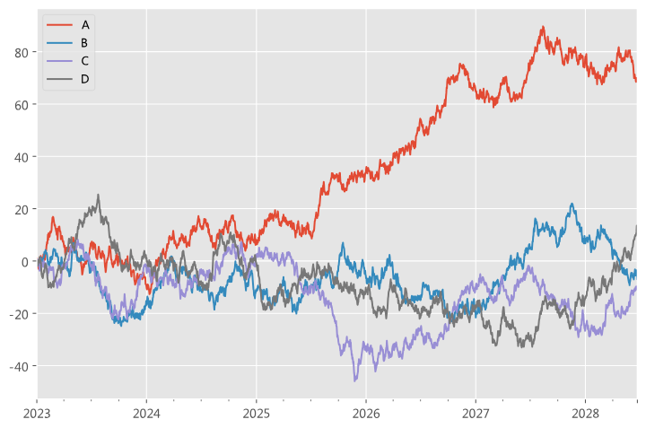

### 共X坐标轴

如果要共用一个X坐标轴，Y坐标轴分别展示，可设置参数subplots=True，这样设置为共X坐标轴数据图。

```python
import pandas as pd
import numpy as np

df = pd.DataFrame(np.random.randn(2000,4),
                  index=pd.Series(pd.date_range('20230101',periods=2000)),
                  columns=list('ABCD')
                 )

df = df.cumsum()
df.plot(figsize=(9,6),subplots=True,)

plt.legend(loc='best')
```

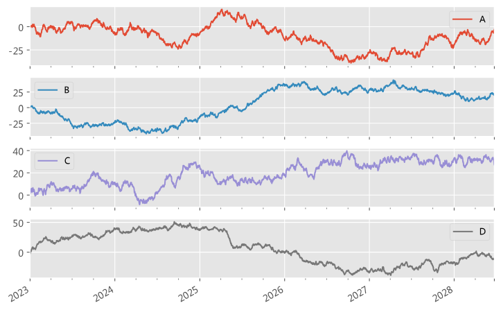

## 综合案例

以下，借助一个可视化案例研究双十一销售量数据趋势。通过分析双十一销售量的数据趋势，我们可以获得宝贵的洞察和启示，有助于我们深入理解消费者购买行为、市场趋势和电商平台的运营策略。这样的研究能够帮助我们洞察消费者需求的变化，以及市场竞争的态势，为企业制定精准的营销策略提供数据支持。

下面使用一个综合数据可视化案例，来研究双十一销售量数据趋势。

```python
import pandas as pd
import numpy as np
import matplotlib.pyplot as plt 
import matplotlib.style as psl

#魔法命令，用于在笔记本内联显示matplotlib图表
%matplotlib inline 
#确保图表以SVG格式显示
%config InlineBackend.figure_format = 'svg' 

plt.rcParams["font.sans-serif"] = 'Microsoft YaHei' #解决中文乱码问题
plt.rcParams['axes.unicode_minus'] = False #解决负号无法显示

psl.use('ggplot')
plt.figure(figsize = (9, 6)) #设置图表画布大小

df=pd.DataFrame(data=np.random.randint(low=100,high=1000,size=30),
                index=pd.date_range('20231101',periods=30),
                columns=['销量'])

df.plot(color = "red",linestyle = "dashdot", linewidth = 1, marker = "o", markersize = 5, figsize = (9, 6))

plt.xlabel("年份",labelpad = 20) #设置X轴距离，labelpad控制标题到图表的距离
plt.ylabel("电商销售量",labelpad = 20) #设置Y轴距离，labelpad控制标题到图表的距离

plt.title('双十一销售量数据趋势', loc = "center")

plt.legend(loc = "upper center",title='销量',title_fontsize=10,frameon=False)

plt.xticks(pd.date_range('20231101',periods=30), ['{}日'.format(i+1) for i in range(30)],rotation=45)#设置X坐标轴刻度
plt.yticks(np.arange(100,1100,100), ['{}单'.format(i*100) for i in range(10)])#设置Y坐标轴刻度
plt.ylim(0,1100)#设置Y轴坐标最小值与最大值
plt.grid(visible = True,linestyle='dashed')#设置网格线为虚线,axis='y'可只对Y轴打开网格线

for a,b in zip(pd.date_range('20231101',periods=30), df['销量'].values):
    plt.text(a,b,b, ha = "center", va = "bottom", fontsize = 9)
```

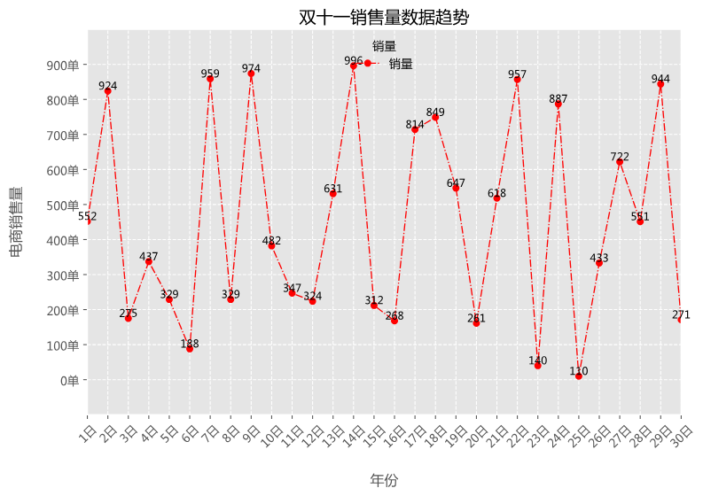

<Figure size 648x432 with 0 Axes>

# Matplotlib 基础图表

> 在matplotlib基本图表这一部分，将了解如何选择合适的图表类型来展示不同类型的数据。具体来说，学习创建折线图、柱状图、散点图和饼图等常用图表。
> 
> - 折线图适用于展示数据随时间或其他连续变量的变化趋势；
> - 柱状图则用于比较不同类别之间的数值差异；
> - 散点图可以展示两个变量之间的关系；
> - 而饼图则用于表示数据的比例分布。
> 
> 通过掌握这些基本图表的创建方法，将能够更加直观地呈现数据，并更好地进行数据分析和解读。

## 图表选择

选择合适的图表类型对于有效地传达数据信息非常重要。在选取图表时需要考虑你想要传达的信息、数据的性质和数量，以及你的受众情况，根据这些因素来选择最能有效地传达你的信息的图表类型。以下是一些常见的图表类型可供选择：

1. **比较数据**：当你需要比较不同类别或不同时间点的数据时，条形图和饼图是很好的选择。条形图可以用来比较不同类别的数据，而饼图则可以用于展示部分与整体的关系。
2. **趋势分析**：如果你想展示数据的趋势，例如随时间的变化，线形图或柱状图是很好的选择。线形图适用于时间序列数据，而柱状图则在类别数据上效果更好。
3. **部分与整体的关系**：饼图或堆叠条形图可以用来展示部分与整体的关系。饼图适用于简单的比例关系，而堆叠条形图可以用于显示不同类别的累积效应。
4. **相关性分析**：如果你想展示两个变量之间的关系，散点图是好的选择。通过散点图，你可以观察到两个变量之间的趋势和关联。
5. **时间序列数据**：如果你正在处理时间序列数据，例如温度随时间的变化，那么线形图或者柱状图（如果时间被解释为类别）可能都会很有效。
6. **多变量数据**：如果你有多维度的数据需要展示，例如多个产品在不同地区和时间的销售情况，可能需要使用更复杂的图表类型，如热力图、小提琴图等。

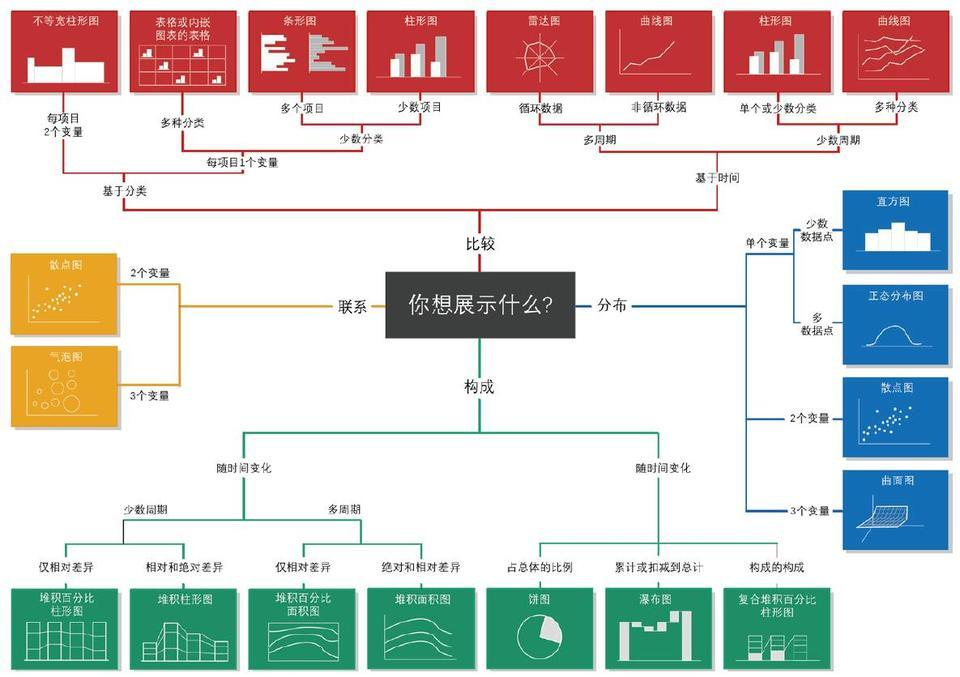

## 折线图

折线图是一种用折线的升降来表示统计数据变动趋势的图形。它通常用于显示数据随时间或有序类别的波动情况，可以清楚地反映数据增减变化的趋势和变化幅度。在折线图中，每个数据点通常通过线段连接，形成一条连续的折线，从而展示数据的动态变化。

- **plt.plot()：** 用于绘制折线图。
- **函数签名**：plt.plot(x, y, color, linestyle, linewidth, **kwargs)
- 参数解释：
  - x, y: 表示数据的x和y坐标。这些是绘制图形所必需的基本参数；
  - color：控制线条的颜色。可以传入颜色的名称，例如'red'，'green'等；
  - linestyle：线条的风格。可以是'-'（实线），'--'（虚线），'-.'（点划线），':'（点线）等；
  - linewidth：线条的宽度。可以设定线条的粗细；
  - marker：数据点的标记。可以是'.'（点），'o'（圆圈），'s'（方块），'d'（菱形）等；
  - markersize：标记的大小。可以设定数据点的大小；
  - markeredgecolor：标记边缘的颜色；
  - markerfacecolor：标记填充的颜色；
  - markeredgewidth：标记边缘的宽度；
  - label：用于图例的标签；
  - **kwargs：表示其他关键字参数的集合。这些参数用于控制线条的样式、颜色、标记等属性。

```python
import pandas as pd
import numpy as np
import matplotlib.pyplot as plt 
import matplotlib.style as psl

#魔法命令，用于在笔记本内联显示matplotlib图表
%matplotlib inline 
#确保图表以SVG格式显示
%config InlineBackend.figure_format = 'svg' 

plt.rcParams["font.sans-serif"] = 'Microsoft YaHei' #解决中文乱码问题
plt.rcParams['axes.unicode_minus'] = False #解决负号无法显示

psl.use('ggplot')
plt.figure(figsize = (9, 6)) #设置图表画布大小

#导入数据
df=pd.DataFrame(data={'日期': pd.date_range('20231101',periods=30),
                      '销售数': np.random.randint(low=100,high=1000,size=30),
                      '销售额': np.random.randint(low=1000,high=10000,size=30)}
               )
x=df['日期'].astype('str').tolist()
y=df['销售数'].tolist()

plt.plot(x,y,color="red",linestyle= "--",linewidth=1,marker="o",markersize=5)

plt.xlabel("日期",labelpad = 20) #设置X轴距离，labelpad控制标题到图表的距离
plt.ylabel("电商销售数",labelpad = 20) #设置Y轴距离，labelpad控制标题到图表的距离

plt.title('双十一销售量数据趋势', loc = "center")

plt.xticks(x, ['{}日'.format(i+1) for i in range(30)],rotation=45)#设置X坐标轴刻度

plt.grid(visible = True,linestyle='dashed')#设置网格线为虚线,axis='y'可只对Y轴打开网格线

for a,b in zip(x, y):
    plt.text(a,b,b, ha = "center", va = "bottom", fontsize = 9)

plt.show()
```

## 柱形图

柱形图是一种以长方形的长度为变量的统计图表。长条图用来比较两个或以上的价值（不同时间或者不同条件），只有一个变量，通常利用于较小的数据集分析。柱形图各柱体表示数据的分类项，柱体的高度表示该类别的数据值。

- **plt.bar()**：用于绘制柱形图。
- **函数签名**：plt.bar(x, height, width, color, linewidth, align, **kwargs)
- **参数解释**
  - x, height：x 为柱形图的 x 坐标，height 则为柱形的高度。这两个参数是必需的。
  - width：柱形的宽度。默认为 0.8。
  - color, edgecolor：分别用于设置柱形的填充颜色和边缘颜色。可以是单一颜色格式或包含多种颜色的序列。
  - linewidth：柱形边缘的线宽。
  - align：设置柱形与 x 坐标的对齐方式，可以是 'center' 或 'edge'。默认为 'center'。
  - tick_label：用于 x 轴的刻度标签。
  - label：用于图例的标签。
  - alpha：柱形的透明度，范围在 0 到 1 之间。
  - hatch：用于填充柱形的斜线样式，例如 '/'、''、'|'、'-' 等。
  - log：是否使用对数刻度。默认为 False。
  - ecolor：柱形误差线的颜色。
  - capsize：柱形误差线帽的大小。
  - **kwargs：表示其他关键字参数的集合。这些参数用于控制柱形的样式、颜色、标记等属性。

```python
import pandas as pd
import numpy as np
import matplotlib.pyplot as plt 
import matplotlib.style as psl

#魔法命令，用于在笔记本内联显示matplotlib图表
%matplotlib inline 
#确保图表以SVG格式显示
%config InlineBackend.figure_format = 'svg' 

plt.rcParams["font.sans-serif"] = 'Microsoft YaHei' #解决中文乱码问题
plt.rcParams['axes.unicode_minus'] = False #解决负号无法显示

psl.use('ggplot')
plt.figure(figsize = (9, 6)) #设置图表画布大小

#导入数据
df=pd.DataFrame(data={'客户性别':['男','女'],
                      '销售数': np.random.randint(low=100,high=5000,size=2)}
               )

x=df['客户性别'].tolist()
y=df['销售数'].tolist()

#绘制柱状图
plt.bar(x, y, width = 0.2, align = "center", label = "销售量")

plt.title("不同性别客户销售数", loc="center")#设置标题

#添加数据标签
for a,b in zip(x, y):
    plt.text(a,b,b,ha = "center", va = "bottom", fontsize = 12)

plt.xlabel("客户性别")#设置x和y轴的名称
plt.ylabel("销售数")

plt.legend()#显示图例
plt.show()#显示图像
```

## 条形图

条形图是用宽度相同的条形的高度或长短来表示数据变动的图形。条形图可以横置或纵置，纵置时也称为柱形图，可横向做分类对比。

- **plt.barh()**： 用于绘制条形图。
- **函数签名**：plt.barh(y, width, height, color, edgecolor, linewidth, **kwargs)
- **参数解释**
  - y, width：y为柱形图的y坐标，width则为柱形的宽度。这两个参数是必需的；
  - height：柱形的高度；
  - color：设置柱形的颜色；
  - edgecolor：柱形的边框颜色；
  - linewidth：柱形边框的宽度；
  - align：柱形的水平对齐方式，通常可以是'center'或'edge'；
  - xerr, yerr：分别表示x和y方向上的误差条，可以用于绘制误差条；
  - ecolor：误差条的颜色；
  - capsize：误差条两端的宽度；
  - label：图例的标签；
  - **kwargs：表示其他关键字参数的集合。这些参数用于控制条形图的样式、颜色、标记等属性。

```python
import pandas as pd
import matplotlib.pyplot as plt 
import matplotlib.style as psl

#魔法命令，用于在笔记本内联显示matplotlib图表
%matplotlib inline 
#确保图表以SVG格式显示
%config InlineBackend.figure_format = 'svg' 

plt.rcParams["font.sans-serif"] = 'Microsoft YaHei' #解决中文乱码问题
plt.rcParams['axes.unicode_minus'] = False #解决负号无法显示

psl.use('ggplot')
plt.figure(figsize = (9, 6)) #设置图表画布大小

#导入数据
df=pd.DataFrame(data={'商品品类':['床品件套','厨房电器','汽车配件','浴室用品',
                              '卧室家具','电脑硬件','家装饰品','办公家具'],
                      '销售数': np.random.randint(low=100,high=5000,size=8)}
               )

x=df['商品品类'].tolist()
y=df['销售数'].tolist()

#绘制柱状图
plt.barh(x, width = y, height = 0.5, align = "center", label = "销售数")

#设置标题
plt.title("不同商品品类销售数", loc="center")

#添加数据标签
for a,b in zip(x, y):
    plt.text(b,a,b,ha = "left", va = "center", fontsize = 12)

plt.xlabel("销售数")
plt.ylabel("商品品类")#设置x和y轴的名称

plt.legend()#显示图例
```

5.饼图

饼图是用圆形及圆内扇形的角度来表示数值大小的图形，它主要用于表示一个样本（或总体）中各组成部分的数据占全部数据的比例。饼图通常用于显示数据系列中每一项占该系列数值总和的比例，常常被用来展现数据的分布情况。

plt.pie()： 用于绘制饼图。

函数签名

plt.pie(x, explode=None, labels=None, colors=None, autopct=None,pctdistance=0.6, labeldistance=1.1, startangle=None,radius=None, counterclock=True, wedgeprops=None, textprops=None,center=(0, 0),framesize=6, rotatelabels=False, *, normalize=False, data=None)

参数解释

x：数组类型，用于指定每个扇形区域的大小。这些值将被归一化，所以它们的总和为1，每个值对应饼图的一个部分；

explode：用于设置饼图每个部分离中心的距离。默认为None，表示所有部分都紧贴着中心。如果提供一个数组，则数组的长度应与x的长度相同，并且每个元素表示对应部分离中心的距离；

labels：列表字符串，用于设置每个饼图部分的标签。默认为None；

colors：用于设置饼图部分的颜色。可以是颜色名称、RGB元组或十六进制颜色字符串。如果为None，将使用Matplotlib的默认颜色循环；

autopct：字符串或函数，用于控制饼图百分比的显示方式。如果为字符串，可以使用格式化的浮点数（例如'%.1f%%'）。如果为函数，函数应接收一个百分比值，并返回一个字符串；

pctdistance：浮点数，用于设置百分比标签与圆心的距离，默认为0.6；

labeldistance：浮点数，用于设置标签与圆心的距离，默认为1.1；

startangle：浮点数，用于设置饼图的起始角度，默认为从x轴正半轴开始逆时针计算角度；

radius：浮点数或两个浮点数的元组，用于设置饼图的半径。如果为单个浮点数，则所有饼图部分都有相同的半径。如果为元组，则第一个元素为内半径（用于生成环形饼图），第二个元素为外半径；

counterclock：布尔值，用于设置饼图是顺时针还是逆时针排列，默认为True（逆时针）；

wedgeprops：字典类型，用于设置饼图部分的属性，例如边缘颜色、线宽等；

textprops：字典类型，用于设置文本标签的属性，例如字体大小、颜色等；

center：两个浮点数的元组，用于设置饼图的中心点位置。默认为(0, 0)；

framesize：整数，用于设置饼图的框架大小；

rotatelabels：布尔值，用于设置标签是否应旋转以与饼图部分对齐。默认为False；

normalize：布尔值，是否将输入数据归一化到1。如果为True，则忽略数据中的任何缺失值。默认为False；

data：可选参数，接受一个字典或可以转换为字典的对象。此参数与x参数互斥。

In [4]:

import matplotlib.pyplot as plt 

import matplotlib.style as psl

plt.rcParams['font.sans-serif']=['Microsoft YaHei'] #用来正常显示中文标签

plt.rcParams['axes.unicode_minus']=False #用来正常显示负号

psl.use('ggplot')

plt.figure(figsize = (9, 6))

#导入数据

df=pd.DataFrame(data={'区域':['华东','华北','东北','西北','西南','华南'],

                      '销售数': np.random.randint(low=100,high=5000,size=6)}

               )

#导入数据

x=df['销售数'].tolist()

labels = df['区域'].tolist()

explode = [0.050,0.050,0,0,0,0]  # 用于突出显示特定区域

#饼图

plt.pie(x,

        autopct='%.1f%%',#数据标签

        labels=labels,

        startangle=90, #初始角度

        explode=explode, # 突出显示数据

        pctdistance=0.87,  # 设置百分比标签与圆心的距离

        textprops = {'fontsize':12, 'color':'k'}, # 设置文本标签的属性值

        counterclock = False, # 是否逆时针

                   )

plt.title("双11各区域销售数占比")

Text(0.5, 1.0, '双11各区域销售数占比')

6.综合案例

上面介绍了matplotlib中折线图、柱形图、条形图、饼图这四类基础图表，其他的高级图表都是在这四个基础图表的基础上进行演化而言，实际在学习中以基础图表的学习为主，在使用时需要结合数据可视化的使用场景，比如下面的要呈现电商销售量数据，可以优先考虑使用折线图来呈现销售量的数据波动趋势。

In [12]:

import pandas as pd  

import matplotlib.pyplot as plt  

  

# 生成日期范围

date_rng = pd.date_range(start='2023-11-1', end='2023-11-30', freq='D')  

# 创建一个DataFrame

df = pd.DataFrame(date_rng, columns=['日期'])

df['销量'] = [544, 749, 716, 818, 927, 938,  995, 1161, 997,  1110,

               1465, 1312, 1400, 1097, 1123,  716, 875,  661,  596, 880,

               969,  709, 993, 1142,  821,  913, 945,  530,  860, 927]

# 绘制折线图

plt.figure(figsize=(9,6))  # 设置图表大小  

plt.plot(df['日期'], df['销量'], marker='o', linestyle='-', color='r')  # 设置线型和点型  

plt.title('电商销售量趋势图')  # 设置标题  

plt.xlabel('日期')  # 设置x轴标题  

plt.ylabel('销售量')  # 设置y轴标题 

plt.xticks(rotation=45)#设置X坐标轴刻度

for a,b in zip(df['日期'], df['销量']):  # 添加数据标签

    plt.text(a, b, str(b), ha='center', va='bottom', fontsize=8)

plt.grid(True)  # 显示网格线  

plt.show()  # 显示图表