# 总结：Python 十大经典库

## Numpy

官网：https://numpy.org/

> **NumPy是Python中科学计算的基础包**。它是一个Python库，提供多维数组对象，各种派生对象，以及用于数组快速操作的各种API，有包括数学、逻辑、形状操作、排序、选择、输入输出、离散傅立叶变换、基本线性代数，基本统计运算和随机模拟等等。

> NumPy包的核心是 **ndarray **对象。它封装了python原生的同数据类型的 n 维数组，为了保证其性能优良，其中有许多操作都是代码在本地进行编译后执行的。

> NumPy的主要对象是同构多维数组。它是一个元素表，所有类型都相同，由非负整数元组索引。在NumPy维度中称为轴 。

### 数组矩阵

```python
import numpy as np

# 创建数组
# 创建一维数组
array_1d = np.array([1, 2, 3, 4, 5])
print("一维数组：", array_1d)

# 创建二维数组
array_2d = np.array([[1, 2, 3], [4, 5, 6]])
print("二维数组：\n", array_2d)

# 创建三维数组
array_3d = np.array([[[1, 2], [3, 4]], [[5, 6], [7, 8]]])
print("三维数组：\n", array_3d)

# 使用 NumPy 提供的函数创建数组
# 创建全零数组
zeros_array = np.zeros((2, 3))
print("全零数组：\n", zeros_array)

# 创建全一数组
ones_array = np.ones((3, 2))
print("全一数组：\n", ones_array)

# 创建单位矩阵
identity_matrix = np.eye(3)
print("单位矩阵：\n", identity_matrix)
```

> 输出结果

一维数组： [1 2 3 4 5]

二维数组：

 [[1 2 3]

 [4 5 6]]

三维数组：

 [[[1 2]

  [3 4]]

 [[5 6]

  [7 8]]]

全零数组：

 [[0. 0. 0.]

 [0. 0. 0.]]

全一数组：

 [[1. 1.]

 [1. 1.]

 [1. 1.]]

单位矩阵：

 [[1. 0. 0.]

 [0. 1. 0.]

 [0. 0. 1.]]

### 数学运算

```bash
# 数学运算
# 加法
print("数组加法：", array_1d + 2)

# 减法
print("数组减法：", array_1d - 2)

# 乘法
print("数组乘法：", array_1d * 2)

# 除法
print("数组除法：", array_1d / 2)

# 矩阵乘法
matrix_a = np.array([[1, 2], [3, 4]])
matrix_b = np.array([[5, 6], [7, 8]])
print("矩阵乘法：\n", np.dot(matrix_a, matrix_b))
```

> 输出结果

数组加法： [3 4 5 6 7]

数组减法： [-1  0  1  2  3]

数组乘法： [ 2  4  6  8 10]

数组除法： [0.5 1.  1.5 2.  2.5]

矩阵乘法：

 [[19 22]

 [43 50]]

### 统计分析

```python
# 统计分析
# 求和
print("数组求和：", np.sum(array_1d))

# 平均值
print("数组平均值：", np.mean(array_1d))

# 标准差
print("数组标准差：", np.std(array_1d))

# 最大值
print("数组最大值：", np.max(array_1d))

# 最小值
print("数组最小值：", np.min(array_1d))
```

> 输出结果

数组求和： 15

数组平均值： 3.0

数组标准差： 1.4142135623730951

数组最大值： 5

数组最小值： 1

### 随机数

```python
# 随机数生成
# 生成随机数组
random_array = np.random.rand(3, 3)  # 生成 3x3 的随机数组，值在 [0, 1) 之间
print("随机数组：\n", random_array)

# 生成正态分布随机数组
normal_array = np.random.randn(3, 3)  # 生成 3x3 的正态分布随机数组
print("正态分布随机数组：\n", normal_array)
```

> 输出结果

随机数组：

 [[0.49924427 0.01076198 0.58390725]

 [0.5783004  0.59261663 0.37663148]

 [0.93751453 0.20433936 0.35305064]]

正态分布随机数组：

 [[ 0.20299064 -0.42017387 -0.86754958]

 [ 1.32573826  0.40174659 -0.80275647]

 [-0.23426902  0.05748519  0.68788877]]

### 数组索引和切片

```python
# 数组索引和切片
# 一维数组索引
print("一维数组第 2 个元素：", array_1d[1])

# 二维数组索引
print("二维数组第 1 行第 2 列的元素：", array_2d[0, 1])

# 一维数组切片
print("一维数组切片：", array_1d[1:4])

# 二维数组切片
print("二维数组切片：\n", array_2d[0:2, 1:3])

# 条件索引
print("大于 3 的元素：", array_1d[array_1d > 3])
```

> 输出结果

一维数组第 2 个元素： 2

二维数组第 1 行第 2 列的元素： 2

一维数组切片： [2 3 4]

二维数组切片：

 [[2 3]

 [5 6]]

大于 3 的元素： [4 5]

### 数组重塑和拼接

```python
# 数组重塑
reshaped_array = np.reshape(array_1d, (5, 1))
print("重塑后的数组：\n", reshaped_array)

# 数组拼接
concatenated_array = np.concatenate((array_1d, array_1d), axis=0)
print("拼接后的数组：", concatenated_array)
```

> 输出结果

重塑后的数组：

 [[1]

 [2]

 [3]

 [4]

 [5]]

拼接后的数组： [1 2 3 4 5 1 2 3 4 5]

## Pandas

官网：https://pandas.pydata.org/

> Pandas 是 Python的核心数据分析支持库，提供了快速、灵活、明确的数据结构，旨在简单、直观地处理关系型、标记型数据，广泛应用于数据分析领域，Pandas 适用于处理与 Excel 表类似的表格数据，以及有序和无序的时间序列数据等。

> Pandas 的主要数据结构是 Series（一维数据）和 DataFrame（二维数据），这两种数据结构足以处理金融、统计、社会科学、工程等领域里的大多数典型用例，使用pandas进行数据分析流程包含数据整理与清洗、数据分析与建模、数据可视化与制表等阶段。

灵活的分组功能：（group by）数据分组、聚合、转换数据；

直观地合并功能：（merge）数据连接；

灵活地重塑功能：（reshape）数据重塑；

### DataFrame

```python
# 创建一个简单的 DataFrame
data = {
    "Name": ["Alice", "Bob", "Charlie", "David", "Eve"],
    "Age": [25, 30, 35, 40, 45],
    "City": ["New York", "Los Angeles", "Chicago", "Houston", "Phoenix"]
}

df = pd.DataFrame(data)
print("原始 DataFrame：")
print(df)
```

> 输出结果：

原始 DataFrame：

      Name  Age         City

0    Alice   25     New York

1      Bob   30  Los Angeles

2  Charlie   35      Chicago

3    David   40      Houston

4      Eve   45      Phoenix

### 数据清洗

```python
# 数据清洗
# 删除重复行
df = df.drop_duplicates()
print("\n删除重复行后的 DataFrame：")
print(df)

# 填充缺失值
df["Age"].fillna(df["Age"].mean(), inplace=True)
print("\n填充缺失值后的 DataFrame：")
print(df)
```

> 输出结果

删除重复行后的 DataFrame：

      Name  Age         City

0    Alice   25     New York

1      Bob   30  Los Angeles

2  Charlie   35      Chicago

3    David   40      Houston

4      Eve   45      Phoenix

填充缺失值后的 DataFrame：

      Name  Age         City

0    Alice   25     New York

1      Bob   30  Los Angeles

2  Charlie   35      Chicago

3    David   40      Houston

4      Eve   45      Phoenix

### 数据筛选

```python
# 数据筛选
# 筛选年龄大于 30 的记录
filtered_df = df[df["Age"] > 30]
print("\n筛选年龄大于 30 的记录：")
print(filtered_df)
```

> 筛选年龄大于 30 的记录：
> 
>       Name  Age     City
> 
> 2  Charlie   35  Chicago
> 
> 3    David   40  Houston
> 
> 4      Eve   45  Phoenix

### 数据排序

```python
sorted_df = df.sort_values(by="Age", ascending=False)
print("\n按年龄降序排序的 DataFrame：")
print(sorted_df)
```

> 按年龄降序排序的 DataFrame：
> 
>       Name  Age         City
> 
> 4      Eve   45      Phoenix
> 
> 3    David   40      Houston
> 
> 2  Charlie   35      Chicago
> 
> 1      Bob   30  Los Angeles
> 
> 0    Alice   25     New York

### 数据分组

```python
# 数据分组
# 按城市分组并计算每个城市的平均年龄
grouped_df = df.groupby("City")["Age"].mean()
print("\n按城市分组并计算平均年龄：")
print(grouped_df)
```

> 按城市分组并计算平均年龄：
> 
> City
> 
> Chicago        35
> 
> Houston        40
> 
> Los Angeles    30
> 
> New York       25
> 
> Phoenix        45
> 
> Name: Age, dtype: int64

### 数据统计

```python
# 数据统计
# 计算基本统计量
print("\n基本统计量：")
print(df.describe())
```

> 基本统计量：
> 
>              Age
> 
> count   5.000000
> 
> mean   35.000000
> 
> std     7.905694
> 
> min    25.000000
> 
> 25%    30.000000
> 
> 50%    35.000000
> 
> 75%    40.000000
> 
> max    45.000000

### 添加新列

```python
# 添加新列
# 添加一个新列 "Age Group"
df["Age Group"] = pd.cut(df["Age"], bins=[18, 30, 40, 50, 60], labels=["18-29", "30-39", "40-49", "50-59"])
print("\n添加新列后的 DataFrame：")
print(df)
```

> 添加新列后的 DataFrame：
> 
>       Name  Age         City Age Group
> 
> 0    Alice   25     New York     18-29
> 
> 1      Bob   30  Los Angeles     18-29
> 
> 2  Charlie   35      Chicago     30-39
> 
> 3    David   40      Houston     30-39
> 
> 4      Eve   45      Phoenix     40-49

### 数据导出

```python
# 数据导出
# 将 DataFrame 导出到 CSV 文件
df.to_csv("output.csv", index=False)
print("\n数据已导出到 output.csv 文件。")
```

> 数据已导出到 output.csv 文件。

## Matplotlib

官网：https://www.matplotlib.org.cn/

> Matplotlib是一个**Python 2D绘图库**，它以多种硬拷贝格式和跨平台的交互式环境生成出版物质量的图形。Matplotlib可用于Python脚本，Python和IPython Shell、Jupyter笔记本，Web应用程序服务器和四个图形用户界面工具包。

> Matplotlib 尝试使容易的事情变得更容易，使困难的事情变得可能，只需几行代码就可以生成图表、直方图、功率谱、条形图、误差图、散点图等。

为了简单绘图，该 pyplot 模块提供了类似于MATLAB的界面，尤其是与IPython结合使用时，对于高级用户，您可以通过面向对象的界面或MATLAB用户熟悉的一组功能来完全控制线型，字体属性，轴属性等。

### 折线图

```python
import matplotlib.pyplot as plt
import numpy as np

# 创建数据
x = np.linspace(0, 10, 100)  # 生成 0 到 10 之间的 100 个点
y = np.sin(x)  # 计算正弦值
# 折线图
plt.figure(figsize=(10, 6))  # 设置图形大小
plt.plot(x, y, label="sin(x)", color="blue", linestyle="--", linewidth=2)
plt.title("Line Plot: y = sin(x)")  # 添加标题
plt.xlabel("x")  # 添加 x 轴标签
plt.ylabel("y")  # 添加 y 轴标签
plt.legend()  # 添加图例
plt.grid(True)  # 添加网格
plt.show()
```

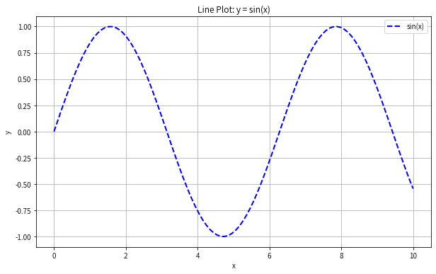

### 柱状图

```sql
categories = ["A", "B", "C", "D"]
values = [10, 15, 7, 12]

plt.figure(figsize=(8, 6))
plt.bar(categories, values, color="green", alpha=0.7)
plt.title("Bar Chart")
plt.xlabel("Categories")
plt.ylabel("Values")
plt.show()
```


### 散点图

```python
x = np.random.rand(50)
y = np.random.rand(50)
colors = np.random.rand(50)  # 颜色数据
sizes = 1000 * np.random.rand(50)  # 点的大小

plt.figure(figsize=(8, 6))
plt.scatter(x, y, c=colors, s=sizes, alpha=0.6, cmap="viridis")
plt.colorbar()  # 添加颜色条
plt.title("Scatter Plot")
plt.xlabel("x")
plt.ylabel("y")
plt.show()
```


### 饼图

```python
labels = ["A", "B", "C", "D"]
sizes = [15, 30, 45, 10]
colors = ["gold", "yellowgreen", "lightcoral", "lightskyblue"]
explode = (0.1, 0, 0, 0)  # 突出显示 A

plt.figure(figsize=(6, 6))
plt.pie(sizes, explode=explode, labels=labels, colors=colors, autopct="%1.1f%%", shadow=True, startangle=140)
plt.title("Pie Chart")
plt.show()
```

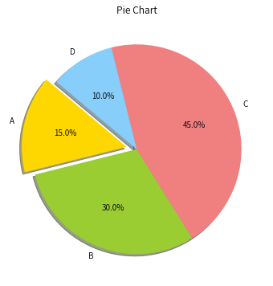

### 直方图

```python
data = np.random.randn(1000)

plt.figure(figsize=(8, 6))
plt.hist(data, bins=30, color="purple", alpha=0.7)
plt.title("Histogram")
plt.xlabel("Value")
plt.ylabel("Frequency")
plt.show()
```


## Seaborn

官网：http://seaborn.pydata.org/

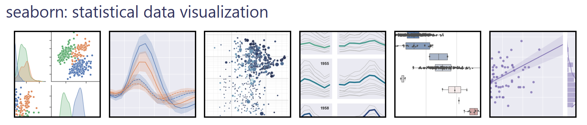

> - Seaborn 是一个基于matplotlib的 Python 数据可视化库，它建立在matplotlib之上，并与Pandas数据结构紧密集成，用于绘制有吸引力和信息丰富的统计图形的高级界面。
> - Seaborn 可用于探索数据，它的绘图功能对包含整个数据集的数据框和数组进行操作，并在内部执行必要的语义映射和统计聚合以生成信息图，其面向数据集的声明式 API可以专注于绘图的不同元素的含义，而不是如何绘制它们的细节。
> - Matplotlib 拥有全面而强大的 API，几乎可以根据自己的喜好更改图形的任何属性，seaborn 的高级界面和 matplotlib 的深度可定制性相结合，使得Seaborn既可以快速探索数据，又可以创建可定制为出版质量最终产品的图形。

### 散点图

```python
import seaborn as sns
import matplotlib.pyplot as plt
import numpy as np
import pandas as pd

# 创建一些示例数据
# 使用 Seaborn 自带的数据集
tips = sns.load_dataset('tips')
iris = sns.load_dataset('iris')

# 散点图
plt.figure(figsize=(8, 6))
sns.scatterplot(x='total_bill', y='tip', data=tips, hue='sex', style='smoker', palette='viridis')
plt.title('Scatter Plot: Total Bill vs Tip')
plt.show()
```

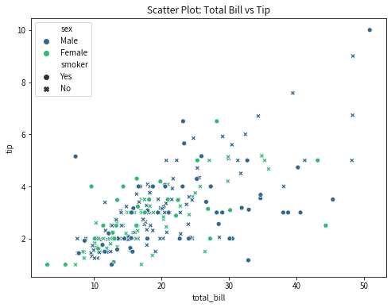

### 折线图

```python
# 折线图
plt.figure(figsize=(8, 6))
sns.lineplot(x='sepal_length', y='sepal_width', data=iris, hue='species', palette='Set1')
plt.title('Line Plot: Sepal Length vs Sepal Width')
plt.show()
```

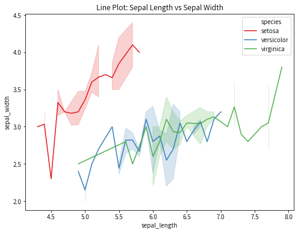

### 柱状图

```python
plt.figure(figsize=(8, 6))
sns.barplot(x='day', y='total_bill', data=tips, hue='sex', palette='coolwarm')
plt.title('Bar Plot: Total Bill by Day and Sex')
plt.show()
```

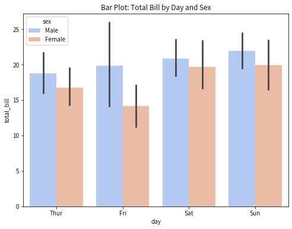

### 箱线图

```python
plt.figure(figsize=(8, 6))
sns.boxplot(x='day', y='total_bill', data=tips, hue='sex', palette='pastel')
plt.title('Box Plot: Total Bill by Day and Sex')
plt.show()
```

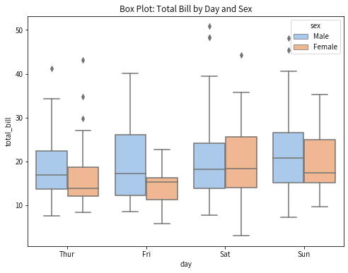

### 小提琴图

```python
plt.figure(figsize=(8, 6))
sns.violinplot(x='day', y='total_bill', data=tips, hue='sex', split=True, palette='muted')
plt.title('Violin Plot: Total Bill by Day and Sex')
plt.show()
```

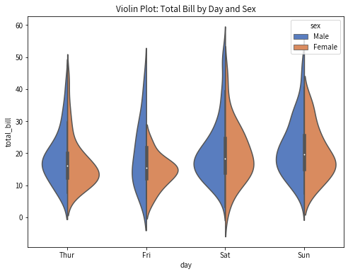

### 热力图

```python
plt.figure(figsize=(8, 6))
corr_matrix = iris.corr()
sns.heatmap(corr_matrix, annot=True, cmap='coolwarm', linewidths=0.5)
plt.title('Heatmap: Iris Correlation Matrix')
plt.show()
```

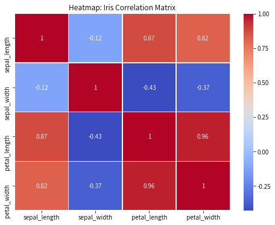

### 配对图

```python
sns.pairplot(iris, hue='species', palette='Set2')
plt.suptitle('Pair Plot: Iris Dataset', y=1.02)
plt.show()
```

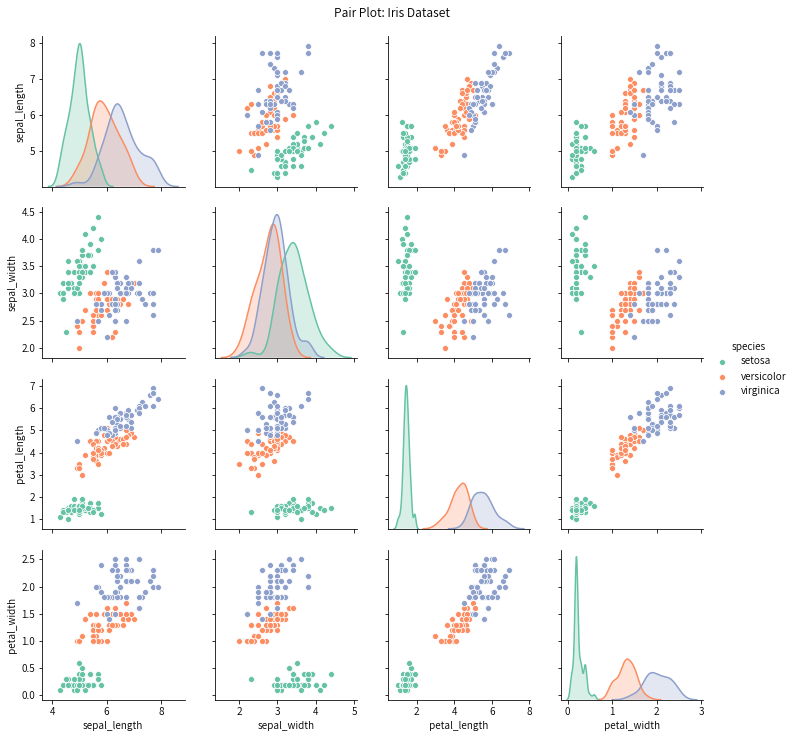

### 联合分布图

```python
plt.figure(figsize=(8, 6))
sns.jointplot(x='sepal_length', y='sepal_width', data=iris, kind='kde', cmap='Blues')
plt.suptitle('Joint Plot: Sepal Length vs Sepal Width', y=1.02)
plt.show()
```

<Figure size 576x432 with 0 Axes>

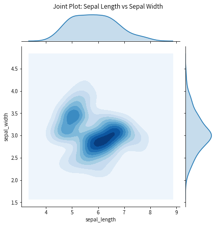

## Pyecharts

官网：https://pyecharts.org/#/


> - Echarts 是一个由百度开源的数据可视化，凭借着良好的交互性，精巧的图表设计，得到了众多开发者的认可。而 Python 是一门富有表达力的语言，很适合用于数据处理。当数据分析遇上数据可视化时，pyecharts 诞生了。
> 
> - Pyecharts具有简洁的 API 设计，使用如丝滑般流畅，支持链式调用，囊括了 30+ 种常见图表，应有尽有，支持主流 Notebook 环境，Jupyter Notebook 和 JupyterLab，拥有高度灵活的配置项，可轻松搭配出精美的图表。
> 
> - Pyecharts强大的数据交互功能，使数据表达信息更加生动，增加了人机互动效果，并且数据呈现效果可直接导出为html文件，增加数据结果交互的机会，使得信息沟通更加容易。

### 折线图

```python
from pyecharts.charts import Line, Bar, Pie, Map, Page
from pyecharts import options as opts
import random

# 创建一些示例数据
categories = ["A", "B", "C", "D", "E"]
values1 = [random.randint(10, 100) for _ in range(5)]
values2 = [random.randint(10, 100) for _ in range(5)]
pie_data = [("A", 30), ("B", 20), ("C", 15), ("D", 25), ("E", 10)]
map_data = [("广东", 90), ("北京", 80), ("上海", 70), ("浙江", 60), ("江苏", 50)]

# 折线图
line = (
    Line()
    .add_xaxis(categories)
    .add_yaxis("Series 1", values1)
    .add_yaxis("Series 2", values2)
    .set_global_opts(title_opts=opts.TitleOpts(title="Line Chart"))
)

line.render_notebook()
```

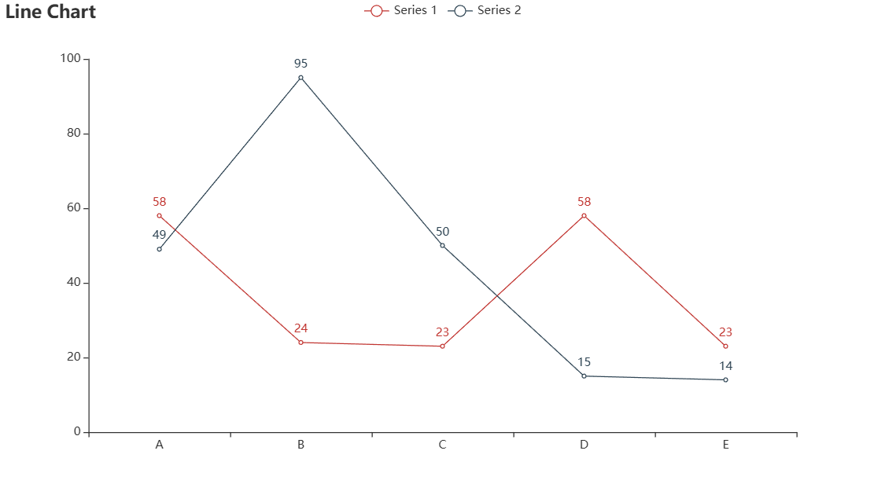

### 柱状图

```python
bar = (
    Bar()
    .add_xaxis(categories)
    .add_yaxis("Series 1", values1)
    .add_yaxis("Series 2", values2)
    .set_global_opts(title_opts=opts.TitleOpts(title="Bar Chart"))
)

bar.render_notebook()
```

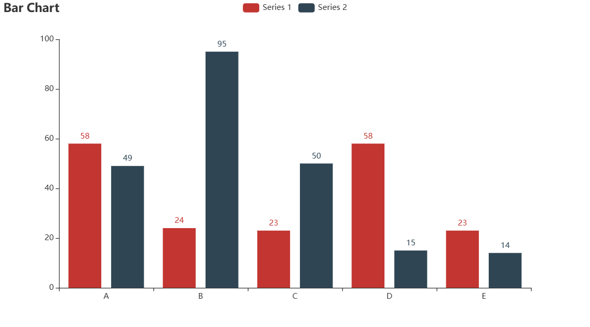

### 饼图

```python
pie = (
    Pie()
    .add("", pie_data)
    .set_global_opts(title_opts=opts.TitleOpts(title="Pie Chart"))
    .set_series_opts(label_opts=opts.LabelOpts(formatter="{b}: {c} ({d}%)"))
)

pie.render_notebook()
```

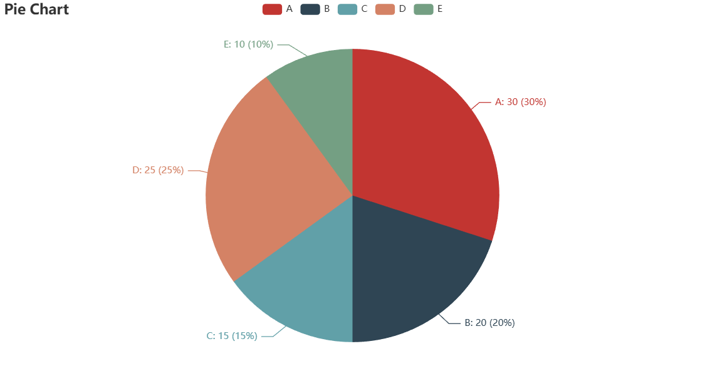

### 地图

```python
map_chart = (
    Map()
    .add("Map", map_data, "china")
    .set_global_opts(
        title_opts=opts.TitleOpts(title="Map Chart"),
        visualmap_opts=opts.VisualMapOpts(max_=100)
    )
)

map_chart.render_notebook()
```

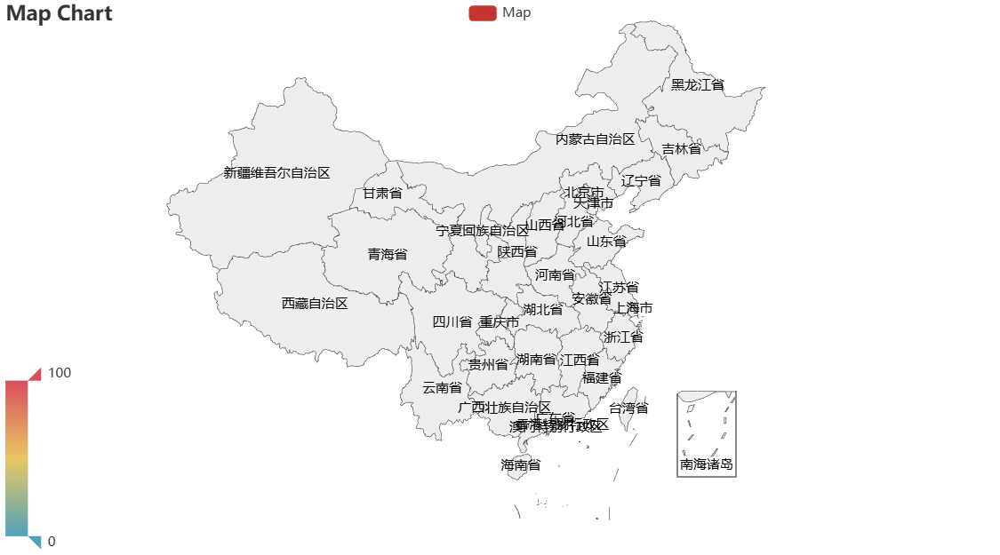

## wordcloud

> 绘制词云图，可以使用Python中的wordcloud库，首先，使用pip install wordcloud安装该库，导入文本数据后，创建一个WordCloud对象，设置词云图的背景颜色、宽度和高度，使用generate()方法将文本传递给词云对象，生成词云图，最后，使用imshow()方法将词云图显示出来，并使用axis()方法隐藏坐标轴。

```python
import matplotlib.pyplot as plt  
from wordcloud import WordCloud  
  
text = "This is some sample text for generating a word cloud."  
  
# 创建词云对象
wordcloud = WordCloud(background_color='white', width=800, height=600).generate(text)  
  
# 显示词云图
plt.figure(figsize=(9, 6))  
plt.imshow(wordcloud, interpolation='bilinear')  
plt.axis("off")  
plt.show()
```


## Faker

> **Faker库是一个很好的模拟生成数据的库**，在满足数据安全的情况下，使用Faker库最大限度的满足我们数据分析的测试需求，可以模拟生成文本、数字、日期等字段。
> 
> 导入Faker库可以用来模拟生成数据，其中，locale="zh_CN"用来显示中文，如下生成了一组包含姓名、手机号、身份证号、出生年月日、邮箱、地址、公司、职位这几个字段的数据。

In [49]:

```shell
pip install Faker -i https://mirrors.tuna.tsinghua.edu.cn/pypi/web/simple #从指定镜像下载安装工具包，镜像URL可自行修改
```

Looking in indexes: https://mirrors.tuna.tsinghua.edu.cn/pypi/web/simple

Collecting Faker

  Downloading https://mirrors.tuna.tsinghua.edu.cn/pypi/web/packages/36/e9/eb926239c310abc1502caffe651ac83e72a11c4cc9b9f8d9294be942758b/Faker-14.2.1-py3-none-any.whl (1.6 MB)

     |████████████████████████████████| 1.6 MB 1.1 MB/s            

Collecting typing-extensions>=3.7.4.3

  Downloading https://mirrors.tuna.tsinghua.edu.cn/pypi/web/packages/45/6b/44f7f8f1e110027cf88956b59f2fad776cca7e1704396d043f89effd3a0e/typing_extensions-4.1.1-py3-none-any.whl (26 kB)

Requirement already satisfied: python-dateutil>=2.4 in /opt/conda/lib/python3.6/site-packages (from Faker) (2.8.1)

Requirement already satisfied: six>=1.5 in /opt/conda/lib/python3.6/site-packages (from python-dateutil>=2.4->Faker) (1.15.0)

Installing collected packages: typing-extensions, Faker

  Attempting uninstall: typing-extensions

    Found existing installation: typing-extensions 3.7.4

    Uninstalling typing-extensions-3.7.4:

      Successfully uninstalled typing-extensions-3.7.4

Successfully installed Faker-14.2.1 typing-extensions-4.1.1

```python
#多行显示运行结果
from IPython.core.interactiveshell import InteractiveShell
InteractiveShell.ast_node_interactivity = "all"

from faker import Faker
faker=Faker(locale="zh_CN")#模拟生成数据

faker.name()
faker.phone_number()
faker.ssn()
faker.ssn()[6:14]
faker.email()
faker.address()
faker.company()
faker.job()
```

> '吴璐'
> 
> '14774329483'
> 
> '141027196511021567'
> 
> '19680331'
> 
> 'ehan@example.net'
> 
> '贵州省天津市西夏太原路J座 858106'
> 
> '雨林木风计算机科技有限公司'
> 
> '房地产店长/经理'

## PySimpleGUI

> 为了将代码的运行过程增加交互式操作，这里使用PySimpleGUI库开发一个图形界面；
> 
> - layout用于自定义窗口布局，
> - window用于定义整体的窗口界面，
> - while True: 循环运行，
> - 当满足特定的"事件"时，则返回具体的"值"，从而实现人机交互功能。

```shell
pip install PySimpleGUI -i https://mirrors.tuna.tsinghua.edu.cn/pypi/web/simple #从指定镜像下载安装工具包，镜像URL可自行修改
```

Looking in indexes: https://mirrors.tuna.tsinghua.edu.cn/pypi/web/simple

Collecting PySimpleGUI

  Downloading https://mirrors.tuna.tsinghua.edu.cn/pypi/web/packages/27/4a/e76d6d5786ec730639704347e3d8d286e4fb96c0874e3a4a141872c9e21e/PySimpleGUI-5.0.8-py3-none-any.whl (1.1 MB)

     |████████████████████████████████| 1.1 MB 1.2 MB/s            

Requirement already satisfied: rsa in /opt/conda/lib/python3.6/site-packages (from PySimpleGUI) (4.5)

Requirement already satisfied: pyasn1>=0.1.3 in /opt/conda/lib/python3.6/site-packages (from rsa->PySimpleGUI) (0.4.8)

Installing collected packages: PySimpleGUI

Successfully installed PySimpleGUI-5.0.8

```python
import PySimpleGUI as sg    
#自定义窗口布局，一共是两行，第一行用于查找需要合并Excel的文件目录，第二行点击开始合并按钮进行合并    
layout = [[sg.Text("请选择Excel文件所在目录："),sg.Input(size=(25, 1), enable_events=True, key="文件路径"),sg.FolderBrowse(button_text="浏览文件"),],
          [sg.Button('开始合并', enable_events=True, key="开始"),]
         ]    

window = sg.Window('批量数据合并：By大话数据分析', layout)#定义窗口    

while True:
    event, values = window.read()
    if event in (None,):
        break  #关闭用户界面
    elif event == "开始":
        if values["文件路径"]:
            print(values["文件路径"])
            sg.popup('数据合并已完毕！')
        else:
            sg.popup('请先输入Excel文件所在的路径！')    

window.close()    
```

如下将人机交互功能开发完毕，点击浏览文件，找到需要批量合并文件的文件夹目录，点击开始合并，即可输出结果，其中，values["文件路径"]输入的是需要合并Excel数据的文件路径，print打印出来的就是需要合并Excel数据的文件路径。


## pipenv

> 交互式的命令开发完毕，如何分享给别人使用？或者是别人的电脑上没有安装Python也能正常使用数据合并功能？这里给大家介绍Python程序打包，使用虚拟环境进行打包，在命令行输入如下命令下载pipenv包。

```shell
#使用虚拟环境压缩    
pip install pipenv -i https://pypi.tuna.tsinghua.edu.cn/simple    
```

使用快捷键Win+R键，然后输入CMD，输入pipenv shell命令，进入虚拟环境，没有虚拟环境的话会自动建立一个。

```shell
#Win+R输入CMD，进入虚拟环境，没有虚拟环境的话会自动建立一个    
pipenv shell
```

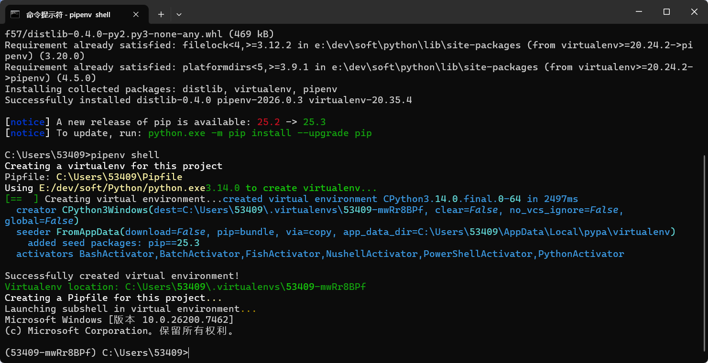

> 由于Python打包会将电脑安装的Python包全部打包，这里我们在虚拟环境中只安装Python程序涉及的模块，这样会减少打包的体积，注意xlrd==1.2.0下载低版本的包，默认安装的是高版本的，安装高版本的包在程序使用中会报错。

```shell
#只安装Python程序涉及的模块    
pip install pandas xlrd==1.2.0 id-validator PySimpleGUI pyinstaller -i https://pypi.tuna.tsinghua.edu.cn/simple    
```

将带有交互式命令的数据合并代码导出为.py文件，在命令行输入如下的打包命令，指定具体的路径即可打包。

```shell
#进行打包    
pyinstaller -F -w C:\Desktop\combine.py    
```

稍等几分钟，在Python的工作目录下看到一个dist文件，如果不知道自己的Python工作目录，可使用os.getcwd()命令查看。


该dist文件包含一个combine.exe程序，如下即为打包的程序。


## pandasql

> pandasql库可以在Python中写SQL，而且SQL语法在Python中完全支持，在Python中写SQL能够做到手写自如，导入pandasql库，SQL运行都需要借助pandasql库，我们使用的是sql.sqldf(""" *** """)命令，其中***就是你要写的SQL语句，写SQL不难，很容易入门，只要将SQL语句写入到括号内，即可实现数据查询。

```shell
!pip install pandasql -i https://mirrors.tuna.tsinghua.edu.cn/pypi/web/simple #从指定镜像下载安装工具包，镜像URL可自行修改
```

Looking in indexes: https://mirrors.tuna.tsinghua.edu.cn/pypi/web/simple

Requirement already satisfied: pandasql in /opt/conda/lib/python3.6/site-packages (0.7.3)

Requirement already satisfied: pandas in /opt/conda/lib/python3.6/site-packages (from pandasql) (0.24.2)

Requirement already satisfied: sqlalchemy in /opt/conda/lib/python3.6/site-packages (from pandasql) (1.3.5)

Requirement already satisfied: numpy in /opt/conda/lib/python3.6/site-packages (from pandasql) (1.16.3)

Requirement already satisfied: pytz>=2011k in /opt/conda/lib/python3.6/site-packages (from pandas->pandasql) (2019.1)

Requirement already satisfied: python-dateutil>=2.5.0 in /opt/conda/lib/python3.6/site-packages (from pandas->pandasql) (2.8.1)

Requirement already satisfied: six>=1.5 in /opt/conda/lib/python3.6/site-packages (from python-dateutil>=2.5.0->pandas->pandasql) (1.15.0)

```python
import pandasql as sql
```

导入pandasql库后，这里需要将电影的累计票房分为'超低票房'、'低票房'、'中等票房'、'高票房'、'超高票房'，使用case when进行分组，以end结尾，成功实现在pandas中使用case when查询，查询结果如下所示。

### 显示df

```python
In [61]:
import pandas as pd

# 创建示例数据
data = {
    "电影名称": ["电影A", "电影B", "电影C", "电影D", "电影E", "电影F", "电影G", "电影H"],
    "电影导演": ["导演1", "导演2", "导演3", "导演4", "导演5", "导演6", "导演7", "导演8"],
    "电影主演": ["主演1", "主演2", "主演3", "主演4", "主演5", "主演6", "主演7", "主演8"],
    "累计票房": [50000, 150000, 250000, 350000, 450000, 550000, 650000, None]  # 包含一个空值
}

# 创建 DataFrame
df = pd.DataFrame(data)

# 显示 DataFrame
df
```

电影名称        电影导演        电影主演        累计票房

0        电影A        导演1        主演1        50000.0

1        电影B        导演2        主演2        150000.0

2        电影C        导演3        主演3        250000.0

3        电影D        导演4        主演4        350000.0

4        电影E        导演5        主演5        450000.0

5        电影F        导演6        主演6        550000.0

6        电影G        导演7        主演7        650000.0

7        电影H        导演8        主演8        NaN

### SQL 

```python
#对电影的累计票房使用CASE WHEN分组
sql.sqldf("""select 电影名称,电影导演,电影主演,累计票房,
case
when 累计票房 < 100000 then '超低票房'
when 累计票房 < 200000 then '低票房'
when 累计票房 < 300000 then '中等票房'
when 累计票房 < 400000 then '高票房'
else '超高票房'
end 
as '电影票房分组' from df
where 累计票房 is not null;""")
```

电影名称        电影导演        电影主演        累计票房        电影票房分组

0        电影A        导演1        主演1        50000.0        超低票房

1        电影B        导演2        主演2        150000.0        低票房

2        电影C        导演3        主演3        250000.0        中等票房

3        电影D        导演4        主演4        350000.0        高票房

4        电影E        导演5        主演5        450000.0        超高票房

5        电影F        导演6        主演6        550000.0        超高票房

6        电影G        导演7        主演7        650000.0        超高票房

> 以上总结了Python一些常用的库，在学习过程中可以实践一下，提升自己的Python应用能力。