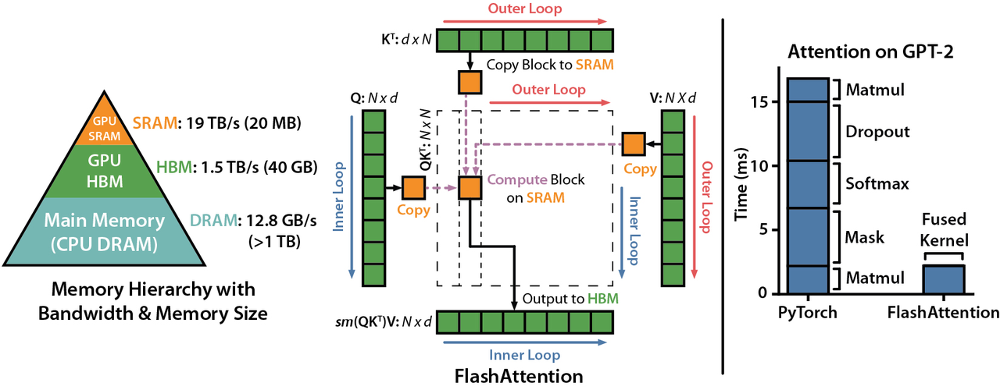
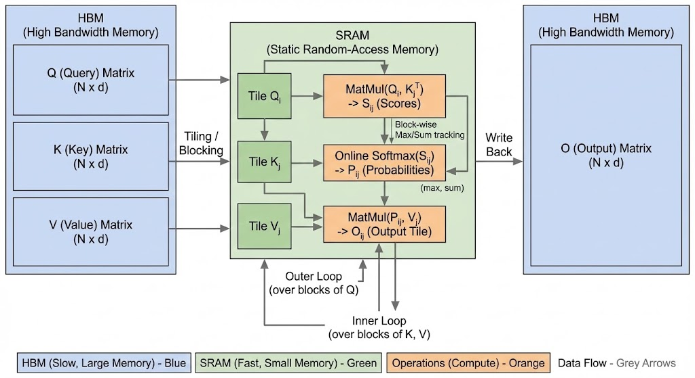
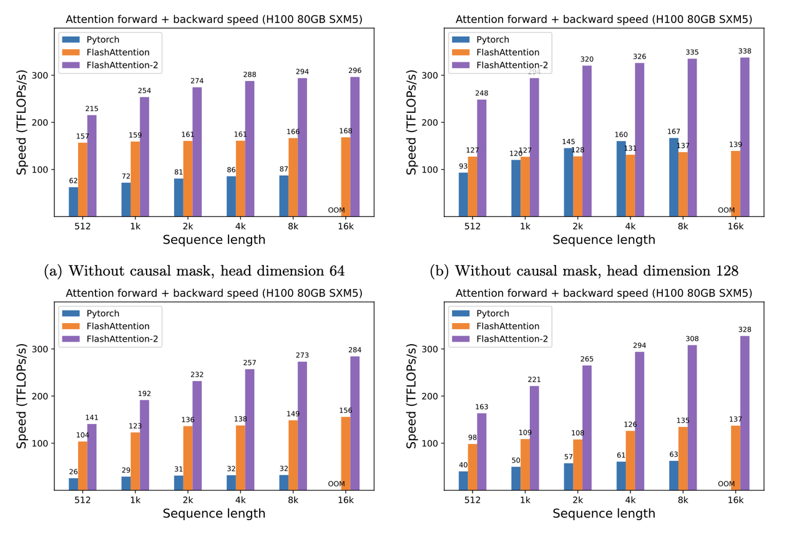

# 2. 什么是 Flash Attention

## Flash Attention 的核心定义与技术背景



Flash Attention 是由斯坦福大学学者在 2022 年提出的注意力机制优化技术，其核心目标是解决标准自注意力机制在长序列处理时的内存瓶颈与计算低效问题。随着 GPT 等大模型序列长度从 512token 扩展至 4096+token，标准注意力的 O (n²) 复杂度导致 GPU 显存占用呈平方级增长，例如处理 4096token 序列时注意力矩阵规模可达 1600 万 ×1600 万，传统实现方式在 H100 显卡上会因显存不足导致训练崩溃。

---

## 技术原理：从内存访问优化到计算重构



1. GPU 存储架构的性能瓶颈

现代 GPU（如 A100/H100）存储层次存在显著性能差异：

- HBM 显存：容量达 80GB+，但访问带宽约 2TB/s
- SRAM 缓存：容量仅数 MB，访问带宽超 10TB/s

标准注意力计算流程：

```plain text
HBM读取Q/K/V矩阵 → SRAM计算注意力分数 → HBM写入中间结果
```

该过程中数据在 HBM 与 SRAM 间的频繁搬运成为性能瓶颈，尤其当序列长度 n>2048 时，数据搬运耗时占比超 70%。

1. 分块计算（Tiling）技术详解

Flash Attention 采用棋盘式分块策略，将注意力矩阵划分为 B×B 大小的子块（典型 B=256）：

1. **行分块处理**：将 Q 矩阵按行划分为多个块，每次仅加载一个 Q 块至 SRAM
2. **列并行计算**：K/V 矩阵按列分块，与 Q 块进行矩阵乘法
3. **流水线调度**：前一个 Q 块计算时，后一个 Q 块已开始数据加载

以 n=4096 为例，标准注意力需一次性加载 4096×4096 的矩阵至显存，而 Flash Attention 通过分块将显存占用降至 (4096×256)，实现 16 倍内存优化。

1. 重计算（Recomputation）策略

传统反向传播需存储前向计算的中间激活值，Flash Attention 通过动态重计算技术：

- 前向传播时不存储注意力权重矩阵
- 反向传播时根据 Q/K/V 重新计算梯度
- 内存占用从 O (n²) 降至 O (n)，在 n=8192 时可减少 90% 显存占用

---

## 核心优化技术深度解析

1. 内存访问模式优化

Flash Attention 通过以下策略减少数据搬运：

- **合并访存**：将 Q/K/V 的分散读取合并为连续内存访问
- **缓存复用**：同一 K/V 块为多个 Q 块服务时复用 SRAM 缓存
- **异步调度**：计算与数据搬运重叠执行，隐藏 IO 延迟

在 A100 显卡上，标准注意力的实际带宽利用率仅 30%，而 Flash Attention 通过优化可将带宽利用率提升至 75% 以上。

1. 数值稳定性保障

为解决分块计算中的数值精度问题，Flash Attention 采用：

- **块级 softmax**：对每个分块独立计算 softmax，避免跨块数值溢出
- **累加归一化**：分块计算的注意力值累加后再归一化
- **混合精度支持**：前向计算用 FP16，反向传播用 FP32 保证梯度精度

实验表明，在 n=2048 时 Flash Attention 与标准实现的困惑度差异小于 0.5%，确保训练精度不受影响。

---

## 技术优缺点与适用场景



### 优势特性：

1. **内存效率提升**：
  - 长序列场景下显存占用降低 4-20 倍
  - 支持训练序列长度从 512 扩展至 16384+
2. **计算性能飞跃**：
  - H100 显卡上 FP16 计算吞吐量从 62TFlops 提升至 215TFlops
  - 端到端训练速度提升 2-4 倍，4096token 序列训练时间从 8 小时缩短至 3 小时
3. **硬件兼容性**：
  - 原生支持 NVIDIA Ampere/Hopper 架构 GPU
  - 通过 TRT-LLM 等优化库可部署于生产环境

### 应用限制：

1. **实现复杂度**：
  - 需要 CUDA 编程深度优化，非专业开发者难以自行实现
  - PyTorch 原生支持有限，需依赖第三方库（如 flash-attn-2）
2. **硬件依赖性**：
  - 在 V100 等旧架构 GPU 上加速效果仅 1.5 倍左右
  - CPU 环境下无法发挥优化效果
3. **调试挑战**：
  - 重计算机制导致梯度调试工具失效
  - 分块策略可能引入难以定位的数值误差

---

## 性能实测与技术演进

1. 典型硬件性能对比（n=512）：

| 实现方式 | 计算吞吐量 | 显存占用 | 加速比 |
| --- | --- | --- | --- |
| PyTorch 标准实现 | 62 TFlops | 4.2GB | 1.0x |
| Flash Attention 1 | 157 TFlops | 1.1GB | 2.5x |
| Flash Attention 2 | 215 TFlops | 0.8GB | 3.5x |

1. 序列长度扩展能力：

在 H100 80GB 显存条件下：

- 标准注意力最大支持 n=2048
- Flash Attention 2 可支持 n=16384（显存占用 12GB）

1. 技术迭代路径：

- v1 版本（2022）：基础分块与重计算
- v2 版本（2023）：
  - 支持旋转位置编码（RoPE）
  - 引入斜向分块（Slanted Tiling）优化长上下文
  - 集成 Tensor Cores 张量并行计算