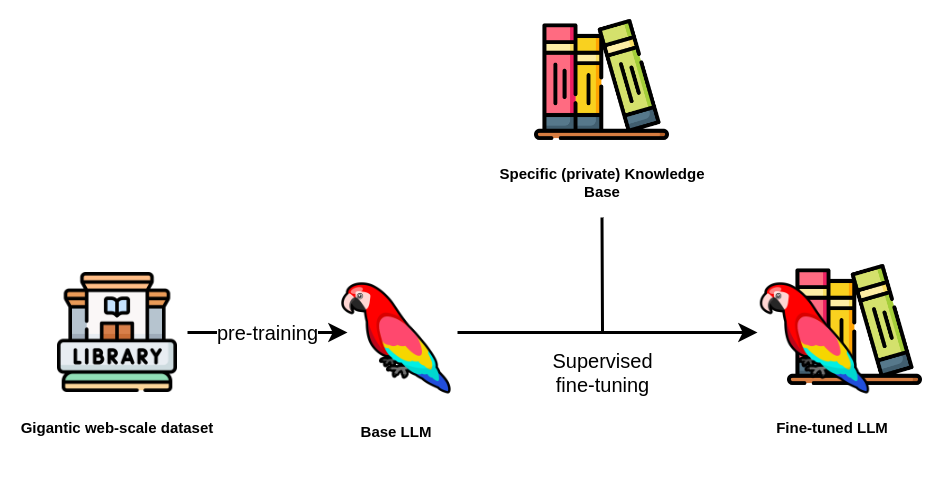
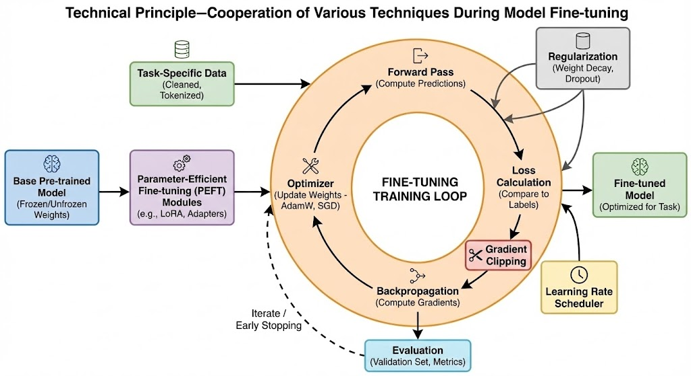

# 6. 什么是模型微调

> LLM 微调 (Fine-tuning) 是一种通过特定领域数据对预训练语言模型进行二次训练的技术。目的是在保持模型通用语言理解能力的基础上，使其适应特定任务或领域。通过微调技术，基础模型可以显著提升在目标领域（如医疗、法律、金融等）的表现。

## 微调过程

典型微调流程包括以下步骤：

- 选择基础模型：使用预训练好的通用语言模型（如 Qwen、DeepSeek 等）作为起点
- 准备领域数据：收集与目标领域相关的标注数据集
- 调整超参数(Hyperparameters)：设置合适的学习率、训练轮次等参数（通常比预训练时更小, 这些都是超参数）
- 领域适应训练：在保持原有参数的基础上，用领域数据继续训练模型
- 评估验证：通过领域特定的评估指标检验微调效果
- 迭代上述过程来获得更好的结果直到满意

---

## 微调的优点

- 显著提升特定任务/领域表现
- 数据效率高（相比从头训练）
- 计算资源需求相对较少
- 灵活性高（可针对不同场景定制）

---

## 微调可能存在的问题

- 过拟合风险：过度适配训练数据可能导致泛化能力下降
- 领域依赖：在非目标领域表现可能下降
- 需要领域专业知识：数据准备和评估指标设计需要领域知识
- 计算资源需求：虽然比预训练少，但仍需要可观资源

---

## 为什么要微调

我们平常接触到的大模型如 GPT、DeepSeek 等都是基于海量的通用数据训练而成的，它们具备非常强大的语言理解和生成能力，能够处理多种自然语言任务。但是，这些模型在某些特定领域或任务上的表现可能并不理想，或者说还能够做到表现的更好。下面是需要微调的几个主要原因：

**领域专业化：让模型掌握“行业黑话”**

- **原因**：通用模型的训练数据覆盖面广，但难以深入垂直领域的知识体系和专业术语。例如医学诊断需理解病理特征，法律咨询需熟悉法条逻辑。当模型在专业领域认知不够时，会出现比较严重的幻觉问题，也就是胡乱回答，微调可以很好的解决这个问题
- **典型场景**：
  - **医学问答**：输入症状描述，模型需结合医学知识库输出可信的初步诊断建议。
  - **法律咨询**：分析“未成年人合同效力”时，需准确引用《民法典》相关条款。

**任务适配：调整模型的“输出模式”**

- **原因**：不同任务对模型能力的要求差异显著——分类任务需结构化输出，生成任务需语言创造力。
- **典型场景**：
  - **文案生成**：训练模型以幽默风格撰写广告文案（如“这杯咖啡，比老板的早安更提神”）。
  - **心理咨询**：从“情绪识别”转向“疏导对话”，需调整输出为引导性提问而非结论性判断。

**能力纠偏：解决模型的“偏科问题”**

- **原因**：通用模型可能对某些任务过度敏感（如政治倾向）或表现不足（如冷门领域的长尾问题）。
- **典型场景**：
  - **民俗推理**：输入生辰八字与手相特征时，模型需按传统命理逻辑生成连贯解释，而非套用通用话术。
  - **边缘案例**：处理“宠物能否继承遗产”时，需结合继承法细则而非泛泛回答。

安全与优势：

- **数据安全**：当训练数据涉及隐私（如患者病历、企业内部文档）时，本地化微调可避免云端传输风险。
- **成本效率**：相比从头训练（需百万级算力），微调仅需少量领域数据即可显著提升任务表现，适合中小规模企业。