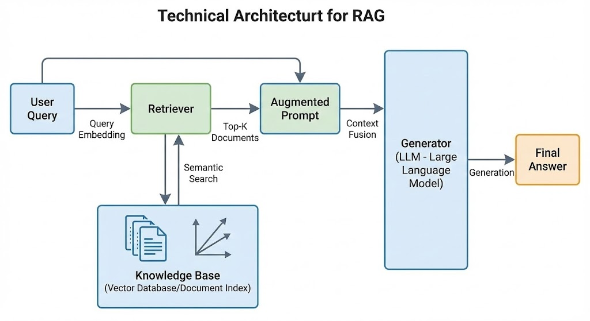

# 7. 什么是RAG

## RAG 的核心定义

RAG (Retrieval-Augmented Generation) 即检索增强生成技术，是大语言模型领域解决事实性问题的重要方案。随着 GPT 等预训练模型参数规模突破万亿，模型生成能力显著提升，但训练数据截止性与知识更新滞后问题日益凸显。RAG 通过动态检索外部知识库，使模型在推理时能获取最新信息，形成 "预训练模型 + 动态知识库" 的混合架构，从根本上解决传统 LM 的 "知识截止" 与 "事实幻觉" 问题。

## 技术架构与工作流程

系统组成与交互流程：

标准 RAG 系统由四大核心模块构成：

### 检索模块技术实现

- **向量检索 (Embedding-based Retrieval)**：
  - 使用 SBERT、CLIP 等模型将查询与文档编码为高维向量
  - 通过余弦相似度或内积计算相关性，典型如 FAISS 索引
  - 支持分布式检索架构，处理 TB 级文档库
- **语义检索 (Semantic Retrieval)**：
  - 结合 BM25 词袋模型与向量检索的混合检索
  - 引入查询扩展技术，如同义词扩展、实体链接
  - 支持结构化数据检索，如知识图谱关联查询

### 文档重排序模块

- **重排序模型**：
  - 基于 BERT 的交叉编码器 (cross-encoder) 架构
  - 输入 (query, document) 对，输出相关性分数
  - 常用模型：ANCE、ColBERT、DPR
- **重排序策略**：
  - 级联检索 (cascade retrieval)：先粗筛后精排
  - 多阶段重排序：向量检索→BM25→重排序模型

### 上下文构建技术

- **文档切分策略**：
  - 滑动窗口切分：固定窗口大小 + 重叠率
  - 语义切分：基于段落、章节或语义单元切分
  - 智能切分：结合关键信息密度动态调整切分点
- **上下文融合技术**：
  - 简单拼接：[query][document1][document2]...
  - 分层融合：query 与各文档独立交互后聚合
  - 动态权重：根据文档相关性分配融合权重

### LLM 生成优化

- **提示工程 (Prompt Engineering)**：
  - 系统提示 (System Prompt)：指定回答格式、角色
  - 示例提示 (Example Prompt)：提供 Few-Shot 示例
  - 动态提示：根据检索结果生成自适应提示
- **生成控制技术**：
  - 温度参数调节：控制生成随机性
  - 最大长度限制：避免生成冗余内容
  - 重复惩罚：抑制重复内容生成