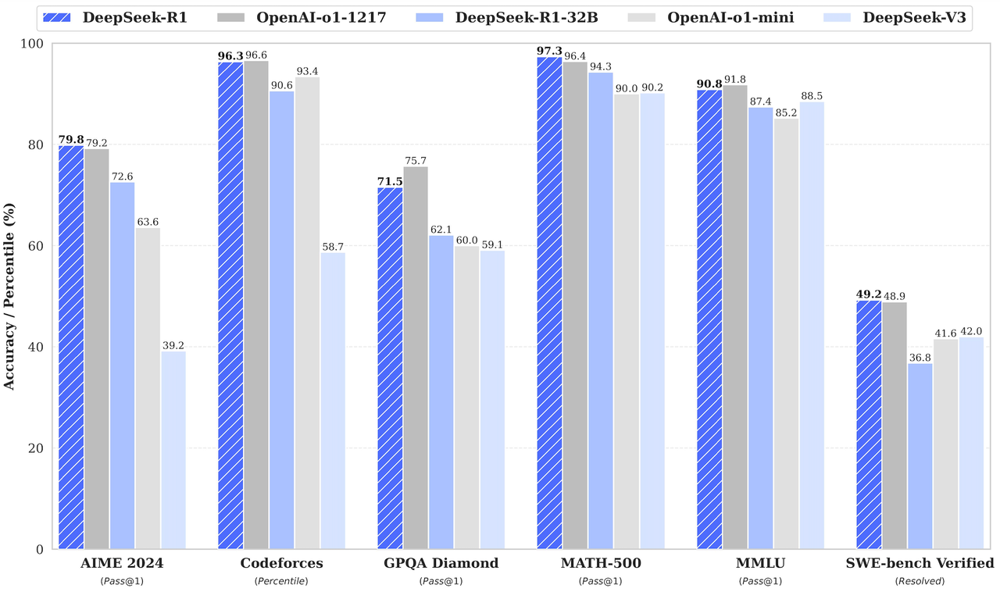

# 1. 本地部署优势与局限

## 为什么需要本地部署

- **免费**：本地的模型部署随便玩，不用担心任何付费，你只需要投入一个好设备就行。
- **数据隐私**：当我们使用云端的大模型时，所有的数据都需要上传到服务器进行处理。这就意味着我们的数据可能会被其他人访问或泄露。如果你要做一些对敏感数据的分析任务，比如公司内网的数据和代码，都需要担心数据泄漏的问题，很多公司也有明确的限制不能将敏感数据泄露给外部模型。而本地部署大模型则可以完全避免这个问题，因为所有的数据都存储在本地，不会上传到云端。
- **无额外限制**：网络上的大模型通常为了符合法律法规以及自身的运营策略，往往会设置严格的内容审查机制。所以在某些敏感话题上，模型的回答会受到限制，即模型给出的回答是基于预设的价值观和规则，而非纯粹基于数据和算法逻辑。而本地部署的模型在内容输出方面相对更加自由，不会有任何内容审查和思想钢印。（当然，就算如此也不推荐大家问不该问的🤫）
- **无需网络依赖**：本地部署的模型无需网络依赖，你可以在没有网络连接的情况下随时使用，不受网络环境的限制，可以实现24/7的不间断运行，
- **灵活定制**：网上也有很多提供知识库能力的服务，但是因为有数据泄漏的问题，我们可能不敢上传敏感数据，而且一般此类服务都是收费的。本地部署大模型后，我们可以利用自己的数据集对模型进行微调，打通自己的知识库，使其更贴合特定领域的应用，比如编程、法律、财经、科研等领域。通过定制化，模型能够给出更精准、更符合需求的回答和解决方案，提升应用效果。
- **性能和效率**：云端的大模型在处理大量请求时，可能会出现卡顿、延迟等问题。比如 `DeepSeek` 不管是因为网络攻击，还是单纯的调用量大，都会频繁出现服务异常，非常影响使用体验。而本地部署的大模型则可以充分利用本地的硬件资源，如 CPU、GPU 等，从而提高处理速度和效率。此外，本地部署的大模型还可以避免网络延迟的问题，让我们能够更快地得到结果。

## DeepSeek 的满血版和蒸馏版本

本地部署也有一个比较大的局限性，就是 **很吃设备的配置**。

一般我们普通的电脑肯定是带不起来 “满血版“ 的 `DeepSeek-R1` 模型的，所以本地部署的 `DeepSeek-R1` 通常都是 “蒸馏版”。

> 满血版指的是 `DeepSeek` 的完整版本，通常具有非常大的参数量。例如，`DeepSeek-R1` 的满血版拥有 `6710` 亿个参数。这种版本的模型性能非常强大，但对硬件资源的要求极高，通常需要专业的服务器支持。例如，部署满血版的 `DeepSeek-R1` 至少需要 `1T 内存和双 H100 80G` 的推理服务器。
> 
> 而蒸馏版本是通过知识蒸馏技术从满血版模型中提取关键知识并转移到更小的模型中，从而在保持较高性能的同时，显著降低计算资源需求。蒸馏版本的参数量从 `1.5B` 到 `70B` 不等，比如以下几种变体：
> 
> - DeepSeek-R1-Distill-Qwen-1.5B
> - DeepSeek-R1-Distill-Qwen-7B
> - DeepSeek-R1-Distill-Qwen-14B
> - DeepSeek-R1-Distill-Qwen-32B
> - DeepSeek-R1-Distill-Llama-8B
> - DeepSeek-R1-Distill-Llama-70B
> 
> `DeepSeek-R1` 是主模型的名字；`Distill` 的中文含义是 “蒸馏”，代表这是一个蒸馏后的版本；而后面跟的名字是从哪个模型蒸馏来的版本，例如 `DeepSeek-R1-Distill-Qwen-32B` 代表是基于阿里的开源大模型千问（Qwen）蒸馏而来；最后的参数量（如 671B、32B、1.5B）：表示模型中可训练参数的数量

> `“B”` 代表 `“Billion”` ，即十亿。因此，`671B、32B、1.5B` 分别表示模型的参数量为 6710亿、320亿和15亿。），参数量越大，模型的表达能力和复杂度越高，但对硬件资源的需求也越高

这些蒸馏版本在推理任务上表现也很出色，例如 `DeepSeek-R1-Distill-Qwen-32B` 在 `AIME 2024` 上的 `Pass@1` 达到 `72.6%`。以下是 `DeepSeek R1` 满血版、`OPENAI-O1`、`DeepSeek R1` 32B 参数蒸馏版，以及 `DeepSeek V3` 版本的基准测试结果：

可以发现 32B 蒸馏版和满血版其实相差也不是很大。

当然，如果你有条件的话，直接部署 `DeepSeek R1` 满血版也不是不可能，这个硬件配置就不是一般人能负担的起的了，国内的主要云服务厂商比如阿里云、腾讯云、火山引擎目前都提供了私有化部署 `DeepSeek R1` 的方案，其实本质上还是在卖设备。