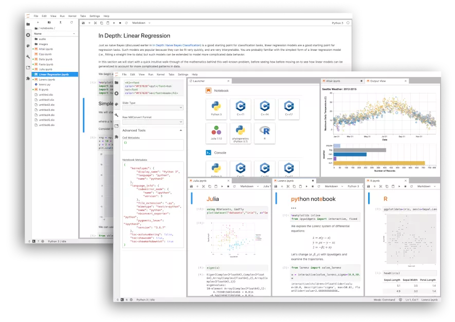
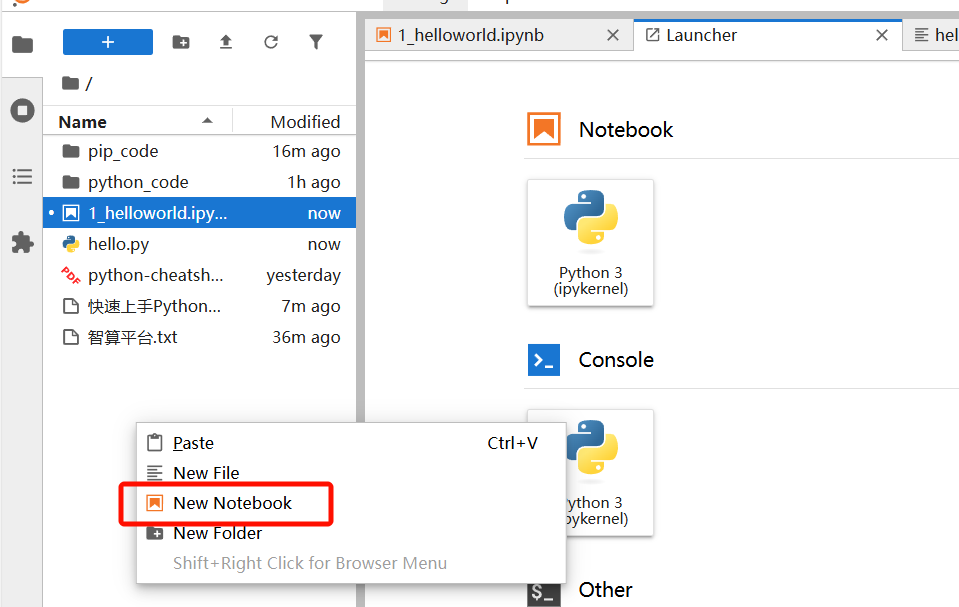
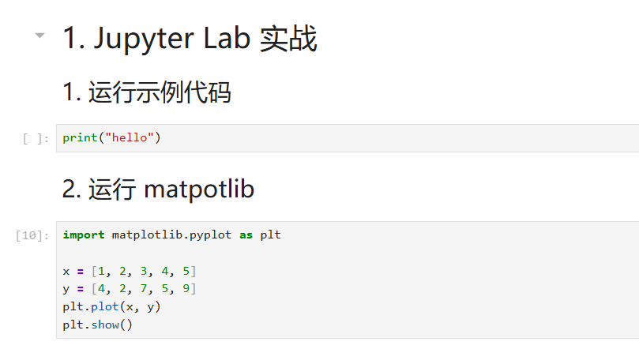
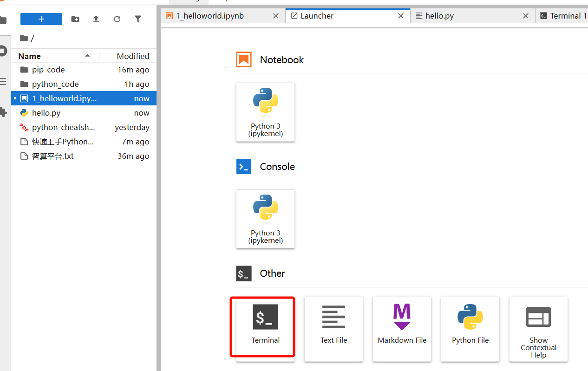
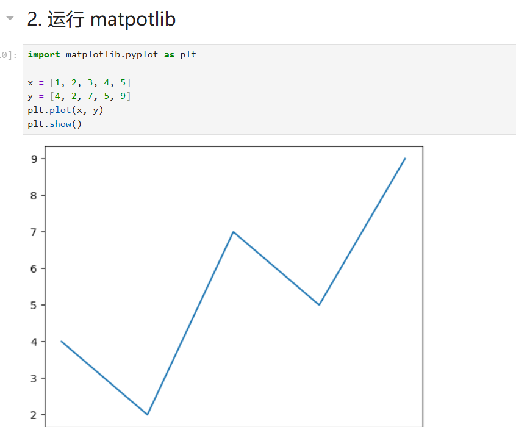

# 2. Jupyter Lab

> JupyterLab是最新款基于网络的笔记本、代码和数据交互式开发环境。其灵活的界面允许用户配置和安排数据科学、科学计算、计算新闻和机器学习中的工作流程。模块化设计鼓励扩展以扩展和丰富功能。



# 本地安装

https://jupyter.org/install

```shell
# 安装
pip install jupyterlab

# 启动
jupyter lab
```

# 测试使用

## 指定workspace

启动 jupyter lab 的时候，进入指定文件夹，再cmd，启动 `jupyter lab`

这样，这个文件夹，就是当前的工作空间，以后打包这个文件夹进行分享即可

## 创建笔记本



## 编写笔记



## 运行命令

1. 笔记内：使用!命令；


1. 开终端，运行命令



## 运行代码

