# 4. HuggingFace

> 在人工智能开发领域，Hugging Face 已成为一个不可或缺的平台，它让开发者能够轻松调用数百个预训练模型，快速实现各种NLP和CV任务。本文深入探索Hugging Face生态系统，掌握用极少代码实现强大AI能力的技巧。

# Hugging Face：AI模型的"GitHub"

Hugging Face 是一个用于分享和使用机器学习模型的平台，提供了一个开放的模型共享社区。它不仅提供丰富的预训练模型、强大的工具库，还构建了一个活跃的技术社区。与传统科技公司的封闭产品不同，Hugging Face采用去中心化的运作模式，研究人员、企业和独立开发者共同为一个共享的基础设施贡献力量。

## 核心组件介绍

Hugging Face生态系统主要由以下几个核心组件构成：

1. **Transformers库**：提供了大量主流NLP模型【自然语言处理(Natural Language Processing)】（如BERT、GPT、T5等）的统一接口
2. **Datasets库**：提供标准化的数据集接口，支持在线加载、缓存、切片等操作
3. **Tokenizers库**：提供高性能的分词器，支持多种分词算法
4. **Hub平台**：作为模型仓库，用户可以上传、下载、版本化模型

## 使用算力平台

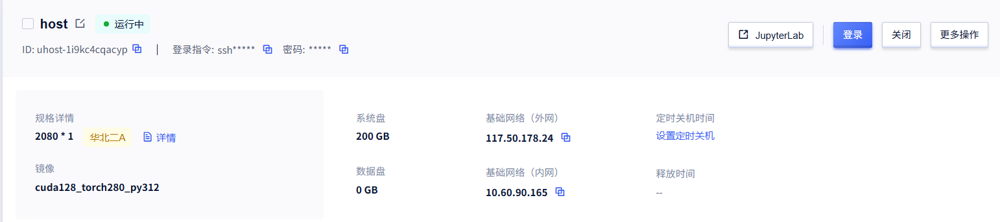

# 环境配置与安装

在开始之前，我们需要配置好开发环境。Hugging Face库主要支持Python语言，虽然通过API也可以在JavaScript、Ruby等其他语言中使用Hugging Face的模型，但Python是最原生的支持。

## 虚拟环境

| 工具名称 | 类型 | Python版本支持 | 安装方式 | 特点 | 适用场景 |
| --- | --- | --- | --- | --- | --- |
| venv（推荐） | 内置模块 | ≥ 3.3 | 无需安装，内置 | 轻量级、官方推荐、使用简单 | 通用开发、日常项目 |
| virtualenv | 第三方工具 | 2.x 和 3.x | pip install virtualenv | 功能丰富、兼容多版本 | 需要兼容旧版本或高级功能 |
| conda | Anaconda自带 | 2.x 和 3.x | 随 Anaconda/Miniconda 安装 | 跨语言包管理、数据科学生态 | 数据科学、机器学习项目 |

### 创建环境

> 创建环境： python -m venv 环境名称
> `python -m venv .venv`

### 激活环境


## 安装依赖

```yaml
# 安装核心库
pip install transformers datasets tokenizers

# 安装开发工具
pip install huggingface_hub

# 配置镜像
Linux【export HF_ENDPOINT="https://hf-mirror.com"】
Windows【set HF_ENDPOINT=https://hf-mirror.com】
```

## 验证安装

```python
import transformers
print(f"Transformers版本: {transformers.__version__}")

import datasets
print(f"Datasets版本: {datasets.__version__}")
```

# Transformers库核心用法

## Pipeline API

Pipeline是Hugging Face中最简单且强大的API，它将复杂的模型调用流程简化为端到端的处理过程**。一个完整的模型应用通常包含三个关键组件：分词器(Tokenizer)、模型本身(Model)和后处理器(Post-processor)**，Pipeline技术将这三大组件有机整合，形成统一接口

## 案例 - 情感分类

### 基本用法

```sql
from transformers import pipeline

# 方法1：明确指定模型名称
classifier = pipeline(
    'sentiment-analysis',
    model='distilbert/distilbert-base-uncased-finetuned-sst-2-english'
)

result = classifier("I love using Hugging Face libraries!")
print(result)
```

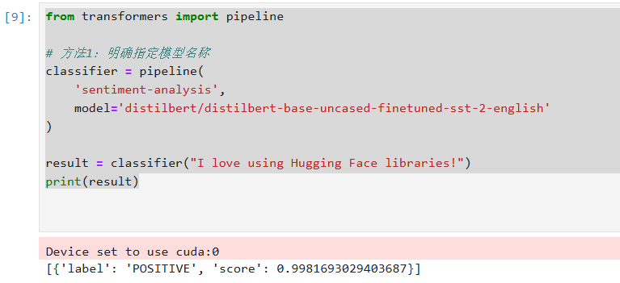

### 使用中文情感分析模型

```sql
from transformers import pipeline

# 如果需要中文情感分析
classifier = pipeline(
    'sentiment-analysis',
    model='uer/roberta-base-finetuned-jd-binary-chinese'
)

result = classifier("理想很丰满")
print(result)

```

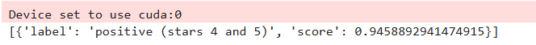

### 本地缓存模型

> 避免重复下载

```sql
from transformers import pipeline
import os

# 设置缓存目录
os.environ['TRANSFORMERS_CACHE'] = './model_cache'

classifier = pipeline(
    'sentiment-analysis',
    model='distilbert/distilbert-base-uncased-finetuned-sst-2-english'
)

result = classifier("I love using Hugging Face libraries!")
print(result)

```

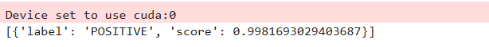

### 处理多个文本

```python
from transformers import pipeline
import os

# 设置缓存目录
os.environ['TRANSFORMERS_CACHE'] = './model_cache'
classifier = pipeline(
    'sentiment-analysis',
    model='distilbert/distilbert-base-uncased-finetuned-sst-2-english'
)

# 批量处理
texts = [
    "I love using Hugging Face libraries!",
    "This is terrible.",
    "Not bad, could be better."
]

results = classifier(texts)
for text, result in zip(texts, results):
    print(f"Text: {text}")
    print(f"Result: {result}")
    print("-" * 50)

```

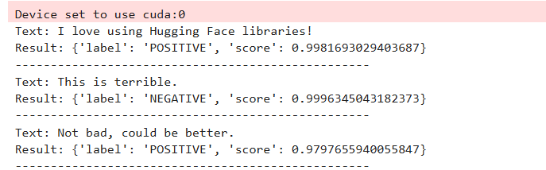

### 返回所有标签概率

```sql
from transformers import pipeline
import os

# 设置缓存目录
os.environ['TRANSFORMERS_CACHE'] = './model_cache'

classifier = pipeline(
    'sentiment-analysis',
    model='distilbert/distilbert-base-uncased-finetuned-sst-2-english',
    return_all_scores=True  # 返回所有标签的概率
)

result = classifier("I love using Hugging Face libraries!")
print(result)
```

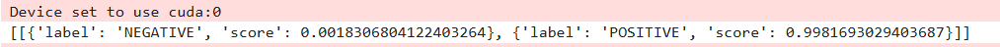

## 支持的任务类型

Hugging Face的Pipeline支持多种NLP和CV任务，包括但不限于：

1. 文本分类（sentiment-analysis）
2. 文本生成（text-generation）
3. 问答系统（question-answering）
4. 命名实体识别（ner）
5. 摘要生成（summarization）
6. 机器翻译（translation）
7. 图像分类（image-classification）
8. 目标检测（object-detection）

# 实战案例

## 自然语言处理

### 文本分类

#### 默认模型

> 不指定模型就是使用如下默认模型

```python
from transformers import pipeline
import os

# 设置缓存目录
os.environ['TRANSFORMERS_CACHE'] = './model_cache'
# 创建文本分类pipeline
classifier = pipeline("text-classification",
                     model='distilbert/distilbert-base-uncased-finetuned-sst-2-english'
                     )

# 分析文本情感
result = classifier("This movie is absolutely fantastic! The acting was superb.")
print(result)
```

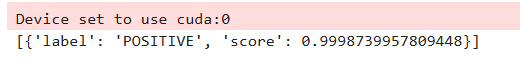

#### 其他模型

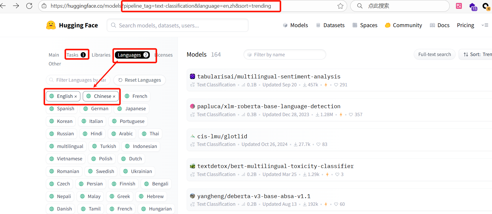

```python
from transformers import pipeline
import os

# 设置缓存目录
os.environ['TRANSFORMERS_CACHE'] = './model_cache'
# Load the classification pipeline with the specified model
pipe = pipeline("text-classification", 
    model="tabularisai/multilingual-sentiment-analysis",
    return_all_scores=True  # 返回所有标签的概率
    )

# Classify a new sentence
sentence = "I love this product! It's amazing and works perfectly."
result = pipe(sentence)

# Print the result
print(result)

```

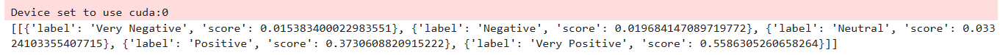

#### 手动下载模型

https://github.com/huggingface/huggingface_hub/blob/main/i18n/README_cn.md

```python
pip install huggingface_hub
```

##### 下载单个文件

下载单个文件,请运行以下代码：

```python
from huggingface_hub import hf_hub_download

hf_hub_download(repo_id="tiiuae/falcon-7b-instruct", 
    filename="config.json")
```

##### 下载整个存储库

如果下载整个存储库，请运行以下代码：

```python
from huggingface_hub import snapshot_download
snapshot_download("tabularisai/multilingual-sentiment-analysis")
```

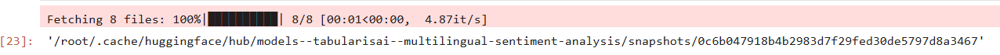

文件将被下载到本地缓存文件夹。更多详细信息请参阅此 [<u>指南</u>](https://huggingface.co/docs/huggingface_hub/en/guides/manage-cache).

##### 下载指定位置

```python
from huggingface_hub import snapshot_download
import os

# 设置本地模型存储路径
local_model_path = "./models/distilbert-sentiment"

# 下载模型
model_path = snapshot_download(
    repo_id="distilbert/distilbert-base-uncased-finetuned-sst-2-english",
    local_dir=local_model_path,
    local_dir_use_symlinks=False  # 不使用符号链接，直接复制文件
)

print(f"模型已下载到: {model_path}")

```

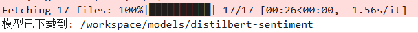

#### 加载本地模型

##### 下载

```python
from huggingface_hub import snapshot_download

local_model_path = "./models/finbert"
model_path = snapshot_download(
    repo_id="ProsusAI/finbert",
    local_dir=local_model_path,
    local_dir_use_symlinks=False # 不使用符号链接，直接复制文件
)
print(f"模型已下载到: {model_path}")
```

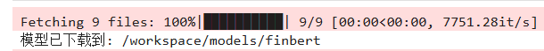

##### 使用本地模型

```python
from transformers import pipeline
import os

# 使用本地模型
local_model_path = "./models/finbert"

if os.path.exists(local_model_path):
    classifier = pipeline(
        'sentiment-analysis',
        model=local_model_path,
        tokenizer=local_model_path,
        return_all_scores=True
    )
    
    result = classifier("I love using Hugging Face libraries!")
    print(result)
else:
    print("本地模型不存在，请先下载模型")
```

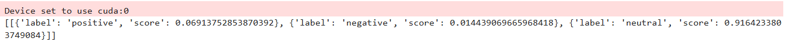

### 文本摘要

```python
from transformers import pipeline

summarizer = pipeline("summarization", model="facebook/bart-large-cnn")

ARTICLE = """ New York (CNN)When Liana Barrientos was 23 years old, she got married in Westchester County, New York.
A year later, she got married again in Westchester County, but to a different man and without divorcing her first husband.
Only 18 days after that marriage, she got hitched yet again. Then, Barrientos declared "I do" five more times, sometimes only within two weeks of each other.
In 2010, she married once more, this time in the Bronx. In an application for a marriage license, she stated it was her "first and only" marriage.
Barrientos, now 39, is facing two criminal counts of "offering a false instrument for filing in the first degree," referring to her false statements on the
2010 marriage license application, according to court documents.
Prosecutors said the marriages were part of an immigration scam.
On Friday, she pleaded not guilty at State Supreme Court in the Bronx, according to her attorney, Christopher Wright, who declined to comment further.
After leaving court, Barrientos was arrested and charged with theft of service and criminal trespass for allegedly sneaking into the New York subway through an emergency exit, said Detective
Annette Markowski, a police spokeswoman. In total, Barrientos has been married 10 times, with nine of her marriages occurring between 1999 and 2002.
All occurred either in Westchester County, Long Island, New Jersey or the Bronx. She is believed to still be married to four men, and at one time, she was married to eight men at once, prosecutors say.
Prosecutors said the immigration scam involved some of her husbands, who filed for permanent residence status shortly after the marriages.
Any divorces happened only after such filings were approved. It was unclear whether any of the men will be prosecuted.
The case was referred to the Bronx District Attorney\'s Office by Immigration and Customs Enforcement and the Department of Homeland Security\'s
Investigation Division. Seven of the men are from so-called "red-flagged" countries, including Egypt, Turkey, Georgia, Pakistan and Mali.
Her eighth husband, Rashid Rajput, was deported in 2006 to his native Pakistan after an investigation by the Joint Terrorism Task Force.
If convicted, Barrientos faces up to four years in prison.  Her next court appearance is scheduled for May 18.
"""
print(summarizer(ARTICLE, max_length=130, min_length=30, do_sample=False))
```

### 命名实体识别

```python
from transformers import pipeline

# 创建NER pipeline
ner = pipeline("ner", aggregation_strategy="simple")

# 识别文本中的实体
text = "My name is John Smith and I live in New York City."
entities = ner(text)
print(entities)
```

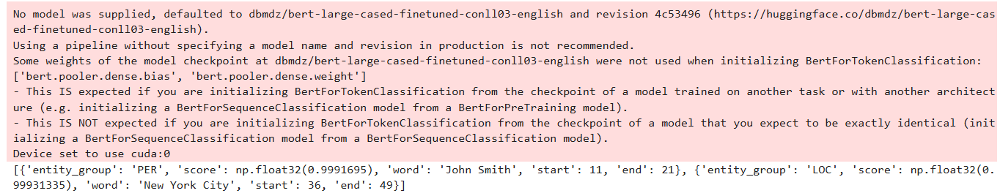

> ```json
> [{'entity_group': 'PER', 'score': np.float32(0.9991695), 'word': 'John Smith', 'start': 11, 'end': 21}, {'entity_group': 'LOC', 'score': np.float32(0.99931335), 'word': 'New York City', 'start': 36, 'end': 49}]
> ```

## 计算机视觉

### 图像分类

```python
from transformers import pipeline
from PIL import Image

# 创建图像分类pipeline
vision_classifier = pipeline("image-classification")

# 加载图像
img01 = Image.open("img_01.jpg")
img02 = Image.open("img_02.jpg")

# 进行分类预测
predictions1 = vision_classifier(img01)
print(f"图片1 {predictions1}")

predictions2 = vision_classifier(img02)
print(f"图片2 {predictions2}")

```

> 将如下图片上传

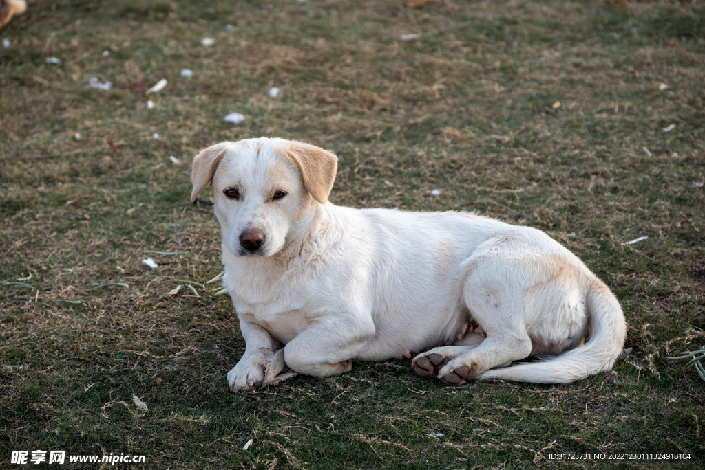


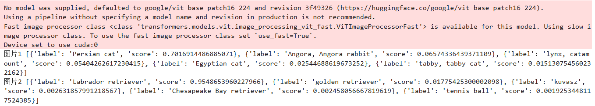

### 目标检测

> pip install timm

```python
from transformers import pipeline
from PIL import Image

# 创建目标检测pipeline
detector = pipeline("object-detection")

# 加载图像
image = Image.open("street_scene.jpg")

# 进行目标检测
detections = detector(image)
print(detections)

```


## 多模态应用

### 视觉问答

> 复用之前图像分类的图片

```python
from transformers import pipeline
import requests
from PIL import Image

# prepare image
url = "http://images.cocodataset.org/val2017/000000039769.jpg"

# 创建视觉问答pipeline
vqa = pipeline("visual-question-answering")

# 定义问题和图像
image = Image.open(requests.get(url, stream=True).raw)
question= "How many cats are there?"

# 进行视觉问答
answer = vqa(image=image, question=question)
print(answer)
```

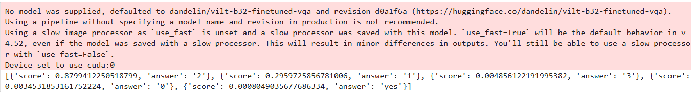

结果：

```json
[{'score': 0.8799412250518799, 'answer': '2'}, 
 {'score': 0.2959725856781006, 'answer': '1'}, 
 {'score': 0.004856122191995382, 'answer': '3'}, 
 {'score': 0.0034531853161752224, 'answer': '0'}, 
 {'score': 0.0008049035677686334, 'answer': 'yes'}]
```

# 模型训练与微调

虽然Hugging Face提供了大量**预训练模型**，但有时我们需要针对特定领域进行微调。

## 使用Trainer API微调模型

```python
from transformers import TrainingArguments, Trainer
from datasets import load_dataset
from transformers import AutoTokenizer, AutoModelForSequenceClassification
import numpy as np
from datasets import load_metric

# 加载数据集、分词器和模型
dataset = load_dataset("imdb")
tokenizer = AutoTokenizer.from_pretrained("bert-base-uncased")
model = AutoModelForSequenceClassification.from_pretrained("bert-base-uncased", num_labels=2)

# 定义数据处理函数
def tokenize_function(examples):
    return tokenizer(examples["text"], padding="max_length", truncation=True)

# 处理数据
tokenized_datasets = dataset.map(tokenize_function, batched=True)

# 设置训练参数
training_args = TrainingArguments(
    output_dir="./results",
    evaluation_strategy="epoch",
    learning_rate=2e-5,
    per_device_train_batch_size=16,
    per_device_eval_batch_size=16,
    num_train_epochs=3,
    weight_decay=0.01,
)

# 创建Trainer实例
trainer = Trainer(
    model=model,
    args=training_args,
    train_dataset=tokenized_datasets["train"],
    eval_dataset=tokenized_datasets["test"],
)

# 开始训练
trainer.train()

```

# 模型部署与分享

## 模型部署

Hugging Face Hub是一个模型仓库，你可以上传、下载、版本化你的模型。

```python
from huggingface_hub import HfApi

# 登录HF账户
# 需要在命令行先运行: huggingface-cli login

api = HfApi()
api.upload_folder(
    folder_path="./my_model",
    repo_id="username/my_new_model",
    repo_type="model"
)

```

## gradio 交互式应用

Hugging Face Spaces允许你创建交互式演示应用：

```python
# 创建简单的Gradio应用
import gradio as gr
from transformers import pipeline

# 创建pipeline
classifier = pipeline("text-classification")

# 定义处理函数
def classify_text(text):
    result = classifier(text)
    return result[0]['label'], result[0]['score']

# 创建界面
iface = gr.Interface(
    fn=classify_text,
    inputs=gr.inputs.Textbox(lines=2, placeholder="Enter text here..."),
    outputs=["text", "number"],
    title="文本情感分析",
    description="输入文本，获取情感分析结果（正面或负面）及置信度。"
)

# 启动应用
iface.launch()

```