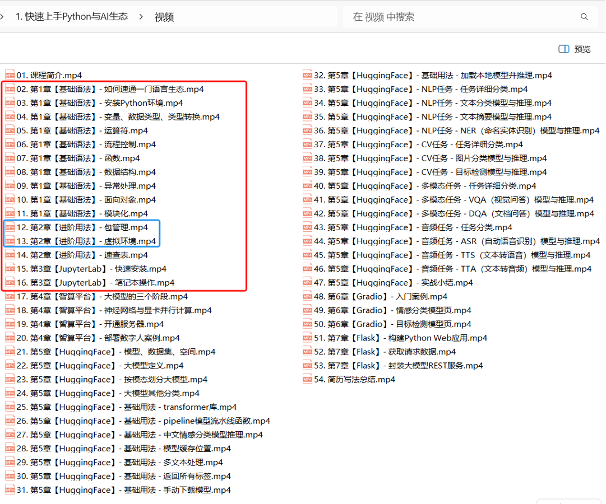

# 2. Python全能实战

# 课程目录

# 前置知识

> 学习本课程，先要学习《**快速上手Python与AI生态**》或者具备Python语言基础
> 
> [📄 3. 快速通关 - Python+AI生态](https://shenma-docs.feishu.cn/wiki/AJBEwErTui2KU5keqDLcjAyCn9f)

# 所有代码

[📎 pycode.zip](<files/pycode.zip>)

# 课程内容

## 数据分析部分

[📑 1. Conda 工程化环境](https://shenma-docs.feishu.cn/wiki/Wxaxw509siqgRAkiRp8ck1XBn3c)

[📑 2. 数据处理](https://shenma-docs.feishu.cn/wiki/JXSkwM3xgidGVskmE80c0n2Ankh)

[📑 3. 数据可视化](https://shenma-docs.feishu.cn/wiki/GytQwoEE3iNBltknjYJctqdLndf)

[📑 总结：Python 十大经典库](https://shenma-docs.feishu.cn/wiki/TWsDw0aAGiuifikJXRScBtLJn5g)