# 1. Numpy 实战

> NumPy（Numerical Python）是 Python 中用于**高性能科学计算的核心库**。它提供了：
> 
> -  **高性能的多维数组对象**（ndarray）
> -  **丰富的数学函数库**
> -  **线性代数、傅里叶变换等工具**
> -  **与 C/C++ 代码集成的能力**

## 导入NumPy

> 使用import命令导入numpy包，.__version__命令可以查看当前包的版本

### 安装NumPy

```python
# 使用 pip 安装
pip install numpy

# 使用 conda 安装
conda install numpy
```

### 导入NumPy

```python
import numpy as np  # 约定俗成的导入方式

# 检查版本
print(np.__version__)
```

## 为什么用NumPy

### 内存连续

```python
import numpy as np

# Python 列表
my_list = [1, 2, 3, 4, 5]

# 转换为 NumPy 数组
my_array = np.array(my_list)
```


### 高性能测试

```python
# Python 列表 vs NumPy 数组的性能对比
import time

# Python 列表
python_list = list(range(1000000))
start = time.time()
result = [x * 2 for x in python_list]
print(f"Python 列表耗时: {time.time() - start:.4f}秒")
# ===================================================
# NumPy 数组
import numpy as np
numpy_array = np.arange(1000000)
start = time.time()
result = numpy_array * 2
print(f"NumPy 数组耗时: {time.time() - start:.4f}秒")
# NumPy 通常快 10-100 倍！
```

##  **数组基础**

> Numpy数组创建指通过使用Numpy库来生成数组的过程。在Python中，Numpy库提供了多种创建数组的方法，可以调用这些方法来生成不同维度和元素的数组，这些创建的数组可用于存储和操作大量数据，进行各种数值计算和数据分析。

### 理解 ndarray

> **ndarray**（N-dimensional array）是 NumPy 的核心数据结构，**表示 N 维数组**。

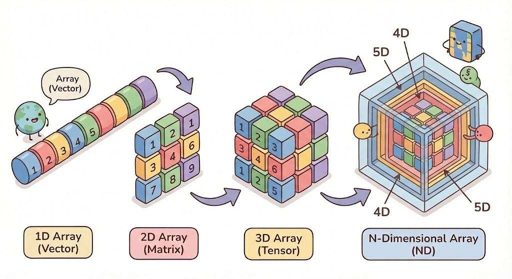

0维：标量：Scalar

1维：向量：Vector

2维：矩阵：Matrix

3维：张量：Tensor

N维：多维数组：ND Array

### 图解维度

> 即使再高维度的数组，**在底层都是一维连续空间**；NumPy会自动转化索引，**多维**是为了给人们逻辑理解方便而设置的

#### 1维：向量


#### 2维：矩阵


#### 3维：张量


#### 4维：N维数组


#### 代码

```python
import numpy as np
# 标量
a = 1
print(a)

# 向量
b = np.array([1, 2, 3])
print(b)
print("向量b的第二个元素:",b[1])
print("===============")

# 矩阵 [1,2,3]  [4,5,6]; 2x3
c = np.array([[1,2,3],[4,5,6]])
print(c)
print("矩阵c的第二行第二个元素:",c[1][1])
print("===============")

# 张量：3维数组 # [[1,2,3],[4,5,6]] # [[7，8,9],[10,11,12]]
# 创建 3x2x3 张量。值从1开始一直到18填充满
d = np.arange(1,19).reshape(3,2,3)
print("3维数组d:",d)
print("3维数组d的第3层第2个元素的第1个元素:",d[2][1][0])
print("=========")
# 4维数组 #[[[1,2,3],[4,5,6]],[[7,8,9],[10,11,12]]]  [[[1,2,3],[4,5,6]],[[7,8,9],[10,11,12]]]
# 生成 2x3x2x3 四维数组，值从1开始一直到36填充满
e = np.arange(1,37).reshape(2,3,2,3)
print("4维数组e:",e)
print("4维数组e的第2层第3个元素的第2个元素:",e[1][1][0][1])
print("===============")

```

### 数组创建

#### 从列表创建

```python
# 从 Python 列表创建
arr = np.array([1, 2, 3, 4, 5])

# 指定数据类型
arr_float = np.array([1, 2, 3], dtype=float)
print(arr_float)  # [1. 2. 3.]

arr_int = np.array([1.5, 2.7, 3.9], dtype=int)
print(arr_int)  # [1 2 3]  (截断小数部分)
```

#### 使用内置函数创建

```python
# zeros - 创建全 0 数组
zeros_1d = np.zeros(5)           # [0. 0. 0. 0. 0.]
zeros_2d = np.zeros((3, 4))      # 3行4列的全0矩阵

# ones - 创建全 1 数组
ones_1d = np.ones(5)             # [1. 1. 1. 1. 1.]
ones_2d = np.ones((2, 3))        # 2行3列的全1矩阵

# full - 创建指定值的数组
full_arr = np.full((2, 3), 7)    # 全是7的2x3矩阵

# empty - 创建未初始化的数组（速度快，但值随机）
empty_arr = np.empty((2, 2))

# eye / identity - 创建单位矩阵
identity = np.eye(3)
# [[1. 0. 0.]
#  [0. 1. 0.]
#  [0. 0. 1.]]
```

#### 使用范围函数创建

```python
# arange - 类似 Python 的 range
arr1 = np.arange(10)           # [0 1 2 3 4 5 6 7 8 9]
arr2 = np.arange(2, 10)        # [2 3 4 5 6 7 8 9]
arr3 = np.arange(2, 10, 2)     # [2 4 6 8]  步长为2
arr4 = np.arange(0, 1, 0.1)    # [0.  0.1 0.2 ... 0.9]

# linspace - 创建等间隔数组
arr5 = np.linspace(0, 10, 5)   # [0.  2.5  5.  7.5 10.]
# 从0到10，均匀分成5个数

# logspace - 创建对数间隔数组
arr6 = np.logspace(0, 2, 5)    # [1. 3.16... 10. 31.6... 100.]
# 从 10^0 到 10^2，均匀分成5个数
```

1. Linspace 图

> 间隔 = (10 - 0) / (5 - 1) = 2.5

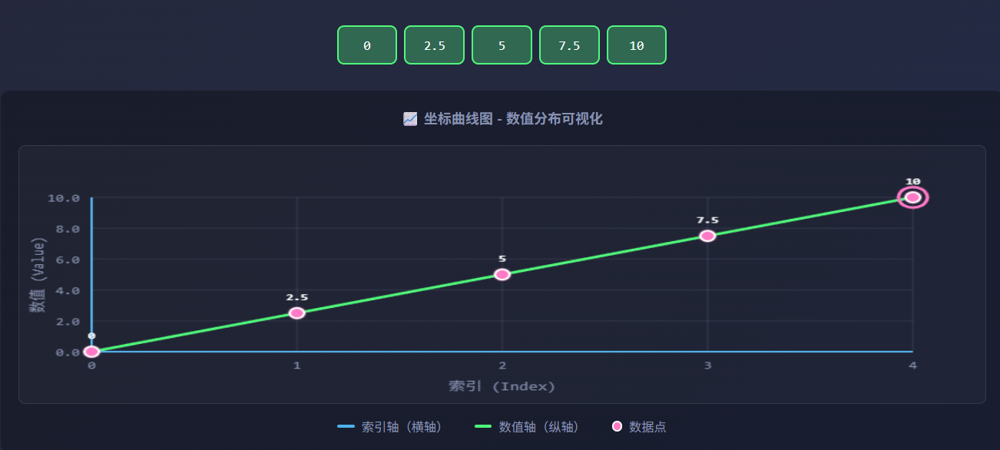

1. logspace图

> 指数间隔 = (2 - 0) / (5 - 1) = 0.5
> 
> 值 = 10^(0, 0.5, 1, 1.5, 2)

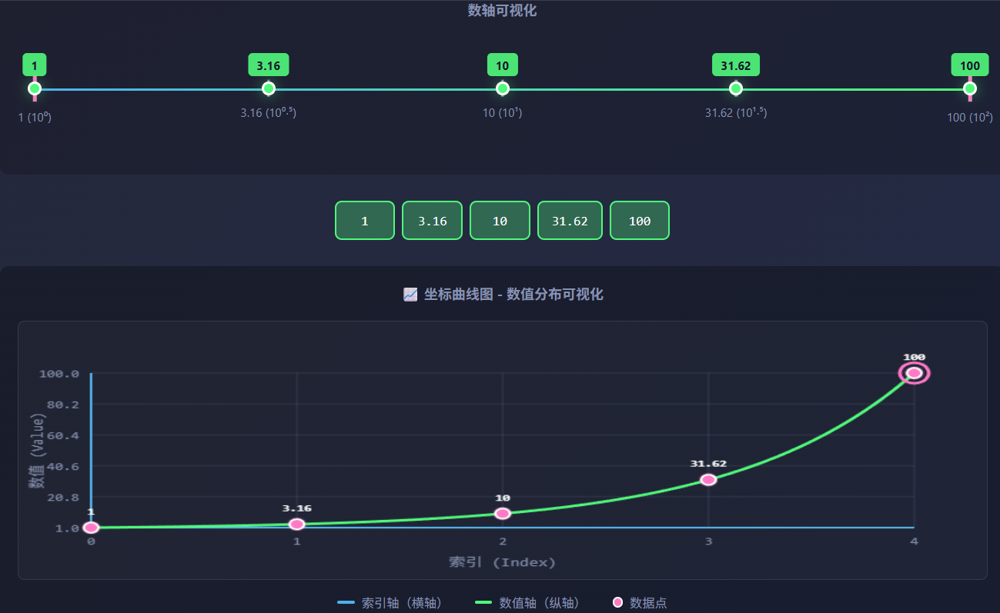

#### 常见方法对比

| 函数 | 说明 | 示例 |
| --- | --- | --- |
| np.array() | 从列表创建 | np.array([1,2,3]) |
| np.zeros() | 全0数组 | np.zeros((2,3)) |
| np.ones() | 全1数组 | np.ones((2,3)) |
| np.full() | 指定值数组 | np.full((2,3), 5) |
| np.eye() | 单位矩阵 | np.eye(3) |
| np.arange() | 等差数列 | np.arange(0,10,2) |
| np.linspace() | 等分数列 | np.linspace(0,1,5) |

### 数组属性

#### 测试代码

```python
import numpy as np
arr = np.array([[1, 2, 3, 4],
                [5, 6, 7, 8],
                [9, 10, 11, 12]])

# 形状
print(arr.shape)      # (3, 4) - 3行4列

# 维度数
print(arr.ndim)       # 2 - 二维数组

# 元素总数
print(arr.size)       # 12 - 共12个元素

# 数据类型
print(arr.dtype)      # int64 (或 int32)

# 每个元素的字节数
print(arr.itemsize)   # 8 (64位整数占8字节)

#  strides - 每个维度的步长（字节数）
print(arr.strides)    # (32, 8)
# 解释：
# 第一个维度（行）的步长是 32 字节，因为每个行有 4 个元素，每个元素 8 字节。
# 第二个维度（列）的步长是 8 字节，因为每个元素 8 字节。

# 数组总字节数
print(arr.nbytes)     # 96 (12个元素 × 8字节)

#  data - 数据的起始内存地址
print(arr.data)


```

#### 数据结构

> **元数据**与**数据分离**

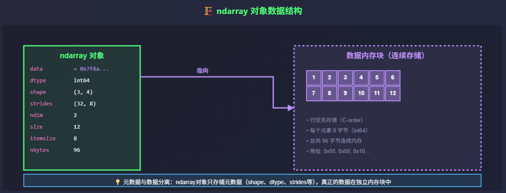

## 索引与切片

### 一维索引

```python
arr = np.array([10, 20, 30, 40, 50])

# 正向索引（从0开始）
print(arr[0])
# 10
print(arr[2])   # 30
 # 负向索引（从-1开始，表示最后一个）
print(arr[-1])   # 50
print(arr[-2])   # 40
```

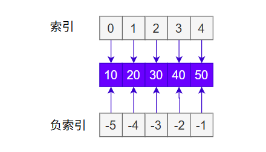

### 一维数组切片

> <u>**切片就是获取数组中的一部分数据**</u>
> 
> NumPy的切片默认是 **视图(View) **，而不是** 副本(Copy) **。也就是说，**切片操作 不会复制 **原始数组的数据，而是创建一个指向原始数据的新数组对象

```python
arr = np.array([0, 1, 2, 3, 4, 5, 6, 7, 8, 9])

# 基本切片 [start:stop:step]
print(arr[2:7])      # [2 3 4 5 6]  从索引2到6
print(arr[:5])       # [0 1 2 3 4]  从开头到索引4
print(arr[5:])       # [5 6 7 8 9]  从索引5到结尾
print(arr[::2])      # [0 2 4 6 8]  每隔2个取一个
print(arr[::-1])     # [9 8 7 6 5 4 3 2 1 0]  反转数组
```

### 二维数组索引与切片

```python
arr = np.array([[1, 2, 3],
                [4, 5, 6],
                [7, 8, 9]])

# 单个元素 [行, 列]
print(arr[0, 0])     # 1  (第0行第0列)
print(arr[1, 2])     # 6  (第1行第2列)
print(arr[-1, -1])   # 9  (最后一行最后一列)

# 整行
print(arr[1])        # [4 5 6]  第1行
print(arr[1, :])     # [4 5 6]  同上

# 整列
print(arr[:, 1])     # [2 5 8]  第1列

# 子矩阵
print(arr[0:2, 1:3])
# [[2 3]
#  [5 6]]
```

### 高级索引

```python
arr = np.array([10, 20, 30, 40, 50])

# 花式索引（使用数组作为索引）
indices = [0, 2, 4]
print(arr[indices])  # [10 30 50]

# 布尔索引
mask = arr > 25
print(mask)          # [False False  True  True  True]
print(arr[mask])     # [30 40 50]

# 条件筛选
print(arr[arr > 25])  # [30 40 50]
print(arr[(arr > 15) & (arr < 45)])  # [20 30 40]
```

## 数组运算

### 基本算数运算

```python
a = np.array([1, 2, 3, 4])
b = np.array([10, 20, 30, 40])

# 加减乘除（逐元素运算）
print(a + b)    # [11 22 33 44]
print(a - b)    # [-9 -18 -27 -36]
print(a * b)    # [10 40 90 160]
print(b / a)    # [10. 10. 10. 10.]

# 幂运算
print(a ** 2)   # [1 4 9 16]

# 取模
print(b % 3)    # [1 2 0 1]
```

> 数组加法演示:
> 
>     a = [1,   2,   3,   4 ]
> 
> +  b = [10, 20, 30, 40]
> 
> ─────────────────────
> 
> 结果 = [11, 22, 33, 44]
> 
> 计算过程:
> 
>   1 + 10 = 11
> 
>   2 + 20 = 22
> 
>   3 + 30 = 33
> 
>   4 + 40 = 44

### 与标量运算

```python
arr = np.array([1, 2, 3, 4, 5])

# 数组与标量运算（标量会广播到每个元素）
print(arr + 10)    # [11 12 13 14 15]
print(arr * 2)     # [2 4 6 8 10]
print(arr / 2)     # [0.5 1.  1.5 2.  2.5]
print(arr ** 2)    # [1 4 9 16 25]
```

### 比较运算

```python
arr = np.array([1, 2, 3, 4, 5])

print(arr > 3)     # [False False False  True  True]
print(arr == 3)    # [False False  True False False]
print(arr != 3)    # [ True  True False  True  True]

# 数组间比较
a = np.array([1, 2, 3])
b = np.array([3, 2, 1])
print(a > b)       # [False False  True]
print(a == b)      # [False  True False]
```

## 广播机制

> **广播（Broadcasting）**是 NumPy 中一种强大的机制，允许**不同形状的数组进行运算**。

```python
# 标量与数组
arr = np.array([1, 2, 3])
print(arr + 10)  # [11 12 13]
# 10 被"广播"成 [10, 10, 10]

# 代码实现
a = np.array([[1, 2, 3]])      # shape: (1, 3)
b = np.array([[10], [20], [30]])  # shape: (3, 1)
print(a + b)

# 不同形状数组
a = np.array([[1, 2, 3],
              [4, 5, 6]])  # shape: (2, 3)
b = np.array([10, 20, 30])  # shape: (3,)
print(a + b)
# [[11 22 33]
#  [14 25 36]]
# b 被广播成 [[10, 20, 30], [10, 20, 30]]
```

### 广播规则

> 广播规则（从右向左比较维度）:
> 
> 1. **规则1（****变维****）**:  如果维度数不同，在较小数组的形状前面补1
> 2. **规则2（****兼容****）**:  每个维度上，大小要么相等，要么其中一个为1
> 3. **规则3（****拉伸****）**:  大小为1的维度会被拉伸以匹配另一个数组; 拉伸行复制上一行，拉伸列复制前一列

示例:  `A: (4, 3)`    `B: (3,)`

**步骤1**: B 补齐为 `(1, 3)`

**步骤2**: 比较 `(4, 3)` 和 `(1, 3)`

- **第一维**: 4 vs 1 → 1 拉伸为 4
- **第二维**: 3 vs 3 → 相等

**结果**: (4, 3)

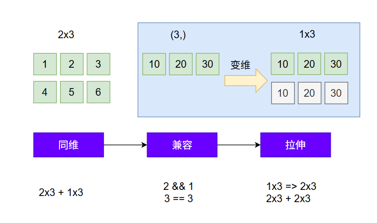

### 广播案例

```python
示例: 行向量 + 列向量

行向量 a (1, 3):        列向量 b (3, 1):
┌───┬───┬───┐          ┌───┐
│ 1 │ 2 │ 3 │          │10 │
└───┴───┴───┘          │20 │
                       │30 │
                       └───┘

广播后:
a 变成 (3, 3):          b 变成 (3, 3):
┌───┬───┬───┐          ┌────┬────┬────┐
│ 1 │ 2 │ 3 │          │ 10 │ 10 │ 10 │
│ 1 │ 2 │ 3 │          │ 20 │ 20 │ 20 │
│ 1 │ 2 │ 3 │          │ 30 │ 30 │ 30 │
└───┴───┴───┘          └────┴────┴────┘

结果 a + b (3, 3):
┌────┬────┬────┐
│ 11 │ 12 │ 13 │
│ 21 │ 22 │ 23 │
│ 31 │ 32 │ 33 │
└────┴────┴────┘
```

```python
# 代码实现
a = np.array([[1, 2, 3]])      # shape: (1, 3)
b = np.array([[10], [20], [30]])  # shape: (3, 1)
print(a + b)
# [[11 12 13]
#  [21 22 23]
#  [31 32 33]]
```

## 数组变形

### **reshape - 改变形状**

```python
arr = np.arange(1,13)  # [1 2 3 4 5 6 7 8 9 10 11, 12]

# 变形为 3x4 矩阵
arr_2d = arr.reshape(3, 4)
print(arr_2d)


# 变形为 2x2x3 三维数组
arr_3d = arr.reshape(2, 2, 3)
print(arr_3d)

# 使用 -1 自动计算维度
arr_auto = arr.reshape(4, -1)  # 4行，列数自动计算
print(arr_auto.shape)  # (4, 3)
```

### 其他变形

```python
# 创建二维数组
arr = np.array([[1, 2, 3],
[4, 5, 6]])

# 使用 flatten() - 返回副本
flat = arr.flatten()

# 使用 ravel() - 返回视图
ravelled = arr.ravel()

# 测试修改
flat[0] = 99
print("原数组:", arr[0, 0]) # 1（未改变）

ravelled[0] = 99
print("原数组:", arr[0, 0]) # 99（已改变）

# transpose / T - 转置
arr = np.array([[1, 2, 3],
[4, 5, 6]])
transposed = arr.T
print(transposed)
# [[1 4]
#  [2 5]
#  [3 6]]

arr_234 = np.array([[[1, 2, 3, 4], [5, 6, 7, 8], [9, 10, 11, 12]],
                     [[13, 14, 15, 16], [17, 18, 19, 20], [21, 22, 23, 24]]])
print("2x3x4 数组形状:", arr_234.shape) # (2, 3, 4)

arr_243 = arr_234.transpose(0, 2, 1)
print("2x4x3 数组形状:", arr_243.shape) # (2, 4, 3)


# swapaxes - 交换轴
swapped = arr.swapaxes(0, 1)  # 等同于转置

# expand_dims - 增加维度
expanded = np.expand_dims(arr, axis=0)
print(expanded.shape)  # (1, 2, 3)

# squeeze - 移除大小为1的维度
squeezed = np.squeeze(expanded)
print(squeezed.shape)  # (2, 3)
```

### 拼接与分割

```python
# 创建示例数组
a = np.array([[1, 2], [3, 4]]) # shape=(2, 2)
b = np.array([[5, 6], [7, 8]]) # shape=(2, 2)

# 垂直拼接 (vstack)
result_v = np.vstack([a, b])
print("垂直拼接结果:")
print(result_v)
# [[1 2]
# [3 4]
# [5 6]
# [7 8]]

# 水平拼接 (hstack)
result_h = np.hstack([a, b])
print("水平拼接结果:")
print(result_h)
# [[1 2 5 6]
# [3 4 7 8]]

# 使用 concatenate
result_v2 = np.concatenate([a, b], axis=0) # 等同于 vstack
result_h2 = np.concatenate([a, b], axis=1) # 等同于 hstack

# 分割数组
arr = np.arange(12).reshape(4, 3)
split_arr = np.split(arr, 2, axis=0)  # 沿行分成2份
```

## 数学函数

https://www.shuxuele.com/algebra/exponents-logarithms.html

### 通用函数

> 无理数 `e` 也称为**欧拉数**。它约等于 2.718281

```python
arr = np.array([1, 4, 9, 16, 25])

# 平方根
print(np.sqrt(arr))    # [1. 2. 3. 4. 5.]

# 指数
print(np.exp(arr))     # [2.718... 54.598... ...]

# 对数
print(np.log(arr))     # [0. 1.386... 2.197... ...]
print(np.log10(arr))   # [0. 0.602... 0.954... ...]

# 绝对值
print(np.abs([-1, -2, 3]))  # [1 2 3]

# 取整
arr2 = np.array([1.2, 2.5, 3.7])
print(np.floor(arr2))  # [1. 2. 3.]  向下取整
print(np.ceil(arr2))   # [2. 3. 4.]  向上取整
print(np.round(arr2))  # [1. 2. 4.]  四舍五入
```

### 三角函数

> https://www.shuxuele.com/sine-cosine-tangent.html

```python
angles = np.array([0, np.pi/6, np.pi/4, np.pi/3, np.pi/2])

print(np.sin(angles))  # [0. 0.5 0.707... 0.866... 1.]
print(np.cos(angles))  # [1. 0.866... 0.707... 0.5 0.]
print(np.tan(angles))  # [0. 0.577... 1. 1.732... 很大的数]

# 角度与弧度转换
degrees = np.array([0, 30, 45, 60, 90])
radians = np.deg2rad(degrees)
print(radians)  # [0. 0.524... 0.785... 1.047... 1.571...]
```

### 聚合函数

```python
arr = np.array([[1, 2, 3],
                [4, 5, 6]])

# 求和
print(np.sum(arr))        # 21 (所有元素)
print(np.sum(arr, axis=0))  # [5 7 9] (每列求和)
print(np.sum(arr, axis=1))  # [6 15] (每行求和)

# 平均值
print(np.mean(arr))       # 3.5

# 最大/最小值
print(np.max(arr))        # 6
print(np.min(arr))        # 1
print(np.argmax(arr))     # 5 (最大值的索引)
print(np.argmin(arr))     # 0 (最小值的索引)

# 累积和
print(np.cumsum(arr))     # [1 3 6 10 15 21]

# 乘积
print(np.prod(arr))       # 720 (1*2*3*4*5*6)
```

## 线性代数

### 矩阵乘法

https://www.shuxuele.com/algebra/matrix-multiplying.html

```python
A = np.array([[1, 2, 3],
              [4, 5, 6]])
B = np.array([[7, 8],
              [9, 10],
              [11, 12]])

# 矩阵乘法
C = np.dot(A, B)  # 或 A @ B
print(C)
```

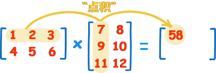

"点积" 是把 **对称的元素相乘**，然后把结果加起来：`(1, 2, 3) • (7, 9, 11) = 1×7 + 2×9 + 3×11 = 58`

`第一行与``第二列``： (1, 2, 3) • (8, 10, 12) = 1×8 + 2×10 + 3×12 = 64`

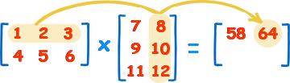

**第二行** 和 **第一列**也同样做：`(4, 5, 6) • (7, 9, 11) = 4×7 + 5×9 + 6×11 = 139`

**第二行** 和 **第二列**：`(4, 5, 6) • (8, 10, 12) = 4×8 + 5×10 + 6×12 = 154`

### 其他操作

> 行列式：https://www.shuxuele.com/algebra/matrix-determinant.html
> 
> 逆矩阵：https://www.shuxuele.com/algebra/matrix-inverse.html

```python
# 转置
print("转置:\n", A.T)
# [[1 3]
#  [2 4]]

# 行列式
det = np.linalg.det(A)
print("行列式:", det)  # -2.0

# 逆矩阵
inv = np.linalg.inv(A)
print("逆矩阵:\n", inv)
# [[-2.   1. ]
#  [ 1.5 -0.5]]

# 验证: A × A^(-1) = I
print("验证: A × A^(-1) = I:\n", np.dot(A, inv))
# [[1. 0.]
#  [0. 1.]]

# 特征值和特征向量
eigenvalues, eigenvectors = np.linalg.eig(A)
print("特征值:", eigenvalues)
print("特征向量:\n", eigenvectors)

A = np.array([[2, 1],
              [1, 2]])
# 解线性方程组 Ax = b
b = np.array([5, 7])
x = np.linalg.solve(A, b)
print(x)  # [1. 3.]  即 x=1, y=3
```

## 统计函数

### 基本统计

```python
data = np.array([23, 45, 67, 89, 12, 34, 56, 78, 90, 11])

# 平均值
mean = np.mean(data)
print(f"平均值: {mean}")  # 50.5

# 中位数
median = np.median(data)
print(f"中位数: {median}")  # 50.5

# 标准差
std = np.std(data)
print(f"标准差: {std}")  # 28.17...

# 方差
var = np.var(data)
print(f"方差: {var}")  # 793.65

# 最大/最小值
print(f"最大值: {np.max(data)}")  # 90
print(f"最小值: {np.min(data)}")  # 11

# 极差
print(f"极差: {np.ptp(data)}")  # 79 (90-11)

# 百分位数
print(f"25%分位数: {np.percentile(data, 25)}")
print(f"75%分位数: {np.percentile(data, 75)}")
```

### 计算公式

> **平均值 (Mean):**   μ = (x₁ + x₂ + ... + xₙ) / n
> 
> **方差 (Variance): ** σ² = Σ(xᵢ - μ)² / n
> 
> **标准差 (Standard Deviation):**  σ = √(方差)
> 
> `示例数据: [2, 4, 6, 8, 10]`
> 
> 平均值: (2+4+6+8+10)/5 = 30/5 = 6
> 
> 方差计算:
> 
>   (2-6)² = 16
> 
>   (4-6)² = 4
> 
>   (6-6)² = 0
> 
>   (8-6)² = 4
> 
>   (10-6)² = 16
> 
>   ─────────
> 
>   总和 = 40
> 
>   方差 = 40/5 = 8
> 
> 标准差: √8 ≈ 2.83

### 相关性分析

```python
x = np.array([1, 2, 3, 4, 5])
y = np.array([2, 4, 5, 4, 5])

# 相关系数矩阵
corr_matrix = np.corrcoef(x, y)
print(corr_matrix)
# [[1.         0.77459667]
#  [0.77459667 1.        ]]

# 协方差矩阵
cov_matrix = np.cov(x, y)
print(cov_matrix)
```

### 计算步骤

> 计算步骤如下：

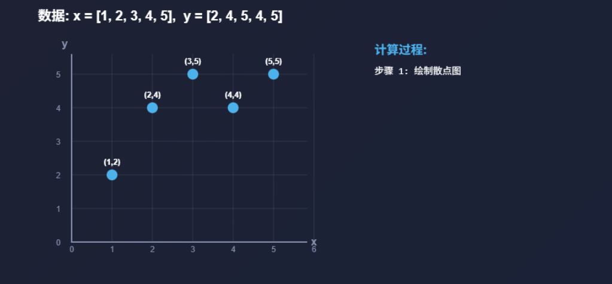

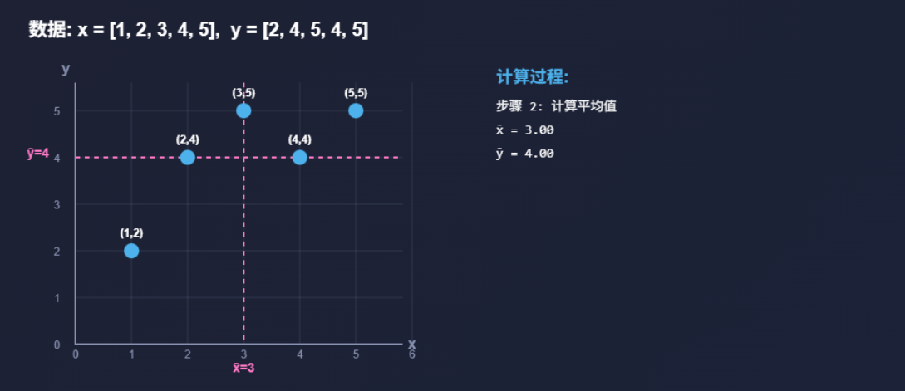

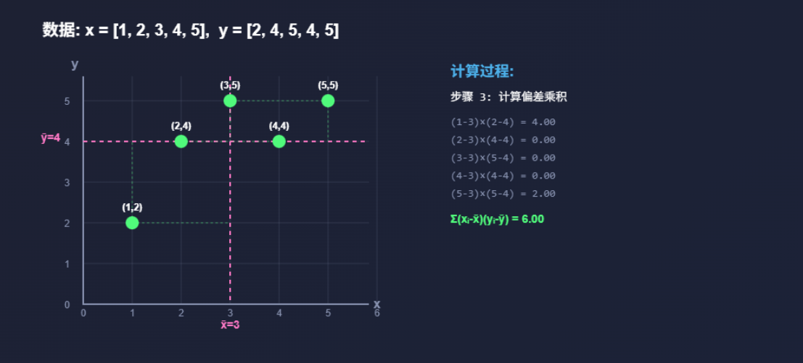

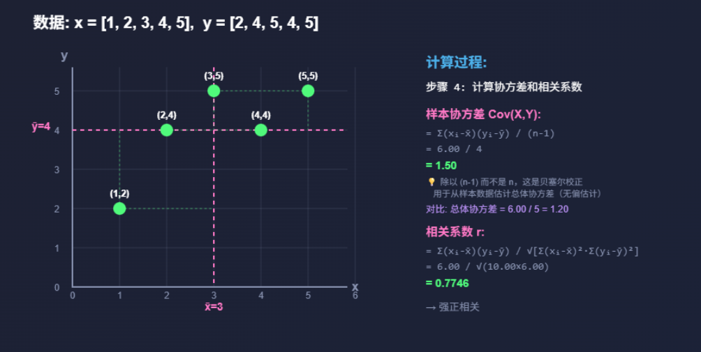

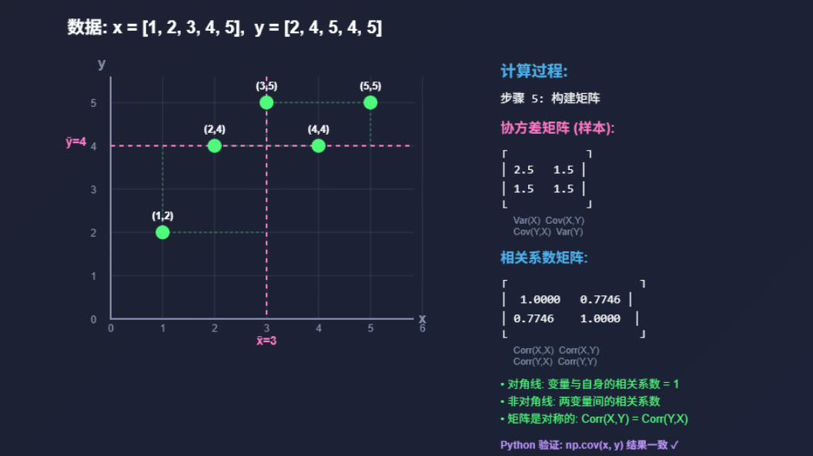

## 随机数生成

### 基本用法

```python
# 设置随机种子（保证可重复性）
np.random.seed(42)

# 0-1之间
rand_num = np.random.rand()  

# 0-1之间的均匀分布
rand_uniform = np.random.rand(3, 4)  # 3x4矩阵

# 指定范围的随机整数
rand_int = np.random.randint(1, 100, size=(3, 3))

# 标准正态分布 (均值0, 标准差1)
rand_normal = np.random.randn(3, 3)

# 指定均值和标准差的正态分布
rand_normal2 = np.random.normal(loc=50, scale=10, size=100)

# 从数组中随机选择
arr = np.array([1, 2, 3, 4, 5])
choice = np.random.choice(arr, size=3, replace=False)
```

### 常用分布

```python
# 均匀分布
uniform = np.random.uniform(low=0, high=10, size=1000)

# 正态分布
normal = np.random.normal(loc=0, scale=1, size=1000)

# 二项分布
binomial = np.random.binomial(n=10, p=0.5, size=1000)

# 泊松分布
poisson = np.random.poisson(lam=5, size=1000)

# 指数分布
exponential = np.random.exponential(scale=1, size=1000)
```

### 随机打乱

```python
arr = np.array([1, 2, 3, 4, 5])

# 打乱数组（原地修改）
np.random.shuffle(arr)
print(arr)  # 例如 [3 1 5 2 4]

# 返回打乱后的副本
arr2 = np.array([1, 2, 3, 4, 5])
shuffled = np.random.permutation(arr2)
print(shuffled)  # 例如 [2 5 1 4 3]
print(arr2)      # [1 2 3 4 5] 原数组不变
```

## 案例：图像处理

> 以上，我们详细学习了 Numpy 的安装、数组的创建、数组的操作以及数组间的运算等，对于研究学习来说，已经足够了，<u>**由于 **</u>`Pandas`<u>** 这个工具已经为我们整合并封装了大量实用的计算功能，无需过多地深入NumPy的所有底层功能和细节**</u>。在日常的数据分析和处理工作中，我们可以直接调用Pandas的相关功能来完成任务，使数据处理工作变得更加高效和便捷。

### 简化案例

> ` pip install matplotlib`； `matplotlib`是一个可视化库；《可视化》章节我们会讲到

```python
import matplotlib.pyplot as plt
import matplotlib.cbook as cbook
from matplotlib.image import imread
import numpy as np

# 1. 图像读取与显示
# 尝试使用内置的经典图像
try:
    # 方法1：使用matplotlib内置的sample data中的经典图像
    image_path = cbook.get_sample_data('grace_hopper.jpg')
    print(f"尝试加载图像: {image_path}")
    image = imread(image_path)
    original_image = image.copy()
    print(f"成功加载图像，形状: {image.shape}")
except Exception as e:
    print(f"无法加载grace_hopper.jpg: {e}")

# 2. 图像预处理
# 如果是彩色图像，转换为灰度图像用于处理
grayscale_image = None
if image.ndim == 3:
    print("将彩色图像转换为灰度图像...")
    # 使用加权平均法转换为灰度图像
    grayscale_image = np.dot(image[..., :3], [0.2989, 0.5870, 0.1140])
    grayscale_image = grayscale_image.astype(np.uint8)
else:
    grayscale_image = image.copy()

# 3. 反转图像
print("图像反转...")
reversed_image = 255 - grayscale_image

# 4. 二值化处理
print("二值化处理...")
threshold = 128
binary_image = (grayscale_image > threshold).astype(np.uint8) * 255

# 5. 显示所有处理后的图像
plt.figure(figsize=(12, 8))

plt.subplot(2, 3, 1)
plt.imshow(original_image)
plt.title('Original Image')

plt.subplot(2, 3, 2)
plt.imshow(grayscale_image, cmap='gray')
plt.title('Grayscale Image')

plt.subplot(2, 3, 3)
plt.imshow(reversed_image, cmap='gray')
plt.title('Reversed Image')

plt.subplot(2, 3, 4)
plt.imshow(binary_image, cmap='gray')
plt.title('Binary Image')

plt.tight_layout()
plt.show()

```

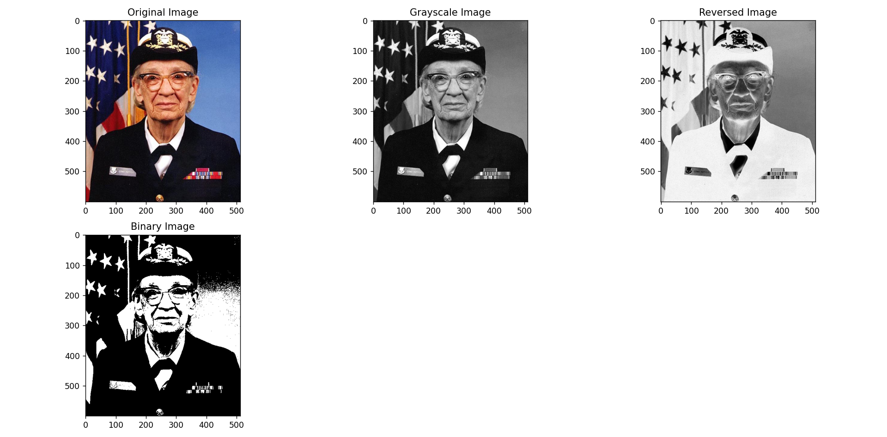

### 完整案例

> Numpy 模拟一个图像处理案例; ` pip install matplotlib`

```python
import numpy as np
import matplotlib.pyplot as plt
import matplotlib.cbook as cbook
from matplotlib.image import imread

# 使用经典图像代替随机生成的图像
# 尝试使用内置的经典图像

# 初始化原始图像变量
original_image = None
image = None

try:
    # 方法1：使用matplotlib内置的sample data中的经典图像
    image_path = cbook.get_sample_data('grace_hopper.jpg')
    print(f"尝试加载图像: {image_path}")
    image = imread(image_path)
    original_image = image.copy()
    print(f"成功加载图像，形状: {image.shape}")
except Exception as e:
    print(f"无法加载grace_hopper.jpg: {e}")

# 如果是彩色图像，转换为灰度图像用于处理
grayscale_image = None
if image.ndim == 3:
    print("将彩色图像转换为灰度图像...")
    # 使用加权平均法转换为灰度图像
    grayscale_image = np.dot(image[...,:3], [0.299, 0.587, 0.114]).astype(np.uint8)
else:
    grayscale_image = image.copy()

# 确保图像是灰度的且数据类型正确
processing_image = grayscale_image.astype(np.uint8)

print(f"处理图像的最终形状: {processing_image.shape}")
print(f"原始图像的最终形状: {original_image.shape}")

# 图像反转
inverted = 255 - processing_image

# 图像二值化
threshold = 128
binary = (processing_image > threshold).astype(np.uint8) * 255

# 图像亮度调整
brighter = np.clip(processing_image + 50, 0, 255).astype(np.uint8)

# 简单的均值滤波（模糊）
def mean_filter(img, kernel_size=3):
    pad = kernel_size // 2
    padded = np.pad(img, pad, mode='edge')
    result = np.zeros_like(img, dtype=float)
    for i in range(img.shape[0]):
        for j in range(img.shape[1]):
            result[i, j] = padded[i:i+kernel_size, j:j+kernel_size].mean()
    return result.astype(np.uint8)

# 添加更丰富的图像处理效果
# 锐化滤镜
def sharpen_filter(img):
    # 锐化卷积核
    kernel = np.array([[-1, -1, -1],
                      [-1,  9, -1],
                      [-1, -1, -1]])
    
    pad = kernel.shape[0] // 2
    padded = np.pad(img, pad, mode='edge')
    result = np.zeros_like(img, dtype=float)
    
    for i in range(img.shape[0]):
        for j in range(img.shape[1]):
            result[i, j] = np.sum(padded[i:i+kernel.shape[0], j:j+kernel.shape[1]] * kernel)
    
    # 确保值在0-255范围内
    result = np.clip(result, 0, 255)
    return result.astype(np.uint8)

# 边缘检测（Sobel算子）
def edge_detection(img):
    # Sobel X方向卷积核（水平边缘）
    sobel_x = np.array([[-1, 0, 1],
                       [-2, 0, 2],
                       [-1, 0, 1]])
    
    # Sobel Y方向卷积核（垂直边缘）
    sobel_y = np.array([[-1, -2, -1],
                       [0, 0, 0],
                       [1, 2, 1]])
    
    pad = 1
    padded = np.pad(img, pad, mode='edge')
    
    grad_x = np.zeros_like(img, dtype=float)
    grad_y = np.zeros_like(img, dtype=float)
    
    for i in range(img.shape[0]):
        for j in range(img.shape[1]):
            grad_x[i, j] = np.sum(padded[i:i+3, j:j+3] * sobel_x)
            grad_y[i, j] = np.sum(padded[i:i+3, j:j+3] * sobel_y)
    
    # 计算梯度幅度
    gradient = np.sqrt(grad_x**2 + grad_y**2)
    # 归一化到0-255
    gradient = (gradient / gradient.max() * 255).astype(np.uint8)
    
    return gradient

# 应用新的滤镜效果
sharpened = sharpen_filter(processing_image)
edges = edge_detection(processing_image)

# 可视化同时展示以上图像
# 调整布局，添加原始图像显示
plt.figure(figsize=(18, 12))

# 原始图像（彩色）
plt.subplot(3, 4, 1)
plt.imshow(original_image)
plt.title('Original Image (Color)')
plt.axis('off')

# 转换后的灰度图像
plt.subplot(3, 4, 2)
plt.imshow(grayscale_image, cmap='gray')
plt.title('Grayscale Image')
plt.axis('off')

# 反转图像
plt.subplot(3, 4, 3)
plt.imshow(inverted, cmap='gray')
plt.title('Inverted Image')
plt.axis('off')

# 二值化图像
plt.subplot(3, 4, 4)
plt.imshow(binary, cmap='gray')
plt.title('Binary Image')
plt.axis('off')

# 亮度调整
plt.subplot(3, 4, 5)
plt.imshow(brighter, cmap='gray')
plt.title('Brighter Image')
plt.axis('off')

# 均值滤波（模糊）
plt.subplot(3, 4, 6)
plt.imshow(mean_filter(processing_image), cmap='gray')
plt.title('Mean Filter (Blur)')
plt.axis('off')

# 锐化滤镜
plt.subplot(3, 4, 7)
plt.imshow(sharpened, cmap='gray')
plt.title('Sharpen Filter')
plt.axis('off')

# 边缘检测
plt.subplot(3, 4, 8)
plt.imshow(edges, cmap='gray')
plt.title('Edge Detection (Sobel)')
plt.axis('off')

# 展示图像信息
plt.subplot(3, 4, 9)
plt.axis('off')
image_info = f"Image Info:\n"
image_info += f"Original Shape: {original_image.shape}\n"
image_info += f"Grayscale Shape: {grayscale_image.shape}\n"
image_info += f"Dtype: {original_image.dtype}\n"
image_info += f"Min: {processing_image.min()}, Max: {processing_image.max()}"
plt.text(0.1, 0.5, image_info, fontsize=12, verticalalignment='center')

plt.tight_layout()
plt.savefig('image_processing_results.png', dpi=150, bbox_inches='tight')  # 保存结果
plt.show()

# 打印一些图像统计信息
print("\n图像基本信息:")
print(f"原始图像形状: {original_image.shape}")
print(f"灰度图像形状: {grayscale_image.shape}")
print(f"数据类型: {original_image.dtype}")
print(f"像素值范围: [{processing_image.min()}, {processing_image.max()}]")
print(f"图像大小: {processing_image.shape[0] * processing_image.shape[1]} 像素")

# 演示如何访问和修改特定像素
print("\n像素操作演示:")
# 获取图像中心像素值
center_y, center_x = processing_image.shape[0] // 2, processing_image.shape[1] // 2
print(f"中心像素值: {processing_image[center_y, center_x]}")

# 修改中心区域的像素值（创建一个白色方块）
modified_image = processing_image.copy()
block_size = min(20, min(processing_image.shape) // 4)  # 确保方块不会超出图像范围
modified_image[center_y-block_size:center_y+block_size, 
               center_x-block_size:center_x+block_size] = 255

# 显示修改后的图像
plt.figure(figsize=(8, 4))

plt.subplot(1, 2, 1)
plt.imshow(processing_image, cmap='gray')
plt.title('Original Processing Image')
plt.axis('off')

plt.subplot(1, 2, 2)
plt.imshow(modified_image, cmap='gray')
plt.title('Modified Image (Center Block)')
plt.axis('off')

plt.tight_layout()
plt.show()
```


> NumPy 是 Python 数据科学生态系统的基石。掌握 NumPy 后，你可以：
> 
> 1. ✅ 高效处理大规模数值数据
> 2. ✅ 进行复杂的数学和统计计算
> 3. ✅ 为学习 Pandas、Scikit-learn、TensorFlow 等打下基础
> 4. ✅ 实现各种科学计算和数据分析任务