# 2. Pandas 实战

## Pandas 简介

> Pandas 是 Python 中最流行的数据分析库，名字来源于 "Panel Data"（面板数据）。它提供了：
> 
> - **高效的数据结构**：Series 和 DataFrame
> - **强大的数据处理能力**：清洗、转换、合并、分组
> - **便捷的数据读写**：支持 CSV、Excel、SQL、JSON 等格式
> - **与其他库的无缝集成**：NumPy、Matplotlib、Scikit-learn

### 安装

```python
pip install pandas openpyxl matplotlib
```

| 库名 | 主要功能 | 常用场景 |
| --- | --- | --- |
| pandas | 数据处理与分析 | 处理表格数据、统计计算 |
| openpyxl | Excel 文件操作 | 读写 .xlsx 文件，格式化报表 |
| matplotlib | 数据可视化 | 绘制图表、趋势分析 |

> **从 Excel 读取** → **pandas 分析** → **matplotlib 绘图** → **回写 Excel**

### 导入

> pd.__version__命令可以查看当前包的版本

```python
import sys #导入sys库用于查看Python的版本
import pandas as pd #导入pandas
import numpy as np
print('当前使用 Python 版本为： ' + sys.version)
print('当前使用 Pandas 版本为： ' + pd.__version__)
print('当前使用 Numpy 版本为： ' + np.__version__)


# 使用 dir 方法，用于了解该包提供了哪些功能
print(dir(pandas))
```

> Pandas 拥有众多实用方法。通过查阅帮助文档，我们可以了解这些函数的参数设置。理解参数的作用能帮助我们更好地掌握函数的使用方法。只需在函数名后加个问号（？），即可轻松调用帮助文档。如下是调用 read_excel 的帮助文档。

```python
#帮助文档
pd.read_excel?
```

后面将详细学习 pd.read_excel 函数的用法，该函数可用于导入本地 Excel 数据，更多帮助文档的内容可供我们学习，比如 pd.pivot_table？可做数据透视表。

## 数据集

> Pandas 可以手动创建** **`Series `和 `DataFrame `两种数据集。
> 
> 1. `Series `是一维数据结构，它只包含一个维度
> 2. `DataFrame `是二维数据结构，它包含行和列，类似于 Excel 表格。
>   1. 简单来说，DataFrame 的列就相当于一个 Series。

### Series

`pd.Series(data=None, index=None, dtype=None, name=None, copy=False, fastpath=False)`

| 参数名 | 类型 | 作用 | 默认值 |
| --- | --- | --- | --- |
| data | array-like / scalar / dict / Series | 传入的原始数据 | None |
| index | list / Index | 自定义索引 | 自动生成 |
| dtype | type / numpy.dtype | 指定数据类型 | 自动推断 |
| name | str | Series 名称 | None |
| copy | bool | 是否复制原始数据 | FALSE |
| fastpath | bool | 内部优化参数 | FALSE |

#### 基本创建

```python
import pandas as pd

# 从列表创建 Series - 模拟交易金额
amounts = pd.Series([402.77, 545.27, 256.72, 275.55, 1023.50])
print(amounts)
# 0     402.77
# 1     545.27
# 2     256.72
# 3     275.55
# 4    1023.50
# dtype: float64
```

> 数据结构

```python
Series 结构:
┌─────────┬──────────┐
│  索引   │   值     │
├─────────┼──────────┤
│    0    │  402.77  │
│    1    │  545.27  │
│    2    │  256.72  │
│    3    │  275.55  │
│    4    │ 1023.50  │
└─────────┴──────────┘
     ↑         ↑
   Index    Values
```

#### 自定义索引

```python
# 使用自定义索引
# 使用自定义索引
s2 = pd.Series([402.77, 545.27, 256.72], index=['订单1', '订单2', '订单3'])
print(s2)
# 订单1    402.77
# 订单2    545.27
# 订单3    256.72
# dtype: float64
```

#### 从字典创建

```python
# 使用字典创建，键作为索引
s3 = pd.Series({'A': 1, 'B': 2, 'C': 3})
# A    1
# B    2
# C    3
# dtype: int64
```

#### 指定数据类型

```python
# 指定为整数类型
s4 = pd.Series([1.1, 2.2, 3.3]).astype(int)
```

#### 命名的Series

```python
# 命名的Series
s5 = pd.Series([1, 2, 3], name='数值数据')
# 0    1
# 1    2
# 2    3
# Name: 数值数据, dtype: int6
```

#### 基本操作

```python
# 创建交易金额 Series
amounts = pd.Series(
    [402.77, 545.27, 256.72, 275.55, 1023.50],
    index=['A', 'B', 'C', 'D', 'E']
)

# 访问元素
print(amounts['A'])      # 402.77
print(amounts[0])        # 402.77
print(amounts[['A', 'C']])  # 多个元素

# 切片
print(amounts['B':'D'])  # B, C, D
print(amounts[1:4])      # 索引1到3

# 条件筛选 - 找出大额订单（>500元）
print(amounts[amounts > 500])
# B    545.27
# E   1023.50

# 基本运算 - 计算打9折后的价格
print(amounts * 0.9)

# 统计分析
print(f"平均交易额: {amounts.mean():.2f}")
print(f"总交易额: {amounts.sum():.2f}")
print(f"最大交易额: {amounts.max():.2f}")
print(f"最小交易额: {amounts.min():.2f}")
```

### DataFrame

`pd.DataFrame(data=None, index=None, columns=None, dtype=None, copy=False)`

| 参数名 | 类型 | 作用 | 默认值 |
| --- | --- | --- | --- |
| data | array-like / dict / Series / scalar | 数据源 | None |
| index | list / Index | 行索引 | 自动生成 |
| columns | list / Index | 列索引 | 自动生成 |
| dtype | type / numpy.dtype | 统一指定数据类型 | 自动推断 |
| copy | bool / None | 是否复制数据 | None |

#### 字典创建

```bash
import pandas as pd

# 创建简化的用户订单数据
data = {
    '用户ID': [6414111, 6516117, 6714112],
    '性别': ['男', '女', '女'],
    '交易金额': [402.77, 545.27, 256.72]
}
df = pd.DataFrame(data)
print(df)
#       用户ID 性别   交易金额
# 0  6414111  男  402.77
# 1  6516117  女  545.27
# 2  6714112  女  256.72
```

> 数据结构

```python
DataFrame 结构:

          列标签 (columns)
            ↓
        ┌────────┬──────┬────────┐
        │ 用户ID │ 性别 │ 交易金额│
┌───┬───┼────────┼──────┼────────┤
│ 行 │ 0 │6414111 │  男  │ 402.77 │
│ 索 │ 1 │6516117 │  女  │ 545.27 │
│ 引 │ 2 │6714112 │  女  │ 256.72 │
└───┴───┴────────┴──────┴────────┘
  ↑
Index
```

#### 列表创建

```bash
# 外层列表的每个元素是一行数据
data = [
    [6414111, '男', 402.77],
    [6516117, '女', 545.27],
    [6714112, '女', 256.72]
]
df = pd.DataFrame(data, columns=['用户ID', '性别', '交易金额'])
```

#### np数组创建

字典创建 DataFrame，data 需要传入一个字典。

```python
import numpy as np
# 创建 3 行 3 列的随机数组
data = np.random.rand(3, 3)
df = pd.DataFrame(data, columns=['列1', '列2', '列3'])
```

#### 指定索引和数据类型

```bash
data = {
    '用户ID': [6414111, 6516117, 6714112],
    '年龄': [25, 30, 28],
    '交易金额': [402.77, 545.27, 256.72]
}
df = pd.DataFrame(data, 
                  index=['用户A', '用户B', '用户C'],  # 自定义行索引
                  dtype={'用户ID': 'int32', '年龄': 'int8', '交易金额': 'float32'})  # 指定数据类型
```

#### 基本属性

```python
# 创建示例数据
df = pd.DataFrame({
    '用户ID': [6414111, 6516117, 6714112, 5311117],
    '性别': ['男', '女', '女', '女'],
    '文化程度': ['本科', '博士', '博士', '大专'],
    '交易金额': [402.77, 545.27, 256.72, 275.55]
})

# 形状
print(df.shape)      # (4, 4) - 4行4列

# 列名
print(df.columns)    # Index(['用户ID', '性别', '文化程度', '交易金额'])

# 索引
print(df.index)      # RangeIndex(start=0, stop=4, step=1)

# 数据类型
print(df.dtypes)
# 用户ID       int64
# 性别        object
# 文化程度     object
# 交易金额    float64

# 基本信息
print(df.info())

# 统计摘要（只对数值列）
print(df.describe())
```

## 数据操作

pandas 数据操作是数据分析过程中必备的技能之一。常见的操作包括新增列、新增行、删除列、删除行等。

`DataFrame 数据三部分：行、列、值`

### 新增

```python
#构建一个数据集
import pandas as pd

df = pd.DataFrame({
    'A': [10, 20, 30],
    'B': [40, 50, 60],
    'C': [70, 80, 90]
}, index=['x', 'y', 'z'])
print(df)
```

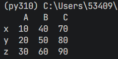

#### 新增列

`DataFrame.insert（loc，column=''，value=None，allow_duplicates=False）`

> insert 函数是 pandas DataFrame 类的一个方法，用于在数据框的指定位置插入一列。
> 
> 这个方法 **直接修改原 DataFrame**（in-place 操作），不会返回新的 DataFrame。

| 参数名 | 类型 | 作用 | 说明 |
| --- | --- | --- | --- |
| loc | int | 插入位置 | 表示要插入的列的位置索引（从 0 开始） |
| column | Hashable（通常是字符串） | 新列名 | 新列的名称，若与已有列冲突且 allow_duplicates=False 会报错 |
| value | 标量、类数组、Series 等 | 要赋给该列的数据 | 可以是单个值（全列填充），或等长数组/Series |
| allow_duplicates | bool | 是否允许列名重复 | 默认 False；若设为 True，可插入重复列名 |

```python
#可以选择插入的位置，1代表在第二列新增一列
df.insert(1,'m',[22,33,44],allow_duplicates=True)
print(df)
```

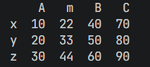

#### 默认在末尾插入一列

```bash
df['n']=[55,66,77]
print(df)
```

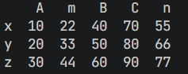

#### 新增行

```bash
df.loc['z1'] = [0,0,0,0,0]
```

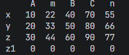

### 删除

`DataFrame.drop()` 是一种非常灵活的删除数据方法：

- 行删除 ➜ `df.drop(index=...)`
- 列删除 ➜ `df.drop(columns=...)`
- 指定方向 ➜ `axis=0`（行），`axis=1`（列）
- 原地操作 ➜ `inplace=True`
- 不存在标签不报错 ➜ `errors='ignore'`

#### 删除行（默认 axis=0）

```python
# 按标签删除行
df1 = df.drop('y')
print(df1)
```

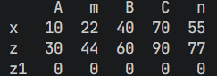

#### 删除多行

```python
df2 = df.drop(['x', 'z'])
print(df2)
```

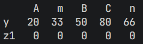

#### 删除列（使用 axis 参数）

```python
df3 = df.drop('B', axis=1)
print(df3)
```

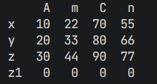

#### 删除多列（用 columns 参数）

```python
df4 = df.drop(columns=['A', 'C'])
print(df4)
```

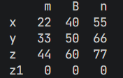

#### 原地删除

```python
df.drop('A', axis=1, inplace=True)
print(df)
```

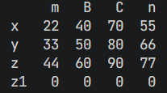

#### 忽略不存在的标签

```python
df.drop('not_exist', axis=1, errors='ignore')
# 不报错，静默忽略。
```

### 修改

#### 按标签修改（`.loc`）

`.loc[行标签, 列标签]` 是最常用、最清晰的定位修改方法。

```python
# 修改单个值
df.loc['y', 'B'] = 99
print(df)

df['m'] = [100, 200, 300,400]
print(df)
# loc修改整列
df.loc[:, 'A'] = [100, 200, 300]

# 修改多列
df.loc[:, ['A', 'B']] = df[['A', 'B']] * 10

# 按条件修改； 当列 A 的值大于 150 时，将对应的列 B 设为 0。
df.loc[df['A'] > 150, 'B'] = 0
```

#### 按位置修改（`.iloc`）

`.iloc[行号, 列号]` 按整数位置修改（从 0 开始）

```python
# 修改单个元素
df.iloc[1, 0] = 999  # 第二行第一列

# 修改整行
df.iloc[2] = [1, 2]

# 修改整列
df.iloc[:, 1] = [11, 22, 33]
```

#### 使用 `.at` 或 `.iat` 修改单个值（最快）

这两个是专门优化的**单元素**写入接口：

它们比 `.loc` / `.iloc` 在 **单元素修改** 时更快。

```python
df.at['x','B'] = 33
df.iat[0,0] = 77
```

#### 批量修改、映射修改

```python
# 通过函数映射修改
df['A'] = df['A'].apply(lambda x: x * 2)

# 使用字典映射修改
df['B'] = df['B'].replace({99: 999, 60: 600})
```

#### 修改索引或列名（结构调整）

## 数据概览

> 如何从文件读取、查看、预览、筛选数据

### 测试数据

> 我们后面需要用到下面测试数据；需提前下载

[📎 用户下单数据.csv](<files/用户下单数据.csv>)

[📎 电商销售数据.xlsx](<files/电商销售数据.xlsx>)

### 数据导入

#### 导入 CSV 文件

```python
# 读取用户下单数据
df_orders = pd.read_csv('docs/data/用户下单数据.csv', encoding='gbk')

# 查看基本信息
print(df_orders.shape)       # (5000, 8)
print(df_orders.head())      # 前5行
print(df_orders.info())      # 数据类型和缺失值
print(df_orders.describe())  # 统计摘要
```

#### 导入 Excel 文件

```python
# 读取电商销售数据
df_sales = pd.read_excel('docs/data/电商销售数据.xlsx')

print(df_sales.shape)   # (7284, 11)
print(df_sales.head())
```

### 数据查看

- **head（） 和 tail（）**：返回 DataFrame 的前 n 行或后 n 行；
- **sample（）**：随机抽取 DataFrame 的 n 行数据；
- **info（）**：显示 DataFrame 的简要摘要，包括索引类型、列名、非空值计数和数据类型；
- **dtypes**：查看数据的数据类型；
- **describe（）：**生成 DataFrame 的描述性统计信息，包括均值、标准差、最小值、最大值及 25%、50%、75%分位数；
- **shape**：返回数据的形状（行数，列数）；
- **index**：返回 DataFrame 行索引；
- **columns**：返回 DataFrame 的列名；
- **value_counts（）**：对于 Series 中的唯一值，返回其计数，常用于统计分类数据；
- **unique（）**：查看数据唯一值。

```python
#默认显示前5行,用于快速查看数据集的一小部分
df_sales.head()

#指定显示前10行数据
df_sales.head(10)

#与head()类似，但是返回的是后n行，默认显示后5行数据
df_sales.tail()

#随机抽取5行数据
df_sales.sample(5)

#提供数据的简要摘要，包括索引类型、列名、非空值计数和数据类型等
df_sales.info()

#数据类型
df_sales.dtypes

#生成数据的描述性统计信息，包括计数、均值、标准差、最小值、四分位数和最大值
df_sales.describe().round(0)

#返回数据的形状（行数，列数）
df_sales.shape

#返回DataFrame行索引
df_sales.index

#返回DataFrame的列名
df_sales.columns

#对于Series中的唯一值，返回其计数，常用于统计分类数据。
df_sales['商品品类'].value_counts()

#查看数据唯一值
df_sales['商品品类'].unique()
```

### 数据筛选

#### 选择列

```python
# 单列
print(df_orders['性别'])

# 多列
print(df_orders[['用户ID', '性别', '交易金额']])
```

#### 选择行

```python
# 使用 loc（基于标签）
print(df_orders.loc[0:4])  # 前5行（包含4）

# 使用 iloc（基于位置）
print(df_orders.iloc[0:5])  # 前5行（不包含5）
```

#### 条件筛选

```python
# 单条件：找出女性用户
female = df_orders[df_orders['性别'] == '女']
print(f"女性用户数: {len(female)}")

# 单条件：大额订单（>800元）
high_value = df_orders[df_orders['交易金额'] > 800]
print(f"大额订单数: {len(high_value)}")
print(f"大额订单平均金额: {high_value['交易金额'].mean():.2f}元")

# 多条件：已婚女性的大额订单
result = df_orders[
    (df_orders['性别'] == '女') & 
    (df_orders['婚姻状况'] == '已婚') & 
    (df_orders['交易金额'] > 800)
]
print(f"符合条件的订单数: {len(result)}")

# 使用 isin：本科或博士学历
edu_filter = df_orders[df_orders['文化程度'].isin(['本科', '博士'])]

# 使用 query（更直观）
result = df_orders.query('性别 == "女" and 交易金额 > 800')
```

#### 实战：不同学历消费

```python
for edu in df_orders['文化程度'].unique():
    edu_data = df_orders[df_orders['文化程度'] == edu]
    avg_amount = edu_data['交易金额'].mean()
    count = len(edu_data)
    print(f"{edu}: {count}人, 平均消费{avg_amount:.2f}元")
```

### 数据导出

pandas 可以导出为` .xlsx` 数据格式，以及可以按照不同的 sheet 表分别将数据导出。

#### 导出 Excel 数据

- **DataFrame.to_excel**： to_excel 函数可以将数据导出为 Excel（.xlsx）文件。
- **函数签名**：DataFrame.to_excel（excel_writer，sheet_name='Sheet1'，na_rep=''，float_format=None，columns=None，header=True，index=True，index_label=None，startrow=0，startcol=0，engine='xlsxwriter'，merge_cells=True，encoding=None，inf_rep='inf'，verbose=False，freeze_panes=None）
- **参数详解**：
  - excel_writer：文件路径或现有的 ExcelWriter 对象；
  - sheet_name：字符串，默认为'Sheet1'，表示要写入的 Excel 表的名字；
  - na_rep：缺失数据的表示方式，默认为空字符串；
  - float_format：浮点数的格式，例如'%。2f'表示保留两位小数；
  - columns：要写入的列。可以是列的名字或者是列的索引；
  - header：是否写入列名。默认为 True；
  - index：是否写入行索引。默认为 True；
  - index_label：索引的列标签。如果没有给出，并且 header 和 index 都为 True，则使用索引名。如果是多级索引，应该用一个序列给出各级索引的列标签；
  - startrow：整数，起始写入的行数，默认为 0；
  - startcol：整数，起始写入的列数，默认为 0；
  - engine：字符串，写入引擎，默认为'xlsxwriter'。另一个选项是'openpyxl'；
  - merge_cells：布尔值，是否合并单元格，默认为 True；
  - encoding：字符串，表示要使用的编码，默认为 None；
  - inf_rep：表示无穷大的字符串，默认为'inf'；
  - verbose：是否显示导出过程的日志，默认为 False；
  - freeze_panes：元组，指定分割窗格的位置。例如，freeze_panes=（1， 0）将首行冻结。

```python
import pandas as pd


df = pd.DataFrame({
    '用户ID': [6414111, 6516117, 6714112, 5311117],
    '性别': ['男', '女', '女', '女'],
    '文化程度': ['本科', '博士', '博士', '大专'],
    '交易金额': [402.77, 545.27, 256.72, 275.55]
})


df.to_excel('out_table.xlsx', #导出数据路径
            sheet_name='Sheet1',#写入的Excel表的名字
            index=False,#不显示行索引
            na_rep=0#缺失数据显示为0
           )
```

#### 导出为不同 sheet 表

- **pd.ExcelWriter**： ExcelWriter 函数可以用于将数据写入 Excel 文件，可导出为不同 sheet 表数据。
- **函数签名：**pandas.ExcelWriter（path_or_buf，engine=None，mode='w'，engine_kwargs，if_sheet_exists，date_format，datetime_format）
- **参数详解**：
  - path_or_buf：表示文件路径。或是一个类似文件的对象，确保在完成写入后关闭它；
  - engine：代表所使用的引擎。默认为'xlsxwriter'，但也可以使用'openpyxl'等其他引擎；
  - mode：指定写入模式。默认为'w'，代表写入模式，如果文件已存在，则会被覆盖。如果设置为'a'，则数据将被追加到已存在的文件中；
  - engine_kwargs：此参数用于传递特定引擎的参数。它是一个可选的关键字参数字典，其中的参数会传递给底层的引擎；
  - if_sheet_exists：当在追加模式下（mode='a'）并且工作表已存在时，该参数决定如何处理。它有三个选项：'error'（引发错误）、'new'（创建一个新工作表）、'replace'（删除现有工作表并创建一个新的）。默认为'error'；
  - date_format：字符串，指定日期格式。这可以用于 Excel 日期格式的字符串。例如：'YYYY-MM-DD'；
  - datetime_format：类似于 date_format，但是用于 datetime 数据类型；

```python
import pandas as pd
import numpy as np

#初始化ExcelWriter对象
writer = pd.ExcelWriter('out_sheet.xlsx', #指定文件路径
                        engine='openpyxl', #代表所使用的引擎
                        mode='w', #写入模式
                        )

#生成随机数据
df1 = pd.DataFrame(np.random.randn(10,4),
                  columns=list('ABCD'))

df2 = pd.DataFrame(np.random.randint(0,100,size=(10,4)),
                   columns=["col1", "col2", "col3", "col4"])

#使用to_excel()方法写入数据
df1.to_excel(writer, sheet_name='Sheet1',index=False)
df2.to_excel(writer, sheet_name='Sheet2',index=False)

#保存并关闭ExcelWriter对象
#writer.save() #保存
writer.close() #关闭
```

> 在 with 语句块中，当退出块时，会自动调用 save（）和 close（）方法，这种方法不需要显式调用这两个方法。这也确保了即使在发生错误时，文件也会被正确保存和关闭。

```python
with pd.ExcelWriter('output2.xlsx', engine='openpyxl') as writer:
    df1.to_excel(writer, sheet_name='Sheet1',index=False)
    df2.to_excel(writer, sheet_name='Sheet2',index=False)
```

## 数据重塑

> Pandas 数据重塑是一个非常重要的技术，主要来做`长表 = 宽表`的互相转换。
> 
> **宽表**：列多（指标特征多）；每个观测对象占一行，观测指标数据分布在不同列中。
> 
> **长表**：行多（数据内容长）；每个观测值占一行，通过额外的列来标识时间点/类别。

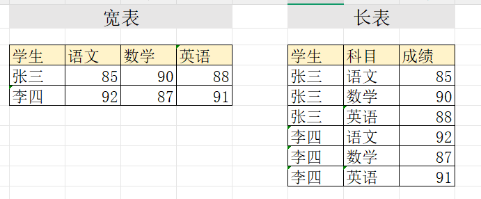

### 宽表转长表：melt()

#### 基本用法

`melt()` 函数将宽表转换为长表，也称为"融化"数据。

```python
import pandas as pd

# 创建宽表数据（学生成绩）
df_wide = pd.DataFrame({
    '学生': ['张三', '李四', '王五'],
    '语文': [85, 92, 78],
    '数学': [90, 87, 95],
    '英语': [88, 91, 82]
})

print("宽表格式:")
print(df_wide)
#   学生  语文  数学  英语
# 0  张三  85  90  88
# 1  李四  92  87  91
# 2  王五  78  95  82

# 转换为长表
df_long = pd.melt(
    df_wide,
    id_vars=['学生'],           # 保持不变的列（标识列）
    value_vars=['语文', '数学', '英语'],  # 要转换的列，可以不写。默认是除了id_vars中的列
    var_name='科目',            # 新列名（存储原列名）
    value_name='成绩'           # 新列名（存储值）
)

print("\n长表格式:")
print(df_long)
#   学生  科目  成绩
# 0  张三  语文  85
# 1  李四  语文  92
# 2  王五  语文  78
# 3  张三  数学  90
# 4  李四  数学  87
# 5  王五  数学  95
# 6  张三  英语  88
# 7  李四  英语  91
# 8  王五  英语  82
```

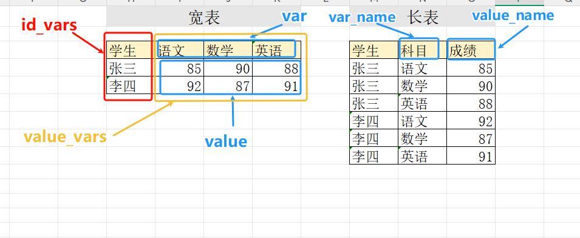

#### 实战：销售数据转换

```python
# 创建月度销售宽表
sales_wide = pd.DataFrame({
    '产品': ['手机', '电脑', '平板'],
    '1月': [1200, 800, 500],
    '2月': [1500, 900, 600],
    '3月': [1300, 850, 550]
})

print("原始宽表:")
print(sales_wide)

# 转换为长表
sales_long = pd.melt(
    sales_wide,
    id_vars=['产品'],
    var_name='月份',
    value_name='销售额'
)

print("\n转换后的长表:")
print(sales_long)
#    产品  月份  销售额
# 0  手机  1月  1200
# 1  电脑  1月   800
# 2  平板  1月   500
# 3  手机  2月  1500
# 4  电脑  2月   900
# 5  平板  2月   600
# 6  手机  3月  1300
# 7  电脑  3月   850
# 8  平板  3月   550

# 按产品分组计算总销售额
total_sales = sales_long.groupby('产品')['销售额'].sum()
print("\n各产品总销售额:")
print(total_sales)
```

#### 多个标识列的情况

```python
# 创建包含多个标识列的宽表
df_multi = pd.DataFrame({
    '城市': ['北京', '北京', '上海', '上海'],
    '区域': ['朝阳', '海淀', '浦东', '徐汇'],
    'Q1': [100, 120, 150, 130],
    'Q2': [110, 125, 160, 135],
    'Q3': [105, 130, 155, 140],
    'Q4': [115, 135, 165, 145]
})

print("原始数据:")
print(df_multi)

# 转换为长表，保留多个标识列
df_long_multi = pd.melt(
    df_multi,
    id_vars=['城市', '区域'],  # 多个标识列
    var_name='季度',
    value_name='销售额'
)

print("\n转换后:")
print(df_long_multi)
```

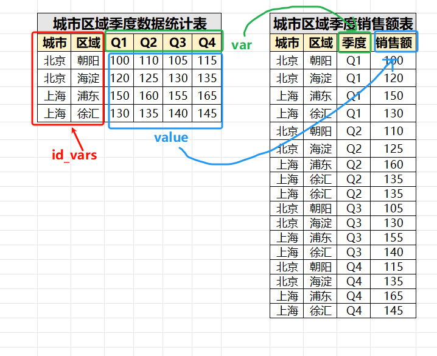

### 长表转宽表：pivot()

`pivot()` 函数将长表转换为宽表，也称为"透视"数据。

#### 基本用法

```python
# 使用之前的长表数据
print("长表格式:")
print(df_long)

# 转换回宽表
df_wide_back = df_long.pivot(
    index='学生',      # 作为行索引的列
    columns='科目',    # 作为列名的列
    values='成绩'      # 填充值的列
)

print("\n转换回宽表:")
print(df_wide_back)
# 科目    数学  英语  语文
# 学生                
# 张三    90  88  85
# 李四    87  91  92
# 王五    95  82  78

# 重置索引，使其更像原始宽表
df_wide_back = df_wide_back.reset_index()
print("\n重置索引后:")
print(df_wide_back)
```

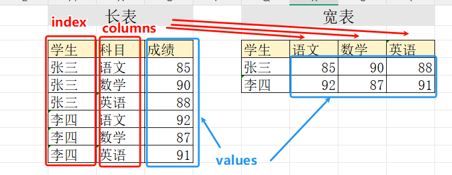

#### 实战：销售数据透视

```python
# 使用之前的销售长表
print("销售长表:")
print(sales_long)

# 转换为宽表
sales_wide_back = sales_long.pivot(
    index='产品',
    columns='月份',
    values='销售额'
)

print("\n转换回宽表:")
print(sales_wide_back)
# 月份   1月   2月   3月
# 产品               
# 平板   500  600  550
# 手机  1200 1500 1300
# 电脑   800  900  850
```

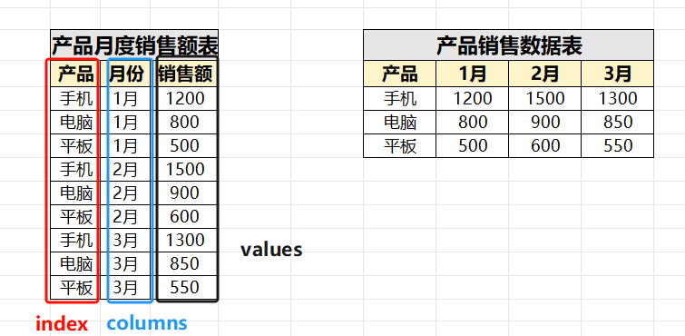

#### 处理重复值：pivot_table()

当数据中存在重复的索引-列组合时，使用 `pivot_table()` 并指定聚合函数。

```python
# 创建有重复值的长表
sales_dup = pd.DataFrame({
    '产品': ['手机', '手机', '电脑', '电脑', '手机', '电脑'],
    '月份': ['1月', '1月', '1月', '1月', '2月', '2月'],
    '销售额': [1000, 1200, 800, 850, 1500, 900]
})

print("有重复值的长表:")
print(sales_dup)

# 使用 pivot_table 处理重复值（默认求平均）
sales_pivot = pd.pivot_table(
    sales_dup,
    index='产品',
    columns='月份',
    values='销售额',
    aggfunc='sum'  # 可以是 'sum', 'mean', 'count' 等
)

print("\n使用 pivot_table 转换:\n")
print(sales_pivot)
# 月份    1月    2月
# 产品            
# 手机  2200  1500
# 电脑  1650   900
```

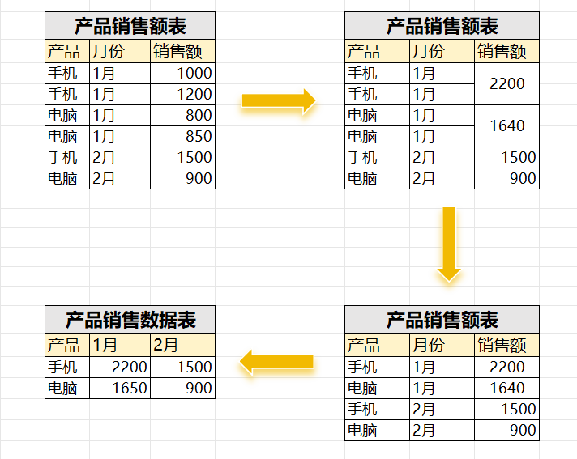

## 数据清洗

> 数据清洗是数据分析和数据科学流程中的关键步骤，指对原始数据进行检测、识别和处理，以消除或修正数据中的错误、不一致、冗余、缺失值、异常值等问题，使数据变得整洁、准确、可靠，从而适合后续的分析和建模工作。

```python
import pandas as pd
sale_table=pd.read_excel(r'docs/data/电商销售数据.xlsx',
                       sheet_name='销售数据_清洗')#导入数据处理这个sheet表

print(sale_table.head())
```

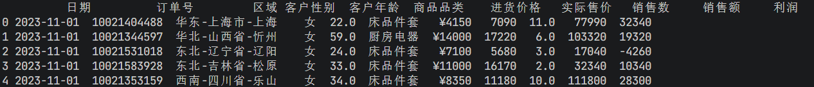

### **数据类型转化**

```python
#数据类型
print(sale_table.dtypes)
```

> - datetime64[ns]包含日期和具体的时间（小时，分钟，秒，毫秒，微秒，纳秒）
> - datetime64[D]仅包含日期信息，不包含具体的时间信息。

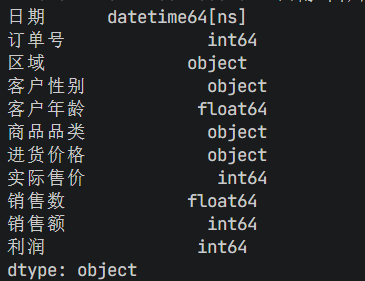

`DataFrame.astype(dtype, copy=True, errors='raise', **kwargs)`

参数解释：

- **dtype**: 字典或标量，指定列的数据类型。如果传递的是字典，则字典的键应为列名，值应为要转换的数据类型。如果传递的是标量，则会将该数据类型应用于所有列；
- **copy**: 布尔值，默认为True，指定是否返回新对象。如果是False，则会在原地更改DataFrame；
- **errors**:{'raise', 'ignore'}，默认为'raise'，指定如何处理无效的数据类型转换。如果设置为'raise'，则无效转换会引发异常。如果设置为'ignore'，则无效转换会被忽略；
- kwargs其他关键字参数。

```python
#转换为字符型数据
sale_table['订单号']= sale_table['订单号'].astype(str)
print(sale_table['订单号'].dtype)


# to_datetime转换日期类型
sale_table['日期'] = pd.to_datetime(sale_table['日期'])

# 提取日期组件
sale_table['年'] = sale_table['日期'].dt.year
sale_table['月'] = sale_table['日期'].dt.month
sale_table['星期'] = sale_table['日期'].dt.dayofweek

print(sale_table.head())
```

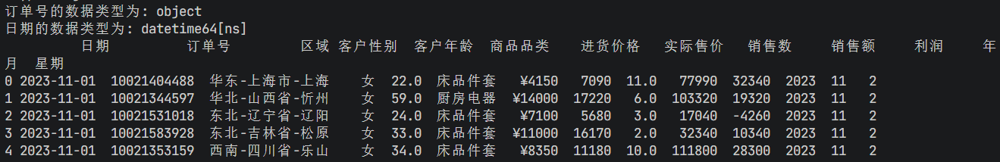

### 数据分列

`DataFrame[column].str.split(pat, n=None, expand=False)`

参数解释：

- **pat：**字符串，分隔符，默认是空格；
- **n：**整数，可选参数，指定最大的分割次数；
- **expand：**布尔值，默认为False。如果为True，则返回DataFrame。如果为False，则返回Series，其中每个条目都是字符串列表。

```python
df_split=sale_table['区域'].str.split(pat='-',expand=True)#数据拆分

sale_table['区域']=df_split.iloc[:,0]
sale_table['省份']=df_split.iloc[:,1]
sale_table['城市']=df_split.iloc[:,2]

print(sale_table)
```

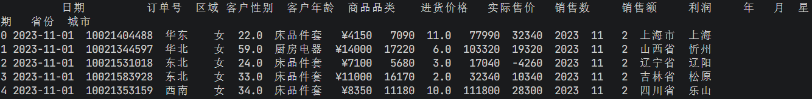

### 行列聚合

> 获取每一个区域，都卖了哪些品类的商品

apply与lambda，可用于DataFrame行列操作。

`DataFrame.apply(func,axis=0,broadcast=False,raw=False,reduce=None,result_type=None,args=(),**kwds)`

参数说明：

- **func**: 要应用的函数;
- **axis**: {0 or 1}, 默认是0。0表示将函数应用到每一列，1表示将函数应用到每一行;
- **broadcast**: 是否广播结果到原始形状，默认为 False;
- **raw**: 是否将每一块作为 ndarray 对象传递给函数，默认为 False;
- **reduce**: 是否尝试使用减少的方式,如：使用 numpy.sum来处理结果，默认为 None;
- **result_type**: 结果的数据类型，默认为 None;
- **args**: 传递给函数的额外位置参数;
- ****kwds**: 传递给函数的额外关键字参数。

```python
#行列聚合
df_group = sale_table.groupby(['区域']).apply(lambda x: x['商品品类'].unique()).reset_index() 
df_group.rename(columns={0:'商品品类'},inplace=True)#重命名
print(df_group)
```

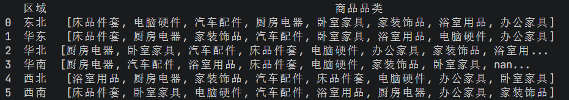

### 缺失值处理

```python
#1. 缺失值统计
print(sale_table.isnull().sum())
```

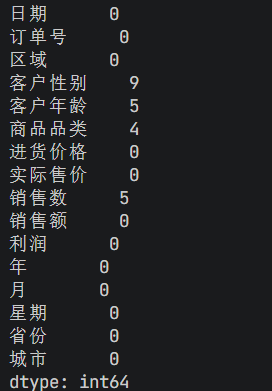

```python
#2. 删除缺失值
df_clean = sale_table.dropna()

#2. 缺失值填充

sale_table = sale_table.fillna({'客户性别':'x','商品品类':'无品类'})
print(sale_table[(sale_table['客户性别']=='x') | (sale_table['商品品类']=='无品类')])
```

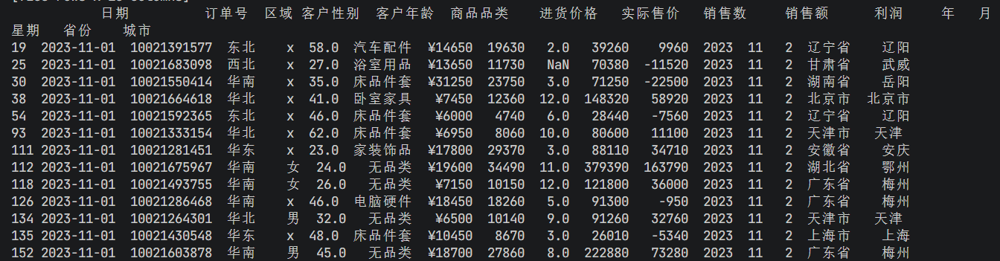

### 重复值处理

```python
# 检测重复
print(sale_table.duplicated().sum())

# 查找整个DataFrame中的重复行； 默认认为，所有的列值都一样的，即为重复行
duplicates_in_df = sale_table[sale_table.duplicated()]  
print(duplicates_in_df)

# 删除重复; 删除整个DataFrame中的重复行，保留第一个出现的行  
df_unique = sale_table.drop_duplicates()

# 基于特定列去重； 默认 subset 的列是所有列。可以指定列。指定列值一样即视为重复
df_unique = sale_table.drop_duplicates(subset=['订单号'])

```

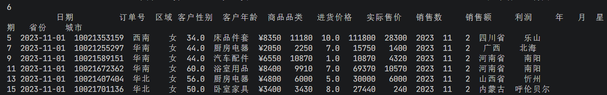

## 数据转换

### 添加新列

```python
import pandas as pd
df_orders=pd.read_csv('docs/data/用户下单数据.csv',encoding='gbk')
print(df_orders.head())

# 计算年龄
df_orders['用户出生日期'] = pd.to_datetime(df_orders['用户出生日期'])
df_orders['年龄'] = 2025 - df_orders['用户出生日期'].dt.year

# 分类标签
df_orders['消费等级'] = df_orders['交易金额'].apply(
    lambda x: '高' if x > 800 else ('中' if x > 400 else '低')
)

# 使用 cut 分箱
df_orders['年龄段'] = pd.cut(
    df_orders['年龄'],
    bins=[0, 30, 40, 50, 100],
    labels=['青年', '中年', '壮年', '老年']
)
print(df_orders.head())
```

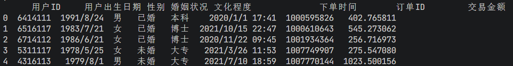

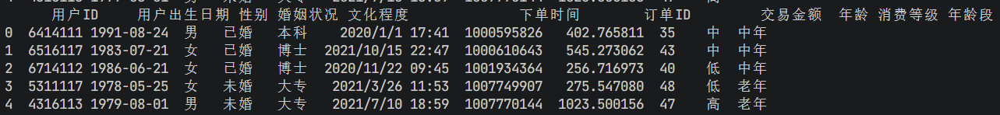

### 字符串处理

```python
# 读取销售数据
df_sales = pd.read_excel('docs/data/电商销售数据.xlsx')
print(df_sales.head())
# 分割区域信息
df_sales[['大区', '省份', '城市']] = df_sales['区域'].str.split('-', expand=True)

# 清理价格数据（去除¥符号）
df_sales['进货价格_clean'] = df_sales['进货价格'].str.replace('¥', '').astype(int)
print(df_sales.head())
```

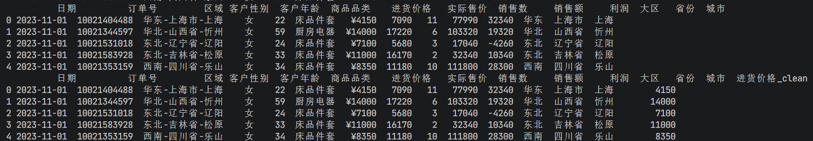

### 排序

```python
# 按交易金额降序
df_sorted = df_orders.sort_values('交易金额', ascending=False)
print(df_sorted.head(10))  # 前10大订单

# 多列排序
df_sorted = df_orders.sort_values(['年龄', '交易金额'], ascending=[True, False])
print(df_sorted.head(20)) 
```

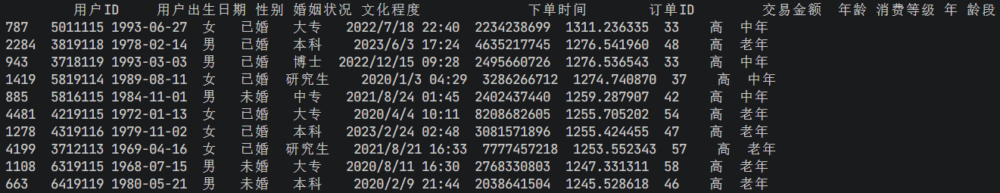

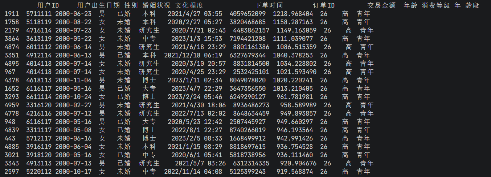

### 表格拼接

> - **concat()**： concat 是 Pandas 库中的一个函数，用于沿一条轴将多个对象堆叠到一起。
> - 可以实现表格 水平/垂直拼接

- **函数签名：**pandas.concat（objs， axis=0， join='outer'， ignore_index=False， keys=None， levels=None， names=None， verify_integrity=False， sort=False）
- **参数解释**：
  - **objs**：一个或多个 DataFrame 或 Series 对象的序列或映射。如果传递了映射（例如字典），则排序的键将用作键参数，除非传递了键参数；
  - **axis**：要连接的轴。<u>** 0 或'index'表示按行连接（默认）**</u>，1 或'columns'表示按列连接；
  - join：如何处理其他轴上的索引。 'outer'表示采用并集（默认），'inner'表示采用交集；
  - **ignore_index**：布尔值，默认为 False。如果为 True，则重置并忽略连接轴上的索引；
  - **keys**：序列，默认为 None。使用传递的键作为最外层构建分层索引。如果传递了多个级别的序列，则应包含元组；
  - levels：序列列表，默认为 None。用于构建 MultiIndex 的特定级别（唯一值）。否则它们将从键参数推断出来；
  - names：由此产生的分层索引的名称列表；
  - verify_integrity：布尔值，默认为 False。检查新的串联轴是否包含重复项。这对于实际的大型数据集可能代价高昂；
  - **sort**：布尔值，默认为 False。不要对结果进行排序。如果为 True，将按照出现在连接轴上的顺序对结果进行排序。这会在大多数情况下导致性能下降，具体取决于数据的性质。

#### 拼接行

```python
append0=pd.DataFrame([[11,12],[13,14]],columns=['二班','一班'],index=['优','良'])
print(append0)

append1=pd.DataFrame([[15,16]],columns=['二班','三班'],index=['差'])
print(append1)

#append函数拼接，排序； keys = ['k1','k2']
append2= pd.concat([append0,append1],
          axis= 0, #指定扩展轴，默认0，拼接行
          sort=True,
          ignore_index=False) #ignore_index=True去除索引
print(append2)
```

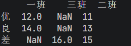

#### 拼接列

```python
#append函数拼接，排序
append3= pd.concat([append0,append1],
          axis = 1, #指定扩展轴，1 = 拼接列
          sort=True,
          ignore_index=False) #ignore_index=True去除索引
print(append3)
```

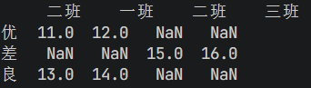

## 分组聚合

### 统计分析

> 描述统计是通过统计方法对数据资料进行整理、分析和描述，以揭示数据的分布特征、数字特性以及变量之间的关系。它是一种重要的统计分析方法，旨在提炼数据中的关键信息和规律。

描述统计中常用的指标包括以下几类：

1. **集中趋势指标**：用于反映数据的集中程度。主要的统计指标有：
  - **平均数**：所有数据之和除以数据个数，易于理解，但容易受到极端值的影响。
  - **中位数**：将数据由小到大排列后，位于中间位置的数。它不易受到极端值的影响。
  - **众数**：数据中出现次数最多的数。它反映了数据的集中趋势，尤其适合描述定类数据。

1. **离散程度指标：**用于反映数据之间的离散或差异程度。主要的统计指标有：

- **极差**：数据中最大值与最小值的差，简单明了但容易受到极端值影响。
- **方差与标准差**：描述数据与其平均数之间的离散程度。方差是每个数据与平均数差的平方的平均数，而标准差是方差的平方根。

1. **偏态与峰态指标**：用于描述数据分布的形状。

- **偏态**：衡量数据分布的不对称性。正偏态表示数据向左倾斜，负偏态表示数据向右倾斜。
- **峰态**：衡量数据分布的尖峰或扁平程度。峰态大于 3 表示分布尖峰，小于 3 表示分布扁平。

这些描述统计指标可以帮助我们更好地理解和分析数据的基本特征和分布规律。

#### 描述统计

> Pandas 描述统计方法可以帮助我们计算各种统计指标，如均值、中位数、标准差等，这些指标能够描述数据的中心趋势、分散程度、分布形态等特征。除了这些基本的统计指标，Pandas 还提供了一些更为高级的描述统计方法，如分位数、众数等，这些方法能够进一步帮助我们了解数据的分布情况和特征。

> 比如，在电商领域，通过分析电商利润的收益率、波动率等统计指标，可以评估电商市场的风险和投资机会；在市场营销领域，通过描述统计方法可以了解消费者的购买行为和偏好，为市场策略制定提供依据。

Pandas 提供的描述统计方法对于数据分析和决策制定来说是一大利器，能更好地理解和总结数据，进而做出更明智的决策，以下是 Pandas 描述统计的常用方法。

- **describe（）**：生成描述性统计的汇总表，包括计数、平均值、标准差、最小值、最大值等。默认情况下，它只适用于数值型列。可以通过传递参数来包括其他统计信息和非数值型列。
- **count（）**：计算每列中非空值的数量；
- **value_counts（）**：用于统计分类数据中各个唯一值的频数；
- **sum（）**：计算每列的和；
- **max（）**：计算每列的最小值；
- **min（）**：计算每列的最大值；
- **mean（）**：计算每列的平均值；
- **mode（）**：计算每列的众数；
- **var（）**：计算每列的方差；
- **std（）**：计算每列的标准差。

```python
import pandas as pd
df_sale=pd.read_excel(r'docs/data/电商销售数据.xlsx',
                       dtype={'订单号':str},
                       sheet_name='销售数据')#导入销售数据sheet表
print(df_sale.head())

#全表描述统计
print(df_sale.describe().round())

#订单号计数
print("订单号计数:",df_sale['订单号'].count())

#商品品类计数
print("商品品类计数:",df_sale['商品品类'].value_counts())

#销售数求和
print("销售数求和:",df_sale['销售数'].sum())

#利润求最大值
print(df_sale['利润'].max())

#利润求最小值
print(df_sale['利润'].min())

#利润求平均值
print(df_sale['利润'].mean())

#利润求四分位数
#四分位数 （Quartile）：将数据分为4等份的3个分割点
#- Q1（25%分位数）：第1个四分位数，有25%的数据小于或等于此值
#- Q2（50%分位数）：第2个四分位数，即中位数，有50%的数据小于或等于此值
#- Q3（75%分位数）：第3个四分位数，有75%的数据小于或等于此值
print("利润四分位数:",df_sale['利润'].quantile([0.25,0.5,0.75]))
#销售额求众数
print("销售额众数:",df_sale['销售额'].mode())

#销售额求方差
print("销售额方差:",df_sale['销售额'].var())

#销售额求标准差
print("销售额标准差:",df_sale['销售额'].std())
```

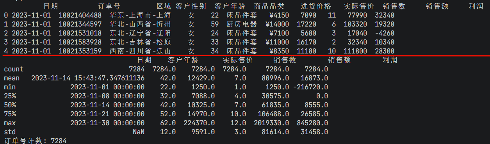

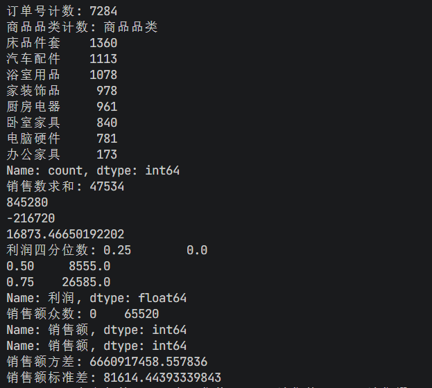

#### 相关分析

> 相关分析是一种探索性的统计分析方法，用于研究两个或两个以上变量间是否存在相关性

- **df.corr（）：** df.corr（）是 Pandas DataFrame 的一个方法，用于计算数据框中列之间的相关系数。
- **函数签名**：DataFrame.corr（method='pearson'， min_periods=1）
- **参数解释**：
  - **method**：可选值为 {'pearson'， 'kendall'， 'spearman'}，表示计算相关系数的方法；
    - 'pearson'：皮尔逊相关系数，用于衡量两个变量之间的线性关系，取值范围为 -1 到 1；
    - 'kendall'：肯德尔等级相关系数，用于衡量两个有序分类变量之间的相关性；
    - 'spearman'：斯皮尔曼等级相关系数，用于衡量两个变量之间的单调关系，不受异常值影响；
  - **min_periods**：样本中至少需要有多少个非 NA 值。如果数据中没有足够的非 NA 值，则结果将为 NA。
- **返回值：**
  - 1 ：完全正相关（一个变量增加，另一个变量也完全线性增加）
  - 0 ：无线性相关（变量间没有线性依赖关系）
  - -1 ：完全负相关（一个变量增加，另一个变量完全线性减少）

```python
#相关系数
print(df_sale.corr(numeric_only=True))

#相关系数
df_sale['实际售价'].corr(df_sale['销售额'])
```

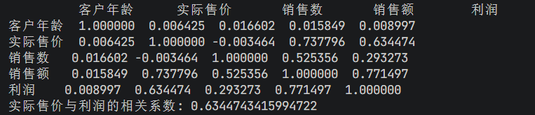

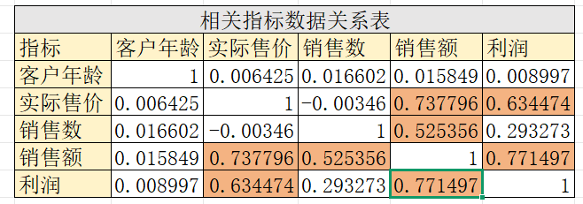

### 数据分组

> 数据分组是数据处理和分析过程中常用且重要的技术。Pandas 提供了多种方法来进行数据分组，其中包括 pd.qcut（）自动分组、pd.cut（）手动分组，以及 df.groupby（）数据分析方法，这些方法可以满足不同的分组需求。

1. **当数据量较大且分布不均匀时，使用 **`pd.qcut()`** 自动分组是一种便捷的选择**。该方法可以根据数据的分布情况，将数据自动划分为若干个等频分组，使得每个组内的数据数量大致相等。可以省去手动分组的繁琐工作，同时能更好地观察数据的分布情况和规律。
2. `pd.cut()`** 手动分组方法则允许根据自定义的分组条件来进行数据分组。**可以自行指定分组的边界和范围，将数据划分到指定的组中。这种分组方式更加灵活，可以根据分析目的和特定需求来进行个性化的分组操作，更准确地把握数据的特征和细节。
3. `df.groupby()`** 方法是 Pandas 中一种强大的数据分析工具，它可以在数据分组的基础上进行更复杂的分析和计算**。通过 df.groupby（）方法，可以对分组后的数据进行聚合运算、统计分析、数据转换等操作，进一步挖掘数据中的有价值信息。

#### 自动区间分组 - **qcut**

- **pd.qcut（）自动分组 **： pd.qcut（）用于将连续型变量离散化为具有相等频率的区间/分箱，是基于分位数的切割方法。
- **函数签名**：pandas.qcut（**x**， **q**， labels=None， retbins=False， precision=3， duplicates='raise'， include_lowest=False）
- **参数解释**：
  - **x**：一维数组或类似数组的对象，需要被分箱的数据。
  - **q**：整数或分位数列表，表示要切割成的分箱数量或指定的分位数。例如，q=5 表示将数据切割成 5 个等分箱；**q=[0， 0.25， 0.5， 0.75， 1] **表示将数据按照指定的分位数进行切割。
  - labels：可选参数，用于指定每个分箱的标签。如果不提供，则使用整数标记。
  - retbins：布尔值，默认为 False。如果为 True，则返回分箱的边界。
  - precision：整数，默认为 3。表示分箱边界的小数位数。
  - duplicates：字符串，默认为 'raise'。如果设置为 'drop'，则删除重复的分箱边界。
  - include_lowest：布尔值，默认为 False。如果为 True，则最低边界将被包含在内。

```python
#利润求最大值
print(df_sale['利润'].max())
#利润求最小值
print(df_sale['利润'].min())
#利润求平均值
print(df_sale['利润'].mean())

#利润自动分组
profit_qcut=pd.qcut(df_sale['利润'],10)
print("利润自动分组:\n",profit_qcut)
#利润自动分组计数
print("利润自动分组计数:\n",profit_qcut.value_counts())

df_sale['qcut分组']=profit_qcut
print(df_sale.head(10))
```

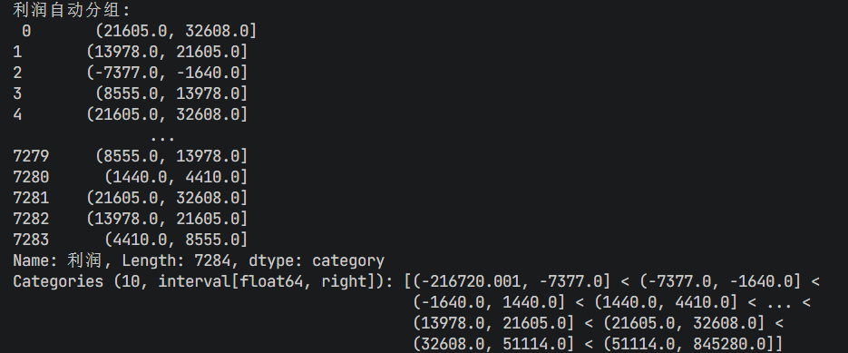

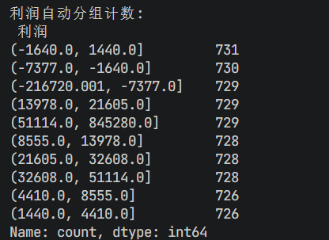

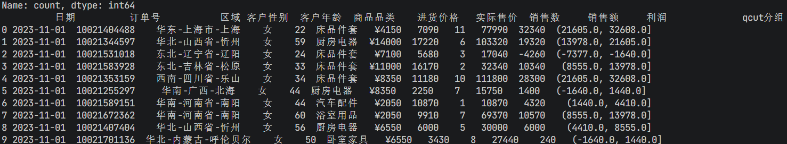

#### 手动区间分组 - cut

- **pd.cut（）手动分组**： pd.cut（）用于将连续变量划分为指定的离散区间/分箱。与 pd.qcut（）不同，pd.cut（）不是基于分位数的，而是基于用户定义的边界进行切割。
- **函数签名：**
  - pandas.cut(x,bins,right=True,labels=None,retbins=False,precision=3,include_lowest=False,duplicates='raise')
- **参数解释：**
  - **x**：一维数组或类似数组的对象，需要被分箱的数据。
  - **bins**：整数或序列。如果是一个整数，定义了 x 范围内的均匀间隔的 bin 边界。如果是一个序列，定义了非均匀的 bin 边界。也就是说，bins 参数定义了分箱的边界。
  - right：布尔值，默认为 True，表示每个区间是右闭左开的，即区间包含右边界，但不包含左边界。
  - labels：可选参数，一个长度与 bins 相同的列表，用于指定每个区间的标签。如果不提供，则使用整数标记。
  - retbins：布尔值，默认为 False。如果为 True，返回 bin 的边界。
  - precision：整数，默认为 3，表示存储和显示 bin 标签的小数位数。
  - include_lowest：布尔值，默认为 False。如果为 True，则第一个区间将包含最低值。
  - duplicates：默认为 'raise'，如果 bins 中有重复值则抛出 ValueError。如果设置为 'drop'，则删除重复的分箱边界。

```python
#手动分组
profit_cut=pd.cut(df_sale['利润'],bins=[-300000,-200000,-100000,0,100000,200000,300000,400000,500000,600000,700000,800000,900000])
df_sale['cut分组']=profit_cut
print(df_sale.head(10))
```

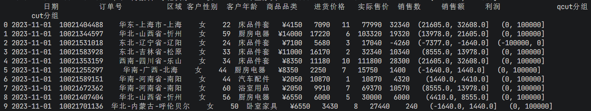

#### 数据分组 - **groupby**

- **df.groupby（）：** df.groupby（）用于根据一个或多个列对数据进行分组。
- **函数签名：**
  - DataFrame.groupby(by=None,axis=0,level=None,as_index=True,sort=True,group_keys=True,squeeze=False,observed=False,dropna=True)
- **参数解释：**
  - by：用于分组的列名或列名的列表。也可以是一个函数，应用于索引或列；
  - axis：默认为 0，表示按行进行分组。如果是 1，表示按列进行分组；
  - level：在 MultiIndex（分层索引）的情况下，用于分组的级别名称；
  - as_index：默认为 True，表示分组标签将被用作结果索引的一部分。如果设置为 False，则分组标签将被返回为常规列；
  - sort：默认为 True，表示在分组前对数据进行排序。如果设置为 False，则不进行排序；
  - group_keys：默认为 True，表示在访问分组后的数据时，将分组标签作为索引的一部分。如果设置为 False，则不保留分组标签；
  - squeeze：如果设置为 True，且结果只包含一个列，则返回 Series 而不是 DataFrame；
  - observed：默认为 False，如果设置为 True，则只返回实际观察到的值；
  - dropna：默认为 True，如果设置为 False，则组别的键将包括空值，并且空值也将被考虑在内。

> 以上只是使用 groupby（）函数进行分组，实际上还没有进行任何计算，可以调用聚合函数（如 count，sum，mean 等）或者应用自定义的函数进行数值运算，比如下面按照各商品品类订单号计数，可以调用。count（）聚合函数。

```python
#各商品品类订单号计数
print("各商品品类订单号计数:",df_sale.groupby('商品品类')['订单号'].count())

#各商品品类订单号计数,降序排列
print("各商品品类订单号计数,降序排列:\n",df_sale.groupby('商品品类')['订单号'].count().reset_index().sort_values('订单号',ascending=False))

#各区域不同商品类别订单数
print("各区域不同商品类别订单数:\n",df_sale.groupby(['区域','商品品类'])['订单号'].count().reset_index().head(10))

#各产品销售额求和
print("各产品销售额求和:\n",df_sale.groupby('商品品类')['销售额'].sum().reset_index())
```

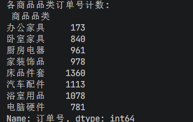

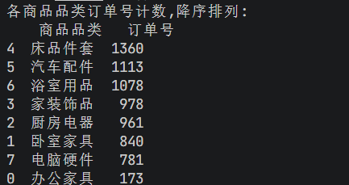

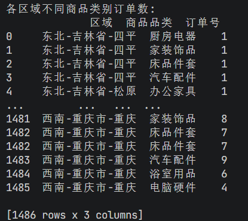

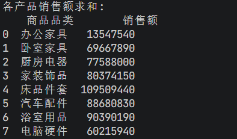

### 数据聚合

> `aggregate `**函数（可以简写为**`agg`**）是 groupby 对象的一个方法，用于在分组后的数据上应用聚合操作。它允许对每个组应用各种聚合函数，如求和、均值、最大值、最小值等。aggregate 方法提供了灵活的方式来计算和汇总分组后的数据。**

比如，这里对各区域的订单数计数和求和，可以在 aggregate 函数中添加一个列表 ['count'，'sum']，可分别进行数值运算。

#### 单列值聚合

```python
#各区域订单数计数
df_sale.groupby('商品品类')['销售额'].sum().reset_index()
```

```python
# 多个聚合函数
sale_stats = df_sale.groupby('商品品类')['销售额'].agg(['count', 'mean', 'sum', 'max', 'min'])
print(sale_stats)
```

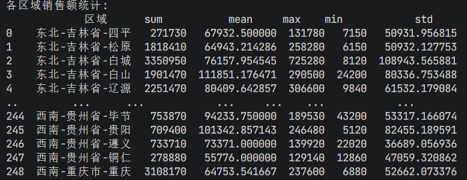

#### 多列值聚合

```python
# 多列分组；按性别和品类分组
group_stats = df_sale.groupby(['客户性别','商品品类']).agg({
    '订单号': 'count',
    '销售额': ['sum','max','min'],
    '利润': ['mean','sum']
}).reset_index()
print(group_stats)
```

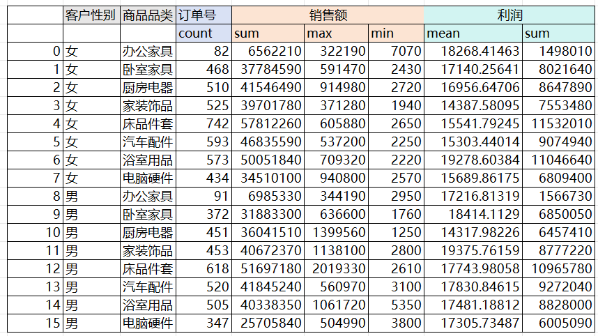

## 数据透视表

> **pivot_table()：是一个很重要的函数。用于创建透视表的函数，与 Excel 数据透视表相似；我们在这里再仔细说明；**
> 
> - **函数签名**：pd.pivot_table（data， values=None， index=None， columns=None， aggfunc='mean'， fill_value=None， margins=False， dropna=True， margins_name='All'）
> - **参数解释**：
>   - **data**: 需要创建透视表的 DataFrame；
>   - **index**: 透视表的行标签或标签列表；
>   - **values**: 用于聚合的列或列的列表；
>   - **columns**: 透视表的列标签或标签列表；
>   - **aggfunc**: 聚合函数或函数列表，**默认为 'mean'。**可以是内置的聚合函数，如 'sum'、'mean'、'count'、'min'、'max' 等，也可以是自定义的函数；
>   - **fill_value**: 在透视表中用于填充缺失值的值；
>   - **margins**: 是否添加行/列小计和总计，默认为 False；
>   - **dropna**: 是否删除所有项都是 NaN 的列，默认为 True；
>   - **margins_name**: 添加到总计行/列的名称，默认为 'All'。

> 准备数据

```python
import pandas as pd
# 读取销售数据
df_sales = pd.read_excel('docs/data/电商销售数据.xlsx')
print(df_sales.head())
# 分割区域信息
df_sales[['区域', '省份', '城市']] = df_sales['区域'].str.split('-', expand=True)
```

### 各区域的销售额

对各区域的销售额数据透视，index 为'区域'，values 为'销售额'。

```python
#各区域销售额情况
pt = pd.pivot_table(df_sales,index=['区域'],values='销售额')
print(pt)
```

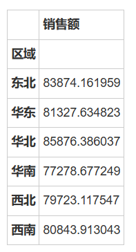

### 各个区域的不同产品销售额

对各个区域的不同产品销售额数据透视，可以在 index 中添加新的列表字段，如 ['区域'，'商品品类']。

```python
#各区域不同产品销售额情况
pd.pivot_table(df_sales,index=['区域','商品品类'],values='销售额').head(10)
```

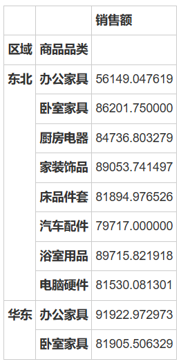

### 索引重置

reset_index（）函数用于重置 DataFrame 的索引，对于多级索引的 DataFrame，。reset_index（）可用于减少索引的级数，或者将多级索引转换为列。

```python
#各区域不同产品销售额情况，重置索引
pd.pivot_table(df_sales,index=['区域','商品品类'],values='销售额').reset_index().head(10)
```


### 添加总计

设置参数 `margins`=True，可以给行/列添加总计，`margins_name`='总计'，添加名称，`fill_value`=0，将缺失值填充为 0。

```python
#各区域不同产品销售额情况，加总计,缺失值填充为0
pd.pivot_table(df_sales,
               index=['区域','商品品类'],
               values='销售额',
               margins=True,
               margins_name='总计',
               fill_value=0
              ).tail()
```


### 不同聚合方法

对于各区域不同产品订单数计数，销售额求和，使用 `aggfunc `函数，传入一个字典 {'订单号':'count'，'销售额':'sum'}，对订单号字段计数，对销售额字段求和。

```python
#各区域不同产品订单数，销售额情况，加总计,缺失值填充为0(长表)
pd.pivot_table(df_sales,index=['区域','商品品类','客户性别'],
               values=['订单号','销售额'],
               aggfunc={'订单号':'count','销售额':'sum'},
               margins=True,
               margins_name='总计',
               fill_value=0
              )
```

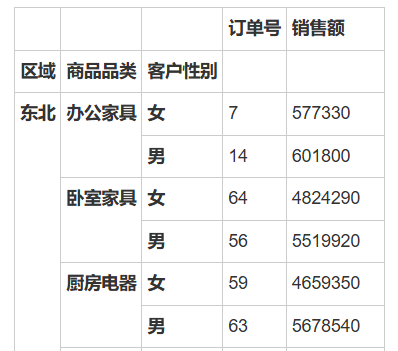

### Columns 指定透视列

传入 columns 参数，可分别对不同性别的用户做数据透视。

```python
#各销售平台不同产品订单数，销售额情况，加总计,缺失值填充为0（宽表）
pd.pivot_table(df_sales,index=['区域','商品品类'],
               columns=['客户性别'],
               values=['订单号','销售额'],
               aggfunc={'订单号':'count','销售额':'sum'},
               margins=True,
               margins_name='总计',
               fill_value=0)
```

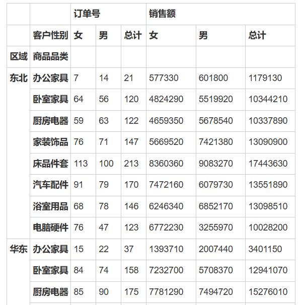

### Loc 数据筛选

对于数据透视表的数据，可以使用。`loc 函数`进行筛选。

```python
#加筛选器
table=pd.pivot_table(df_sales,
                     index=['区域','商品品类'],
                     columns=['客户性别'],
                     values=['订单号','销售额'],
                     aggfunc={'订单号':'count','销售额':'sum'},
                     margins=True,
                     margins_name='总计',
                     fill_value=0)
table.loc[['华东','西北'],'销售额']
```


## 时间序列分析

```python
import pandas as pd

df_orders = pd.read_excel('docs/data/电商销售数据.xlsx',
                       sheet_name='销售数据')#导入销售数据sheet表
print(df_orders.head())
```

### **时间数据处理**

```python
print(df_orders.dtypes)
# 转换为日期时间类型
df_orders['日期'] = pd.to_datetime(df_orders['日期'])

# 提取时间组件
df_orders['年'] = df_orders['日期'].dt.year
df_orders['月'] = df_orders['日期'].dt.month
df_orders['日'] = df_orders['日期'].dt.day
df_orders['星期'] = df_orders['日期'].dt.dayofweek
df_orders['小时'] = df_orders['日期'].dt.hour
```

### **按时间聚合**

```python
# 按年月统计订单
df_orders['年月'] = df_orders['日期'].dt.to_period('M')
monthly_sales = df_orders.groupby('年月').agg({
    '销售额': ['count', 'sum', 'mean']
}).round(2)
print(monthly_sales)

# 按星期分析
weekday_sales = df_orders.groupby('星期')['销售额'].agg(['count', 'mean'])
weekday_sales.index = ['周一', '周二', '周三', '周四', '周五', '周六', '周日']
print(weekday_sales)
```

### **销售趋势分析**

```python
# 每日销售趋势
daily_sales = df_orders.groupby('日期').agg({
    '销售额': 'sum',
    '利润': 'sum',
    '订单号': 'count'
})
daily_sales.columns = ['销售额', '利润', '订单数']
print(daily_sales)

# 计算移动平均
daily_sales['销售额_7日均值'] = daily_sales['销售额'].rolling(window=7).mean().round(2)
print(daily_sales)
```

## 数据合并

> 主要模拟SQL中的联表操作

```sql
# 内连接（inner join）
merged_inner = pd.merge(df1, df2, on='key', how='inner')

# 左连接（left join）
merged_left = pd.merge(df1, df2, on='key', how='left')

# 右连接（right join）
merged_right = pd.merge(df1, df2, on='key', how='right')

# 外连接（outer join）
merged_outer = pd.merge(df1, df2, on='key', how='outer')
```

- **merge：** merge 用于通过一个或多个键将两个 DataFrame 的行连接起来。
- **函数签名：**
  - pandas.merge(left,right,how='inner',on=None,left_on=None,right_on=None,left_index=False,right_index=False, sort=True,suffixes=('_x', '_y'),copy=True,indicator=False,validate=None)
- **参数解释：**
  - `left`：参与合并的左侧 DataFrame；
  - `right`：参与合并的右侧 DataFrame；
  - `how`：合并类型，可以是以下之一：
    - left：左连接，使用右侧 DataFrame 中的匹配键，只保留左侧 DataFrame 中的所有行；
    - right：右连接，使用左侧 DataFrame 中的匹配键，只保留右侧 DataFrame 中的所有行；
    - outer：全连接，保留两个 DataFrame 中的所有行，不匹配的部分填充 NaN；
    - inner：内连接（默认），只保留两个 DataFrame 中存在匹配键的行；
  - `on`：用于连接的列名，必须同时存在于两个 DataFrame 中。如果未指定，并且 left_index 和 right_index 为 False，则必须通过 left_on 和 right_on 指定；
  - `left_on`：左侧 DataFrame 中用作连接键的列名。如果未指定，并且 on 和 left_index 为 False，则将通过推断进行连接；
  - `right_on`：右侧 DataFrame 中用作连接键的列名。如果未指定，并且 on 和 right_index 为 False，则将通过推断进行连接；
  - left_index：布尔值，默认为 False。如果为 True，则使用左侧 DataFrame 的索引作为连接键；
  - right_index：布尔值，默认为 False。如果为 True，则使用右侧 DataFrame 的索引作为连接键；
  - sort：布尔值，默认为 True。如果为 False，则不排序合并结果；
  - `suffixes`：用于重叠列的后缀元组。默认为（'_x'， '_y'）；
  - `copy`：布尔值，默认为 True。总是复制数据，即使不必要也要这样做。如果设置为 False，并且数据不需要复制，则可以避免复制数据以提高性能。但不能保证总是这样；
  - indicator：布尔值或字符串，默认为 False。如果为 True，将添加一个名为"`_merge`"的列到结果集中，其中包含每个观测值的来源信息（只适用于合并类型为"outer"或"indicator"的情况）。如果为字符串，则使用该字符串作为列名；
  - `validate`：如果指定，检查合并是否为指定的类型。可以是以下字符串之一：
    - one_to_one：每个键只出现在左侧和右侧 DataFrame 中一次；
    - one_to_many：每个键在左侧 DataFrame 中最多出现一次，在右侧 DataFrame 中可以出现多次；
    - many_to_one：每个键在右侧 DataFrame 中最多出现一次，在左侧 DataFrame 中可以出现多次；
    - many_to_many：不做任何检查。


### 准备数据

```python
import pandas as pd
import numpy as np
#构造数据集merge0
# 模拟员工信息表
np.random.seed(42)
employees = pd.DataFrame({
    "emp_id":  np.arange(1, 6),
    "name":    ["张三", "李四", "王五", "赵六", "钱七"],
    "dept_id": [10, 20, 10, 30, 0]
})

# 模拟部门信息表
departments = pd.DataFrame({
    "dept_id": [10, 20, 30, 40],
    "dept_name": ["人事部", "技术部", "市场部", "财务部"]
})
print(employees)
print(departments)
```

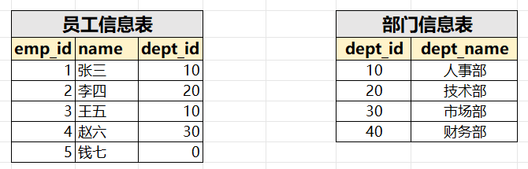

### 内连接（默认）

仅保留两表键值匹配的行

```python
inner_merge = pd.merge(employees, departments, on="dept_id", how="inner")
print("内连接结果：")
print(inner_merge)
print("="*30)
```

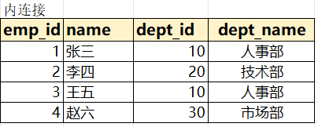

### 左连接

保留左表全部行，右表无匹配则填充 NaN

```python
left_merge = pd.merge(employees, departments, on="dept_id", how="left")
print("左连接结果：")
print(left_merge)
print("="*30)
```


### 右连接

保留右表全部行，左表无匹配则填充 NaN

```python
right_merge = pd.merge(employees, departments, on="dept_id", how="right")
print("右连接结果：")
print(right_merge)
print()
```


### 外连接

保留两表全部行，无匹配则填充 NaN

```python
outer_merge = pd.merge(employees, departments, on="dept_id", how="outer")
print("外连接结果：")
print(outer_merge)
print()
```


### 按多键合并

```python
#模拟绩效表
performance = pd.DataFrame({
    "emp_id": [1, 2, 3, 4, 5],
    "year":   [2023, 2025, 2023, 2023, 2023],
    "score":  [90, 85, 95, 78, 88]
})
# 添加 year 列，方便测试
employees['year'] = [2023, 2025, 2023, 2024, 2023]
# 员工表与绩效表按 emp_id 和 year 合并
multi_key_merge = pd.merge(
    employees,  # 添加 year 列以匹配
    performance,
    on=["emp_id", "year"],
    how="inner"
)
print("多键合并结果：")
print(multi_key_merge)
print()
```


### 使用 suffixes 解决重名列冲突

```python
salary2022 = pd.DataFrame({
    "emp_id": [1, 2, 3, 4, 5],
    "salary": [7000, 8000, 7500, 6500, 9000]
})
salary2023 = pd.DataFrame({
    "emp_id": [1, 2, 3, 4, 5],
    "salary": [7500, 8500, 8000, 7000, 9500]
})

salary_merge = pd.merge(
    salary2022,
    salary2023,
    on="emp_id",
    suffixes=("_2022", "_2023")
)
print("重名列合并（suffixes）结果：")
print(salary_merge)
```


### 自定义on

如果左右两边的关联列的列名不一致，则使用 left_on，right_on 分别指定两列列名

```python
employees = pd.DataFrame({
    "emp_id":  np.arange(1, 6),
    "name":    ["张三", "李四", "王五", "赵六", "钱七"],
    "dept_no": [10, 20, 10, 30, 0]
})

 # 左连接，使用 dept_no 作为左表键
left_merge = pd.merge(employees, departments, left_on='dept_no', right_on='dept_id', how='left')
print(left_merge)
```


## 数据可视化

> 下个章节我们专门研究: `pip install matplotlib`

```python
import matplotlib.pyplot as plt
import pandas as pd
plt.rcParams['font.sans-serif'] = ['SimHei']  # 中文显示
plt.rcParams['axes.unicode_minus'] = False

df_orders = pd.read_csv('docs/data/用户下单数据.csv',encoding='gbk')
print(df_orders)

# 学历分布柱状图
df_orders['文化程度'].value_counts().plot(kind='bar')
plt.title('用户学历分布')
plt.xlabel('学历')
plt.ylabel('人数')
plt.show()

# 交易金额分布直方图
df_orders['交易金额'].plot(kind='hist', bins=50)
plt.title('交易金额分布')
plt.xlabel('交易金额')
plt.show()

# 性别消费对比
df_orders.groupby('性别')['交易金额'].mean().plot(kind='bar')
plt.title('不同性别平均消费')
plt.ylabel('平均交易金额（元）')
plt.show()

```

## 作业

> 理解、并尝试手敲如下所有代码

### **案例1：用户画像分析**

```python
import pandas as pd

# 读取数据
df_orders = pd.read_csv('docs/data/用户下单数据.csv', encoding='gbk')

# 数据预处理
df_orders['下单时间'] = pd.to_datetime(df_orders['下单时间'])
df_orders['用户出生日期'] = pd.to_datetime(df_orders['用户出生日期'])
df_orders['年龄'] = 2024 - df_orders['用户出生日期'].dt.year

# 1. 整体概况
print("=" * 60)
print("用户订单数据概况")
print("=" * 60)
print(f"总订单数: {len(df_orders)}")
print(f"总用户数: {df_orders['用户ID'].nunique()}")
print(f"总交易额: {df_orders['交易金额'].sum():.2f}元")
print(f"平均订单金额: {df_orders['交易金额'].mean():.2f}元")

# 2. 性别分析
print("\n" + "=" * 60)
print("性别消费分析")
print("=" * 60)
gender_analysis = df_orders.groupby('性别').agg({
    '交易金额': ['count', 'sum', 'mean'],
    '用户ID': 'nunique'
}).round(2)
gender_analysis.columns = ['订单数', '总消费', '平均消费', '用户数']
print(gender_analysis)

# 3. 学历分析
print("\n" + "=" * 60)
print("学历消费分析")
print("=" * 60)
edu_analysis = df_orders.groupby('文化程度').agg({
    '交易金额': ['count', 'mean', 'sum'],
    '用户ID': 'nunique'
}).round(2)
edu_analysis.columns = ['订单数', '平均消费', '总消费', '用户数']
print(edu_analysis.sort_values('平均消费', ascending=False))

# 4. 年龄段分析
df_orders['年龄段'] = pd.cut(
    df_orders['年龄'],
    bins=[0, 30, 40, 50, 100],
    labels=['30岁以下', '30-40岁', '40-50岁', '50岁以上']
)
age_analysis = df_orders.groupby('年龄段').agg({
    '交易金额': ['count', 'mean'],
    '用户ID': 'nunique'
}).round(2)
age_analysis.columns = ['订单数', '平均消费', '用户数']
print("\n" + "=" * 60)
print("年龄段消费分析")
print("=" * 60)
print(age_analysis)

# 5. 高价值用户识别
threshold = df_orders['交易金额'].quantile(0.9)
vip_orders = df_orders[df_orders['交易金额'] > threshold]
print("\n" + "=" * 60)
print("高价值用户分析（前10%）")
print("=" * 60)
print(f"高价值订单阈值: {threshold:.2f}元")
print(f"高价值订单数: {len(vip_orders)}")
print(f"高价值订单占比: {len(vip_orders)/len(df_orders)*100:.2f}%")
print(f"高价值订单平均金额: {vip_orders['交易金额'].mean():.2f}元")

# 6. 时间分析
df_orders['年月'] = df_orders['下单时间'].dt.to_period('M')
monthly_trend = df_orders.groupby('年月').agg({
    '交易金额': ['count', 'sum']
}).round(2)
monthly_trend.columns = ['订单数', '销售额']
print("\n" + "=" * 60)
print("月度销售趋势（前10个月）")
print("=" * 60)
print(monthly_trend.head(10))
```

### **案例2：销售业绩分析**

```python
# 读取销售数据
df_sales = pd.read_excel('docs/data/电商销售数据.xlsx')

# 数据预处理
df_sales['日期'] = pd.to_datetime(df_sales['日期'])
df_sales[['大区', '省份', '城市']] = df_sales['区域'].str.split('-', expand=True)

# 1. 整体业绩
print("=" * 60)
print("销售业绩总览")
print("=" * 60)
print(f"总订单数: {len(df_sales)}")
print(f"总销售额: {df_sales['销售额'].sum():,.0f}元")
print(f"总利润: {df_sales['利润'].sum():,.0f}元")
print(f"平均利润率: {(df_sales['利润'].sum()/df_sales['销售额'].sum()*100):.2f}%")

# 2. 商品品类分析
print("\n" + "=" * 60)
print("商品品类业绩分析")
print("=" * 60)
category_perf = df_sales.groupby('商品品类').agg({
    '销售额': 'sum',
    '利润': 'sum',
    '销售数': 'sum',
    '订单号': 'count'
}).sort_values('销售额', ascending=False)
category_perf['利润率%'] = (category_perf['利润'] / category_perf['销售额'] * 100).round(2)
category_perf.columns = ['销售额', '利润', '销售数量', '订单数', '利润率%']
print(category_perf)

# 3. 区域分析
print("\n" + "=" * 60)
print("大区销售业绩")
print("=" * 60)
region_perf = df_sales.groupby('大区').agg({
    '销售额': 'sum',
    '利润': 'sum',
    '订单号': 'count'
}).sort_values('销售额', ascending=False)
region_perf.columns = ['销售额', '利润', '订单数']
print(region_perf)

# 4. 客户性别分析
print("\n" + "=" * 60)
print("客户性别消费分析")
print("=" * 60)
gender_sales = df_sales.groupby('客户性别').agg({
    '销售额': 'sum',
    '利润': 'sum',
    '订单号': 'count'
})
gender_sales.columns = ['销售额', '利润', '订单数']
print(gender_sales)

# 5. 每日销售趋势
daily_trend = df_sales.groupby('日期').agg({
    '销售额': 'sum',
    '利润': 'sum',
    '订单号': 'count'
})
daily_trend['7日均值'] = daily_trend['销售额'].rolling(window=7).mean().round(2)
print("\n" + "=" * 60)
print("每日销售趋势（前10天）")
print("=" * 60)
print(daily_trend.head(10))

# 6. 交叉分析：品类 x 性别
print("\n" + "=" * 60)
print("品类-性别交叉分析（销售额）")
print("=" * 60)
cross_analysis = pd.pivot_table(
    df_sales,
    index='商品品类',
    columns='客户性别',
    values='销售额',
    aggfunc='sum',
    margins=True,
    margins_name='总计'
)
print(cross_analysis)
```