# 1. Matplotlib 实战

## Matplotlib 简介

> **Matplotlib 是一个用于在 Python 中创建静态、动画和交互式可视化的综合库。**
> 
> https://matplotlib.org/

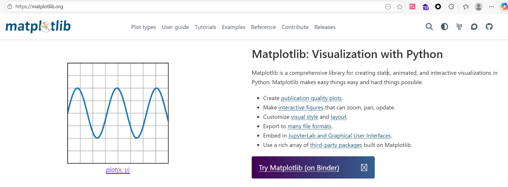

### 安装

```python
pip install matplotlib pandas openpyxl
```

### 快速上手

```python
import matplotlib.pyplot as plt
fig, ax = plt.subplots()
ax.plot([1, 2, 3, 4], [1, 4, 2, 3]) 
ax.set_title('简单折线图')
ax.set_xlabel('X轴')
ax.set_ylabel('Y轴')
plt.show()
```

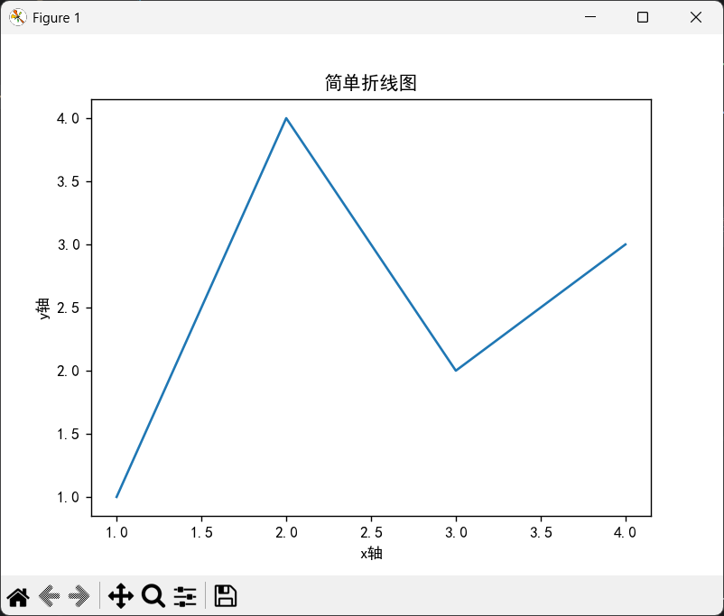

### 中文设置

```python
import matplotlib.pyplot as plt

# 设置中文字体
plt.rcParams['font.sans-serif'] = ['SimHei', 'Microsoft YaHei']  # 黑体或微软雅黑
plt.rcParams['axes.unicode_minus'] = False  # 解决负号显示问题
```

### 图表解剖

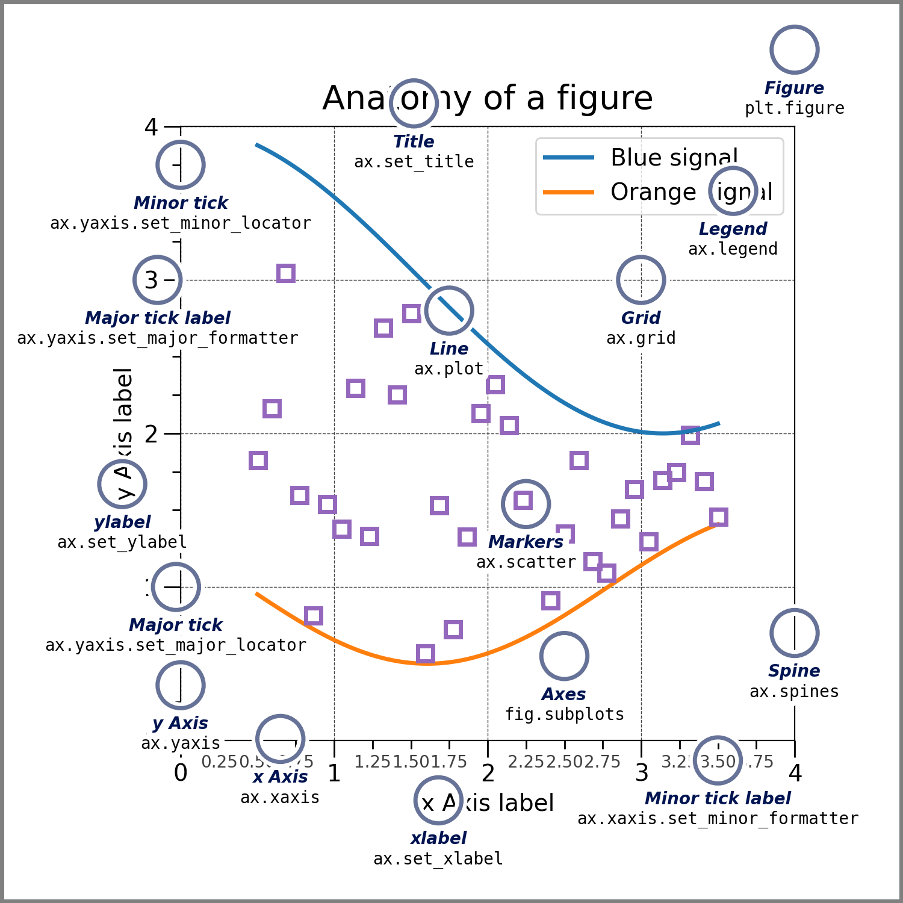

### 核心概念

Matplotlib 采用**层次化结构**：

- **Figure（画布）**：整个图形窗口，所有其他绘图元素都必须绘制在 Figure 上。
  - **包含多个子图** ：一个 Figure 可以包含任意数量的 Axes（子图），通过 `plt.subplots()` 或 `fig.add_subplot()` 创建。
  - **设置整体属性** ：
    - 画布大小：` fig.set_size_inches(10, 6)`
    - 背景颜色：` fig.set_facecolor('#f0f0f0')`
    - 分辨率（仅保存时生效）： `fig.dpi = 300`
  - **管理布局**** **：通过 `fig.tight_layout()` 或 `fig.subplots_adjust()` 调整子图间距。
  - **保存/显示** ：` fig.savefig('plot.png') `或 `plt.show()` 。

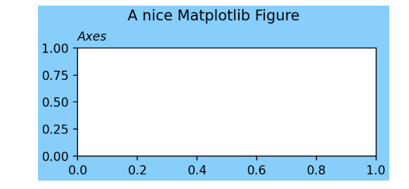
- **Axes（坐标系）**：Axes 是 Figure 上的一个 独立绘图区域 ，相当于一个**"子图"**，包含自己的 X 轴、Y 轴和绘图元素
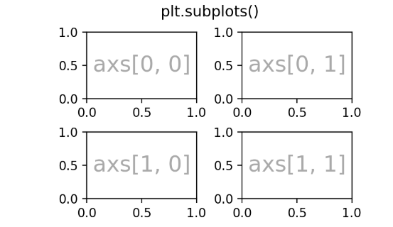

  - **绘制图表** ：调用各类绘图方法，如:
    - `ax.plot()` （折线图）、 `ax.bar()` （柱状图）、 `ax.scatter()` （散点图）等。
  - **设置图表属性 **：
    - 标题： `ax.set_title('销售趋势')`
    - X/Y轴标签： `ax.set_xlabel('月份')` 、 `ax.set_ylabel('销售额')`
    - 图例： `ax.legend()`
    - 网格线： `ax.grid(True)`
  - **坐标轴范围 **： `ax.set_xlim(0, 12) `、 `ax.set_ylim(0, 10000)`
- **Axis（坐标轴）**：X轴和Y轴，控制刻度与标签；
  - **刻度设置 **：
    - 自动/手动刻度： `ax.xaxis.set_ticks([1, 3, 5, 7])`
    - 刻度标签格式： `ax.xaxis.set_major_formatter(plt.FuncFormatter(lambda x, _: f'{x}月'))`
  - **标签设置** ：
    - 轴标题： `ax.xaxis.set_label_text('月份')` （等价于 ax.set_xlabel() ）
    - 刻度标签旋转： `ax.xaxis.set_tick_params(rotation=45)`
  - **刻度样式** ：
    - 刻度线长度/宽度： `ax.yaxis.set_tick_params(length=5, width=2)`
  - **隐藏刻度**： `ax.xaxis.set_visible(False)`
  - **刻度的位置由一个 **`Locator 对象`**决定，而刻度标签字符串由一个 **`Formatter `**格式化**
- **Artist**：所有可见对象；是 Matplotlib 中 所有可见元素的抽象基类 ，包括 Figure、Axes、Axis 中的具体可见部分（如**线条**、**文本**、**图例**、**网格**等）。任何在图表上“可见”的元素都是 Artist 的实例。
  - **样式定制** ：所有 Artist 都可自定义颜色、大小、线宽、透明度等属性。
  - **层次控制 **：通过 zorder 参数控制绘制顺序（值越大越上层）。
  - **可见性控制 **： `artist.set_visible(True/False) `控制元素是否显示。

### 两种绘图接口

Matplotlib 提供了两种绘图接口，理解它们的区别对于编写高质量代码至关重要。

#### pyplot 接口（状态机接口）

```python
import matplotlib.pyplot as plt

# pyplot 接口：隐式操作"当前"图表 
plt.plot([1, 2, 3, 4], [1, 4, 2, 3])
plt.title('简单折线图')
plt.xlabel('X轴')
plt.ylabel('Y轴')
plt.show()
```

- 类似 **MATLAB **风格，简单直观
- 自动管理 `Figure `和 `Axes`
- 适合快速**绘制单个图表**
- 隐式操作"当前活动"的图表

#### 面向对象接口（推荐）

```python
import matplotlib.pyplot as plt

# 面向对象接口：显式创建和操作对象
fig, ax = plt.subplots()
ax.plot([1, 2, 3, 4], [1, 4, 2, 3])
ax.set_title('简单折线图')
ax.set_xlabel('X轴')
ax.set_ylabel('Y轴')
plt.show()
```

- 显式创建 `Figure `和 `Axes `对象
- **精确控制每个图表元素**
- 适合**复杂布局**和**多子图**
- 代码更清晰、可维护性强

#### 两种方式对比

#### 接口转换对照

**记忆技巧**：

- pyplot 接口：`plt.xxx()`
- 面向对象接口：`ax.xxx()` 或 `ax.set_xxx()`

---

> **💡 总结：pyplot 接口不能完全替代面向对象接口。对于专业开发和复杂项目**
> 
> **强烈推荐使用面向对象接口！**

## 各种图表

### 数据准备

```python
import pandas as pd
# 加载电商销售数据
df_sales = pd.read_excel('docs/data/电商销售数据.xlsx')
# 数据预处理
df_sales['日期'] = pd.to_datetime(df_sales['日期'])
df_sales['进货价格'] = df_sales['进货价格'].str.replace('¥', '').astype(float)
df_sales['实际售价'] = df_sales['实际售价'].astype(float)

# 加载用户下单数据
df_orders = pd.read_csv('docs/data/用户下单数据.csv', encoding='gbk')
df_orders['下单时间'] = pd.to_datetime(df_orders['下单时间'])
df_orders['用户出生日期'] = pd.to_datetime(df_orders['用户出生日期'])
```

> 可以创建一个模块，定义函数，来导入指定数据；
> 
> 创建 `data` 文件夹、创建` __init__.py`文件，创建 `sales_data.py` 文件

```python
import pandas as pd

def load_data():
    # 加载电商销售数据
    df_sales = pd.read_excel('docs/data/电商销售数据.xlsx')
    # 数据预处理
    df_sales['日期'] = pd.to_datetime(df_sales['日期'])
    df_sales['进货价格'] = df_sales['进货价格'].str.replace('¥', '').astype(float)
    df_sales['实际售价'] = df_sales['实际售价'].astype(float)

    # 加载用户下单数据
    df_orders = pd.read_csv('docs/data/用户下单数据.csv', encoding='gbk')
    df_orders['下单时间'] = pd.to_datetime(df_orders['下单时间'])
    df_orders['用户出生日期'] = pd.to_datetime(df_orders['用户出生日期'])

    return df_sales, df_orders
```

目录结构如下


> 其他模块导入

```python
import data.sales_data as sd
df_sales, df_orders = sd.load_data()
print(df_sales.head())
print(df_orders.head())
```

### 折线图

https://matplotlib.org/stable/gallery/lines_bars_and_markers/categorical_variables.html

#### 基础折线图

> **电商销售额趋势分析**

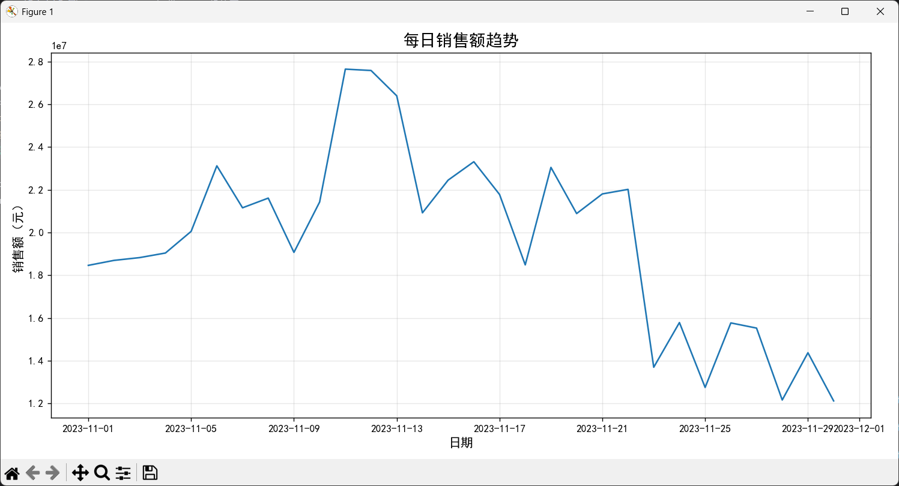

```python
import matplotlib.pyplot as plt
import pandas as pd

# 设置中文字体
plt.rcParams['font.sans-serif'] = ['SimHei', 'Microsoft YaHei']  # 黑体或微软雅黑
plt.rcParams['axes.unicode_minus'] = False  # 解决负号显示问题
# 数据准备
df_sales = pd.read_excel('docs/data/电商销售数据.xlsx')
df_sales['日期'] = pd.to_datetime(df_sales['日期'])

# 按日期汇总销售额
daily_sales = df_sales.groupby('日期')['销售额'].sum().reset_index()

# 创建图表
fig, ax = plt.subplots(figsize=(12, 6))
ax.plot(daily_sales['日期'], daily_sales['销售额'])

# 设置标题和标签
ax.set_title('每日销售额趋势', fontsize=16, fontweight='bold')
ax.set_xlabel('日期', fontsize=12)
ax.set_ylabel('销售额（元）', fontsize=12)

# 网格线
ax.grid(True, alpha=0.3)

plt.tight_layout()
plt.show()
```

#### 多条折线

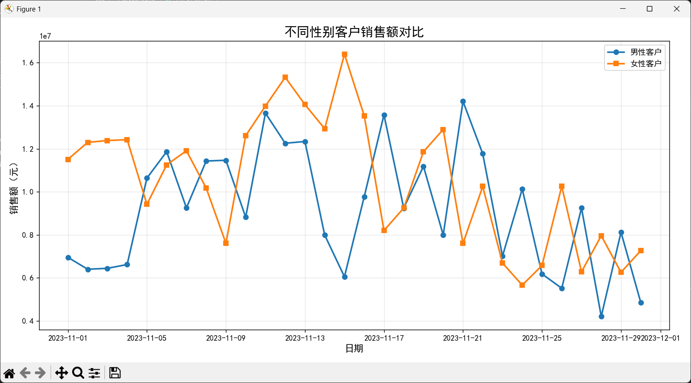

```python
import matplotlib.pyplot as plt
import pandas as pd

# 数据准备
df_sales = pd.read_excel('docs/data/电商销售数据.xlsx')
df_sales['日期'] = pd.to_datetime(df_sales['日期'])
# 按日期和性别汇总
gender_sales = df_sales.groupby(['日期', '客户性别'])['销售额'].sum().unstack()

fig, ax = plt.subplots(figsize=(12, 6))
ax.plot(gender_sales.index, gender_sales['男'], label='男性客户', marker='o', linewidth=2)
ax.plot(gender_sales.index, gender_sales['女'], label='女性客户', marker='s', linewidth=2)

ax.set_title('不同性别客户销售额对比', fontsize=16)
ax.set_xlabel('日期', fontsize=12)
ax.set_ylabel('销售额（元）', fontsize=12)
ax.legend(loc='best', fontsize=10)
ax.grid(True, alpha=0.3)

plt.tight_layout()
plt.show()
```

#### Plot 函数参数

### 柱状图与条形图

https://matplotlib.org/stable/gallery/lines_bars_and_markers/bar_colors.html

#### **基础柱状图**

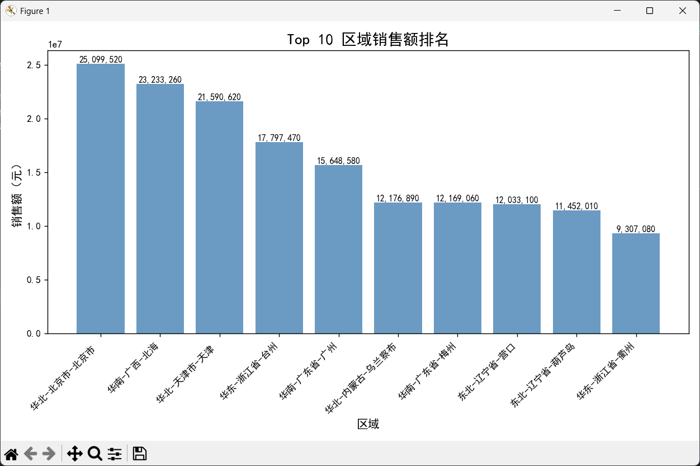

```python
import data.sales_data as sd
import matplotlib.pyplot as plt

df_sales, df_orders = sd.load_data()

# 设置中文字体
plt.rcParams['font.sans-serif'] = ['SimHei', 'Microsoft YaHei']  # 黑体或微软雅黑
plt.rcParams['axes.unicode_minus'] = False  # 解决负号显示问题

# 按区域汇总; 获取 Top10数据
region_sales = df_sales.groupby('区域')['销售额'].sum().sort_values(ascending=False).head(10)
print(region_sales)

# 绘图
fig,ax = plt.subplots(figsize=(12,6))
bars = ax.bar(region_sales.index,region_sales.values)
ax.set_title('区域销售额Top10',fontsize=16)
ax.set_xlabel('区域',fontsize=12)
ax.set_ylabel('销售额(元)',fontsize=12)

# 为每个柱子添加数值标签
for bar in bars:
    height = bar.get_height()
    ax.text(bar.get_x() + bar.get_width()/2, height, f'{height:.2f}', 
            ha='center', va='bottom', fontsize=10)

plt.xticks(rotation=45)
plt.tight_layout()
plt.show()

```

#### 分组柱状图

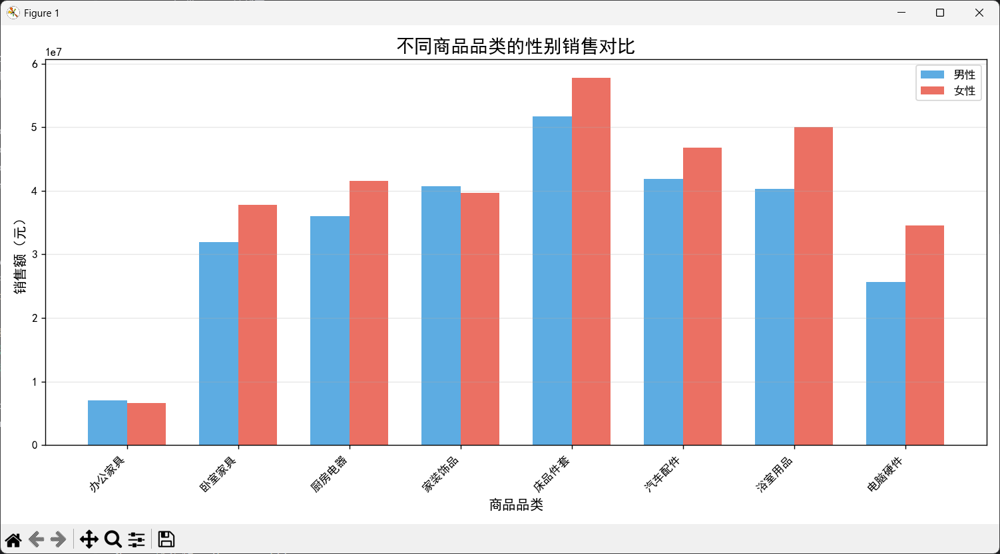

```python
def plot02():
    # 获取分组数据
    # category_gender = df_sales.groupby(['商品品类','客户性别'])['销售额'].sum().unstack()
    category_gender = df_sales.pivot_table(index='商品品类',columns='客户性别',values='销售额',aggfunc='sum')
    print(category_gender)
    # 绘图
    fig,ax = plt.subplots(figsize=(12,6))
    width = 0.35
    x = range(len(category_gender))
    print("x:",x)
    # 绘制分组柱状图
    ax.bar([i-width/2 for i in x],category_gender['男'],label='男性客户',width=width)
    ax.bar([i+width/2 for i in x],category_gender['女'],label='女性客户',width=width)
    
  
    ax.set_xticks(x)
    ax.set_xticklabels(category_gender.index)

    ax.set_title('不同性别不同品类销售额对比',fontsize=16)
    ax.set_xlabel('商品品类',fontsize=12)
    ax.set_ylabel('销售额(元)',fontsize=12)
    ax.grid(True,alpha=0.3)
    ax.legend()

    plt.xticks(rotation=45)
    plt.tight_layout()
    plt.show()

plot02()
```

#### 堆叠柱状图

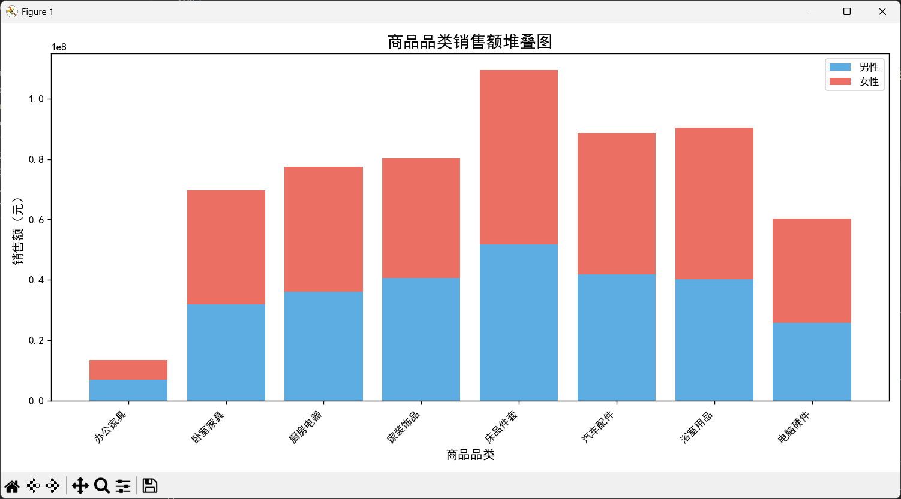

```python
def plot03():
    category_gender = df_sales.pivot_table(index='商品品类',columns='客户性别',values='销售额',aggfunc='sum')
    print(category_gender)

    fig,ax = plt.subplots(figsize=(12,6))
    ax.bar(category_gender.index,category_gender['男'],label='男性客户',color='#1f77b4')
    ax.bar(category_gender.index,category_gender['女'],label='女性客户',alpha=0.7,color='#ff7f0e',
            bottom=category_gender['男'])
    

    ax.set_title('不同性别不同品类销售额对比',fontsize=16)
    ax.set_xlabel('商品品类',fontsize=12)
    ax.set_ylabel('销售额(元)',fontsize=12)
    # ax.grid(True,alpha=0.3)
    ax.legend()

    plt.xticks(rotation=45)
    plt.tight_layout()
    plt.show()

plot03()
```

#### 水平条形图

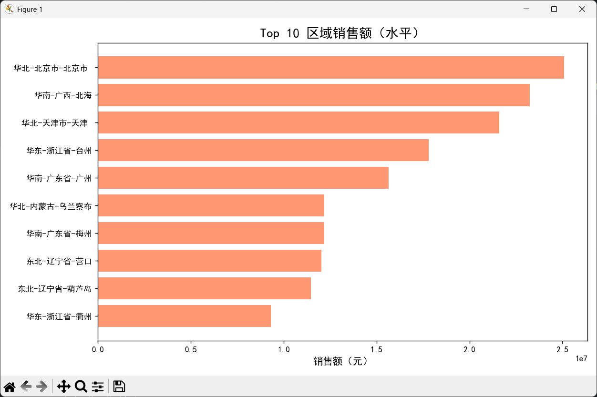

```python
fig, ax = plt.subplots(figsize=(10, 8))

ax.barh(range(len(region_sales)), region_sales.values, color='coral', alpha=0.8)
ax.set_yticks(range(len(region_sales)))
ax.set_yticklabels(region_sales.index)
ax.set_title('Top 10 区域销售额（水平）', fontsize=16, fontweight='bold')
ax.set_xlabel('销售额（元）', fontsize=12)
ax.invert_yaxis()  # 倒序显示，最大值在上

plt.tight_layout()
plt.show()
```

#### **bar() / barh() 函数参数详解**

### 饼图与环形图

https://matplotlib.org/stable/gallery/pie_and_polar_charts/pie_features.html

> 适合展示各类数据占比信息。但是类别超过7个时难以区分。

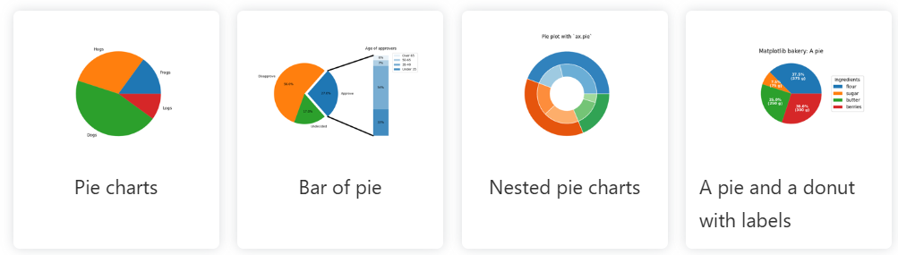

#### 基础饼图

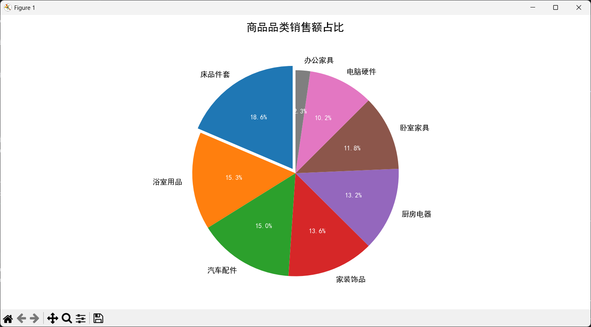

```python
import data.sales_data as sd
import matplotlib.pyplot as plt

# 设置中文字体
plt.rcParams['font.sans-serif'] = ['Microsoft YaHei']  # 黑体或微软雅黑
plt.rcParams['axes.unicode_minus'] = False  # 解决负号显示问题

# 导入数据
df_sales, df_orders = sd.load_data()

category_sales = df_sales.groupby('商品品类')['销售额'].sum().sort_values(ascending=False)
print(category_sales)

def plot01():
    fig,ax = plt.subplots(figsize=(12, 6))

    # wedges: 饼图的扇形对象
    # texts: 标签对象
    # autotexts: 自动百分比标签对象
    explode = [0.05 if i == 0 else 0 for i in range(len(category_sales))]
    wedges, texts, autotexts = ax.pie(category_sales.values,
        labels=category_sales.index,
        autopct='%1.1f%%',
        startangle=90,
        explode=explode)
        # 突出最大块

    for t in texts:
        t.set_fontsize(12)

    for at in autotexts:
        at.set_fontsize(11)
        at.set_color('white')

    wedges[0].set_edgecolor('black')
    wedges[0].set_linewidth(5)

    ax.set_title('商品品类销售额占比', fontsize=16, fontweight='bold', pad=20)
    plt.tight_layout()
    plt.show()
 
 plot01()
```

#### **环形图（Donut Chart）**

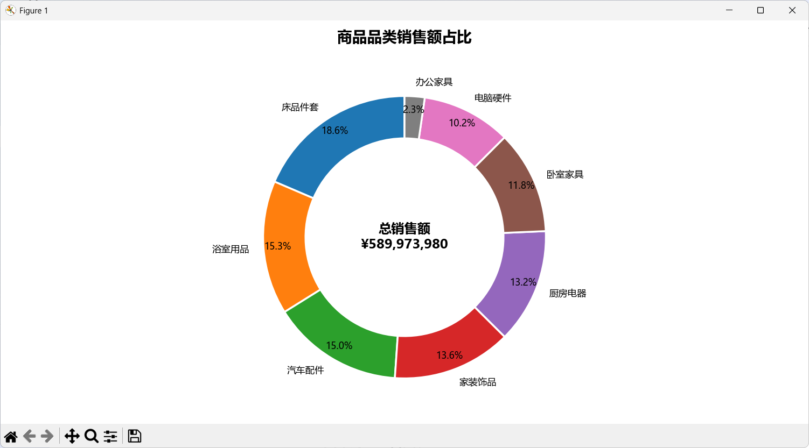

```python
def plot02():
    fig,ax = plt.subplots(figsize=(12, 6))
    ax.pie(category_sales.values,
        labels=category_sales.index,
        autopct='%1.1f%%',
        pctdistance=0.9,
        startangle=90,
        wedgeprops=dict(width=0.3, edgecolor='white', linewidth=2))
    
    ax.set_title('商品品类销售额占比', fontsize=16, fontweight='bold', pad=20)
    ax.text(0, 0, f'总销售额\n¥{category_sales.sum():,.0f}', 
            ha='center', va='center', fontsize=14, fontweight='bold')
    plt.tight_layout()
    plt.show()

plot02()
```

#### **pie() 函数参数详解**

### 散点图与气泡图

https://matplotlib.org/stable/gallery/lines_bars_and_markers/scatter_demo2.html

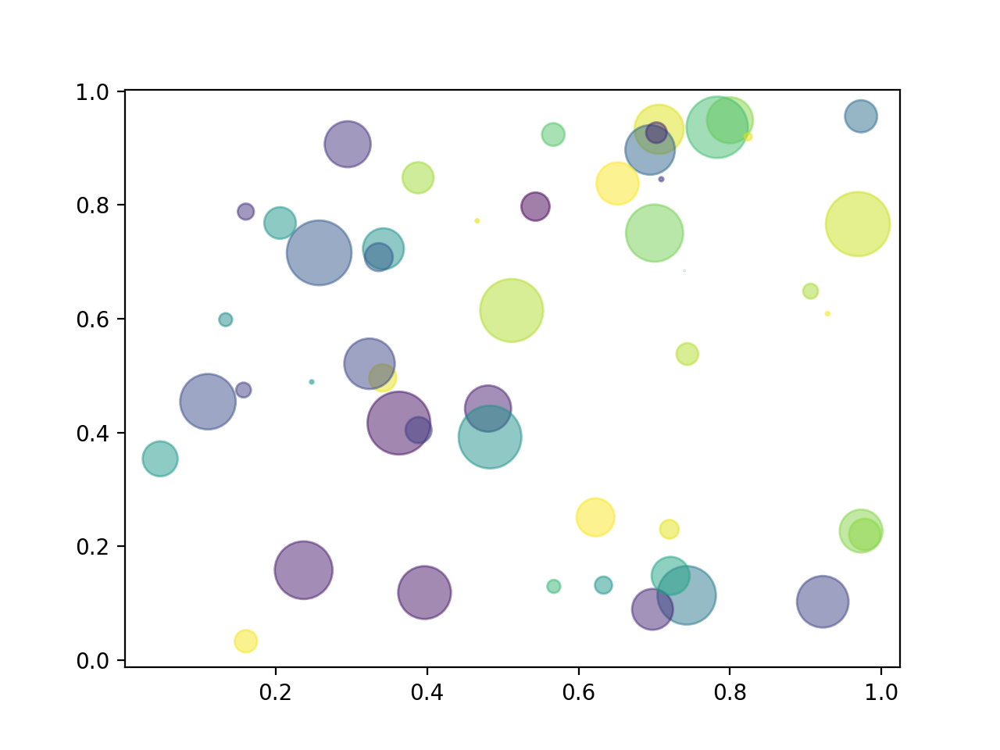

**散点图的核心要素：**

- **点的位置**：表示两个变量的数值

- **点的颜色**：可表示第三个变量（分类或连续）

- **点的大小**：可表示第四个变量（气泡图）

- **点的分布模式**：揭示变量间的关系

> **如何解读散点图：**
> 
> 1. **相关性判断**：
> 
> - 正相关：点从左下到右上分布
> - 负相关：点从左上到右下分布
> - 无相关：点随机分布
> 
> 2. **聚类识别**：观察是否存在明显的点群
> 
> 3. **异常值发现**：识别远离主体的离群点
> 
> 4. **趋势线**：添加回归线判断线性关系强度
> 
> 5. **密度分析**：点密集区域表示数据集中

> **相关性分析**

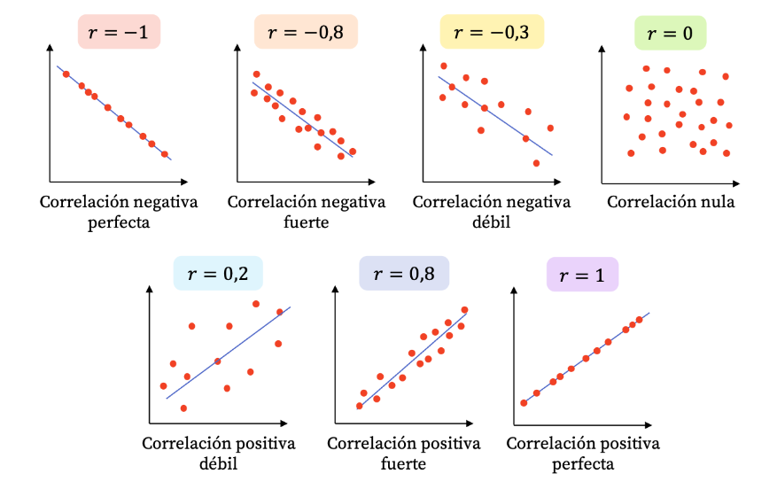

> **聚类识别**

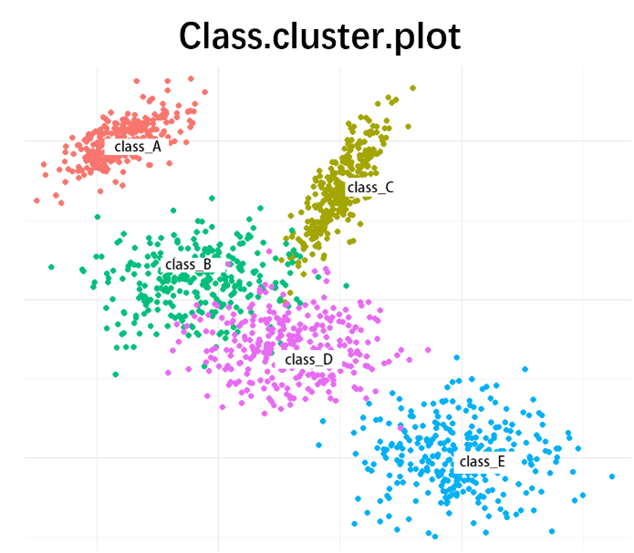

> **离群分析**


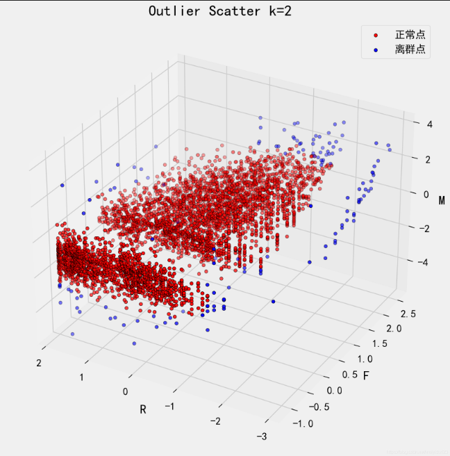

#### **基础散点图**

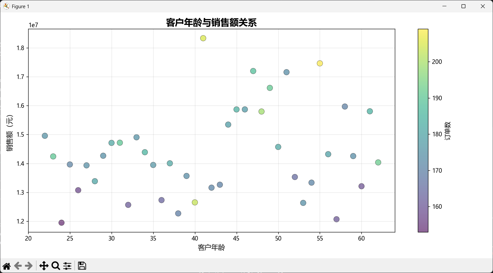

```python
import data.sales_data as sd
import matplotlib.pyplot as plt

# 设置中文字体
plt.rcParams['font.sans-serif'] = ['Microsoft YaHei']  # 黑体或微软雅黑
plt.rcParams['axes.unicode_minus'] = False  # 解决负号显示问题

# 导入数据
df_sales, df_orders = sd.load_data()

def plot01():
    age_sales = df_sales.groupby('客户年龄').agg({
        '销售额': 'sum',
        '订单号': 'count'
    }).reset_index()

    age_sales.columns = ['客户年龄', '销售额', '订单数']

    print(age_sales)

    fig,ax = plt.subplots(figsize=(12, 6))
    scatter = ax.scatter(age_sales['客户年龄'], 
        age_sales['销售额'], 
        c=age_sales['订单数'],
        alpha=0.5)

    ax.set_title('客户年龄与销售额的关系', fontsize=16, fontweight='bold', pad=20)
    ax.set_xlabel('客户年龄', fontsize=12)
    ax.set_ylabel('销售额', fontsize=12)

    cbar = plt.colorbar(scatter,ax=ax)
    cbar.set_label('订单数', fontsize=12)

    plt.tight_layout()
    plt.show()
plot01()

```

#### **气泡图**

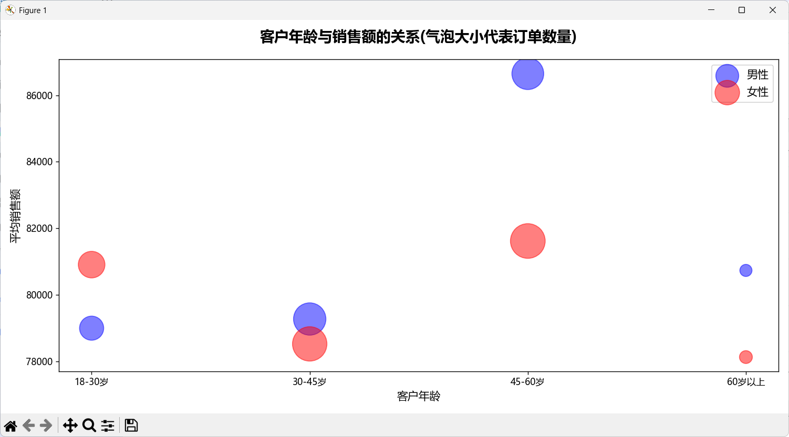

```python
import pandas as pd
def plot03():
    # 准备数据
    df_sales['年龄段'] = pd.cut(df_sales['客户年龄'], 
        bins=[0, 18, 30, 45, 60, 100],
        labels=['18岁以下','18-30岁','30-45岁','45-60岁','60岁以上'])
   
    age_sales = df_sales.pivot_table(
        index=['年龄段','客户性别'],
        values=['销售额','订单号'],
        aggfunc={
            '销售额': 'mean',
            '订单号': 'count'
        },
        observed=False
    ).reset_index()
    age_sales.columns = ['年龄段','客户性别','订单数','销售额']

    
    fig,ax = plt.subplots(figsize=(12, 6))

    # 绘制男性气泡图
    male_data = age_sales[age_sales['客户性别']== '男']
    print(male_data)
    ax.scatter(x = male_data['年龄段'],
               y = male_data['销售额'],
               s = male_data['订单数'],
               c = 'blue',
               label='男性',
               alpha=0.5)

    # 绘制女性气泡图
    female_data = age_sales[age_sales['客户性别']== '女']
    ax.scatter(x = female_data['年龄段'],
               y = female_data['销售额'],
               s = female_data['订单数'],
               c = 'red',
               label='女性',
               alpha=0.5)
    
    # 添加图例
    ax.legend(fontsize=12)
    ax.set_title('客户年龄与销售额的关系(气泡大小代表订单数量)', fontsize=16, fontweight='bold', pad=20)
    ax.set_xlabel('客户年龄', fontsize=12)
    ax.set_ylabel('平均销售额', fontsize=12)

    plt.tight_layout()
    plt.show()

plot03()
```

#### **scatter() 函数参数详解**

### 直方图与分布图

https://matplotlib.org/stable/gallery/statistics/hist.html

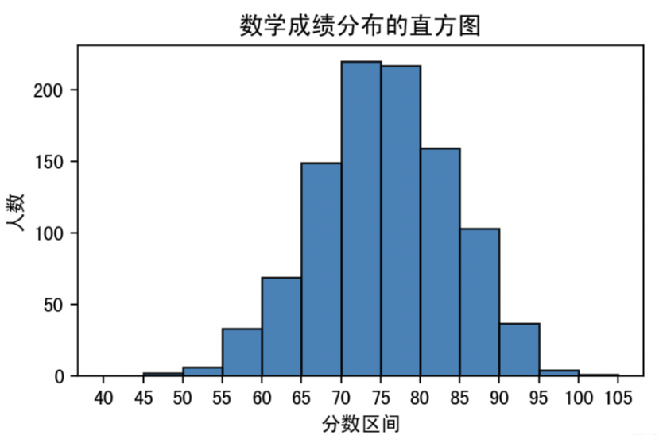

**直方图的核心要素：**

- **X轴**：数值区间（bins）

- **Y轴**：频数或频率

- **柱子高度**：落在该区间的数据数量

- **柱子宽度**：区间大小（bin width）

> 直方图看 分布 （连续数据的密集程度），条形图比 大小 （分类数据的数值对比）。

#### **基础直方图**

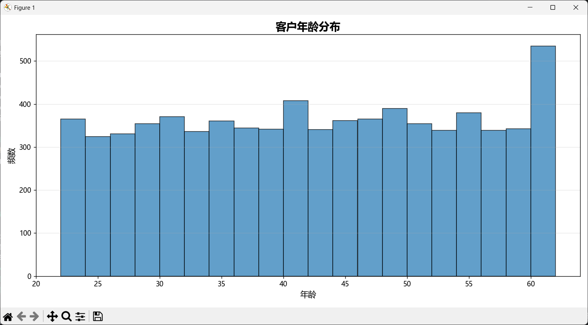

```python
import data.sales_data as sd
import matplotlib.pyplot as plt

# 设置中文字体
plt.rcParams['font.sans-serif'] = ['Microsoft YaHei']  # 黑体或微软雅黑
plt.rcParams['axes.unicode_minus'] = False  # 解决负号显示问题

# 导入数据
df_sales, df_orders = sd.load_data()

fig, ax = plt.subplots(figsize=(12, 6))
print(df_sales['客户年龄'].value_counts().sort_index().reset_index())
print(df_sales['客户年龄'].nunique())
ax.hist(df_sales['客户年龄'], bins=20,
        edgecolor='black', alpha=0.7)

ax.set_title('客户年龄分布', fontsize=16, fontweight='bold')
ax.set_xlabel('年龄', fontsize=12)
ax.set_ylabel('频数', fontsize=12)
ax.grid(axis='y', alpha=0.3)

plt.tight_layout()
plt.show()
```

#### **多组直方图对比**

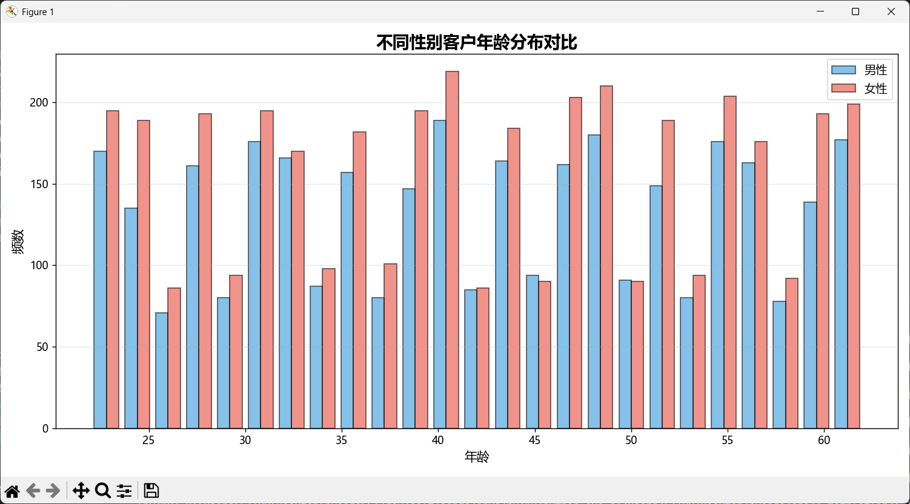

```python
import data.sales_data as sd
import matplotlib.pyplot as plt

# 设置中文字体
plt.rcParams['font.sans-serif'] = ['Microsoft YaHei']  # 黑体或微软雅黑
plt.rcParams['axes.unicode_minus'] = False  # 解决负号显示问题

# 导入数据
df_sales, df_orders = sd.load_data()
fig, ax = plt.subplots(figsize=(12, 6))

male_age = df_sales[df_sales['客户性别'] == '男']['客户年龄']
female_age = df_sales[df_sales['客户性别'] == '女']['客户年龄']

ax.hist([male_age, female_age], bins=25, 
        label=['男性', '女性'],
        color=['#3498db', '#e74c3c'],
        alpha=0.6,
        edgecolor='black')

ax.set_title('不同性别客户年龄分布对比', fontsize=16, fontweight='bold')
ax.set_xlabel('年龄', fontsize=12)
ax.set_ylabel('频数', fontsize=12)
ax.legend(fontsize=11)
ax.grid(axis='y', alpha=0.3)

plt.tight_layout()
plt.show()
```

#### **概率密度直方图**

> 使用 df_orders 数据

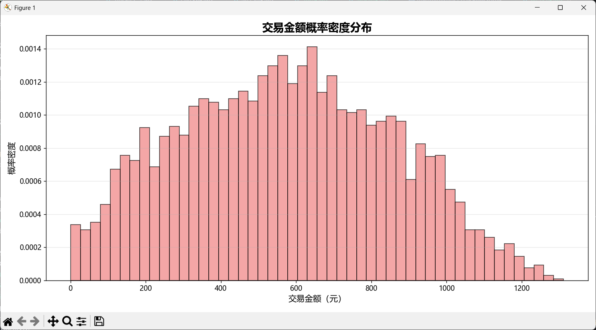

```python
import data.sales_data as sd
import matplotlib.pyplot as plt

# 设置中文字体
plt.rcParams['font.sans-serif'] = ['Microsoft YaHei']  # 黑体或微软雅黑
plt.rcParams['axes.unicode_minus'] = False  # 解决负号显示问题

# 导入数据
df_sales, df_orders = sd.load_data()

fig, ax = plt.subplots(figsize=(12, 6))

ax.hist(df_orders['交易金额'], bins=50, 
        density=True,  # 归一化为概率密度
        color='lightcoral', 
        edgecolor='black', 
        alpha=0.7)

ax.set_title('交易金额概率密度分布', fontsize=16, fontweight='bold')
ax.set_xlabel('交易金额（元）', fontsize=12)
ax.set_ylabel('概率密度', fontsize=12)
ax.grid(axis='y', alpha=0.3)

plt.tight_layout()
plt.show()
```

#### **hist() 函数参数详解**

### 箱线图与小提琴图

https://matplotlib.org/stable/gallery/statistics/boxplot_demo.html

> 假设下图是采样了《金融行业》每个国家10000个员工的薪资

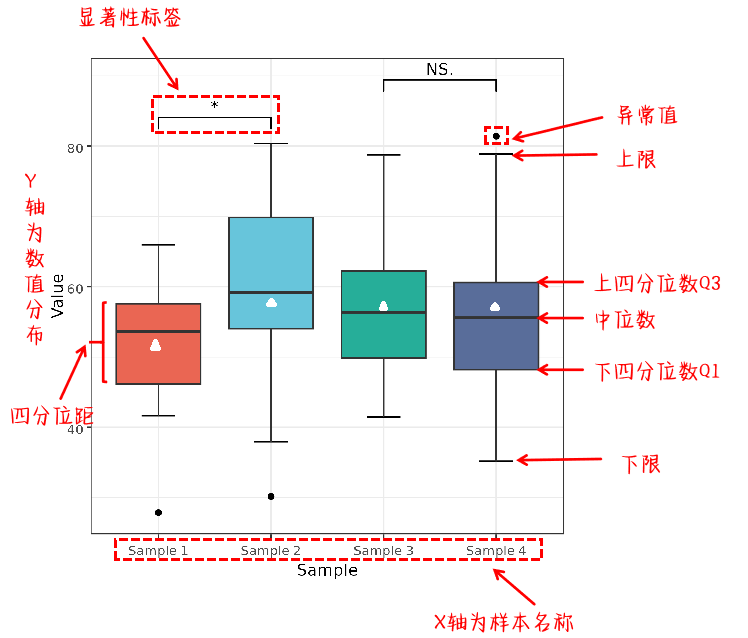

**箱线图的核心要素：**

- **箱体**：表示数据的四分位数范围（IQR，25%-75%）

- **中线**：中位数（50%分位数）

- **均值点**：数据的平均值（可选显示）

- **须线**：延伸到1.5倍IQR范围内的最远数据点

- **异常点**：超出须线范围的离群值

- **显著性标签：**表示 两组或多组数据之间的差异是否具有统计学意义 （即差异是由随机误差引起的，还是真实存在的）。

**如何解读箱线图：**

1. **中位数位置**：箱体内中线的位置

2. **数据离散度**：箱体越长，数据越分散

3. **偏态判断**：

- 中线偏上：左偏（负偏）
- 中线偏下：右偏（正偏）

4. **异常值识别**：须线外的点为潜在异常值

5. **组间比较**：比较不同组的箱体位置和大小

#### **基础箱线图**

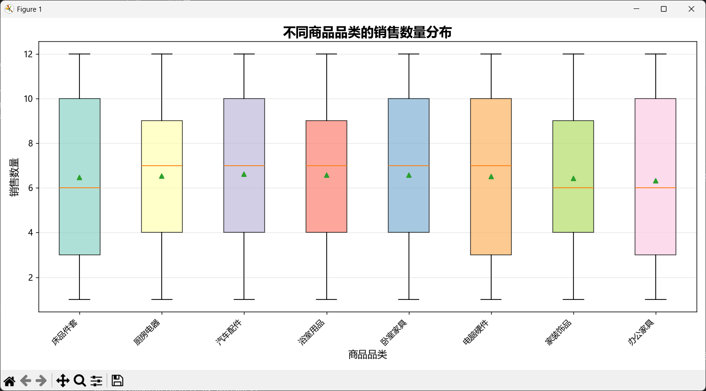

```python
import data.sales_data as sd
import matplotlib.pyplot as plt

# 设置中文字体
plt.rcParams['font.sans-serif'] = ['Microsoft YaHei']  # 黑体或微软雅黑
plt.rcParams['axes.unicode_minus'] = False  # 解决负号显示问题

# 导入数据
df_sales, df_orders = sd.load_data()

def plot01():
    # 数据准备
    categories = df_sales['商品品类'].unique()
    salenum_by_category = [df_sales[df_sales['商品品类'] == c]['销售数'].values for c in categories]
    
    fig, ax = plt.subplots(figsize=(12, 6))
    bx = ax.boxplot(salenum_by_category, labels=categories,
        notch=True, patch_artist=True, showmeans=True, showfliers=True, vert=True)
    
    # 设置颜色
    colors = plt.cm.Set3(range(len(categories)))
    for box, clr in zip(bx['boxes'], colors):
        box.set_facecolor(clr)
    
    # 设置标题和标签
    ax.set_title('商品品类销售数量分布（箱线图）', fontsize=16, fontweight='bold', pad=20)
    ax.set_xlabel('销售数量', fontsize=12)
    ax.set_ylabel('商品品类', fontsize=12)
    
    # 添加网格线
    ax.grid(axis='y', alpha=0.3)
    
    # 调整布局并显示
    plt.tight_layout()
    plt.show()

# 绘制箱线图
plot01()

```

#### **小提琴图**

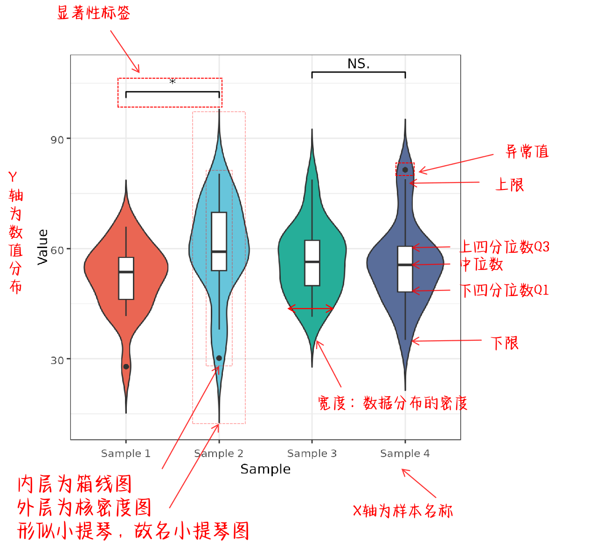

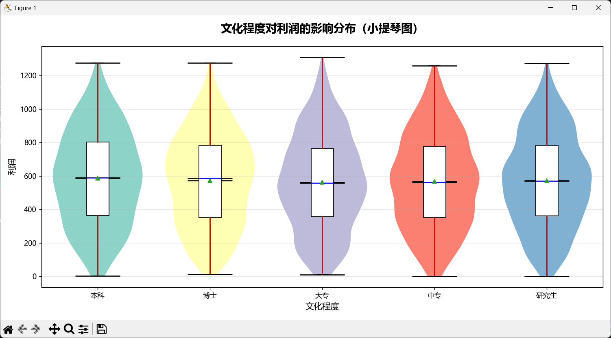

```python
def plot02():
    # 数据准备（与箱线图相同的数据）
    categories = df_orders['文化程度'].unique()
    profit_by_edu = [df_orders[df_orders['文化程度'] == c]['交易金额'].values for c in categories]
    
    # 创建画布
    fig, ax = plt.subplots(figsize=(12, 6))
    
    # 绘制小提琴图
    violin = ax.violinplot(
        profit_by_edu,           # 数据
        showmeans=True,                # 显示均值
        showmedians=True,              # 显示中位数
        showextrema=True,              # 显示极值
        widths=0.8,                    # 小提琴宽度
        vert=True                     # 水平方向
    )

    bx = ax.boxplot(
        profit_by_edu,           # 数据
        notch=False,                    # 凹口
        patch_artist=True,             # 填充颜色
        showmeans=True,                # 显示均值
        showfliers=True,               # 显示异常值
        vert=True,                     # 水平方向
        widths=[0.2, 0.2, 0.2, 0.2, 0.2], 
        medianprops={'linewidth': 1.5, 'color': 'blue'},                     
        whiskerprops={'linewidth': 1.5, 'color': 'red'},                     
    )
    
    # 设置颜色
    colors = plt.cm.Set3(range(len(categories)))
    for vl,b, color in zip(violin['bodies'],bx['boxes'], colors):
        vl.set_facecolor(color)
        vl.set_alpha(1)
        b.set_facecolor('white')
        b.set_alpha(1)
    

    # 设置线条样式
    # for partname in ('cbars', 'cmins', 'cmaxes', 'cmeans', 'cmedians'):
    #     part = violin[partname]
    #     part.set_edgecolor('black')
    #     part.set_linewidth(1.5)
    
    # 设置标签和标题
    ax.set_xticks(range(1, len(categories) + 1))
    ax.set_xticklabels(categories)
    ax.set_title('文化程度对交易金额的影响分布（小提琴图）', fontsize=16, fontweight='bold', pad=20)
    ax.set_ylabel('交易金额', fontsize=12)
    ax.set_xlabel('文化程度', fontsize=12)
    
    # 添加网格线
    ax.grid(axis='y', alpha=0.3)
    
    # 调整布局并显示
    plt.tight_layout()
    plt.show()
plot02()
```

#### **boxplot() 函数参数详解**

#### **violinplot() 函数参数详解**

### 热力图

https://matplotlib.org/stable/gallery/images_contours_and_fields/image_annotated_heatmap.html

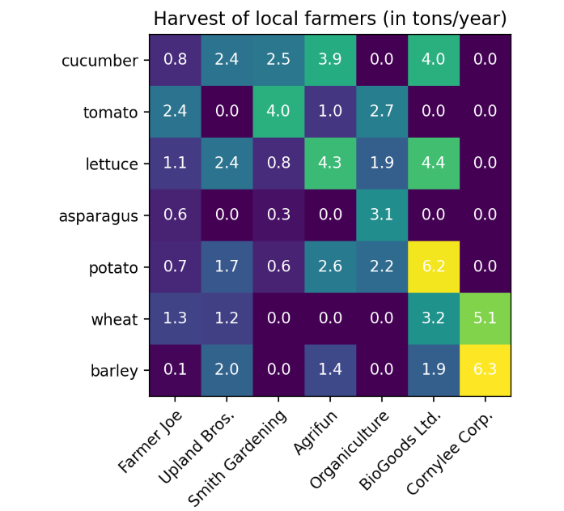

**热力图的核心要素：**

- **行和列**：表示两个分类维度

- **颜色深浅**：表示数值大小

- **颜色条**：提供数值与颜色的映射关系

- **数值标注**：可选显示具体数值

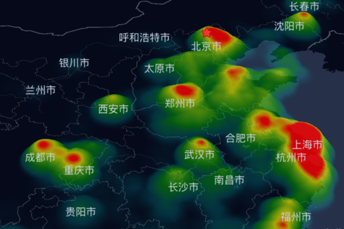

#### **基础热力图**

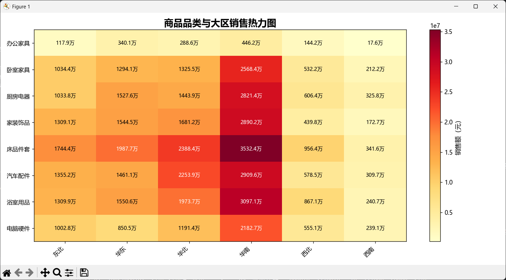

```python
import data.sales_data as sd
import matplotlib.pyplot as plt

# 设置中文字体
plt.rcParams['font.sans-serif'] = ['Microsoft YaHei']  # 黑体或微软雅黑
plt.rcParams['axes.unicode_minus'] = False  # 解决负号显示问题

# 导入数据
df_sales, df_orders = sd.load_data()
print(df_sales.head())
# 数据准备：提取主要区域
top_regions = df_sales.groupby('大区')['销售额'].sum().nlargest(8).index
df_filtered = df_sales[df_sales['大区'].isin(top_regions)]

# 创建透视表
heatmap_data = df_filtered.pivot_table(
    values='销售额',
    index='商品品类',
    columns='大区',
    aggfunc='sum',
    fill_value=0
)

fig, ax = plt.subplots(figsize=(12, 6))

# 绘制热力图
im = ax.imshow(heatmap_data.values, cmap='YlOrRd', aspect='auto')

# 设置刻度
ax.set_xticks(range(len(heatmap_data.columns)))
ax.set_yticks(range(len(heatmap_data.index)))
ax.set_xticklabels(heatmap_data.columns, rotation=45, ha='right')
ax.set_yticklabels(heatmap_data.index)

# 添加数值标注
for i in range(len(heatmap_data.index)):
    for j in range(len(heatmap_data.columns)):
        value = heatmap_data.values[i, j]
        text = ax.text(j, i, f'{value/10000:.1f}万',
                      ha="center", va="center", 
                      color="white" if value > heatmap_data.values.max()/2 else "black",
                      fontsize=9)

# 添加颜色条
cbar = plt.colorbar(im, ax=ax)
cbar.set_label('销售额（元）', fontsize=11)

ax.set_title('商品品类与大区销售热力图', fontsize=16, fontweight='bold')
plt.tight_layout()
plt.show()
```

#### **相关性热力图**

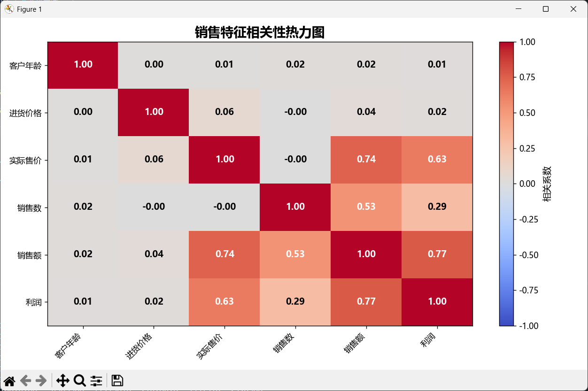

```python
import data.sales_data as sd
import matplotlib.pyplot as plt
import pandas as pd

# 设置中文字体
plt.rcParams['font.sans-serif'] = ['Microsoft YaHei']  # 黑体或微软雅黑
plt.rcParams['axes.unicode_minus'] = False  # 解决负号显示问题

# 导入数据
df_sales, df_orders = sd.load_data()


# 计算相关系数
corr_data = df_sales[['客户年龄', '进货价格', '实际售价', '销售数', '销售额', '利润']].corr()

fig, ax = plt.subplots(figsize=(10, 6))

im = ax.imshow(corr_data.values, cmap='coolwarm', vmin=-1, vmax=1, aspect='auto')

# 设置刻度
labels = ['客户年龄',  '进货价格', '实际售价', '销售数', '销售额', '利润']
ax.set_xticks(range(len(labels)))
ax.set_yticks(range(len(labels)))
ax.set_xticklabels(labels, rotation=45, ha='right')
ax.set_yticklabels(labels)

# 添加相关系数值
for i in range(len(corr_data)):
    for j in range(len(corr_data)):
        value = corr_data.values[i, j]
        text = ax.text(j, i, f'{value:.2f}',
                      ha="center", va="center",
                      color="white" if abs(value) > 0.5 else "black",
                      fontsize=11, fontweight='bold')

cbar = plt.colorbar(im, ax=ax)
cbar.set_label('相关系数', fontsize=11)

ax.set_title('销售特征相关性热力图', fontsize=16, fontweight='bold')
plt.tight_layout()
plt.show()
```

#### **imshow() 函数参数详解**

> **imshow： 展示图片**

## 高级配置

### 子图布局与组合图表

https://matplotlib.org/stable/users/explain/axes/index.html

#### **基础子图布局**

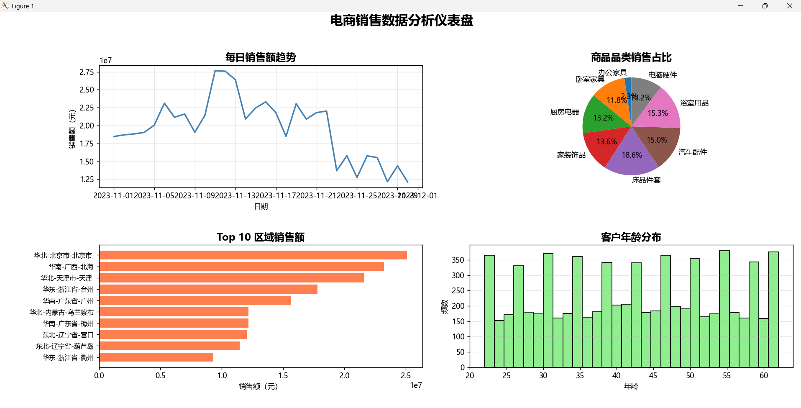

```python
### 1. 基础子图布局
def plot01():
    fig, axes = plt.subplots(2, 2, figsize=(12, 6))
    fig.suptitle('电商销售数据分析仪表盘', fontsize=18, fontweight='bold', y=0.995)

    # 子图1：每日销售额趋势
    daily_sales = df_sales.groupby('日期')['销售额'].sum()
    axes[0, 0].plot(daily_sales.index, daily_sales.values, color='steelblue', linewidth=2)
    axes[0, 0].set_title('每日销售额趋势', fontsize=14, fontweight='bold')
    axes[0, 0].set_xlabel('日期')
    axes[0, 0].set_ylabel('销售额（元）')
    axes[0, 0].grid(True, alpha=0.3)

    # 子图2：商品品类销售占比
    category_sales = df_sales.groupby('商品品类')['销售额'].sum()
    axes[0, 1].pie(category_sales.values, labels=category_sales.index, 
                autopct='%1.1f%%', startangle=90)
    axes[0, 1].set_title('商品品类销售占比', fontsize=14, fontweight='bold')

    # 子图3：Top 10 区域销售额
    region_sales = df_sales.groupby('区域')['销售额'].sum().nlargest(10)
    axes[1, 0].barh(range(len(region_sales)), region_sales.values, color='coral')
    axes[1, 0].set_yticks(range(len(region_sales)))
    axes[1, 0].set_yticklabels(region_sales.index, fontsize=9)
    axes[1, 0].set_title('Top 10 区域销售额', fontsize=14, fontweight='bold')
    axes[1, 0].set_xlabel('销售额（元）')
    axes[1, 0].invert_yaxis()

    # 子图4：客户年龄分布
    axes[1, 1].hist(df_sales['客户年龄'], bins=30, color='lightgreen', edgecolor='black')
    axes[1, 1].set_title('客户年龄分布', fontsize=14, fontweight='bold')
    axes[1, 1].set_xlabel('年龄')
    axes[1, 1].set_ylabel('频数')
    axes[1, 1].grid(axis='y', alpha=0.3)

    plt.tight_layout()
    plt.show()
```

#### **不规则子图布局**

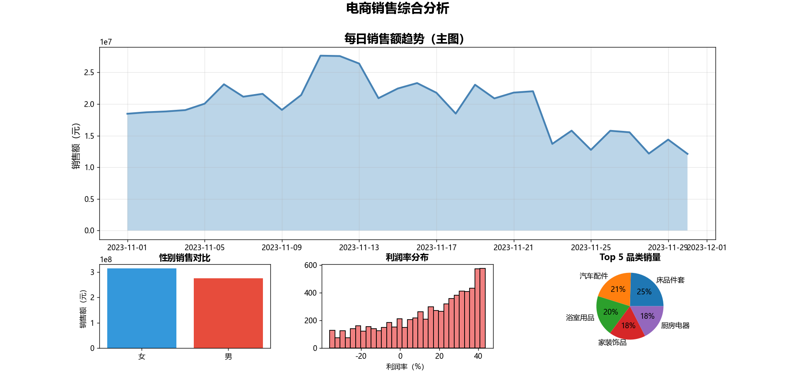

```python
  def plot02():  
    fig = plt.figure(figsize=(16, 10))
    gs = fig.add_gridspec(3, 3, hspace=0.3, wspace=0.3)

    # 大图：占据上方2行
    ax1 = fig.add_subplot(gs[0:2, :])
    daily_sales = df_sales.groupby('日期')['销售额'].sum()
    ax1.plot(daily_sales.index, daily_sales.values, color='steelblue', linewidth=2.5)
    ax1.fill_between(daily_sales.index, daily_sales.values, alpha=0.3)
    ax1.set_title('每日销售额趋势（主图）', fontsize=16, fontweight='bold')
    ax1.set_ylabel('销售额（元）', fontsize=12)
    ax1.grid(True, alpha=0.3)

    # 小图1：左下
    ax2 = fig.add_subplot(gs[2, 0])
    gender_sales = df_sales.groupby('客户性别')['销售额'].sum()
    ax2.bar(gender_sales.index, gender_sales.values, color=['#3498db', '#e74c3c'])
    ax2.set_title('性别销售对比', fontsize=12, fontweight='bold')
    ax2.set_ylabel('销售额（元）')

    # 小图2：中下
    ax3 = fig.add_subplot(gs[2, 1])
    profit_margin = (df_sales['利润'] / df_sales['销售额'] * 100).dropna()
    ax3.hist(profit_margin, bins=30, color='lightcoral', edgecolor='black')
    ax3.set_title('利润率分布', fontsize=12, fontweight='bold')
    ax3.set_xlabel('利润率（%）')

    # 小图3：右下
    ax4 = fig.add_subplot(gs[2, 2])
    top5_category = df_sales.groupby('商品品类')['销售数'].sum().nlargest(5)
    ax4.pie(top5_category.values, labels=top5_category.index, autopct='%1.0f%%')
    ax4.set_title('Top 5 品类销量', fontsize=12, fontweight='bold')

    plt.suptitle('电商销售综合分析', fontsize=18, fontweight='bold', y=0.995)
    plt.show()
```

#### **双Y轴图表**

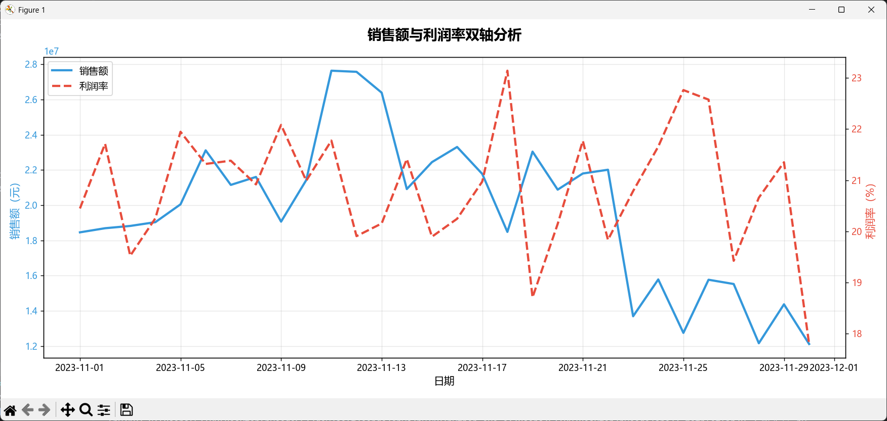

```python
def plot03():
    # 数据准备
    daily_data = df_sales.groupby('日期').agg({
        '销售额': 'sum',
        '利润': 'sum'
    }).reset_index()
    daily_data['利润率'] = (daily_data['利润'] / daily_data['销售额'] * 100)

    fig, ax1 = plt.subplots(figsize=(14, 6))

    # 左Y轴：销售额
    ax1.set_xlabel('日期', fontsize=12)
    ax1.set_ylabel('销售额（元）', color=color1, fontsize=12)
    line1 = ax1.plot(daily_data['日期'], daily_data['销售额'], 
                    color='#3498db', linewidth=2.5, label='销售额')
    ax1.tick_params(axis='y', labelcolor='#3498db')
    ax1.grid(True, alpha=0.3)

    # 右Y轴：利润率
    ax2 = ax1.twinx()
    ax2.set_ylabel('利润率（%）', color=color2, fontsize=12)
    line2 = ax2.plot(daily_data['日期'], daily_data['利润率'], 
                    color='#e74c3c', linewidth=2.5, linestyle='--', label='利润率')
    ax2.tick_params(axis='y', labelcolor='#e74c3c')

    # 合并图例
    lines = line1 + line2
    labels = [l.get_label() for l in lines]
    ax1.legend(lines, labels, loc='upper left', fontsize=11)

    plt.title('销售额与利润率双轴分析', fontsize=16, fontweight='bold', pad=20)
    plt.tight_layout()
    plt.show()

plot03()
```

#### **subplots() 函数参数详解**

### 高级样式与主题定制

#### 内置样式

https://matplotlib.org/stable/gallery/style_sheets/style_sheets_reference.html

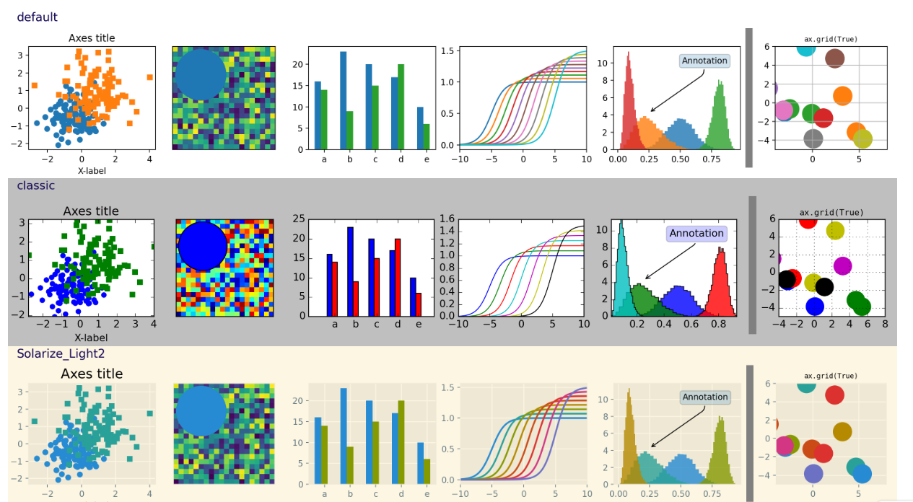

```python
import data.sales_data as sd
import matplotlib.pyplot as plt

# 设置中文字体
plt.rcParams['font.sans-serif'] = ['Microsoft YaHei']  # 黑体或微软雅黑
plt.rcParams['axes.unicode_minus'] = False  # 解决负号显示问题
# 导入数据
df_sales, df_orders = sd.load_data()

# 1. 内置样式
def plot01():
    # 查看所有可用样式
    print(plt.style.available)

    # 使用样式
    plt.style.use('seaborn-v0_8-darkgrid')  # 或 'ggplot', 'fivethirtyeight' 等

    # 绘图示例
    fig, ax = plt.subplots(figsize=(12, 6))
    daily_sales = df_sales.groupby('日期')['销售额'].sum()
    ax.plot(daily_sales.index, daily_sales.values, linewidth=2.5)
    ax.set_title('使用 Seaborn 样式的销售趋势', fontsize=16, fontweight='bold')
    ax.set_xlabel('日期', fontsize=12)
    ax.set_ylabel('销售额（元）', fontsize=12)
    plt.tight_layout()
    plt.show()

    # 恢复默认样式
    plt.style.use('default')

plot01()
```

#### **自定义全局样式**

rcParams 所有参数：

https://matplotlib.org/stable/api/matplotlib_configuration_api.html#default-values-and-styling

```python
# 设置全局参数
plt.rcParams.update({
    'font.size': 11,
    'font.family': 'Microsoft YaHei',
    'axes.labelsize': 12,
    'axes.titlesize': 14,
    'axes.titleweight': 'bold',
    'axes.grid': True,
    'grid.alpha': 0.3,
    'lines.linewidth': 2,
    'figure.figsize': (12, 6),
    'figure.dpi': 100,
    'savefig.dpi': 300,
    'legend.fontsize': 10,
    'xtick.labelsize': 10,
    'ytick.labelsize': 10
})
```

#### 专业配色方案

```python
import numpy as np
# 配色方案
def plot03():
    # 定义配色方案
    color_palette = {
        'primary': '#2C3E50',
        'secondary': '#E74C3C',
        'success': '#27AE60',
        'info': '#3498DB',
        'warning': '#F39C12',
        'danger': '#C0392B',
        'light': '#ECF0F1',
        'dark': '#34495E'
    }

    # 应用配色
    fig, axes = plt.subplots(2, 2, figsize=(16, 12))

    # 子图1：使用主色调
    gender_sales = df_sales.groupby('客户性别')['销售额'].sum()
    axes[0, 0].bar(gender_sales.index, gender_sales.values, 
                color=[color_palette['info'], color_palette['secondary']])
    axes[0, 0].set_title('性别销售对比', fontsize=14, fontweight='bold')

    # 子图2：渐变色
    category_sales = df_sales.groupby('商品品类')['销售额'].sum().sort_values(ascending=False)
    colors_gradient = plt.cm.Blues(np.linspace(0.4, 0.9, len(category_sales)))
    axes[0, 1].barh(range(len(category_sales)), category_sales.values, color=colors_gradient)
    axes[0, 1].set_yticks(range(len(category_sales)))
    axes[0, 1].set_yticklabels(category_sales.index)
    axes[0, 1].set_title('商品品类销售排名', fontsize=14, fontweight='bold')
    axes[0, 1].invert_yaxis()

    # 子图3：多色折线
    daily_profit = df_sales.groupby('日期')['利润'].sum()
    axes[1, 0].plot(daily_profit.index, daily_profit.values, 
                    color=color_palette['success'], linewidth=2.5)
    axes[1, 0].fill_between(daily_profit.index, daily_profit.values, 
                            alpha=0.3, color=color_palette['success'])
    axes[1, 0].set_title('每日利润趋势', fontsize=14, fontweight='bold')
    axes[1, 0].grid(True, alpha=0.3)

    # 子图4：饼图配色
    top5_region = df_sales.groupby('区域')['销售额'].sum().nlargest(5)
    pie_colors = [color_palette['info'], color_palette['success'], 
                color_palette['warning'], color_palette['secondary'], 
                color_palette['primary']]
    axes[1, 1].pie(top5_region.values, labels=top5_region.index, 
                autopct='%1.1f%%', colors=pie_colors, startangle=90)
    axes[1, 1].set_title('Top 5 区域销售占比', fontsize=14, fontweight='bold')

    plt.suptitle('专业配色方案示例', fontsize=18, fontweight='bold', y=0.995)
    plt.tight_layout()
    plt.show()
```

#### 常见颜色映射

### 动态图表与交互

#### **添加注释与标注**

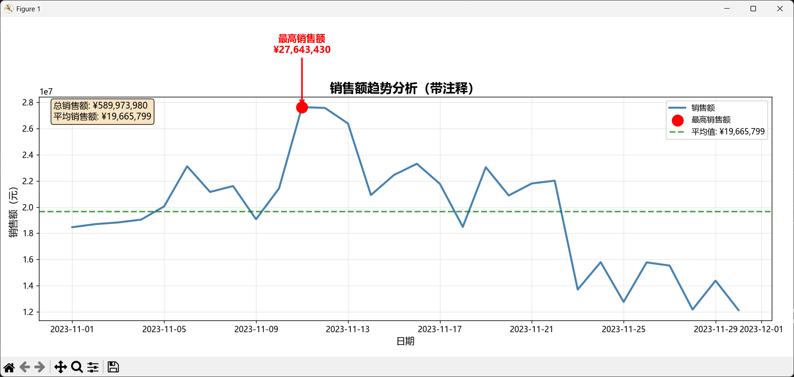

```python
import data.sales_data as sd
import matplotlib.pyplot as plt
import numpy as np

# 设置中文字体
plt.rcParams['font.sans-serif'] = ['Microsoft YaHei']  # 黑体或微软雅黑
plt.rcParams['axes.unicode_minus'] = False  # 解决负号显示问题
# 导入数据
df_sales, df_orders = sd.load_data()
# 数据准备
daily_sales = df_sales.groupby('日期')['销售额'].sum().reset_index()
max_sales_idx = daily_sales['销售额'].idxmax()
max_sales_date = daily_sales.loc[max_sales_idx, '日期']
max_sales_value = daily_sales.loc[max_sales_idx, '销售额']

fig, ax = plt.subplots(figsize=(14, 6))

# 绘制折线
ax.plot(daily_sales['日期'], daily_sales['销售额'], 
        color='steelblue', linewidth=2.5, label='销售额')

# 标注最高点
ax.scatter([max_sales_date], [max_sales_value], 
           color='red', s=200, zorder=5, label='最高销售额')

# 添加箭头注释
ax.annotate(f'最高销售额\n¥{max_sales_value:,.0f}',
            xy=(max_sales_date, max_sales_value),
            xytext=(max_sales_date, max_sales_value * 1.15),
            fontsize=12,
            fontweight='bold',
            color='red',
            ha='center',
            arrowprops=dict(arrowstyle='->', color='red', lw=2))

# 添加水平参考线
mean_sales = daily_sales['销售额'].mean()
ax.axhline(y=mean_sales, color='green', linestyle='--', 
           linewidth=2, alpha=0.7, label=f'平均值: ¥{mean_sales:,.0f}')

# 添加文本框
textstr = f'总销售额: ¥{daily_sales["销售额"].sum():,.0f}\n平均销售额: ¥{mean_sales:,.0f}'
props = dict(boxstyle='round', facecolor='wheat', alpha=0.8)
ax.text(0.02, 0.98, textstr, transform=ax.transAxes, fontsize=11,
        verticalalignment='top', bbox=props)

ax.set_title('销售额趋势分析（带注释）', fontsize=16, fontweight='bold')
ax.set_xlabel('日期', fontsize=12)
ax.set_ylabel('销售额（元）', fontsize=12)
ax.legend(loc='upper right', fontsize=10)
ax.grid(True, alpha=0.3)

plt.tight_layout()
plt.show()
```

#### **annotate() 函数参数详解**

#### 图表保存

```python
# 保存为不同格式
plt.savefig('sales_trend.png', dpi=300, bbox_inches='tight')  # 高清PNG
plt.savefig('sales_trend.pdf', bbox_inches='tight')  # 矢量PDF
plt.savefig('sales_trend.svg', bbox_inches='tight')  # 矢量SVG
plt.savefig('sales_trend.jpg', dpi=300, bbox_inches='tight')  # JPEG
```

#### **savefig() 函数参数详解**

根据不同的使用场景，常用的dpi值如下：

- 默认值 ：通常为 100 或 80 （Matplotlib默认设置，适合屏幕显示）
- 屏幕显示 ： 100-150 （平衡清晰度和文件大小）
- 高清图像 ： 300 （常用的高清输出，适合演示文稿或网页）
- 打印输出 ： 300-600 （印刷级质量，适合期刊论文或宣传材料）
- 高精度印刷 ： 600-1200 （专业印刷需求，如书籍出版）

### 其他方案

**学习顺序**：Matplotlib（基础） → Seaborn（进阶） → Pyecharts（扩展）

```python
┌─────────────────────────────────────────────────────────────┐
│                    Python 可视化生态                         │
├─────────────────────────────────────────────────────────────┤
│                                                             │
│  Matplotlib (底层引擎)                                       │
│  └─ 提供基础绘图能力                                          │
│     │                                                       │
│     ├─ Seaborn (统计可视化)                                  │
│     │  └─ 基于 Matplotlib，简化统计图表                       │
│     │                                                       │
│     └─ Pandas.plot()                                        │
│        └─ 基于 Matplotlib，快速绘图                           │
│                                                             │
│  Pyecharts (独立引擎)                                        │
│  └─ 基于 ECharts.js，交互式 Web 可视化                        │
│                                                             │
└─────────────────────────────────────────────────────────────┘
```

## 综合实战

### 电商销售分析完整仪表盘

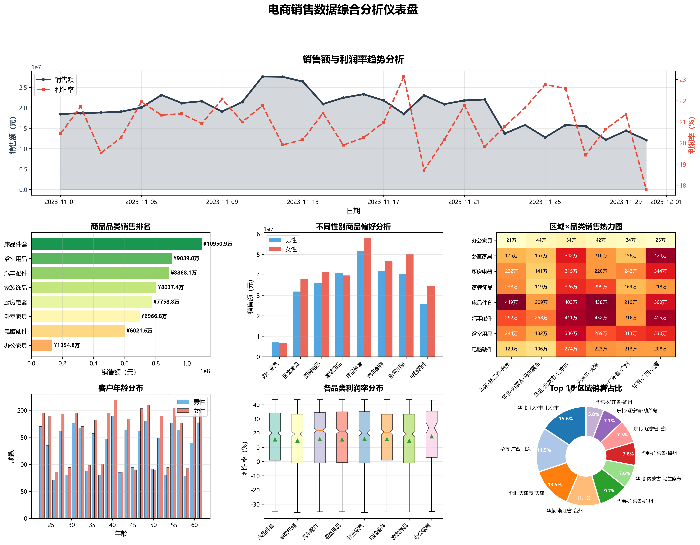

```python
import matplotlib.pyplot as plt
import pandas as pd
import numpy as np
from matplotlib.gridspec import GridSpec

# 数据加载与预处理
df_sales = pd.read_excel('docs/data/电商销售数据.xlsx')
df_sales['日期'] = pd.to_datetime(df_sales['日期'])
df_sales['进货价格'] = df_sales['进货价格'].str.replace('¥', '').astype(float)
df_sales['实际售价'] = df_sales['实际售价'].astype(float)
df_sales['利润率'] = (df_sales['利润'] / df_sales['销售额'] * 100)

# 设置样式
plt.rcParams['font.sans-serif'] = ['Microsoft YaHei']
plt.rcParams['axes.unicode_minus'] = False

# 创建画布
fig = plt.figure(figsize=(20, 14))
gs = GridSpec(3, 3, figure=fig, hspace=0.3, wspace=0.3)

# ========== 子图1：销售额与利润双轴趋势（大图） ==========
ax1 = fig.add_subplot(gs[0, :])
daily_data = df_sales.groupby('日期').agg({
    '销售额': 'sum',
    '利润': 'sum'
}).reset_index()
daily_data['利润率'] = (daily_data['利润'] / daily_data['销售额'] * 100)

color1 = '#2C3E50'
ax1.set_xlabel('日期', fontsize=12)
ax1.set_ylabel('销售额（元）', color=color1, fontsize=12, fontweight='bold')
line1 = ax1.plot(daily_data['日期'], daily_data['销售额'], 
                 color=color1, linewidth=3, label='销售额', marker='o', markersize=4)
ax1.fill_between(daily_data['日期'], daily_data['销售额'], alpha=0.2, color=color1)
ax1.tick_params(axis='y', labelcolor=color1)
ax1.grid(True, alpha=0.3)

ax1_twin = ax1.twinx()
color2 = '#E74C3C'
ax1_twin.set_ylabel('利润率（%）', color=color2, fontsize=12, fontweight='bold')
line2 = ax1_twin.plot(daily_data['日期'], daily_data['利润率'], 
                      color=color2, linewidth=2.5, linestyle='--', 
                      label='利润率', marker='s', markersize=4)
ax1_twin.tick_params(axis='y', labelcolor=color2)

lines = line1 + line2
labels = [l.get_label() for l in lines]
ax1.legend(lines, labels, loc='upper left', fontsize=11, framealpha=0.9)
ax1.set_title('销售额与利润率趋势分析', fontsize=16, fontweight='bold', pad=15)

# ========== 子图2：商品品类销售排名 ==========
ax2 = fig.add_subplot(gs[1, 0])
category_sales = df_sales.groupby('商品品类')['销售额'].sum().sort_values(ascending=True)
colors_gradient = plt.cm.RdYlGn(np.linspace(0.3, 0.9, len(category_sales)))
bars = ax2.barh(range(len(category_sales)), category_sales.values, color=colors_gradient)
ax2.set_yticks(range(len(category_sales)))
ax2.set_yticklabels(category_sales.index, fontsize=10)
ax2.set_xlabel('销售额（元）', fontsize=11)
ax2.set_title('商品品类销售排名', fontsize=13, fontweight='bold')
ax2.grid(axis='x', alpha=0.3)

# 添加数值标签
for i, (bar, value) in enumerate(zip(bars, category_sales.values)):
    ax2.text(value, i, f' ¥{value/10000:.1f}万', 
             va='center', fontsize=9, fontweight='bold')


# ========== 子图3：性别销售对比（分组柱状图） ==========
ax3 = fig.add_subplot(gs[1, 1])
gender_category = df_sales.groupby(['商品品类', '客户性别'])['销售额'].sum().unstack()
x = range(len(gender_category))
width = 0.35
bars1 = ax3.bar([i - width/2 for i in x], gender_category['男'], 
                width, label='男性', color='#3498DB', alpha=0.85)
bars2 = ax3.bar([i + width/2 for i in x], gender_category['女'], 
                width, label='女性', color='#E74C3C', alpha=0.85)
ax3.set_xticks(x)
ax3.set_xticklabels(gender_category.index, rotation=45, ha='right', fontsize=9)
ax3.set_ylabel('销售额（元）', fontsize=11)
ax3.set_title('不同性别商品偏好分析', fontsize=13, fontweight='bold')
ax3.legend(fontsize=10)
ax3.grid(axis='y', alpha=0.3)

# ========== 子图4：区域销售热力图 ==========
ax4 = fig.add_subplot(gs[1, 2])
top_regions = df_sales.groupby('区域')['销售额'].sum().nlargest(6).index
df_filtered = df_sales[df_sales['区域'].isin(top_regions)]
heatmap_data = df_filtered.pivot_table(
    values='销售额',
    index='商品品类',
    columns='区域',
    aggfunc='sum',
    fill_value=0
)
im = ax4.imshow(heatmap_data.values, cmap='YlOrRd', aspect='auto')
ax4.set_xticks(range(len(heatmap_data.columns)))
ax4.set_yticks(range(len(heatmap_data.index)))
ax4.set_xticklabels(heatmap_data.columns, rotation=45, ha='right', fontsize=9)
ax4.set_yticklabels(heatmap_data.index, fontsize=9)
ax4.set_title('区域×品类销售热力图', fontsize=13, fontweight='bold')

# 添加数值
for i in range(len(heatmap_data.index)):
    for j in range(len(heatmap_data.columns)):
        value = heatmap_data.values[i, j]
        if value > 0:
            text_color = 'white' if value > heatmap_data.values.max()/2 else 'black'
            ax4.text(j, i, f'{value/10000:.0f}万',
                    ha="center", va="center", color=text_color, fontsize=8)

# ========== 子图5：客户年龄分布 ==========
ax5 = fig.add_subplot(gs[2, 0])
male_age = df_sales[df_sales['客户性别'] == '男']['客户年龄']
female_age = df_sales[df_sales['客户性别'] == '女']['客户年龄']
ax5.hist([male_age, female_age], bins=25, 
         label=['男性', '女性'],
         color=['#3498DB', '#E74C3C'],
         alpha=0.7,
         edgecolor='black',
         linewidth=0.5)
ax5.set_xlabel('年龄', fontsize=11)
ax5.set_ylabel('频数', fontsize=11)
ax5.set_title('客户年龄分布', fontsize=13, fontweight='bold')
ax5.legend(fontsize=10)
ax5.grid(axis='y', alpha=0.3)

# ========== 子图6：利润率箱线图 ==========
ax6 = fig.add_subplot(gs[2, 1])
categories = df_sales['商品品类'].unique()
profit_margin_by_cat = [df_sales[df_sales['商品品类'] == cat]['利润率'].dropna().values 
                        for cat in categories]
bp = ax6.boxplot(profit_margin_by_cat, 
                 labels=categories,
                 patch_artist=True,
                 notch=True,
                 showmeans=True)
colors_box = plt.cm.Set3(range(len(categories)))
for patch, color in zip(bp['boxes'], colors_box):
    patch.set_facecolor(color)
    patch.set_alpha(0.7)
ax6.set_xticklabels(categories, rotation=45, ha='right', fontsize=9)
ax6.set_ylabel('利润率（%）', fontsize=11)
ax6.set_title('各品类利润率分布', fontsize=13, fontweight='bold')
ax6.grid(axis='y', alpha=0.3)

# ========== 子图7：Top 10 区域销售占比 ==========
ax7 = fig.add_subplot(gs[2, 2])
top10_regions = df_sales.groupby('区域')['销售额'].sum().nlargest(10)
colors_pie = plt.cm.tab20(range(len(top10_regions)))
wedges, texts, autotexts = ax7.pie(
    top10_regions.values,
    labels=top10_regions.index,
    autopct='%1.1f%%',
    startangle=90,
    colors=colors_pie,
    pctdistance=0.85,
    wedgeprops=dict(width=0.6, edgecolor='white', linewidth=2)
)
for text in texts:
    text.set_fontsize(8)
for autotext in autotexts:
    autotext.set_color('white')
    autotext.set_fontweight('bold')
    autotext.set_fontsize(8)
ax7.set_title('Top 10 区域销售占比', fontsize=13, fontweight='bold')

# 总标题
fig.suptitle('电商销售数据综合分析仪表盘', 
             fontsize=20, fontweight='bold', y=0.995)

# 保存图表
plt.savefig('电商销售分析仪表盘.png', dpi=300, bbox_inches='tight')
plt.show()

print("✅ 仪表盘生成完成！")
```

### 用户行为分析仪表盘

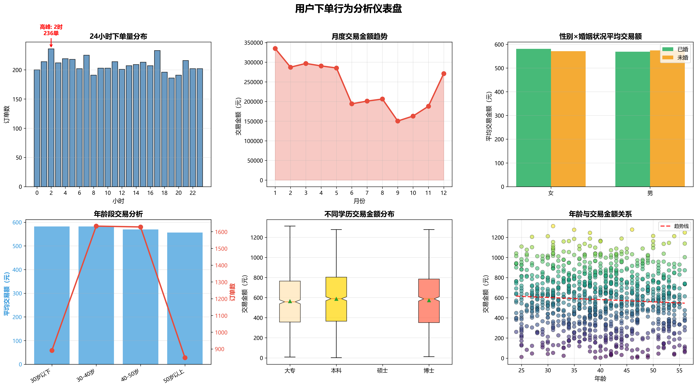

```python
import matplotlib.pyplot as plt
import pandas as pd
import numpy as np

# 数据加载
df_orders = pd.read_csv('docs/data/用户下单数据.csv', encoding='gbk')
df_orders['下单时间'] = pd.to_datetime(df_orders['下单时间'])
df_orders['用户出生日期'] = pd.to_datetime(df_orders['用户出生日期'])
df_orders['年龄'] = 2024 - df_orders['用户出生日期'].dt.year
df_orders['下单小时'] = df_orders['下单时间'].dt.hour
df_orders['下单月份'] = df_orders['下单时间'].dt.month

# 设置样式
plt.rcParams['font.sans-serif'] = ['Microsoft YaHei']
plt.rcParams['axes.unicode_minus'] = False

fig, axes = plt.subplots(2, 3, figsize=(18, 10))
fig.suptitle('用户下单行为分析仪表盘', fontsize=18, fontweight='bold', y=0.995)

# ========== 子图1：每小时下单量分布 ==========
hourly_orders = df_orders.groupby('下单小时').size()
axes[0, 0].bar(hourly_orders.index, hourly_orders.values, 
               color='steelblue', alpha=0.8, edgecolor='black')
axes[0, 0].set_xlabel('小时', fontsize=11)
axes[0, 0].set_ylabel('订单数', fontsize=11)
axes[0, 0].set_title('24小时下单量分布', fontsize=13, fontweight='bold')
axes[0, 0].grid(axis='y', alpha=0.3)
axes[0, 0].set_xticks(range(0, 24, 2))

# 标注高峰时段
max_hour = hourly_orders.idxmax()
max_count = hourly_orders.max()
axes[0, 0].annotate(f'高峰: {max_hour}时\n{max_count}单',
                    xy=(max_hour, max_count),
                    xytext=(max_hour, max_count * 1.1),
                    ha='center',
                    fontsize=10,
                    fontweight='bold',
                    color='red',
                    arrowprops=dict(arrowstyle='->', color='red', lw=1.5))

# ========== 子图2：月度交易金额趋势 ==========
monthly_amount = df_orders.groupby('下单月份')['交易金额'].sum()
axes[0, 1].plot(monthly_amount.index, monthly_amount.values, 
                marker='o', linewidth=2.5, markersize=8, color='#E74C3C')
axes[0, 1].fill_between(monthly_amount.index, monthly_amount.values, 
                         alpha=0.3, color='#E74C3C')
axes[0, 1].set_xlabel('月份', fontsize=11)
axes[0, 1].set_ylabel('交易金额（元）', fontsize=11)
axes[0, 1].set_title('月度交易金额趋势', fontsize=13, fontweight='bold')
axes[0, 1].grid(True, alpha=0.3)
axes[0, 1].set_xticks(range(1, 13))

# ========== 子图3：性别×婚姻状况交易对比 ==========
gender_marriage = df_orders.groupby(['性别', '婚姻状况'])['交易金额'].mean().unstack()
x = np.arange(len(gender_marriage.index))
width = 0.35
bars1 = axes[0, 2].bar(x - width/2, gender_marriage['已婚'], 
                       width, label='已婚', color='#27AE60', alpha=0.85)
bars2 = axes[0, 2].bar(x + width/2, gender_marriage['未婚'], 
                       width, label='未婚', color='#F39C12', alpha=0.85)
axes[0, 2].set_xticks(x)
axes[0, 2].set_xticklabels(gender_marriage.index)
axes[0, 2].set_ylabel('平均交易金额（元）', fontsize=11)
axes[0, 2].set_title('性别×婚姻状况平均交易额', fontsize=13, fontweight='bold')
axes[0, 2].legend(fontsize=10)
axes[0, 2].grid(axis='y', alpha=0.3)

# ========== 子图4：年龄段交易分布 ==========
df_orders['年龄段'] = pd.cut(df_orders['年龄'], 
                            bins=[0, 30, 40, 50, 100], 
                            labels=['30岁以下', '30-40岁', '40-50岁', '50岁以上'])
age_group_stats = df_orders.groupby('年龄段',observed=False).agg({
    '交易金额': ['mean', 'count']
}).reset_index()
age_group_stats.columns = ['年龄段', '平均交易额', '订单数']

ax4_twin = axes[1, 0].twinx()
color1 = '#3498DB'
bars = axes[1, 0].bar(range(len(age_group_stats)), age_group_stats['平均交易额'],
                      color=color1, alpha=0.7, label='平均交易额')
axes[1, 0].set_ylabel('平均交易额（元）', color=color1, fontsize=11, fontweight='bold')
axes[1, 0].tick_params(axis='y', labelcolor=color1)

color2 = '#E74C3C'
line = ax4_twin.plot(range(len(age_group_stats)), age_group_stats['订单数'],
                     color=color2, marker='o', linewidth=2.5, markersize=8, label='订单数')
ax4_twin.set_ylabel('订单数', color=color2, fontsize=11, fontweight='bold')
ax4_twin.tick_params(axis='y', labelcolor=color2)

axes[1, 0].set_xticks(range(len(age_group_stats)))
axes[1, 0].set_xticklabels(age_group_stats['年龄段'], rotation=30, ha='right')
axes[1, 0].set_title('年龄段交易分析', fontsize=13, fontweight='bold')
axes[1, 0].grid(axis='y', alpha=0.3)

# ========== 子图5：学历交易金额箱线图 ==========
education_levels = ['大专', '本科', '硕士', '博士']
education_data = [df_orders[df_orders['文化程度'] == edu]['交易金额'].values 
                  for edu in education_levels]
bp = axes[1, 1].boxplot(education_data, 
                        tick_labels=education_levels,
                        patch_artist=True,
                        showmeans=True,
                        notch=True)
colors_edu = ['#FFE5B4', '#FFD700', '#FFA500', '#FF6347']
for patch, color in zip(bp['boxes'], colors_edu):
    patch.set_facecolor(color)
    patch.set_alpha(0.7)
axes[1, 1].set_ylabel('交易金额（元）', fontsize=11)
axes[1, 1].set_title('不同学历交易金额分布', fontsize=13, fontweight='bold')
axes[1, 1].grid(axis='y', alpha=0.3)

# ========== 子图6：交易金额散点图（年龄 vs 交易金额） ==========
sample_data = df_orders.sample(n=min(1000, len(df_orders)), random_state=42)
scatter = axes[1, 2].scatter(sample_data['年龄'], sample_data['交易金额'],
                             c=sample_data['交易金额'], 
                             s=50, 
                             cmap='viridis', 
                             alpha=0.6,
                             edgecolors='black',
                             linewidth=0.5)
axes[1, 2].set_xlabel('年龄', fontsize=11)
axes[1, 2].set_ylabel('交易金额（元）', fontsize=11)
axes[1, 2].set_title('年龄与交易金额关系', fontsize=13, fontweight='bold')
axes[1, 2].grid(True, alpha=0.3)

# 添加趋势线
z = np.polyfit(sample_data['年龄'], sample_data['交易金额'], 1)
p = np.poly1d(z)
axes[1, 2].plot(sample_data['年龄'].sort_values(), 
                p(sample_data['年龄'].sort_values()),
                "r--", linewidth=2, alpha=0.8, label='趋势线')
axes[1, 2].legend(fontsize=9)

plt.tight_layout()
plt.savefig('用户行为分析仪表盘.png', dpi=300, bbox_inches='tight')
plt.show()

print("✅ 用户行为分析仪表盘生成完成！")
```