# 1. 大模型入门课

> 今日任务：
> 
> - [x] 1. 了解大模型发展历史
> - [x] 2. 试用常见大模型产品，开通API Key
> - [x] 3. 熟悉OpenAI SDK整合调用各大厂商模型
> - [x] 4. **部署自己的全能助理 OpenClaw + 飞书机器人**

# AI 发展史


## 1940s — 1960s：人工智能的诞生与早期探索

### 思想萌芽


- **1943年** — McCulloch & Pitts 提出**人工神经元数学模型**，首次将神经活动与数学逻辑联系起来
- **1950年** — Alan Turing 提出著名的**"图灵测试"**：机器能否思考？
- **1951年** — Minsky & Edmonds 建造第一台神经网络计算机 **SNARC**

← 图灵，被誉为"计算机科学之父"和"人工智能之父"

### 1956 · 达特茅斯会议 — AI诞生

> AI学科的诞生标志：
> 
> John McCarthy（约翰-麦卡锡） 首次提出 **"Artificial Intelligence"**（人工智能）术语
> 
> 这次会议被公认为AI学科的正式起点


### 早期成果

- **1957年** — Frank Rosenblatt（弗兰克·罗森布拉特） 发明**感知机（Perceptron）**，最早的人工神经网络之一
- **1958年** — McCarthy 发明 **LISP** 编程语言，成为AI研究主要工具
- **1966年** — MIT 开发 **ELIZA**，第一个聊天机器人

→ Mark I 感知机，1958年康奈尔航空实验室

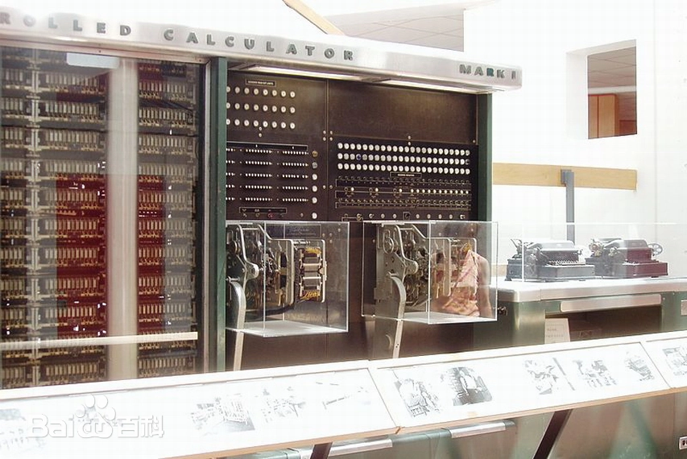

Mark I 感知机的核心是模仿生物神经元的处理方式，

通过“**权重 + 求和 + 激活函数**”来进行模式识别与分类。

主要功能：

1. **模式识别（Pattern Recognition）**
可识别简单的几何图案、字母形状等。
2. **自适应学习（Adaptive Learning）**
能通过训练样本调整权值，实现学习与改进。
3. **特征提取（Feature Extraction）**
输入图像通过感知机网络抽取关键特征并参与分类。
4. **多输入并行处理**
输入来自光电传感器阵列（相当于早期摄像机），以并行方式处理。

硬件结构：

- 输入层：64 个光电传感器（模拟“视网膜”）
- 中间层（权重存储）：可调电机控制的电位器
- 输出层：进行线性求和和阈值判断，给出分类结果。

| 对比维度 | Mark I 感知机 | 传统计算机（如当时的 IBM 等） |
| --- | --- | --- |
| 运算模型 | 神经网络模型（权重求和 + 激活） | 冯·诺依曼架构（程序指令控制） |
| 处理方式 | 并行处理输入 | 串行处理指令 |
| 学习能力 | 通过训练样本自动调整权重，实现自适应 | 无自适应能力，必须由程序员编写固定算法 |
| 用途 | 模式识别、图像分类等感知任务 | 数值计算、事务处理 |
| 数据表示 | 权重和阈值、信号强度 | 明确的二进制数据和指令序列 |
| 灵活性 | 可通过学习改变性能 | 性能基于固定程序，不会自我改变 |

## 1970s — 1980s：第一次AI寒冬与知识系统时代

### 第一次AI寒冬（1974-1980）

- 早期研究者**过于乐观的预测**未能实现
- 计算能力严重不足，无法处理复杂问题
- **1969年** — 《Perceptrons》指出单层感知机局限性，**神经网络研究停滞**
- 政府和机构**大幅削减AI研究经费**

### 专家系统的兴起（1980s）

> MYCIN（1972）：诊断血液感染疾病，准确率 **65%**，超过部分非专科医生

MYCIN 的内部结构大致包括：

1. **知识库（Knowledge Base）**：
  - 约 450 条基于领域专家经验的规则，例如：

```plain text
IF 患者的革兰氏染色为阳性
   AND 菌形为球形
THEN 病原体为葡萄球菌 的可能性为 0.7
```
2. **推理机（Inference Engine）**：
  - 采用 **后向链推理（Backward Chaining）**，从假设目标倒推需要哪些前提条件，再向用户提问以获得数据。
3. **置信因子计算**：
  - 针对每条规则使用 01（或 -11）之间的数值表示可信度，并在规则链中进行组合运算。

> XCON/R1（1980）：DEC公司专家系统，**为 DEC 的 VAX 系列小型机自动生成计算机系统的配置方案（确定每个客户订单中需要的硬件组件及安装方法）。**每年节省约 **4000万美元；**
> 
> > 它的核心就是**把硬件专家的知识固化到规则系统中，让 AI 自动为客户装配一台完全兼容、性能满足需求的计算机系统**，而且在当时是世界上最成功的工业 AI 应用之一。 **AI装机大师**

**主要任务**：

- 输入用户的订单需求（主机型号、性能需求、终端数量等）。
- 自动确定所需的所有硬件部件（CPU、内存、磁盘、I/O 控制器等）及其兼容性，并生成物料清单（BOM）和安装连线方案。
- 确保**兼容性**和**优化配置**，减少人工配置错误。

**核心作用**：

1. **减少人工配置复杂度**：VAX 系统有成千上万种组件组合，人工配置容易出错。
2. **提高生产效率**：自动生成可直接执行的安装指导，大幅提高产线速度。
3. **降低成本**：减少配置错误和返工，节省人工成本。
4. **知识固化**：将经验丰富的配置工程师的知识固化为规则，避免人员更替带来的经验损失。

### 机器学习的萌芽


- **1986年** — Rumelhart、**Hinton（即大名鼎鼎的杰弗里·辛顿）**、Williams 重新发现**反向传播算法**
- **1989年** — Yann LeCun（杨立昆） 提出**卷积神经网络（CNN）**，应用于手写数字识别

← Geoffrey Hinton，"深度学习之父"，2024年诺贝尔物理学奖得主

## 1990s — 2000s：第二次AI寒冬（1987-1993）

- 专家系统**维护成本高昂**，难以扩展
- 日本第五代计算机计划**未达预期**
- **AI商业泡沫破裂，**投资再次萎缩

### 1997 · 深蓝 vs 卡斯帕罗夫

> IBM **深蓝**击败国际象棋世界冠军 Garry Kasparov，震惊世界

### 三大要素齐备

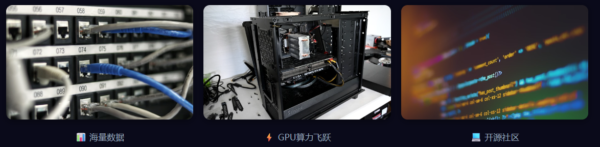

**2006年** — Hinton 提出**深度信念网络**，开启"深度学习"新纪元

## 2010s：深度学习革命

### 深度学习的突破

- **2011年** — IBM Watson 在《Jeopardy!》击败人类冠军
- **2012年** — **AlexNet** 在 ImageNet 以巨大优势获胜
- **2014年** — **GAN** 生成对抗网络提出
- **2015年** — **ResNet** 图像识别首次超越人类

### 2016 · AlphaGo vs 李世石

> DeepMind 是英国的人工智能公司，2014 年被 Google 收购，因研发 **AlphaGo** 打败人类围棋冠军而闻名。

### **2019 年 1 月：首次公开赛**

- **对战对象**：Team Liquid 的职业选手 **TLO**（宗族人族） 和 **MaNa**（宗族星灵）。
- AlphaStar 使用星灵（Protoss）种族作战。
- **规则**：标准《星际争霸Ⅱ》比赛规则，但 AlphaStar **视野是全地图可见**（全局信息），这点后来引发争议。
- **结果**：
  - AlphaStar 以 5:0 战绩击败 TLO。
  - 又以 5:0 战绩击败 MaNa。
  - 在比赛过程中，AlphaStar 展现出极高的操作速度（APM）和精确的微操能力，例如利用多点控制和单位规避几乎没有失误。
- **争议**：
  - AlphaStar 的全地图视野和超高反应速度被认为不是完全公平的条件。
  - DeepMind 当时承认这是初期实验，并承诺日后限制视野与反应速度，使其更接近人类体验。

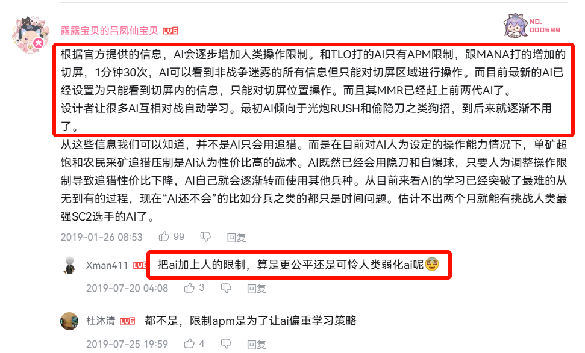

### 2017 · Transformer 改变一切

> #### Transformer 架构
> 
> Transformer 是 2017 年 Google Brain/Google Research 团队在论文 **《Attention Is All You Need》** 中提出的模型架构，它对 NLP（自然语言处理）甚至整个**深度学习**领域都有巨大影响。

- **2017年** — AlphaGo Zero 自我对弈 **100:0** 击败前代
- **2018年** — Google 发布 **BERT**，多项NLP纪录刷新

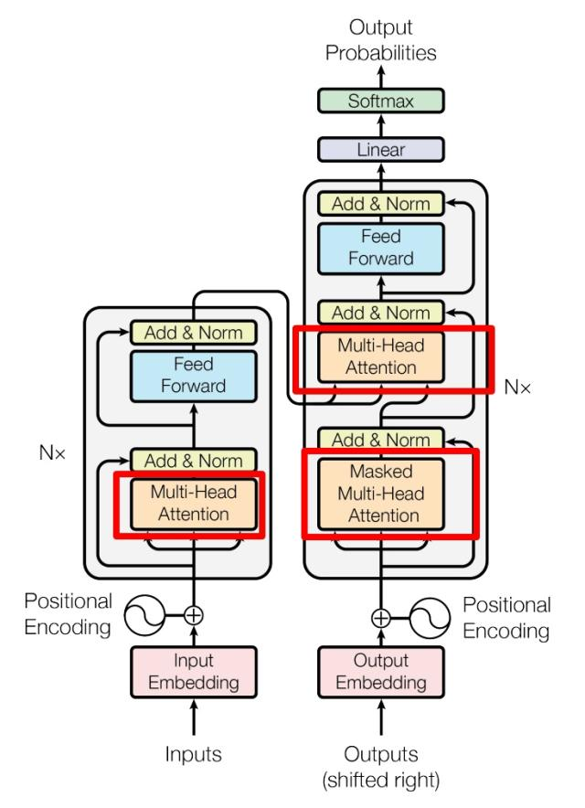

### AI产业化加速

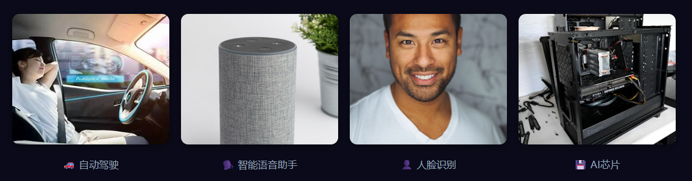

## 2020s至今：大模型与AIGC时代

### 大语言模型的爆发

- **2020年** — OpenAI 发布 **GPT-3**，1750亿参数
- **2022.11** — **ChatGPT** 发布，两个月用户破1亿
- **2023年** — **GPT-4** 多模态，多项考试达人类顶尖
- **2023年** — Gemini、LLaMA 开源
- **2024年** — Claude、GPT-4o 多模态大幅提升
- **2024年** — **Sora** 视频生成模型发布
- **2025年** — **DeepSeek-R1** 中国AI重大突破
- **2026年** — **Seedance2.0** 开年王炸、OpenClaw 强势霸屏


### AIGC浪潮

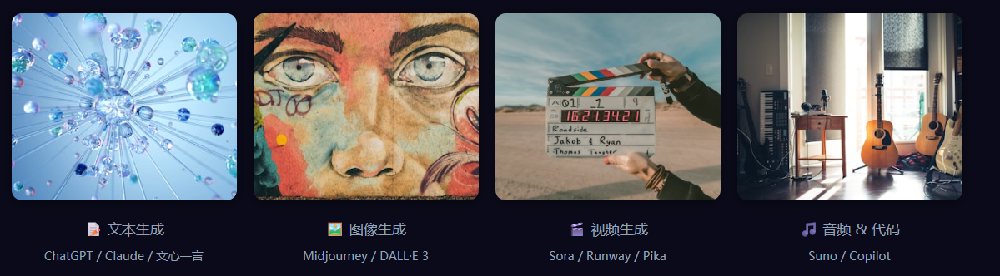

### Agent兴起


- 从单一对话 → **自主执行复杂任务**
- AutoGPT、BabyAGI 等自主智能体涌现
- 企业级 AI Agent 开始落地
- **多智能体协作**成为研究热点

> 这就是我们接下来应用开发层面学习的重点

# 人工智能核心技术体系

## 机器学习分类

| 类型 | 说明 | 典型算法 |
| --- | --- | --- |
| 监督学习 | 从标注数据中学习映射关系 | 线性回归、SVM、决策树 |
| 无监督学习 | 从无标注数据中发现模式 | K-Means、PCA、自编码器 |
| 半监督学习 | 结合少量标注和大量无标注数据 | 自训练、协同训练 |
| 强化学习 | 通过环境交互获得奖励来学习 | Q-Learning、PPO、DQN |

## 深度学习架构


- **CNN** — 图像识别、目标检测
- **RNN / LSTM** — 序列数据处理
- **Transformer** — NLP、多模态理解
- **GAN** — 图像生成、风格迁移
- **Diffusion Model** — 高质量图像/视频生成

## NLP & CV

**🗣️ 自然语言处理（NLP）**


- 文本分类与情感分析
- 机器翻译
- 问答系统 & 文本生成
- 大语言模型（LLM）

**👁️ 计算机视觉**


- 图像分类与目标检测
- 语义分割
- 人脸识别 & OCR
- 三维重建

# 2026 大模型 API 免费额度汇总

> 豆包（免费）、千问、元宝

## 阿里云 (百炼平台)

阿里云百炼不仅集成了市面上绝大多数的主流开源模型，还为开发者提供了极具诚意的 **3个月免费试用期**。

- **核心权益：** 每个模型 **100 万 Tokens**。
- **📍 领取地址：** [<u>阿里云百炼控制台</u>](https://bailian.console.aliyun.com)
- **🛠️ 领取步骤：**
  1. 登录百炼控制台。
  2. 阅读并同意协议后，系统将自动开通阿里云百炼并发放**免费推理额度**。
- **特性：** **有效期3个月**。
- **支持系列：** 千问全系、DeepSeek 全系、Kimi 系列、MiniMax 系列、GLM 智谱系列。

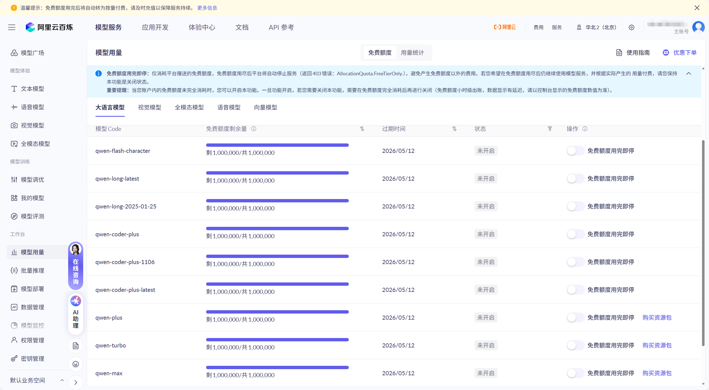

## 百度云 (千帆大模型平台)

百度千帆平台集成了大量第三方热门模型，采用“每模型独立额度”策略。

- **核心权益：** 每个模型 **100 万 Tokens** (ERNIE-4.5 系列通常有效期为 3 个月)。
- **📍 领取地址：** [<u>百度智能云千帆控制台</u>](https://console.bce.baidu.com/qianfan/overview)
- **🛠️ 领取步骤：**
  1. 访问千帆大模型平台
  2. 阅读并同意用户协议后，系统将自动开通千帆大模型平台并发放新用户免费Tokens额度。
- **自研模型：** `ERNIE-4.5-Turbo` (128K/32K/VL)、`ERNIE-X1-Turbo`。
- **第三方模型：** *DeepSeek 系： R1、V3、V3.1 (含 Think 版)。
  - **通义千问系：** Qwen3 (235B、30B、Coder 版本)。
  - **其他：** Kimi-K2-Instruct、bge-large (向量模型)、qianfan-sug-8k。

## 腾讯云 (Tencent Cloud)

腾讯云对混元 (Hunyuan) 全系列模型提供了试用包。

🎁 **免费福利：**

1. **通用资源包**：10 款主力模型**共享 100 万 Tokens**（有效期 1 年）。
2. **Embedding**：单独赠送 **100 万 Tokens**。
3. **Lite 版本**：**完全免费**。

- **📍 领取地址：** [<u>腾讯云混元控制台</u>](https://console.cloud.tencent.com/hunyuan/start)
- **🛠️ 领取步骤：**
  1. 点击上方链接登录腾讯云控制台。
  2. 进入“混元大模型”页面，点击“开通服务”。
  3. 在“资源包管理”或“权益中心”查看自动到账的 100 万额度。

📋 **主力模型（100万 token 共享）：**

- **旗舰/推理**：`Hunyuan-T1`、`Hunyuan-TurboS`、`Hunyuan-a13b`
- **多模态**：`Tencent Vision 1.5 Instruct`、`Hunyuan-turbos-vision`、`Hunyuan-t1-vision`
- **垂直领域**：`Hunyuan-large-role` (角色扮演)、`Hunyuan-translation` (翻译)

## 字节跳动 (火山引擎)

- **安心体验模式：**每个模型免费50万 tokens
- **协作奖励计划：** 每天 **200 万 Tokens** (2M)。
- **📍 领取地址：** [<u>火山引擎方舟控制台</u>](https://www.volcengine.com/experience/ark)
- **🛠️ 领取步骤：**
  1. 登录火山方舟控制台。
  2. 自动领取安心体验模式50万tokens
  3. 在开通管理页面——右侧活动二——开通协作奖励计划
- **模型：**除了字节跳动的豆包系，千问全系、DeepSeek 全系、Kimi 系列、MiniMax 系列、GLM 智谱系列基本都有
- **优势：** 按天重置额度，适合长期低频调用。

fa9643ea-1005-4ad1-96f5-4dca8d05af19

## 其他专业 AI 平台额度对比

| 平台 | 免费额度 | 重点模型 | 备注 |   |
| --- | --- | --- | --- | --- |
| 智谱 AI | 新用户 2000 万 Tokens | GLM-4.7, 4.6, 4.5 | 永久额度，国产自研强项 | [智谱AI开放平台](https://www.bigmodel.cn/invite?icode=I02TVoifCuOrucbw%2BELzfuZLO2QH3C0EBTSr%2BArzMw4%3D) |
| 硅基流动 | 新用户 2000 万 Tokens | DeepSeek, Llama 等开源模型 | 永久额度，API 响应比较快 | [硅基流动](https://cloud.siliconflow.cn/i/yz0wOmLb) |
| kimi | 新用户送15元代金券 | kimi-k2.5，kimi-k2等开源模型 | 永久代金券，API 响应快 | [kimi开放平台](https://platform.moonshot.cn/) |
| 科大讯飞 | 每个模型 20 万 Tokens | 星火 Ultra, Max, Pro | 涵盖长文本 128K 版本 | [讯飞星火-懂我的AI助手](https://cloud.tencent.com/developer/tools/blog-entry?target=https%3A%2F%2Fxinghuo.xfyun.cn%2F&objectId=2626756&objectType=1&contentType=markdown) |
| 魔搭社区 | 每天 2000 次 调用 | 社区全模型 | 需绑定阿里云，单个模型上限 500 次 | [魔搭社区](https://www.modelscope.cn/) |
| DeepSeek | 按量购买 | DeepSeek | 按量购买 |   |
| Cloudflare | 每天 10,000 神经元 | 各类开源小模型 | 计费模式特殊，适合轻量工具 | [Workers AI Cloudflare](https://www.cloudflare-cn.com/developer-platform/products/workers-ai/) |

# 常用软件整合

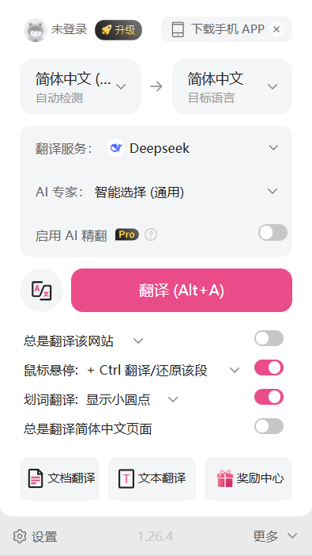

**沉浸式翻译**

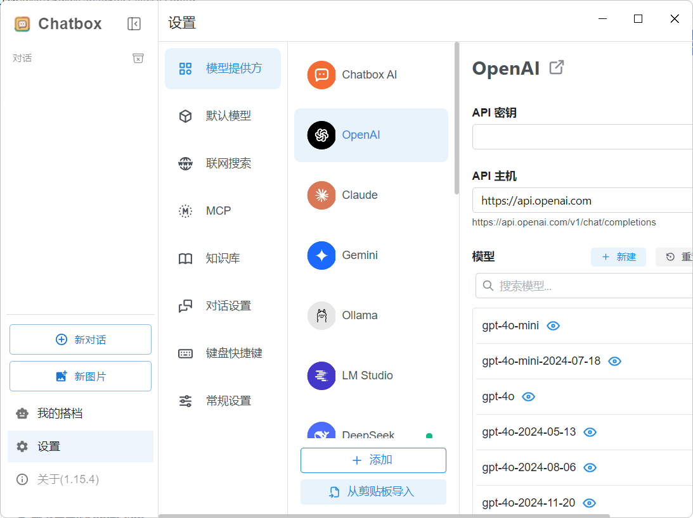

**Chatbox**

# OpenAI SDK 基本使用

> 下载Trae：https://www.trae.cn/

## Python 环境准备

### 前置课程

> 我们已经发布了前置课程，请自行学习对应内容。要求掌握如下
> 
> - [ ] Python基本语法
> - [ ] Python虚拟环境
> - [ ] Miniconda 命令

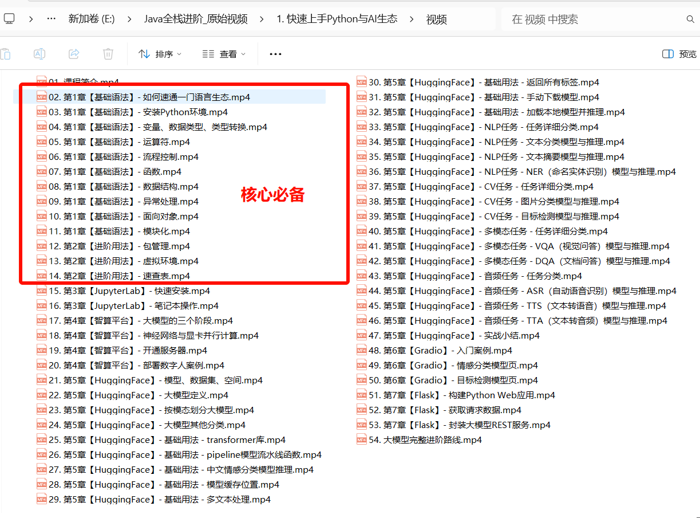

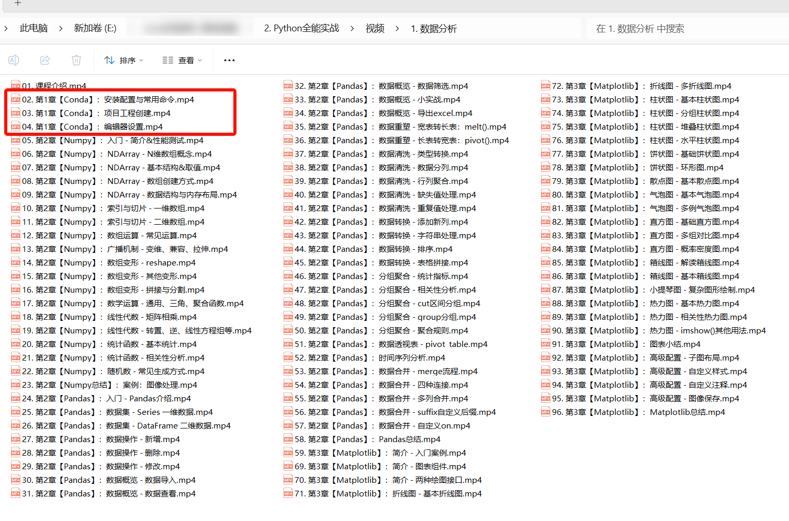

### Conda环境

Miniconda 是一个 Anaconda 的轻量级替代，默认只包含了 python 和 conda，但是可以通过 pip 和 conda 来安装所需要的包。Miniconda 安装包可以到以下链接下载。

https://mirrors.tuna.tsinghua.edu.cn/anaconda/miniconda/

> Conda加速配置

```java
conda config --add channels https://mirrors.tuna.tsinghua.edu.cn/anaconda/pkgs/main/
conda config --add channels https://mirrors.tuna.tsinghua.edu.cn/anaconda/cloud/conda-forge/
conda config --add channels https://mirrors.tuna.tsinghua.edu.cn/anaconda/cloud/bioconda/
```

| 分类 | 命令 | 功能说明 |
| --- | --- | --- |
| 环境管理 | conda create -n env_name python=3.10 | 创建一个名为 env_name 的新环境，并指定 Python 版本 |
|   | conda activate env_name | 激活名为 env_name 的环境 |
|   | conda deactivate | 退出当前环境 |
|   | conda env list 或 conda info --envs | 显示所有环境列表 |
|   | conda remove -n env_name --all | 删除指定环境 |
| 包管理 | conda install package_name | 安装包到当前环境 |
|   | conda install -n env_name package_name | 向指定环境安装包 |
|   | conda uninstall package_name | 卸载包 |
|   | conda update package_name | 更新某个包到最新版本 |
|   | conda update --all | 更新当前环境中所有包 |
|   | conda list | 列出当前环境中已安装的所有包 |
| 通道管理 | conda config --show channels | 查看当前配置的通道列表 |
|   | conda config --add channels channel_name | 添加新通道 |
|   | conda config --remove channels channel_name | 删除通道 |
| 环境导出与克隆 | conda env export > environment.yml | 导出当前环境配置 |
|   | conda env create -f environment.yml | 从配置文件创建环境 |
|   | conda create --name new_env --clone old_env | 克隆一个已有环境 |
| 信息查看与清理 | conda info | 查看 Conda 的总体信息 |
|   | conda search package_name | 搜索可用包 |
|   | conda clean --all | 清理未使用的包缓存等文件 |

```plain text
# 创建隔离环境
conda create -n myapp python=3.10

# 激活环境
conda activate myapp

# 安装依赖
pip install -r requirements.txt
```

## OpenAI SDK 调用测试

> Spring AI 就是 这个功能；

### 开通 API Key

1. 登录平台：https://bailian.console.aliyun.com/
2. 选择模型服务

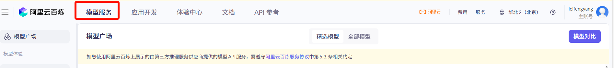

1. 点击密钥管理 ==> 创建 API Key ==> 复制密钥

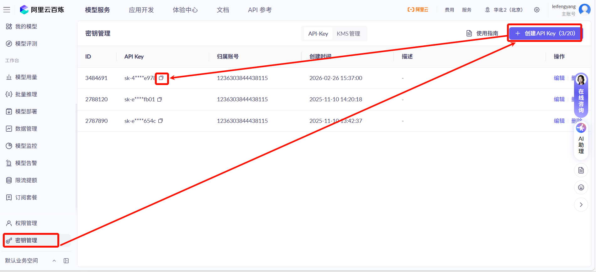

### 环境变量保存密钥

#### windows（cmd）

```shell
# CMD 运行如下命令
# 用您的阿里云百炼API Key代替YOUR_DASHSCOPE_API_KEY
setx DASHSCOPE_API_KEY "YOUR_DASHSCOPE_API_KEY"

# 打开新的CMD窗口进行测试
echo %DASHSCOPE_API_KEY%
```

#### Mac

先：`echo $SHELL`，确定shell类型。讲下面的 `.bash_profile` 修改为` .zshrc `或 `.bash_profile` 

```shell
# 用您的阿里云百炼API Key代替YOUR_DASHSCOPE_API_KEY
echo "export DASHSCOPE_API_KEY='YOUR_DASHSCOPE_API_KEY'" >> ~/.bash_profile

# 生效
source ~/.bash_profile

# 获取测试
echo $DASHSCOPE_API_KEY
```

#### Linux

```shell
# 用您的阿里云百炼API Key代替YOUR_DASHSCOPE_API_KEY
echo "export DASHSCOPE_API_KEY='YOUR_DASHSCOPE_API_KEY'" >> ~/.bashrc

# 生效
source ~/.bashrc

# 获取测试
echo $DASHSCOPE_API_KEY
```

### 调用代码测试

> 首先 `pip install openai`

```python
import os
from openai import OpenAI

try:
    client = OpenAI(
        # 若没有配置环境变量，请用阿里云百炼API Key将下行替换为: api_key="sk-xxx",
        api_key=os.getenv("DASHSCOPE_API_KEY"),
        base_url="https://dashscope.aliyuncs.com/compatible-mode/v1",
    )

    completion = client.chat.completions.create(
        model="qwen-plus",  # 模型列表: https://help.aliyun.com/model-studio/getting-started/models
        messages=[
            {'role': 'system', 'content': 'You are a helpful assistant.'},
            {'role': 'user', 'content': '你是谁？'}
        ]
    )
    print(completion.choices[0].message.content)
except Exception as e:
    print(f"错误信息：{e}")
    print("请参考文档：https://help.aliyun.com/model-studio/developer-reference/error-code")
```

### 支持的模型列表

| 类别 | 子类别 | 说明 |
| --- | --- | --- |
| 文本生成 | [通用大语言模型](https://help.aliyun.com/zh/model-studio/models?mode=pure#9f8890ce29g5u) | 千问大语言模型：商业版：[千问](https://help.aliyun.com/zh/model-studio/models?mode=pure#d4ccf72f23jh9)[Max](https://help.aliyun.com/zh/model-studio/models?mode=pure#d4ccf72f23jh9)、[千问](https://help.aliyun.com/zh/model-studio/models?mode=pure#5ef284d4ed42p)[Plus](https://help.aliyun.com/zh/model-studio/models?mode=pure#5ef284d4ed42p)（已升级至Qwen3.5）、[千问](https://help.aliyun.com/zh/model-studio/models?mode=pure#13ff05e329blt)[Flash](https://help.aliyun.com/zh/model-studio/models?mode=pure#13ff05e329blt)（已升级至Qwen3.5）开源版：[Qwen3.5](https://help.aliyun.com/zh/model-studio/models?mode=pure#479d0567e1a8z)、[Qwen3](https://help.aliyun.com/zh/model-studio/models?mode=pure#94410dcf1al50)、[Qwen2.5](https://help.aliyun.com/zh/model-studio/models?mode=pure#15f2bdc5dd3zd)第三方模型：[DeepSeek](https://help.aliyun.com/zh/model-studio/models?mode=pure#935bd5ba5cg5d)、[Kimi](https://help.aliyun.com/zh/model-studio/models?mode=pure#2363cbf60fe6m)、[GLM](https://help.aliyun.com/zh/model-studio/models?mode=pure#059d6a5d1chfp)、[MiniMax](https://help.aliyun.com/zh/model-studio/models?mode=pure#6194236b53fx0)等。 |
|   | [多模态模型](https://help.aliyun.com/zh/model-studio/models?mode=pure#5e79514e7cqp5) | 视觉理解模型（[千问](https://help.aliyun.com/zh/model-studio/models?mode=pure#5ef284d4ed42p)[Plus](https://help.aliyun.com/zh/model-studio/models?mode=pure#5ef284d4ed42p)、[千问](https://help.aliyun.com/zh/model-studio/models?mode=pure#3f1f1c8913fvo)[VL](https://help.aliyun.com/zh/model-studio/models?mode=pure#3f1f1c8913fvo)、[QVQ](https://help.aliyun.com/zh/model-studio/models?mode=pure#40e07d9a04nx8)）、音频理解模型[千问](https://help.aliyun.com/zh/model-studio/models?mode=pure#e176089a74849)[Audio](https://help.aliyun.com/zh/model-studio/models?mode=pure#e176089a74849)、全模态模型[千问](https://help.aliyun.com/zh/model-studio/models?mode=pure#90e80b9e42ged)[Omni](https://help.aliyun.com/zh/model-studio/models?mode=pure#90e80b9e42ged)、实时多模态模型[千问](https://help.aliyun.com/zh/model-studio/models?mode=pure#a162110bff6c4)[Omni-Realtime](https://help.aliyun.com/zh/model-studio/models?mode=pure#a162110bff6c4) |
|   | [领域模型](https://help.aliyun.com/zh/model-studio/models?mode=pure#543aadfcc9ziv) | [代码模型](https://help.aliyun.com/zh/model-studio/models?mode=pure#d698550551bob)、[长文本处理模型](https://help.aliyun.com/zh/model-studio/models?mode=pure#27b2b3a15d5c6)、[数学模型](https://help.aliyun.com/zh/model-studio/models?mode=pure#543aadfcc9ziv)、[翻译模型](https://help.aliyun.com/zh/model-studio/models?mode=pure#b51e22f4b036h)、[法律模型](https://help.aliyun.com/zh/model-studio/models?mode=pure#f0436273ef1xm)、[数据挖掘模型](https://help.aliyun.com/zh/model-studio/models?mode=pure#531dbf3f1addx)、[深入研究模型](https://help.aliyun.com/zh/model-studio/models?mode=pure#af665c3673n6e)、[意图理解模型](https://help.aliyun.com/zh/model-studio/models?mode=pure#85209145a5r68)、[角色扮演模型](https://help.aliyun.com/zh/model-studio/models?mode=pure#083f31bde1lv3)、[对话分析模型](https://help.aliyun.com/zh/model-studio/models?mode=pure#067fbf0cceu7d) |
| 图像生成 | [文生图](https://help.aliyun.com/zh/model-studio/models?mode=pure#96837528cdqes) | 通用模型：[千问文生图](https://help.aliyun.com/zh/model-studio/models?mode=pure#96837528cdqes)：在处理复杂指令、渲染中英文本及生成高清写实图片方面表现突出，支持根据效率与质量需求选择不同模型。万相文生图：[基础文生图](https://help.aliyun.com/zh/model-studio/models?mode=pure#d9510a8d75x8f)：适用于生成证件照、电商主图、模特图、各种风格人像图（动漫、国风、二次元等）。[图文混排输出](https://help.aliyun.com/zh/model-studio/models?mode=pure#157125edeb9tx)：先生成一段文字描述，随后紧接生成对应的图像，实现“文+图”的连贯输出。[Z-Image](https://help.aliyun.com/zh/model-studio/models?mode=pure#d7ef4964cd1vk)：轻量级文生图模型，可快速生成高质量图像，支持中英双语渲染、复杂语义理解和多风格题材。第三方模型：[Stable Diffusion](https://help.aliyun.com/zh/model-studio/models?mode=pure#a4321a2dc7zg7)和[FLUX](https://help.aliyun.com/zh/model-studio/models?mode=pure#8b57fb1fbf2op)。更多模型：[创意海报生成](https://help.aliyun.com/zh/model-studio/models?mode=pure#8a3d8eb0e8afq)、[创意文字生成-WordArt](https://help.aliyun.com/zh/model-studio/models?mode=pure#e9cc0a9c44sdv)[锦书](https://help.aliyun.com/zh/model-studio/models?mode=pure#e9cc0a9c44sdv) |
|   | [图像编辑](https://help.aliyun.com/zh/model-studio/models?mode=pure#bfe15d8aa2lxh) | 通用模型：[千问图像编辑](https://help.aliyun.com/zh/model-studio/models?mode=pure#bfe15d8aa2lxh)：支持中英文提示词输入，可实现风格迁移、文字修改、物体编辑等复杂图文编辑操作。同时支持多图融合，适配广泛多样的工业化应用场景。[万相图像编辑](https://help.aliyun.com/zh/model-studio/models?mode=pure#157125edeb9tx)：适用于多图融合、风格迁移、目标检测、图像修复、去水印等场景。模型系列包括：[万相](https://help.aliyun.com/zh/model-studio/models?mode=pure#157125edeb9tx)[2.6](https://help.aliyun.com/zh/model-studio/models?mode=pure#157125edeb9tx)、[万相](https://help.aliyun.com/zh/model-studio/models?mode=pure#4ba45a8357xdh)[2.5](https://help.aliyun.com/zh/model-studio/models?mode=pure#4ba45a8357xdh)、[万相](https://help.aliyun.com/zh/model-studio/models?mode=pure#8d5f5532099th)[2.1](https://help.aliyun.com/zh/model-studio/models?mode=pure#8d5f5532099th)。更多模型：[千问图像翻译](https://help.aliyun.com/zh/model-studio/qwen-mt-image-api)、[万相涂鸦作画](https://help.aliyun.com/zh/model-studio/models?mode=pure#5a4a19ad53er2)、[万相图像局部重绘](https://help.aliyun.com/zh/model-studio/models?mode=pure#d1cc07f214l3u)、[人像风格重绘](https://help.aliyun.com/zh/model-studio/models?mode=pure#c831fed18dhqv)、[图像背景生成](https://help.aliyun.com/zh/model-studio/models?mode=pure#60547f06c6qrm)、[图像画面扩展](https://help.aliyun.com/zh/model-studio/models?mode=pure#8e9b6350c62zt)、[人物实例分割](https://help.aliyun.com/zh/model-studio/models?mode=pure#8241c12baef0w)、[图像擦除补全](https://help.aliyun.com/zh/model-studio/models?mode=pure#1bc8993067cot)、[虚拟模特](https://help.aliyun.com/zh/model-studio/models?mode=pure#c5467902ebwjo)、[鞋靴模特](https://help.aliyun.com/zh/model-studio/models?mode=pure#e739c93771efr)、[人物写真生成-FaceChain](https://help.aliyun.com/zh/model-studio/models?mode=pure#4eba270341qlv)、[AI](https://help.aliyun.com/zh/model-studio/models?mode=pure#b11d85fe06ogg)[试衣](https://help.aliyun.com/zh/model-studio/models?mode=pure#b11d85fe06ogg) |
| 语音合成与识别 | [语音合成](https://help.aliyun.com/zh/model-studio/models?mode=pure#b9e5744149hd6) | [千问实时语音合成](https://help.aliyun.com/zh/model-studio/models?mode=pure#05782f7968r7g)、[千问语音合成](https://help.aliyun.com/zh/model-studio/models?mode=pure#e62b64f642k63)、[CosyVoice](https://help.aliyun.com/zh/model-studio/models?mode=pure#7a960cc042zwt)[语音合成](https://help.aliyun.com/zh/model-studio/models?mode=pure#7a960cc042zwt)和[Sambert](https://help.aliyun.com/zh/model-studio/models?mode=pure#95be68362c11b)[语音合成](https://help.aliyun.com/zh/model-studio/models?mode=pure#95be68362c11b)可实现文本转语音，适用于智能语音客服、有声读物、车载导航、教育辅导等场景。 |
|   | [语音识别/翻译](https://help.aliyun.com/zh/model-studio/models?mode=pure#696c1bf328gf9) | [千问实时语音识别](https://help.aliyun.com/zh/model-studio/models?mode=pure#04625778f9jd5)、[千问录音文件识别](https://help.aliyun.com/zh/model-studio/models?mode=pure#8017a37ad5a66)、[Fun-ASR](https://help.aliyun.com/zh/model-studio/models?mode=pure#140159cc9b5iz)[语音识别](https://help.aliyun.com/zh/model-studio/models?mode=pure#140159cc9b5iz)、[Gummy](https://help.aliyun.com/zh/model-studio/models?mode=pure#9e21336740rk2)[语音识别/翻译](https://help.aliyun.com/zh/model-studio/models?mode=pure#9e21336740rk2)、[Paraformer](https://help.aliyun.com/zh/model-studio/models?mode=pure#c018769cd7y88)[语音识别](https://help.aliyun.com/zh/model-studio/models?mode=pure#c018769cd7y88)和[SenseVoice](https://help.aliyun.com/zh/model-studio/models?mode=pure#511fe328d19af)[语音识别](https://help.aliyun.com/zh/model-studio/models?mode=pure#511fe328d19af)可实现语音转文本，适用于实时会议记录、实时直播字幕、电话客服等场景。此外，[Gummy](https://help.aliyun.com/zh/model-studio/models?mode=pure#9e21336740rk2)[语音识别/翻译](https://help.aliyun.com/zh/model-studio/models?mode=pure#9e21336740rk2)还支持语音翻译。 |
| 视频编辑与生成 | [文生视频](https://help.aliyun.com/zh/model-studio/models?mode=pure#7a13292788yvp) | [文生视频](https://help.aliyun.com/zh/model-studio/models?mode=pure#7a13292788yvp)：一句话生成视频，视频风格丰富，画质细腻。 |
|   | [图生视频](https://help.aliyun.com/zh/model-studio/models?mode=pure#af6bc5a9c3cp9) | [首帧生视频](https://help.aliyun.com/zh/model-studio/models?mode=pure#af6bc5a9c3cp9)：以输入图像作为视频首帧，结合提示词生成完整视频。[首尾帧生视频](https://help.aliyun.com/zh/model-studio/models?mode=pure#90cb98a2b9s2q)：提供首帧与尾帧图像，结合提示词生成过渡自然的视频。[多图生视频](https://help.aliyun.com/zh/model-studio/models?mode=pure#f7de663db89xi)：支持输入一张或多张图片，参考图片中的主体或背景，并结合提示词生成视频。图+动作模板生成舞蹈视频：[舞动人像](https://help.aliyun.com/zh/model-studio/models?mode=pure#a54957baf9exo)[AnimateAnyone](https://help.aliyun.com/zh/model-studio/models?mode=pure#a54957baf9exo)基于人物图片和动作视频生成舞蹈视频。图+音频生成对口型视频[万相-数字人](https://help.aliyun.com/zh/model-studio/models?mode=pure#3bff5da885yx3)基于人物图片和音频，动作幅度大且自然，支持全身、半身、肖像等多种画幅，适合唱歌、表演等场景。[悦动人像](https://help.aliyun.com/zh/model-studio/models?mode=pure#c6384886fd3s8)[EMO](https://help.aliyun.com/zh/model-studio/models?mode=pure#c6384886fd3s8)基于人物图片和音频，口型与表情表现力强，支持肖像、半身，适合人物特写场景。[灵动人像](https://help.aliyun.com/zh/model-studio/models?mode=pure#45109ade609nr)[LivePortrait](https://help.aliyun.com/zh/model-studio/models?mode=pure#45109ade609nr)基于人物图片和音频，适合语音播报场景。图+表情模板生成表情包视频：[表情包](https://help.aliyun.com/zh/model-studio/models?mode=pure#f62472e1b6m3b)[Emoji](https://help.aliyun.com/zh/model-studio/models?mode=pure#f62472e1b6m3b)基于人脸图片和预设的人脸动态模板，生成人脸表情包视频。 |
|   | [视频生视频](https://help.aliyun.com/zh/model-studio/models?mode=pure#62b53b525bud3) | [参考生视频](https://help.aliyun.com/zh/model-studio/models?mode=pure#62b53b525bud3)：参考输入视频中的角色形象和音色，结合提示词生成保持角色一致性的视频。 |
|   | [视频编辑](https://help.aliyun.com/zh/model-studio/models?mode=pure#f7de663db89xi) | [通用视频编辑](https://help.aliyun.com/zh/model-studio/models?mode=pure#f7de663db89xi)：基于输入的文本提示词、图片和视频，可执行多种视频编辑任务。例如，通过提取输入视频的运动特征，并结合提示词生成新的视频。视频口型替换：[声动人像](https://help.aliyun.com/zh/model-studio/models?mode=pure#3714ddc2e6a0p)[VideoRetalk](https://help.aliyun.com/zh/model-studio/models?mode=pure#3714ddc2e6a0p)基于人物视频和音频，适合短视频制作、视频翻译等场景。视频风格转换：[视频风格重绘](https://help.aliyun.com/zh/model-studio/models?mode=pure#21cd0ccad2ota)可将视频转换为日式漫画、美式漫画等风格。 |
| 向量 | [文本向量](https://help.aliyun.com/zh/model-studio/models?mode=pure#3383780daf8hw) | 将文本转换成一组可以代表文字的数字，用于搜索、聚类、推荐、分类等。 |
|   | [多模态向量](https://help.aliyun.com/zh/model-studio/models?mode=pure#9bda215aa7mko) | 将文本、图像、语音转换成一组数字，用于音视频分类、图像分类、图文检索等。 |
| 行业 | [通义法睿](https://help.aliyun.com/zh/model-studio/models?mode=pure#f0436273ef1xm) | 适用于法律咨询、案例分析和法规解读等。 |
|   | [意图理解](https://help.aliyun.com/zh/model-studio/models?mode=pure#85209145a5r68) | [意图理解模型](https://help.aliyun.com/zh/model-studio/models?mode=pure#85209145a5r68)能够在毫秒级时间内解析用户意图，并选择合适工具来解决用户问题。 |

## 其他测试

### 语音合成

```python
import os
import dashscope

# 以下为北京地域url，若使用新加坡地域的模型，需将url替换为：https://dashscope-intl.aliyuncs.com/api/v1
dashscope.base_http_api_url = 'https://dashscope.aliyuncs.com/api/v1'

text = "那我来给大家推荐一款T恤，这款呢真的是超级好看，这个颜色呢很显气质，而且呢也是搭配的绝佳单品，大家可以闭眼入，真的是非常好看，对身材的包容性也很好，不管啥身材的宝宝呢，穿上去都是很好看的。推荐宝宝们下单哦。"# SpeechSynthesizer接口使用方法：dashscope.audio.qwen_tts.SpeechSynthesizer.call(...)
response = dashscope.MultiModalConversation.call(
    # 如需使用指令控制功能，请将model替换为qwen3-tts-instruct-flash
    model="qwen3-tts-flash",
    # 新加坡和北京地域的API Key不同。获取API Key：https://help.aliyun.com/zh/model-studio/get-api-key# 若没有配置环境变量，请用百炼API Key将下行替换为：api_key = "sk-xxx"
    api_key=os.getenv("DASHSCOPE_API_KEY"),
    text=text,
    voice="Cherry",
    language_type="Chinese", # 建议与文本语种一致，以获得正确的发音和自然的语调。# 如需使用指令控制功能，请取消下方注释，并将model替换为qwen3-tts-instruct-flash# instructions='语速较快，带有明显的上扬语调，适合介绍时尚产品。',# optimize_instructions=True,
    stream=False
)
print(response)
```

### 文本生图

```python
from http import HTTPStatus
from urllib.parse import urlparse, unquote
from pathlib import PurePosixPath
import requests
from dashscope import ImageSynthesis
import os
import dashscope

# 以下为北京地域url，若使用新加坡地域的模型，需将url替换为：https://dashscope-intl.aliyuncs.com/api/v1
dashscope.base_http_api_url = 'https://dashscope.aliyuncs.com/api/v1'

prompt = "一副典雅庄重的对联悬挂于厅堂之中，房间是个安静古典的中式布置，桌子上放着一些青花瓷，对联上左书“义本生知人机同道善思新”，右书“通云赋智乾坤启数高志远”， 横批“智启千问”，字体飘逸，在中间挂着一幅中国风的画作，内容是岳阳楼。"# 新加坡和北京地域的API Key不同。获取API Key：https://help.aliyun.com/zh/model-studio/get-api-key# 若没有配置环境变量，请用百炼API Key将下行替换为：api_key="sk-xxx"
api_key = os.getenv("DASHSCOPE_API_KEY")

print('----同步调用，请等待任务执行----')
rsp = ImageSynthesis.call(api_key=api_key,
                          model="qwen-image-plus", # 当前仅qwen-image-plus、qwen-image模型支持异步接口
                          prompt=prompt,
                          negative_prompt=" ",
                          n=1,
                          size='1664*928',
                          prompt_extend=True,
                          watermark=False)
print(f'response: {rsp}')
if rsp.status_code == HTTPStatus.OK:
    # 在当前目录下保存图像for result in rsp.output.results:
        file_name = PurePosixPath(unquote(urlparse(result.url).path)).parts[-1]
        with open('./%s' % file_name, 'wb+') as f:
            f.write(requests.get(result.url).content)
else:
    print(f'同步调用失败, status_code: {rsp.status_code}, code: {rsp.code}, message: {rsp.message}')
```

> 注意：几乎所有的AI厂商都支持 OpenAI SDK的调用标准。你不妨测试测试其他厂商。
> 
> 核心三大参数：
> 
> 1. base_url：模型基础url地址
> 2. api_key：密钥
> 3. model：模型名字

token和文本

- 大模型按照Token计费。 0.75个字 = 1个token；
- 100w 字； 120w + token
- 大模型窗口数量限制（token限制），大模型能接受输入输出有多少

# 部署自己的 OpenClaw

> AI Agent 开发，顶级也就是 OpenClaw；

> 官网：https://openclaw.ai/

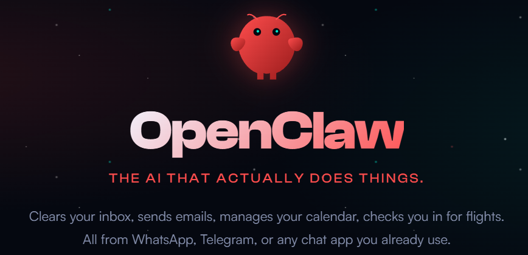

> 以火山引擎为例：快速部署OpenClaw（原Moltbot），集成飞书AI助手;

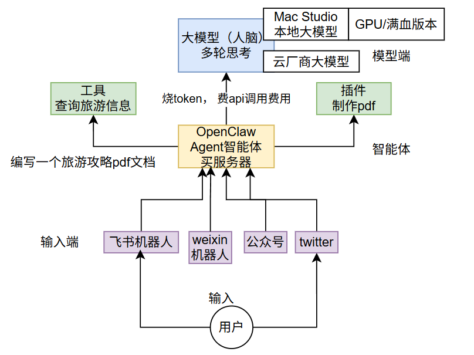

## 全手动安装

```shell
# 下载官方代码
git clone https://github.com/openclaw/openclaw.git

# 安装依赖
cd openclaw && pnpm install && pnpm run build

# 运行 openclaw
pnpm run openclaw onboard

# 验证安装
openclaw --version

# 环境检查
openclaw doctor

# 交互式配置向导，带你设置 API Key、连接聊天平台和初始配置。
openclaw onboard

```

安装完成后，onboard 向导会引导你完成配置。每一步的作用如下。

> 1. 选择 AI 供应商
> 
> 选 Anthropic (Claude)、OpenAI (GPT)、Google (Gemini) 或通过 Ollama 跑本地模型。
> 
> 随时可以在配置里切换。

> 1. 添加 API Key
> 
> 从供应商后台粘贴你的 API Key。Key 存在本地 .env 文件里——除了 AI 供应商，不会发到任何地方。

> 1. 连接聊天平台
> 
> 接入 WhatsApp（扫二维码）、Telegram（粘贴 @BotFather 的 Bot Token）、Discord（粘贴 Bot Token）或其他支持的平台。

> 1. 发条测试消息
> 
> 通过已连接的聊天软件给 OpenClaw 发条消息。
> 
> 如果它回复了，就说明一切就绪。试试发：'你能做什么？'

> 注意：**.env** — 所有配置存储在 `~/.openclaw/.env`。你可以直接编辑这个文件来切换供应商、添加 API Key 或调整设置。完整参考见 docs.openclaw.ai/configuration。

## 使用云厂商模板

https://www.volcengine.com/docs/6396/2189942

### 步骤一：创建ECS服务器

1. [点此](https://console.volcengine.com/ecs/region:ecs+cn-shanghai/buy?type=app)登录云服务器控制台。
2. 通过应用模板快速购买预置了OpenClaw的云服务器，配置如下参数。

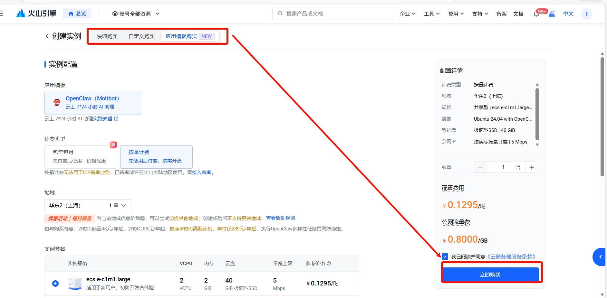

1. 查看开通的服务器

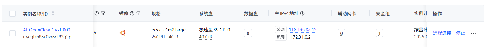

### 步骤二：开通方舟大模型服务并获取配置

您可以参考本节指引，开通方舟大模型服务并获取API Key。

1. 请登录[开通管理页面](https://console.volcengine.com/ark/region:ark+cn-beijing/openManagement?LLM=%7B%7D&advancedActiveKey=model)，选择您期望为OpenClaw提供推理服务的模型家族。

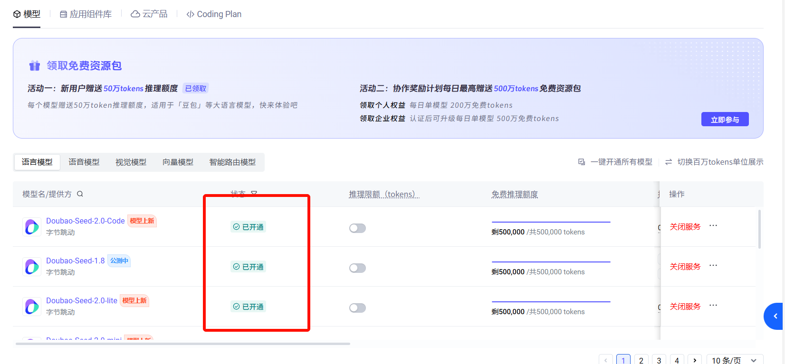

1. 在左侧目录树选择“系统管理 > API Key 管理”，创建并获取API Key。

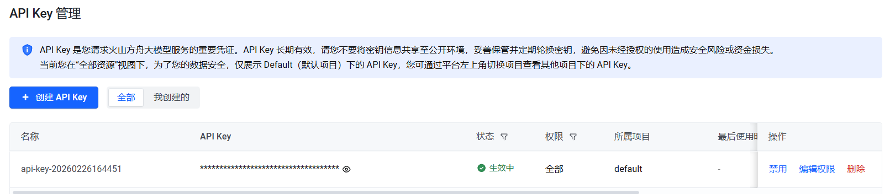

1. 在左侧目录树选择“智能广场 > 模型广场”，单击您期望OpenClaw使用的具体模型进入其详情页。本文以“Doubao-Seed-Code”为例。

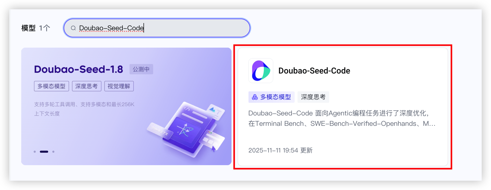

1. 单击复制按钮，获取模型的“Model ID”。 

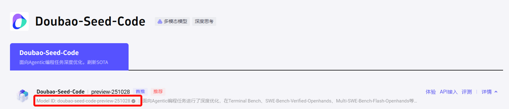

> # **以下进入飞书机器人整合流程；**

### 步骤三：创建飞书机器人并获取配置

#### 创建企业自建应用。

1. 登录[飞书开发者平台](https://open.larkoffice.com/app?lang=zh-CN)，单击“创建企业自建应用”按钮。


1. 需配置应用名、描述及图标。

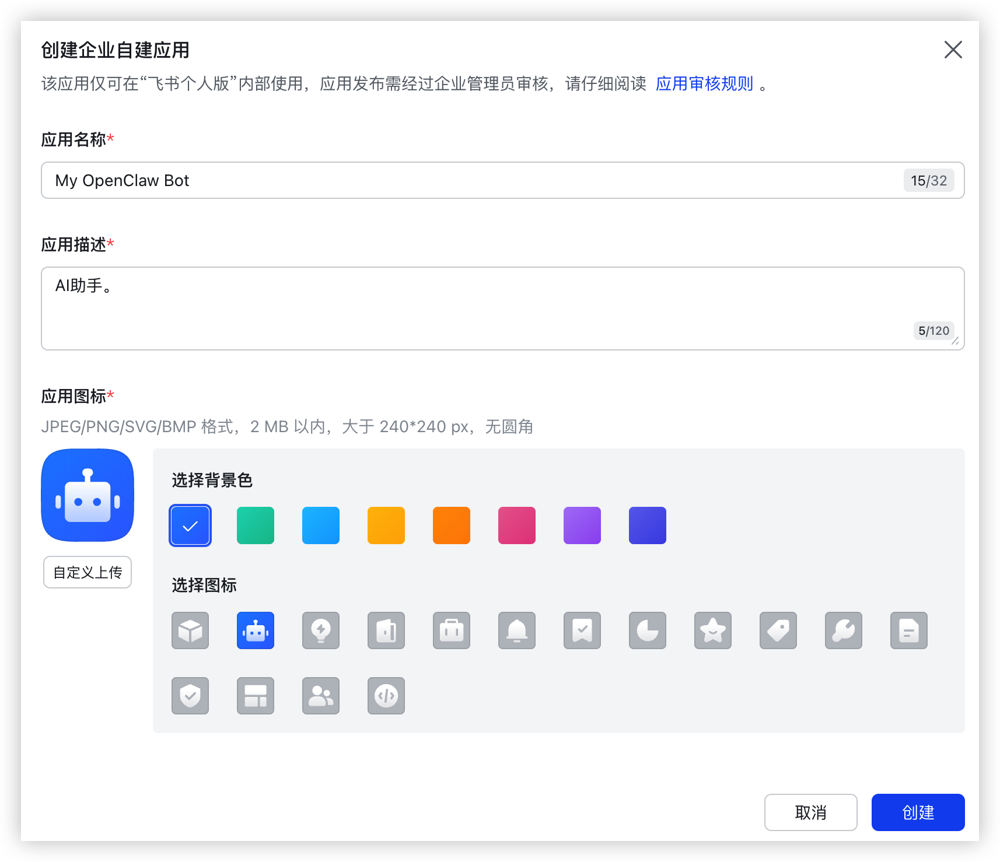

1. 单击“创建”按钮，完成操作。

#### 添加机器人能力。

1. 在左侧目录树选择“应用能力 > 添加应用能力”。
2. 选择“按能力添加”页签，单击“机器人”能力卡片的“添加”按钮。

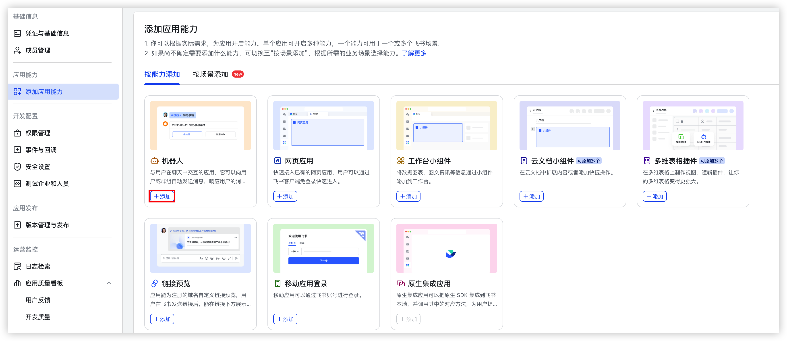

#### 配置权限。

1. 在左侧目录树选择“开发配置 > 权限管理”，单击“批量导入/导出权限”按钮。

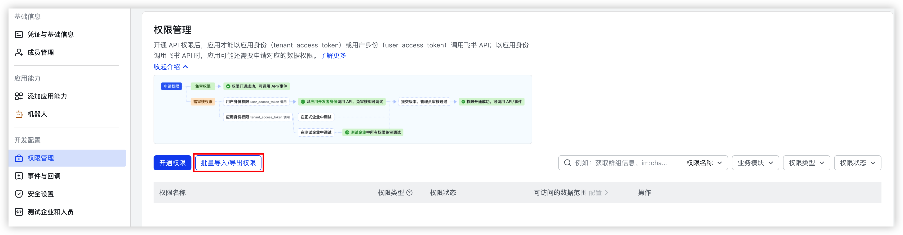

1. 在“导入”页签中，将如下权限替换原有示例，单击“下一步，确认新增权限”按钮。

```json
{
  "scopes": {
    "tenant": [
      "im:chat:read",
      "im:chat:update",
      "im:message.group_at_msg:readonly",
      "im:message.p2p_msg:readonly",
      "im:message.pins:read",
      "im:message.pins:write_only",
      "im:message.reactions:read",
      "im:message.reactions:write_only",
      "im:message:readonly",
      "im:message:recall",
      "im:message:send_as_bot",
      "im:message:send_multi_users",
      "im:message:send_sys_msg",
      "im:message:update",
      "im:resource",
      "contact:contact.base:readonly"
    ],
    "user": [
      "contact:user.employee_id:readonly"
    ]
  }
}
```

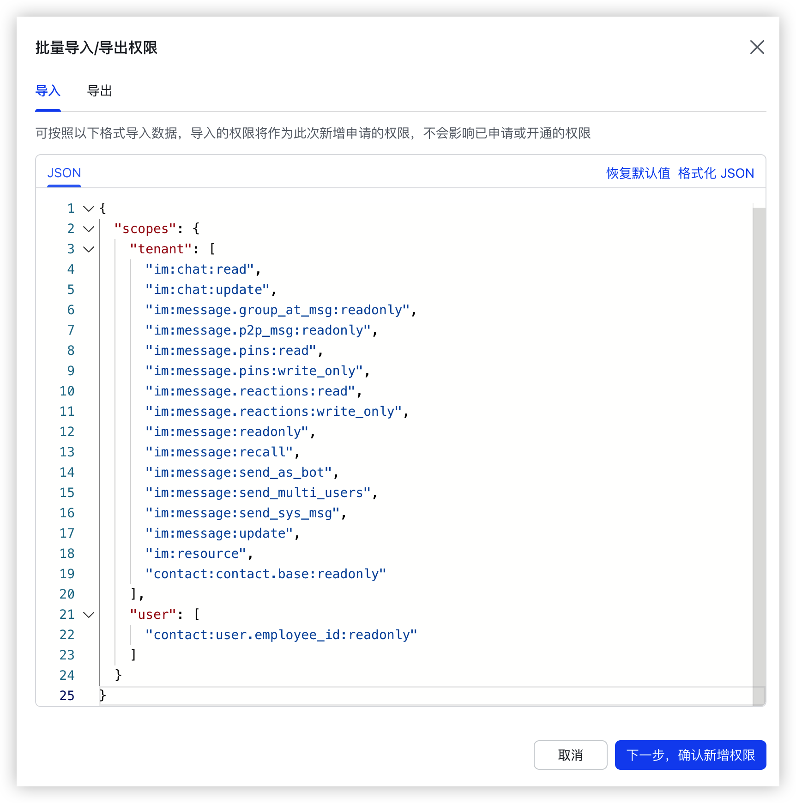

1. 在弹窗中确认权限无误后，单击“申请开通”按钮，完成操作。

> 相关权限的具体含义可查看[飞书API权限列表](https://open.larkoffice.com/document/server-docs/application-scope/scope-list)。

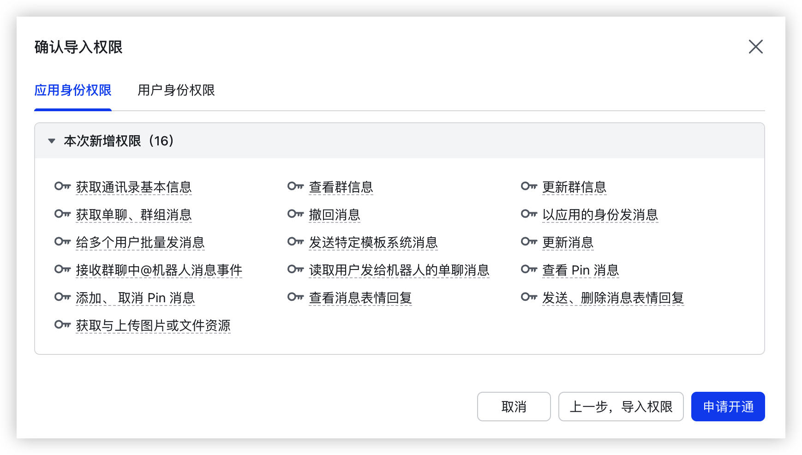

#### 获取配置信息。

1. 在左侧目录树选择“基础信息 > 凭证与基础信息”。
2. 在“应用凭证”模块中，获取并记录App ID与App Secret信息。

> 说明：获取的App ID与App Secret将用于配置OpenClaw，请妥善保存。

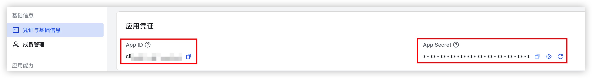

#### 发布应用。

1. 单击顶部的“创建版本”按钮。


1. 按需配置应用版本号、默认能力及更新说明等信息。[了解更多](https://open.larkoffice.com/document/best-practices/intro-to-custom-app-review)。


1. 单击页面底部的“保存”按钮，创建版本。

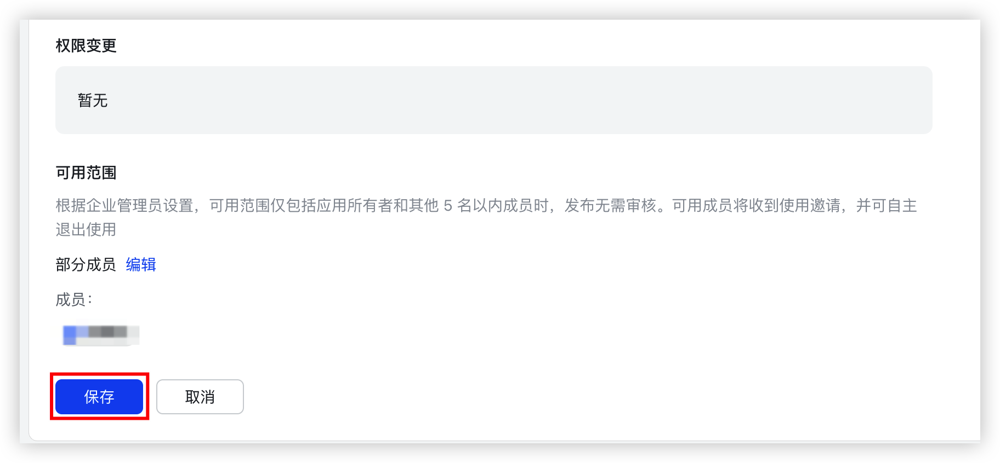

1. 单击页面右上角的“确认发布”按钮，完成应用发布。

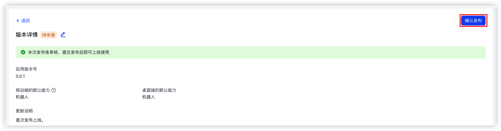

### 步骤四：配置 OpenClaw飞书AI助手

#### 基本整合

1. [登录云服务器实例](https://www.volcengine.com/docs/6396/67747)。
2. 执行如下命令，配置模型和飞书集成的参数。

```python
curl -fsSL https://openclaw.tos-cn-beijing.volces.com/setup.sh | bash -s -- \
    --ark-coding-plan "false" \
    --ark-model-id "doubao-seed-code" \
    --ark-api-key "请替换为方舟API Key" \
    --feishu-app-id "请替换为飞书APP ID" \
    --feishu-app-secret "请替换为飞书APP Secret"
```

> 说明：请根据实际情况，调整命令中如下参数取值：
> 
> - `--ark-coding-plan`：用于指定是否使用您订阅的Coding Plan。
>   - 若您已经订阅了Coding Plan，请传入true。
>   - 若您未订阅方舟Coding Plan，请传入false。建议您[订阅方舟Coding Plan](https://www.volcengine.com/activity/codingplan)，包月低至9.9元，模型调用自由。
> - `--ark-model-id`：用于指定您期望OpenClaw使用的方舟模型。
>   - 若--ark-coding-plan参数配置为true，请将doubao-seed-code替换为Coding Plan支持的模型名称。支持：doubao-seed-code、glm-4.7、deepseek-v3.2、kimi-k2-thinking、kimi-k2.5。
>   - 若--ark-coding-plan参数配置为false，请将doubao-seed-code替换为您期望使用的方舟模型ID。
> - `--ark-api-key`：用于指定方舟模型API Key。
> - -`-feishu-app-id`：用于指定飞书机器人App ID。
> - `--feishu-app-secret`：用于指定飞书机器人App Secret。

回显如下所示时，表示已成功完成配置。

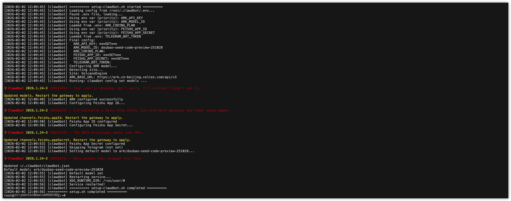

1. 登录[飞书开发者平台](https://open.larkoffice.com/app?lang=zh-CN)。 
2. 选择“企业自建应用”页签，并单击您创建的飞书开放应用。

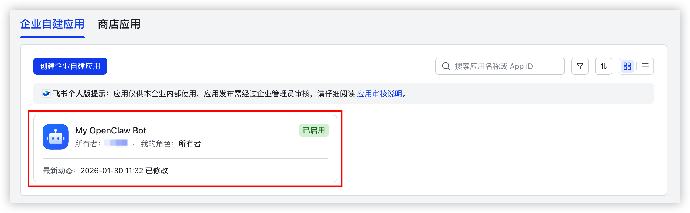

#### 事件与回调

在左侧目录树选择“开发配置 > 事件与回调”。

##### 事件配置

1. 选择“事件配置”页签，单击“订阅方式”旁的编辑按钮。
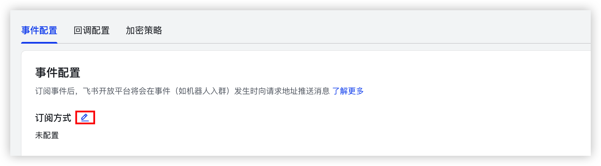
2. 选择“使用 **长连接** 接收事件”，并单击“保存”按钮。
  此处图片损坏
3. 在“已添加事件”区域，单击“添加事件”按钮。
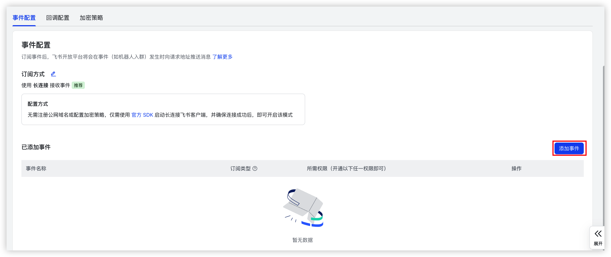
4. 在添加事件对话框中，选择“应用身份订阅”页签，并勾选“接收消息”及其它您需要订阅的事件，单击“确认添加”按钮。
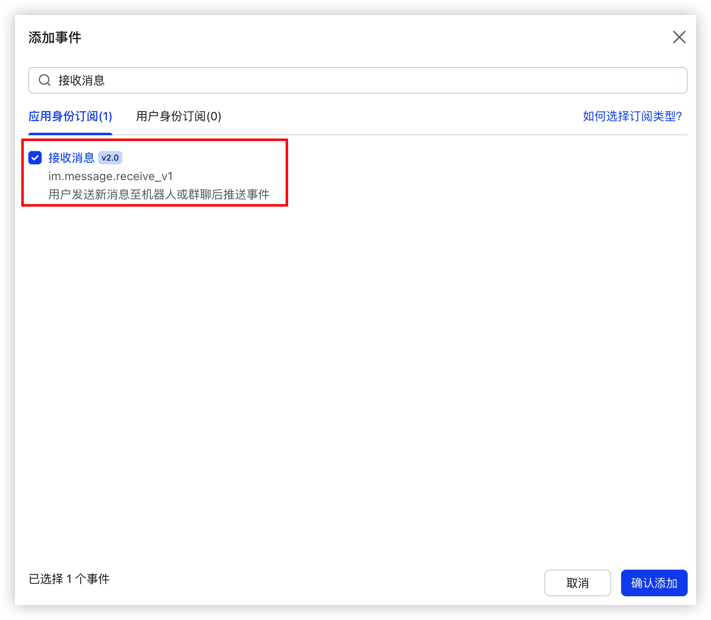
5. **（可选）**若您期望将机器人添加到聊天群组中使用，需开通获取群组消息权限。否则，请跳过本步骤。
  1. 在“已添加事件”模块中，单击“接收消息”事件“所需权限”列的“查看其它权限”按钮。

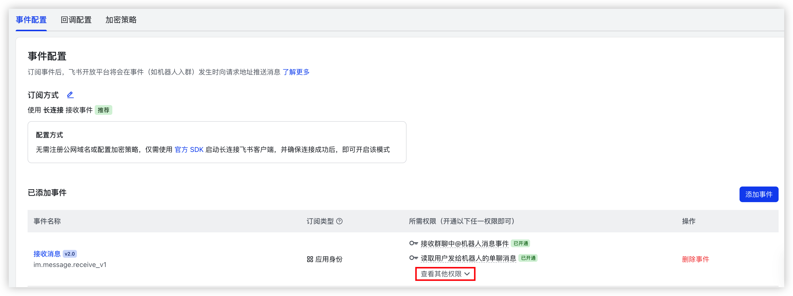

  1. 单击“获取群组中所有消息（敏感权限）”。

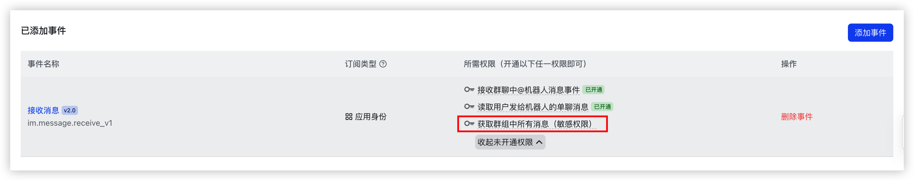

  1. 在弹窗中单击“开通权限”按钮，申请开通。

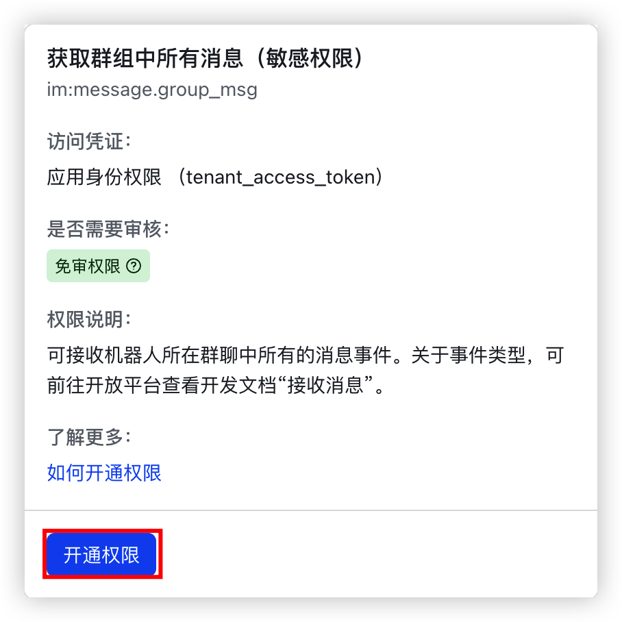

##### 回调配置

1. 选择“回调配置”页签，单击“订阅方式”旁的编辑按钮。

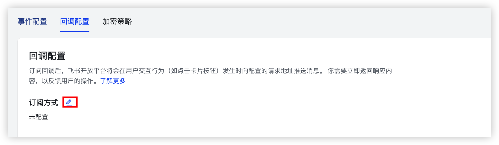

1. 选择“使用 **长连接** 接收回调”，并单击“保存”按钮。

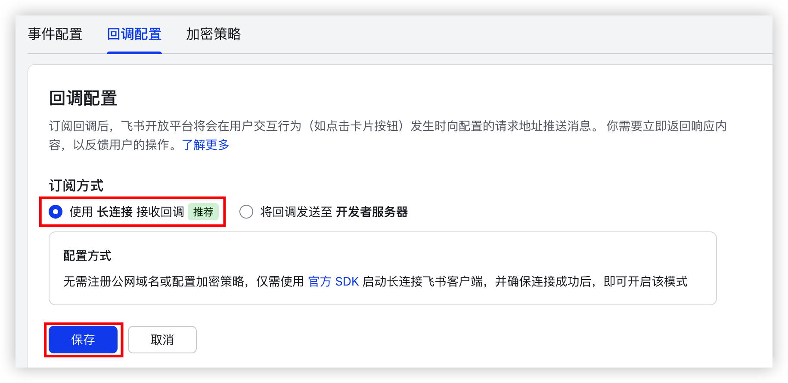

#### 机器人配对

##### 新建机器人版本并发布

1. 单击顶部的“创建版本”按钮。


1. 按需配置应用版本号、默认能力及更新说明等信息。[了解更多](https://open.larkoffice.com/document/best-practices/intro-to-custom-app-review)。

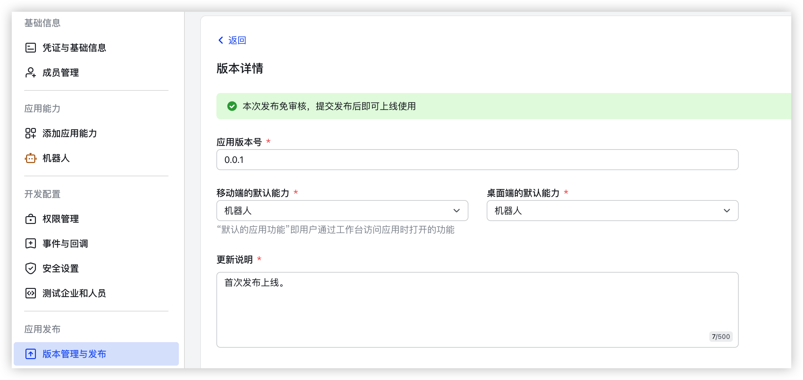

1. 单击页面底部的“保存”按钮，创建版本。


1. 单击页面右上角的“确认发布”按钮，完成应用发布。


##### 和飞书应用配对。

1. 向机器人发送任意消息（例如：介绍下自己）。
2. 根据机器人回复，复制其配对命令。

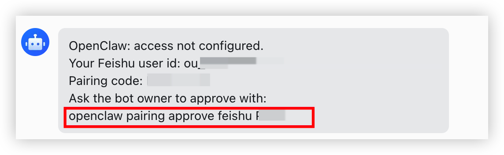

1. [登录目标实例](https://www.volcengine.com/docs/6396/67747)，执行您获取的配对命令。

> 至此，您已成功集成飞书机器人，可正式在飞书中使用您的定制化私人AI助手。

```python
# 针对 火山引擎; 重新跑一遍更新配置
curl -fsSL https://openclaw.tos-cn-beijing.volces.com/setup.sh | bash -s -- \
    --ark-coding-plan "false" \
    --ark-model-id "doubao-seed-1-6-251015" \
    --ark-api-key "fa9643ea-1005-444d1-96f5-43338d05af19" \
    --feishu-app-id "44444" \
    --feishu-app-secret "444444"
    
 # openclaw如何整合 qwen、deepseek等模型
```

> 有机会，OpenClaw本地完全部署指南