# 3. Dify：企业私有化AI工作流平台

https://dify.ai/zh

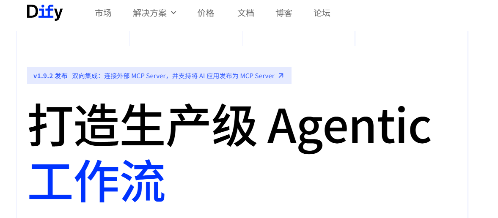

# 入门

## 简介

> Dify 是一个**开源的对话人工智能平台**，主要面向开发者和企业，帮助他们**构建、部署和管理**智能对话机器人和自然语言处理（NLP）应用。这个平台通常汇聚了先进的语言模型、多样的对话能力和丰富的集成接口，便于快速搭建定制化的聊天机器人或智能客服系统。
> 
> **如果你用过Coze。他就相当于可企业私有化部署的Coze。**
> 
> - **Dify** 更适合企业与开发者，尤其是那些对数据隐私和定制化有较高要求的用户。它功能更全面，支持微调和多模型调度，适合专业级智能客服、办公自动化等复杂场景。
> - **Coze** 则更聚焦于个人和小团队的即时沟通与协作体验，用户界面友好，功能聚焦对话和轻量协作，适合内容创作、日常助手和团队协作。

## 安装

> 使用Docker的方式进行安装

```shell
git clone https://github.com/langgenius/dify.git
cd dify
cd docker
cp .env.example .env
sudo docker compose up -d
```

## 界面

> # 访问 Dify
> 
> 1. 初次安装dify需进入初始化界面：`http://服务器ip`

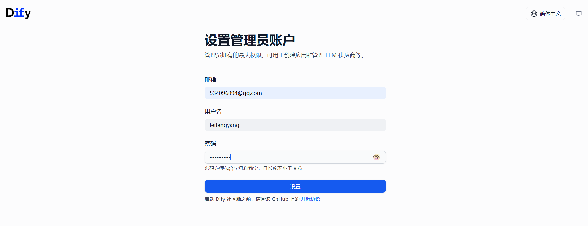

> # 配置 Dify
> 
> 要在未来完整使用Dify。需要系统内部使用的模型
> 
> 1. **系统推理模型**：用来进行对话、深度思考的；如DeepSeek
> 2. **Embedding模型**：用来做文本向量化（嵌入操作），RAG应用经常用到
> 3. **Rerank模型**：在RAG系统中，用来进行检索结果重排功能
> 4. **语音转文本**：将语音识别为文本，智能体常用的一种输入方式
> 5. **文本转语音**：将文本转为指定的语音，智能体常用的一种输出方式

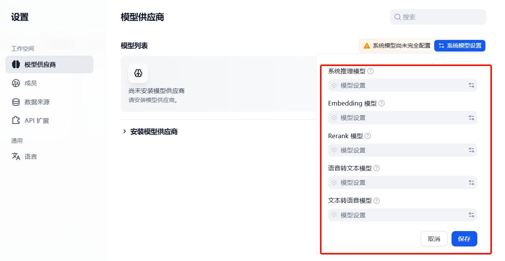

## 模型整合

### 云模型

**智谱AI**： https://open.bigmodel.cn 

**阿里云百炼**：https://bailian.console.aliyun.com/cn-beijing/?tab=model#/model-market

| 平台 | 访问门槛 | 技术能力 | 定价水平 | 免费额度 | 推荐场景 |
| --- | --- | --- | --- | --- | --- |
| **OpenAI GPT** | 需海外卡+手机） | 最强 | 贵 | ❌ | 生产环境（海外） |
| **Anthropic Claude** | 同 OpenAI） | 代码最强 | 贵 | ❌  | 代码生成、复杂推理 |
| **OpenRouter** | ✅ 低（国内可注册） | 聚合全部 | 中等 | 部分模型免费 | 学习测试、多模型对比 |
| **DeepSeek** | ✅ 极低（手机号注册） | 对齐 GPT-5 | 极低 | 无 | 学习、开发、小项目 |
| **阿里百炼** | ✅ 低（需实名认证） | 多模态强 | 中等 | 100万 Tokens | 企业应用、多模态 |
| **智谱 GLM** | ✅ 低（手机号注册） | 长文本强 | 低 | 2000万 Tokens | 知识推理、长文本 |

### 私有模型

> **本地跑大模型这事，工具选错了能折腾你一整天。常用三个工具**
> 
> **Ollama、Xinference、LocalAi**

#### **Ollama最省心**

> 安装使用三句话

```shell
# 下载安装Ollama
curl -fsSL https://ollama.com/install.sh | sh

# Ollama 下载模型
ollama pull qwen3.5:7b

# Ollama 运行模型，并开始对话
ollama run qwen3.5:7b
```

> OpenAI API兼容

```shell
from openai import OpenAI

# 调用 ollama 下载的大模型的推理功能
client = OpenAI(base_url='http://localhost:11434/v1', api_key='ollama')
```

> **串行模式**：并发弱。底层是llama.cpp，请求进来排队处理。
> 
> 假设同时来5个请求，后面的要等前面处理完，响应时间直接翻好几倍
> 
> 每个实例都要加载一份模型到显存。

> `4090 24G 显卡`。如下参考指标：
> 
> 1. Ollama 加载 qwen3.5:4b 模型。 占用 6764 MB 显存
> 2. Ollama 加载 qwen3.5:7b 模型。  占用 6852 MB 显存

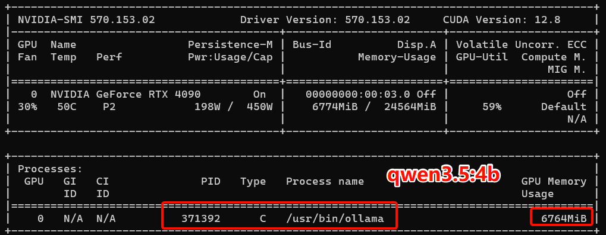

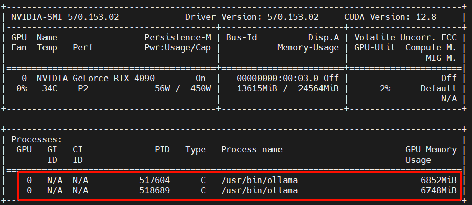

Ollama适合调用量不大的场景

#### **Xinference功能全**

> **通过官网可以发现。Xinference 支持所有类型模型的运行**

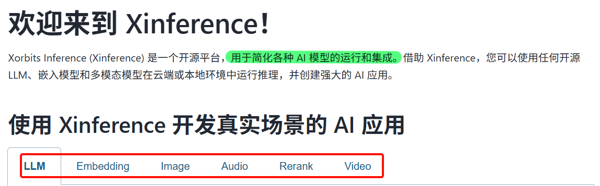

> 并发高。它支持 `vLLM`** **后端。vLLM提供 `continuous batching` 技术
> 
> 多个请求可以合并成一批处理，GPU利用率高很多：

> 资源占用比Ollama高。
> 
> Web界面和调度组件都要吃内存，小机器（8G 内存以下）可能撑不住。

#### **LocalAi 完美适配 OpenAI API**

```shell
docker run -p 8080:8080 --gpus all \
-v ./models:/models \
localai/localai:latest-gpu-nvidia-cuda-12
```

APl路径和OpenAl一模一样，

- `/v1/chat/completions`、
- `/v1/embeddings` 

现有代码改个base_url就能跑;

```python
#原来
client = OpenAI(api_key="sk-xxx")

#现在
client = OpenAI(base_url="http://localhost:8080/v1", api_key="none")


#下面的代码一行都不用改
response = client.chat.completions.create(
    model="qwen2-7b",
    messages=[{"role": "user", "content": "你好"}]
}
```

# GPU云服务器

## 开通GPU服务器

| 平台 | 实例 | 参考价格 | 特点 |
| --- | --- | --- | --- |
| [优云智算](https://passport.compshare.cn/register?referral_code=GmZoIcTZGzbG0k0S202Zov) | 4090/48G | 3.3 | 提供 A100、H20等高配卡 |
|   | 40系/24G | 1.66 |   |
| [仙宫云](https://www.xiangongyun.com/register/WAE8YM) | 4090/48G | 3.39 | 40系卡多 |
|   | 4090/24G | 1.89 |   |
| [AutoDL](https://www.autodl.com/) | 4090/24G | 1.98 | 有昇腾平台 |

## 容器与虚机

**容器实例**：就是启动的docker容器，不能在容器内继续安装docker，使用docker命令

- 优点：环境集成度高

**虚拟机实例**：仅提供基础操作系统镜像和基本驱动。环境都需要自己安装

- 优点：定制化程度高，练习场景推荐

> 开通**虚机实例**

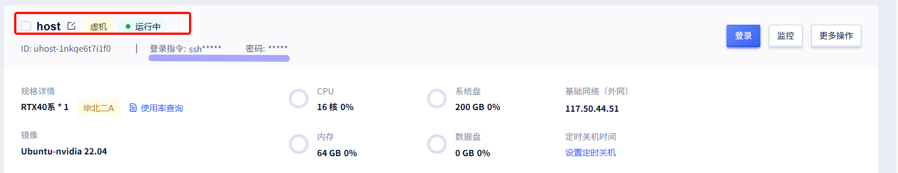

> 确认nvidia版本（显卡驱动信息）、CUDA版本信息

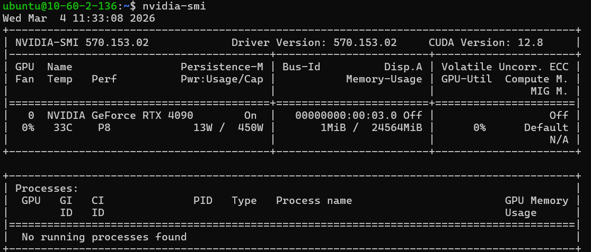

## 开通网络加速

以优云智算为例。进入控制台，先开启网络加速

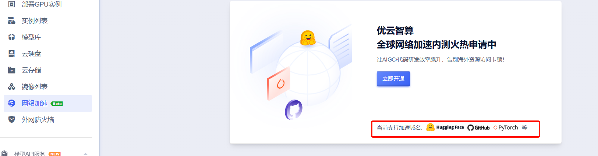

> 有效提升海外资源访问下载的网络稳定性和速度，解决大模型网站下载缓慢、Github访问卡顿丢包等问题。
> 
> **已支持加速域名：** *.**github.com**、*.nvidia.com、*.nvcr.io、*.docker.com、*.**golang.org**、*.googlesource.com、*.**pythonhosted.org**、*.pytorch.org、*.*civitai.com*、*.huggingface.co、*.*anaconda.org*、*.conda.io、*.*anaconda.com*、*.k8s.io、*.gcr.io、*.wandb.ai

容器实例已经开启自动加速。

虚拟机实例需要自行配置：https://www.compshare.cn/docs/operation/gpu/uaaa

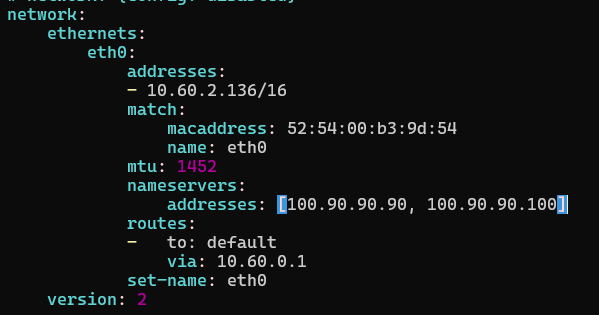

# 模型私有化部署

## 安装docker

```shell
# 移除旧版本
sudo apt remove $(dpkg --get-selections docker.io docker-compose docker-compose-v2 docker-doc podman-docker containerd runc | cut -f1)

# 设置docker源
# Add Docker's official GPG key:
sudo apt update
sudo apt install ca-certificates curl
sudo install -m 0755 -d /etc/apt/keyrings
sudo curl -fsSL https://download.docker.com/linux/ubuntu/gpg -o /etc/apt/keyrings/docker.asc
sudo chmod a+r /etc/apt/keyrings/docker.asc

# Add the repository to Apt sources:
sudo mkdir -p /etc/apt/sources.list.d
sudo tee /etc/apt/sources.list.d/docker.sources <<EOF
Types: deb
URIs: https://download.docker.com/linux/ubuntu
Suites: $(. /etc/os-release && echo "${UBUNTU_CODENAME:-$VERSION_CODENAME}")
Components: stable
Signed-By: /etc/apt/keyrings/docker.asc
EOF

sudo apt update

# 安装docker
sudo apt install docker-ce docker-ce-cli containerd.io docker-buildx-plugin docker-compose-plugin

# 验证版本
sudo docker info

# 验证docker服务
sudo systemctl status docker
```

> 验证docker是否在运行

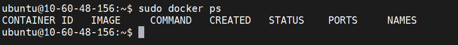

## 配置nvidia

### 安装nvidia-ctk

```shell
curl -fsSL https://nvidia.github.io/libnvidia-container/gpgkey \
    | sudo gpg --dearmor -o /usr/share/keyrings/nvidia-container-toolkit-keyring.gpg
```

```shell
curl -fsSL https://nvidia.github.io/libnvidia-container/stable/deb/nvidia-container-toolkit.list \
    | sed 's#deb https://#deb [signed-by=/usr/share/keyrings/nvidia-container-toolkit-keyring.gpg] https://#g' \
    | sudo tee /etc/apt/sources.list.d/nvidia-container-toolkit.list
```

```shell
sudo apt-get update

#安装nvidia ctk工具
sudo apt-get install -y nvidia-container-toolkit
```

### 配置docker使用nvidia驱动

```shell
sudo nvidia-ctk runtime configure --runtime=docker
sudo systemctl restart docker
```

> 最终效果，让docker发现 nvidia 显卡

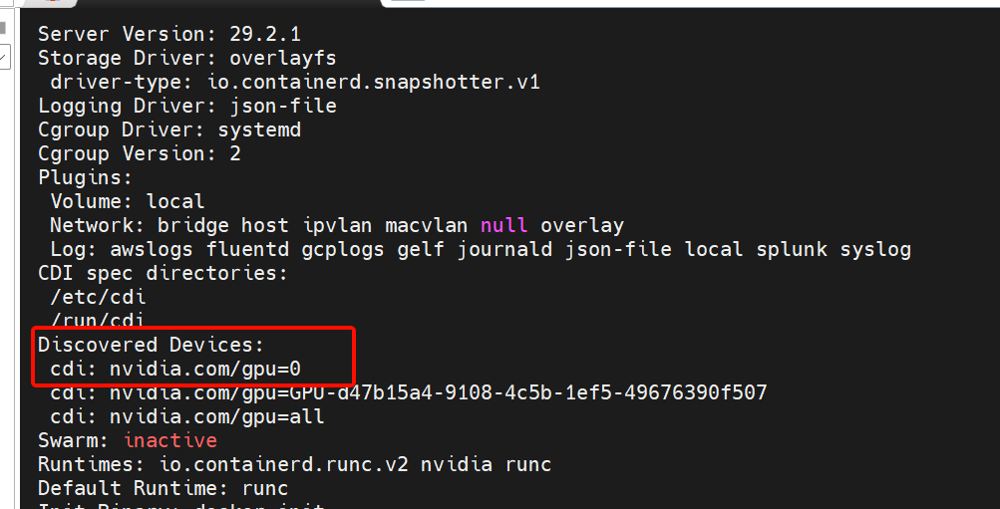

## 部署平台

### 部署Ollama

#### 安装

```shell
sudo docker run -d --gpus=all -v ~/ollama:/root/.ollama -p 11434:11434 --name ollama ollama/ollama
```

#### 配置防火墙

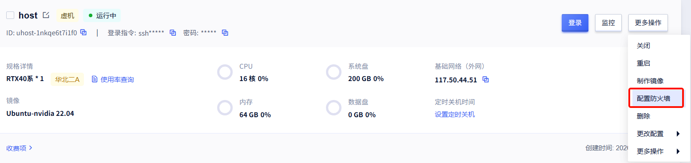

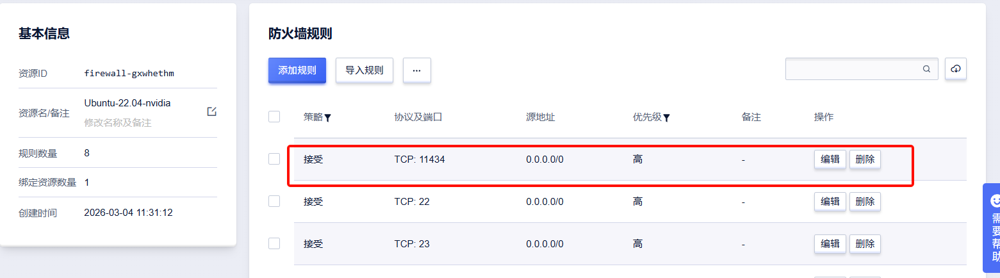

#### 验证运行

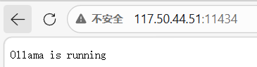

#### 下载模型

> Docker部署的ollama，需要进入到 ollama 容器中；执行模型下载操作

```shell
# 进入容器
sudo docker exec -it ollama bash

# 下载模型
ollama pull qwen3.5:4b
```

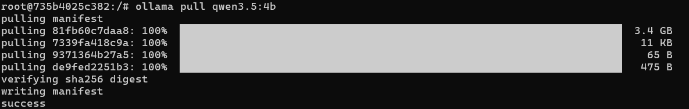

> 下面列举`ollama`常用命令

*📊 在线表格（无数据）*

#### Dify整合

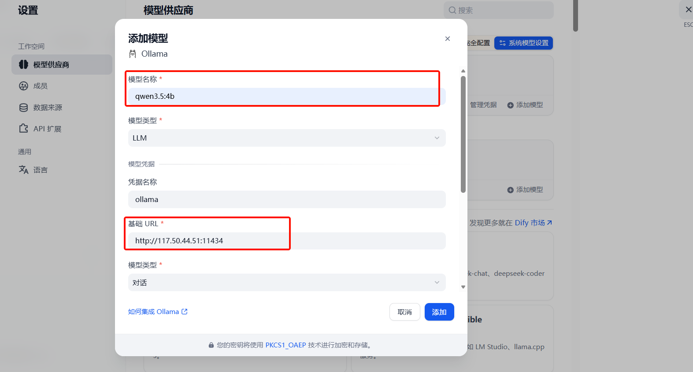

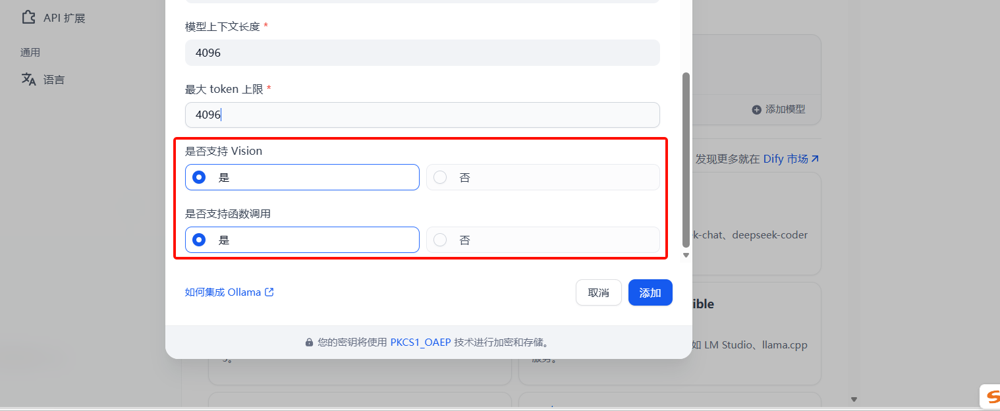

> 配置模型能力要参考Ollama官网对模型的说明

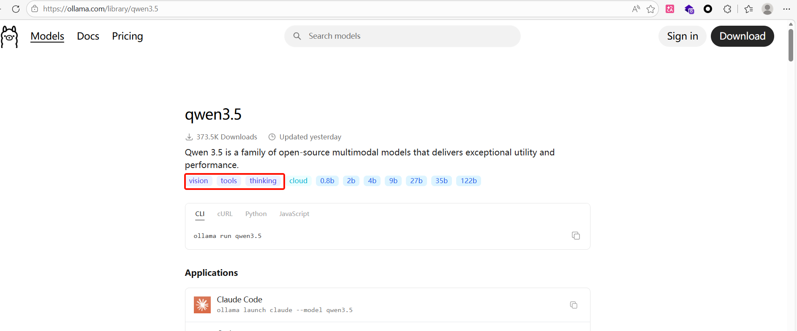

#### 查看显存占用

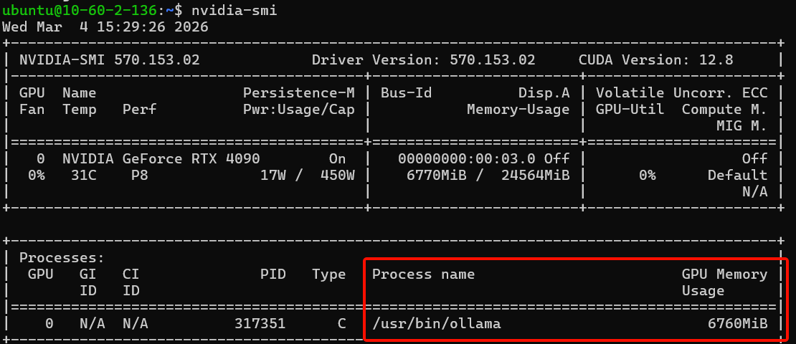

### 部署Xinference

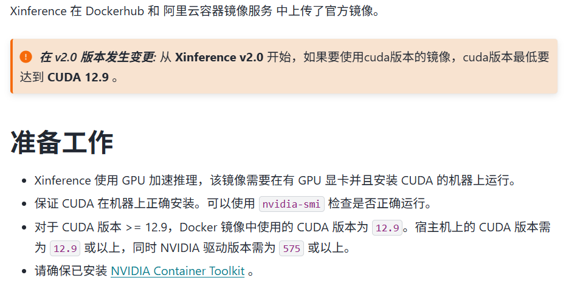

> 和代码应用的交互逻辑

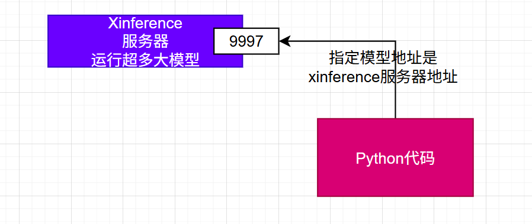

#### 安装

> 注意和自己机器的 cuda 版本进行匹配

```shell
sudo docker run -d \
-e XINFERENCE_MODEL_SRC=modelscope \
-v ~/.xinference:/root/.xinference \
-v ~/.cache/huggingface:/root/.cache/huggingface \
-v ~/.cache/modelscope:/root/.cache/modelscope \
-p 9997:9997 \
--gpus all \
xprobe/xinference:latest-cu128 \
xinference-local -H 0.0.0.0
```

`-e XINFERENCE_MODEL_SRC=modelscope`* # 国内优先选ModelScope，下载快*
**有 cuda版本后缀。比如 cu128。 没有就是cpu版本。**

#### 编程使用

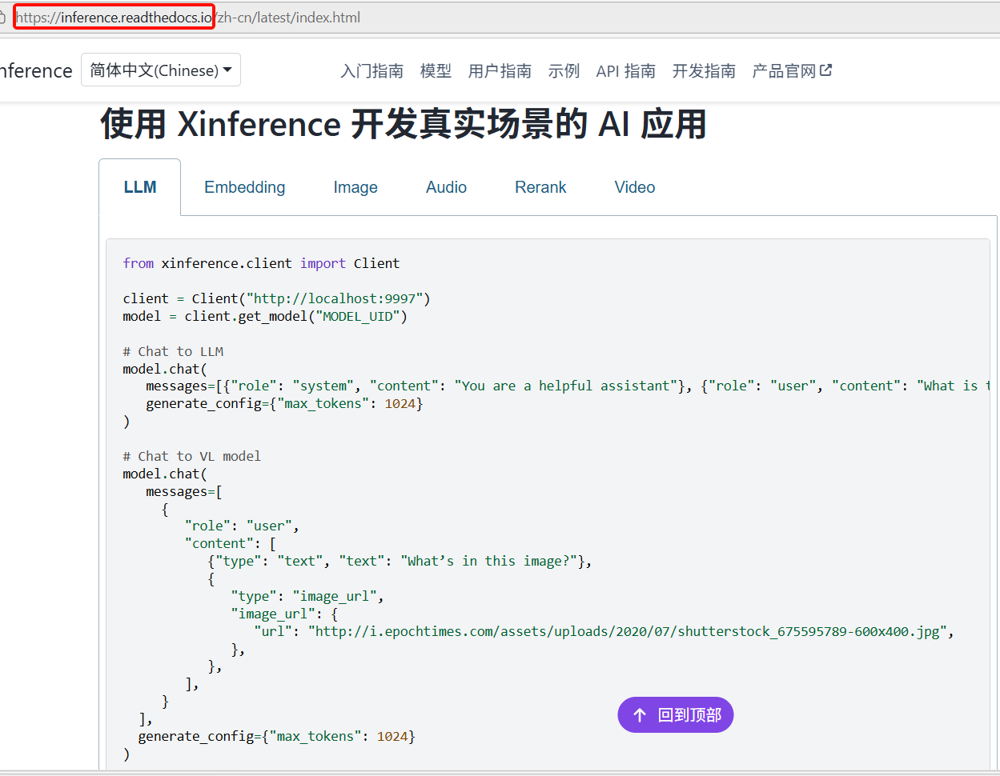

#### 启动模型

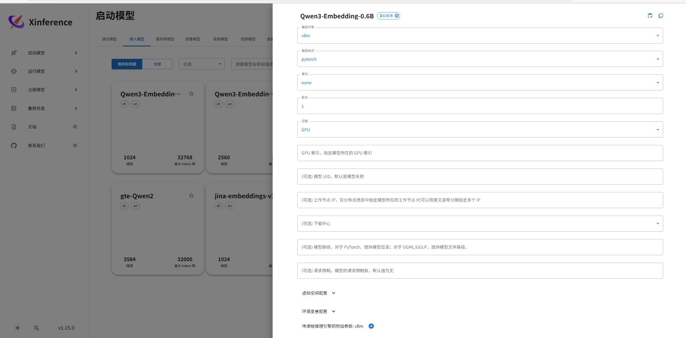

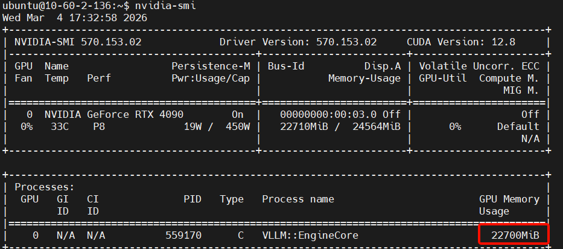

#### Dify整合

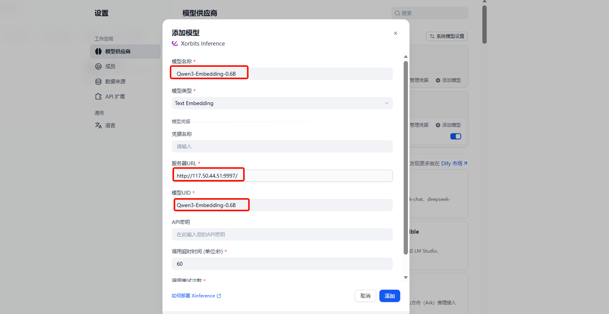

# Dify 实战

## 创建工作流

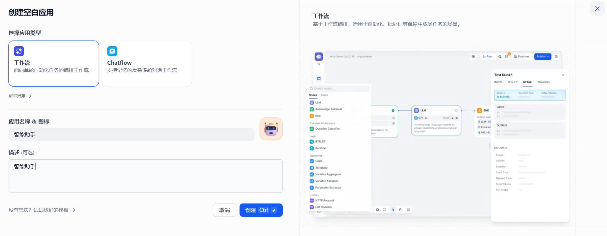

## 远程调用工作流

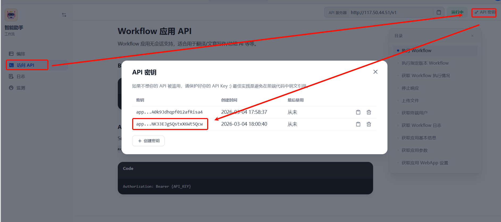