# 4. ComfyUI：开源AI视觉生成平台

> **ComfyUI**是一款**基于节点工作流**的**Stable Diffusion**图形界面工具，专注于提供高效、灵活的AI图像生成体验。它采用模块化设计，用户可通过**拖拽节点**构建复杂工作流，精准控制生成流程的每个环节（如模型加载、采样器配置、图像解码等），支持Stable Diffusion、ControlNet等模型的深度定制。

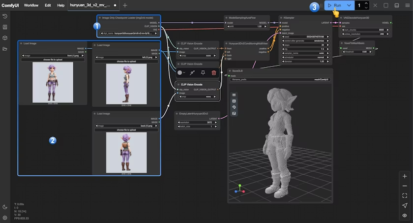

# 快速上手

## 安装

对于 `ComfyUI` 的安装， 主要分为几个步骤

1. 创建一个虚拟环境(避免污染系统级 Python 环境)
2. 克隆 `ComfyUI`代码仓库
3. 安装依赖
4. 启动 ComfyUI

```shell
conda create -n comfyenv
conda activate comfyenv

# 下载源码
git clone https://github.com/comfyanonymous/ComfyUI.git

# 安装依赖
cd ComfyUI
pip install -r requirements.txt

# 启动
cd ComfyUI
python main.py
```

> 本次实验，我们直接用云主机的容器镜像

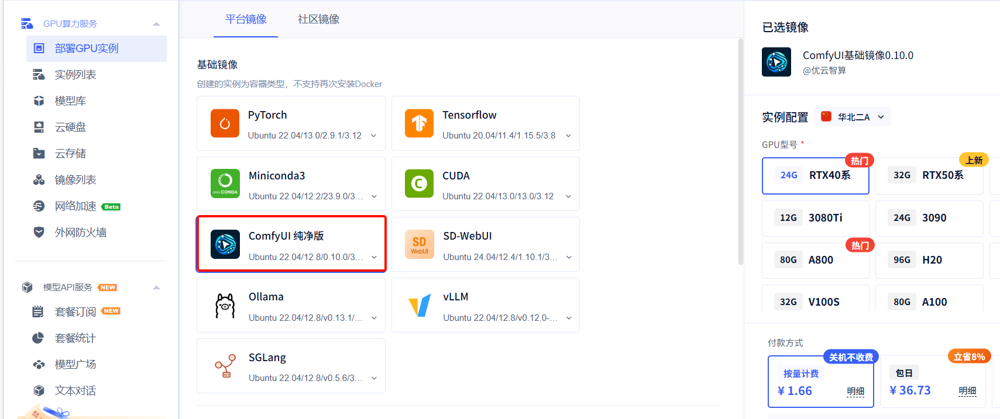

## 实验准备

```shell
#模型
cd ~/ComfyUI/models/checkpoints

# 下载模型； 局部重绘实验使用
wget https://huggingface.co/Comfy-Org/stable_diffusion_2.1_repackaged/resolve/main/512-inpainting-ema.safetensors


# vae
cd ~/ComfyUI/models/vae
wget https://huggingface.co/stabilityai/sd-vae-ft-mse-original/resolve/main/vae-ft-mse-840000-ema-pruned.safetensors?download=true


# 控制网络
cd ~/ComfyUI/models/controlnet

wget https://huggingface.co/comfyanonymous/ControlNet-v1-1_fp16_safetensors/resolve/main/control_v11p_sd15_scribble_fp16.safetensors?download=true


```

## 第一个案例：文生图

默认启动 `ComfyUI`，官方会展示第一个文生图案例；

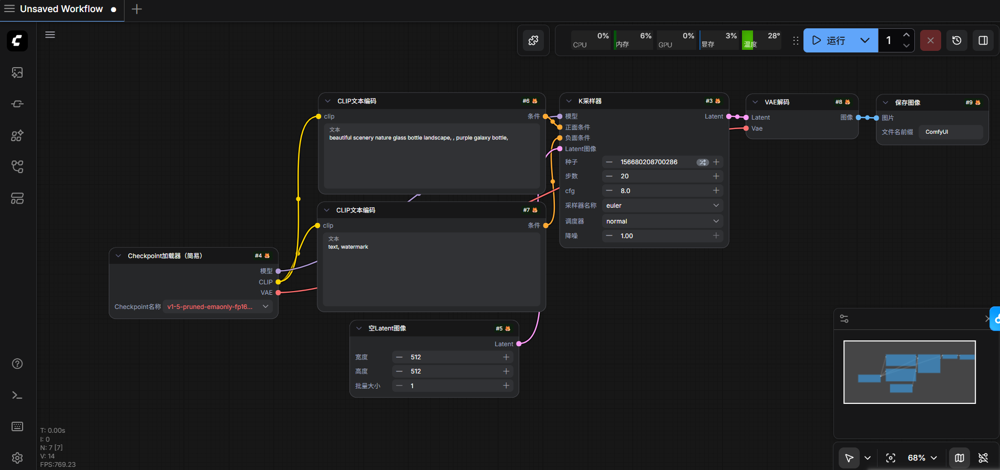

**配置好加载器，点击运行，查看效果**

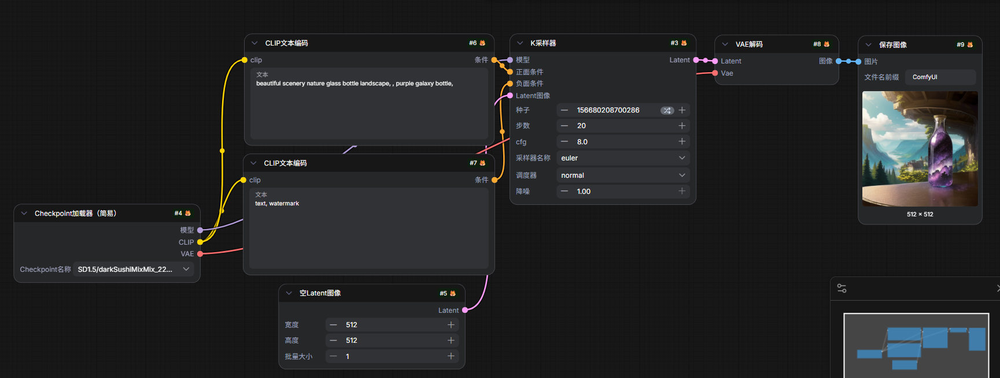

> 稍后我们讲解原理

## 界面

### 资产

展示已经生成过的资源

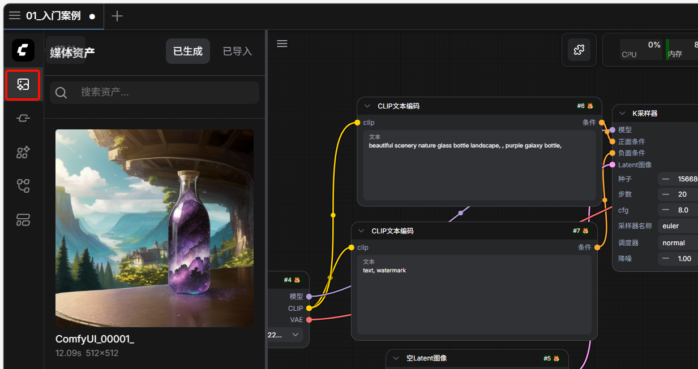

### 节点

右侧绘图区可以使用的节点内容。每个节点都具有不同的功能和配置

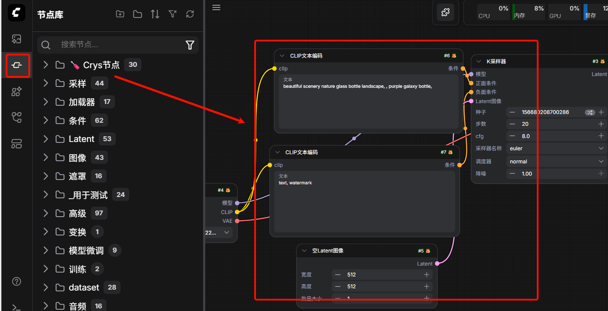

**节点构成**

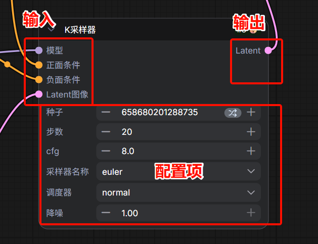

### 模型库

> 生图期间，需要用到的各种模型。模型库可以从第三方下载

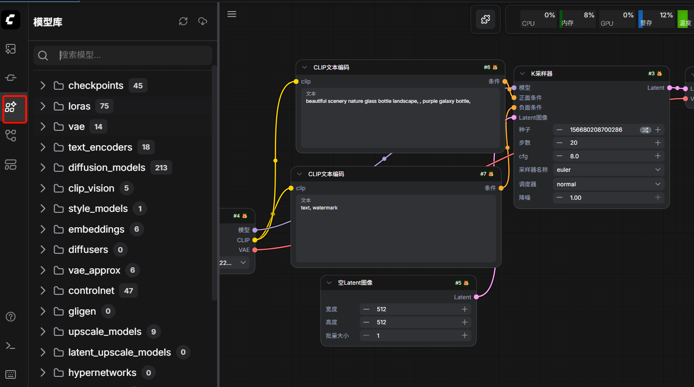

### 工作流

我们已经创建的各种工作流

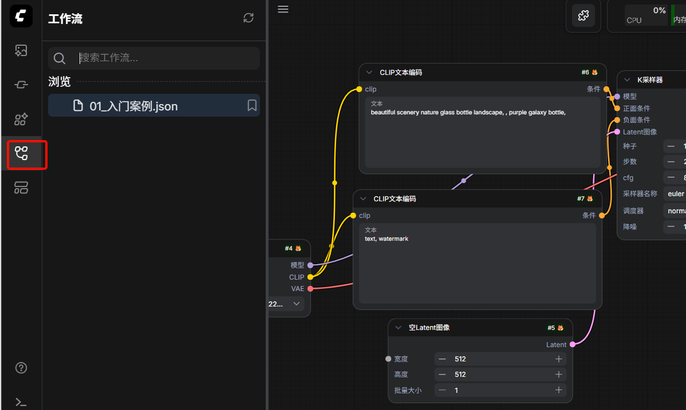

### 模板

市场提供的一些模板

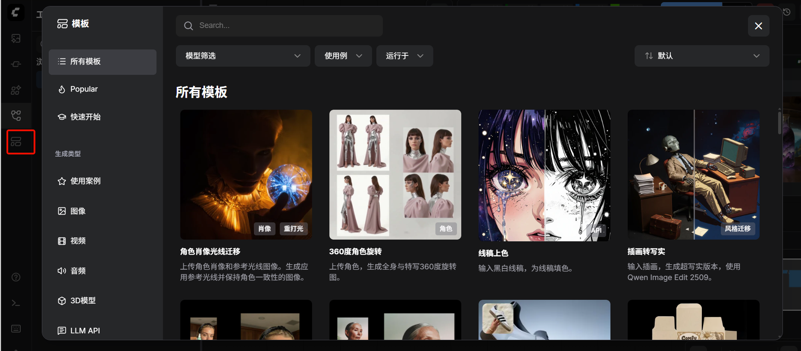

## 基本操作

用过 Coze、Dify 之类的产品，和他们的拖拽逻辑是一样的。都是连接节点。

1. **拖拽**：在空白区域，鼠标左键按住不动，此时可以拖拽显示工作流。
2. **双击**：鼠标左键双击空白区域，弹出一个节点搜索框，输入节点名称将会自动创建。
3. **Ctrl**：
  1. 按住ctrl拖动鼠标左键。**批量选择节点**
  2. 滑动滚轮，**放大缩小画布**
4. **Ctrl+Alt：**
  1. 点击线条连接点，删除连线

## 快捷键

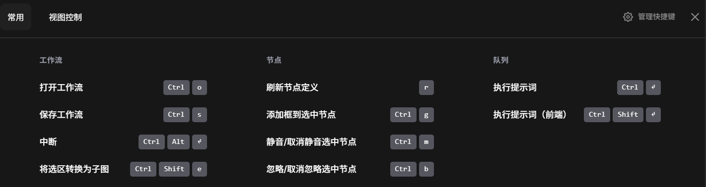

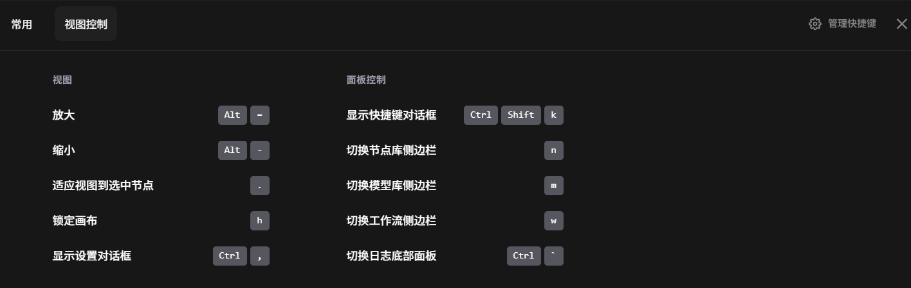

# 理解绘图原理

> **文生图（Text to Image）**，是 **AI 绘图**的基础，通过**输入文本描述来生成对应的图片**，是 AI 绘图最常用的功能之一，你可以理解成你把你的**绘图要求**(正向提示词、负向提示词)告诉一个**画家**(绘图模型)，画家会根据你的要求，画出你想要的内容

ComfyUI 文生图的核心原理是：**基于 Stable Diffusion 扩散模型，将完整生成流程拆解为可自由组合的节点，通过可视化工作流完成 “文本编码→潜空间去噪→图像解码” 的全链路计算**。

## 基本原理

ComfyUI 本身是**节点化 GUI 工具**，文生图的底层逻辑完全基于` Stable Diffusion（SD）的扩散模型`：

1. **正向扩散**：训练时，模型学习如何给清晰图像逐步加噪，直到变成纯噪声。
2. **反向去噪**：生成时，模型从纯噪声出发，在**潜空间（Latent Space）** 中逐步去噪，还原出符合文本描述的图像。
3. **生图模型三大核心组件**（由 Checkpoint 模型统一加载）：
  - **U-Net**：<u>去噪核心，负责预测每一步的噪声并移除。</u>
  - **CLIP**：<u>文本编码器，把提示词转为模型能理解的</u><u>**文本嵌入向量（Text Embedding）**</u><u>。</u>
  - **VAE**：图像编解码器，负责像素图 ↔ 潜空间向量的转换（大幅提升效率）。
    - 高清图在训练的时候，会逐步加燥，VAE编码成为噪声图像
    - 生图的时候，逐步去噪，VAE解码成高清图像 
  - 配合流程
    - U-Net：是生图模型用来去噪
    - CLIP：对文本编码
    - VAE：对图像进行编解码的

## 流程原理

### DDPM

去噪扩展概率模型（Denoising Diffusion Probabilistic Models）

https://arxiv.org/pdf/2006.11239

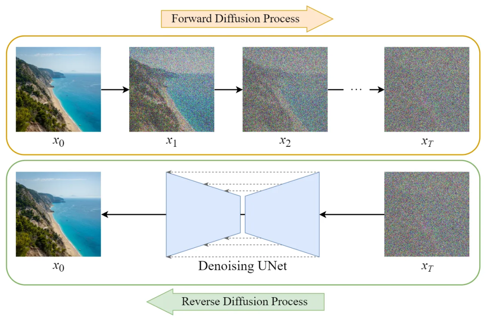

> DDPM 做两件事：
> 
> 1. **正向扩散**：把一张清晰图 → 一点点加噪声 → 最后变成纯噪声
> 2. **反向去噪**：从纯噪声出发 → 一点点去掉噪声 → 还原成清晰图
> 
> **文生图 = 训练好的模型，直接走 “反向去噪” 这条路。**

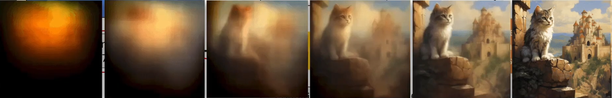

### CLIP

对比学习`文本 - 图像`预训练：Contrastive Language-Image Pre-training

https://arxiv.org/pdf/2103.00020

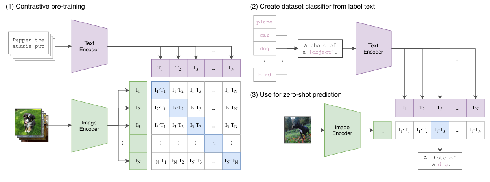

它就是把**文字和图片**映射到同一个特征空间，让模型能看懂 “文字描述对应什么图”。

> **提示词技巧**： **质量词汇** + **主体词汇** + **氛围词汇**
> 
> 如：（**高质量**, **极致细节）**, （**一个女孩**, **双马尾**,**蓝色校服）**,   （**教室背景**, **动漫风格）**

### VAE

**VAE** = **Variational Autoencoder**（变分自编码器）

> **把大图 ↔ 小潜向量（Latent）互相转换**
> 
> - **编码（Encode）**：图片 → 小向量（压缩）
> - **解码（Decode）**：小向量 → 图片（解压）
> 
> **作用：**让模型不用在超大像素图上计算，**省显存、跑得快**。
> 
> - **原始图片像素空间非常大（每张图几十万甚至上百万像素）。**
> - **模型直接在这么大空间中计算会非常耗资源。**

- 不同 VAE 有不同的训练过程，色彩、对比度、细节表现会有差异。
- 有的 VAE 解码更“锐利”，细节更丰富；有的色彩更准确；还有的为特定模型微调过。
- 在 ComfyUI 里，你可以用 **Load VAE** 节点加载自己喜欢的 VAE文件（.vae.safetensors / .pt），替换默认的模型内置 VAE。

### K采样器

#### 种子

- **种子**可以理解为每一张图片的身份证号码，无论是通过什么样的方式来生成图像，都会有一个种子编号，这就是**图像的唯一标识**。
- 如果我们**想要生成与上一次生成的图像完全一致的新图像**，那么我们就需要当前设置内的所有参数和种子号码与**之前一致**，种子的影响是所有参数中影响最大的。
- 如果你想重复对同一张图片看一下各参数对这张图片的影响，那请一定要固定种子的ID。

种子还有一个配套的选项，那就是`control_after_generate`参数。

#### 种子控制

`control_after_generate`翻译成中文就是`运行后操作`，也就是你每执行一次图片生成之后，种子参数要产生什么样的变化。

如果按照顺序来翻译，是以下这几种情况。

1. **固定**：无论怎么操作，种子都是不变的。
2. **增加**：每次生成图片之后，在之前的种子数值基础上加1。
3. **减少**：每次生成图片之后，在之前的种子数值基础上减1。
4. **随机**：不固定的随机生成一个种子ID。

#### 步数

> 简而言之，你可以理解为要把这道菜在微波炉里面热多久？时间越长越好，但也可能会糊，所以需要自行尝试。专业点来讲，就是指在**生成每张图像时，应该绘制扩散多少次计算**。一般来说数值在**20-50**次之间即可。

- 采样步骤与采样方法息息相关，每次采样相当于对原始图像（噪声）进行了一次去噪。
- 最初的DDPM采样步数需要上千步才能获得高质量的图片，其消耗的算力和时间成本不可接受。在牺牲准确和多样性的情况下，我们选用了效率更高的采样方式**DDIM**，获得高质量的图片只需要**50到100**步。后来如**DPM++ 2M**之类的采样算法更是将采样步骤缩进至**20步**，**UniPC**更是只需要**10步**左右就能获取高质量的图片，与之带来的是采样的时间和算力消耗大幅下降，同样的时间内同样的设备能生成出的作品能够更多。
- 各种采样器生成出来的图片差距还是比较大的，请自行权衡。

下面是在同一个采样器模式下，不同步数的多样性绘制次结果比图表。我们可以清晰看每一步的变化过程，在第8步的时候就已经基本能看了，40步之后就显得不太真实了，过度绘制。

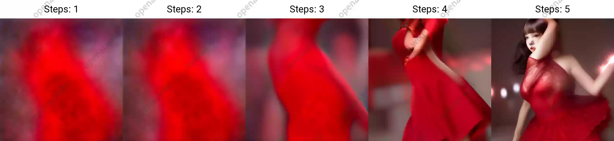


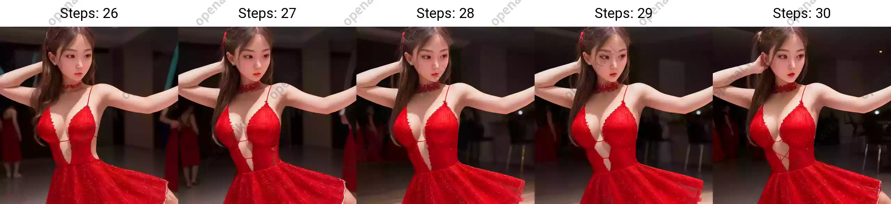

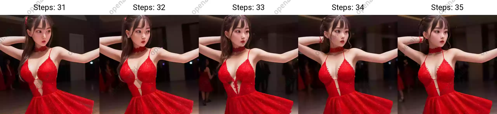

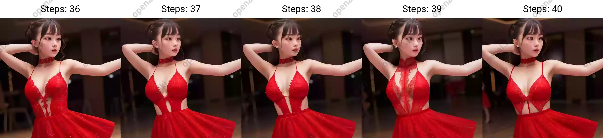

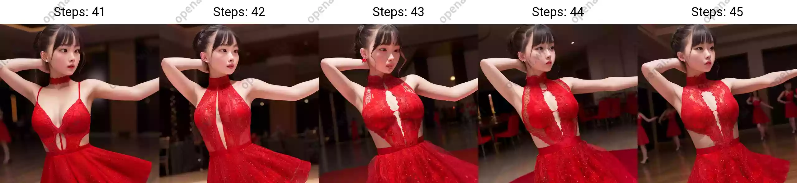


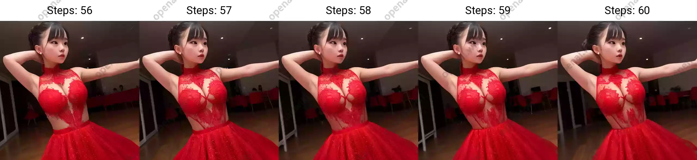

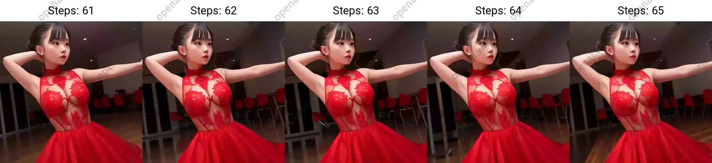


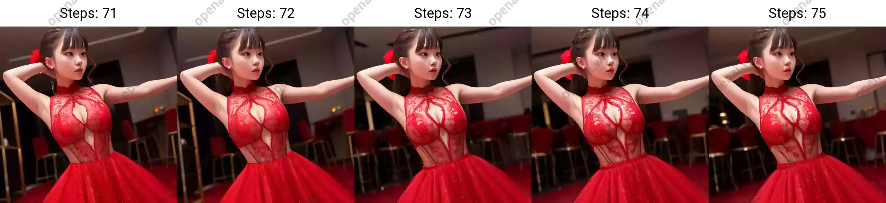


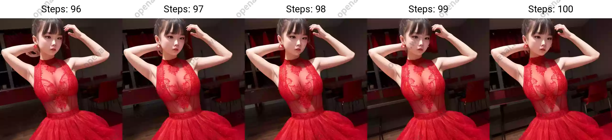

#### CFG

> **Classifier-Free Guidance (CFG)** 是一种“**提示词引导强度**”技术，用于控制模型生成结果受 Prompt（提示词）影响的程度。CFG参数是指对Prompt提示词的权重影响，指定AI自由发挥的程度是多少。

- CFG的**数值越大**，则越按提示词引导生成的权重越大，**AI自由发挥程度越小**。
- CFG的**数值越小**，则越按提示词引导生成的权重越小，**AI自由发挥程度越大**。

通常认为CFG的数值选为`7-10`是一个非常平衡的区间，既有创意也有能遵循我们的文本提示：

- CFG处于2-6时会创意力（不可控性）提高。
- CFG处于10-15时，你的作品受到你的提示的良性影响。
- CFG处于16-20时，你得确定你的提示真的是你想要的，否则效果不会太好。
- CFG高于20时，可能会产生一些奇怪的现象。


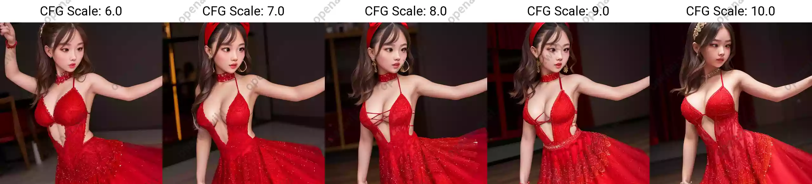


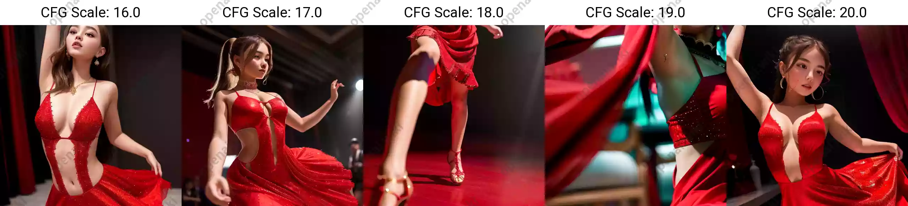


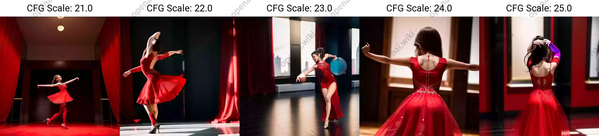


#### 采样器名称

| 名称 | 描述 |
| --- | --- |
| Euler | 基于Karras论文，在K-diffusion实现，20-30steps就能生成效果不错的图片，采样器设置页面中的sigma noise、sigma tmin和sigma churn这三个属性会影响到它（后面会提这三个参数的作用）； |
| Euler a | 使用了祖先采样（Ancestral sampling）的Euler方法，受采样器设置中的eta参数影响（后面详细介绍eta）； |
| LMS | 线性多步调度器（Linear multistep scheduler）源于K-diffusion的项目实现； |
| heun | 基于Karras论文，在K-diffusion实现，受采样器设置页面中的 sigma参数影响； |
| DPM2 | 这个是Katherine Crowson在K-diffusion项目中自创的，灵感来源Karras论文中的DPM-Solver-2和算法2，受采样器设置页面中的 sigma参数影响； |
| DPM2 a | 使用了祖先采样（Ancestral sampling）的DPM2方法，受采样器设置中的ETA参数影响； |
| DPM++ 2S a | 在K-diffusion实现的2阶单步并使用了祖先采样（Ancestral sampling）的方法，受采样器设置中的eta参数影响；Cheng Lu的github中也提供已经实现的代码，并且可以自定义，1、2、3阶，和单步多步的选择，webui使用的是K-diffusion中已经固定好的版本。对细节感兴趣的小伙伴可以参考Cheng Lu的github和原论文。 |
| DPM++ 2M | 基于Cheng Lu等人的论文（改进后的版本），在K-diffusion实现的2阶多步采样方法，在Hagging face中Diffusers中被称作已知最强调度器，在速度和质量的平衡最好。这个代表M的多步比上面的S单步在采样时会参考更多步，而非当前步，所以能提供更好的质量。但也更复杂。 |
| DPM++ SDE | DPM++的SDE版本，即随机微分方程（stochastic differential equations），而DPM++原本是ODE的求解器即常微分方程（ordinary differential equations），在K-diffusion实现的版本，代码中调用了祖先采样（Ancestral sampling）方法，所以受采样器设置中的ETA参数影响； |
| DPM fast | 在K-diffusion实现的固定步长采样方法，用于steps小于20的情况，受采样器设置中的ETA参数影响； |
| DPM adaptive | 基于Cheng Lu等人的论文，在K-diffusion实现的自适应步长采样方法，DPM-Solver-12 和 23，受采样器设置中的ETA参数影响； |
| Karras后缀 | LMS Karras 基于Karras论文，运用了相关Karras的noise schedule的方法，可以算作是LMS使用Karras noise schedule的版本； |
|   | DPM2 Karras，DPM2 a Karras，DPM++ 2S a Karras，DPM++ 2M Karras，DPM++ SDE Karras这些含有Karras名字的采样方法和上面LMS Karras意思相同，都是相当于使用Karras noise schedule的版本； |
| DDIM | “官方采样器”随latent diffusion的最初repository一起出现， 基于Jiaming Song等人的论文，也是目前最容易被当作对比对象的采样方法，它在采样器设置界面有自己的ETA； |
| PLMS | 同样是元老，随latent diffusion的最初repository一起出现； |
| UniPC | 最新被添加到webui中的采样器，应该是目前最快最新的采样方法，10步就可以生成高质量结果；在采样器设置界面可以自定义的参数目前也比较多。 |

以下是任何设置全部都相同的情况下，仅更改采样器得到的对比结果图，以及所用的各项参数预设如下

A girl, dancing, red dress,best quality, ultra-detailed, masterpiece, finely detail, highres, 8k wallpaper
**Negative prompt**: lowres, bad anatomy, bad hands, text, error, missing fingers, extra digit, fewer digits, cropped, worst quality, low quality, normal quality, jpeg artifacts, signature, watermark, username, blurry


Steps: 20, Sampler: DPM++ 2S a Karras, CFG scale: 7, Seed: 3657492522, Size: 512x512, Model hash: 7234b76e42, Model: chilloutmix_Ni


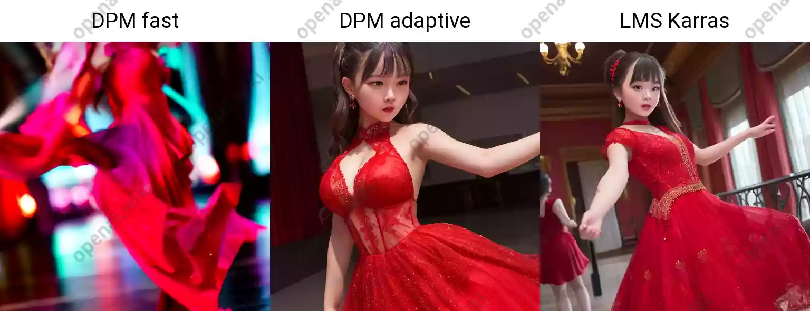


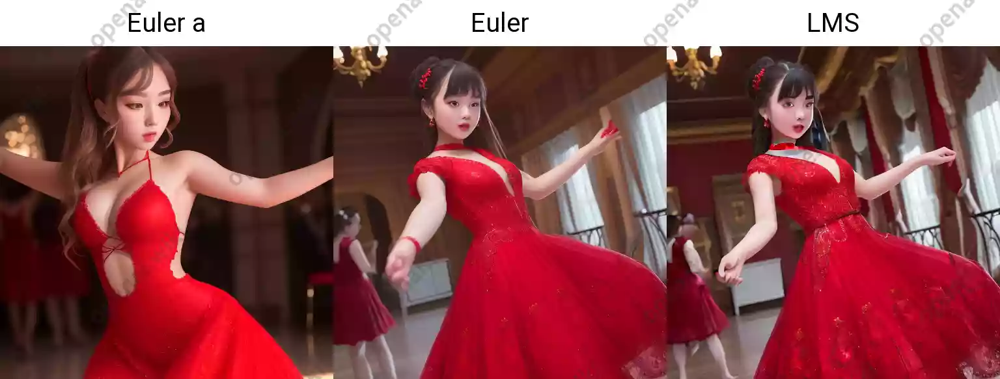

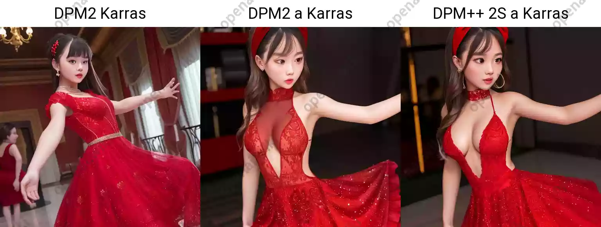

#### 调度器

在 ComfUI 的 **K采样器（K-Sampler）** 中，**调度器（Scheduler）** 是一个关键参数，主要用于控制 **扩散模型（如 Stable Diffusion）生成图像时的去噪过程**。它的核心功能是决定 **如何调整噪声水平（或步长）** 随时间（或迭代步骤）的变化方式，从而影响生成**图像的质量、细节和速度**。

1. **噪声衰减策略**：
  - 扩散模型通过逐步去除噪声生成图像。调度器定义了每一步的噪声减少幅度（如从高噪声到低噪声的变化节奏）。
  - 例如，线性调度器可能均匀减少噪声，而其他调度器可能在早期大幅降噪、后期微调细节。
2. **速度与质量的平衡**：
  - **激进型调度器**（如 `DDIM`）：用较少的步骤完成生成，可能牺牲部分细节，适合快速生成。
  - **保守型调度器**（如 `Karras`）：用更多步骤精细调整，生成质量更高但耗时更长。
3. **稳定性和收敛性**：
  - 某些调度器能避免采样过程中的数值不稳定问题（如梯度爆炸），确保生成过程平稳。
4. **控制生成多样性**：
  - 不同调度器可能影响结果的随机性。例如，`Euler` 调度器确定性较强，而 `DPM++` 系列可能引入更多变化。

**常见调度器类型举例：**

- **线性调度器**（Linear）：噪声均匀减少，简单但可能不够高效。
- **Karras 调度器**：根据论文设计，在迭代后期减小步长，提升细节。
- **DDIM**：基于确定性过程，适合快速生成。
- **DPM-Solver**：针对扩散模型优化，平衡速度与质量。
- **Euler、Heun**：经典数值方法，前者快，后者更精确。

**实际使用建议：**

- **追求速度**：选择 `DDIM` 或 `Euler`，减少采样步数（如 20 步）。
- **追求质量**：使用 `DPM++ 2M Karras` 或 `UniPC`，增加步数（如 30-50 步）。
- **实验调整**：不同调度器对提示词（prompt）的响应可能不同，需结合具体场景测试。

通过调整调度器，用户可以灵活控制生成过程的效率与效果，是优化图像生成的重要参数之一。

#### 降噪

在图像生成模型（如 Stable Diffusion 的扩散过程）中，降噪是一个关键控制参数，它直接影响生成过程中噪声的去除程度和图像生成的**自由度**。以下是它的核心作用：

1. **控制噪声去除的强度**：
  - 扩散模型通过逐步去除初始噪声（或输入图像的噪声）来生成图像。降噪参数决定了**每一步去噪的强度**，即模型在每一步多大程度上“信任”预测的去噪结果。
  - **值越高**：去噪越激进，生成的图像与初始噪声（或输入）的关联性越低，**自由度更高**，但可能导致细节丢失或结构失真。
  - **值越低**：去噪更保守，生成的图像会更接近初始噪声（或输入），**保留更多原始信息**，但可能残留噪声或缺乏创意性变化。
2. **平衡“生成自由度”与“稳定性”**：
  - 当降噪参数接近 `1.0` 时，模型几乎完全重新生成内容（适合完全从头创作）。
  - 当降噪参数接近 `0` 时，模型严格遵循输入内容（适合微调或修复现有图像）。
3. **影响图像生成的“可控性”**：
  - 在 **图生图（img2img）** 任务中，降噪参数决定了输入图像对生成结果的约束力：
    - **低值（如 0.2-0.5）**：输出与输入高度相似，适合局部修复或风格迁移。
    - **高值（如 0.7-1.0）**：输出可能完全脱离输入，生成全新内容。

---

**实际应用场景**

1. **文生图（text2img）**：
  - 降噪参数通常固定为 `1.0`（完全自由生成），模型从纯噪声开始逐步生成图像。
2. **图生图（img2img）**：
  - **修复/增强图像**：降噪参数设为 `0.3-0.6`，模型在保留原图结构的基础上优化细节。
  - **风格迁移/重绘**：设为 `0.5-0.8`，在保留大致构图的同时改变风格或内容。
  - **完全重新生成**：设为 `0.8-1.0`，忽略原图内容，仅根据提示词生成新图像。
3. **ControlNet 等控制工具**：
  - 降噪参数与 ControlNet 的权重配合，控制生成结果在遵循输入条件（如边缘、姿态）和自由发挥之间的平衡。

---

**与其他参数的关系**

- **采样步数（Steps）**：
  - 降噪参数高时，可能需要更多采样步数来保证生成稳定性。
- **提示词权重（Prompt Strength）**：
  - 高降噪参数下，提示词对生成结果的影响更显著。
- **调度器（Scheduler）**：
  - 不同调度器的噪声衰减策略会影响降噪参数的效果（例如，Karras 调度器可能在后期微调时更敏感）。

---

**调参建议**

- **默认值**：图生图任务通常从 `0.75` 开始尝试。
- **低噪图像修复**：设为 `0.3-0.5`，避免过度修改原图。
- **创意性生成**：设为 `0.7-0.95`，结合高权重提示词。
- **避免极端值**：
  - 高于 `1.0`：可能导致图像崩坏。
  - 低于 `0.2`：可能无法有效去噪，生成模糊或残留噪声。

---

**示例**

- 输入一张模糊的风景照片，设置降噪参数为 `0.4`：模型会轻微锐化细节，保留原图构图。
- 同一张照片，降噪参数设为 `0.8`：可能将风景彻底重绘为动漫风格，甚至改变季节或时间。

降噪参数本质是控制生成过程的“创造力阀门”，需根据任务目标（修复、重构、创新）动态调整。

### 节点流程原理

#### （1）模型加载：CheckpointLoader / CheckpointLoaderSimple

- 输入：选择 `.safetensors` / `.ckpt` 模型文件。
- 输出：**MODEL（U-Net）、CLIP、VAE** 三个核心组件。
- 原理：<u>加载预训练权重，初始化生成引擎</u>。

#### （2）文本编码：CLIP Text Encode（正 / 负各一个）

- 输入：正向提示词（想要的内容）、负向提示词（不想要的内容）。
- 输出：**文本嵌入向量（Conditioning）**。
- 原理：CLIP 将自然语言转为高维向量，作为 U-Net 去噪的 “方向指引”。

#### （3）初始潜空间：Empty Latent Image

- 输入：图像宽高、批次数量。
- 输出：**随机噪声潜向量（Latent）**。
- 原理：在潜空间生成 “空白画布”（尺寸远小于像素图，如 512×512 像素 → 64×64 潜向量）。

#### （4）核心去噪：KSampler（最关键节点）

- 输入：
  - MODEL（U-Net）、正 / 负 Conditioning、初始 Latent。
  - 参数：采样方法（如 DPM++ 2M Karras）、步数（20–50）、CFG Scale（提示词强度）、种子（Seed）。
- 输出：**去噪后的潜图像（Latent）**。
- 原理：
  1. 以随机噪声为起点。
  2. 每一步：U-Net 预测噪声 → 减去噪声 → 向文本描述方向优化。
  3. 重复 N 步，直到噪声基本消除，得到符合提示的潜图像。

#### （5）图像解码：VAEDecode

- 输入：去噪后的 Latent。
- 输出：**RGB 像素图像**。
- 原理：VAE 将潜空间向量还原为人类可见的像素图。

#### （6）结果保存：SaveImage

- 输入：解码后的图像。
- 输出：本地保存的 PNG 文件。

### 步骤总结

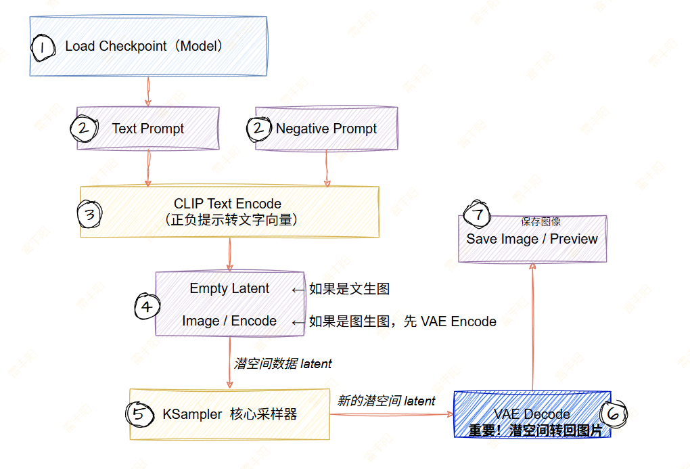

# 基础案例

## 图生图

> 图生图（Image to Image）是 ComfyUI 中的一种工作流，它允许用户将一张图像作为输入，并生成一张新的图像。

图生图可以使用在以下场景中：

- 原始图像风格的转换，如把写实照片转为艺术风格
- 将线稿图像转换为写实图像
- 图像的修复
- 老照片着色
- … 等其它场景

用一个比喻来讲解的话，大概是这样： 你需要画家根据你的参考图片，画出符合你要求特定效果的作品。

> # **实战**
> 
> **提示词：高质量, 极致细节, 一个女孩,双马尾,教室背景,动漫风格**

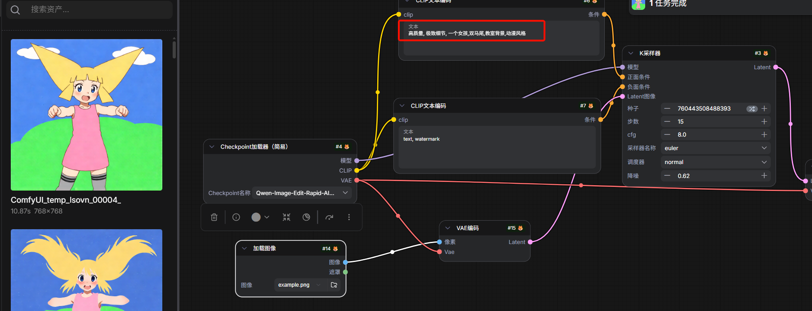

**输入图**

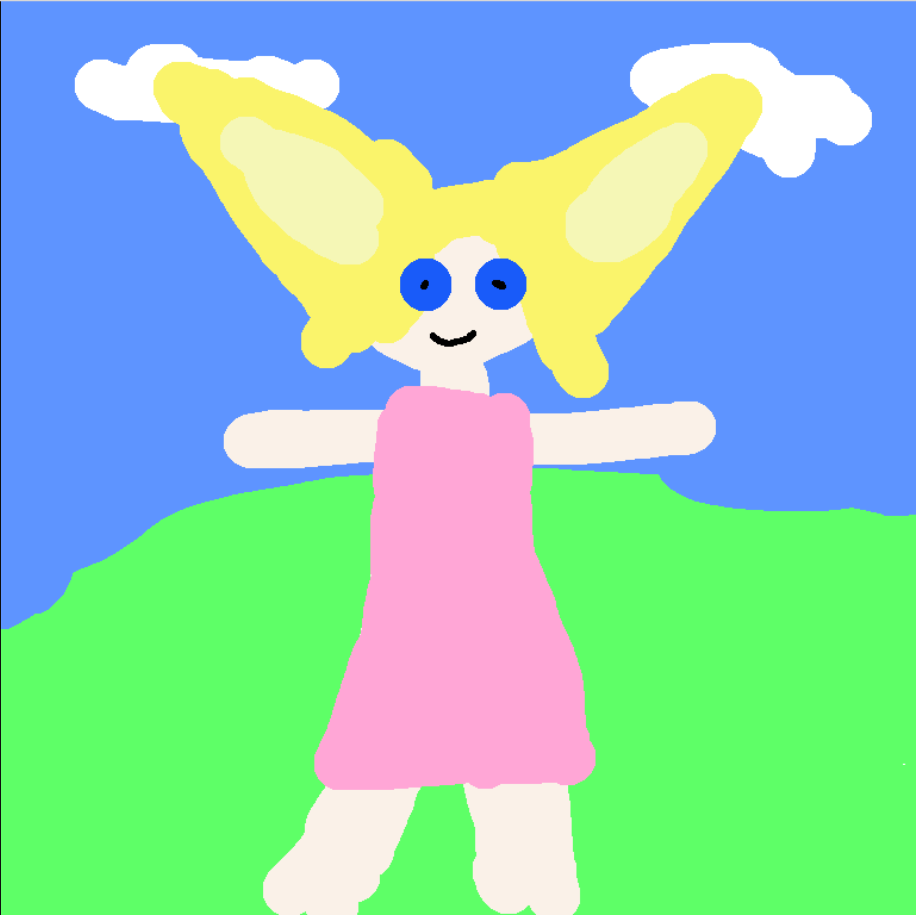

**输出图**

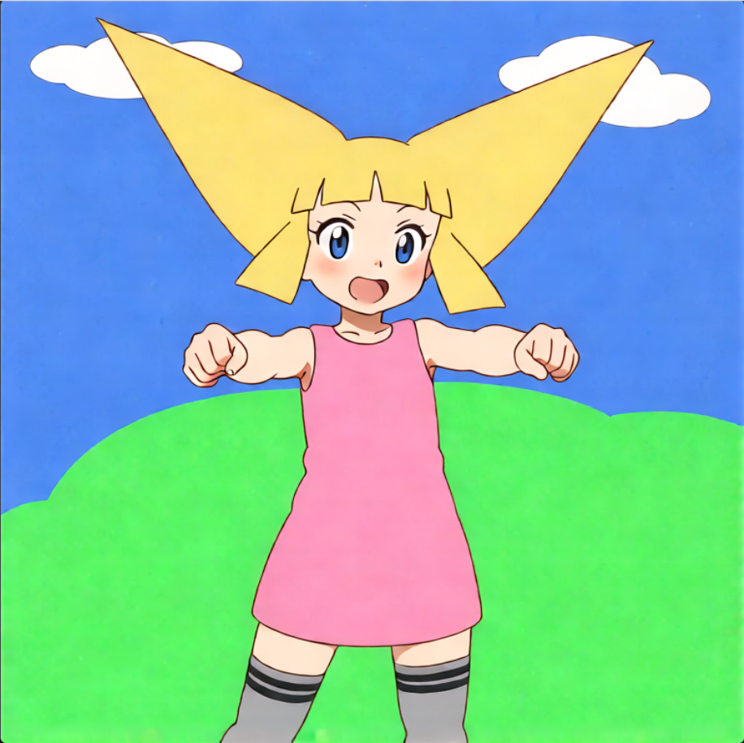

## 局部重绘

> 在 AI 图像生成过程中，我们常会遇到生成的画面整体较为满意，但是画面中存在一些不希望出现或者错误的元素，但是重新生成可能会生成另外一张完全不同的图片，所以这时候利用局部重绘来修复这部分的元素就非常有必要了。

这就像让 **画家(AI 绘图模型) **画了一幅画，但是总是会有稍微有 局部区域需要调整，我们需要向画家说明需要调整的区域(遮罩)，然后让画家会根据我们的要求进行 **重新绘制(重绘)**。局部重绘的场景包括：

- **瑕疵修复**： 消除照片中多余物体、错误的AI生成的画面的肢体等
- **细节优化**： 精准调整局部元素（如修改服装纹理、调整面部表情）
- 等其它场景

### 模型安装

下载下面的模型文件，并保存到`ComfyUI/models/checkpoints`目录下

- [512-inpainting-ema.safetensors](https://huggingface.co/Comfy-Org/stable_diffusion_2.1_repackaged/resolve/main/512-inpainting-ema.safetensors)

### 工作流

#### 核心节点

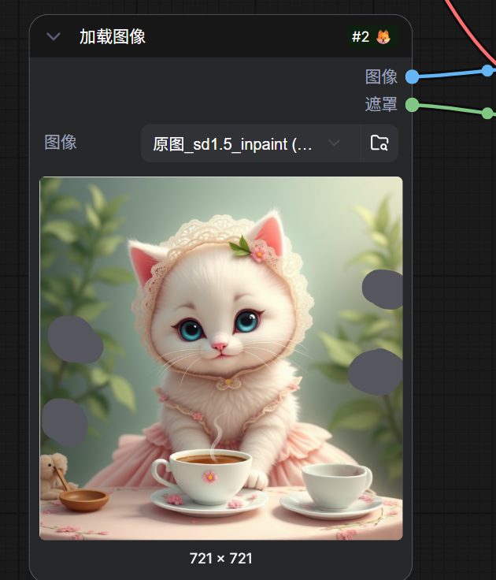

图像点击右键，使用遮罩编辑器打开

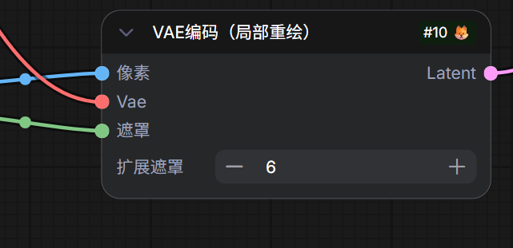

#### 完整流程

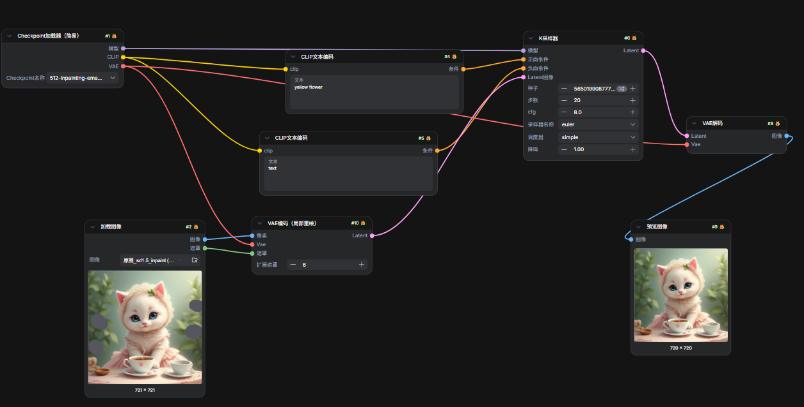

### 设置项

| 参数名称 | 作用 |
| --- | --- |
| pixels | 需要编码到潜空间的输入图像。 |
| vae | 用于将图片从像素空间编码到潜在空间的 VAE 模型。 |
| mask | 图片遮罩，用来具体指明哪个区域需要进行修改。 |
| grow_mask_by | 在原有的遮罩基础上，向外扩展的像素值，保证在遮罩区域外围有一定的过度区域，避免重绘区域与原图存在生硬的过渡。 |

# ControlNet

> 在 AI 图像生成过程中，要精确控制图像生成并不是一键容易的事情，通常需要通过许多次的图像生成才可能生成满意的图像，但随着 ControlNet 的出现，这个问题得到了很好的解决。
> 
> ControlNet 是一种基于扩散模型（如 Stable Diffusion）的条件控制生成模型，最早由[Lvmin Zhang](https://lllyasviel.github.io/)与 Maneesh Agrawala 等人于 2023 年提出[Adding Conditional Control to Text-to-Image Diffusion Models](https://arxiv.org/abs/2302.05543)

## 基本概念

在没有 ControlNet 之前，我们每次只能让模型生成图像，直到生成我们满意的图像，充满了随机性。

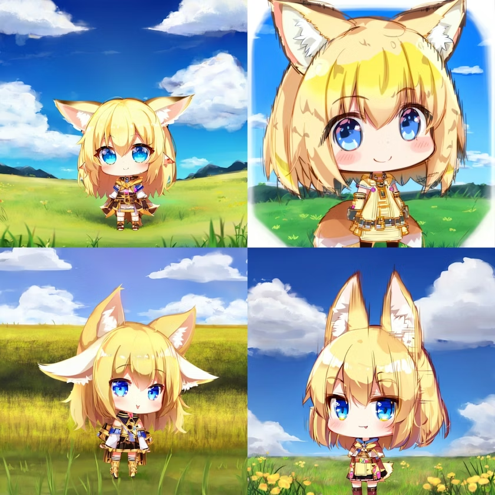

但随着 ControlNet 的出现，我们可以通过引入额外的条件，来控制图像的生成，比如我们可以使用一张简单的涂鸦，来控制图像的生成，就可以生成差不多类似的图片。

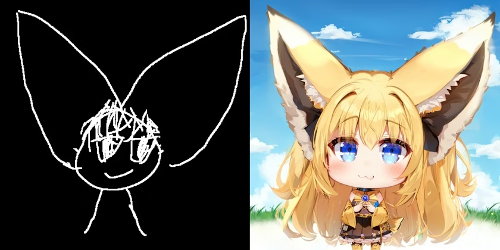

## 工作流

### 安装模型

- [dreamCreationVirtual3DECommerce_v10.safetensors](https://civitai.com/api/download/models/731340?type=Model&format=SafeTensor&size=full&fp=fp16)
- [vae-ft-mse-840000-ema-pruned.safetensors](https://huggingface.co/stabilityai/sd-vae-ft-mse-original/resolve/main/vae-ft-mse-840000-ema-pruned.safetensors?download=true)
- [control_v11p_sd15_scribble_fp16.safetensors](https://huggingface.co/comfyanonymous/ControlNet-v1-1_fp16_safetensors/resolve/main/control_v11p_sd15_scribble_fp16.safetensors?download=true)

```shell
ComfyUI/
├── models/
│   ├── checkpoints/
│   │   └── dreamCreationVirtual3DECommerce_v10.safetensors
│   ├── vae/
│   │   └── vae-ft-mse-840000-ema-pruned.safetensors
│   └── controlnet/
│       └── control_v11p_sd15_scribble_fp16.safetensors
```

### 重要节点

#### Load ControlNet 节点讲解

位于`ComfyUI\models\controlnet` 的模型会被 ComfyUI 检测到，并在这个节点中识别并加载

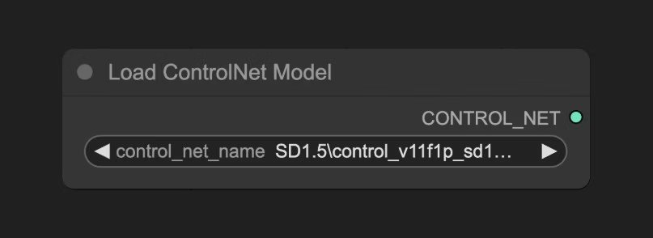

#### Apply ControlNet 节点讲解

这个节点接受 `load controlnet` 加载的 ControlNet 模型，并根据输入的图片，生成对应的控制条件。

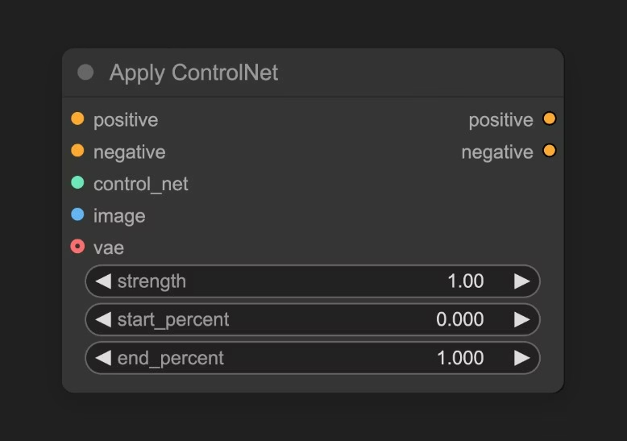

**输入类型**

| 参数名称 | 作用 |
| --- | --- |
| positive | 正向条件 |
| negative | 负向条件 |
| control_net | 要应用的controlNet模型 |
| image | 用于 controlNet 应用参考的预处理器处理图片 |
| vae | Vae模型输入 |
| strength | 应用 ControlNet 的强度，越大则 ControlNet 对生成图像的影响越大 |
| start_percent | 确定开始应用controlNet的百分比，比如取值0.2，意味着ControlNet的引导将在扩散过程完成20%时开始影响图像生成 |
| end_percent | 确定结束应用controlNet的百分比，比如取值0.8，意味着ControlNet的引导将在扩散过程完成80%时停止影响图像生成 |

**输出类型**

| 参数名称 | 作用 |
| --- | --- |
| positive | 应用了 ControlNet 处理后的正向条件数据 |
| negative | 应用了 ControlNet 处理后的负向条件数据 |

### 完整流程

提示词：正向

```shell
Masterpiece,best quality,high definition,high level of detail,3D,3D style,cute Q-version,Chibi,a vibrant product photo created for innovative advertising,featuring a little boy with black hair and a big laugh,Solo,holding a wooden crate,wooden crate,pasture,blue sky,white clouds,brick paved path,with pleasant houses in the background,chimneys,big trees,maple leaves,maple trees,and a lot of wheat,wheat,wheat ears along the roadside,The atmosphere of autumn,yellow grass and leaves,fallen leaves,fences,barriers,orange and yellow colors,autumn,windows,doors,gravel roads,captured using a Sony Alpha A7R IV camera with a 35mm f/1.4 lens,aperture set to f/2.8,shutter speed of 1/100 second,
```

提示词：负面

```shell
(hands), text, error, cropped, (worst quality:1.2), (low quality:1.2), normal quality, (jpeg artifacts:1.3), signature, watermark, username, blurry, artist name, monochrome, sketch, censorship, censor, (copyright:1.2), extra legs, (forehead mark) (depth of field) (emotionless) (penis)
```

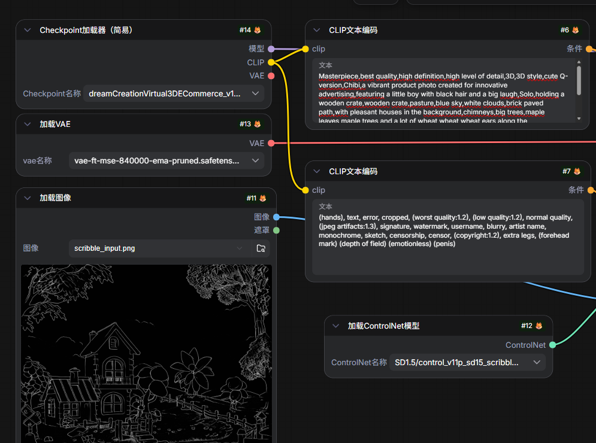

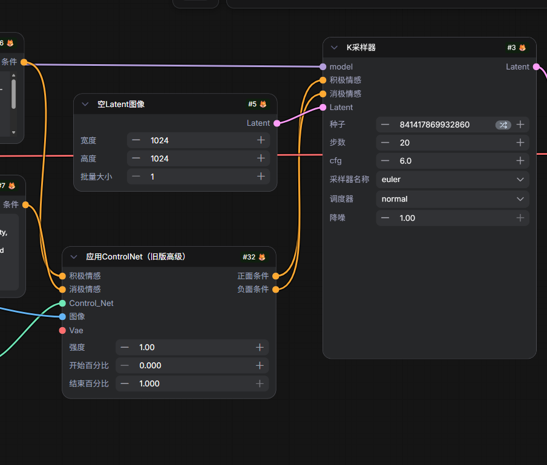

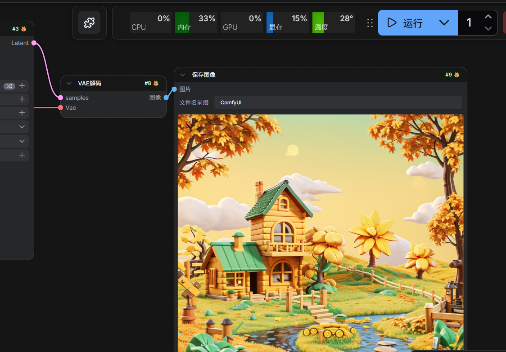

# 商业模型案例体验

## 千问Image系列：图像生成

https://qwenimages.com/zh

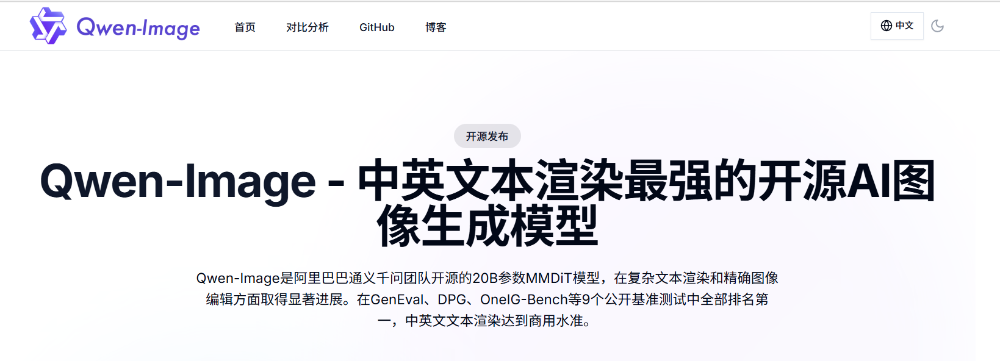

模型体验：https://www.compshare.cn/images/F95JNFKQGxDB?referral_code=GmZoIcTZGzbG0k0S202Zov

## 万相系列：视频生成

> Wan2.2 是**阿里巴巴通义万相**实验室推出的**开源视频生成模型**系列，它通过创新的 **MoE**（混合专家）架构和电影级美学控制，让生成高质量视频变得更加高效和灵活。

| 模型名称 | 核心功能 | 输入规格 | 输出规格（典型） | 适用场景与备注 |
| --- | --- | --- | --- | --- |
| Wan2.2-T2V-A14B | 文生视频 | 文本（≤512词） | 5秒，720P，30fps | 从文字描述直接生成视频，适合创意视觉化。 |
| Wan2.2-I2V-A14B | 图生视频 | 图像（≤1280x720） | 5秒，720P，30fps | 为静态图片添加动态效果。 |
| Wan2.2-TI2V-5B | 文/图生视频 | 文本和/或图像 | 5秒，704P，24fps | 消费级显卡可部署（约需22GB显存），灵活性高。 |
| Wan2.2-S2V-14B | 语音驱动视频 | 静态图片 + 音频 | 分钟级，720P | 生成数字人视频，支持长时长输出。 |
| Wan2.2-Animate-14B | 角色动画/替换 | 静态图片 + 参考视频 | 720P | 让图片角色模仿参考视频的动作与表情，适合角色动画创作。 |

模型体验：

1. https://www.compshare.cn/images/LnDwULYepeRG?referral_code=GmZoIcTZGzbG0k0S202Zov
2. https://www.compshare.cn/images/fAOWf2F3HhbG?referral_code=GmZoIcTZGzbG0k0S202Zov

## IndexTTS-2：语音生成

> **文本到语音（Text to Speech, TTS）**。
> 
> - Text To Speech：按照文本合成人类讲话的
> - Text To Audio：按照文本生成音乐
> 
> **技术点：**
> 
> - 基于深度学习的多情感语音合成模型，例如 **VITS、FastSpeech2、Tacotron2**。
> - 可结合 **语音风格控制（prosody control）**，实现语速、情绪切换（愉快、兴奋、平静等）。
> - 若有定制声线需求，可用 **声纹克隆（Voice Cloning）** 技术，如基于 **Speaker Encoder + Synthesizer + Vocoder** 三阶段模型。
> - IndexTTS2

**模型体验**：https://www.compshare.cn/images/mbu1nCYVfl9E?referral_code=GmZoIcTZGzbG0k0S202Zov