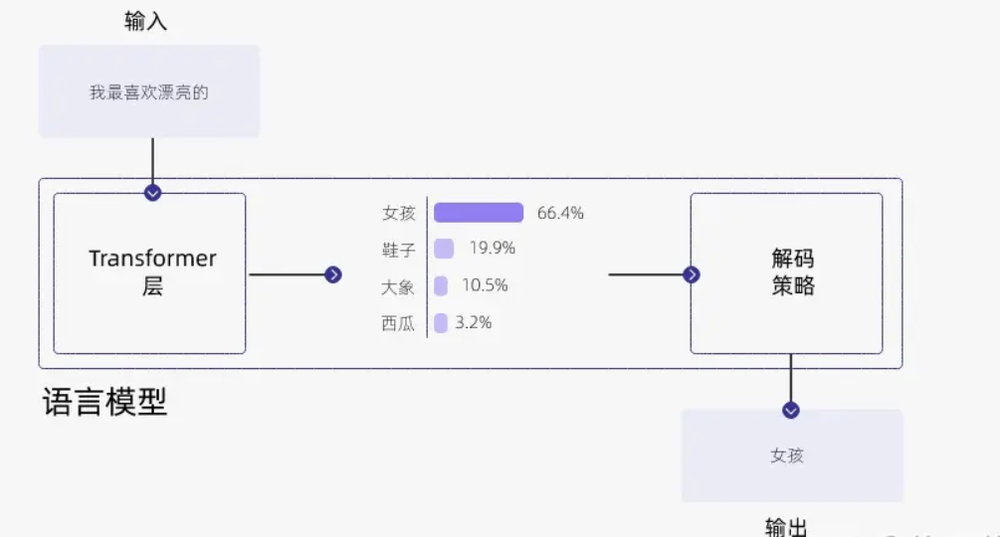
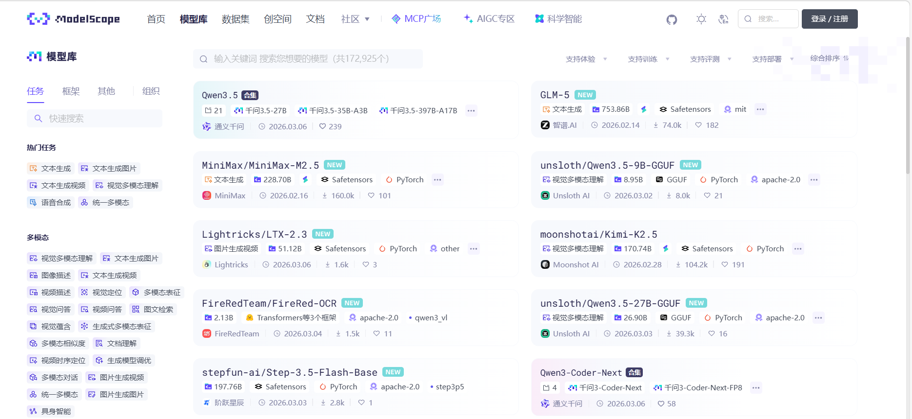
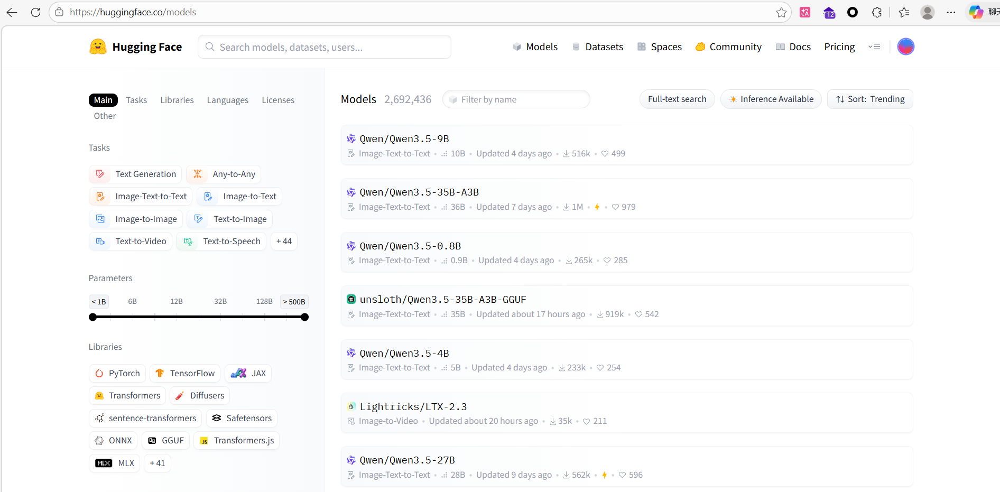
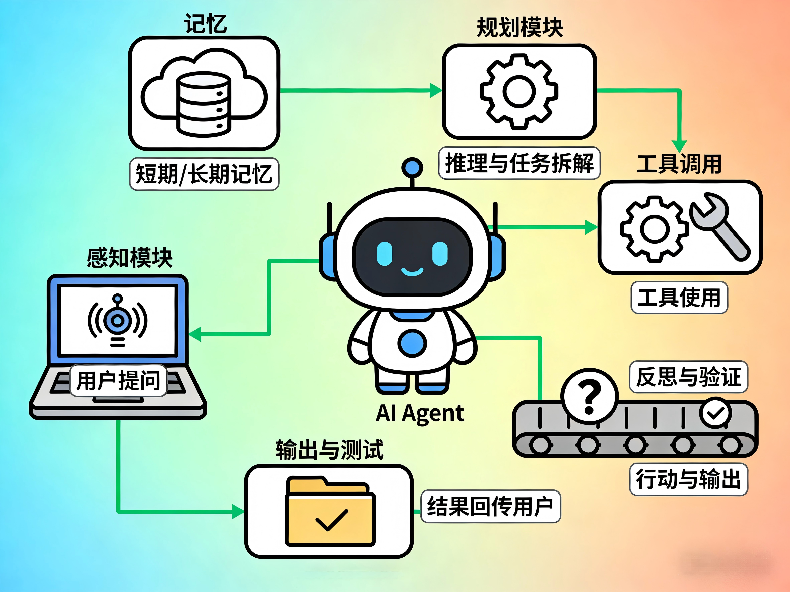
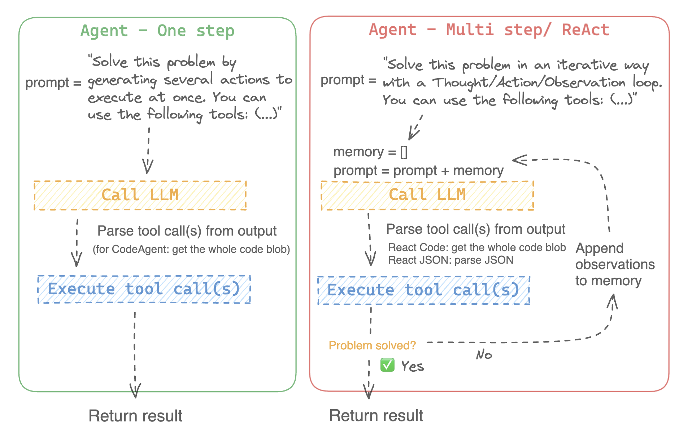
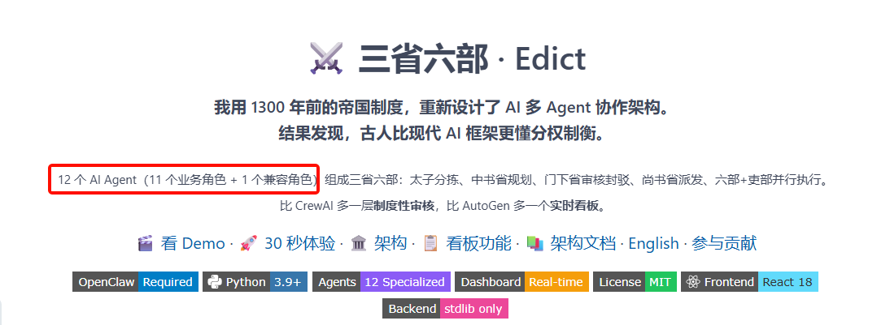
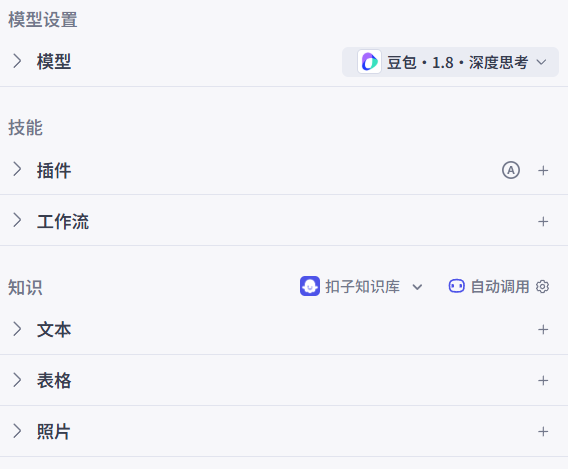
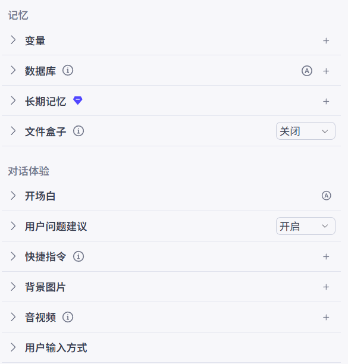
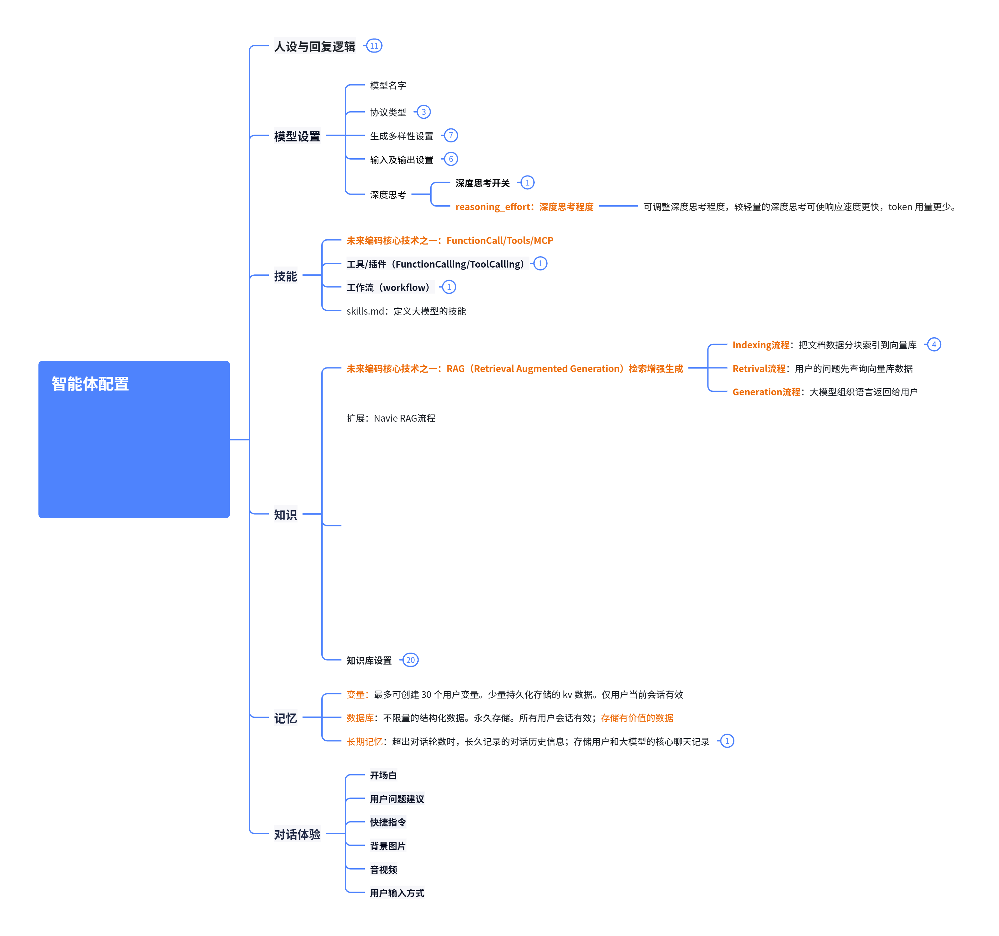
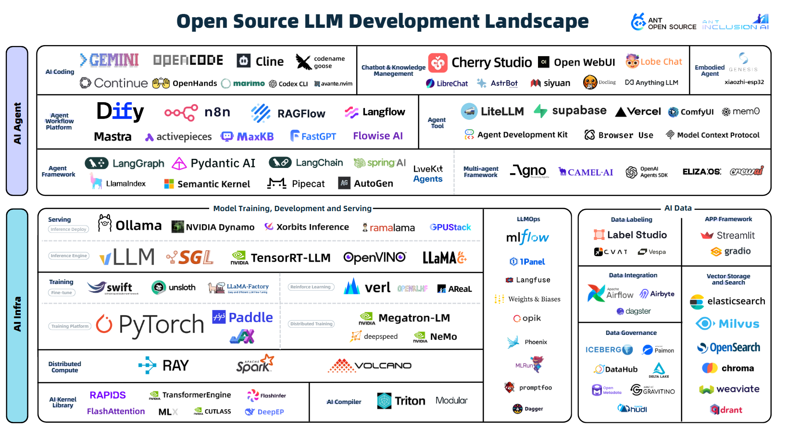

# 5. AIGC模块-总复习

> # AIGC周的所有内容我们就结束了。
> 
> > 实际上如果要仔细研究AIGC，还可以再继续做更多的案例进行测试。
> 
> ## 作为程序员
> 
> AIGC系列对我们的启发，是了解大模型在商业领域工作的全貌

# 大模型到智能体

## 大模型

技术的升级，让计算机理解了人类语言，让大模型有了思维能力

### 对比传统软件/数据库

> - **传统软件**：基于确定性规则（如 if-else 逻辑），无法处理开放性问题。**顺序、分支、循环**
> - **数据库/搜索引擎**：数据是显式存储的，查询时是直接检索；而大模型的知识是隐式编码在参数中的。
> - **大模型**：**通过概率分布建模**，在不确定的情况下仍然能生成合理的答案。
> 
> <u>大模型本质就是跟我们在玩概率游戏。</u>

### 泛化与推理能力

大模型不仅能记忆，还能在未见过的数据上进行**泛化**，这说明它具备了一定的抽象能力：

- 通过训练数据学习了语言模式，使得它能在新的场景下应用这些模式。
- 但它的**推理能力仍然是基于概率和模式**，而非严格的逻辑推理。
- 预测下一个

### 本质

训练完成的大模型本质上是一个**超大规模**、**参数化**的、**概率驱动**的**函数**，它通过高维分布式表示学习，对语言和知识进行**模式匹配**，并**利用统计推断来生成****最可能的输出**。它既不是简单的记忆体，也不是完美的逻辑推理机，而是一个**强大的语言模式****拟合器（找最符合你想要的数据）**。



### 开源模型下载

两个常用位置：

**国内【模搭】**：https://www.modelscope.cn/



**国际【HuggingFace】**：https://huggingface.co/



### 模型权重

浏览器模型所有文件：https://www.modelscope.cn/models/Qwen/Qwen3.5-9B/files

| 文件名 | 大小（约） | 作用说明 | 备注 |
| --- | --- | --- | --- |
| .gitattributes | 2.5 KB | Git 仓库配置文件，定义哪些文件要被 LFS（Large File Storage）管理，以及文本行尾格式等 | 与模型本身无关，只影响版本管理 |
| chat_template.jinja | 7.7 KB | 模型对话模板（Jinja2 模板文件），定义对话时系统提示词、用户输入、助手输出的格式 | 决定推理阶段上下文格式，用于遵循 Qwen 的对话规范 |
| config.json | 3.1 KB | 模型的主要配置文件，描述 Transformer 架构参数（层数、维度、隐藏单元数、注意力头数等） | 加载模型权重时由框架（如 Transformers）解析 |
| configuration.json | 51 B | 一般是模型初始化或部署时的额外环境配置，如系统标识或版本号 | 较简单的元数据文件 |
| LICENSE | 11.3 KB | 模型使用许可协议，如 Apache 2.0 或 Alibaba License 等 | 决定模型使用与再分发权限 |
| merges.txt | 3.3 MB | BPE（Byte Pair Encoding）分词的合并规则文件 | 与 vocab.json 搭配，用于 tokenizer 的编码/解码 |
| model.safetensors-00001(of 00004) … -00004 | 每个 3–5 GB | 模型权重文件（使用 Safetensors 安全格式），包含神经网络参数的分片 | 加载时由 model.safetensors.index.json 索引管理 |
| model.safetensors.index.json | 79 KB | 权重索引，记录每个参数张量所在的 .safetensors 分片 | 框架根据索引自动读取相应分片数据 |
| preprocessor_config.json | 390 B | 数据预处理配置，如文本规范化、特殊 token 定义等 | Qwen 系列支持多模态时会结合该文件进行输入预处理 |
| README.md | 77 KB | 说明文档，介绍模型信息、加载示例、任务说明、引用方式等 | 模型主页显示内容 |
| tokenizer.json | 12.8 MB | 完全序列化的 tokenizer 配置与词汇表（fast tokenizer 格式） | 可被 transformers 直接加载 |
| tokenizer_config.json | 16.7 KB | Tokenizer 的基础参数（模型类型、特殊标记、截断策略、padding等） | 常搭配 tokenizer.json 使用 |
| video_preprocessor_config.json | 385 B | 用于视频或多模态输入的预处理配置，定义帧采样、大小缩放等参数 | Qwen3.5 及之后版本支持视觉/视频输入时使用 |
| vocab.json | 6.7 MB | 词汇表文件，存储 token 与 id 的映射 | 传统 BPE 分词模型使用的核心词典 |

## 智能体（完整应用 = LLM + 其他）

> ## **AI Agent = **



1. **大语言模型（LLM）**作为智慧大脑，负责理解用户意图、处理信息、生成推理逻辑。2025年，以DeepSeek R1为代表的国产大模型在推理能力上实现了重大突破，其混合推理架构能够根据任务复杂度在"思考模式"和"非思考模式"间动态切换，为Agent提供了更高效的认知基础。
2. **记忆机制**包含短期记忆（对话上下文窗口）和长期记忆（外部知识库、历史数据存储），使Agent能够在特定领域不断积累经验，优化服务体验。
3. **规划模块**如同行动指挥中心，将复杂任务分解为子任务序列，并能够对执行过程进行思考和反思，决定是否继续执行或终止任务。
4. **工具集成**为Agent配备外挂能力，通过计算器、搜索工具、代码执行器、数据库查询工具等与物理世界实现交互。
5. **行动执行**负责整合工具模块输出，进行梳理优化，最终以清晰易懂的形式呈现给用户。

### ReAct 智能体

 `ReAct 智能体` 上。<u>ReAct</u> 采用一种基于“**推理 (Reasoning)**”与“**行动 (Acting)**”结合的方式来构建智能体。在提示词中，我们阐述了模型能够利用哪些工具，并引导它“逐步”思考 (亦称为 `思维链``（CoT）` 行为)，以规划并实施其后续动作，达成最终的目标。

#### 原理图



#### 原理描述

本质上，**LLM 通过一个循环被调用，循环中的提示包含如下内容**:

```shell
这里是一个问题: “{question}”
你可以使用这些工具: {tools_descriptions}。
首先，你需要进行‘思考: {your_thoughts}’，接下来你可以:
- 以正确的 JSON 格式发起工具调用，
- 或者，以‘最终答案:’为前缀来输出你的答案。
```

接下来，你需要解析 LLM 的输出:

- 如果输出中包含`‘``最终答案``:’` 字符串，循环便结束，并输出该答案;
- 若不包含，则表示 LLM 进行了工具调用: 你需解析此输出以获得工具的名称及其参数，随后根据这些参数执行相应工具的调用。此工具调用的结果将被追加至提示信息中，然后你将带有这些新增信息的提示再次传递给 LLM，直至它获得足够的信息来给出问题的最终答案。

#### 案例

> 回答问题: `1:23:45 中有多少秒？` LLM 的输出可能看起来像这样；

```shell
思考: 我需要将时间字符串转换成秒。

动作:
{
    "action": "convert_time",
    "action_input": {
        "time": "1:23:45"
    }
}
```

鉴于此输出未包含 `‘最终答案:’` 字符串，它代表进行了工具调用。因此我们解析该输出，获取工具调用的参数: 以参数 `{"time": "1:23:45"}` 调用 `convert_time` 工具，执行该工具调用后返回 `{'seconds': '5025'}`

于是，我们将这整个信息块追加至提示词中。

更新后的提示词现在变为 (更为详尽的版本):

```javascript
这是一个问题: “1:23:45 包含多少秒？”
你可以使用以下工具:
    - convert_time: 将小时、分钟、秒格式的时间转换为秒。

首先，进行“思考: {your_thoughts}”，之后你可以:
- 使用正确的 JSON 格式调用工具，
- 或以“最终答案:”为前缀输出你的答案。

思考: 我需要把时间字符串转换成秒数。

行动:
{
    "action": "convert_time",
    "action_input": {
        "time": "1:23:45"
    }
}

观测结果: {'seconds': '5025'}

```

> ➡️ 我们用这个新的提示再次调用 LLM，鉴于它可以访问工具调用结果中的 `观测结果` ，LLM 现在最有可能输出

```shell
思考: 我现在有了回答问题所需的信息。
最终答案: 1:23:45 中有 5025 秒。
```

**任务就这样完成了！**

### 多步Agent

```shell
# 1. 记忆体，默认记住用户任务
memory = [user_defined_task]

# 2. llm 通过记忆体中的数据，决定是否继续运行下一个任务
while llm_should_continue(memory): # 这个循环是多步部分
    
    # 3. 这是工具调用部分。获取到需要调用的功能
    action = llm_get_next_action(memory) 
    # 4. 执行工具功能，并得到工具的响应数据
    observations = execute_action(action)
    # 5. 将执行的动作和得到的结果追加到内存中，方便llm做下一步判断
    memory += [action, observations]
```

[📎 多步Agent.mp4](<files/多步Agent.mp4>)

### Agent 能力分级

> **AI Agent**** 是 LLM 输出控制工作流的程序**。

| Agent 能力级别 | 描述 | 名称 | 示例模式 |
| --- | --- | --- | --- |
| ☆☆☆ | LLM 输出对程序流程没有影响 | 简单处理器 | process_llm_output(llm_response) |
| ★☆☆ | LLM 输出决定 if/else 分支 | 路由 | if llm_decision(): path_a() else: path_b() |
| ★★☆ | LLM 输出决定函数执行 | 工具调用者 | run_function(llm_chosen_tool, llm_chosen_args) |
| ★★★ | LLM 输出控制迭代和程序继续 | 多步 Agent | while llm_should_continue(): execute_next_step() |
| ★★★ | 一个 agent 工作流可以启动另一个 agent 工作流 | 多 Agent | if llm_trigger(): execute_agent() |

OpenClaw；一万个Agent互相配合

未来你的项目开发；一定涉及

1. 多Agent
2. 每个Agent多步执行（思维链）
3. Agent的工具调用

https://gitee.com/hpz120/edict 



不推荐做传统的编程；

> 传统：数据的CRUD + 计算 + 用户返回；  规则化；泛化能力很弱。新需求加功能
> 
> 智能体： 核心大脑（思考和泛化能力【携带用户信息】） 
> 
> 语料、资料、数据 原始数据是人类产生；
> 
> - 工具：数据的CRUD； 单一原子功能暴露（权限验证）
> - 逻辑：由大模型根据用户的需求，自定义组装整个工具的调用逻辑
> - 返回：大模型组装返回，就可以调用大模型的能力，实时返回实时生成的多媒体数据
> 
> **接下来进入的是 Agent 大基建时代。**
> 
> **就是要把以前所有的传统软件的逻辑产生巨大变化**
> 
> 提示词：系统讲解LangChain1.0。
> 
> 1. 阅读1.0文档
> 2. 文档生成视频脚本，案例代码脚本，流程图，动画解析
> 3. 动态合成视频

### 从Coze理解智能体（Agent）





> # 详解智能体配置
> 
> 通过Coze知道了 AI Agent开发的全貌（全景图）



# *AI 发展全景图*

> https://antoss-landscape.my.canva.site/



# 未来技术核心

> 从应用层面我们转到代码层面。看将来我们需要学习到哪些东西

| 模块 | 技术 | 作用 |
| --- | --- | --- |
| Agent智能体开发 | OpenAI-SDK | OpenAI 发布的标准的 Agent 开发工具包 |
|   | LangChain | 功能强大的 Agent 开发全套功能库 |
|   | Deep Agents | 基于 LangChain 更简单的 Agent开发 |
|   | MCP | 模型上下文协议，来实现工具调用 |
|   | A2A | 多智能体间交互协议 |
|   | mem0 | 模型长期记忆存储库 |
| RAG知识库 | LLamaIndex | 构建RAG流程的库 |
|   | Milvus | 向量数据库 |
|   | NL2SQL | 自然语言转SQL语句 |
|   | Modular RAG | 模块化RAG流程 |
|   | Neo4j | 知识图谱 |

## 知识库与知识图谱

> **知识库**是结构化知识存储系统，如同企业的“数字档案馆”：
> 
> - 存储形式：数据库/网页/规则库（如医疗诊断规则库）
> - 核心能力：快速检索、确定性查询（如输入症状→返回治疗方案）
> - 更新方式：人工维护为主，更新周期长

> **知识图谱**是语义化知识网络，如同企业的“神经网络”：
> 
> - 存储形式：图结构（节点=实体，边=关系）
> - 核心能力：语义推理、关联挖掘（如“爱因斯坦→相对论→普林斯顿大学”）
> - 更新方式：自动化数据抽取，动态扩展

> - **知识库**：表格化存储（如Excel表格，MySQL数据库）
> - **知识图谱**：图结构存储（如Neo4j数据库）
> - **差异影响**：知识库适合结构化数据，知识图谱支持异构数据融合