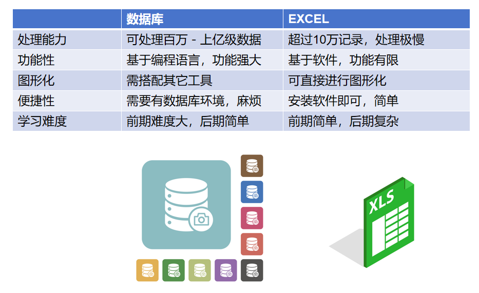
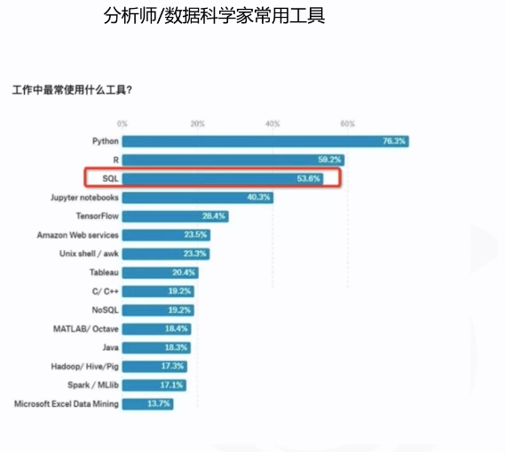
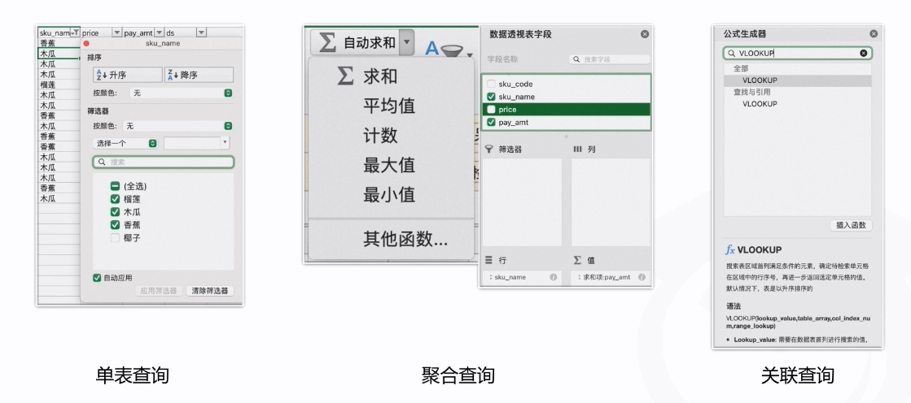
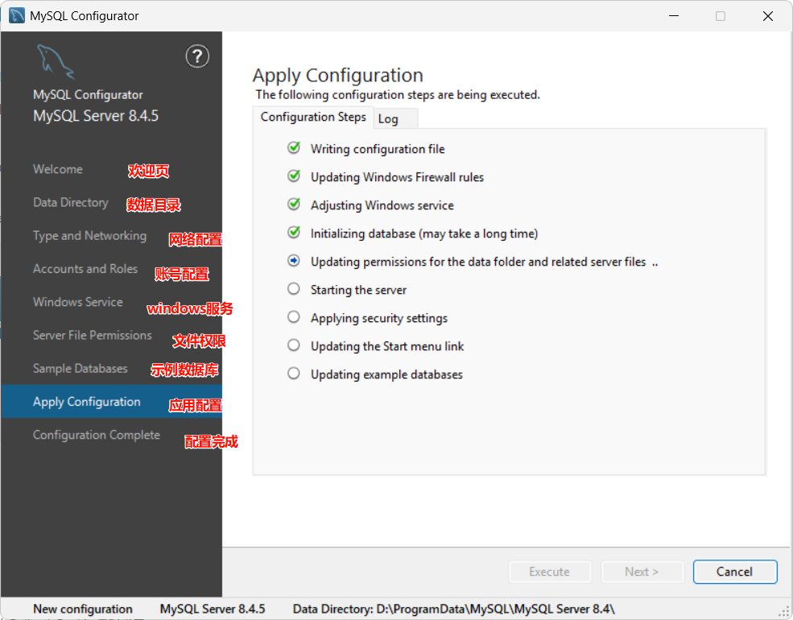
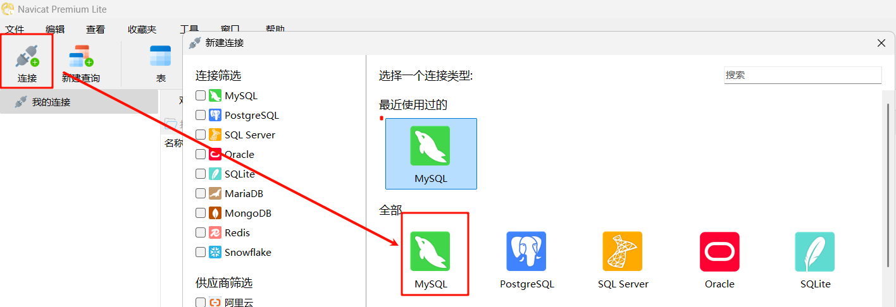
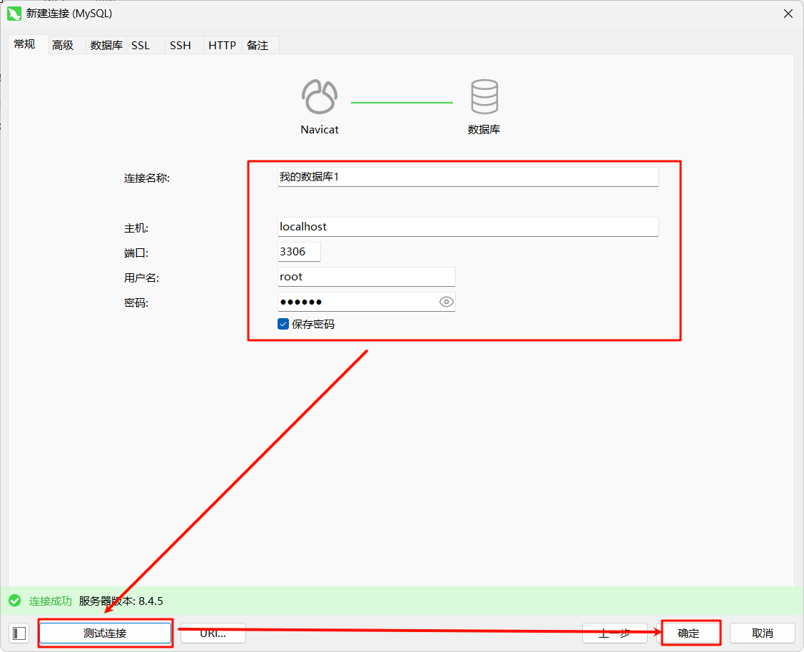
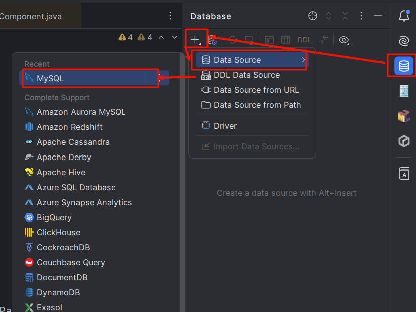
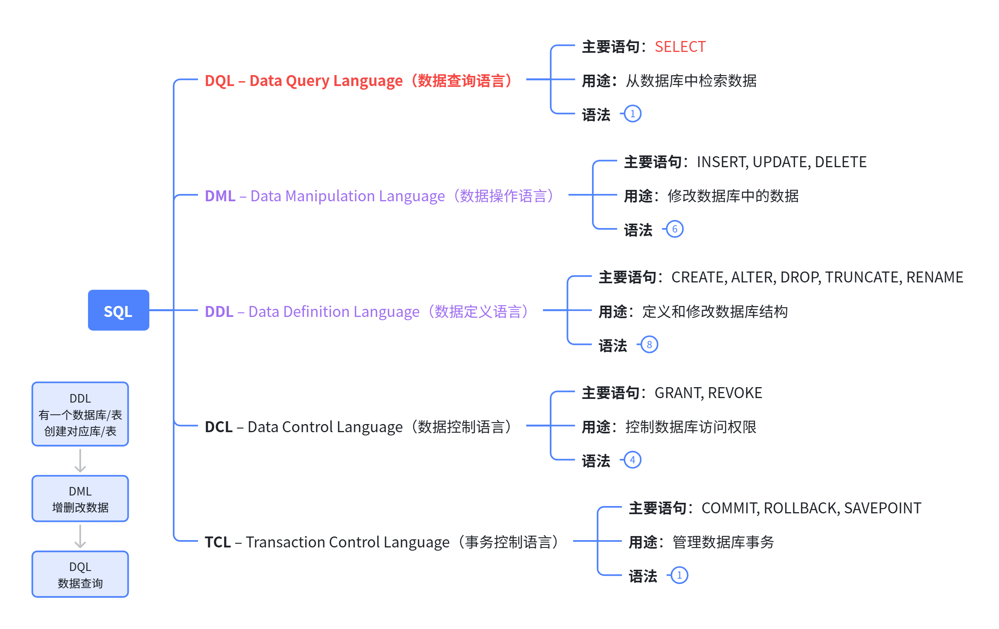
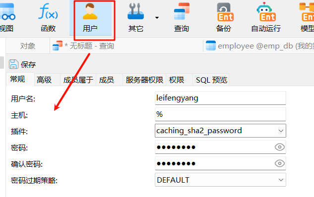

# 1. 数据库基础

***有些传统企业没有数据库，都是使用excel保存企业的相关数据记录；比如***

- 商品品出入库记录
- 商品订单销售记录
- 退换货/维修记录
- 员工信息记录
- 工资流水记录
- 企业账务记录
- ......

# 基本理论

> ***场景：（小王是一个传统的******数据分析师******）***
> 
> > **老板：**今年1月我们公司的水果销售额好像跟去年1月比低了不少，你帮我把去年1月每天卖出去的水果种类数目和成交额统计出来，每个原厂国信息也需要。
> 
> > **小王：**好的，老板，稍等我找销售组，拿到excel报表，然后统计分析一下。
> 
> > **老板：**行，数据尽快发我
> 
> ***困难：***
> 
> 1. 有好几份表格，其中光一张表就有超过50万行的数据，打开表格都费劲，更别说找数据了
> 2. 找销售组帮忙，但需求描述不清，拿到的都不是自己想要的结果，时间成本、沟通成本大
> 
> ***现象：***30min后，excel还卡着呢。不如学习**SQL**，快速从**数据库**里面取出想要的数据

## 什么是数据库

> **数据库（Database）**是一种用于**高效存储、管理和组织数据**的系统。
> 
> 它通过特定的**数据结构**将数据有序存储，并提供强大的**查询、修改、删除和安全控制功能**，确保数据的一致性、完整性和可访问性。
> 
> **数据库是“数据的仓库”**，但远不止于简单的**存储**，**更强调**对数据的**高效管理与利用**。



## 常见数据库类型

根据数据模型的不同，数据库可分为多种类型，最常见的两类是：

### 关系型数据库（RDBMS, Relational Database Management System）​

- **数据模型​：**基于数学中的“关系理论”，数据以二维表格（关系表）形式存储，表之间通过“键”（如主键、外键）关联。
- **特点​：**严格的结构化、支持复杂查询（如多表关联）、强一致性。
- **典型产品​：**MySQL、Oracle、PostgreSQL、SQL Server。
- **适用场景​：**需要精确数据关联和事务的场景（如银行交易、财务系统、电商订单管理）。

> 类似于 excel 存储数据的方式

### 非关系型数据库（NoSQL, Not Only SQL）​

- **数据模型​：**打破传统表结构，采用更灵活的模型（如键值对、文档、列族、图），适合存储非结构化或半结构化数据（如JSON文档、日志、社交关系）。
- **特点​：**高扩展性、高吞吐量、弱一致性（支持最终一致性），适合处理海量数据和高并发场景。
- **典型类型与产品​：**
  - 键值（Key-Value）：Redis（缓存）、Memcached；
  - 文档（Document）：MongoDB（存储JSON格式的用户资料）；
  - 列族（Column-Family）：HBase（大数据场景下的日志存储）；
  - 图（Graph）：Neo4j（社交关系网络分析）。
- **适用场景​：**实时推荐、日志分析、物联网设备数据、高并发的互联网应用（如短视频APP的用户行为记录）。

> 类似于 word/ppt 存储数据的方式

## 什么是SQL

**SQL**是**结构化查询语言**（**Structured Query Language**)的简称，是用于存取数据以及查询、更新和管理数据的**编程语言**；

**数据研发工程师**、**数据分析师**、**数据科学家**、**后端工程师**、**数据库管理员**，甚至**产品经理**，业务**运营**等角色在日常工作中都会应用SQL；



## 复杂查询



## 安装数据库

### 下载地址

https://dev.mysql.com/downloads/mysql/

> 访问 mysql.com

### 数据库安装&配置



安装号以后：验证服务器是否在运行

1. 查看windows服务有没有正在运行。
2. 用客户端连接上服务器

### 官方手册

https://dev.mysql.com/doc/refman/8.4/en/

## 连接数据库

> 三种常见方式

### 命令行

> Linux&Mac下：命令行输入： `mysql -uroot -p`: 使用root用户链接上本机（localhost）的 端口为3306的MySQL软件； ` -h``localhost`` -P3306`； 不写的默认值； `-p`：手动输入密码
> 
> Windows下：直接使用 `MySQL Command Line Client`

### 客户端

Navicate：https://www.navicat.com.cn/products/navicat-premium-lite

HediSQL：https://www.heidisql.com/#google_vignette

DBeaver：https://dbeaver.io/download/

以Navicate为例：





### idea



## 基本概念

> 类比Excel，更容易理解数据库

*📊 在线表格（无数据）*

## 可视化操作

> **体会下数据库是干什么的**

1. 创建一个记录员工信息的**数据库(emp_db)**
2. 创建一张**员工表(employee)**，**定义字段**包含（编号(id)、姓名（name）、年龄(age)、性别(gender)）
3. 插入几条员工数据
4. 修改员工数据
5. 删除员工数据
6. 查询年龄大于20的员工

> **SQL编程式**！重点

## 命名规范

### 基本规则

**见名知意**的情况下，尽量遵守如下规则

1. **下划线命名法 (snake_case)​：【推荐】**
  - 示例：`user_account`, `order_details`
  - 特点：单词间用下划线连接，全小写
2. 驼峰命名法 (CamelCase)​：
  - 示例：`userAccount`, `orderDetails`
  - 特点：单词首字母小写，无分隔符

### 建议规范

#### 表(Table)命名

- 使用复数形式或单数形式（保持一致）
- 示例：`users` 或 `user`
- 关联表：`user_role`（多对多关系表）

#### 列(Column)命名

- 使用单数形式
- **主键**：`id` 或 `表名_id`（如 `user_id`）； 全表唯一的字段才能是主键；
- **外键**：`关联表名_id`（如 `department_id`）
- **布尔**字段：`is_active`, `has_permission`
- **日期**字段：`created_at`, `updated_at`

#### 索引(Index)命名

- 前缀：`idx``_` 或 `ix_`
- 示例：`idx_user_email`, `ix_order_date`

#### 视图(View)命名

- 前缀：`v_` 或 `vw_`
- 示例：`v_user_summary`, `vw_sales_report`

#### 存储过程(Stored Procedure)命名

- 前缀：`sp_` 或 `proc_`
- 示例：`sp_calculate_totals`, `proc_generate_report`

#### 函数(Function)命名

- 前缀：`fn_` 或 `func_`
- 示例：`fn_calculate_age`, `func_format_date`

#### 触发器(Trigger)命名

- 前缀：`trg_` 或 `t_`
- 示例：`trg_user_audit`, `t_order_update`

# SQL语言

## 分类

> SQL 按照**功能**分为如下几种类型



## **DDL** – Data Definition Language（数据定义语言）

### 语法

```sql
-- 创建数据库
CREATE DATABASE database_name;

-- 创建表（表中可以编写的约束，在扩展用法中讲解）
CREATE TABLE table_name (
    column1 datatype constraints,
    column2 datatype constraints,
    ...,
    [table_constraints]
);

-- 创建索引
CREATE [UNIQUE] INDEX index_name
ON table_name (column1, column2, ...);


-- 添加列
ALTER TABLE table_name
ADD column_name datatype;

-- 修改列
ALTER TABLE table_name
MODIFY column_name new_datatype;

-- 删除列
ALTER TABLE table_name
DROP COLUMN column_name;

-- 重命名表
ALTER TABLE old_table_name
RENAME TO new_table_name;

-- 删除表
DROP TABLE table_name;
--- 清空表（保留表结构，清空数据）
TRUNCATE [TABLE] table_name;

-- 删除数据库
DROP DATABASE database_name;
```

###  字段约束

> 在扩展用法章节会专门介绍

### 库操作

> 先可视化操作数据库

```sql
-- 创建数据库
CREATE DATABASE company_db
CHARACTER SET utf8mb4
COLLATE utf8mb4_unicode_ci;

-- 查看所有数据库
SHOW DATABASES;

-- 使用数据库
USE company_db;

-- 删除数据库(谨慎使用)
DROP DATABASE IF EXISTS old_company_db;
```

### 字符集与排序规则

#### 常见字符集

*📊 在线表格（无数据）*

#### 排序规则

排序规则命名：`字符集_语言_后缀`

> **utf8mb4 排序规则**

> **其他字符集排序规则**

常见后缀：

- `_ci`：不区分大小写(Case Insensitive)
- `_cs`：区分大小写(Case Sensitive)
- `_bin`：二进制比较
- `_ai`：不区分**重音**(Accent Insensitive)拼音的01234声
- `_as`：区分**重音**(Accent Sensitive)

```sql
-- 不同排序规则下的比较结果
SET @str1 = 'é', @str2 = 'e';

-- 使用区分重音的排序规则
SELECT @str1 = @str2 COLLATE utf8mb4_0900_as_ci; 
-- 结果: 0 (不相等)

-- 使用不区分重音的排序规则
SELECT @str1 = @str2 COLLATE utf8mb4_0900_ai_ci;
-- 结果: 1 (相等)
```

### 表操作

#### 创建表

```sql
-- 创建部门表
CREATE TABLE departments (
    dept_id INT PRIMARY KEY AUTO_INCREMENT,
    dept_name VARCHAR(50) NOT NULL,
    location VARCHAR(100),
    budget DECIMAL(12,2) DEFAULT 100000.00,
    established_date DATE,
    CONSTRAINT chk_budget CHECK (budget >= 0)
);

-- 创建员工表
CREATE TABLE employees (
    emp_id INT PRIMARY KEY AUTO_INCREMENT,
    emp_name VARCHAR(100) NOT NULL,
    email VARCHAR(100) UNIQUE,
    salary DECIMAL(10,2),
    hire_date DATE DEFAULT (CURRENT_DATE), 
    dept_id INT,
    manager_id INT,
    CONSTRAINT fk_dept FOREIGN KEY (dept_id) 
        REFERENCES departments(dept_id),
    CONSTRAINT fk_manager FOREIGN KEY (manager_id) 
        REFERENCES employees(emp_id),
    CONSTRAINT chk_salary CHECK (salary >= 0)
);
```

#### 修改表

```sql
-- 添加新列
ALTER TABLE employees
ADD COLUMN phone VARCHAR(20);

-- 修改列定义
ALTER TABLE employees
MODIFY COLUMN email VARCHAR(150) NOT NULL;

-- 重命名列
ALTER TABLE employees
CHANGE COLUMN emp_name full_name VARCHAR(100);

-- 添加约束
ALTER TABLE employees
ADD CONSTRAINT uk_phone UNIQUE (phone);

-- 删除列
ALTER TABLE employees
DROP COLUMN phone;

-- 重命名表
ALTER TABLE employees
RENAME TO staff;
```

#### 删除表

```sql
-- 删除表(有外键约束时需要先处理依赖关系)
DROP TABLE IF EXISTS temp_table;

-- 级联删除(谨慎使用)
DROP TABLE departments CASCADE;
```

### 索引操作（后面讲解）

> 索引为了加速查询

```sql
-- 创建索引
CREATE INDEX idx_employee_name ON employees(emp_name);

-- 创建复合索引
CREATE INDEX idx_dept_salary ON employees(dept_id, salary DESC);

-- 创建唯一索引
CREATE UNIQUE INDEX idx_employee_email ON employees(email);

-- 删除索引
DROP INDEX idx_employee_name ON employees;
```

### SQL中的数据类型

#### 数值类型

> 整数

> 精确小数

> 浮点数

#### 布尔类型

MySQL 8 中：

> `BOOLEAN` 和 `BOOL` 是 `TINYINT(1)` 的别名；`TRUE` 和 `FALSE` 分别等同于1和0

1. 括号中的数字(1)只是显示宽度​：
  - 在 MySQL 中，`TINYINT(1)` 的 `(1)` 并不限制存储范围
  - 它只是建议显示时的宽度（在 ZEROFILL 或某些客户端中有用）
  - 实际存储仍使用完整的 1 字节（8位）空间
2. 布尔值的实现​：
  - MySQL 没有真正的布尔类型
  - `BOOLEAN` 和 `BOOL` 是 `TINYINT(1)` 的别名
  - 当用作布尔值时，通常**约定**：0 = FALSE，1 = TRUE

#### 字符串类型

> 定长字符串

> 变长字符串

#### 二进制类型

> 一般用来保存文件；

#### 日期类型

新闻表（新闻id，标题，内容，发布日期，作者，插图，点赞...）

#### JSON类型

MySQL 8 原生支持 JSON 数据类型，提供高效的存储和查询能力。

特点：

- 自动验证JSON格式
- 优化存储格式（二进制）
- 提供丰富的JSON函数

```sql
CREATE TABLE products (
    id INT,
    name VARCHAR(100),
    attributes JSON,  -- 存储JSON对象
    specs JSON  -- 存储JSON数组
);

-- 插入JSON数据
INSERT INTO products VALUES (1, 'Laptop', 
    '{"color": "silver", "weight": 1.5}', 
    '["8GB RAM", "256GB SSD"]');
```

#### 空间数据类型

> MySQL 支持 `OpenGIS` 标准的地理空间数据类型：

#### 枚举和集合

## **DML – Data Manipulation Language（数据操作语言）**

### 语法

```sql
-- 插入单行，可以省略列名
INSERT INTO table_name (column1, column2, ...)
VALUES (value1, value2, ...);

-- 插入多行
INSERT INTO table_name (column1, column2, ...)
VALUES 
    (value1, value2, ...),
    (value1, value2, ...),
    ...;

-- 从其他表插入
INSERT INTO table_name (column1, column2, ...)
SELECT column1, column2, ...
FROM another_table
WHERE condition;

-- 更新表
UPDATE table_name
SET column1 = value1, column2 = value2, ...
WHERE condition;

-- 删除表：条件删除；
DELETE FROM table_name
WHERE condition;

-- 清空表：只删除数据，保留表结构
TRUNCATE TABLE table_name;

-- 删除表：删除表结构和数据
DROP TABLE table_name;

```

### 案例

```sql
-- 创建一个 员工表

-- 增删改数据
insert: 增
delete：删
update： 改
select： 查（重点）
```

## **DCL** – Data Control Language（数据控制语言）

### 语法

```sql
-- 授权
GRANT privilege1, privilege2, ...
ON object_name
TO user1, user2, ...
[WITH GRANT OPTION];

-- 移除权限
REVOKE privilege1, privilege2, ...
ON object_name
FROM user1, user2, ...;
```

### 案例

> MySQL 高级部分，我们会单独讲解权限



## DQL & TCL 是重点

> 我们后面单独说
> 
> **DQL（Data Query Language）： 数据查询语言**
> 
> **TCL（Transation Control Language）： 事务控制**

# 今日作业

**某企业有如下两个数据； **

> **sku**（Stock Keep Unit：库存单元）【一个具体的商品称为一个SKU】
> 
> spu（**Standard Product Unit：标准产品单元**）：
> 
> - `iphone16`：**spu**（iphone16抽象定义【几个摄像头、像素、操作系统、优化...】）
> - `iphone16 黑色 8+128`；具体商品； **sku **；每一个编号都不一样

1. **商品明细表**（主要是水果信息和原产国）
2. **订单明细表**（主要是订单数据）

要求：

1、创建对应数据库，设计合理的 table，重点关注采用哪种字段类型

2、将所有的数据编写SQL插入到表格中

3、**整理成一个完整的 .sql 文件**，可以保证在新的数据库里面一次执行就可以产生完整数据（数据迁移性）

> 完成这个作业（建议不要用可视化操作，熟悉下SQL语句），我们后面要用他们做查询练习

> 参考答案如下：
> 
> - 数据库基于压缩包，批量导入百万数据；

## 最简版

```sql
-- ----------------------------
-- 创建数据库
-- ----------------------------
CREATE DATABASE `fruits`;
USE `fruits`;


-- ----------------------------
-- Table structure for order_detail
-- ----------------------------
CREATE TABLE `order_detail`  (
  `order_id` bigint PRIMARY KEY NOT NULL AUTO_INCREMENT,
  `pay_time` datetime,
  `buyer_name` varchar(255),
  `sku_code` bigint,
  `sku_name` varchar(255),
  `price` decimal(10, 2),
  `buy_stock` int,
  `pay_amt` decimal(10, 2),
  `ds` varchar(255)
);

-- ----------------------------
-- Records of order_detail
-- ----------------------------
INSERT INTO `order_detail` VALUES (1, '2025-01-29 13:00:19', '张三', 25132, '香蕉', 5.00, 2, 10.00, '20250129');
INSERT INTO `order_detail` VALUES (2, '2025-01-29 19:48:28', '李四', 75627, '木瓜', 5.00, 5, 25.00, '20250129');
INSERT INTO `order_detail` VALUES (3, '2025-01-29 09:36:30', '李四', 43508, '椰子', 10.00, 1, 10.00, '20250129');
INSERT INTO `order_detail` VALUES (4, '2025-01-29 13:14:33', '李四', 75627, '木瓜', 5.00, 10, 50.00, '20250129');
INSERT INTO `order_detail` VALUES (5, '2025-01-29 19:18:23', '王五', 75627, '木瓜', 5.00, 6, 30.00, '20250129');
INSERT INTO `order_detail` VALUES (6, '2025-01-30 14:31:03', '王五', 21553, '榴莲', 80.00, 7, 560.00, '20250130');
INSERT INTO `order_detail` VALUES (7, '2025-01-29 22:43:47', '张三', 75627, '木瓜', 5.00, 2, 10.00, '20250129');
INSERT INTO `order_detail` VALUES (8, '2025-01-30 16:11:47', '李四', 75627, '木瓜', 5.00, 7, 35.00, '20250130');
INSERT INTO `order_detail` VALUES (9, '2025-01-29 22:38:56', '张三', 43508, '椰子', 10.00, 3, 30.00, '20250129');
INSERT INTO `order_detail` VALUES (10, '2025-01-30 23:00:45', '李四', 25132, '香蕉', 5.00, 3, 15.00, '20250130');
INSERT INTO `order_detail` VALUES (11, '2025-01-30 22:02:09', '王五', 75627, '木瓜', 5.00, 3, 15.00, '20250130');
INSERT INTO `order_detail` VALUES (12, '2025-01-29 12:37:03', '李四', 25132, '香蕉', 5.00, 7, 35.00, '20250129');
INSERT INTO `order_detail` VALUES (13, '2025-01-29 18:15:20', '李四', 25132, '香蕉', 5.00, 8, 40.00, '20250129');
INSERT INTO `order_detail` VALUES (14, '2025-01-29 21:34:52', '张三', 75627, '木瓜', 5.00, 10, 50.00, '20250129');
INSERT INTO `order_detail` VALUES (15, '2025-01-29 10:31:36', '李四', 75627, '木瓜', 5.00, 6, 30.00, '20250129');
INSERT INTO `order_detail` VALUES (16, '2025-01-30 17:19:10', '王五', 43508, '椰子', 10.00, 1, 10.00, '20250130');
INSERT INTO `order_detail` VALUES (17, '2025-01-30 21:19:14', '张三', 75627, '木瓜', 5.00, 9, 45.00, '20250130');
INSERT INTO `order_detail` VALUES (18, '2025-01-30 21:29:29', '李四', 25132, '香蕉', 5.00, 4, 20.00, '20250130');
INSERT INTO `order_detail` VALUES (19, '2025-01-29 21:04:41', '李四', 43508, '椰子', 10.00, 9, 90.00, '20250129');
INSERT INTO `order_detail` VALUES (20, '2025-01-30 19:24:45', '张三', 75627, '木瓜', 5.00, 9, 45.00, '20250130');

-- ----------------------------
-- Table structure for sku_info
-- ----------------------------
CREATE TABLE `sku_info`  (
  `sku_code` bigint PRIMARY KEY NOT NULL,
  `sku_name` varchar(255),
  `price` decimal(10, 2),
  `origin_country` varchar(255)
);

-- ----------------------------
-- Records of sku_info
-- ----------------------------
INSERT INTO `sku_info` VALUES (21553, '榴莲', 80.00, '泰国');
INSERT INTO `sku_info` VALUES (25132, '香蕉', 5.00, '菲律宾');
INSERT INTO `sku_info` VALUES (43508, '椰子', 10.00, '泰国');
INSERT INTO `sku_info` VALUES (72794, '凤梨', 20.00, '菲律宾');
INSERT INTO `sku_info` VALUES (75627, '木瓜', 5.00, '马来西亚');


```

## 完整版

```sql
-- ----------------------------
-- 创建数据库
-- ----------------------------
CREATE DATABASE IF NOT EXISTS `fruits` CHARACTER SET utf8mb4 COLLATE utf8mb4_0900_ai_ci;
USE `fruits`;


SET NAMES utf8mb4;
SET FOREIGN_KEY_CHECKS = 0;

-- ----------------------------
-- Table structure for order_detail
-- ----------------------------
DROP TABLE IF EXISTS `order_detail`;
CREATE TABLE `order_detail`  (
  `order_id` bigint NOT NULL AUTO_INCREMENT COMMENT '订单唯一id',
  `pay_time` datetime NULL DEFAULT NULL COMMENT '支付时间',
  `buyer_name` varchar(255) CHARACTER SET utf8mb4 COLLATE utf8mb4_0900_ai_ci NULL DEFAULT NULL COMMENT '购买人姓名',
  `sku_code` bigint NULL DEFAULT NULL COMMENT '商品编号',
  `sku_name` varchar(255) CHARACTER SET utf8mb4 COLLATE utf8mb4_0900_ai_ci NULL DEFAULT NULL COMMENT '商品名字',
  `price` decimal(10, 2) NULL DEFAULT NULL COMMENT '商品价格',
  `buy_stock` int NULL DEFAULT NULL COMMENT '购买数量',
  `pay_amt` decimal(10, 2) NULL DEFAULT NULL COMMENT '支付价格',
  `ds` varchar(255) CHARACTER SET utf8mb4 COLLATE utf8mb4_0900_ai_ci NULL DEFAULT NULL COMMENT '支付日期',
  PRIMARY KEY (`order_id`) USING BTREE
) ENGINE = InnoDB AUTO_INCREMENT = 21 CHARACTER SET = utf8mb4 COLLATE = utf8mb4_0900_ai_ci COMMENT = '订单明细表' ROW_FORMAT = Dynamic;

-- ----------------------------
-- Records of order_detail
-- ----------------------------
INSERT INTO `order_detail` VALUES (1, '2025-01-29 13:00:19', '张三', 25132, '香蕉', 5.00, 2, 10.00, '20250129');
INSERT INTO `order_detail` VALUES (2, '2025-01-29 19:48:28', '李四', 75627, '木瓜', 5.00, 5, 25.00, '20250129');
INSERT INTO `order_detail` VALUES (3, '2025-01-29 09:36:30', '李四', 43508, '椰子', 10.00, 1, 10.00, '20250129');
INSERT INTO `order_detail` VALUES (4, '2025-01-29 13:14:33', '李四', 75627, '木瓜', 5.00, 10, 50.00, '20250129');
INSERT INTO `order_detail` VALUES (5, '2025-01-29 19:18:23', '王五', 75627, '木瓜', 5.00, 6, 30.00, '20250129');
INSERT INTO `order_detail` VALUES (6, '2025-01-30 14:31:03', '王五', 21553, '榴莲', 80.00, 7, 560.00, '20250130');
INSERT INTO `order_detail` VALUES (7, '2025-01-29 22:43:47', '张三', 75627, '木瓜', 5.00, 2, 10.00, '20250129');
INSERT INTO `order_detail` VALUES (8, '2025-01-30 16:11:47', '李四', 75627, '木瓜', 5.00, 7, 35.00, '20250130');
INSERT INTO `order_detail` VALUES (9, '2025-01-29 22:38:56', '张三', 43508, '椰子', 10.00, 3, 30.00, '20250129');
INSERT INTO `order_detail` VALUES (10, '2025-01-30 23:00:45', '李四', 25132, '香蕉', 5.00, 3, 15.00, '20250130');
INSERT INTO `order_detail` VALUES (11, '2025-01-30 22:02:09', '王五', 75627, '木瓜', 5.00, 3, 15.00, '20250130');
INSERT INTO `order_detail` VALUES (12, '2025-01-29 12:37:03', '李四', 25132, '香蕉', 5.00, 7, 35.00, '20250129');
INSERT INTO `order_detail` VALUES (13, '2025-01-29 18:15:20', '李四', 25132, '香蕉', 5.00, 8, 40.00, '20250129');
INSERT INTO `order_detail` VALUES (14, '2025-01-29 21:34:52', '张三', 75627, '木瓜', 5.00, 10, 50.00, '20250129');
INSERT INTO `order_detail` VALUES (15, '2025-01-29 10:31:36', '李四', 75627, '木瓜', 5.00, 6, 30.00, '20250129');
INSERT INTO `order_detail` VALUES (16, '2025-01-30 17:19:10', '王五', 43508, '椰子', 10.00, 1, 10.00, '20250130');
INSERT INTO `order_detail` VALUES (17, '2025-01-30 21:19:14', '张三', 75627, '木瓜', 5.00, 9, 45.00, '20250130');
INSERT INTO `order_detail` VALUES (18, '2025-01-30 21:29:29', '李四', 25132, '香蕉', 5.00, 4, 20.00, '20250130');
INSERT INTO `order_detail` VALUES (19, '2025-01-29 21:04:41', '李四', 43508, '椰子', 10.00, 9, 90.00, '20250129');
INSERT INTO `order_detail` VALUES (20, '2025-01-30 19:24:45', '张三', 75627, '木瓜', 5.00, 9, 45.00, '20250130');

-- ----------------------------
-- Table structure for sku_info
-- ----------------------------
DROP TABLE IF EXISTS `sku_info`;
CREATE TABLE `sku_info`  (
  `sku_code` bigint NOT NULL COMMENT '商品编号',
  `sku_name` varchar(255) CHARACTER SET utf8mb4 COLLATE utf8mb4_0900_ai_ci NULL DEFAULT NULL COMMENT '商品名字',
  `price` decimal(10, 2) NULL DEFAULT NULL COMMENT '商品价格',
  `origin_country` varchar(255) CHARACTER SET utf8mb4 COLLATE utf8mb4_0900_ai_ci NULL DEFAULT NULL COMMENT '原产国',
  PRIMARY KEY (`sku_code`) USING BTREE
) ENGINE = InnoDB CHARACTER SET = utf8mb4 COLLATE = utf8mb4_0900_ai_ci ROW_FORMAT = Dynamic;

-- ----------------------------
-- Records of sku_info
-- ----------------------------
INSERT INTO `sku_info` VALUES (21553, '榴莲', 80.00, '泰国');
INSERT INTO `sku_info` VALUES (25132, '香蕉', 5.00, '菲律宾');
INSERT INTO `sku_info` VALUES (43508, '椰子', 10.00, '泰国');
INSERT INTO `sku_info` VALUES (72794, '凤梨', 20.00, '菲律宾');
INSERT INTO `sku_info` VALUES (75627, '木瓜', 5.00, '马来西亚');

SET FOREIGN_KEY_CHECKS = 1;

```