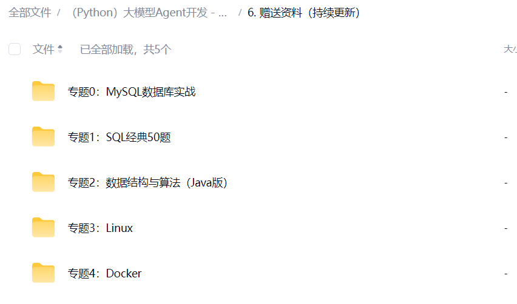

# 1. 新手前置课程

> 作为老程序员。以下的课程默认都会。再学习FastAPI

[📑 1. MySQL（掌握）](https://shenma-docs.feishu.cn/wiki/X3vYwfiMPiG4B8klpfSc2zUhnqc)

[📝 2. Linux（掌握）](https://shenma-docs.feishu.cn/wiki/KcbZwzNMDioZXbkgd7ScHmckn6g)

[📝 3. Docker（掌握）](https://shenma-docs.feishu.cn/wiki/E6CQwqujBiyvXfkoJf5cFvE7nBe)

[📑 4. Redis（掌握）](https://shenma-docs.feishu.cn/wiki/NIFzwpjf7ikLq5kqx4YcjYc3nJe)

[📑 5. B/S架构（了解）](https://shenma-docs.feishu.cn/wiki/CrRDw7xqHiw6VckrqRecUTBjnde)

如果不会。参考赠送资料中的课程。

