# 3. Docker（掌握）

# 前序

> 没有Docker的时代，Linux上安装配置环境，是一个**恶梦**； 比如**安装Tomcat**；

## 安装Java环境

> https://jdk.java.net/archive/

```bash
#下载jdk17
wget https://download.java.net/java/GA/jdk21/fd2272bbf8e04c3dbaee13770090416c/35/GPL/openjdk-21_linux-x64_bin.tar.gz


#解压
tar -xzvf jdk-17_linux-x64_bin.tar.gz

#移动到指定位置； 记住全路径： /usr/local/jdk-17.0.7
mv jdk-17.0.7 /opt/

#配置环境变量   /opt/jdk-17.0.2
vim /etc/profile

#在最后加入下面配置，注意修改 JAVA_HOME位置为你自己的位置
export JAVA_HOME=/opt/jdk-17.0.2
export PATH=$JAVA_HOME/bin:$PATH

#使环境变量生效
source /etc/profile

#验证安装成功
java -version
```

## 安装Tomcat

```shell
# 下载二进制包
sudo yum install -y wget
wget https://dlcdn.apache.org/tomcat/tomcat-11/v11.0.9/bin/apache-tomcat-11.0.9.tar.gz
# 解压到/opt/tomcat目录
sudo tar -zxvf apache-tomcat-9.0.80.tar.gz -C /opt/tomcat

# 启动Tomcat
cd /opt/tomcat/bin
sh startup.sh
```

## 制作开机启动

```python
sudo vim /etc/systemd/system/tomcat.service

# 内容如下：注意修改Java HOME位置
[Unit]
Description=Tomcat 11 Servlet Container
After=network.target

[Service]
Type=forking


Environment="CATALINA_PID=/opt/tomcat/tomcat.pid"
Environment="JAVA_HOME=/opt/jdk-17.0.2"
Environment="CATALINA_HOME=/opt/tomcat"
Environment="CATALINA_BASE=/opt/tomcat"

ExecStart=/opt/tomcat/bin/startup.sh
ExecStop=/opt/tomcat/bin/shutdown.sh

RestartSec=10
Restart=always

[Install]
WantedBy=multi-user.target
```

```shell
sudo systemctl daemon-reload
sudo systemctl start tomcat
sudo systemctl enable tomcat
sudo systemctl status tomcat  # 检查状态
```

## 更多

> 1. 有些软件还要下载 源码，进行编译安装： `make & make install`
> 2. 软件换平台迁移更加麻烦；多个操作系统安装方式可能不一样（ubuntu、debian、centos）

> 我们希望软件的**构建**、**安装**、**部署**、**迁移**、**分享**等有一个**更快更新的方式**

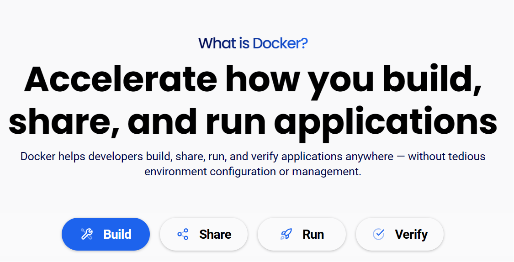

# 容器

> Docker 开启了**容器的时代**。**容器是一种比虚拟机更轻量级的技术**

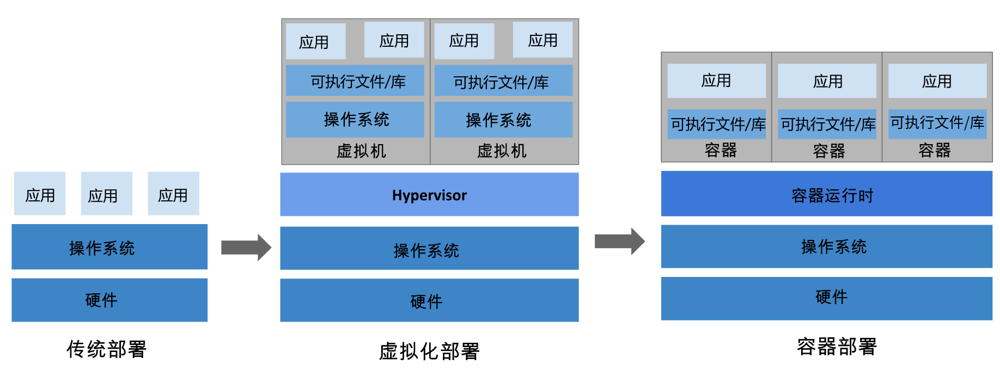

**传统部署时代：**

早期，各个组织是在物理服务器上运行应用程序。 由于无法限制在物理服务器中运行的应用程序资源使用，因此会导致资源分配问题。 例如，如果在同一台物理服务器上运行多个应用程序， 则可能会出现一个应用程序占用大部分资源的情况，而导致其他应用程序的性能下降。 一种解决方案是将每个应用程序都运行在不同的物理服务器上， 但是当某个应用程序资源利用率不高时，剩余资源无法被分配给其他应用程序， 而且维护许多物理服务器的成本很高。

**虚拟化部署时代：**

因此，虚拟化技术被引入了。虚拟化技术允许你在单个物理服务器的 CPU 上运行多台虚拟机（VM）。 虚拟化能使应用程序在不同 VM 之间被彼此隔离，且能提供一定程度的安全性， 因为一个应用程序的信息不能被另一应用程序随意访问。

虚拟化技术能够更好地利用物理服务器的资源，并且因为可轻松地添加或更新应用程序， 而因此可以具有更高的可扩缩性，以及降低硬件成本等等的好处。 通过虚拟化，你可以将一组物理资源呈现为可丢弃的虚拟机集群。

每个 VM 是一台完整的计算机，在虚拟化硬件之上运行所有组件，包括其自己的操作系统。

**容器部署时代：**

容器类似于 VM，但是更宽松的隔离特性，使容器之间可以共享操作系统（OS）。 因此，容器比起 VM 被认为是更轻量级的。且与 VM 类似，每个容器都具有自己的文件系统、CPU、内存、进程空间等。 由于它们与基础架构分离，因此可以跨云和 OS 发行版本进行移植。

容器因具有许多优势而变得流行起来，例如：

- 敏捷应用程序的创建和部署：与使用 VM 镜像相比，提高了容器镜像创建的简便性和效率。
- 持续开发、集成和部署：通过快速简单的回滚（由于镜像不可变性）， 提供可靠且频繁的容器镜像构建和部署。
- 关注开发与运维的分离：在构建、发布时创建应用程序容器镜像，而不是在部署时， 从而将应用程序与基础架构分离。
- 可观察性：不仅可以显示 OS 级别的信息和指标，还可以显示应用程序的运行状况和其他指标信号。
- 跨开发、测试和生产的环境一致性：在笔记本计算机上也可以和在云中运行一样的应用程序。
- 跨云和操作系统发行版本的可移植性：可在 Ubuntu、RHEL、CoreOS、本地、 Google Kubernetes Engine 和其他任何地方运行。
- 以应用程序为中心的管理：提高抽象级别，从在虚拟硬件上运行 OS 到使用逻辑资源在 OS 上运行应用程序。
- 松散耦合、分布式、弹性、解放的微服务：应用程序被分解成较小的独立部分， 并且可以动态部署和管理 - 而不是在一台大型单机上整体运行。
- 资源隔离：可预测的应用程序性能。
- 资源利用：高效率和高密度。

> **容器化的几个重要特点**：【**轻量**、**快速**、**隔离**、**跨平台**、**高密度**】
> 
> 1. **容器类似轻量级的VM**
> 2. **容器共享操作系统内核**
> 3. 容器拥有自己的**文件系统**、`CPU`、`内存`、`进程空间`等
> 4. **容器互相隔离**

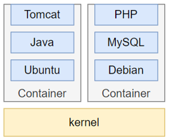

# Docker 入门

## Docker 架构

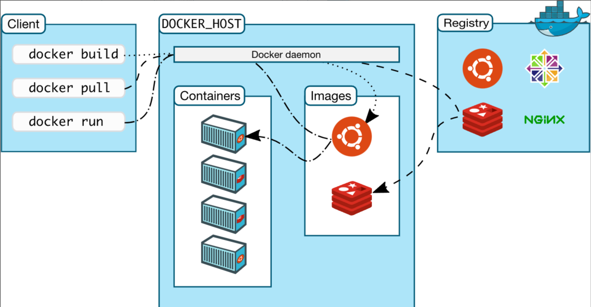

- **Docker_Host**：安装Docker的主机
- **Docker Daemon**：运行在Docker主机上的Docker后台进程
- **Client**：操作Docker主机的客户端（命令行、UI等）
- **Registry（镜像仓库）**：Docker Hub(公共仓库)、私有仓库
- **Image（镜像）**： 带环境打包好的程序，可以直接启动运行
- **Container（容器）**：由镜像启动起来**正在运行中的程序**

> **交互逻辑**：装好**Docker**，然后去 **软件市场** 寻找**镜像**，下载并运行，查看**容器**状态日志等排错

> 软件市场：hub.docker.com

## Docker 安装

> [https://docs.docker.com/engine/install/centos/](https://docs.docker.com/engine/install/centos/)

```shell
# 移除旧版本
sudo yum remove docker \
                  docker-client \
                  docker-client-latest \
                  docker-common \
                  docker-latest \
                  docker-latest-logrotate \
                  docker-logrotate \
                  docker-engine

# 配置 yum 源
sudo yum install -y yum-utils

# 告诉linux docker的 yum源； 方便linux快速下载docker的
sudo yum-config-manager \
--add-repo \
http://mirrors.aliyun.com/docker-ce/linux/centos/docker-ce.repo

# 安装 Docker
sudo yum install -y docker-ce docker-ce-cli containerd.io docker-buildx-plugin docker-compose-plugin

# 启动
systemctl enable docker --now

# 配置 Docker 镜像加速地址，方便docker快速下载其他软件镜像
sudo mkdir -p /etc/docker
sudo tee /etc/docker/daemon.json <<-'EOF'
{
  "registry-mirrors": ["https://docker.xuanyuan.me"]
}
EOF
sudo systemctl daemon-reload
sudo systemctl restart docker
```

## 验证

```shell
# 查看 Docker 中正在运行的容器
docker ps
```

## 扩展：window安装docker

https://www.bilibili.com/video/BV15rduYAEV7/

# 常用命令

> 一个实验串联 Docker 常用的命令
> 
> **需求**：启动一个`nginx`，并**将它的首页改为自己的页面**，**发布**出去，让**所有人都能使用**
> 
> 1. 下载nginx镜像并启动nginx应用
> 2. 修改nginx软件的页面为自己的页面（**定制化**）
> 3. 把软件发布出去（发布到**软件市场[docker hub]**）
> 4. 别人去市场下载我们发布的软件并使用
> 
> **以前：完成以上流程，很多命令**
> 
> 1. 下载启动nginx：**去nginx官方，找到安装包，下载，解压，配置**
> 2. 把nginx的内容进行修改
> 3. 把NGINX软件重新打包，放upan或者网盘去分享
> 4. 别人拿到你网盘的文件，自己**解压，配置，启动运行**


## 下载镜像

先去 hub.docker.com 搜索你需要的镜像（可以看镜像说明）；

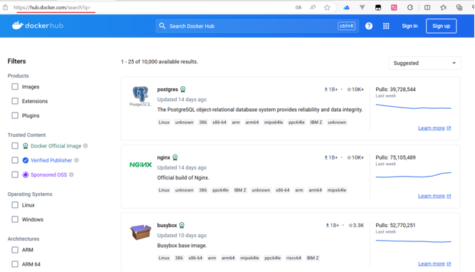

> 如下命令：

1. **检索**:  `docker search`
2. **下载**:  `docker pull`
3. **列表**:  `docker images`
4. **删除**:  `docker rmi`

`镜像名:标签(版本)`

## 启动容器

> 根据下载的镜像（就像是软件包），启动容器（就是**启动程序**）；
> 
> 配合如下命令：

1. **运行**:   docker run
  1. 重点注意：**端口映射**和**目录挂载**
  2. `docker run [``OPTIONS``] ``IMAGE ``[COMMAND] [ARG...]`：
    - []代表可选
    - **options**：选项；
    - `COMMAND`：命令；默认运行什么命令**容器**才能启动；用镜像(软件包)中的哪个命令才能让软件启动（镜像官方默认指定的，除非我们自己要修改）
    - `ARG`：命令要用的参数；（镜像官方默认指定的，除非我们自己要修改）
    - **最简单的启动命令**：`docker run nginx:1.29.0`
    - **比较完整的启动命令**：`docker run -d -p 80:80 --name mynginx nginx:1.29.0`
      - `--name`：给容器指定名字
      - `-d`：在后台启动
      - `-p 80:80`：端口映射，机器外部的80端口，对应容器内部80
      - `--restart awlays`：只要容器出错、重新开关机，容器都自动启动
      - 重复启动一个集群化的；注意以下几点
        - **容器名不能重复**
        - **外部端口不能重复**
2. **查看**:   docker ps
  1. `docker ps`：查看运行中的容器
  2. `docker ps -a`：查看所有容器
3. **停止**:   docker stop
4. **启动**:   docker start
5. **重启**:   docker restart
6. **状态**:   docker stats
7. **日志**:   docker logs
8. **进入**:   docker exec
  1. `docker exec -it 容器名/id /bin/bash`：进入指定容器内部

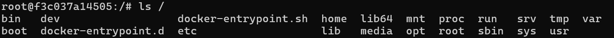
9. **删除**:   docker rm
  1. `docker rm -f  容器名/id`：强制删除
  2. `docker rm -f $(docker ps -aq)`：强制删除所有容器(无论是否在运行)
  3. `docker rm -f $(docker ps -q)`**：强制删除所有运行中的容器**

> 端口映射&目录挂载

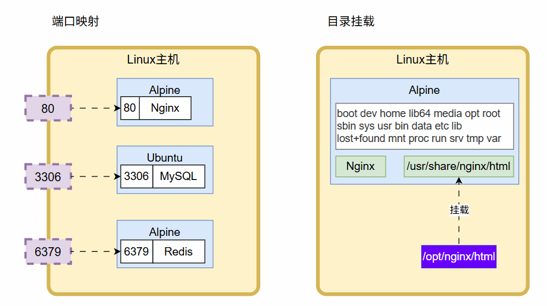

## 修改页面

> 容器就像是一个小的虚拟机，改容器的内容，需要进入容器里面

1. **进入**:   docker exec

nginx页面在：`/usr/share/nginx/html`；这个在官方镜像页面有说明

## 保存镜像

> 容器内容发生修改后，可以对其进行保存；用到如下命令

1. **提交**:   `docker commit`
  1. 把容器的修改变更提交；保存成一个新镜像
  2. `docker commit -a leifengyang mynginx leinginx:v1.0`：
    - `-a`：指定作者名
    - `mynginx`**: 容器名**
    - `leinginx:v1.0`**：新镜像名**

==== **以物理文件方式传递** ====

1. **保存**:   docker save； 把镜像保存成压缩包
  1. `docker save -o leinginx.tar  leinginx:v1.0`**: 把leinginx:v1.0 制作成一个 **`leinginx.tar`
2. **加载**:   docker load； 把压缩包解析为镜像
  1. `docker load -i leinginx.tar`
  2. 然后按照这个镜像启动就可以；

## 分享镜像

> 镜像可以分享到 hub.docker.com 等地方，方便其他人下载使用

1. **登录**:   docker login：
  1. 按照提示输入账号密码即可
2. **命名**:   docker tag
  1. `leinginx:v1.0` 改名为   `leifengyang/leinginx:v1.0`
  2. `docker tag leinginx:v1.0 leifengyang/leinginx:v1.0`
3. **推送**:   docker push
  1. `docker push leifengyang/leinginx:v1.0`
4. **给镜像写一个readme 说明书**；
  1. 全世界都可以搜到我们的镜像。按照我们的说明书去启动镜像

## 常用命令汇总图

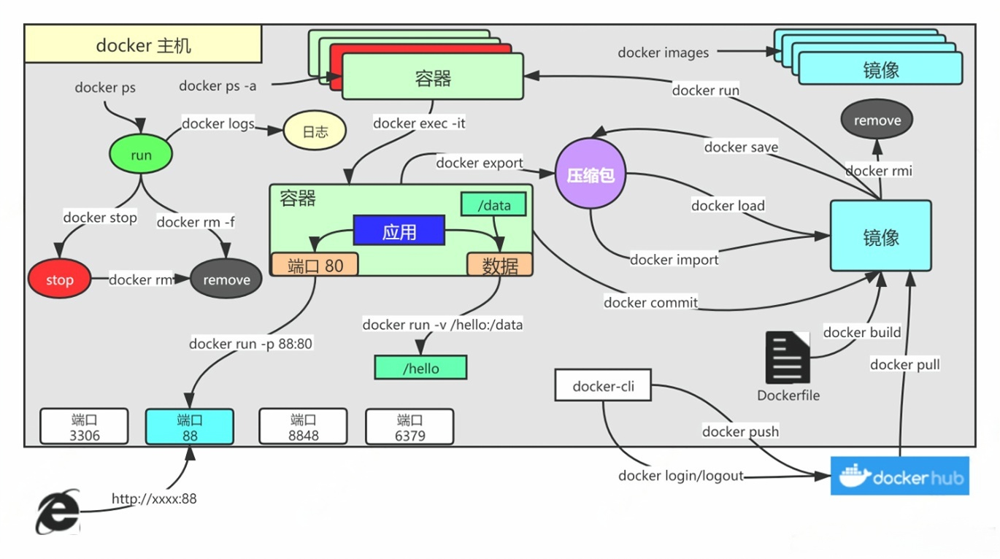

# Docker 存储

> Docker中支持多种存储机制。
> 
> - **Linux挂载机制**：
>   - **万物皆文件**。插入Upan。把upan设备得挂载到一个文件夹中，进入文件夹就是读写U盘数据
> - **Docker挂载进制**：
>   - Docker启动的容器，就是一个小型的Linux系统。
>   - 把Docker容器中文件系统的某个位置，挂载到宿主机。直接修改宿主机的位置，容器跟着变
> 
> 常见使用`目录挂载`、`数据卷`，让容器数据不再丢失

## 目录挂载

> `-v /xx` 或者 `-v ./` 以路径方式开始的。Docker将会使用目录挂载规则
> 
> `-v ``外部路径``:``容器内部路径` ：代表外部路径挂载对应内部的一个位置（文件/文件夹都可以）
> 
> - `外部路径`：
>   - **目录挂载**：写 `/ `开头， 以` ./ `开头，以 `盘符:/`； 以外边为准，如果外边没有，容器内部也没有；不适合配置文件的挂载。
>   - **卷映射**：`-v haha:/etc/nginx`；以容器内部为准，把内部默认有的内容复制在外边；
>     - haha真实所在的位置是Docker管理的一个位置：`/var/lib/docker/volumes/你的卷名/_data`
>     - 用户不可以指定卷名对应的真实位置。受docker管理的默认空间
> 
> 这样修改外部就等同于修改内容。内部改变外部也可以看见

## 卷映射

> **目录挂载**由于是**以外部优先。**如果外部没有东西，挂载后导致容器内部也没有。如果是一些配置文件，有可能导致因为没有默认配置存在而使得容器启动失败

> **使用卷映射**，Docker启动容器的时候，会**以容器内部优先**。给**外部创建出初始的所有内容**。
> 
> **卷映射的真实位置**在Docker自己管理的空间里面：`/var/lib/docker/volumes/卷名/_data`

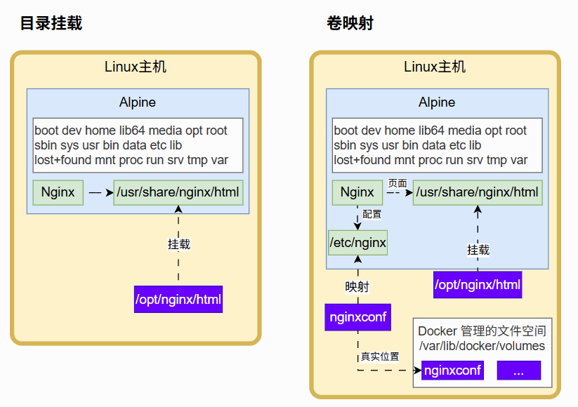

# Docker 网络

## 自定义网络

> Docker可以通过自定义网络，打通容器集群的访问连通性

1. docker为每个**容器分配唯一ip**，使用 容器ip+容器端口 可以互相访问
2. ip由于各种原因可能会变化
3. `docker0`**是默认网络**，不支持主机域名
4. 创建**自定义网络**，**容器名**就是`稳定域名`
  1. **创建网络**：`docker network create haha`
    1. `docker network create --subnet 110.101.0.0/16 haha`
  2. **使用网络**：`docker run --network haha  镜像名`

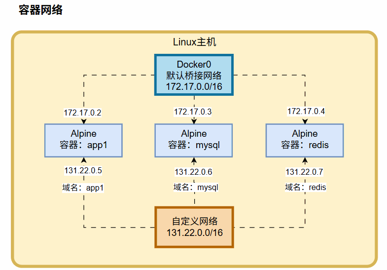

## 模拟Redis集群

```shell
# master 环境变量
REDIS_REPLICATION_MODE=master
REDIS_PASSWORD=123456


# slave 环境变量
REDIS_REPLICATION_MODE=slave
REDIS_MASTER_HOST=redis01
REDIS_MASTER_PORT_NUMBER=6379
REDIS_MASTER_PASSWORD=123456
REDIS_PASSWORD=123456
```

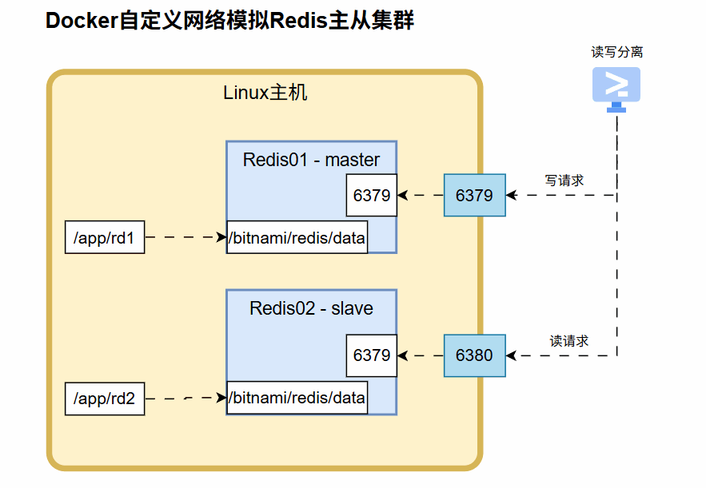

# 最佳实践

> 通过命令启动一个容器，关注这几点：
> 
> 1. **端口**：暴露哪些端口
> 2. **挂载**：需要把数据挂载外面，防止丢失
>   1. **数据**：容器运行时的数据。比如MySQL、Redis等的数据目录
>   2. **配置**：每个容器配置文件位置。比如 `nginx.conf`
> 3. **环境变量**：环境变量是临时改变配置的一种方式

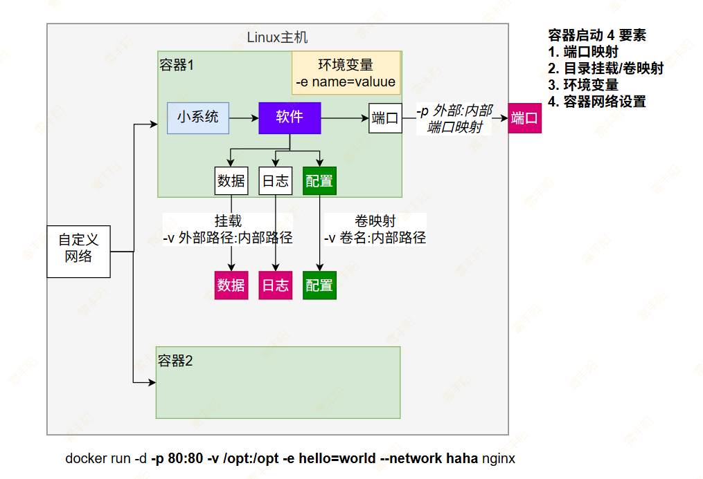

```shell
docker run \
-d -p 3306:3306 \
-v /opt/mysql/data:/var/lib/mysql \
-v /opt/mysql/conf:/etc/mysql/conf.d \
-e MYSQL_ROOT_PASSWORD=123456 \
--name mysql \
mysql:8.0.43-debian
```

> windows下的docker

```shell
docker run -d -p 3333:3306 -v D:\opt\mysql\data:/var/lib/mysql -v D:\opt\mysql\conf:/etc/mysql/conf.d -e MYSQL_ROOT_PASSWORD=123456 mysql:8.0.43-debian
```

# Docker Compose

> Docker Compose 是Docker用来`批量管理容器`（批量创建、启动、销毁等）的技术。

## 使用方式

1. 编写 `compose.yaml`
  1. https://docs.docker.com/reference/compose-file/
  2. 7个顶级元素：`name、version、services、networks、volumes、configs、secrets`

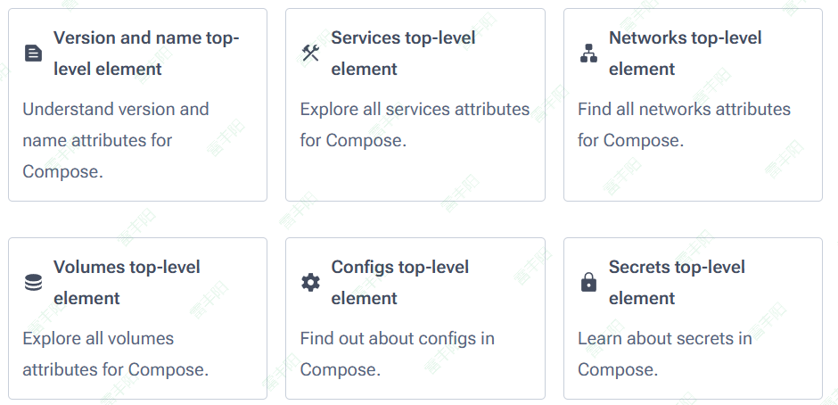

1. 使用以下命令
  1. **上线**：`docker compose up -d`
  2. **下线**：`docker compose down`
  3. **启动**：`docker compose start  x1 x2 x3`
  4. **停止**：`docker compose stop x1  x3`
  5. **扩容**：`docker compose scale x2=3`; `docker swarm 小集群`

## Wordpress 案例

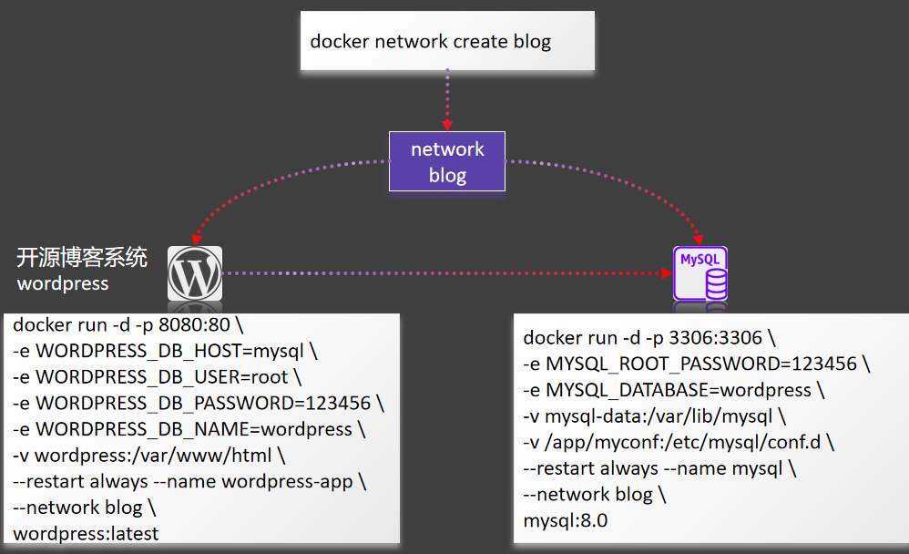

### 命令行启动

```bash
#创建网络
docker network create blog

#启动mysql
docker run -d -p 3306:3306 \
-e MYSQL_ROOT_PASSWORD=123456 \
-e MYSQL_DATABASE=wordpress \
-v mysql-data:/var/lib/mysql \
-v /app/myconf:/etc/mysql/conf.d \
--restart always --name mysql \
--network blog \
mysql:8.0

#启动wordpress
docker run -d -p 8080:80 \
-e WORDPRESS_DB_HOST=mysql \
-e WORDPRESS_DB_USER=root \
-e WORDPRESS_DB_PASSWORD=123456 \
-e WORDPRESS_DB_NAME=wordpress \
-v wordpress:/var/www/html \
--restart always --name wordpress-app \
--network blog \
wordpress:latest
```

> windows下

```shell
docker network create blog
docker run -d -p 3316:3306 -e MYSQL_ROOT_PASSWORD=123456 -e MYSQL_DATABASE=wordpress  -v mysql-data:/var/lib/mysql -v /app/myconf:/etc/mysql/conf.d --restart always --name mysql --network blog mysql:8.0
docker run -d -p 8080:80 -e WORDPRESS_DB_HOST=mysql -e WORDPRESS_DB_USER=root -e WORDPRESS_DB_PASSWORD=123456 -e WORDPRESS_DB_NAME=wordpress -v wordpress:/var/www/html --restart always --name wordpress-app --network blog wordpress:latest
```

### compose一键启动

> compose.yaml 内容如下； 使用 `docker compose -f compose.yaml up -d`一键启动所有容器
> 
> 容器启动：（**卷映射、网络、容器** 谁先创建好？**卷和网络先创建好，再创建容器**）；

```yaml
name: myblog
services:
  mysql:
    container_name: mysql
    image: mysql:8.0
    ports:
      - "3306:3306"
    environment:
      - MYSQL_ROOT_PASSWORD=123456
      - MYSQL_DATABASE=wordpress
    volumes:
      - mysql-data:/var/lib/mysql
      - /app/myconf:/etc/mysql/conf.d
    restart: always
    networks:
      - blog

  wordpress:
    image: wordpress
    ports:
      - "8080:80"
    environment:
      WORDPRESS_DB_HOST: mysql
      WORDPRESS_DB_USER: root
      WORDPRESS_DB_PASSWORD: 123456
      WORDPRESS_DB_NAME: wordpress
    volumes:
      - wordpress:/var/www/html
    restart: always
    networks:
      - blog
    depends_on:
      - mysql

volumes:
  mysql-data:
  wordpress:

networks:
  blog:
```

## 一键启动超多组件

> 项目中要用到很多组件：MySQL、Redis、Minio、MongoDB、ElasticSearch、RabbitMQ

> **使用场景**：写一个 compose.yaml 文件，拿到这个文件，一键批量启动即可。开发环境就ok了

# Dockerfile

> 通过编写Dockerfile，我们可以制作自己的镜像

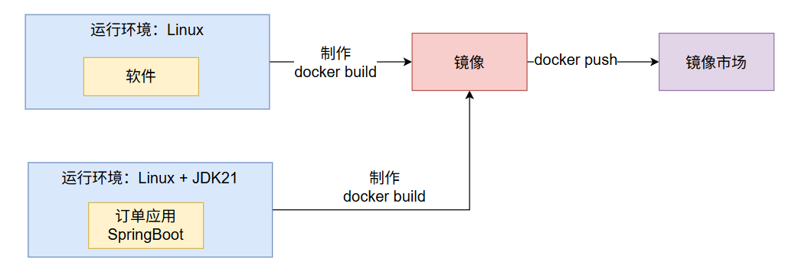

## 基本语法

`Dockerfile`语法：https://docs.docker.com/reference/dockerfile/

| 常见指令 | 作用 |
| --- | --- |
| FROM | 指定镜像基础环境 |
| RUN | 运行自定义命令 |
| CMD | 容器启动命令或参数 |
| LABEL | 自定义标签 |
| EXPOSE | 指定暴露端口 |
| ENV | 环境变量 |
| ADD | 添加文件到镜像 |
| COPY | 复制文件到镜像 |
| ENTRYPOINT | 容器固定启动命令 |
| VOLUME | 数据卷 |
| USER | 指定用户和用户组 |
| WORKDIR | 指定默认工作目录 |
| ARG | 指定构建参数 |

## 打包案例

> 如下是一个SpringBoot应用，依赖jdk17；把他如何打包成镜像，发布出去

[📎 app.jar](<files/app.jar>)

### 编写Dockerfile

```shell
FROM openjdk:17
LABEL author=leifengyang
COPY app.jar /app.jar
EXPOSE 8080
ENTRYPOINT ["java","-jar","/app.jar"]
```

### 构建镜像

`docker build -f Dockerfile -t app:v1.0 .`

- `-f`：指定`Dockerfile`文件名，不写默认是Dockerfile
- `-t`：指定镜像标签名
- `.`：镜像打包的工作目录

## 镜像分层存储原理

> **缓存**：**Redis**；

### 指令与镜像分层

> 打包镜像：
> 
> 1. 准备一个操作系统
> 2. 给操作系统中安装环境 + 软件
> 3. 把整个打包
> 
> **构建缓存**（**相同层会共用**）：多个镜像在构建的时候，有些层是一样的，就可以共用

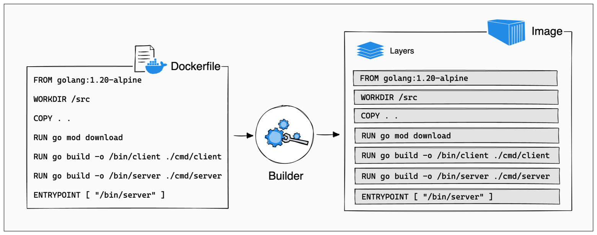

### 公共层

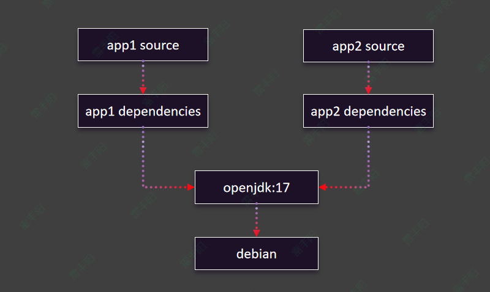

### 镜像层与容器层

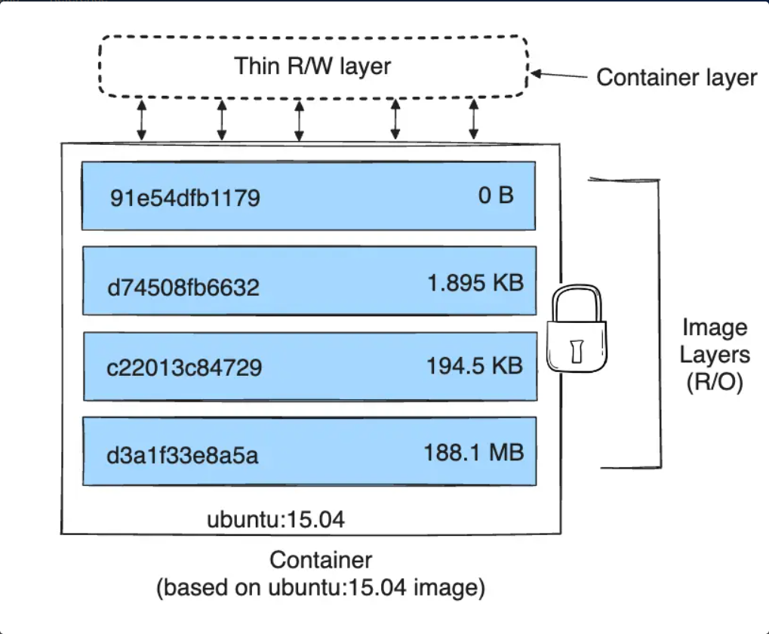

### 多容器与镜像

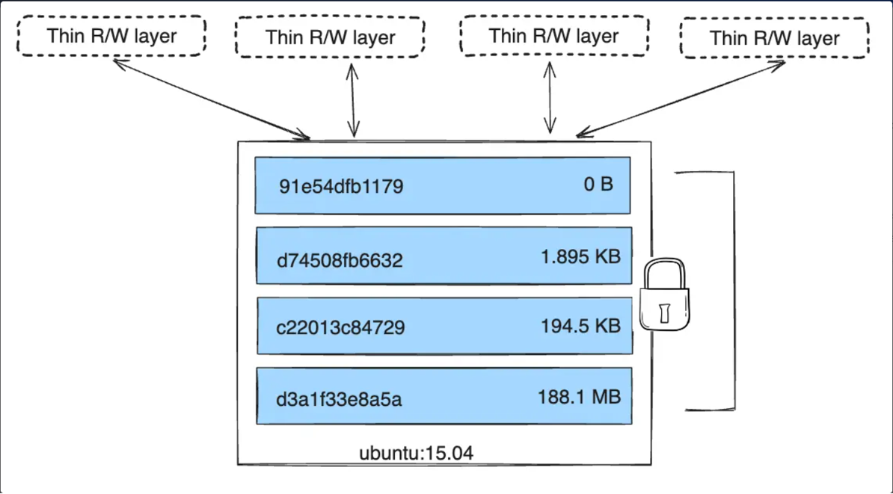

# 总结

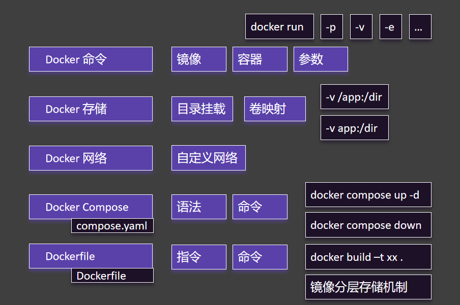