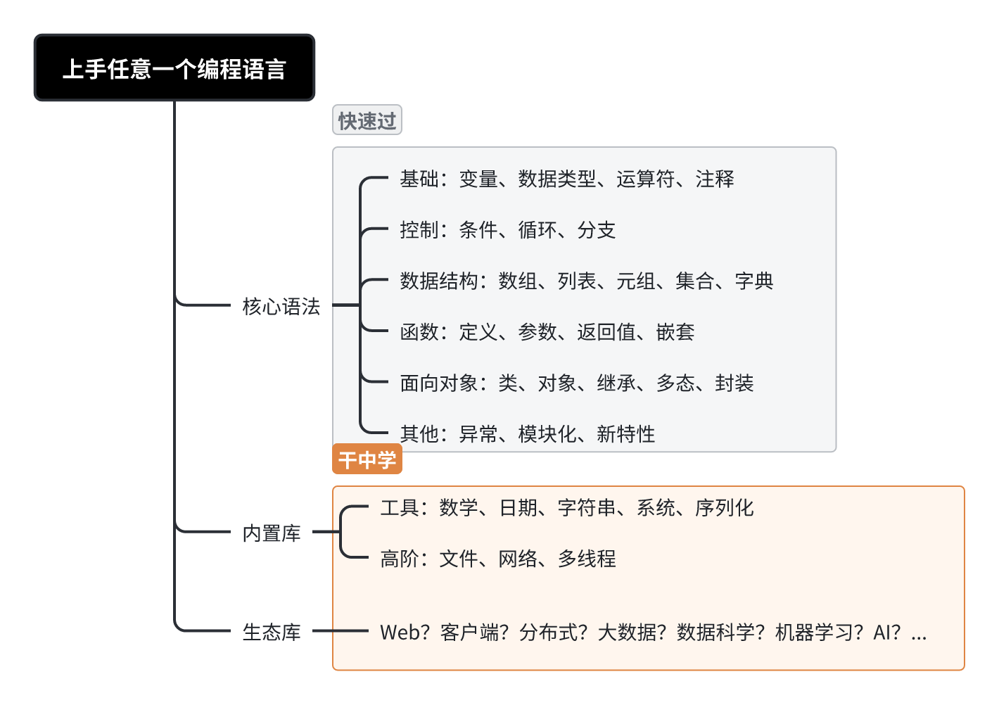
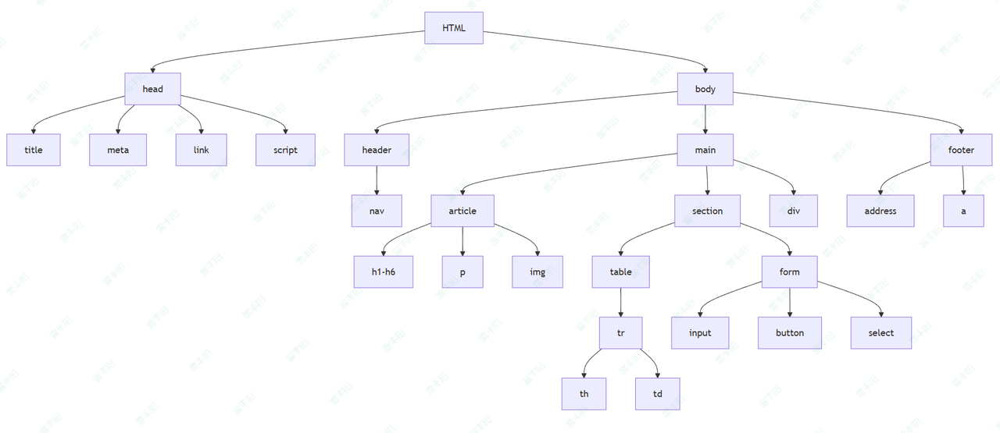
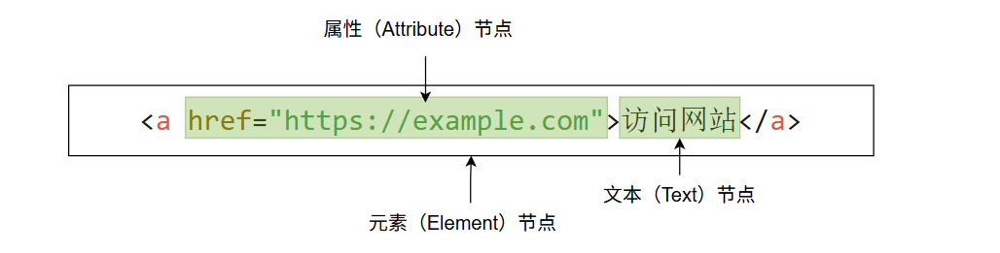
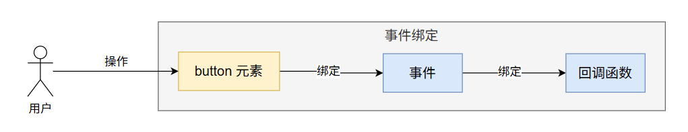
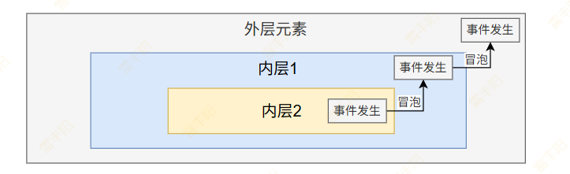

# 2. JavaScript

JS参考手册：https://developer.mozilla.org/zh-CN/docs/Web/JavaScript/Reference

JS官方指南：https://developer.mozilla.org/zh-CN/docs/Web/JavaScript/Guide

> **JavaScript **标准是 [<u>ECMAScript 语言规范</u>](https://tc39.es/ecma262/)（ECMA-262）和 [<u>ECMAScript 国际化 API 规范</u>](https://tc39.es/ecma402/)（ECMA-402）。 ES5、ES6、ES7

如何学习一门新的编程语言；

[👽 Go 快速通关：AI 提示词学习法](https://shenma-docs.feishu.cn/wiki/TdcpwTMaXiunSJkJfD3cNFPHndc?fromScene=spaceOverview)



> AI + 提示词：**编写一个 .js 文件，演示js的所有语法**

# 基本语法

```javascript
// JavaScript语法演示
//控制台打印
console.log("哈哈")
//弹窗
alert("你好")

// 1. 变量声明
// 使用var声明变量 (ES5)
var x = 10;
// 使用let声明块级作用域变量 (ES6)
let y = 20;
// 使用const声明常量 (ES6)
const z = 30;

// 2. 数据类型
// 基本数据类型
let str = "字符串";
let num = 123;
let bool = true;
let n = null;
let u = undefined;
let sym = Symbol('唯一标识');
// 引用数据类型
let obj = { name: "对象" };
let arr = [1, 2, 3];
let func = function() { };

// 3. 运算符
// 算术运算符
let sum = 1 + 2;
// 比较运算符
let isEqual = 1 === '1'; // false
// 逻辑运算符
let and = true && false;
// 三元运算符
let result = condition ? '真' : '假';

// 4. 控制结构
// if语句
if (condition) { /* 代码 */ }
// switch语句
switch(value) {
    case 1: break;
    default: break;
}
// for循环
for (let i = 0; i < 10; i++) {
    // break, continue, return 和java用法一样
 }
// while循环
while (condition) { 

}

// 5. 函数
// 函数声明
function add(a, b) { return a + b; }
// 函数表达式
const multiply = function(a, b) { return a * b; };
// 箭头函数 (ES6)
const divide = (a, b) => a / b;

// 6. 对象和类
// 对象字面量
let person = {
    name: "张三",
    age: 30,
    greet: function() { console.log('你好!'); }
};
// 类 (ES6)
class Animal {
    constructor(name) { this.name = name; }
    speak() { console.log(this.name + '发出声音'); }
}

// 7. 数组方法
let numbers = [1, 2, 3];
// map方法
let doubled = numbers.map(n => n * 2);
// filter方法
let evens = numbers.filter(n => n % 2 === 0);
// reduce方法
let total = numbers.reduce((acc, n) => acc + n, 0);

// 8. 异步编程
// 回调函数
setTimeout(() => { console.log('延迟执行'); }, 1000);
// Promise
new Promise((resolve, reject) => {
    setTimeout(() => resolve('成功'), 1000);
}).then(result => console.log(result));
// async/await (ES7)
async function fetchData() {
    let response = await fetch('api/data');
    let data = await response.json();
    return data;
}

// 9. 模块化
// 导出模块
export const pi = 3.14;
export function circleArea(r) { return pi * r * r; }
// 导入模块
// import { pi, circleArea } from './math.js';

// 10. 错误处理
try {
    // 可能出错的代码
} catch (error) {
    console.error('捕获错误:', error);
} finally {
    console.log('总是执行');
}

// 11. 其他特性
// 解构赋值
let [a, b] = [1, 2];
let {name, age} = person;
// 展开运算符
let newArr = [...arr, 4, 5];
let newObj = {...person, gender: '男'};
// 模板字符串
let greeting = `你好，${person.name}！`;

console.log('JavaScript语法演示完成');
```

# JS位置

1. 使用` <script> `标签编写在页面内
2. 独立` .js `文件，页面使用` <script> `标签 引用

# DOM

## 基本概念

https://developer.mozilla.org/zh-CN/docs/Web/API/Document_Object_Model/Introduction

> **Document Object Model**：**文档对象模型**；整个文档当成一个对象。**对象**里面包含**很多元素**（标签），每个元素又有自己的**属性和值**、以及**标签体中的内容**；

DOM 将 HTML 或 XML 文档表示为一个树形结构，其中：

- **文档****（Document）**是**树的根节点**。
- 每个**元素（Element）**和**文本（Text）**都是树中的节点。
- **属性（Attribute）**也可以作为节点，但它们通常是元素节点的附属。

> 层级嵌套关系图



> **元素节点**构成



```html
<html>
  <head>
    <title>Page Title</title>
  </head>
  <body>
    <h1>This is a heading</h1>
    <p>This is a paragraph.</p>
  </body>
</html>
```

> DOM 关系图

```html
Document
  ├── html
  │   ├── head
  │   │   └── title
  │   └── body
  │       ├── h1
  │       └── p
```

## DOM操作

> JavaScript可以访问DOM节点，进行修改、删除或添加节点，甚至改变样式

### 获取dom元素

```javascript
//1、通过ID访问元素：
const element = document.getElementById('myElement');
//2、通过类名访问元素：
const elements = document.getElementsByClassName('myClass');
//3、通过标签名访问元素
const elements = document.getElementsByTagName('p');
//4、通过选择器（querySelector）访问元素
const element = document.querySelector('.myClass');  // 选择第一个匹配的元素
const elements = document.querySelectorAll('p');    // 选择所有匹配的元素
```

### 修改元素内容

```javascript
//1、修改文本内容：
document.getElementById('myElement').textContent = '新内容';
//2、修改HTML内容：
document.getElementById('myElement').innerHTML = '<p>新HTML内容</p>';
```

### 修改元素样式

```javascript
//1、直接用sytle属性修改即可
document.getElementById('myElement').style.color = 'red';
```

### 添加或删除元素

```javascript
//1、创建新元素并添加
const newElement = document.createElement('div');
newElement.textContent = '这是一个新元素';
document.body.appendChild(newElement);
//2、删除元素
const element = document.getElementById('myElement');
element.remove();
```

### 元素属性操作

```javascript
//1、修改元素属性：
const element = document.getElementById('myElement');
element.setAttribute('class', 'newClass');

//2、获取元素属性：
const classValue = document.getElementById('myElement').getAttribute('class');
```

### 事件绑定

```javascript
document.getElementById('myElement').addEventListener('click', function() {
  alert('元素被点击了！');
});
```

## 内置对象

除了 `document` 这样的 DOM 对象，JavaScript 还有很多**内置对象**，这些对象可以帮助你更好地与浏览器进行交互、处理数学运算、日期时间、JSON 数据等。常见的内置对象包括：

- `window`：表示浏览器窗口。
- `navigator`：提供浏览器和操作系统的相关信息。
- `location`：控制当前页面的 URL。
- `history`：访问和操作浏览器历史记录。
- `console`：用于输出调试信息。
- `screen`：获取用户屏幕的相关信息。
- `JSON`：用于处理 JSON 数据。
- `Math`：提供数学计算的方法。
- `Date`：用于处理日期和时间。

# 事件

> 在JavaScript中，**事件**通常与**DOM元素**相关联。当特定的**事件发生时**，浏览器会触发一个**事件对象**，这个事件对象包含了**事件的相关信息（如事件类型、目标元素、鼠标位置等）**。**事件**可以由**用户触发**，也可以通过JavaScript代码进行**触发**。

## 常见事件

> **事件名**绑定函数用的

- **鼠标事件**：
  - `click`：鼠标点击元素时触发。
  - `dblclick`：鼠标双击时触发。
  - `mouseover`：鼠标指针移到元素上时触发。
  - `mouseout`：鼠标指针离开元素时触发。
  - `mousemove`：鼠标移动时触发。
  - `mousedown`：鼠标按钮按下时触发。
  - `mouseup`：鼠标按钮释放时触发。
- **键盘事件**：
  - `keydown`：按下键盘上的任意键时触发。
  - `keyup`：键盘上的任意键松开时触发。
  - `keypress`：按下并保持某个键时触发（已不推荐使用，最好使用 `keydown` 或 `keyup`）。
- **表单事件**：
  - `submit`：表单提交时触发。
  - `input`：输入框内容变化时触发。
  - `change`：表单元素的值改变时触发。
  - `focus`：元素获得焦点时触发。
  - `blur`：元素失去焦点时触发。
- **窗口事件**：
  - `load`：页面或某个资源加载完成时触发。
  - `resize`：浏览器窗口调整大小时触发。
  - `scroll`：滚动条滚动时触发。
- **触摸事件（用于移动端）**：
  - `touchstart`：触摸开始时触发。
  - `touchmove`：触摸移动时触发。
  - `touchend`：触摸结束时触发。

> Swing；

## 事件绑定



```javascript
//1、内联绑定
<button onclick="alert('按钮被点击了！')">点击我</button>

//2、事件属性
document.getElementById('myButton').onclick = function() {
  alert('按钮被点击了！');
};

//3、DOM事件监听处理程序
document.getElementById('myButton').addEventListener('click', function() {
  alert('按钮被点击了！');
});
```

## 事件对象

当**事件发生**时，JavaScript会**生成**一个**事件对象**，它包含了与事件相关的各种信息，如**事件类型**、**目标元素**、**鼠标坐标**等。常见的属性包括：

- `type`：事件的类型，如`click`、`keydown`等。
- `target`：触发事件的元素。
- `currentTarget`：当前正在处理事件的元素。
- `clientX`、`clientY`：鼠标点击位置相对于浏览器视口的坐标。
- `key`：按下的键名（用于键盘事件）。

```javascript
document.getElementById('myButton').addEventListener('click', function(event) {
  alert('点击位置的坐标：' + event.clientX + ', ' + event.clientY);
});
```

## 事件冒泡



```javascript
//1、停止事件传播（阻止冒泡）
event.stopPropagation();
```

## 阻止默认行为

form表单点击提交、a链接点击跳转；我们有时候需要阻止他们的这些默认行为

```javascript
event.preventDefault();
```

# JSON

https://www.json.org/json-en.html

> **JSON（JavaScript Object Notation 对象表示法）**是一种**轻量级的数据交换**格式。它易于人类阅读和编写，也便于机器解析和生成。该格式基于 JavaScript 编程语言标准 ECMA-262 第 3 版（1999 年 12 月发布）的子集。**JSON **是一种完全独立于语言的文本格式，但采用了 C 语言家族程序员熟悉的约定，包括 **C、C++、C#、Java、JavaScript、Perl、Python **等多种语言。这些特性使 JSON 成为理想的数据交换语言。

**JSON的特点：**

1. **轻量级**：相较于XML等其他数据交换格式，JSON的数据格式较为简洁。
2. **易于读取和写入**：JSON的数据格式类似于人类的自然语言，易于理解和编辑。
3. **兼容性强**：虽然JSON最初是为JavaScript设计的，但它现在被许多编程语言支持，包括Python、Java、PHP、Ruby等。
4. **结构化**：JSON使用键值对的方式存储数据，支持嵌套的对象和数组。

## 基础语法

JSON由两种基本的数据结构组成：

1. **对象（Object）**：由一对大括号 `{}` 包含，内部是**键值对**（key-value pair）。每个**键**必须是一个**字符串**，键与值之间通过冒号 `:` 分隔，不同的键值对之间用逗号 `,` 分隔。
  - 例子：`{ "name": "Alice", "age": 25 }`
2. **数组（Array）**：由一对中括号 `[]` 包含，内部是一个或多个值，值之间用逗号 `,` 分隔。
  - 例子：`[ "apple", "banana", "cherry" ]`

JSON数据的有效**值类型**可以是：

- **字符串**（String）：一对双引号包裹的字符序列。
- **数字**（Number）：整数或浮动小数。
- **布尔值**（Boolean）：`true` 或 `false`。
- **数组**（Array）：包含多个值的有序集合。
- **对象**（Object）：包含键值对的无序集合。
- **空值**（null）：表示无值。

## JSON案例

### 对象

```javascript
{
  "name": "Alice",
  "age": 25,
  "isStudent": false
}
```

### 嵌套对象

```json
{
  "name": "Alice",
  "address": {
    "street": "123 Main St",
    "city": "Wonderland",
    "postalCode": "12345"
  }
}
```

### 对象中的数组

```json
{
  "name": "Alice",
  "friends": ["Bob", "Charlie", "David"]
}
```

### 数组中的对象

```json
{
  "name": "Alice",
  "friends": [
    { "name": "Bob", "age": 28 },
    { "name": "Charlie", "age": 30 },
    { "name": "David", "age": 35 }
  ]
}
```

### 与JS对象的关系

**JSON是JS对象的字符串表示方式**；类似与Java中的toString()方法一样；

- JSON 是一种**数据表示格式**，而 JavaScript 对象是 JavaScript 中的一个数据结构。
- JSON 是**字符串形式的数据**，必须遵循特定的语法规则（比如：属性名必须使用双引号），而 JavaScript 对象是代码中可以直接使用的对象，不需要引号（属性名可以是未加引号的标识符）。

## 转换

### **将****JavaScript对象****转换为****JSON字符串**

使用 `JSON.stringify()` 方法将 JavaScript 对象转换为 JSON 格式的字符串。

```sql
const person = {
  name: "Alice",
  age: 25,
  isStudent: false
};

const jsonString = JSON.stringify(person);
console.log(jsonString);
// 输出： {"name":"Alice","age":25,"isStudent":false}
```

### **将JSON字符串****转换为****JavaScript对象**

使用 `JSON.parse()` 方法将 JSON 格式的字符串转换为 JavaScript 对象。

```thrift
const jsonString = '{"name":"Alice","age":25,"isStudent":false}';
const person = JSON.parse(jsonString);
console.log(person);
// 输出： { name: 'Alice', age: 25, isStudent: false }
```

## 思考

**Java对象**、**JS对象**、**Map** 用来**封装数据**；是不是本质就是一回事！

1. 服务器：**Java对象 ---> JSON 字符串 ---> 交给前端 ---> JS对象 --> 前端直接.属性就能用**
2. 前端：**JS对象 ---> JSON字符串 ---> 交给服务器 ---> Java对象 ---> 服务器直接.属性使用**

# 正则表达式

正则表达式（Regular Expressions）一般用来做**数据校验**，或者字符串中的文本替换；**文本处理的瑞士军刀**

## 正则语法

```javascript
const regex = /pattern/flags; // pattern：模式  flags：标志
// 举例： 匹配邮箱的正则
const emailRegex = /^\w+@\w+\.[a-z]{2,}$/i;
```

### 常用标志（flags）

| 标志 | 作用 | 示例 |
| --- | --- | --- |
| i | 忽略大小写 | /hello/i |
| g | 全局匹配（所有匹配项） | /a/g |
| m | 多行模式（^ 和 $ 匹配每行） | /^start/m |
| u | Unicode 支持（处理 Unicode 字符） | /\p{Emoji}/u |

### 字符匹配

| 表达式 | 含义 | 示例 |
| --- | --- | --- |
| . | 匹配任意单个字符（除换行符） | /.at/ → "cat", "bat" |
| \d | 数字（等价于 [0-9]） | \d{3} → "123" |
| \w | 单词字符（字母、数字、下划线） | \w+ → "hello_123" |
| \s | 空白字符（空格、制表符等） | \s+ → " " |
| [abc] | 匹配括号内任意字符 | [aeiou] → "a" 或 "e" |
| [^abc] | 匹配​​不在​​括号内的字符 | [^0-9] → "a", "!" |

### 量词

| 表达式 | 含义 | 示例 |
| --- | --- | --- |
| * | 0 次或多次 | a* → "", "a", "aaa" |
| + | 1 次或多次 | \d+ → "1", "123" |
| ? | 0 次或 1 次 | colou?r → "color" 或 "colour" |
| {n} | 恰好 n 次 | \d{4} → "2024" |
| {n,} | 至少 n 次 | a{2,} → "aa", "aaa" |
| {n,m} | n 到 m 次 | \d{2,4} → "12", "1234" |

### 位置锚点

| 表达式 | 含义 | 示例 |
| --- | --- | --- |
| ^ | 字符串起始 | ^Hello → 匹配以 "Hello" 开头的字符串 |
| $ | 字符串结束 | end$ → 匹配以 "end" 结尾的字符串 |
| \b | 单词边界 | \bword\b → 匹配独立单词 "word" |

### 分组与捕获

- `( )`：捕获分组（可获取到匹配的内容）
```javascript
'2024-05-01'.match(/(\d{4})-(\d{2})-(\d{2})/);
// 结果: ["2024-05-01", "2024", "05", "01"]
```
- `(?: )`：非捕获分组（不可获取到匹配的内容）；如：`/(?:ab)+/` → 匹配 "abab" 但不捕获子组

| 概念 | 语法 | 作用 | 是否捕获内容 |
| --- | --- | --- | --- |
| ​​基本分组​​ | ( ) | 组合字符模式 | 是 |
| ​​非捕获分组​​ | (?:) | 组合但不保存匹配 | 否 |
| ​​命名捕获组​​ | (?<name>) | 给捕获组命名 | 是 |

## 常用方法

```javascript
//1、test(): 检测字符串是否匹配（返回 true/false）
const regx01 = /hello/.test("hello world"); // true

//2、exec(): 获取匹配细节（返回数组或 null）
const regx02 = /d(b+)d/g.exec("cdbbdbsbz"); // result: ["dbbd", "bb", index: 1, ...]

//3、match(): 提取匹配结果
const regx03 = "123 abc".match(/\d+/g); // ["123"]

//4、search(): 返回首个匹配索引（未找到返回 -1）
"abc".search(/b/); // 1

//5、replace(): 替换匹配内容
"hello".replace(/l/g, "!"); // "he!!o"

//6、split(): 用正则分隔字符串
"a,b;c".split(/[,;]/); // ["a", "b", "c"]

```

## 常见案例

```javascript
//1、验证邮箱
const emailPattern = /^\w+([\.-]?\w+)*@\w+([\.-]?\w+)*(\.\w{2,})+$/;
emailPattern.test("user@example.com"); // true

//2、提取 URL 协议和域名
const urlPattern = /^(https?):\/\/([^\/?#]+)/;
const matches = "https://www.example.com".match(urlPattern);
// matches[1] = "https", matches[2] = "www.example.com"

//3、移除多余空格
"   Hello  World  ".replace(/\s+/g, ' ').trim(); // "Hello World"
```

# 综合练习

> 做一个**员工CRUD的表格；**添加CRUD按钮，实现功能

1. 让AI写一个HTML。包含一个员工表格，以及增删改查按钮，不用写js的实现
2. 自己绑事件做crud

```xml
<!DOCTYPE html>
<html lang="zh-CN">
<head>
    <meta charset="UTF-8">
    <meta name="viewport" content="width=device-width, initial-scale=1.0">
    <title>员工管理系统</title>
    <style>
        table {
            border-collapse: collapse;
            width: 100%;
            margin-bottom: 20px;
        }
        th, td {
            border: 1px solid #ddd;
            padding: 8px;
            text-align: left;
        }
        th {
            background-color: #f2f2f2;
        }
        .action-buttons {
            margin-bottom: 20px;
        }
        button {
            padding: 8px 16px;
            margin-right: 10px;
            cursor: pointer;
        }
    </style>
</head>
<body>
    <h1>员工管理系统</h1>
    
    <div class="action-buttons">
        <form action="/save">
            <input id="i01" placeholder="请输入姓名" value="雷丰阳"/>
            <input id="i02" placeholder="请输入部门" value="开放"/>
            <input id="i03" placeholder="请输入职位" value="前端开发"/>
            <input id="i04" placeholder="请输入入职日期" value="2023-01-01"/>
            <input id="i05" placeholder="请输入薪资" value="10000"/>
            <button id="addBtn">添加员工</button>
        </form>
        
    </div>
    
    <table id="employeeTable">
        <thead>
            <tr>
                <th>ID</th>
                <th>姓名</th>
                <th>部门</th>
                <th>职位</th>
                <th>入职日期</th>
                <th>薪资</th>
                <th>操作</th>
            </tr>
        </thead>
        <tbody id="empData">   

        </tbody>
    </table>

    <script>
        let id = 0;
        //获取input的值
        function getInputValue(selector){
            return document.querySelector(selector).value;
        }

        //1、找到添加按钮
        const addBtn = document.querySelector("#addBtn");
        addBtn.onclick = (event)=>{
            id++;
            //阻止表单提交默认行为
            event.preventDefault();
            //2、获取每一项的输入值
            let name = getInputValue("#i01");
            let dept = getInputValue("#i02");
            let job = getInputValue("#i03");
            let hiredate = getInputValue("#i04");
            let salary = getInputValue("#i05");
            console.log(name,dept,job,hiredate,salary);
            
            //3、准备 tr； 把tr放到表格中
            let trStr = `<tr id="emp_${id}">
                <td>${id}</td>
                <td>${name}</td>
                <td>${dept}</td>
                <td>${job}</td>
                <td>${hiredate}</td>
                <td>${salary}</td>
                <td>
                    <button class='delBtn' 
                        onclick='delEmp(${id})'>删除
                    </button>
                </td>
            </tr>`
            //4、把tr放到表格中
            let tbody = document.querySelector("#empData");
            tbody.innerHTML += trStr;
            
        }
    
        //2、找到删除按钮，完成删除； 一个按钮都没有
        //如何绑，构造的时候直接用属性绑定，还能动态传递员工id
        function delEmp(empId){
            alert("删除"+empId)
            const empTr = document.querySelector("#emp_"+empId);
            empTr.remove()
            // 如果tbody没东西了，id重置
            const tbody = document.querySelector("#empData")
            console.log(tbody)

            //去掉空格
            if(tbody.innerHTML.trim() == ""){
                id = 0;
            }
        }
    </script>
</body>
</html>
```