# 1. OpenAI API/SDK（新版）

> OpenAI 有自己的 SDK **（Software Development Kit，软件开发工具包）**。
> 
> `SDK 是对 API 的封装`,让开发者不需要手写复杂的 HTTP 请求,而是用简洁的代码就能调用 API。
> 
> **所以**` OpenAI API `**是对于 ****遵循 OpenAI 接口规范****的所有开发包的统称，也是 **`OpenAI SDK`**的代名词**

官方文档：https://developers.openai.com/api/docs

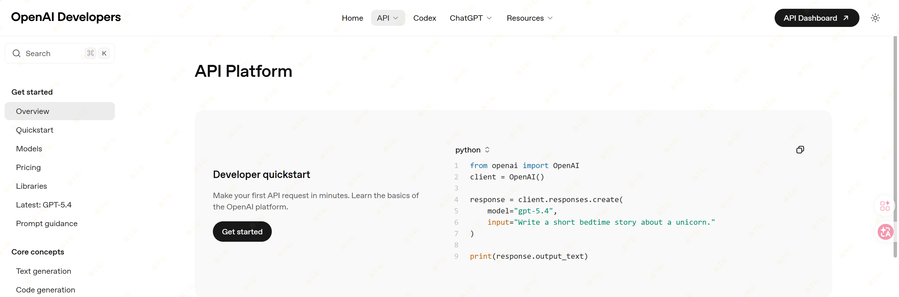

# 快速上手

## 简介

OpenAI API 本质上提供一组“模型能力接口”，主要包括：

1. **文本与对话（最常用）**： 聊天对话（Chat） 、 文本生成（写作、总结、翻译） 、结构化输出（JSON）
2. **图像生成**： 文生图、图像编辑、风格转换
3. **语音能力**：语音转文字（ASR）、文字转语音（TTS）
4. **多模态**：图像 + 文本理解、文件分析（PDF、表格等）
5. **嵌入（Embedding）**：向量化文本（用于搜索、RAG、推荐系统）
6. **工具调用（Function Calling）**：让模型调用你定义的函数（如查天气、查数据库）

> OpenAI 常用接口：（一般各个厂商都支持）
> 
> - `/v1/chat/completions` 核心接口，用于与模型进行对话。
> - `/v1/response` OpenAI 最先进的模型响应生成接口。支持文本和图像输入，以及文本输出。
> - `/v1/models` 用于获取模型列表。

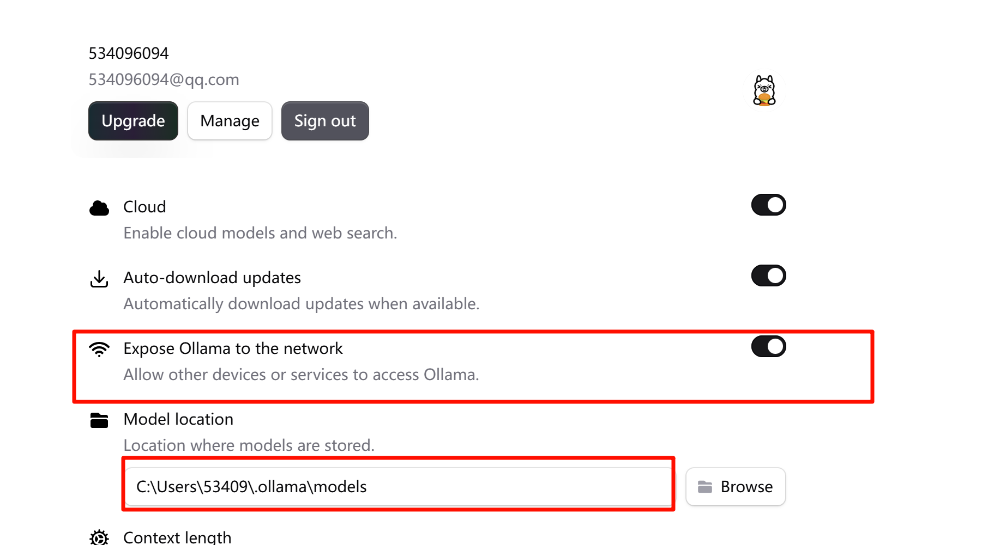

Ollama 暴露到网络： http://localhost:11434

## 环境配置

### Step 1：开通自己的 API_KEY

**更多参考（大模型免费额度汇总）**：[📑 1. 大模型入门课](https://shenma-docs.feishu.cn/wiki/S6glwjLariad6Rk32xfcUFFonBd?larkTabName=space#share-VGVZdMnvGoJKcXx5JDcclNLJniu)

| 平台 | 地址 | api_key | base_url | 模型列表 |
| --- | --- | --- | --- | --- |
| 百炼 | https://bailian.console.aliyun.com/cn-beijing | sk-ccd167dc0a7e446e8f5f0f8d45c31a78 | https://dashscope.aliyuncs.com/compatible-mode/v1 | 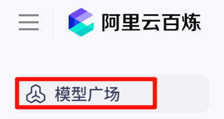 |
| 优云 | https://www.compshare.cn/ | 70rIFOctdoly29uU99BfD680-a32F-46A9-89c7-949a1182 | [https://api.modelverse.cn/v1/chat/completions](https://api.modelverse.cn/v1/chat/completions%EF%BC%88%E5%85%BC%E5%AE%B9OpenAI%E6%A0%BC%E5%BC%8F%EF%BC%89%E3%80%82) | 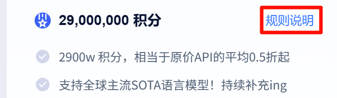 |
| 本地 Ollama | https://ollama.com/ | 随便写 | http://localhost:11434/ | http://localhost:11434/v1/models |

### Step 2：配置 .env

> 创建项目，创建 `.env` 文件

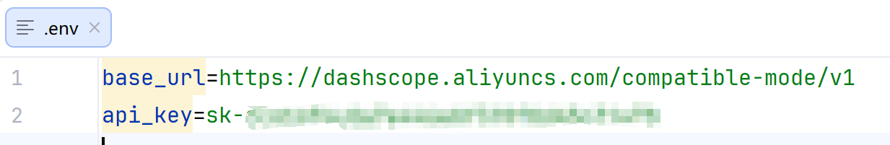

### Step 3：dotenv 加载环境变量

对于 Python 项目,也可以使用 `python-dotenv` 库动态加载 `.env` 文件：

**需要先安装依赖：**`pip install python-dotenv`

```python
from dotenv import load_dotenv
import os

# 加载 .env 文件
load_dotenv(override=True)

# 读取环境变量
api_key = os.getenv("API_KEY")
```

## 快速上手

### 新版：Responses API

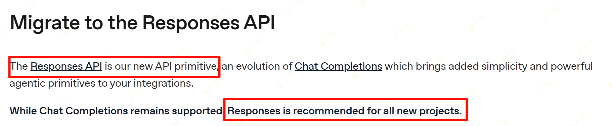

```shell
from openai import OpenAI
from dotenv import load_dotenv
import os

# 读取环境变量
load_dotenv(override=False)

# 创建客户端
client = OpenAI(api_key=os.getenv("API_KEY"),base_url=os.getenv("BASE_URL"))

# 创建模型聊天响应
responses = client.responses.create(
    model="qwen3.5-plus",
    input="介绍下雷丰阳老师"
)

# 获取响应内容
print(responses.output_text)

```

### 旧版：Chat API

> 完整叫：Chat Completions API

```python
from dotenv import load_dotenv
import os

from openai import OpenAI

load_dotenv(override=False)

client = OpenAI(api_key=os.getenv("API_KEY"),base_url=os.getenv("BASE_URL"))

responses = client.chat.completions.create(
    model="qwen3.5-plus",
    messages=[
        {
            "role": "user",
            "content": "介绍下雷丰阳老师",
        }
    ],
    temperature=0.5,
)

print(responses.choices[0].message.content)
```

#### 扩展1 ：`messages` 为什么这么写？

`messages` 参数的这种写法遵循了 `OpenAI API` 的标准规范，原因如下：

1. **结构化对话**：使用列表存储消息序列，确保对话的顺序和上下文
2. **角色明确**：通过 `role` 字段明确区分消息发送者的身份
3. **内容分离**：通过 `content` 字段存储消息的实际内容
4. **多轮对话支持**：列表结构天然支持多轮对话的历史记录

> 比如下面是一个多轮对话的实例

```json
messages=[
    {
        "role": "system",
        "content": "你是一个专业的教育领域助手，回答问题要详细准确。"
    },
    {
        "role": "user",
        "content": "介绍下雷丰阳老师"
    },
    {
        "role": "assistant",
        "content": "雷丰阳老师是国内知名的Java教育专家，阿里巴巴集团技术专家，慕课网金牌讲师，著有《Spring Boot实战》等多本技术书籍。他的课程以实战性强、讲解深入著称，深受学员喜爱。"
    },
    {
        "role": "user",
        "content": "他有哪些代表课程？"
    }
]

```

#### 扩展2：角色说明

| 角色 | 作用 | 使用场景 |
| --- | --- | --- |
| system | 设定助手的行为和个性 | 对话开始时设置，影响整个对话的风格和回答方式 |
| user | 用户的问题或指令 | 每次用户提问时使用 |
| assistant | 助手的回复 | 模型生成的回答，用于多轮对话的历史记录 |
| tool | 工具的执行结果 | 当模型调用工具后，返回工具执行的结果 |

```python
responses = client.chat.completions.create(
    model="qwen3.5-plus",
    messages=[
        {
            "role": "system",
            "content": "你是一个专业但幽默的人物介绍专家",
        },
        {
            "role": "user",
            "content": "介绍下雷丰阳老师",
        }
    ]
)

print(responses.choices[0].message.content)
```

## 本质

> **我们对模型的调用，本质上是给模型服务发送请求；**

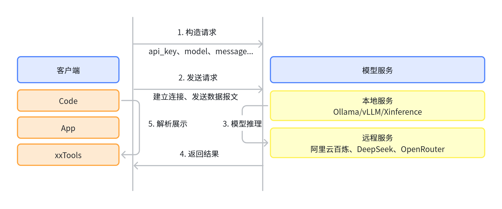

> 我们也可以使用代码模拟发送请求进行测试; 
> 
> 首先安装依赖：`pip install requests`

> 以下是官方文档说明的如何发送请求

```c++
curl -X POST https://dashscope.aliyuncs.com/api/v2/apps/protocols/compatible-mode/v1/responses \
-H "Authorization: Bearer $DASHSCOPE_API_KEY" \
-H "Content-Type: application/json" \
-d '{
    "model": "qwen3.5-plus",
    "input": "你能做些什么？"
}'
```

```python
import  requests

# curl -X POST https://dashscope.aliyuncs.com/api/v2/apps/protocols/compatible-mode/v1/responses \
# -H "Authorization: Bearer $DASHSCOPE_API_KEY" \
# -H "Content-Type: application/json" \
# -d '{
#     "model": "qwen3.5-plus",
#     "input": "你能做些什么？"
# }'

API_KEY = "sk-ccd167dc0a7e446e8f5f0f8d45c31a78"

response = requests.post(
    "https://dashscope.aliyuncs.com/api/v2/apps/protocols/compatible-mode/v1/responses",
    headers={
        "Authorization": f"Bearer {API_KEY}",
        "Content-Type": "application/json"
    },
    json={
        "model": "qwen3.5-plus",
        "input": "你能做些什么？"
    }
)
response_data = response.json()
# 注意：查看完整的json数据结构。然后看看从哪个里面可以解析到内容
print(response_data["output"][1]['content'][0]['text'])
```

# OpenAI  - `responses api` 详解

> **相较于 OpenAI Chat Completions API 的优势：**
> 
> - **内置工具**：内置联网搜索、网页抓取、代码解释器、文搜图、图搜图、知识库搜索等工具，可在处理复杂任务时获得更优效果，详情参考[工具调用](https://help.aliyun.com/zh/model-studio/tool-calls/)。
> - **更灵活的输入**：支持直接传入字符串作为模型输入，也兼容 Chat 格式的消息数组。
> - **简化上下文管理**：通过传递上一轮响应的 `previous_response_id`，无需手动构建完整的消息历史数组。不用手动组装 messages 列表

## 参数项：OpenAI()

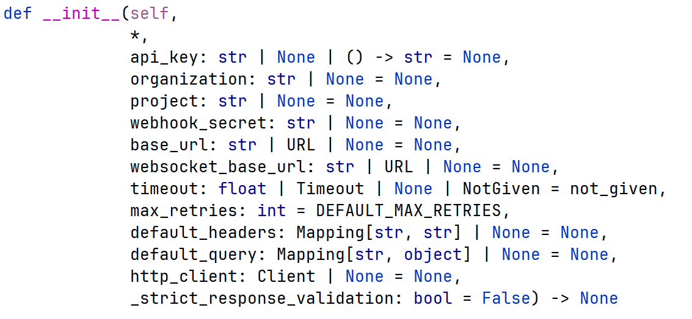

### 配置项：列表

|   | 参数 | 类型 | 环境变量 | 默认值 | 功能说明 |
| --- | --- | --- | --- | --- | --- |
| 身份认证参数 | api_key | str \| Callable[[], str] \| None | OPENAI_API_KEY | None | OpenAI API 密钥，用于身份验证。支持传入字符串或返回字符串的可调用对象（如从密钥管理服务动态获取） |
|   | organization | str \| None | OPENAI_ORG_ID | None | 组织 ID，用于多组织账号场景，指定使用哪个组织的配额和计费 |
|   | project | str \| None | OPENAI_PROJECT_ID | None | 项目 ID，用于项目级别的使用量追踪和成本分摊 |
|   | webhook_secret | str \| None | OPENAI_WEBHOOK_SECRET | None | Webhook 签名验证密钥，用于验证来自 OpenAI 的 webhook 请求的合法性 |
| 网络连接参数 | base_url | str \| httpx.URL \| None | OPENAI_BASE_URL | [https://api.openai.com/v1](https://api.openai.com/v1) | API 服务地址。修改此参数可切换至其他兼容 OpenAI 协议的服务（如 Azure、阿里云、第三方代理等） |
|   | websocket_base_url | str \| httpx.URL \| None | 无 | 从 base_url 派生 | WebSocket 连接地址，用于 Realtime API 等需要 WebSocket 的场景。如未指定，自动将 base_url 的 http:// 替换为 ws://，https:// 替换为 wss:// |
|   | timeout | float \| Timeout \| None | 无 | 600 秒（10分钟） | 请求超时时间。可以是浮点数（秒）或 httpx.Timeout 对象，支持分别设置连接、读取、写入超时 |
|   | http_client | httpx.Client \| None | 无 | 自动创建 | 自定义 HTTP 客户端。可传入配置了连接池、代理、SSL 证书的 httpx.Client 实例，用于高级网络配置 |
| 请求行为参数 | max_retries | int | 无 | 2 | 最大重试次数。遇到连接错误、5XX 服务端错误、429 速率限制时自动重试，采用指数退避策略 |
|   | default_headers | Mapping[str, str] \| None | 无 | None | 默认请求头，会附加到每个 API 请求中。可用于添加自定义标识、追踪 ID 等 |
|   | default_query | Mapping[str, object] \| None | 无 | None | 默认查询参数，会附加到每个请求的 URL 查询字符串中 |

### 配置项：示例

```python
from openai import OpenAI
import httpx

client = OpenAI(
    # 认证
    api_key="sk-xxx",
    organization="org-xxx",              # 多组织时指定
    project="proj_xxx",                  # 项目级追踪
    
    # 网络
    base_url="https://your-proxy.com/v1", # 使用代理中转 [citation:8]
    timeout=httpx.Timeout(                # 精细超时控制 [citation:9]
        connect=5.0,                      # 连接超时
        read=30.0,                        # 读取超时
        write=10.0,                       # 写入超时
        total=60.0                        # 总超时
    ),
    
    # 行为
    max_retries=3,                        # 重试次数 [citation:1]
    default_headers={                     # 自定义请求头
        "X-Custom-Trace-Id": "abc123"
    },
    
    # 高级：自定义HTTP客户端（连接池配置）[citation:9]
    http_client=httpx.Client(
        limits=httpx.Limits(
            max_keepalive_connections=20,  # 最大保持连接数
            max_connections=50              # 最大并发连接数
        ),
        proxies="http://proxy:8080"        # HTTP代理
    )
)
```

### 配置项：max_retries 测试

`max_retries` 会在遇到以下情况时自动重试：

- 连接错误 (`APIConnectionError`)
- 服务端错误 (5xx 状态码)
- 速率限制 (429 状态码)
- 超时错误 (特定类型)

重试采用指数**退避策略**，重试间隔会逐渐增加。注意：`max_retries=3`** 表示额外重试3次，总共尝试4次**

```python
# 方法1：使用无效的 base_url 触发连接错误
import time

from openai import OpenAI

client = OpenAI(
    api_key="dummy_key",
    base_url="http://localhost:9999/v1",  # 不存在的服务
    max_retries=3,
    timeout=2  # 设置较短的超时以便快速测试
)

start_time = time.time()
try:
    response = client.chat.completions.create(
        model="gpt-3.5-turbo",
        messages=[{"role": "user", "content": "test"}]
    )
    print(response.choices[0].message.content)
except Exception as e:
    elapsed = time.time() - start_time
    print(f"❌ 请求失败: {e}")
    print(f"⏱️  总耗时: {elapsed:.2f} 秒")
    print(f"📊 预期重试次数: {client.max_retries}")
    print(f"⏰ 耗时应该包含多次重试")
```

## 参数项：response.create() 参数详解

### 配置项：列表

> **注意**：参数过多（约30个），建议从核心开始使用。支持流式响应和工具扩展。某些参数（如reasoning）仅适用于o-series模型。
> 
> **精选必需和常用字段（约12个）****，完整列表请查官方文档。**

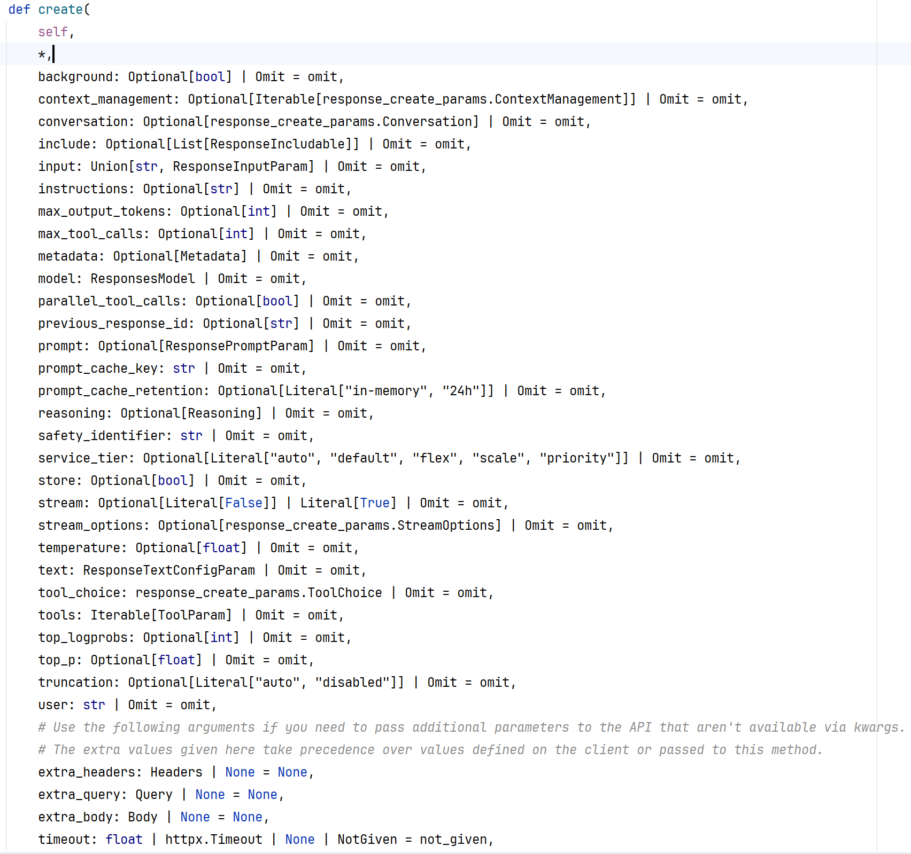

| 字段 | 类型 | 是否必需 | 默认值 | 含义与说明 |
| --- | --- | --- | --- | --- |
| input | string | 否 | 无 | 输入内容（文本/图像/文件）。 |
| model | string | 是 | 无 | 模型ID，如gpt-4o或o3。含义：指定响应生成模型。 |
| instructions | string | 否 | 无 | 系统消息。含义：指导模型行为，可覆盖先前指令。 |
| max_tokens | integer | 否 | 无 | 最大输出token数（包括推理）。含义：控制响应长度。 |
| tools | array | 否 | 无 | 工具列表（如函数/web search）。含义：扩展模型能力。 |
| tool_choice | string/object | 否 | auto | 工具选择（如auto）。含义：决定是否调用工具。 |
| stream | boolean | 否 | TRUE | 是否流式。含义：实时返回事件流。 |
| temperature | number | 否 | 1 | 采样温度（0-2）。含义：控制随机性。 |
| top_p | number | 否 | 1 | 核采样（0-1）。含义：控制多样性，与temperature互斥。 |
| background | boolean | 否 | TRUE | 是否后台运行。含义：异步处理，长任务适用。 |
| previous_response_id | str | 否 | 无 | 多轮对话配置：指定上一次响应的id |
| reasoning | object | 否 | 无 | 深度思考配置：开启/关闭深度思考、配置思考程度，配置简洁、详细输出模式 |

### 配置项：示例

**以阿里云百炼平台为例**：

https://bailian.console.aliyun.com/cn-beijing?spm=5176.29619931.J_PvCec88exbQTi-U433Fxg.5.74cd10d7qc1WaT&tab=api#/api/?type=model&url=3016808

> 注意不同API的 BASE_URL 不一样


#### 基础调用

```python
import os
from openai import OpenAI
from dotenv import load_dotenv

load_dotenv(override=False)
client = OpenAI(
    # 若没有配置环境变量，请用百炼API Key将下行替换为：api_key="sk-xxx"
    api_key=os.getenv("API_KEY"),
    base_url="https://dashscope.aliyuncs.com/api/v2/apps/protocols/compatible-mode/v1",
)

response = client.responses.create(
    model="qwen3.5-plus",
    input="你能做些什么？"
)

# 获取模型回复
print(response.output_text)
```

#### 多样性

`temperature`** **和 `top_p`用于控制生成文本的多样性。数值越高，内容越多样，数值越低，内容越确定。为准确评估参数效果，建议每次只调整一个。

- `temperature`：范围 [0, 2)。侧重调整随机性。
- `top_p`：范围 [0, 1]。通过概率阈值筛选回复。

以下示例将展示不同参数设置对生成内容的影响。

输入提示词为：**“写一个三句话的短故事，主角是一只猫和一束阳光。”**

- **高多样性**（示例`temperature`=0.9）：适用于需要创意、想象力和新颖表达的场景，如创意写作、头脑风暴或市场营销文案。

```shell
阳光斜斜地切进窗台，橘猫蹑手蹑脚走近那块发光的方砖，绒毛瞬间被染成熔化的蜜糖。  
它伸出前爪轻拍光斑，却像踩进温热的池水般陷了进去，整片阳光顺着肉垫汩汩漫上脊背。  
午后忽然变得很重——猫儿蜷在流动的金砂里，听见时光在呼噜声中轻轻融化。
```

- **高确定性**（示例`temperature`=0.1）：适用于要求内容准确、严谨和可预测的场景，如事实问答、代码生成或法律文本。

```shell
午后，一只老猫蜷在窗台，数着光斑打盹。  
阳光轻轻跃过它斑驳的脊背，像在翻阅一本旧相册。  
尘埃浮起又落下，仿佛时光低语：你曾年轻，我也炽热。
```

> **原理：**
> 
> **temperature**：
> 
> - `temperature `越高，`Token 概率分布变得更平坦`（即高概率 Token 的概率降低，低概率 Token 的概率上升），使得模型在选择下一个 Token 时更加随机。
> - temperature 越低，Token 概率分布变得更陡峭（即高概率 Token 被选取的概率更高，低概率 Token 的概率更低），使得模型更倾向于选择高概率的少数 Token。
> 
> **top_p**：
> 
> top_p 采样是指从最高概率（最核心）的 Token 集合中进行采样。它将所有可能的下一个 Token 按概率从高到低排序，然后从概率最高的 Token 开始累加概率，直至概率总和达到阈值（例如80%，即 top_p=0.8），最后从这些概率最高、概率总和达到阈值的 Token 中随机选择一个用于输出。
> 
> - top_p 越高，考虑的 Token 越多，因此生成的文本更多样。
> - top_p 越低，考虑的 Token 越少，因此生成的文本更集中和确定。

> **建议的几种场景设置：**

```python
# 不同场景的推荐参数配置
SCENARIO_CONFIGS = {
    "creative_writing": { # 创造性写作
        "temperature": 0.9,
        "top_p": 0.95
    },
    "code_generation": { # 代码生成
        "temperature": 0.2,
        "top_p": 0.8
    },
    "factual_qa": { # 事实性问答
        "temperature": 0.1,
        "top_p": 0.7
    },
    "translation": { # 翻译
        "temperature": 0.3,
        "top_p": 0.8
    }
}
```

#### 流式输出

| 对比项 | 传统模式 | 流式模式 |
| --- | --- | --- |
| 响应方式 | 等待全部生成完毕，一次性返回 | 边生成边返回，逐 token 推送 |
| 首字节时间 (TTFB) Time to First Byte | 5-15 秒（取决于内容长度） | 0.2-0.5 秒 |
| 用户体验 | ❌ 长时间空白等待，感觉”卡死” | ✅ 即时反馈，类似真人打字 |
| 技术实现 | 普通 HTTP 请求 | SSE / WebSocket |

```python
import os
from openai import OpenAI
from dotenv import load_dotenv
import json

load_dotenv(override=False)
client = OpenAI(
    # 若没有配置环境变量，请用百炼API Key将下行替换为：api_key="sk-xxx"
    api_key=os.getenv("API_KEY"),
    base_url="https://dashscope.aliyuncs.com/api/v2/apps/protocols/compatible-mode/v1",
)
stream = client.responses.create(
    model="qwen3.5-plus",
    input="请简单介绍一下人工智能。",
    stream=True
)

```

> **探索：当流式输出的时候。到底响应了什么样的json。以下是我们通过程序探索，得到的输出**
> 
> **重点关注：**有几种类型的 type。思考如果让我们写前端，每一种 类型的 type 应该如何展示

```python
print("开始接收流式输出:")
# 保存 event 的列表
jlist = []
for event in stream:
    # print("event: ",event.model_dump_json())
    jlist.append(event.model_dump())
    if event.type == 'response.output_text.delta':
        print(event.delta, end='', flush=True)
    elif event.type == 'response.completed':
        print("\n流式输出完成")
        print(f"总Token数: {event.response.usage.total_tokens}")
# jlist 转出为 json 格式
jlist_str = json.dumps(jlist, ensure_ascii=False, indent=2)
# 保存为文件
with open("qwen3.5-plus.json", "w", encoding="utf-8") as f:
    f.write(jlist_str)
```

[📎 qwen3.5-plus.json](<files/qwen3.5-plus.json>)

#### 多轮对话

> 注意:
> 
> 1. 关联 `response.id `即可。几种多轮对话期间，中间对话没有提及上下文信息。也可以形成整个上下文链路
> 2. 云厂商对于这个功能有实现，但是本地模型一般不具有这个功能需要自己实现

```python
import os
from openai import OpenAI
from dotenv import load_dotenv

load_dotenv(override=False)
client = OpenAI(
    # 若没有配置环境变量，请用百炼API Key将下行替换为：api_key="sk-xxx"
    api_key=os.getenv("API_KEY"),
    base_url=os.getenv("BASE_URL_RESPONSES"),
)
# 第一轮对话
response1 = client.responses.create(
    model="qwen3.5-plus",
    input="我的名字是雷丰阳，请记住。"
)
print(f"第一轮回复: {response1.output_text}")

# 第二轮对话 - 使用 previous_response_id 关联上下文，响应id有效期为7天
response2 = client.responses.create(
    model="qwen3.5-plus",
    input="你还记得我的名字吗？", # 你是什么模型？
    previous_response_id=response1.id
)
print(f"第二轮回复: {response2.output_text}")

response3 = client.responses.create(
    model="qwen3.5-plus",
    input="我是谁？你能做些什么？",
    previous_response_id=response2.id
)
print(f"第三轮回复: {response3.output_text}")
```

#### 调用内置工具

> 内置工具能调用哪些，取决于`云厂商`的能力，或者我们自己的实现。

更多内置工具调用参考：[📑 1. OpenAI API/SDK（新版）](https://shenma-docs.feishu.cn/wiki/Kipjwvs29in93ZkQgckce55Onhc#share-LS0mdoIEfoiSAbxUts6corymnFb)

```python
import os
from openai import OpenAI

client = OpenAI(
    api_key=os.getenv("DASHSCOPE_API_KEY"),
    base_url="https://dashscope.aliyuncs.com/api/v2/apps/protocols/compatible-mode/v1",
)

response = client.responses.create(
    model="qwen3.5-plus",
    input="帮我找一下阿里云官网，并提取首页的关键信息",
    # 建议同时开启内置工具以取得最佳效果
    tools=[
        {"type": "web_search"},
        {"type": "code_interpreter"},
        {"type": "web_extractor"}
    ],
    extra_body={"enable_thinking": True}
)

# 取消以下注释查看中间过程输出
# print(response.output)
print(response.output_text)
```

#### 自定义函数调用： Function Call


大模型函数调用原理：

1. **告诉大模型，哪些函数有哪些功能**；函数json定义：https://developers.openai.com/api/docs/guides/function-calling#defining-functions
2. 将问题和所有工具的定义一起发给大模型
3. 大模型思考并产生答案，如果要调用工具，则会返回FunctionCall响应。内容包含：需要调用的工具名字，参数名和值，此次调用id。**注意：大模型不会调用工具，只是通过推理，觉得应该调用什么工具，然后告诉了我们**
4. **工具调用**：最重要的一步，工具调用，需要我们自己完成
5. **继续交互**：将什么工具调用得到什么结果的数据，发送给大模型，大模型会推理产生答案，如果答案中包含工具调用。则继续 4 流程。
6. **最终答案**：一直到调用完所有工具并产生最终结果，则停止工具调用

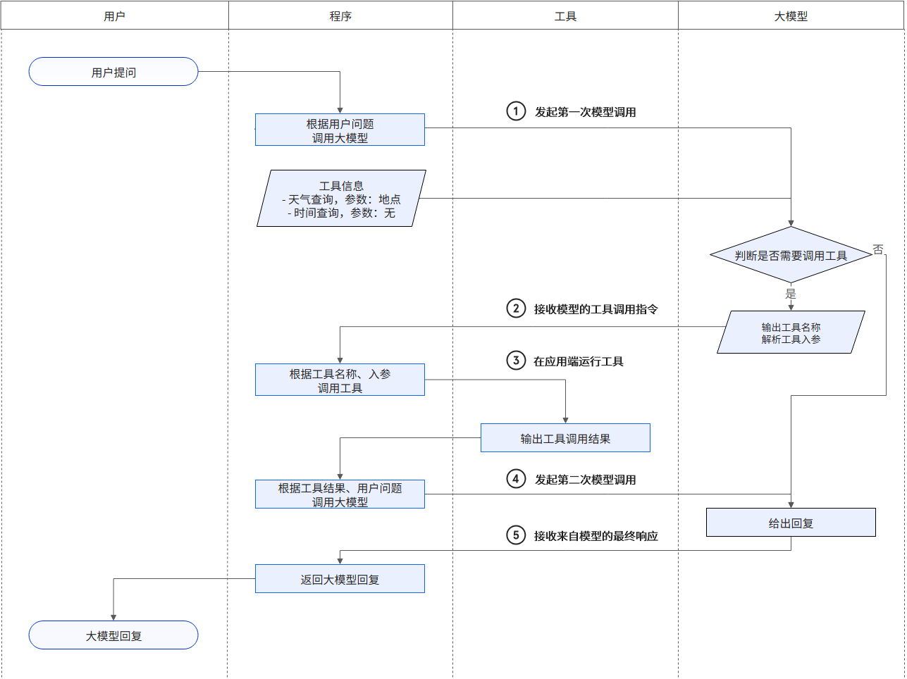

```python
import json
import os
import random

from openai import OpenAI
from dotenv import load_dotenv

load_dotenv(override=False)
client = OpenAI(
    # 若没有配置环境变量，请用百炼API Key将下行替换为：api_key="sk-xxx"
    api_key=os.getenv("API_KEY"),
    base_url="https://dashscope.aliyuncs.com/api/v2/apps/protocols/compatible-mode/v1",
)


# 模拟用户问题
USER_QUESTION = "北京天气咋样"
# 定义工具列表
tools = [
    {
        "type": "function",
        "name": "get_current_weather",
        "description": "当你想查询指定城市的天气时非常有用。",
        "parameters": {
            "type": "object",
            "properties": {
                "location": {
                    "type": "string",
                    "description": "城市或县区，比如北京市、杭州市、余杭区等。",
                }
            },
            "required": ["location"],
        },
    }
]


# 模拟天气查询工具
def get_current_weather(arguments):
    weather_conditions = ["晴天", "多云", "雨天"]
    random_weather = random.choice(weather_conditions)
    location = arguments["location"]
    return f"{location}今天是{random_weather}。"


# 封装模型响应函数
def get_response(input_data):
    response = client.responses.create(
        model="qwen3.5-plus",  # 可选：qwen3.5-flash、qwen3.5-flash-2026-02-23
        input=input_data,
        tools=tools,
    )
    return response


# 维护对话上下文
conversation = [{"role": "user", "content": USER_QUESTION}]

response = get_response(conversation)
print("response:", response)
function_calls = [item for item in response.output if item.type == "function_call"]
# 如果不需要调用工具，直接输出内容
if not function_calls:
    print(f"助手最终回复：{response.output_text}")
else:
    # 进入工具调用循环
    while function_calls:
        for fc in function_calls:
            func_name = fc.name
            arguments = json.loads(fc.arguments)
            print(f"正在调用工具 [{func_name}]，参数：{arguments}")
            # 执行工具
            tool_result = get_current_weather(arguments)
            print(f"工具返回：{tool_result}")
            # 将工具调用和结果成对追加到上下文中
            conversation.append(
                {
                    "type": "function_call",
                    "name": fc.name,
                    "arguments": fc.arguments,
                    "call_id": fc.call_id,
                }
            )
            conversation.append(
                {
                    "type": "function_call_output",
                    "call_id": fc.call_id,
                    "output": tool_result,
                }
            )
        # 携带完整上下文再次调用模型
        response = get_response(conversation)
        function_calls = [
            item for item in response.output if item.type == "function_call"
        ]
    print(f"助手最终回复：{response.output_text}")
```

## 抓包工具

> 为了实时查看和模型的请求响应数据，建议安装抓包工具。获取数据包的完整内容
> 
> https://github.com/wanghongenpin/proxypin/blob/main/README_CN.md
> 
> 安装后，开启 https 代理； pycharm 提示证书信任即可

### PyCharm 信任代理

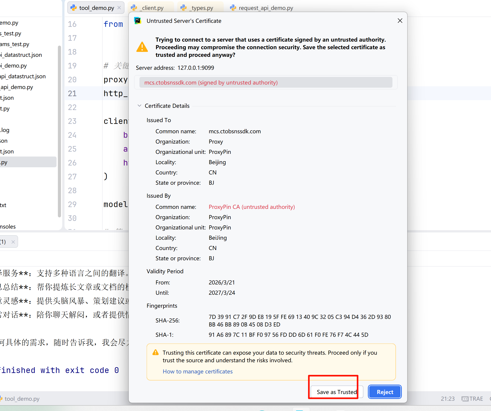

### OpenAI SDK 设置代理

```python
# 关键：创建走 ProxyPin 的 HTTP 客户端
proxy = "http://127.0.0.1:9099"  # ProxyPin 默认地址
http_client = httpx.Client(proxy=proxy, verify=False)

client = OpenAI(
    base_url=base_url,
    api_key=api_key,
    http_client=http_client
)
```

## 返回值：Response 响应数据拆解

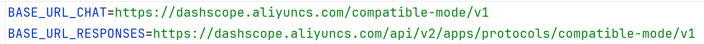

[📎 open_ai_client_test.json](<files/open_ai_client_test.json>)

### 非流式API 响应数据

> 1. 获取模型回复
>   1. `response.output_text`
> 2. 获取模型思考
>   1. `response.output`
>   2. `更精确：response.output[0].summary[0].text`
> 3. 获取用量指标
>   1. `response.usage`

总 output_token = 思考 + 输出

[📎 qwen3.5-plus.json](<files/qwen3.5-plus_CJfPb0kU.json>)

### 流式API 响应数据

> 1. 获取模型回复：（判断事件类型）
>   1. `type： 'response.output_text.delta':`
> 2. 获取模型思考：（判断事件类型）
>   1. `"type": "response.reasoning_summary_text.delta"`
> 3. 获取用量指标
>   1. 

流式响应测试代码

```python
import os
from openai import OpenAI
from dotenv import load_dotenv

load_dotenv(override=False)
client = OpenAI(
    # 若没有配置环境变量，请用百炼API Key将下行替换为：api_key="sk-xxx"
    api_key=os.getenv("API_KEY"),
    base_url=os.getenv("BASE_URL_RESPONSES"),
)
stream = client.responses.create(
    model="qwen3.5-plus",
    input="请简单介绍一下人工智能。",
    stream=True
)

print("开始接收流式输出:")
reason_start = False
content_start = False
for event in stream:
    if event.type == 'response.output_text.delta':
        if not content_start:
            print("\n回答内容：", end='', flush=True)
            content_start = True
            print(event.delta, end='', flush=True)
        if content_start:
            print(event.delta, end='', flush=True)
    elif event.type == 'response.reasoning_summary_text.delta':
        if not reason_start:
            print("\n思考中：", end='', flush=True)
            reason_start = True
            print(event.delta, end='', flush=True)
        if reason_start:
            print(event.delta, end='', flush=True)
    elif event.type == 'response.completed':
        print("\n流式输出完成")
        print(f"总Token数: {event.response.usage.total_tokens}")
```

# OpenAI  - chat completions api

## 文本生成

> 文本生成模型能够**基于输入的提示词（Prompt）**创作出逻辑清晰、连贯的文本。
> 
> 文本生成模型所需的输入可以是简单的关键词、一句话概述或是更复杂的指令和上下文信息。模型通过分析海量数据学习语言模式，广泛应用于：
> 
> - **内容创作**：生成新闻报道、商品介绍及短视频脚本。
> - **客户服务**：驱动聊天机器人提供全天候支持，解答常见问题。
> - **文本翻译**：实现跨语言的快速精准转换。
> - **摘要生成**：提炼长文、报告及邮件的核心内容。（可以用来做上下文压缩）
> - **法律文档编写**：生成合同模板、法律意见书的基础框架。

### 核心概念

> 文本生成模型的输入为提示词（Prompt），它由一个或多个消息（Message）对象构成。每条消息由角色（Role）和内容（Content）组成，具体为：
> 
> - **系统消息（System Message）**：设定模型扮演的角色或遵循的指令。若不指定，默认为"You are a helpful assistant"。
> - **用户消息（User Message）**：用户向模型提出的问题或输入的指令。
> - **助手消息（Assistant Message）**：模型的回复内容。

调用模型时，需构造一个由上述消息对象构成的数组`messages`。一个典型的请求通常由一条定义行为准则的 `system` 消息和一条用户提指令的 `user` 消息组成。

> `system`消息是可选的，但建议使用它来设定模型的角色和行为准则，以获得更稳定、一致的输出。

```json
[
    {"role": "system", "content": "你是一个有帮助的助手，需要提供精准、高效且富有洞察力的回应，随时准备协助用户处理各种任务与问题。"},
    {"role": "user", "content": "你是谁？"}
]
```

输出的响应对象中会包含模型回复的`assistant`消息。

```shell
{"role": "assistant","content": "你好！我是Qwen，是阿里巴巴集团旗下的通义实验室自主研发的超大规模语言模型。我可以帮助你回答问题、创作文字、进行逻辑推理、编程等。我能够理解并生成多种语言，支持多轮对话和复杂任务处理。如果你有任何需要帮助的地方，尽管告诉我！"}
```

### Response API

```python
import os
from openai import OpenAI
from dotenv import load_dotenv


try:
    load_dotenv(override=False)
    client = OpenAI(
        # 若没有配置环境变量，请用百炼API Key将下行替换为：api_key="sk-xxx"
        api_key=os.getenv("API_KEY"),
        base_url=os.getenv("BASE_URL_RESPONSES"),
    )

    response = client.responses.create(
        model="qwen3.5-plus",
        input="简要介绍下你能做什么？"  # input 支持纯文本和message 格式的消息
    )

    print(response)
except Exception as e:
    print(f"错误信息：{e}")
    print("请参考文档：https://help.aliyun.com/zh/model-studio/developer-reference/error-code")
```

### Chat API

```python
import os
from openai import OpenAI
from dotenv import load_dotenv

try:
    load_dotenv(override=False)
    client = OpenAI(
        # 若没有配置环境变量，请用百炼API Key将下行替换为：api_key="sk-xxx"
        api_key=os.getenv("API_KEY"),
        base_url=os.getenv("BASE_URL_CHAT"),
    )

    completion = client.chat.completions.create(
        model="qwen3.5-plus",
        messages=[
            {"role": "system", "content": "You are a helpful assistant."},
            {"role": "user", "content": "你是谁？"},
        ],
    )
    print(completion.choices[0].message.content)
    # 如需查看完整响应，请取消下列注释
    # print(completion.model_dump_json())
except Exception as e:
    print(f"错误信息：{e}")
    print("请参考文档：https://help.aliyun.com/zh/model-studio/developer-reference/error-code")
```

### **图像、视频数据处理**

视觉理解模型可以根据您传入的图片或视频进行回答，支持单图或多图的输入，适用于图像描述、视觉问答、物体定位等多种任务。

#### 云端模型

```python
import os
from openai import OpenAI
from dotenv import load_dotenv

load_dotenv(override=False)
client = OpenAI(
    # 若没有配置环境变量，请用百炼API Key将下行替换为：api_key="sk-xxx"
    api_key=os.getenv("API_KEY"),
    base_url=os.getenv("BASE_URL_CHAT"),
)

completion = client.chat.completions.create(
    model="qwen3.5-plus", # 此处以qwen3.5-plus为例，可按需更换模型名称。模型列表：https://help.aliyun.com/zh/model-studio/models
    messages=[
        {
            "role": "user",
            "content": [
                {
                    "type": "image_url",
                    "image_url": {
                        "url": "https://help-static-aliyun-doc.aliyuncs.com/file-manage-files/zh-CN/20241022/emyrja/dog_and_girl.jpeg"
                    },
                },
                {"type": "text", "text": "图中描绘的是什么景象?"},
            ],
        },
    ],
)
print(completion.choices[0].message.content)
```

```plain text
这是一张在海滩上拍摄的照片。照片中，一个人和一只狗坐在沙滩上，背景是大海和天空。人和狗似乎在互动，狗的前爪搭在人的手上。阳光从画面的右侧照射过来，给整个场景增添了一种温暖的氛围。
```

#### 本地模型

> 核心注意：传递 图片的 base64 编码，并*把图片放进 content 数组里，和用户问题一起发送*

```python
import base64
import json
import random

import httpx
import requests
from dotenv import load_dotenv
import os

load_dotenv()
api_key = os.getenv("API_KEY")
base_url = os.getenv("BASE_URL")

from openai import OpenAI

client = OpenAI(
    base_url=base_url,
    api_key=api_key
)

def encode_image(path):
    with open(path, "rb") as f:
        return base64.b64encode(f.read()).decode()

img_base64 = encode_image("goods.png")

# ✅ 把图片放进 content 数组里，和用户问题一起发送
response = client.chat.completions.create(
    model="qwen3-vl:4b",
    messages=[
        {
            "role": "user",
            "content": [
                # 文本部分
                {"type": "text", "text": "这张图里有什么？"},
                # 图片部分（Ollama 标准格式）
                {"type": "image_url", "image_url": {"url": f"data:image/png;base64,{img_base64}"}}
            ]
        }
    ],
    # 可选：增加超时，避免本地模型慢导致报错
    timeout=120
)

print(response.choices[0].message.content)
```

#### **千问系列模型**

- **首选 Qwen3.5**：最新一代视觉理解模型，在多模态推理、2D/3D图像理解、复杂文档解析、视觉编程、视频理解、多模态智能体等任务上领先，支持中国内地和新加坡地域。
  - `qwen3.5-plus`：千问性能**最强的视觉理解模型**，推荐优先使用。
  - `qwen3.5-flash`：速度更快，成本更低，是兼顾性能与成本的高性价比选择，适用于对响应速度敏感的场景。
  - `qwen3.5-397b-a17b`、`qwen3.5-122b-a10b`、`qwen3.5-27b`、`qwen3.5-35b-a3b`：Qwen3.5 开源系列模型。
- Qwen3-`VL` 也适用于高精度的物体识别与定位（包括 3D 定位）、 Agent 工具调用、文档和网页解析、复杂题目解答、长视频理解等任务。系列内模型对比如下：
  - `qwen3-vl-plus`：Qwen3-VL 系列中性能最强的模型。
  - `qwen3-vl-flash`：速度更快，成本更低，是兼顾性能与成本的高性价比选择，适用于对响应速度敏感的场景。
- Qwen2.5-VL 适用于简单的图像描述、短视频摘要提取等通用任务，系列内模型对比如下：
  - `qwen-vl-max`（属于Qwen2.5-VL）：Qwen2.5-VL 系列中效果最佳的模型。
  - `qwen-vl-plus`（属于Qwen2.5-VL）：速度更快，在效果与成本之间实现良好平衡。

## 多轮对话

> **实现多轮对话的核心**是维护一个 `messages` 数组。
> 
> 每一轮对话都需要**将用户的最新提问和模型的回复****追加****到此数组中**，并将其作为下一次请求的输入。

### 原理解析

以下示例为多轮对话时 `messages` 的状态变化：

**第一轮对话**

向`messages` 数组添加用户问题。

```json
// 使用文本模型
[{"role": "user", "content": "推荐一部关于太空探索的科幻电影。"}]

// 使用多模态模型，以 Qwen-VL 为例
// {"role": "user",
//       "content": [{"type": "image_url","image_url": 
//                          {"url": "https://help-static-aliyun-doc.aliyuncs.com/file-manage-files/zh-CN/20251031/ownrof/f26d201b1e3f4e62ab4a1fc82dd5c9bb.png"}},
//                   {"type": "text", "text": "请问图片展现了有哪些商品？"}]
// }
```

**第二轮对话**

向`messages`数组添加大模型回复内容与用户的最新提问。

```json
// 使用文本模型
[{"role": "user", "content": "推荐一部关于太空探索的科幻电影。"},
{"role": "assistant", "content": "我推荐《xxx》，这是一部经典的科幻作品。"},
{"role": "user", "content": "这部电影的导演是谁？"}]

// 使用多模态模型，以 Qwen-VL 为例
//[
//    {"role": "user", "content": [
//                    {"type": "image_url","image_url": {"url": "https://help-static-aliyun-doc.aliyuncs.com/file-manage-files/zh-CN/20251031/ownrof/f26d201b1e3f4e62ab4a1fc82dd5c9bb.png"}},
//                   {"type": "text", "text": "请问图片展现了有哪些商品？"}]},
//    {"role": "assistant", "content": "图片展示了三件商品：一件浅蓝色背带裤、一件蓝白条纹短袖衬衫和一双白色运动鞋。"},
//    {"role": "user", "content": "它们属于什么风格？"}
//]
```

### 代码测试

```python
import os
from openai import OpenAI
from dotenv import load_dotenv

load_dotenv(override=False)
client = OpenAI(
    # 若没有配置环境变量，请用百炼API Key将下行替换为：api_key="sk-xxx"
    api_key=os.getenv("API_KEY"),
    base_url=os.getenv("BASE_URL_CHAT"),
)

def get_response(messages):
    completion = client.chat.completions.create(
        model="qwen3.5-plus",
        messages=messages
    )
    return completion.choices[0].message.content

# 初始化 messages
messages = []

# 第 1 轮
messages.append({"role": "user", "content": "推荐一部关于太空探索的科幻电影。"})
print("第1轮")
print(f"用户：{messages[0]['content']}")
assistant_output = get_response(messages)
messages.append({"role": "assistant", "content": assistant_output})
print(f"模型：{assistant_output}\n")

# 第 2 轮
messages.append({"role": "user", "content": "这部电影的导演是谁？"})
print("第2轮")
print(f"用户：{messages[-1]['content']}")
assistant_output = get_response(messages)
messages.append({"role": "assistant", "content": assistant_output})
print(f"模型：{assistant_output}\n")
```

### **多模态模型的多轮对话**

> 多模态模型支持在对话中加入图片、音频等内容。要注意**用户消息（user message）的构造方式：**
> 
> **如果本地测试**：`ollama pull qwen3-vl:4b`
> 
> **如果使用云**：`qwen3.5-plus` 可以支持视觉问答

```python
import os
from openai import OpenAI
from dotenv import load_dotenv

load_dotenv(override=False)
client = OpenAI(
    # 若没有配置环境变量，请用百炼API Key将下行替换为：api_key="sk-xxx"
    api_key=os.getenv("API_KEY"),
    base_url=os.getenv("BASE_URL_CHAT"),
)


messages = [
    {
        "role": "user",
        "content": [
            {
                "type": "image_url",
                "image_url": {
                    "url": "https://help-static-aliyun-doc.aliyuncs.com/file-manage-files/zh-CN/20251031/ownrof/f26d201b1e3f4e62ab4a1fc82dd5c9bb.png"
                },
            },
            {"type": "text", "text": "请问图片展现了有哪些商品？"},
        ],
    }
]

completion = client.chat.completions.create(
    model="qwen3.5-plus",  # 可按需更换为其它多模态模型，并修改相应的 messages
    messages=messages,
)

print(f"第一轮输出：{completion.choices[0].message.content}")

assistant_message = completion.choices[0].message
messages.append(assistant_message.model_dump())
messages.append({
    "role": "user",
    "content": [
        {
            "type": "text",
            "text": "它们属于什么风格？"
        }
    ]
})
completion = client.chat.completions.create(
    model="qwen3.5-plus",
    messages=messages,
)

print(f"第二轮输出：{completion.choices[0].message.content}")
```

### 思考模型多轮会话

```python
import json
import os
from openai import OpenAI
from dotenv import load_dotenv

load_dotenv(override=False)
client = OpenAI(
    # 若没有配置环境变量，请用百炼API Key将下行替换为：api_key="sk-xxx"
    api_key=os.getenv("API_KEY"),
    base_url=os.getenv("BASE_URL_CHAT"),
)


messages = []
conversation_idx = 1
while True:
    reasoning_content = ""  # 定义完整思考过程
    answer_content = ""     # 定义完整回复
    is_answering = False   # 判断是否结束思考过程并开始回复
    print("="*20+f"第{conversation_idx}轮对话"+"="*20)
    conversation_idx += 1
    user_msg = {"role": "user", "content": input("请输入你的消息：")}
    messages.append(user_msg)
    # 创建聊天完成请求
    completion = client.chat.completions.create(
        # 您可以按需更换为其它深度思考模型
        model="qwen-plus",
        messages=messages,
        extra_body={"enable_thinking": True},
        stream=True,
        # stream_options={
        #     "include_usage": True
        # }
    )
    print("\n" + "=" * 20 + "思考过程" + "=" * 20 + "\n")
    for chunk in completion:
        # 如果chunk.choices为空，则打印usage
        if not chunk.choices:
            print("\nUsage:")
            print(chunk.usage)
        else:
            delta = chunk.choices[0].delta
            # 打印思考过程
            if hasattr(delta, 'reasoning_content') and delta.reasoning_content != None:
                print(delta.reasoning_content, end='', flush=True)
                reasoning_content += delta.reasoning_content
            else:
                # 开始回复
                if delta.content != "" and is_answering is False:
                    print("\n" + "=" * 20 + "完整回复" + "=" * 20 + "\n")
                    is_answering = True
                # 打印回复过程
                print(delta.content, end='', flush=True)
                answer_content += delta.content
    # 将模型回复的content添加到上下文中
    messages.append({"role": "assistant", "content": answer_content})
    print("\n")
```

### 优化手段

> 多轮对话会带来巨大的 Token 消耗，且容易超出大模型**上下文最大长度**导致报错。以下策略可帮助您有效管理上下文与控制成本。

#### **上下文管理**

`messages` 数组会随对话轮次增加而变长，最终可能超出模型的 Token 限制。建议参考以下内容，在对话过程中管理上下文长度。

##### **上下文截断**

当对话历史过长时，保留最近的 N 轮对话历史。该方式实现简单，但会丢失较早的对话信息。

##### **滚动摘要**

为了在不丢失核心信息的前提下动态压缩对话历史，控制上下文长度，可随着对话的进行对`上下文进行摘要`：

a. 对话历史达到一定长度（如上下文长度最大值的 70%）时，将对话历史中较早的部分（如前一半）提取出来，发起独立 API 调用使大模型对这部分内容生成“记忆摘要”；

b. 构建下一次请求时，用“记忆摘要”替换冗长的对话历史，并拼接最近的几轮对话。

##### **向量化召回**

滚动摘要会丢失部分信息，为了使模型可以从海量对话历史中“回忆”起相关信息，可将对话管理从“线性传递”转变为“按需检索”：

a. 每轮对话结束后，将该轮对话存入向量数据库；

b. 用户提问时，通过相似度检索相关对话记录；

c. 将检索到的对话记录与最近的用户输入拼接后输入大模型。  

#### **成本控制**

输入 `Token`数会随着对话轮数增加，显著增加使用成本，以下成本管理策略供您参考。

##### **减少输入 Token**

通过上文介绍的上下文管理策略减少输入 Token，降低成本。

##### **使用支持上下文缓存的模型**

发起多轮对话请求时，`messages` 部分会重复计算并计费。建议优先使用支持上下文缓存的模型。一些云厂商已经默认支持；比如：阿里云百炼对`qwen-max`、`qwen-plus`等模型提供了[上下文缓存](https://help.aliyun.com/zh/model-studio/context-cache)功能，可以降低使用成本并提升响应速度。

## 流式输出

### 原理

> 流式输出基于 `Server-Sent Events (SSE)` 协议。发起流式请求后，服务端与客户端建立持久化 HTTP 连接。`模型每生成一个文本块（称为 chunk）`，立即通过连接推送。**全部内容生成后，服务端发送结束信号。**
> 
> 客户端监听事件流，实时接收并处理文本块，例如逐字渲染界面。这与非流式调用（一次性返回所有内容）形成对比。

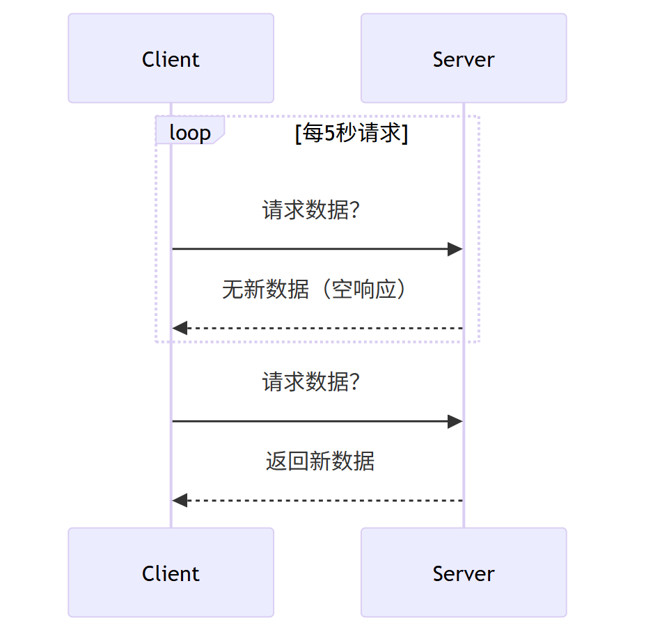

**短轮询 (Polling)**

- **原理**：客户端以固定的时间间隔（例如每秒一次）频繁地向服务器发送请求，询问是否有新数据。
- **缺点**：`大量请求可能是无效的`（无新数据），浪费服务器和带宽资源，实时性差。

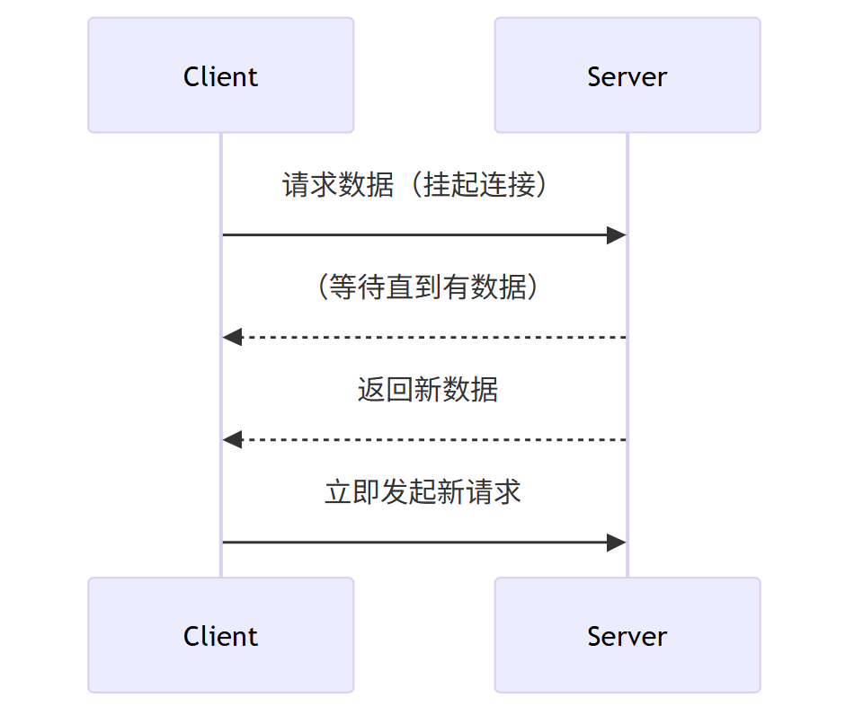

**长轮询 (Long Polling)**:

- **原理**：使用长连接请求数据。 客户端发送一个请求，服务器会保持这个连接打开（长连接），直到有新数据可用或超时。一旦客户端收到响应，会立即发起下一个请求。
- **缺点**：虽然减少了无效请求，但每个连接仍然需要客户端发起，服务器需要维护大量挂起的连接，实现复杂。

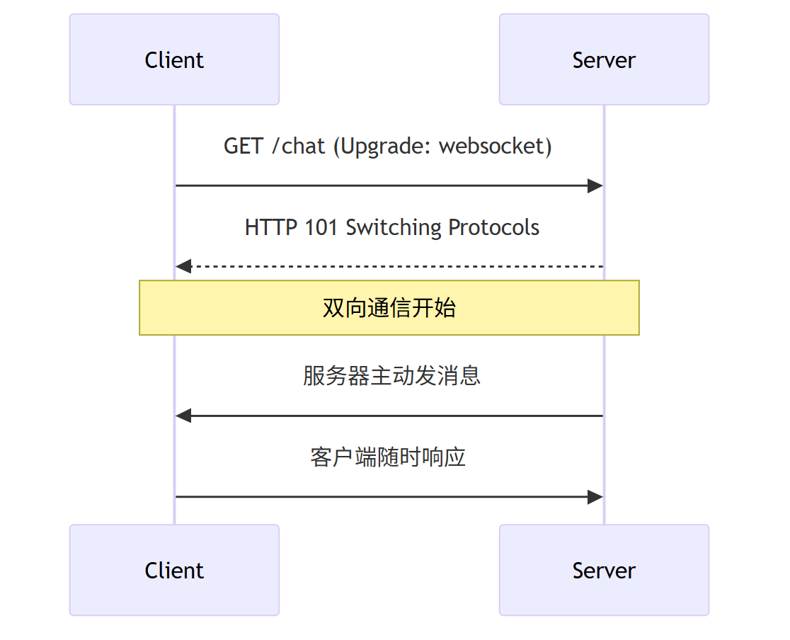

**基于 WebSocket的解决方案**:

- **原理**：在客户端与服务器之间建立一条`全双工`的 TCP 长连接，双方可随时互相推送数据。
- **缺点**： 需要一次额外的协议升级握手（`Upgrade: websocket`），对 CDN、防火墙、代理服务器的兼容性不如普通 HTTP； 双向通信能力在“服务器→客户端单向推送”场景下显得过度设计，增加心跳、重连、帧解析等复杂度；早期浏览器支持不一（IE ≤ 9 无原生实现）

> 太浪费；

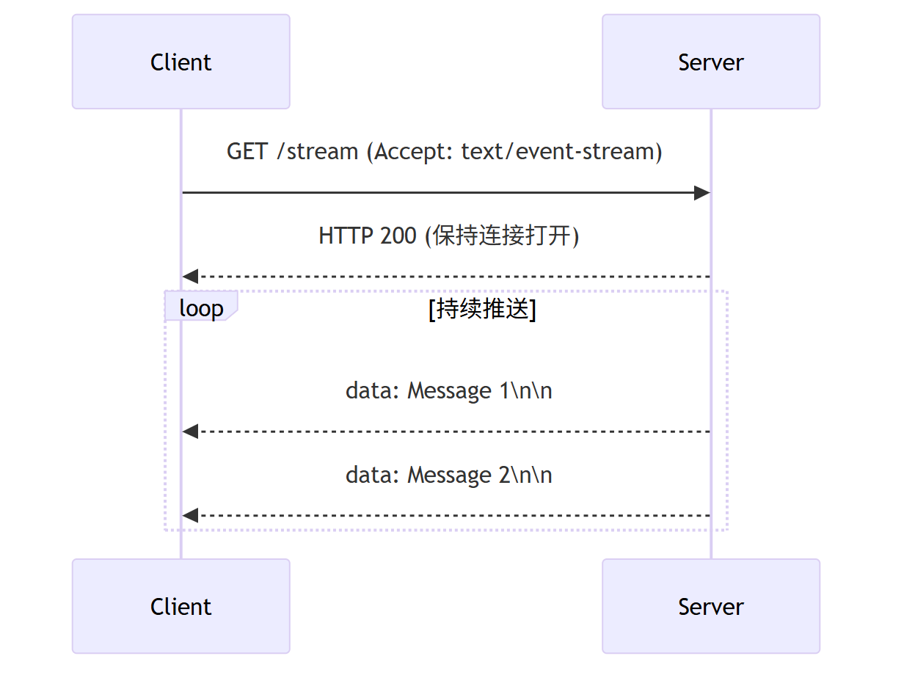

> Web 领域迫切需要一种**标准化的、高效的、由浏览器原生支持的**服务器到客户端的单向通信机制。这就是 SSE 诞生的核心背景。
> 
> 单向实时数据流推送

**核心需求：**

- **简单**：易于服务器和客户端实现。
- **高效**：基于 HTTP/HTTPS，避免不必要的请求开销。
- **标准**：成为 W3C 标准，得到浏览器原生支持。
- **自动重连**：内置连接失败后自动重试的机制。

```python
import os
from openai import OpenAI
from dotenv import load_dotenv

load_dotenv(override=False)
client = OpenAI(
    # 若没有配置环境变量，请用百炼API Key将下行替换为：api_key="sk-xxx"
    api_key=os.getenv("API_KEY"),
    base_url=os.getenv("BASE_URL_CHAT"),
)

# 2. 发起流式请求
completion = client.chat.completions.create(
    model="qwen-plus",
    messages=[
        {"role": "system", "content": "You are a helpful assistant."},
        {"role": "user", "content": "请介绍一下自己"}
    ],
    stream=True,
    stream_options={"include_usage": True}
)

# 3. 处理流式响应
# 用列表暂存响应片段，最后 join 比逐次 += 字符串更高效
content_parts = []
print("AI: ", end="", flush=True)

for chunk in completion:
    if chunk.choices:
        content = chunk.choices[0].delta.content or ""
        print(content, end="", flush=True)
        content_parts.append(content)
    elif chunk.usage:
        print("\n--- 请求用量 ---")
        print(f"输入 Tokens: {chunk.usage.prompt_tokens}")
        print(f"输出 Tokens: {chunk.usage.completion_tokens}")
        print(f"总计 Tokens: {chunk.usage.total_tokens}")

full_response = "".join(content_parts)
print(f"\n--- 完整回复 ---\n{full_response}")
```

### **多模态模型的流式输出**

> 注意 message 消息的构造即可

```python
import os
from openai import OpenAI
from dotenv import load_dotenv

load_dotenv(override=False)
client = OpenAI(
    # 若没有配置环境变量，请用百炼API Key将下行替换为：api_key="sk-xxx"
    api_key=os.getenv("API_KEY"),
    base_url=os.getenv("BASE_URL_CHAT"),
)


completion = client.chat.completions.create(
    model="qwen3-vl-plus",  # 可按需更换为其它多模态模型，并修改相应的 messages
    messages=[
        {"role": "user",
         "content": [{"type": "image_url", 
                    "image_url": {"url": "https://help-static-aliyun-doc.aliyuncs.com/file-manage-files/zh-CN/20241022/emyrja/dog_and_girl.jpeg"},},
                    {"type": "text", "text": "图中描绘的是什么景象？"}]}],
    stream=True,
  # stream_options={"include_usage": True}
)
full_content = ""print("流式输出内容为：")
for chunk in completion:
    # 如果stream_options.include_usage为True，则最后一个chunk的choices字段为空列表，需要跳过（可以通过chunk.usage获取 Token 使用量）if chunk.choices and chunk.choices[0].delta.content != "":
        full_content += chunk.choices[0].delta.content
        print(chunk.choices[0].delta.content)
print(f"完整内容为：{full_content}")
```

### **思考模型的流式输出**

> 思考模型会先返回`reasoning_content`（思考过程），再返回`content`（回复内容）。可根据数据包状态判断当前为思考或是回复阶段。

```python
# 思考阶段
...
ChoiceDelta(content=None, function_call=None, refusal=None, role=None, tool_calls=None, reasoning_content='覆盖所有要点，同时')
ChoiceDelta(content=None, function_call=None, refusal=None, role=None, tool_calls=None, reasoning_content='自然流畅。')
# 回复阶段
ChoiceDelta(content='你好！我是**通', function_call=None, refusal=None, role=None, tool_calls=None, reasoning_content=None)
ChoiceDelta(content='义千问**（', function_call=None, refusal=None, role=None, tool_calls=None, reasoning_content=None)
...
```

```python
import json
import os
from openai import OpenAI
from dotenv import load_dotenv

load_dotenv(override=False)
client = OpenAI(
    # 若没有配置环境变量，请用百炼API Key将下行替换为：api_key="sk-xxx"
    api_key=os.getenv("API_KEY"),
    base_url=os.getenv("BASE_URL_CHAT"),
)

messages = [{"role": "user", "content": "你是谁"}]

completion = client.chat.completions.create(
    model="qwen-plus",  # 您可以按需更换为其它深度思考模型
    messages=messages,
    # enable_thinking 参数开启思考过程，qwen3-30b-a3b-thinking-2507、qwen3-235b-a22b-thinking-2507、QwQ 与 DeepSeek-R1 模型总会进行思考，不支持该参数
    extra_body={"enable_thinking": True},
    stream=True,
    # stream_options={
    #     "include_usage": True
    # },
)

reasoning_content = ""  # 完整思考过程
answer_content = ""  # 完整回复
is_answering = False  # 是否进入回复阶段
print("\n" + "=" * 20 + "思考过程" + "=" * 20 + "\n")

for chunk in completion:
    if not chunk.choices:
        print("\nUsage:")
        print(chunk.usage)
        continue

    delta = chunk.choices[0].delta

    # 只收集思考内容
    if hasattr(delta, "reasoning_content") and delta.reasoning_content is not None:
        if not is_answering:
            print(delta.reasoning_content, end="", flush=True)
        reasoning_content += delta.reasoning_content

    # 收到content，开始进行回复
    if hasattr(delta, "content") and delta.content:
        if not is_answering:
            print("\n" + "=" * 20 + "完整回复" + "=" * 20 + "\n")
            is_answering = True
        print(delta.content, end="", flush=True)
        answer_content += delta.content
```

## 深度思考

> **混合思考模式**：通过`enable_thinking`参数控制是否开启思考模式：
> 
> - 设为`true`时：模型在思考后回复；
> - 设为`false`时：模型直接回复；

### 核心配置

```python
# 导入依赖与创建客户端...
completion = client.chat.completions.create(
    model="qwen-plus", # 选择模型
    messages=[{"role": "user", "content": "你是谁"}],    
    # 在阿里云api中，由于 enable_thinking 非 OpenAI 标准参数，需要通过 extra_body 传入
    extra_body={"enable_thinking": True},
    # 流式输出方式调用
    stream=True,
    # 使流式返回的最后一个数据包包含Token消耗信息
    stream_options={
        "include_usage": True
    }
)
```

### 完整代码

> 注意：思考与回答的数据解析即可

```python
import os
from openai import OpenAI
from dotenv import load_dotenv

load_dotenv(override=False)
client = OpenAI(
    # 若没有配置环境变量，请用百炼API Key将下行替换为：api_key="sk-xxx"
    api_key=os.getenv("API_KEY"),
    base_url=os.getenv("BASE_URL_CHAT"),
)
messages = [{"role": "user", "content": "你是谁"}]

completion = client.chat.completions.create(
    model="qwen-plus",  # 您可以按需更换为其它深度思考模型
    messages=messages,
    extra_body={"enable_thinking": True},
    stream=True,
    stream_options={
        "include_usage": True  # sse的最后一个数据包会打印模型用量
    },
)

reasoning_content = ""  # 完整思考过程
answer_content = ""  # 完整回复
is_answering = False  # 是否进入回复阶段print("\n" + "=" * 20 + "思考过程" + "=" * 20 + "\n")

for chunk in completion:
    if not chunk.choices:
        print("\nUsage:")
        print(chunk.usage)
        continue

    delta = chunk.choices[0].delta

    # 只收集思考内容if hasattr(delta, "reasoning_content") and delta.reasoning_content is not None:
        if not is_answering:
            print(delta.reasoning_content, end="", flush=True)
        reasoning_content += delta.reasoning_content

    # 收到content，开始进行回复if hasattr(delta, "content") and delta.content:
        if not is_answering:
            print("\n" + "=" * 20 + "完整回复" + "=" * 20 + "\n")
            is_answering = Trueprint(delta.content, end="", flush=True)
        answer_content += delta.content
```

## 不同形式API能力对比

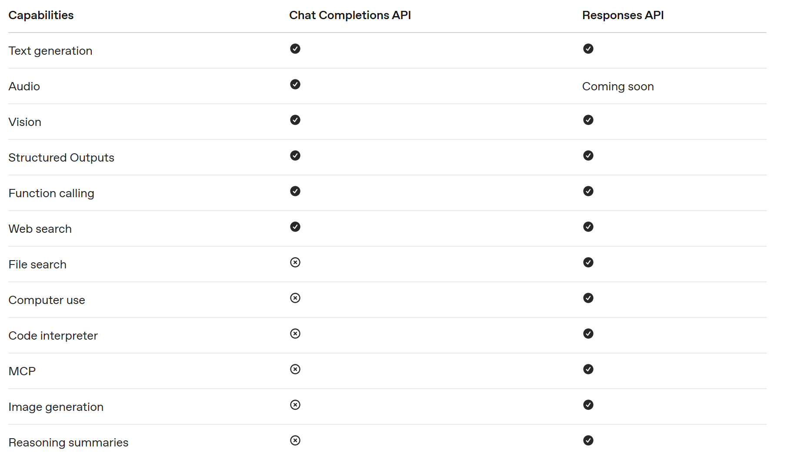

# 扩展能力测试（Chat API）

## 结构化输出

> 执行信息抽取或结构化数据生成任务时，大模型可能返回多余文本（如 ````json`）导致下游解析失败。`开启结构化输出（JSON Mode）`可确保大模型输出标准格式的 `JSON 字符串`，避免额外的格式验证或重试。 
> 
> 固定模型的输出格式

### 使用方式

在请求体中设置 `response_format` 参数即可开启结构化输出：

1. **设置**`response_format`**参数**：将 `response_format` 参数设置为 `{"type": "json_object"}`。
2. **提示词包含 JSON 关键词**：System Message 或 User Message 中需要包含 "JSON" 关键词（不区分大小写），否则会报错：`'messages' must contain the word 'json' in some form, to use 'response_format' of type 'json_object'.`

### 测试代码

> 注意： 要配合 提示词要求输出json + 响应格式化设置

```python
import os
from openai import OpenAI
from dotenv import load_dotenv

load_dotenv(override=False)
client = OpenAI(
    # 若没有配置环境变量，请用百炼API Key将下行替换为：api_key="sk-xxx"
    api_key=os.getenv("API_KEY"),
    base_url=os.getenv("BASE_URL_CHAT"),
)

completion = client.chat.completions.create(
    model="qwen-flash",
    messages=[
        {
            "role": "system",
            "content": "请抽取用户的姓名与年龄信息，以JSON格式返回"
        },
        {
            "role": "user",
            "content": "大家好，我叫刘五，今年34岁，邮箱是liuwu@example.com，平时喜欢打篮球和旅游",
        },
    ],
    response_format={"type": "json_object"}
)

json_string = completion.choices[0].message.content
print(json_string)
```

### **图片、视频数据处理**

> 除了文本信息，多模态模型还支持针对图像、视频数据进行结构化输出，实现视觉信息抽取、定位、事件监测等功能。

```java
import os
from openai import OpenAI
from dotenv import load_dotenv

load_dotenv(override=False)
client = OpenAI(
    # 若没有配置环境变量，请用百炼API Key将下行替换为：api_key="sk-xxx"
    api_key=os.getenv("API_KEY"),
    base_url=os.getenv("BASE_URL_CHAT"),
)

completion = client.chat.completions.create(
    model="qwen3-vl-plus",
    messages=[
        {
            "role": "system",
            "content": [{"type": "text", "text": "You are a helpful assistant."}],
        },
        {
            "role": "user",
            "content": [
                {
                    "type": "image_url",
                    "image_url": {
                        "url": "http://duguang-labelling.oss-cn-shanghai.aliyuncs.com/demo_ocr/receipt_zh_demo.jpg"
                    },
                },
                {"type": "text", "text": "提取图中ticket(数组类型，包括 travel_date、trains、seat_num、arrival_site、price)和 invoice 的信息（数组类型，包括 invoice_code 和 invoice_number ），请输出包含 ticket 和 invoice 数组的JSON"},
            ],
        },
    ],
    response_format={"type": "json_object"}
)
json_string = completion.choices[0].message.content
print(json_string)
```

### **思考模型的结构化输出**

```python
import os
from openai import OpenAI
from dotenv import load_dotenv

load_dotenv(override=False)
client = OpenAI(
    # 若没有配置环境变量，请用百炼API Key将下行替换为：api_key="sk-xxx"
    api_key=os.getenv("API_KEY"),
    base_url=os.getenv("BASE_URL_CHAT"),
)

messages=[
    {
        "role": "system",
        "content": "请抽取用户的姓名与年龄信息，以JSON格式返回"
    },
    {
        "role": "user",
        "content": "大家好，我叫刘五，今年34岁，邮箱是liuwu@example.com，平时喜欢打篮球和旅游", 
    },
]

completion = client.chat.completions.create(
    model="kimi-k2-thinking",
    messages=messages,
    extra_body={"enable_thinking": True},
    stream=True,
    stream_options={
        "include_usage": True
    },
    response_format={"type": "json_object"}
)

reasoning_content = ""  # 完整思考过程
answer_content = ""  # 完整回复
is_answering = False  # 是否进入回复阶段
print("\n" + "=" * 20 + "思考过程" + "=" * 20 + "\n")

for chunk in completion:
    if not chunk.choices:
        print("\nUsage:")
        print(chunk.usage)
        continue

    delta = chunk.choices[0].delta

    # 只收集思考内容
    if hasattr(delta, "reasoning_content") and delta.reasoning_content is not None:
        if not is_answering:
            print(delta.reasoning_content, end="", flush=True)
        reasoning_content += delta.reasoning_content

    # 收到content，开始进行回复
    if hasattr(delta, "content") and delta.content:
        if not is_answering:
            print("\n" + "=" * 20 + "完整回复" + "=" * 20 + "\n")
            is_answering = True
            print(delta.content, end="", flush=True)
        answer_content += delta.content
```

### 优化提示词

> 模糊的提示词（如“返回用户信息”）会使模型生成非预期结果。建议在提示词中准确描述预期 Schema，包括字段类型、必需性、格式要求（如日期格式），并提供示例。

```bash
from openai import OpenAI
import os
import json
import textwrap  # 用于处理多行字符串的缩进，提高代码可读性# 预定义示例响应，用于向模型展示期望的输出格式# 示例1：包含所有字段的完整响应
example1_response = json.dumps(
    {
        "info": {"name": "张三", "age": "25岁", "email": "zhangsan@example.com"},
        "hobby": ["唱歌"]
    },
    ensure_ascii=False
)
# 示例2：包含多个hobby的响应
example2_response = json.dumps(
    {
        "info": {"name": "李四", "age": "30岁", "email": "lisi@example.com"},
        "hobby": ["跳舞", "游泳"]
    },
    ensure_ascii=False
)
# 示例3：不包含hobby字段的响应（hobby非必需）
example3_response = json.dumps(
    {
        "info": {"name": "赵六", "age": "28岁", "email": "zhaoliu@example.com"}
    },
    ensure_ascii=False
)
# 示例4：另一个不包含hobby字段的响应
example4_response = json.dumps(
    {
        "info": {"name": "孙七", "age": "35岁", "email": "sunqi@example.com"}
    },
    ensure_ascii=False
)

# 初始化OpenAI客户端
client = OpenAI(
    # 若没有配置环境变量，请将下行替换为：api_key="sk-xxx"# 各地域的API Key不同。获取API Key：https://help.aliyun.com/zh/model-studio/get-api-key
    api_key=os.getenv("DASHSCOPE_API_KEY"),
    # 以下是北京地域base_url，如果使用新加坡地域的模型，需要将base_url替换为：https://dashscope-intl.aliyuncs.com/compatible-mode/v1
    base_url="https://dashscope.aliyuncs.com/compatible-mode/v1",
)

# dedent的作用是去除每行开头的公共缩进，使字符串在代码中可以美观地缩进，但在运行时不会包含这些额外的空格
system_prompt = textwrap.dedent(f"""\
    请从用户输入中提取个人信息并按照指定的JSON Schema格式输出：

    【输出格式要求】
    输出必须严格遵循以下JSON结构：
    {{
      "info": {{
        "name": "字符串类型，必需字段，用户姓名",
        "age": "字符串类型，必需字段，格式为'数字+岁'，例如'25岁'",
        "email": "字符串类型，必需字段，标准邮箱格式，例如'user@example.com'"
      }},
      "hobby": ["字符串数组类型，非必需字段，包含用户的所有爱好，如未提及则完全不输出此字段"]
    }}

    【字段提取规则】
    1. name: 从文本中识别用户姓名，必需提取
    2. age: 识别年龄信息，转换为"数字+岁"格式，必需提取
    3. email: 识别邮箱地址，保持原始格式，必需提取
    4. hobby: 识别用户爱好，以字符串数组形式输出，如未提及爱好信息则完全省略hobby字段

    【参考示例】
    示例1（包含爱好）：
    Q：我叫张三，今年25岁，邮箱是zhangsan@example.com，爱好是唱歌
    A：{example1_response}

    示例2（包含多个爱好）：
    Q：我叫李四，今年30岁，邮箱是lisi@example.com，平时喜欢跳舞和游泳
    A：{example2_response}

    示例3（不包含爱好）：
    Q：我叫赵六，今年28岁，我的邮箱是zhaoliu@example.com
    A：{example3_response}

    示例4（不包含爱好）：
    Q：我是孙七，35岁，邮箱sunqi@example.com
    A：{example4_response}

    请严格按照上述格式和规则提取信息并输出JSON。如果用户未提及爱好，则不要在输出中包含hobby字段。\
""")

# 调用大模型API进行信息提取
completion = client.chat.completions.create(
    model="qwen-plus",
    messages=[
        {
            "role": "system",
            "content": system_prompt
        },
        {
            "role": "user",
            "content": "大家好，我叫刘五，今年34岁，邮箱是liuwu@example.com，平时喜欢打篮球和旅游", 
        },
    ],
    response_format={"type": "json_object"},  # 指定返回JSON格式
)

# 提取并打印模型生成的JSON结果
json_string = completion.choices[0].message.content
print(json_string)
```

### **生产环境优化**

- **有效性校验**
  - 将输出传递给下游业务前，建议使用工具对其进行有效性校验，如 jsonschema (Python)、Ajv (JavaScript)、Everit (Java)等**，**确保其符合预期的 JSON 结构，避免因字段缺失、类型错误或格式不规范导致下游系统解析失败、数据丢失或业务逻辑中断。失败时可通过重试、大模型改写等策略进行修复。
- **禁用 **`max_tokens`
  - 请勿在开启结构化输出时指定 `max_tokens`（控制模型输出 Token 数的参数，默认值为模型最大输出 Token 数），否则返回的 JSON 字符串可能不完整，导致下游业务解析失败。

## 视觉推理

> 视觉推理模型能够先输出思考过程，再输出回答内容，适用于处理复杂的视觉分析任务，如解读数学题、分析图表数据或复杂视频理解等任务。

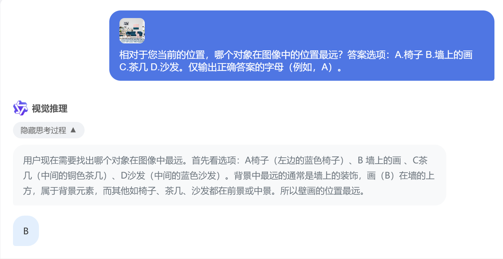

### 基本使用

```python
import os
from openai import OpenAI
from dotenv import load_dotenv

load_dotenv(override=False)
client = OpenAI(
    # 若没有配置环境变量，请用百炼API Key将下行替换为：api_key="sk-xxx"
    api_key=os.getenv("API_KEY"),
    base_url=os.getenv("BASE_URL_CHAT"),
)

reasoning_content = ""  # 定义完整思考过程
answer_content = ""     # 定义完整回复
is_answering = False   # 判断是否结束思考过程并开始回复

# 创建聊天完成请求
completion = client.chat.completions.create(
    model="qvq-max",  # 此处以 qvq-max 为例，可按需更换模型名称
    messages=[
        {
            "role": "user",
            "content": [
                {
                    "type": "image_url",
                    "image_url": {
                        "url": "https://img.alicdn.com/imgextra/i1/O1CN01gDEY8M1W114Hi3XcN_!!6000000002727-0-tps-1024-406.jpg"
                    },
                },
                {"type": "text", "text": "这道题怎么解答？"},
            ],
        },
    ],
    stream=True,
    # 解除以下注释会在最后一个chunk返回Token使用量
    # stream_options={
    #     "include_usage": True
    # }
)

print("\n" + "=" * 20 + "思考过程" + "=" * 20 + "\n")

for chunk in completion:
    # 如果chunk.choices为空，则打印usage
    if not chunk.choices:
        print("\nUsage:")
        print(chunk.usage)
    else:
        delta = chunk.choices[0].delta
        # 打印思考过程
        if hasattr(delta, 'reasoning_content') and delta.reasoning_content != None:
            print(delta.reasoning_content, end='', flush=True)
            reasoning_content += delta.reasoning_content
        else:
            # 开始回复
            if delta.content != "" and is_answering is False:
                print("\n" + "=" * 20 + "完整回复" + "=" * 20 + "\n")
                is_answering = True
            # 打印回复过程
            print(delta.content, end='', flush=True)
            answer_content += delta.content

# print("=" * 20 + "完整思考过程" + "=" * 20 + "\n")
# print(reasoning_content)
# print("=" * 20 + "完整回复" + "=" * 20 + "\n")
# print(answer_content)
```

### **限制思考长度**

为避免视觉推理模型输出过于冗长的思考过程，可使用 `thinking_budget` 参数限制思考过程生成的最大 Token 数。当思考过程超过该限制时，内容将被截断，模型会立即开始生成最终答案。`thinking_budget` 默认值为模型的最大思维链长度； 注意：不是所有模型都支持

```python
import os
from openai import OpenAI
from dotenv import load_dotenv

load_dotenv(override=False)
client = OpenAI(
    # 若没有配置环境变量，请用百炼API Key将下行替换为：api_key="sk-xxx"
    api_key=os.getenv("API_KEY"),
    base_url=os.getenv("BASE_URL_CHAT"),
)

reasoning_content = ""  # 定义完整思考过程
answer_content = ""     # 定义完整回复
is_answering = False   # 判断是否结束思考过程并开始回复
enable_thinking = True
# 创建聊天完成请求
completion = client.chat.completions.create(
    model="qwen3.5-plus",
    messages=[
        {
            "role": "user",
            "content": [
                {
                    "type": "image_url",
                    "image_url": {
                        "url": "https://img.alicdn.com/imgextra/i1/O1CN01gDEY8M1W114Hi3XcN_!!6000000002727-0-tps-1024-406.jpg"
                    },
                },
                {"type": "text", "text": "这道题怎么解答？"},
            ],
        },
    ],
    stream=True,
    # enable_thinking 参数开启思考过程，thinking_budget 参数设置最大推理过程 Token 数
    # qwen3.5-plus、qwen3-vl-plus、qwen3-vl-flash可通过enable_thinking开启或关闭思考
    #（其中qwen3.5-plus默认开启）、对于qwen3-vl-235b-a22b-thinking等带thinking后缀的模型，
    # enable_thinking仅支持设置为开启，对其他Qwen-VL模型均不适用
    extra_body={
        'enable_thinking': enable_thinking,
        "thinking_budget": 81920},

    # 解除以下注释会在最后一个chunk返回Token使用量
    # stream_options={
    #     "include_usage": True
    # }
)

if enable_thinking:
    print("\n" + "=" * 20 + "思考过程" + "=" * 20 + "\n")

for chunk in completion:
    # 如果chunk.choices为空，则打印usage
    if not chunk.choices:
        print("\nUsage:")
        print(chunk.usage)
    else:
        delta = chunk.choices[0].delta
        # 打印思考过程
        if hasattr(delta, 'reasoning_content') and delta.reasoning_content != None:
            print(delta.reasoning_content, end='', flush=True)
            reasoning_content += delta.reasoning_content
        else:
            # 开始回复
            if delta.content != "" and is_answering is False:
                print("\n" + "=" * 20 + "完整回复" + "=" * 20 + "\n")
                is_answering = True
            # 打印回复过程
            print(delta.content, end='', flush=True)
            answer_content += delta.content

# print("=" * 20 + "完整思考过程" + "=" * 20 + "\n")
# print(reasoning_content)
# print("=" * 20 + "完整回复" + "=" * 20 + "\n")
# print(answer_content)
```

## 前缀续写

> 在代码补全、文本续写等场景中，需要模型从已有的文本片段（前缀）开始继续生成。Partial Mode 可提供精确控制能力，确保模型输出的内容紧密衔接提供的前缀，提升生成结果的准确性与可控性。

### 使用方式

需在`messages` 数组中将最后一条消息的 `role` 设置为 `assistant`，并在其 `content` 中提供前缀，在此消息中设置参数 `"partial": true`。`messages`格式如下：

```json
[
    {
        "role": "user",
        "content": "请补全这个斐波那契函数，勿添加其它内容"
    },
    {
        "role": "assistant",
        "content": "def calculate_fibonacci(n):\n    if n <= 1:\n        return n\n    else:\n",
        "partial": true
    }
]
```

模型会以前缀内容为起点开始生成。

### 代码测试

```python
import os
from openai import OpenAI
from dotenv import load_dotenv

load_dotenv(override=False)
client = OpenAI(
    # 若没有配置环境变量，请用百炼API Key将下行替换为：api_key="sk-xxx"
    api_key=os.getenv("API_KEY"),
    base_url=os.getenv("BASE_URL_CHAT"),
)


# 2. 定义需要补全的代码前缀
prefix = """def calculate_fibonacci(n):
    if n <= 1:
        return n
    else:
"""
# 3. 发起 Partial Mode 请求# 注意：messages 数组的最后一条消息 role 为 "assistant"，并包含 "partial": True
completion = client.chat.completions.create(
    model="qwen3-coder-plus",
    messages=[
        {"role": "user", "content": "请补全这个斐波那契函数，勿添加其它内容"},
        {"role": "assistant", "content": prefix, "partial": True},
    ],
)

# 4. 手动拼接前缀和模型生成的内容
generated_code = completion.choices[0].message.content
complete_code = prefix + generated_code

print(complete_code)
```

### **基于不完整输出进行续写**

> 如果大模型返回不完整的内容，可使用 Partial Mode 对不完整的内容续写，使其语义完整。大模型可能返回不完整内容的情况：
> 
> - `max_tokens`参数设置过小，使模型返回被截断的内容。
> - 非流式输出触发超时，已生成的内容不完整。
> 
> > - 超时不再报错，而是将已生成内容返回

```python
import os
from openai import OpenAI
from dotenv import load_dotenv

load_dotenv(override=False)
client = OpenAI(
    # 若没有配置环境变量，请用百炼API Key将下行替换为：api_key="sk-xxx"
    api_key=os.getenv("API_KEY"),
    base_url=os.getenv("BASE_URL_CHAT"),
)


def chat_completion(messages, max_tokens=None):
    response = client.chat.completions.create(
        model="qwen-plus",
        messages=messages,
        max_tokens=max_tokens
    )
    print(f"###停止生成原因：{response.choices[0].finish_reason}")

    return response.choices[0].message.content


# 使用示例
messages = [{"role": "user", "content": "请写一个短篇科幻故事"}]

# 第一轮调用，设置max_tokens为40
first_content = chat_completion(messages, max_tokens=40)
print(first_content)
# 将第一轮的响应加入到assistant message，并设置partial=True
messages.append({"role": "assistant", "content": first_content, "partial": True})

# 第二轮调用
second_content = chat_completion(messages)
print("###完整内容：")
print(first_content + second_content)
```

## 上下文缓存

> 调用大模型时，不同推理请求可能出现输入内容的重叠（例如`多轮对话`或对同一本书的多次提问）。上下文缓存（Context Cache）技术可以缓存这些请求的公共前缀，减少推理时的重复计算。这能提升响应速度，并在不影响回复效果的前提下降低使用成本。
> 
> 注意：**云端模型**会实现此功能，**本地模型**需要自己实现

以阿里云为例：

为满足不同场景的需求，上下文缓存提供三种工作模式，可以根据对便捷性、确定性及成本的需求进行选择：

- [显式缓存](https://help.aliyun.com/zh/model-studio/context-cache?mode=pure#825f201c5fy6o)：需要**主动开启**的缓存模式。需要主动为指定内容创建缓存，以在有效期（5分钟）内实现确定性命中。除了输入 Token 计费，用于创建缓存的 Token 按输入 Token 标准单价的 125% 计费，后续命中仅需支付 10%的费用。
- [隐式缓存](https://help.aliyun.com/zh/model-studio/context-cache?mode=pure#2317ea09cfxok)：此为自动模式，无需额外配置，且无法关闭，适合追求便捷的通用场景。系统会**自动识别**请求内容的**公共前缀**并进行缓存，但缓存**命中率不确定**。对命中缓存的部分，按输入 Token 标准单价的 20% 计费。
- [Session 缓存](https://help.aliyun.com/zh/model-studio/context-cache?mode=pure#sc-section-title)：面向 Responses API 的多轮对话场景，在 header 中添加 `x-dashscope-session-cache: enable` ，服务端自动为上下文创建缓存。计费规则与显式缓存一致，用于创建缓存的 Token 按输入 Token 标准单价的 125% 计费，命中仅需支付 10%。

| 项目 | 显式缓存 | 隐式缓存 | Session 缓存 |
| --- | --- | --- | --- |
| 是否影响回复效果 | 不影响 | 不影响 | 不影响 |
| 用于创建缓存Token计费 | 输入 Token 单价的125% | 输入 Token 单价的100% | 输入 Token 单价的125% |
| 命中缓存的输入 Token 计费 | 输入 Token 单价的10% | 输入 Token 单价的20% | 输入 Token 单价的10% |
| 缓存最少 Token 数 | 1024 | 256 | 1024 |
| 缓存有效期 | 5分钟（命中后重置） | 不确定，系统会定期清理长期未使用的缓存数据 | 5分钟（命中后重置） |

### **显式缓存**

与隐式缓存相比，显式缓存需要显式创建并承担相应开销，但能实现更高的缓存命中率和更低的访问延迟。

#### **使用方式**

在 messages 中加入`"cache_control": {"type": "ephemeral"}`标记，系统将以每个`cache_control`标记位置为终点，向前回溯最多 20 个 `content` 块，尝试命中缓存。

> 单次请求最多支持加入4 个缓存标记。

- **未命中缓存**
  - 系统将从messages数组开头到 `cache_control`标记之间的内容创建为新的缓存块，有效期为 5 分钟。

> - 缓存创建发生在模型响应之后，建议在创建请求完成后再尝试命中该缓存。
> - 缓存块的内容最少为 1024 Token。
- **命中缓存**
  - 选取最长的匹配前缀作为命中的缓存块，并将该缓存块的有效期重置为5分钟。

示例：

1. **发起第一个请求**：发送`包含超 1024 Token 文本 A` 的系统消息，并加入缓存标记：

```json
[{"role": "system", "content": [{"type": "text", "text": A, "cache_control": {"type": "ephemeral"}}]}] 
```

系统将创建首个缓存块，记为 A 缓存块。

1. **发起第二个请求：**发送以下结构的请求：

```json
[
    {"role": "system", "content": A},
    <其他 message>
    {"role": "user","content": [{"type": "text", "text": B, "cache_control": {"type": "ephemeral"}}]}
]
```

- 若“其他message”不超过 20 条，则命中 A 缓存块，并将其有效期重置为 5 分钟；同时，系统会基于 A、其他message和 B 创建一个新的缓存块。
- 若“其他message”超过 20 条，则无法命中 A 缓存块，系统仍会基于完整上下文（A + 其他message + B）创建新缓存块。

#### 代码测试

```python
import json
import logging
import random

import httpx
import requests
from dotenv import load_dotenv
import os


load_dotenv()

api_key = os.getenv("API_KEY")
base_url = os.getenv("BASE_URL_CHAT")


from openai import OpenAI


# 关键：创建走 ProxyPin 的 HTTP 客户端
proxy = "http://127.0.0.1:9099"  # ProxyPin 默认地址
http_client = httpx.Client(proxy=proxy, verify=False)
model = "qwen3.5-plus"
client = OpenAI(
    base_url=base_url,
    api_key=api_key,
    http_client=http_client
)


# 定义工具列表
tools = [
    {
        "type": "function",
        "name": "get_current_weather",
        "description": "当你想查询指定城市的天气时非常有用。",
        "parameters": {
            "type": "object",
            "properties": {
                "location": {
                    "type": "string",
                    "description": "城市或县区，比如北京市、杭州市、余杭区等。",
                }
            },
            "required": ["location"],
        },
    }
]


# 模拟的代码仓库内容，最小可缓存提示词长度为 1024 Token
long_text_content = json.dumps(tools, ensure_ascii=False) * 100

# 发起请求的函数
def get_completion(user_input):
    messages = [
        {
            "role": "system",
            "content": [
                {
                    "type": "text",
                    "text": long_text_content,
                    # 在此处放置 cache_control 标记，将创建从 messages 数组的开头到当前 content 所在位置的所有内容作为缓存块。
                    "cache_control": {"type": "ephemeral"},
                }
            ],
        },
        # 每次的提问内容不同
        {
            "role": "user",
            "content": user_input,
        },
    ]
    completion = client.chat.completions.create(
        # 选择支持显式缓存的模型
        model=model,
        messages=messages,
    )
    return completion

# 第一次请求
first_completion = get_completion("这段代码的内容是什么")
print(f"第一次请求创建缓存 Token：{first_completion.usage.prompt_tokens_details.cache_creation_input_tokens}")
print(f"第一次请求命中缓存 Token：{first_completion.usage.prompt_tokens_details.cached_tokens}")
print("=" * 20)
# 第二次请求，代码内容一致，只修改了提问问题
second_completion = get_completion("这段代码可以怎么优化")
print(f"第二次请求创建缓存 Token：{second_completion.usage.prompt_tokens_details.cache_creation_input_tokens}")
print(f"第二次请求命中缓存 Token：{second_completion.usage.prompt_tokens_details.cached_tokens}")
```

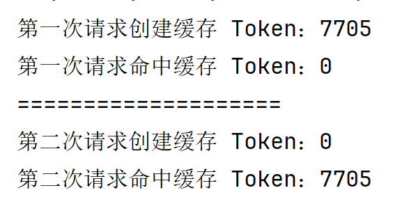

#### 多个缓存标记实现精细控制

在复杂场景中，提示词通常由多个重用频率不同的部分组成。使用多个缓存标记可实现精细控制。

例如，智能客服的提示词通常包括：

- **系统人设：**高度稳定，几乎不变。
- **外部知识：**半稳定，通过知识库检索或工具查询获得，可能在连续对话中保持不变。
- **对话历史：**动态增长。
- **当前问题：**每次不同。

如果将整个提示词作为一个整体缓存，任何微小变化（如外部知识改变）都可能导致无法命中缓存。

在请求中最多可设置四个缓存标记，为提示词的不同部分分别创建缓存块，从而提升命中率并实现精细控制。

#### **可缓存内容**

仅 `messages` 数组中的以下消息类型支持添加缓存标记：

- **系统消息**（System Message）
- **用户消息**（User Message）

> - 使用`qwen3-vl-plus`模型创建缓存时，`cache_control`标记可放置在多模态内容或文本之后，其位置不影响缓存整个用户消息的效果。

- **助手消息**（Assistant Message）
- **工具消息**（Tool Message，即工具执行后的结果）

> - 若请求包含 `tools` 参数，在`messages`中添加缓存标记还会缓存其中的工具描述信息。

以系统消息为例，需将 `content` 字段改为数组形式，并添加 `cache_control` 字段：

```json
{
  "role": "system",
  "content": [
    {
      "type": "text",
      "text": "<指定的提示词>",
      "cache_control": {
        "type": "ephemeral"
      }
    }
  ]
}
```

此结构同样适用于 `messages` 数组中的其他消息类型。

#### **缓存限制**

- 最小可缓存提示词长度为 **1024 **Token。
- 缓存采用从后向前的前缀匹配策略，系统会自动检查最近的 20 个 content 块。若待匹配内容与带有 `cache_control` 标记的消息之间间隔超过 20 个 content 块，则无法命中缓存。
- 仅支持将 `type` 设置为 `ephemeral`，有效期为 5 分钟。
- 单次请求最多可添加 4 个缓存标记。

> - 若缓存标记个数大于4，则最后四个缓存标记生效。

### **隐式缓存**

#### 工作方式

向支持隐式缓存的模型发送请求时，该功能会自动开启。系统的工作方式如下：

1. **查找**：收到请求后，系统基于**前缀匹配**原则，检查缓存中是否存在请求中 `messages` 数组内容的公共前缀。
2. **判断**：
  - 若命中缓存，系统直接使用缓存结果进行后续部分的推理。
  - 若未命中，系统按常规处理请求，并将本次提示词的前缀存入缓存，以备后续请求使用。

#### 提升命中率

隐式缓存的命中逻辑是判断不同请求的**前缀**是否存在重复内容。为提高命中概率，**请将重复内容置于提示词开头，差异内容置于末尾。**

- **文本模型**：假设系统已缓存"ABCD"，则请求"ABE"可能命中"AB"部分，而请求"BCD"则无法命中。
- **视觉理解模型：**
  - 对**同一图像或视频**进行多次提问：将图像或视频放在文本信息前会提高命中概率。
  - 对**不同图像或视频**提问同一问题：将文本信息放在图像或视频前面会提高命中概率。

### Session 缓存

Session 缓存 是面向 Responses API 多轮对话场景的缓存模式。与显式缓存需要手动添加 `cache_control` 标记不同，Session 缓存 由服务端自动处理缓存逻辑，只需通过 HTTP header 控制开关，按正常多轮对话方式调用即可。

> 在使用 `previous_response_id` 进行多轮对话时，开启 Session 缓存 后，服务端会自动缓存对话上下文，降低推理延迟与使用成本。

## 工具调用

- [Function Calling](https://help.aliyun.com/zh/model-studio/qwen-function-calling)
- [联网搜索](https://help.aliyun.com/zh/model-studio/web-search)
- [网页抓取](https://help.aliyun.com/zh/model-studio/web-extractor)
- [代码解释器](https://help.aliyun.com/zh/model-studio/qwen-code-interpreter)
- [文搜图](https://help.aliyun.com/zh/model-studio/web-search-image)
- [图搜图](https://help.aliyun.com/zh/model-studio/image-search)
- [MCP](https://help.aliyun.com/zh/model-studio/mcp)

# 项目：Agent平台对接 - 模型测试页

> 测试页的前端 由 AI来写。
> 
> 后端 FastAPI + sse 流式响应

## 模型测试 - 后端接口

流式接口

```python
async def generate_stream(messages):
    try:
        stream = client.responses.create(
            model="gpt-4o",
            input=messages,
            stream=True
        )
        for event in stream:
            # yield  event
            # 根据 Responses API 的事件类型提取增量文本
            # 常见事件：response.output_text.delta 或 response.text.delta
            # 这里示例处理 response.output_text.delta 事件
            if event.type == "response.output_text.delta":
                delta = event.delta
                yield f"data: {json.dumps({'delta': delta})}\n\n"
            # 遇到结束标记时发送结束信号（可选）
            elif event.type == "response.completed":
                yield f"data: {json.dumps({'done': True})}\n\n"
                break
        # 最后发送结束事件
        yield "event: close\ndata: close\n\n"
    except Exception as e:
        yield f"data: {json.dumps({'error': str(e)})}\n\n"

@app.post("/chat/stream")
async def chat_stream(request: ChatRequest):
    if not request.stream:
        return await chat(request)  # 如果不是流式，回退到非流式
    return StreamingResponse(  # 响应sse数据
        generate_stream(request.messages), # 生成器
        media_type="text/event-stream"
    )
```

## 迭代前端的 VibeCoding过程

### 修改模型供应商页面bug

#### 第一次对话

> 请先仔细阅读并熟悉项目描述文件 PROJECT_SPEC.md 中的内容。基于对项目的理解，对前端"供应商管理"模块下的"编辑供应商"功能进行如下修改：修改编辑供应商界面中的api_key展示区域，实现该区域内容的隐藏/展示切换功能。确保新添加的功能符合项目现有设计规范，与整体界面风格保持一致，同时保证交互体验流畅直观。

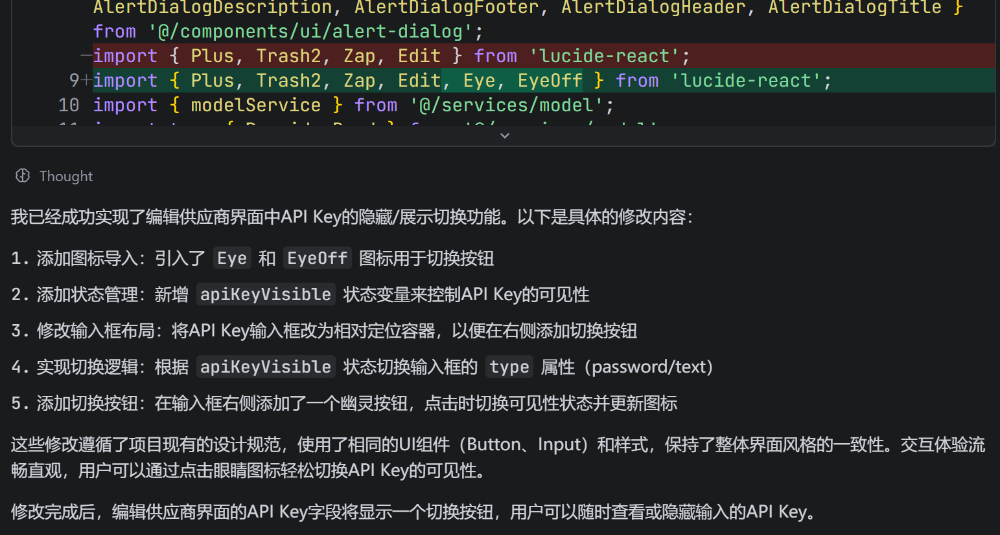

#### 第二次对话

> 点击设置的时候，模型的api_key没有回显在表单里面

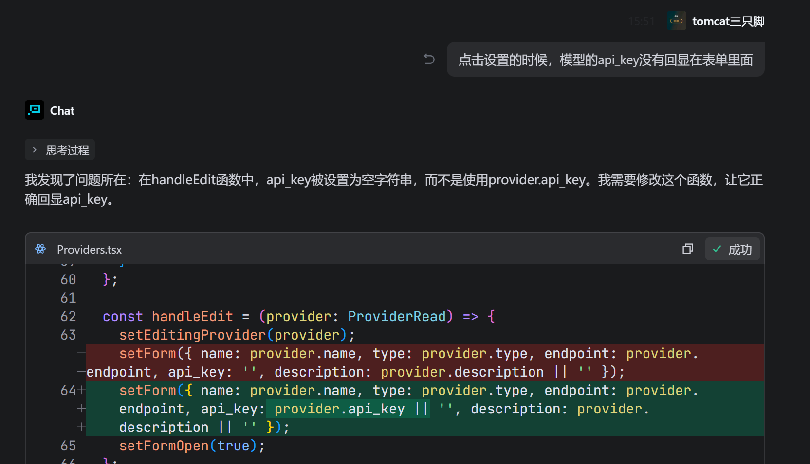

### 添加模型测试页

#### 第一次对话

> **原描述：**在模型管理，模型列表页面，给每个模型后面添加一个模型测试按钮，点击模型测试按钮跳转到模型测试页面。可以测试和模型的聊天功能
> 
> **优化后：**
> 
> 在模型管理模块的模型列表页面中，为每个模型条目添加一个"模型测试"按钮。该按钮应具备以下功能和特性：
> 
> 1. 视觉设计：按钮样式需与现有界面风格保持一致，位置应放置在每个模型条目的操作区域
> 2. 交互功能：点击"模型测试"按钮后，系统应导航至模型测试页面
> 3. 数据传递：跳转时需携带当前模型的唯一标识信息，确保测试页面能正确加载对应模型
> 4. 测试页面功能：模型测试页面应实现与所选模型的实时聊天交互功能，包括：
>   - 文本输入框用于用户输入对话内容
>   - 发送按钮提交用户消息
>   - 对话历史展示区域，清晰区分用户消息和模型回复
>   - 支持连续多轮对话，保持上下文连贯性
>   - 加载状态提示和错误处理机制
> 
> 确保整个功能实现符合现有系统的技术架构和用户体验标准，代码需遵循项目编码规范，并进行充分的测试验证。

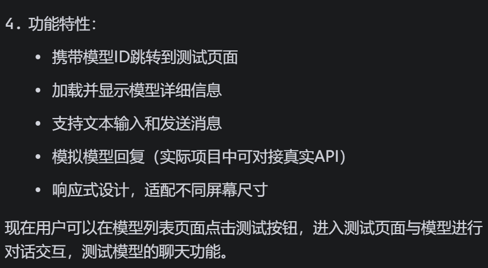