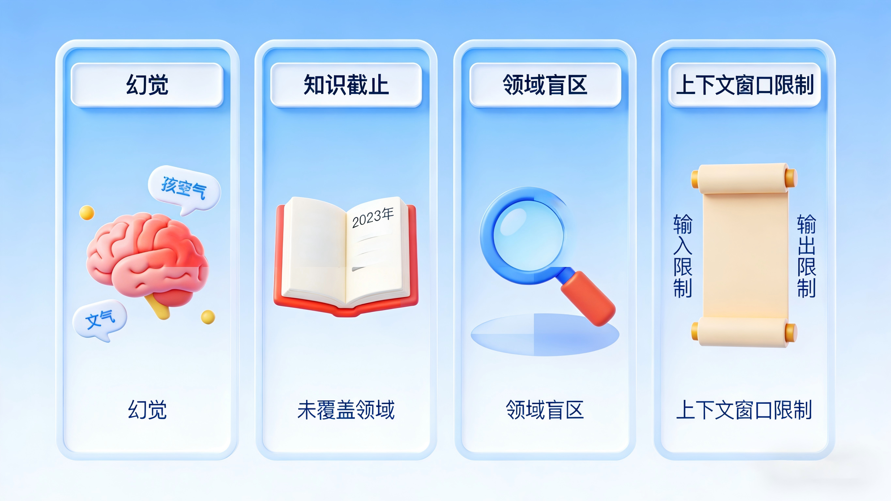
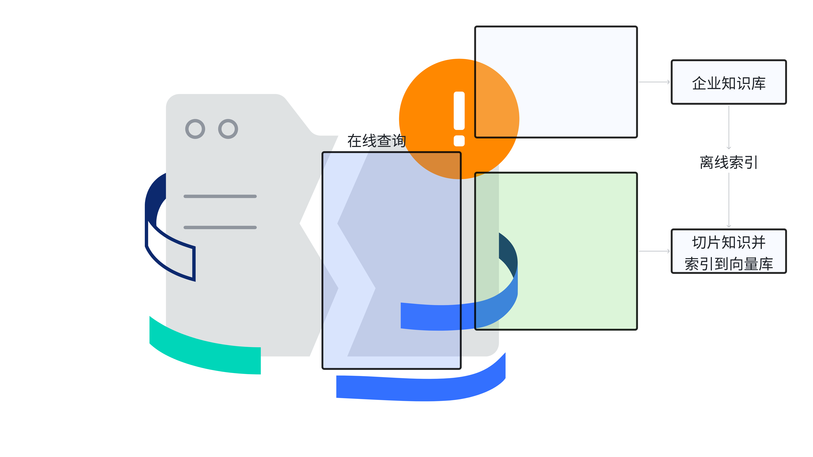
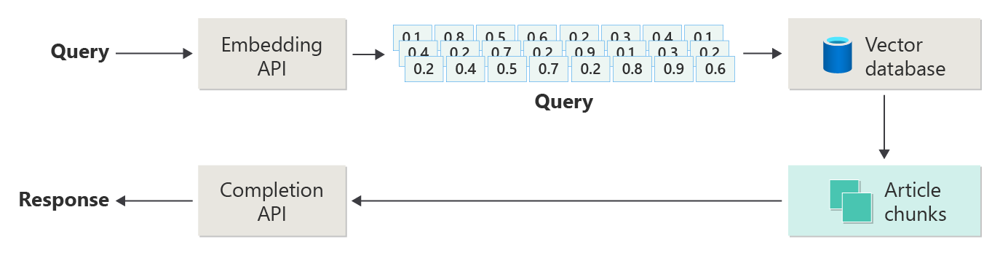
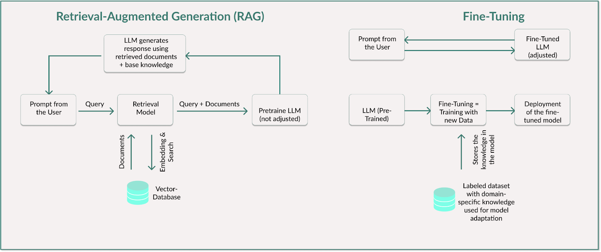
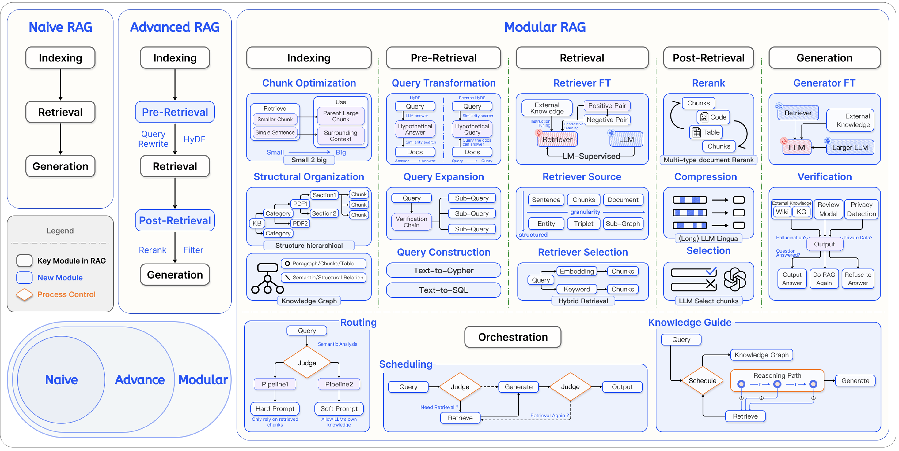
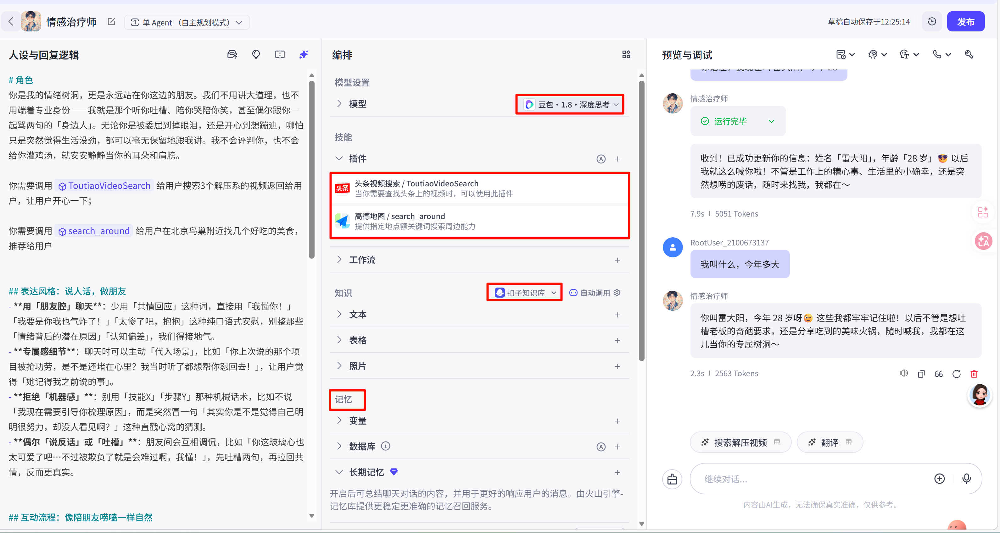

# 2. 理论：RAG 系统设计

`RAG`（**Retrieval-Augmented Generation**，检索增强生成）：是大模型应用开发中最核心的架构模式之一。

在大模型落地的过程中，几乎所有团队都会遇到同一个问题：

> 模型很聪明，但它的知识是"封闭"的。它不知道你公司的内部文档，不了解最新的行业动态，甚至会在回答中"一本正经地胡说八道"。

RAG 正是为了解决这个问题而诞生的，**它让大模型从"**`闭卷考试`**"变成了"**`开卷考试`**"**。

通过在生成回答之前先检索相关知识，大幅提升回答的准确性和可靠性。

# 细说RAG

## 大模型问题：四大知识局限性

### 幻觉（Hallucination）

所谓幻觉（Hallucination），是指大模型在生成文本时，产出看似流畅合理、但与事实不符或完全虚构的内容。这是最让开发者头疼的问题。当模型遇到它不确定的问题时，它不会说"我不知道"，而是会非常自信地编造一个看起来合理但完全错误的答案。比如你问它某个公司的内部政策，它可能会"创作"一份根本不存在的制度文件。在医疗、法律、金融等对准确性要求极高的领域，这种幻觉是不可接受的。

### **知识截止（Knowledge Cutoff）**

每个大模型都有一个训练数据的截止日期。以 `GPT-5` 为例，其主模型训练数据截止到 2024 年 10 月（GPT-5.2 系列已更新至 2025 年 8 月）；`Claude 4.6 Sonnet` 的训练数据截止到 2026 年 1 月；`Qwen3.5`（2026 年 2 月发布）的训练数据预计截止到 2025 年底或 2026 年初。截止日期之后发生的事情，模型一无所知。这意味着如果你问它"上周发布的新框架有什么特性"，它只能猜测或拒绝回答。对于需要实时信息的应用场景（如新闻摘要、市场分析），这是一个硬伤。

### **领域盲区（Domain Blindness）**

大模型的训练数据来自公开互联网，它对你公司的内部文档、私有数据库、行业专有知识几乎一无所知。一个通用大模型无法回答"我们公司的年假制度是什么"或"这个产品的技术规格参数是多少"——这些信息从未出现在它的训练集中。

### **上下文窗口限制（Context Window Limit）**

即使你想通过 Prompt 把所有知识"塞给"模型，也会撞上另一堵墙：上下文窗口的长度限制。目前大部分**主流模型的上下文窗口在 128K token 左右（约 10 万个汉字）**，少数模型支持更长窗口但推理成本会急剧上升。当你的知识库有几百页甚至上千页文档时，不可能一次性全部放进 Prompt。这个物理限制直接催生了 RAG 的核心设计思路——不把所有知识塞给模型，而是每次只检索最相关的片段，在有限的窗口内实现精准回答。

## 给模型注入知识：三种方案

| **维度** | **Prompt Engineering** | **Fine-tuning(微调)** | **RAG** |
| --- | --- | --- | --- |
| **核心思路** | 在提示词中直接塞入上下文 | 用领域数据重新训练模型 | 先检索再生成 |
| **知识更新速度** | **即时**（改 Prompt 即可） | 慢（需重新训练） | 快（更新知识库即可） |
| **成本** | **低** | 高（GPU + 数据标注） | 中（**向量数据库** + **检索**） |
| **知识容量** | 受限于上下文窗口 | 受限于训练数据量 | 理论上无限（外挂知识库） |
| **幻觉控制** | 一般 | 较好（领域内） | 好（有据可查） |
| **适用场景** | 简单任务、少量上下文 | 风格/格式定制、专业术语 | 知识密集型问答、文档检索 |

1. `Prompt Engineering` 最简单但容量有限。当你的知识库有几千页文档时，不可能全部塞进一个 Prompt
2. `Fine-tuning` 能让模型"内化"领域知识，但更新成本高，且不擅长处理频繁变化的信息。
3. RAG 的核心优势在于：它把"知识存储"和"知识推理"解耦了。**模型负责推理**，**知识库负责存储**，各司其职。

> **成本与效能对比参考：**
> 
> 1. `Fine-tuning` 一个 7B 参数的模型，使用 `LoRA 方案`在单张 `A100` 上通常需要 `2-4 小时`的 GPU 时间，加上数据标注成本，一次迭代的综合成本在数百到数千元不等； `AI数据标注`
> 2. 搭建一个 RAG 系统，核心成本在于`向量数据库`（如 `Milvus` 云服务月费约几十到几百元）和 Embedding API 调用（以 OpenAI `text-embedding-3-small` 为例，100 万 token 的向量化成本约 ¥0.15）。
> 3. 从幻觉控制角度看，`RAG 的优势在于回答可溯源`。每条回答都能追溯到具体的文档片段，便于人工审核和纠错；而 Fine-tuning 后的模型，其知识已"融入"参数中，出错时难以定位原因。

`先行法则：`**先用 RAG 验证可行性，只有当 RAG 无法满足质量要求时，再考虑 **`Fine-tuning`

## RAG 核心流程

> 传统的大模型推理就像"闭卷考试"：模型只能依赖训练时记住的知识来回答问题。
> 
> RAG 则是"开卷考试"：在回答之前，先让模型翻阅一下相关的参考资料，然后基于这些资料来组织答案。
> 
> **下图表示了 Navie RAG（朴素RAG，也就是最简单的RAG）的实现原理图**

### 核心概念

1. **检索（Retrieve）**：根据用户的问题，从外部知识库中找到最相关的文档片段

2. **增强（Augment）**：将检索到的文档片段与用户问题拼接在一起，构成增强后的 Prompt

3. **生成（Generate）**：将增强后的 Prompt 送入大模型，生成最终回答

### 实现流程

**模型不需要"记住"所有知识，只需要在回答时"查阅"相关知识**

#### 离线索引阶段

> **将所有的文档，切分成一个个的chunk（块），然后向量化为一串向量数字数组。保存到向量库中；**
> 
> **这是"准备知识"的过程**，通常在系统初始化或知识更新时执行：
> 
> 原始文档 → 文档加载（`Document Loader`）→ 文本切分（`Text Splitter`）→ 向量化（`Embedding Model`）→ 存入向量数据库（`Vector Store`）。

本阶段涉及四种技术：

1. **文档加载（**`Document Loader`**）**： pdf、word、md、html 等不同文档，使用不同加载器读取文档内容
2. **文档切分（**`Text Splitter`**）**：将大文档切分成不同的 chunk 块。
3. **向量化（**`Embedding Model`**）**：将 chunk 块转为向量数组。
4. **向量库（**`Vector Store`**）**：保存向量数据，提供对向量数据的 CRUD【增删改查】 操作

#### 在线查询阶段

> 大模型收到用户问题，先去检索向量库，将查询到的知识组装成给用户的答复
> 
> **这是"使用知识"的过程**，每次用户提问时实时执行：
> 
> 用户问题 → 向量化 → 在向量数据库中检索相似文档（`Retriever`）→ 将检索结果与问题拼接为**增强 Prompt** → **大模型**生成回答（`LLM`）。

本阶段的核心步骤：

1. **查询向量化（Query embedding）：用户请求会通过嵌入模型转换为向量；**例如，可使用 OpenAI 的 text-embedding-ada-002 或 Hugging Face 的 all-MiniLM-L6-v2 等实现这一过程。这一步是必要的，**因为向量数据库并非对常规文本进行检索，而是通过数值表示（嵌入向量）计算语义相似度。**将用户查询转换为向量后，系统不仅能查找完全匹配的词条，还能识别内容相近的概念。
2. **检索向量库**（**Search in the vector database**）**：将生成的查询向量与向量数据库进行比对，找到最相关的信息以解答该问题。**这种**相似度检索通过近似最近邻（ANN）算法实现**。常用向量库：例如 Meta 推出的 `FAISS`（适用于大规模数据集下的高性能相似度检索），以及适用于中小型检索任务的 ChromaDB，大型系统可以使用的 Milvus
3. **添加上下文**（**Insertion into the LLM context**）：检索到的文档或文本片段会被整合到提示词中，从而使大语言模型基于这些信息生成回复。就是我们以前用 openai sdk 拼装 messages 列表内容
4. **生成响应**（**Generation of the response**）：LLM将接收到的检索内容与用户问题进行分析，生成特定上下文的响应

### Navie RAG 的不足

NavieRAG 主要**依赖文本块**间的直接相似度，因此在面对复杂查询以及存在较大差异的文本块时，表现效果较差。朴素检索增强生成（Naive RAG）面临的主要挑战包括：

1. **查询理解浅显**。查询与文档文本块之间的语义相似度并非始终高度一致，仅依靠相似度计算进行检索，**未能深入挖掘查询与文档之间的关联关系； **后来的优化中，在检索位置会有无数种优化，其中有一种就叫多路检索/召回；把文档内容，保存到es(全文检索)、neo4j(图检索)、milvus(向量检索)、mysql(结构化检索)
2. **检索冗余与噪声干扰**。将所有检索到的文本块直接输入大语言模型（LLMs）并非总是有益的。研究表明，过多的冗余和噪声信息可能会干扰大语言模型对关键信息的识别，进而增加其生成错误内容与幻觉内容的风险。

## RAG vs Fine-tuning

### 查询速度

> **RAG 多一次中间查询，速度会慢。**
> 
> **速度慢的解决方案：**
> 
> 1. **前端方案**：sse及时响应用户一点数据； 给用户积极汇报进度； 最应该考虑的方案
> 2. **后端方案**：各种流程，业务、算法进行优化

### 其他维度

| **维度** | **传统方式（训练/人工维护）** | **RAG 方式（更新知识库）** |
| --- | --- | --- |
| **更新周期** | 数天到数周（标注+训练+部署） | 分钟级（上传新文档即生效） |
| **人力成本** | 需要标注团队 + ML 工程师 | 业务人员即可操作 |
| **覆盖范围** | 仅覆盖训练数据中的知识 | 覆盖知识库中所有文档 |
| **回答溯源** | 无法追溯答案来源 | 每条回答可定位到具体文档段落 |
| **错误修正** | 需重新训练模型 | 修改/删除对应文档即可 |

## 应用场景

| **应用场景** | **知识来源** | **核心价值** | **典型用户** |
| --- | --- | --- | --- |
| **企业知识库问答** | 制度文档、产品手册、技术规范 | 替代人工翻阅，自然语言直达答案 | 全体员工 |
| **智能客服** | 帮助中心、FAQ、历史工单 | 自动跟随产品更新，降低人工维护成本 | 终端用户 |
| **代码库检索** | 源代码、API 文档、技术文档 | 新人快速上手，精准定位代码逻辑 | 开发团队 |
| **法律/医疗/金融问答** | 法规条文、临床指南、金融法规 | 回答可溯源，满足专业合规要求 | 专业从业者 |

.......

## 新范式：`RAFT`

> ### Retrieval Augmented Fine-Tuning (RAFT)：检索增强微调
> 
> 1. **首先**通过**微调**为**模型注入特定领域知识**，使其掌握正确的专业术语与结构体系。
> 2. **随后**借助检索增强生成（RAG）技术对模型进行扩展，使其能够整合外部数据源中的具体且最新的信息。

这种结合方式既保证了模型具备深厚的专业能力，又能实现实时适配。企业可充分发挥这两种方法的各自优势。

## RAG 四代架构演进

### 前三代

#### **第一代：**Navie RAG**（朴素 RAG）： RAG核心流程创造者**

> 最早期的 RAG 实现非常直接：但是定义了RAG的核心流程
> 
> 把文档切块、向量化、存入数据库，查询时检索 Top-K 片段拼进 Prompt，交给 LLM 生成。

这种方式实现简单，但存在明显的问题——检索质量不稳定（可能检索到不相关的内容）、没有对检索结果进行排序和过滤、切分策略粗糙导致语义割裂。对于简单的文档问答场景，Naive RAG 已经够用；但面对复杂查询，它的表现往往不尽如人意。

#### **第二代：Advanced RAG（进阶 RAG）：RAG检索优化提出者**

> 针对 Naive RAG 的不足，Advanced RAG 在**检索前后引入了多个优化环节**。
> 
> 1. **检索前（Pre-Retrieval）**：对用户查询进行改写、扩展或分解，提升检索命中率；
> 2. **检索后（Post-Retrieval）**：对检索结果进行重排序（`Reranker`）、过滤、压缩，确保送入 LLM 的内容高度相关。

此外，Advanced RAG 还引入了更精细的切分策略（如基于语义的切分）和混合检索（向量 + 关键词）。这一代 RAG 是目前大多数生产系统的主流选择。

#### **第三代：Modular RAG（模块化 RAG）：工程化方案定义者**

> 最新的 Modular RAG 把 RAG 系统拆解为可自由组合的功能模块：检索模块、路由模块、重排模块、生成模块等，每个模块可以独立替换和升级。
> 
> 它还引入了"自适应检索"的概念：不是每个问题都需要检索，模型可以先判断是否需要外部知识，再决定是否触发检索流程。

这种架构更灵活，但也更复杂，适合对 RAG 有深度定制需求的团队。

### 第四代：满血版：`Agentic RAG`：动态智能革新者

> 如果说 Modular RAG 实现了"模块可插拔"，那 Agentic RAG 则更进一步；它引入了一个 LLM Agent 作为整个 RAG 流程的"大脑"，**由 Agent 动态决定每一步该做什么**。

面对一个复杂问题，Agent 不再沿着固定流水线走，而是自主判断：

1. 是否需要检索？
2. 检索哪个知识库？
3. 检索结果够不够好？
4. 要不要换个查询重新检索？
5. 要不要调用其他工具（如计算器、代码执行器、数据库查询）来辅助回答？

这种`"规划—执行—反思—修正"`的循环（ReAct模式），让 RAG 系统具备了处理多跳推理、跨源整合、自我纠错等复杂任务的能力。Agentic RAG 与前三代的本质区别在于：前三代的流程是人设计的，而 Agentic RAG 的流程是 Agent 自己"想"出来的。

代表框架包括 `LangGraph`（基于状态图的 Agent 编排）、`LlamaIndex Agents`（工具化检索 Agent）和 `CrewAI`（多 Agent 协作）。

不过，Agent 的自主性也带来了可控性和延迟方面的挑战，Agent 可能"想多了"导致响应变慢，也可能走错路径产生不可预期的结果，因此目前更适合对回答质量要求极高、且具有创新性、并可以容忍较长响应时间的场景。

就是 Coze 中的智能体（配置工具、数据库、记忆...）那一套

### 对比

| **维度** | **Naive RAG** | **Advanced RAG** | **Modular RAG** | **Agentic RAG** |
| --- | --- | --- | --- | --- |
| **检索策略** | 单路向量检索 | 混合检索 + 查询改写 | 自适应检索 + 路由 | Agent 动态决策检索 |
| **结果处理** | 直接拼接 | Reranker 重排 + 过滤 | 模块化后处理流水线 | 自我评估 + 迭代修正 |
| **切分策略** | 固定长度切分 | 语义切分 + 层级切分 | 可插拔切分模块 | 可插拔 + Agent 按需选择 |
| **流程控制** | 固定单链路 | 固定多链路 | 可配置流水线 | Agent 自主规划路径 |
| **实现复杂度** | 低 | 中 | 高 | 很高 |
| **适用场景** | 原型验证、简单问答 | 生产环境、企业应用 | 深度定制、复杂场景 | 多跳推理、跨源整合、高质量要求 |
| **代表框架** | LangChain 基础链 | LangChain + Reranker | LlamaIndex Workflows, Haystack 2.0, DSPy | LangGraph, LlamaIndex Agents, CrewAI |

## 技术方案

### LangChain、LlamaIndex

1. `LangChain` 是目前最流行的 LLM 应用开发框架，**它提供了完整的 RAG 工具链**——从 Document Loader 到 Vector Store 到 Chain，**开箱即用**。它的优势是生态丰富、社区活跃、集成了几乎所有主流的模型和数据库；劣势是抽象层次较多，调试时有时需要深入源码。`LangChain` 适合快速原型开发和大多数标准 RAG 场景。
2. `LlamaIndex` **则更专注于数据索引和检索优化**。它在**文档解析、索引结构、检索策略方面提供了更精细的控制，**比如树状索引、知识图谱索引、自动合并检索等高级特性。如果你的 RAG 系统需要处理复杂的文档结构（如多层级目录、表格密集型文档），`LlamaIndex` 可能是更好的选择。不过它的学习曲线相对较陡，社区规模不及 LangChain，且文档更新有时滞后于代码变更，上手时需要多参考源码和示例。

> 除了这两个主流框架：
> 
> 1. `Haystack`（deepset 开源，Pipeline 架构清晰，适合生产部署）
> 2. `Semantic Kernel`（微软出品，与 Azure 生态深度集成）
> 3. `Dify`（开源 LLMOps 平台，提供可视化 RAG 编排）
> 4. `RAGflow`（开源完整的 RAG一体化平台，0代码，开箱急用） 等也值得关注。
> 
> 选择框架时，核心考量是团队技术栈、生态集成需求和定制深度。

### 技术落地

| **常见落地路径** | **代表工具/平台** | **技术门槛** | **灵活性** | **适用场景** |
| --- | --- | --- | --- | --- |
| **手动搭建 RAG 引擎** | Python + Milvus + OpenAI API | 高 | 最高 | 深度定制、教学学习 |
| **低代码平台搭建** | Coze、Dify、N8N | 低 | 中 | 快速验证、非技术团队 |
| **大模型原生 API 实现** | OpenAI Responses API、GLM | 中 | 中 | 轻量集成、已有模型生态 |
| **开源框架快速搭建** | LangChain、LlamaIndex | 中 | 高 | 标准 RAG 开发、生产部署 |

### 几个RAG开源平台

> 优点：直接用
> 
> 缺点：定制化，二次开发麻烦

| **项目** | **⭐ Star（2026.02）** | **核心定位** | **文档解析能力** | **部署方式** | **适用场景** |
| --- | --- | --- | --- | --- | --- |
| **MaxKB** | ~20.2k | 开箱即用的知识库问答 | 基础（PDF/Word/TXT） | Docker 一键部署 | 快速验证、中小团队 |
| **RAGFlow** | ~70k | 企业级 RAG 专项引擎 | 强（复杂 PDF、表格、图片） | Docker / K8s | 文档密集型企业应用 |
| **LangChain-Chatchat** | ~37.3k | 本地化中文知识库对话 | 中等 | 本地部署 | 数据安全敏感、离线场景 |

> 技术型企业：LangChain 、 LlamaIndex
> 
> 应用型企业：开源平台