# 3. 手搓：Naive RAG 原理

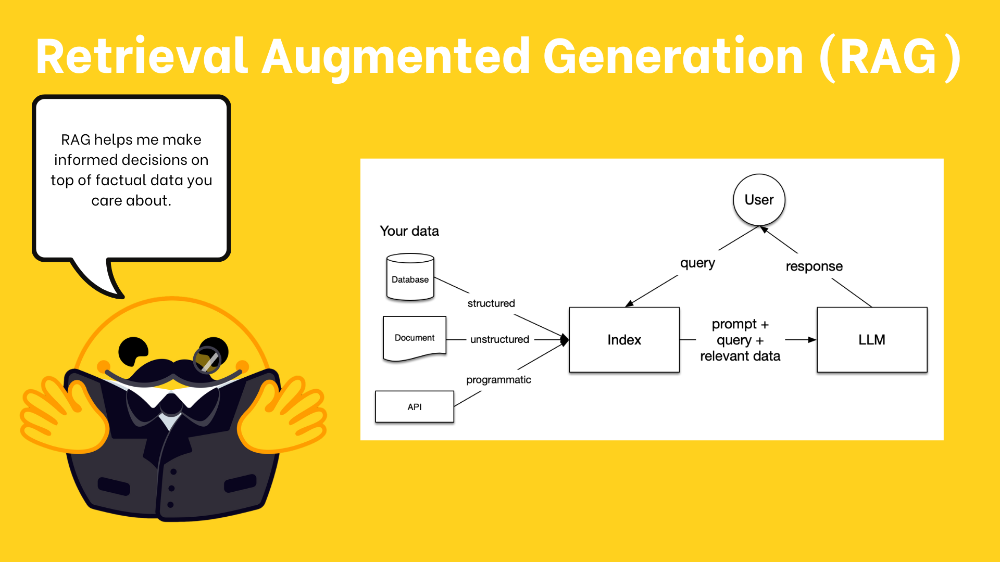

# 架构流程

## 运行流程

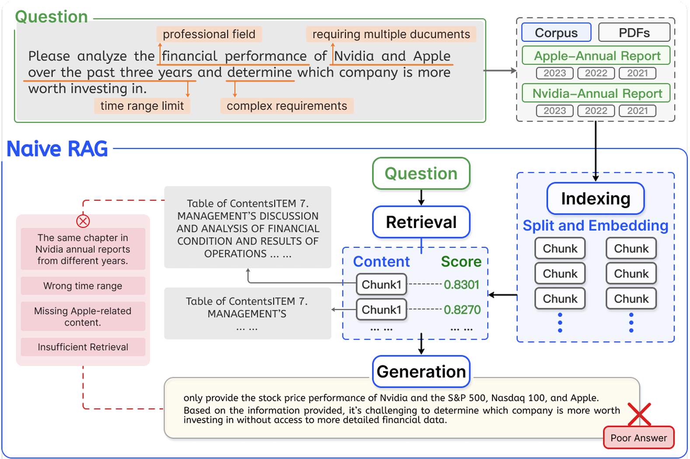

> 离线索引

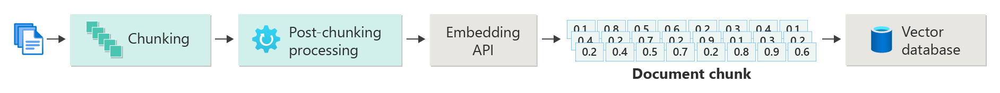

> 在线查询


## **六大核心组件**

| **组件** | **解决的问题** | **输入** | **输出** | **典型工具** |
| --- | --- | --- | --- | --- |
| **Document Loader** | 如何读取各种格式的文档？ | PDF/Word/HTML/数据库 | 统一的` Document `对象 | LangChain Loaders, Unstructured |
| **Text Splitter** | 如何把长文档切成合适的片段？ | 完整文档 | 文档片段（Chunks） | RecursiveCharacterTextSplitter |
| **Embedding Model** | 如何把文本变成计算机能比较的向量？ | 文本字符串 | 高维浮点向量 | OpenAI Embedding, BGE, M3E，Qwen |
| **Vector Store** | 如何高效存储和检索海量向量？ | 向量 + 元数据 | 相似向量检索结果 | FAISS, Chroma, **Milvus**, Weaviate |
| **Retriever** | 如何找到与问题最相关的文档片段？ | 用户问题 | Top-K 相关文档片段 | 向量检索, BM25, 混合检索 |
| **LLM** | 如何基于检索结果生成准确回答？ | 增强 Prompt | 自然语言回答 | GPT-4, Qwen, Llama |

# 离线索引阶段


## **Embeddings：嵌入**

为什么计算机能比较**两段文字**的"**相似度**"？

答案正是 `Embedding`——文本向量化技术。它是理解后续所有步骤的数学基础。

### **什么是 Embedding**

> `Embedding`**（向量化）是将文本映射为固定长度浮点数数组的过程**。
> 
> 可以把它理解为：把一段文字"翻译"成一组坐标，让语义相近的文字在这个坐标空间里距离更近。
> 
> 举个直觉性的例子——"如何申请年假"和"请假流程是什么"，虽然用词完全不同，但经过 Embedding 之后，它们对应的坐标（向量）会非常接近；而"如何申请年假"和"Python 列表排序"的向量则会相距很远。这就是 RAG 能够做到"语义检索"的核心机制。

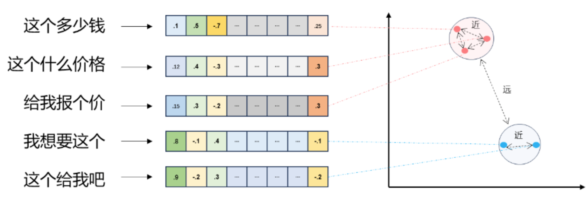

### 向量维度

`Embedding` 模型输出的向量有`固定的维度（Dimension）`，维度越高，能捕捉的语义细节越丰富，但计算和存储成本也越高。常见的模型维度从 `512` 到 `3072` 不等。

对于`中文 RAG 场景`，`1024 维`通常已经足够，不必盲目追求更高维度。

> 简单来说： 1024维向量就是一个  1024 大小的 float 数组. (x,y,z,w,q,e,k,.....)

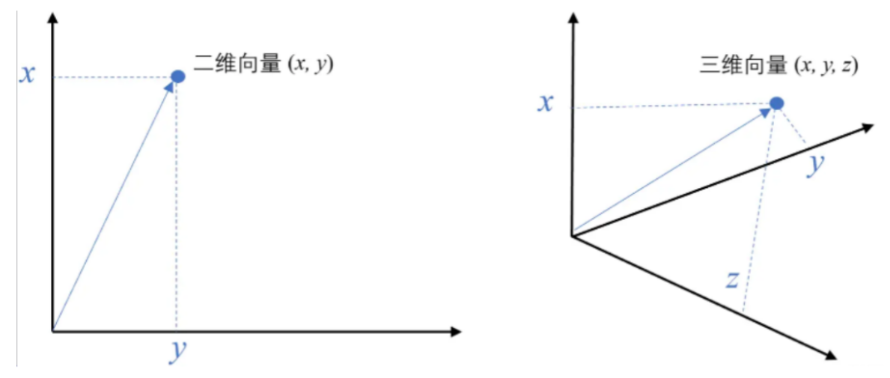

### **主流 Embedding 模型对比**

| 模型 | 提供方 | 维度 | 中文能力 | 调用方式 | 备注 |
| --- | --- | --- | --- | --- | --- |
| `text-embedding-3-small` | OpenAI | 1536 | 一般 | API | 当前主线，未废弃 |
| `text-embedding-3-large` | OpenAI | 3072 | 一般 | API | 当前主线，未废弃 |
| `text-embedding-v3`（Qwen） | 阿里云 | 1024 | 强 | API（兼容 OpenAI 协议） | 稳定可用；中文语料训练充分 |
| `text-embedding-v4`（Qwen） | 阿里云 | 1024 | 更强 | API（兼容 OpenAI 协议） | v3 的升级版，中文覆盖更广、性能更强，可选升级 |

> HuggingFace 和 Ollama 都有对应的 embedding 模型

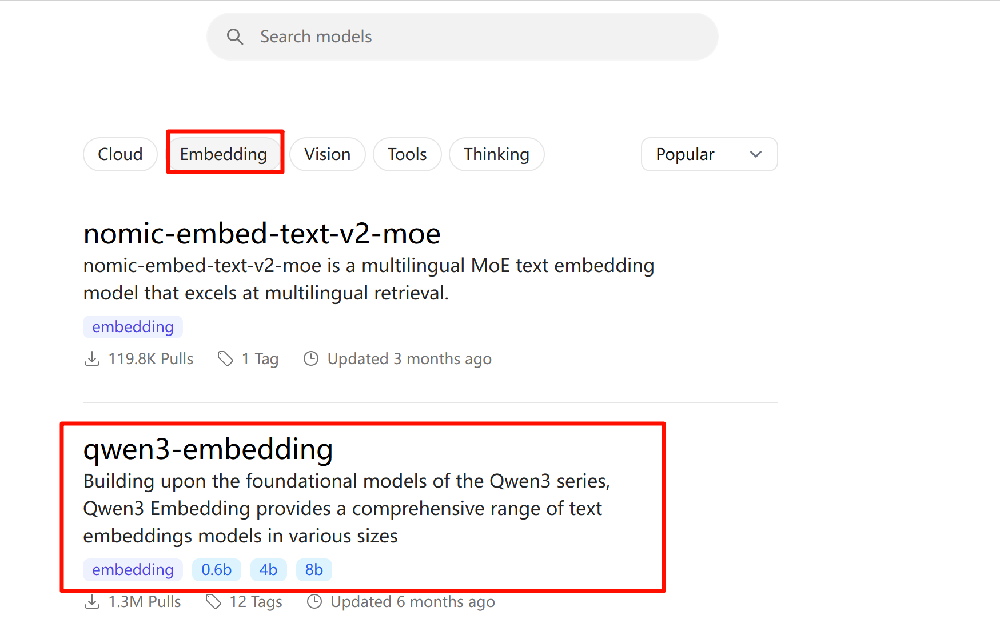

文本 ==> 嵌入模型 ==> N维向量  [0.98, 0.88, 0.76, ....]

> ⚠️ **常见误区**：很多初学者以为**"维度越高越好"**。实际上，对同一模型来说更高维度确实保留更多信息；但跨模型比较时，低维度的专业中文模型（如 `text-embedding-v3`）可能比高维度的通用模型效果更好。选模型要看使用场景和中文覆盖，而不是只看维度数字。

### **代码实操：Embedding API 接入**

创建：* *`embedding_api.py`

#### 第一步：.env 环境配置

> 注意，配置了 百炼平台的两种 api 接口，请改成自己的api_key

```json
BASE_URL_CHAT=https://dashscope.aliyuncs.com/compatible-mode/v1
BASE_URL_RESPONSE=https://dashscope.aliyuncs.com/api/v2/apps/protocols/compatible-mode/v1
BASE_URL=http://localhost:11434/v1
API_KEY=sk-ccd167dc0a7e446e8f5f0f8d45c31a78
```

#### 第二步：ollama下载模型

```json
ollama pull qwen3-embedding:4b
```

#### 第三步：获取embedding数据

> 阿里云云厂商模型：text-embedding-v1  到 text-embedding-v4
> 
> 本地ollama模型：qwen3-embedding:4b

```python
from dotenv import load_dotenv
import os
from openai import OpenAI

load_dotenv()

api_key = os.getenv("API_KEY")
base_url = os.getenv("BASE_URL_CHAT")


client = OpenAI(
    api_key=api_key,
    base_url=base_url,
)
model = "text-embedding-v3"

def get_embedding(text: str,client: OpenAI,model: str) -> list[float]:
    """单文本向量化：返回一个浮点数列表"""
    response = client.embeddings.create(
        model=model,
        input=text
    )
    return response.data[0].embedding

def get_embeddings_batch(text: [str],client: OpenAI,model: str) -> list[list[float]]:
    """多文本向量化：返回一个浮点数列表的列表"""
    response = client.embeddings.create(
        model=model,
        input=text
    )
    return [item.embedding for item in response.data]


def embedding_test():
    embedding = get_embedding("你好",client,model)
    print(f"embedding: {embedding[:10]}") # 只打印前10个元素
    print(f"embedding 长度: {len(embedding)}")

    embeddings = get_embeddings_batch(["你好","你好吗"],client,model)
    for embedding,text in zip(embeddings,["你好","你好吗"]):
        print(f"{text} 的 embedding: {embedding[:10]}")

# 调用测试
embedding_test() 
```

### text-embedding-v3

`嵌入的维度`：  `1024`+ 512 = `1536`

## 构建离线知识库

完整路线： 原始文档 → 文档加载 → 文本切分 → 向量化 → Milvus 索引持久化

### **文档加载：手搓 Document Loader**

能调通 `Embedding API` 之后，下一步是把知识库中的文档"读进来"。这一步被称为 `Document Loader`。

> ### 数据质量
> 
> 它的职责是把各种格式的文件统一转换为结构化的文本对象。看起来简单，却是影响 RAG 系统质量的第一道关卡，**垃圾进，垃圾出（Garbage In, Garbage Out）**，文档解析不准确，后续所有步骤都会受到影响。

#### 函数定义：统一输出

> 无论输入是 PDF、TXT 还是 Markdown，我们的 `Document Loader` 都应该输出相同结构的字典对象：
> 
> `{"content": 文本内容, "metadata": 来源信息}`
> 
> 其中 `metadata` 记录文件路径、文件类型等溯源信息，为后续检索结果追溯提供依据——当用户问"这个回答的依据是什么"时，我们需要能指向具体文件。以下是完整实现：

#### 函数实现

创建：` document_loader_api.py`

安装依赖：`pip install pypdf `

```python
import os
from pypdf import PdfReader
# 注意：pypdf 是 PyPDF2 的官方继任者（PyPDF2 已停止维护），
# 如果你在网上搜到的教程使用 import PyPDF2，请改为 import pypdf，API 基本兼容


def load_txt(file_path: str) -> dict:
    """加载 TXT / Markdown 文件，统一编码为 utf-8"""

    # 根据 path 获取文件名
    file_name = os.path.basename(file_path)

    with open(file_path, 'r', encoding='utf-8') as f:
        return {
            "content": f.read(),
            "metadata": {"source": file_path, "type": "txt", "name": file_name}
        }


def load_pdf(file_path: str) -> dict:
    """加载 PDF 文件：逐页提取文本，用换行符拼接各页内容"""
    reader = PdfReader(file_path)
    # 根据 path 获取文件名
    file_name = os.path.basename(file_path)
    # 读取pdf
    text = "\n".join(page.extract_text() or "" for page in reader.pages)
    return {
        "content": text,
        "metadata": {"source": file_path, "type": "pdf", "pages": len(reader.pages), "name": file_name}
    }


def load_document(file_path: str) -> dict:
    """统一入口：根据扩展名自动选择加载器"""

    ext = os.path.splitext(file_path)[1].lower()
    loaders = {".txt": load_txt, ".md": load_txt, ".pdf": load_pdf}
    loader = loaders.get(ext)
    if not loader:
        raise ValueError(f"不支持的文件格式: {ext}（当前支持：.txt .md .pdf）")
    return loader(file_path)


# 函数测试
def load_test():
    file_name1 = "..\测试物料\python_faq.txt"
    file_name2 = "..\测试物料\员工假期管理制度.pdf"
    file_name3 = "..\测试物料\辰光Agent平台说明书.md"

    doc1 = load_document(file_name1)
    print(f"txt文档，字符数：{len(doc1['content'])} \n 内容：{doc1['content']} \n 元数据：{doc1['metadata']}")
    print("=" * 50)
    doc2 = load_document(file_name2)
    print(f"pdf文档，页码数：{doc2['metadata']['pages']} \n 内容：{doc2['content']} \n 元数据：{doc2['metadata']}")
    print("=" * 50)
    doc3 = load_document(file_name3)
    print(f"md文档，字符数：{len(doc3['content'])} \n 内容：{doc3['content']} \n 元数据：{doc3['metadata']}")

load_test()
```

#### 思考：哪里有问题

##### 问题：pdf 内容格式解析混乱

> Pdf 出现：
> 
> 1. 页眉页脚混入正文
> 2. 表格格式信息丢失
> 3. 图片不会被识别
> 4. ....

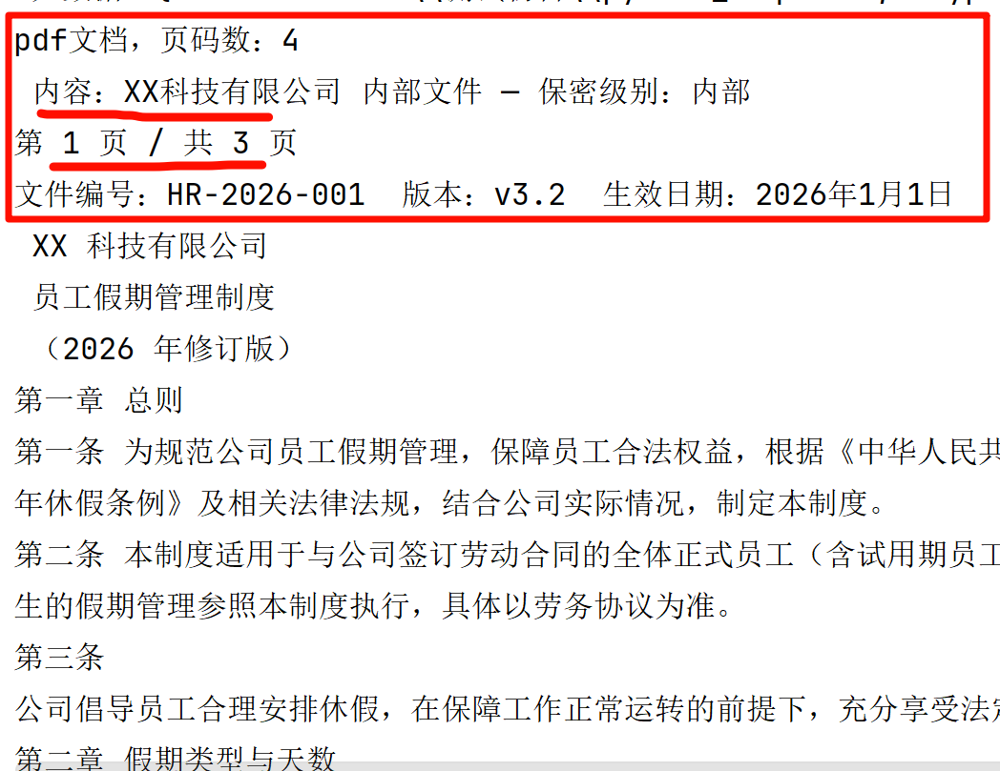

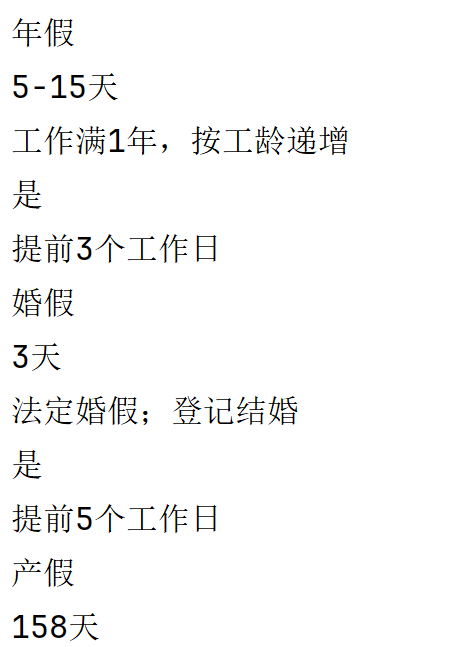

##### 优化方案

1. 页眉页脚噪声和表格结构丢失是 PDF 解析中最普遍的两个问题，也是 RAG 系统"答非所问"的常见根源之一。我们刻意保留了这两个问题，让你亲眼看到它们。生产环境的处理方案包括：
  1. 用正则过滤页眉页脚模式
  2. 对含表格的 PDF 改用 `pdfplumber` 或 `pymupdf` 提取
  3. 将表格转为 Markdown 格式后再入库； 大模型最喜欢 Markdown 格式文本

这些进阶技巧将在后续章节的结构化数据 RAG 中详细讲解。

1. `pypdf` 的 `extract_text()` 在处理扫描版 PDF 时会返回空字符串，而不是报错。这意味着你的知识库可能静默地装入了"空文档"，而系统不会告警。生产环境中建议在 `load_pdf` 中加入内容长度检查：

```python
if len(doc["content"].strip()) < 50:
    print(f"⚠️  警告：{file_path} 提取内容过短，可能是扫描版 PDF")
```

1. 直接使用 qwen-vl 系列模型。对 pdf 每页进行 ocr 识别；由于识别会有一定的错误，所以最好加入人工校对流程

### **文本切分：手搓 Text Splitter**

> ### **文档加载之后，我们面临一个关键决策：****把长文档切成多大的片段****？**
> 
> 1. 切得太大，检索时会引入大量无关信息；
> 2. 切得太小，语义会被割裂，模型无法从碎片中理解上下文。
> 
> 本节我们手写一个**支持递归分隔符**和 overlap 的文本切分器，理解这个决策背后的工程逻辑。

#### **两个关键参数：**`chunk_size `**与 **`overlap`` `

1. `chunk_size` 控制每个片段的最大字符数，`overlap` 控制相邻两个片段共享的字符数。
2. `overlap` 的作用是防止关键概念恰好被切分点割裂

如果一个完整概念横跨两个片段的边界，重叠区域能保证两个片段都包含这个概念的部分信息，提升检索命中率。

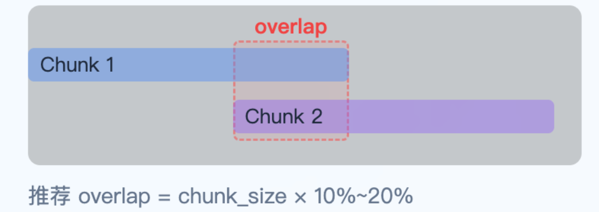

#### 代码实现

创建：`text_spliter.py`

```python
def split_text(text: str, chunk_size: int = 500, overlap: int = 100,
               separators: list[str] = None, metadata: dict = None) -> list[dict]:
    """
    文本切分函数
    
    Args:
        text: 要切分的文本
        chunk_size: 每个chunk的最大长度
        overlap: 相邻chunk的重叠长度
        separators: 分隔符列表，默认为常见标点和换行
        metadata: 基础元数据
    
    Returns:
        切分后的chunk列表，每个chunk包含content和metadata
    """
    # 处理默认参数
    if separators is None:
        separators = ['\n\n', '\n', '。', '！', '？', ';', '；', ',', '，', ' ']
    
    # 处理空文本
    if not text:
        return []
    
    # 短文本直接返回
    if len(text) <= chunk_size:
        base_metadata = metadata.copy() if metadata else {}
        base_metadata.update({"chunk_index": 0, "chunk_total": 1})
        return [{"content": text, "metadata": base_metadata}]
    
    # 步骤1：按分隔符分割文本为小片段
    segments = [text]
    for sep in separators:
        new_segments = []
        for seg in segments:
            if sep in seg:
                parts = seg.split(sep)
                for i, part in enumerate(parts):
                    new_segments.append(part)
                    if i < len(parts) - 1:
                        new_segments.append(sep)
            else:
                new_segments.append(seg)
        segments = new_segments
    
    # 步骤2：合并小片段，避免产生过小的chunk
    merged_segments = []
    current_segment = ""
    for seg in segments:
        if len(current_segment) + len(seg) <= chunk_size:
            current_segment += seg
        else:
            if current_segment:
                merged_segments.append(current_segment)
            current_segment = seg
    if current_segment:
        merged_segments.append(current_segment)
    
    # 步骤3：切分合并后的段落，处理重叠
    chunks = []
    for seg in merged_segments:
        if len(seg) <= chunk_size:
            chunks.append(seg)
        else:
            # 无分隔符的长文本，兜底按字符截断
            start = 0
            while start < len(seg):
                end = min(start + chunk_size, len(seg))
                chunks.append(seg[start:end])
                start = end - overlap if end < len(seg) else end
    
    # 处理相邻chunk之间的重叠
    if len(chunks) > 1 and overlap > 0:
        overlapped_chunks = [chunks[0]]
        for i in range(1, len(chunks)):
            # 从上个chunk末尾取overlap长度的文本，添加到当前chunk开头
            prev_chunk = overlapped_chunks[-1]
            overlap_text = prev_chunk[-overlap:] if len(prev_chunk) >= overlap else prev_chunk
            current_chunk = overlap_text + chunks[i]
            # 确保当前chunk不超过chunk_size
            if len(current_chunk) > chunk_size:
                current_chunk = current_chunk[-chunk_size:]
            overlapped_chunks.append(current_chunk)
        chunks = overlapped_chunks
    
    # 步骤4：生成最终结果，添加元数据
    result = []
    base_metadata = metadata.copy() if metadata else {}
    total_chunks = len(chunks)
    
    for i, chunk in enumerate(chunks):
        chunk_metadata = base_metadata.copy()
        chunk_metadata.update({"chunk_index": i, "chunk_total": total_chunks})
        result.append({"content": chunk, "metadata": chunk_metadata})
    
    return result


```

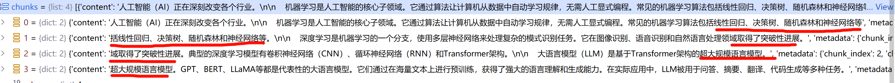

#### 测试用例

```python
# ── 测试用例 ──────────────────────────────────────────────────
def run_tests():
    # ── 测试文本准备 ──────────────────────────────────────────────
    sample_text = """人工智能（AI）正在深刻改变各个行业。

    机器学习是人工智能的核心子领域。它通过算法让计算机从数据中自动学习规律，无需人工显式编程。常见的机器学习算法包括线性回归、决策树、随机森林和神经网络等。

    深度学习是机器学习的一个分支，使用多层神经网络来处理复杂的模式识别任务。它在图像识别、语音识别和自然语言处理领域取得了突破性进展。典型的深度学习模型有卷积神经网络（CNN）、循环神经网络（RNN）和Transformer架构。

    大语言模型（LLM）是基于Transformer架构的超大规模语言模型。GPT、BERT、LLaMA等都是代表性的大语言模型。它们通过在海量文本上进行预训练，获得了强大的语言理解和生成能力。在实际应用中，LLM被用于问答、摘要、翻译、代码生成等多种任务。"""

    print("=" * 60)

    # ── Case 1：基础切分（验证 chunk 大小不超限）──
    print("【Case 1】基础切分，chunk_size=100, overlap=0")
    chunks = split_text(sample_text, chunk_size=100, overlap=0)
    for c in chunks:
        content = c["content"]
        status = "✅" if len(content) <= 100 else "❌ 超长!"
        print(f"  [{c['metadata']['chunk_index'] + 1}/{c['metadata']['chunk_total']}] "
              f"len={len(content)} {status} | {content[:30].strip()}...")
    print()

    # ── Case 2：带 overlap（验证相邻 chunk 存在重叠内容）──
    print("【Case 2】overlap 验证，chunk_size=150, overlap=30")
    chunks = split_text(sample_text, chunk_size=100, overlap=20)
    for i, c in enumerate(chunks):
        print(f"  chunk[{i}] 内容: {c['content'][:30].strip()}")
    print()

    # ── Case 3：短文本（不应切分）──
    print("【Case 3】短文本，不应被切分")
    short_text = "这是一段很短的文字，不需要切分。"
    chunks = split_text(short_text, chunk_size=500)
    assert len(chunks) == 1, f"❌ 期望1个chunk，实际{len(chunks)}个"
    print(f"  ✅ 仅产生 1 个 chunk，len={len(chunks[0]['content'])}")
    print()

    # ── Case 4：无分隔符的长文本（兜底强制截断）──
    print("【Case 4】纯长字符串，无自然分隔符，兜底按字符截断")
    no_sep_text = "A" * 350  # 350个字符，chunk_size=100 → 应产生4个chunk
    chunks = split_text(no_sep_text, chunk_size=100, overlap=0)
    print(f"  chunk 数量: {len(chunks)}（期望: 4）{'✅' if len(chunks) == 4 else '❌'}")
    for c in chunks:
        print(f"    len={len(c['content'])} {'✅' if len(c['content']) <= 100 else '❌'}")
    print()

    # ── Case 5：小片段合并验证（核心改动）──
    print("【Case 5】小片段合并验证，多个小段落应合并为一个 chunk")
    # 每行约15字，chunk_size=100，3行合计约45字应合并为1个chunk
    small_para_text = "第一段内容很短。\n第二段内容也很短。\n第三段内容同样很短。"
    chunks = split_text(small_para_text, chunk_size=100, overlap=0)
    print(f"  chunk 数量: {len(chunks)}（期望: 1，若>1说明合并逻辑失效）"
          f"  {'✅' if len(chunks) == 1 else '❌ 合并失效!'}")
    for c in chunks:
        print(f"    len={len(c['content'])} | {c['content']}")
    print()

    print("=" * 60)
    print("✅ 全部测试完成")


run_tests()
```

#### Pdf 切分验证

```python
def pdf_split_test():
    from document_loader_api import load_document

    doc = load_document("..\\测试物料\\员工假期管理制度.pdf")

    chunks = split_text(doc["content"], chunk_size=200, overlap=20)

    for c in chunks:
        print(f"长度={len(c['content'])} \n 内容：\n {c['content']}")

pdf_split_test()
```

#### 思考：哪里有问题

```python
overlap 强行截断式保留上下文，甚至导致歧义。 

比如之前是 不可以xxx，overlap 后成为 可以xxx
```

优化方式：**上下文增强技术（智谱）**； 生成当前片段的上下摘要报告； `摘要 + 片段 = 完整语义；`

问题：分chunk的时候，每个chunk都要调用模型总结；**废token最好在离线阶段**。

面试的时候，面试官问，如何有效的得到 chunk。

https://docs.bigmodel.cn/cn/guide/tools/knowledge/contextual

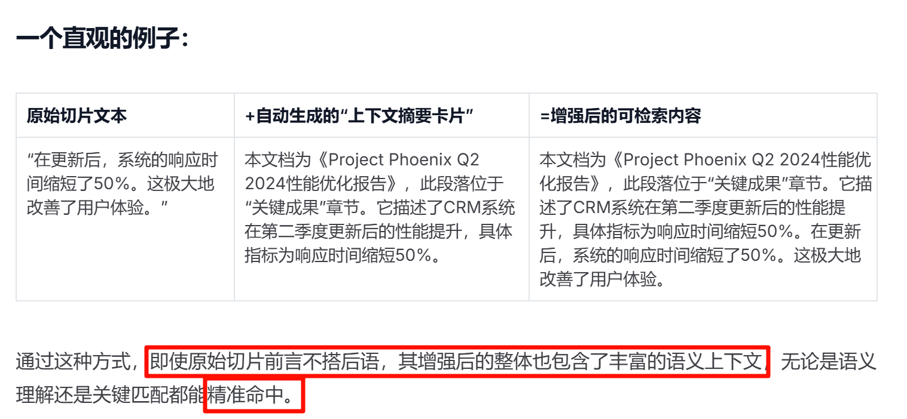

### 扩展：向量相似度计算

切分后的文本已经可以向量化了。但在把向量存入 `Milvus` 之前，我们先用 `NumPy` 手写一遍**余弦相似度**。这不只是为了"懂原理"，理解余弦相似度的数值范围和直觉含义，帮助我们设置合理的 `threshold` 过滤阈值。

#### 余弦相似度

> ### 余弦相似度衡量两个向量"方向"的接近程度，而不是"大小"。
> 
> 值域为 [-1, 1]：
> 
> 1. **数值越接近 1**，表示两段文本语义越相似；
> 2. **接近 0** 表示语义无关；
> 3. **接近 -1** 在 Embedding 空间中极少出现（表示语义完全相反）。
> 
> 公式是两个向量的**点积**除以各自**模长**之积。
> 
> **重要特性**：余弦相似度只关注方向，**不受向量长度影响**。
> 
> 这就是为什么后来使用 FAISS 等向量库 `IndexFlatIP` 前需要先做 L2 归一化；**归一化后向量模长均为 1**，此时内积在数值上等价于余弦相似度，FAISS 的内积检索结果就直接对应语义相似度排序。
> 
> > **L2范数（L2 norm）**，也称为**欧几里德范数（Euclidean norm）或 2-范数**，是向量元素的平方和的平方根。它在数学和机器学习中经常被用作一种正则化项、距离度量或误差度量。

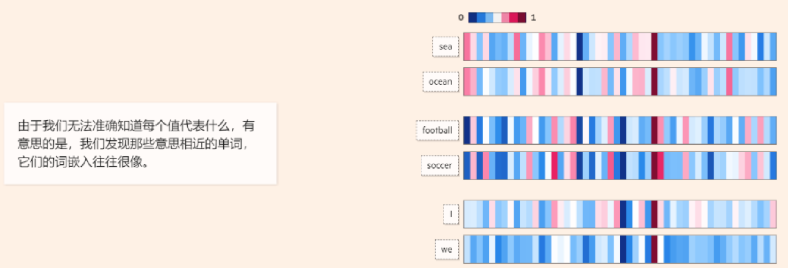

欧式距离：

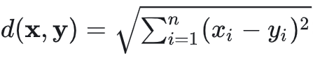

X = [1,2,3,4,5]    模：根下(1^2 + ...+ 5^2)

Y = [6,7,8,9,9]     模：根下(1^2 + ...+ 5^2)

d(x,y) = 根下 平方和 

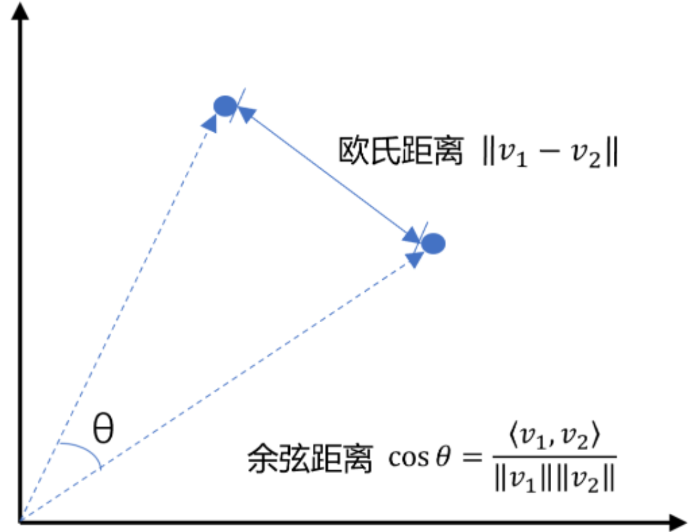

余弦距离：

X = [1,2,3,4,5]

Y = [6,7,8,9,9]

向量点积： x1*y1 + x2*y2 + .. + xn*yn

||v1||||v2||模积： v1模  v2模

上面两张图分别展示了**向量间相似度计算的直觉含义**和**余弦相似度的数学公式**。

第二张图是公式的精确表达：分子是两个向量的点积，分母是各自模长的乘积。理解了这个公式，后面手写的 `cosine_similarity` 函数就不再神秘了。

#### 函数实现

```python
import numpy as np

def cosine_similarity(vec_a: list[float], vec_b: list[float]) -> float:
    """
    计算两个向量之间的余弦相似度（NumPy 实现）
    
    Args:
        vec_a: 向量 A 的数值列表
        vec_b: 向量 B 的数值列表
        
    Returns:
        float: 余弦相似度得分，取值范围为 [-1, 1]，越接近 1 表示越相似
    """
    # 将输入列表转换为 NumPy 数组以便进行向量化计算
    a, b = np.array(vec_a), np.array(vec_b)
    
    # 计算向量点积 (Dot Product): A · B
    dot_product = np.dot(a, b)
    
    # 计算向量的 L2 范数 (模长): ||A|| 和 ||B||
    norm_a = np.linalg.norm(a)
    norm_b = np.linalg.norm(b)
    
    # 根据公式计算余弦相似度: cos(θ) = (A · B) / (||A|| * ||B||)
    # 注意：实际应用中应考虑分母为 0 的情况
    return float(dot_product / (norm_a * norm_b))
```

L2范数：

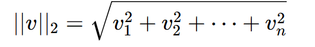

#### 实验

```python
MODEL = "text-embedding-v3"

pairs = [
    ("如何申请年假",     "请假流程是什么"),        # 中文同义，语义相近
    ("如何申请年假",     "今天天气怎么样"),        # 语义无关
    ("Python 列表排序",  "Python list sort"),      # 中英文同义
]

for text_a, text_b in pairs:
    # 调用 Embedding 接口获取文本 A 的向量表示
    vec_a = get_embedding(text_a, client_qwen, MODEL)
    # 调用 Embedding 接口获取文本 B 的向量表示
    vec_b = get_embedding(text_b, client_qwen, MODEL)
    
    # 计算两个向量之间的余弦相似度（Score 越接近 1 表示语义越相关）
    score = cosine_similarity(vec_a, vec_b)
    
    # 打印对比结果，展示不同文本组合下的语义匹配得分
    print(f"  {text_a!r:20s} vs {text_b!r:20s}  →  {score:.4f}")
```

> 输出如下：  
> 
>   '如何申请年假'             vs '请假流程是什么'             →  0.8232
> 
>   '如何申请年假'             vs '今天天气怎么样'             →  0.4192
> 
>   'Python 列表排序'        vs 'Python list sort'    →  0.8203

> 这组数据给了我们一个重要参考：未来设置 `threshold=0.5` 时，低于此分数的检索结果将被过滤掉，而真正相关的文档片段通常得分远高于 0.5。

#### 余弦相似度 Vs **欧氏距离**

除了余弦相似度，另一种常见的向量度量方式是**欧氏距离**（L2 Distance）：它衡量的是两个向量在空间中的"直线距离"，数值越小表示越相似。

> 两者的核心区别在于：
> 
> 1. 余弦相似度只关注向量的**方向**，忽略长度；
> 2. 欧氏距离同时受方向和长度的影响。
> 
> 在 Embedding 场景中，我们关心的是"语义方向是否一致"，而不是"向量绝对值大小"，因此余弦相似度是更自然的选择。

| **维度** | **余弦相似度** | **欧氏距离** |
| --- | --- | --- |
| **衡量对象** | 向量方向的接近程度 | 向量在空间中的直线距离 |
| **值域** | [-1, 1]，越大越相似 | [0, +∞)，越小越相似 |
| **是否受向量长度影响** | **否（只看方向）** | **是（方向+长度）** |
| **归一化后与内积的关系** | 等价 | 单调等价 |
| **RAG 场景适用性** | 更自然（语义方向匹配） | 需先归一化才等效 |

> ### 接下来我们选择：`Faiss IndexFlatIP`（内积索引）+ `normalize_L2`（归一化）的组合
> 
> **向量经过 L2 归一化后模长均为 1**，此时内积在数值上等价于余弦相似度，而欧氏距离也与余弦相似度呈单调关系，三种度量在归一化后本质上是等价的。
> 
> 选择内积索引是因为 FAISS 对内积计算做了深度优化，检索速度最快。

X = [1,,3,4,5]  归一化：   模长为1

Y = [1,,3,4,5]  归一化：   模长为1

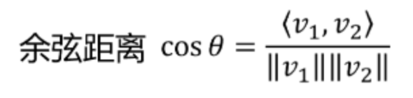

所有向量模长为1情况下：简化为：`cos o = 向量点积`

所有向量模长为1情况下，余弦相似度，简化为 `向量点积`

### **Faiss：向量索引构建与持久化**

> 有了向量和余弦相似度的直觉之后，我们来引入真正的向量检索引擎：`FAISS`。单独用 `NumPy` 做余弦相似度计算在文档量较多时会很慢（需要逐一与每个向量比对）；`FAISS` 的价值在于它能对大规模向量集合做近似最近邻检索，实现毫秒级响应。

> ### Faiss：相似度搜索领域的标杆（Facebook AI Similarity Search）
> 
> 为了比较两个非结构化的数据是否相似，例如两张图片是不是类似，两段文本表达的含义是否类似，则需要将非结构化的数据先转成向量数据，然后再进行相似度比较。
> 
> 问题来了，在一群数据中找到两个相似度最高的向量数据，最常用的是**暴力搜索法**，也就是逐一遍历所有向量，**计算距离（如欧氏距离、余弦相似度）**，虽准确，但时间复杂度高，无法处理百万级以上数据。
> 
> 这个问题在2015年严重困扰了Facebook公司的技术团队，因为作为当时世界上最大的社交网站，时刻要处理数十亿的图片，然后根据用户喜好推荐相似的内容。
> 
> 于是Facebook成立专门的项目组开展了研究，最终在2017年取得重大突破，研发出了Faiss（Facebook AI Similarity Search)，专门用于`解决大规模向量数据的快速搜索问题`。**Faiss可以在17.7微秒完成10亿图像搜索**。而传统的暴力搜索算法，往往需要数小时。
> 
> 
> 2017年3月项目组发表论文《Billion-scale similarity search with GPUs》公开了核心技术（论文地址 [<u>https://arxiv.org/pdf/1702.08734</u>](https://arxiv.org/pdf/1702.08734) ），开源了源代码（代码地址：[<u>https://github.com/facebookresearch/faiss</u>](https://github.com/facebookresearch/faiss%EF%BC%89%E3%80%82)[<u>）</u>](https://github.com/facebookresearch/faiss%EF%BC%89%E3%80%82)
> 
> 
> ### Faiss的发布引起了业界轰动。

#### 索引类型**选择：IndexFlatIP + normalize_L2**

`IndexFlatIP` 是内积（Inner Product）索引，存储向量后按内积大小检索。

关键点在于：将向量存入前先做 L2 归一化（`faiss.normalize_L2`），**归一化后向量的模长均为 1，此时向量的内积等价于余弦相似度**。这意味着 `IndexFlatIP` 返回的分数实际上就是余弦相似度值，与我们 3.5 节手写的函数在数学上完全一致。以下是构建索引和持久化的完整代码：

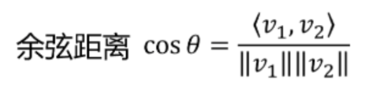

- 两个内积的计算公式：  a · b = a₁×b₁ + a₂×b₂ + a₃×b₃ + ... + aₙ×bₙ
- 模长（L2 范数）的计算公式是：||v|| = √(v₁² + v₂² + v₃² + ... + vₙ²)

安装依赖：` pip install faiss-cpu`

```python
# 此处已更新，以课件为主！
import faiss
import numpy as np

# 查询向量 A
A = np.array([1, 2, 3, 4, 5], dtype=np.float32)

# 4种关系：相同、反向、正交、部分相似
embeddings = np.array([
    [1, 2, 3, 4, 5],     # v0: 与A完全相同 -> cos = 1
    [-1, -2, -3, -4, -5],# v1: 与A方向相反 -> cos = -1
    [2, -1, 0, 0, 0],    # v2: 与A正交(点积=0) -> cos = 0
    [5, 4, 3, 2, 1],     # v3: 与A部分相似 -> cos = 0.636364
], dtype=np.float32)

dim = embeddings.shape[1]
print(f"dim={dim}, 向量数={len(embeddings)}")

# 归一化前模长
print("\n归一化前模长:")
for i, n in enumerate(np.linalg.norm(embeddings, axis=1)):
    print(f"v{i}: {n:.6f}")

# 关键：库向量和查询向量都要L2归一化
faiss.normalize_L2(embeddings)

print("\n归一化后模长:")
for i, n in enumerate(np.linalg.norm(embeddings, axis=1)):
    print(f"v{i}: {n:.6f}")

# 查询向量 A 数组，转换为 1x5 维的矩阵
query = A.reshape(1, -1).astype(np.float32)
print(f"原来query={query}")
# 查询向量归一化
faiss.normalize_L2(query)
print(f"归一化后query={query}")


# IndexFlatIP + 归一化 => 内积 = 余弦相似度

## 创建 IndexFlatIP 索引，会将所有向量存储在内存中。
## 对于大规模向量数据，FAISS 提供了更高效的索引类型（如 IVF、HNSW 等）
index = faiss.IndexFlatIP(dim)

## 添加向量到索引。模拟向量库中有数据
index.add(embeddings)

k = 4
# 查询向量 A 对所有库向量的相似度
scores, ids = index.search(query, k)

print("\nTop-k (score=cosine):")
for rank, (idx, score) in enumerate(zip(ids[0], scores[0]), start=1):
    print(f"{rank}. id={idx}, score={score:.6f}")

# 归一化后，IndexFlatIP 的得分就是余弦相似度；1 表示同向，0 表示正交，-1 表示反向。
```

>   很多人会误以为 `[5,4,3,2,1]` 和 `[1,2,3,4,5]` 是“方向相反”，其实不是。
> 
>   它们的余弦是 `0.636364`，说明“有一定相似”，不是反向。
> 
>   真正反向是 `[-1,-2,-3,-4,-5]`，这时余弦才是 `-1`。
> 
>   真正正交要满足点积为 `0`，余弦才是 `0`。

#### 重点三件事

> 今天记住三件事就够了：
> 
> 1. 余弦相似度看“方向”
> 2. 归一化是为了去掉“长度影响”
> 3. Faiss 中 `normalize_L2 + IndexFlatIP` 就是**在算余弦相似度**

#### 代码：模拟使用 Faiss 存储&检索向量

创建：`vector_store.py`

```python
import faiss
import numpy as np
import json

def build_faiss_index(embeddings: list[list[float]]) -> faiss.IndexFlatIP:
    """
    构建 FAISS 内积索引。
    通过对向量进行 L2 归一化，使得内积计算等价于余弦相似度。

    Args:
        embeddings: 嵌入向量列表，每个元素为一个浮点数列表。

    Returns:
        faiss.IndexFlatIP: 构建好的 FAISS 索引对象。
    """
    # 获取向量维度（特征长度）1024
    dim = len(embeddings[0])

    # 将输入列表转换为 float32 类型的 numpy 数组，这是 FAISS 指定的数值类型
    vectors = np.array(embeddings, dtype=np.float32)

    # 执行原地 L2 归一化：||v|| = 1。归一化后的向量点积即为余弦相似度
    faiss.normalize_L2(vectors)

    # 创建暴力搜索的内积索引 (IndexFlatIP)
    index = faiss.IndexFlatIP(dim)

    # 将处理后的向量添加到索引库中
    index.add(vectors)

    return index

def save_index(index: faiss.IndexFlatIP, chunks: list[dict],
               index_path: str, metadata_path: str) -> None:
    """
    持久化索引与元数据双文件方案。
    index_path 存储 FAISS 向量索引数据，metadata_path 存储对应的文本块及原始信息。

    Args:
        index: FAISS 索引对象。
        chunks: 包含 "content" 和 "metadata" 的原始文本块列表。
        index_path: 索引文件的保存路径（二进制格式）。
        metadata_path: 元数据文件的保存路径（JSON 格式）。
    """
    # 将向量索引二进制流写入磁盘
    faiss.write_index(index, index_path)

    # 将文本块及元数据序列化为 JSON，确保非 ASCII 字符（如中文）正常显示
    with open(metadata_path, 'w', encoding='utf-8') as f:
        json.dump(chunks, f, ensure_ascii=False, indent=2)

    print(f"✅ 索引保存成功：{index_path}（包含 {index.ntotal} 条向量）")
    print(f"✅ 元数据保存成功：{metadata_path}")

def load_index(index_path: str, metadata_path: str) -> tuple[faiss.IndexFlatIP, list[dict]]:
    """
    从磁盘恢复索引和关联的文本块数据。

    Args:
        index_path: 索引二进制文件路径。
        metadata_path: 元数据 JSON 文件路径。

    Returns:
        tuple: (index, chunks) 包含加载后的 FAISS 索引和对应的文本块列表。
    """
    # 读取二进制索引文件
    index = faiss.read_index(index_path)

    # 读取 JSON 格式的文本元数据
    with open(metadata_path, 'r', encoding='utf-8') as f:
        chunks = json.load(f)

    return index, chunks
```

> 持久化采用"双文件"策略：FAISS 索引文件只存储向量矩阵，用二进制格式高效保存；`chunks` 列表存为 JSON 文件，保存每个片段的原始文本和 metadata。两个文件通过相同的下标对应——索引中第 `i` 个向量对应 `chunks[i]` 中的文本。这种设计使每个部分都可以独立更新：向量维度变了（换了 Embedding 模型），重建索引文件即可，不需要重新整理 chunks；文档内容更新了，只需重新切分和向量化，重建两个文件。

### **构建 → 保存 → 加载验证**

```python
# 对所有 chunks 批量向量化（一次 API 调用，比循环逐个调用快得多）
texts = [c["content"] for c in chunks]
embeddings = get_embeddings_batch(texts, client_qwen, MODEL)

# 构建索引并持久化
index = build_faiss_index(embeddings)
save_index(index, chunks, "faiss_data/rag.index", "faiss_data/rag_chunks.json")

# 重新加载，验证一致性
index2, chunks2 = load_index("faiss_data/rag.index", "faiss_data/rag_chunks.json")
assert index2.ntotal == len(chunks2), "❌ 索引和 chunks 数量不匹配！"
print(f"✅ 索引持久化验证通过：{index2.ntotal} 条向量 = {len(chunks2)} 个 chunks")
```

✅ 索引保存成功：faiss_data/rag.index（包含 4 条向量）

✅ 元数据保存成功：faiss_data/rag_chunks.json

✅ 索引持久化验证通过：4 条向量 = 4 个 chunks

# 在线查询阶段

> 知识库已经建好并持久化到磁盘，接下来我们进入 RAG 系统的**在线查询阶段**。
> 
> 这个阶段的代码在每次用户提问时都会执行：
> 
> `加载索引 → 将用户问题向量化 → 在FAISS中检索Top-K → 构建增强Prompt → 调用LLM生成回答`
> 
> ### 与离线阶段不同，在线阶段的核心关注点是**响应速度和回答质量**


## **Top-K 检索与结果后处理**

索引构建完成，我们来实现 RAG 系统的检索核心。

### 检索过程

> **搜索的过程分两步：**
> 
> 1. 先用 FAISS 拿到 Top-K 候选，
> 2. 再对候选结果进行相似度过滤和排序，得到最终可用的检索结果。

> ⚠️ **结构约定**：`chunks `参数中每项必须是完整的 chunk 对象（`{"content": ..., "metadata": {...}}`），即 `save_index()` 传入的 `split_text()` 返回值。若只传了 metadata 部分，`chunks[idx]["content"] `会触发 `KeyError`。

### 检索代码实现

以下是完整的检索函数实现，覆盖了`向量化`、`FAISS 检索`、`过滤`和`排序`四个环节：

创建：`query_rag.py`

```python
def search(query: str, client, model: str, index: faiss.IndexFlatIP,
           chunks: list[dict], top_k: int = 5,
           threshold: float = 0.5) -> list[dict]:
    """
    RAG 检索函数：向量化查询 → FAISS 检索 → 相似度过滤 → 排序
    参数：
      threshold: 余弦相似度阈值（0~1），低于此分数的结果被丢弃
    返回：
      按相似度降序排列的 chunk 列表，每项含 content / metadata / score
    """
    # Step 1: 查询向量化 + 归一化（必须与索引构建时用同一模型和同样的归一化）
    query_vec = np.array([get_embedding(query, client, model)], dtype=np.float32)
    faiss.normalize_L2(query_vec)

    # Step 2: FAISS 检索 Top-K
    # 注意：当 top_k > index.ntotal 时，多余的返回位置填充 -1（需过滤）
    scores, indices = index.search(query_vec, top_k)

    # Step 3: 过滤 + 组装输出
    results = []
    for score, idx in zip(scores[0], indices[0]):
        if idx == -1:            # FAISS 填充的无效位置（top_k > 实际向量数时出现）
            continue
        if score < threshold:    # 相似度低于阈值，丢弃
            continue
        results.append({
            "content":  chunks[idx]["content"],
            "metadata": chunks[idx]["metadata"],
            "score":    float(score)
        })

    # Step 4: 按相似度降序排序（FAISS 已返回排序结果，此处为显式保证）
    results.sort(key=lambda x: x["score"], reverse=True)
    return results
```

> 注意：`查询向量`和`索引向量`**必须使用同一个 Embedding 模型**。如果你用 `text-embedding-v3` 构建索引，查询时却用了 `text-embedding-3-small`，两个模型的向量空间完全不同（维度都不一样），检索结果会毫无意义，但系统不会报错，只会返回看似正常实则随机的结果。这是 RAG 系统中最隐蔽的 bug 之一。

### 检索结果验证

```python
query = "年假可以申请几天？"

results = search(
    query,          # 查询文本
    client_qwen,    # 嵌入模型客户端
    MODEL,          # 嵌入模型名称
    index,          # 向量索引
    chunks,         # 原始文本块
    top_k=5,        # 返回最相关的结果数量
    threshold=0.5   # 相似度阈值
)

print(f"检索到 {len(results)} 条相关结果")
for i, r in enumerate(results[:3]):
    source = r['metadata'].get('source', '未知')
    print(f"\n── Top {i+1}（得分 {r['score']:.4f}，来源：{source}）")
    print(r["content"][:150] + "...")
```

> `threshold=0.5`** 是比较宽松的阈值，适合教学演示。**
> 
> 在生产环境中，如果阈值设太低，无关片段会进入 context 并干扰 LLM 的回答；
> 
> 如果设太高，真正相关的片段可能被过滤掉。建议用 20-30 条带标注的测试问题，通过实验在精确率和召回率之间找到平衡点，通常中文场景的合理阈值在 0.6~0.75 之间。

## RAG Prompt 模板

> 检索到相关片段后，如何把它们**"喂给"**大模型？
> 
> 这一步的核心是 Prompt 设计。一个好的 `RAG Prompt` 要做到三件事：
> 
> 1. 明确告知模型`参考资料`在哪
> 2. 引导模型`"引用"`而非`"创作"`
> 3. 处理资料不足时的`兜底`情况。：告诉模型，如果没有，就如实回答
> 
> 这三点决定了 RAG 系统的 **幻觉控制 **效果。

### System Prompt 设计原则

> System Prompt：负责设定模型的"角色"和"行为规则"。

> 在 RAG 场景中，最关键的规则只有三条：
> 
> 1. 只用参考资料中的内容回答；
> 2. 如果资料不够，明确说无法回答；
> 3. 回答时标注来源。
> 
> 第三条"标注来源"看起来可选，但在需要可信度的场景（如医疗、法律、企业内部知识库）中至关重要，用户需要能验证答案。

### 代码实现

创建：`rag_prompt.py`

```python
SYSTEM_PROMPT = """你是一个专业的知识库问答助手。请严格基于【参考资料】中的内容回答用户问题。

规则：
1. 只使用参考资料中的信息回答，不要编造内容
2. 如果参考资料中没有相关信息，请明确说"根据现有资料，我无法回答这个问题"
3. 回答时尽量引用原文关键语句，并在括号中标注来源文件名"""

def build_rag_prompt(query: str, retrieved_chunks: list[dict]) -> list[dict]:
    """
    构建 RAG 增强后的消息列表（供 chat.completions.create 使用）
    返回标准的 OpenAI messages 格式：[{"role": ..., "content": ...}, ...]
    """
    if not retrieved_chunks:
        # 兜底：没有检索结果时，直接告知无相关资料
        context = "（当前知识库中未找到与该问题相关的资料）"
    else:
        # 提取并格式化检索到的知识片段
        context_parts = []
        
        for i, chunk in enumerate(retrieved_chunks):
            # 获取来源元数据，若不存在则显示“未知来源”
            source = chunk["metadata"].get("source", "未知来源")

            # 从文件路径中提取文件名（处理跨平台路径分隔符）
            source_name = source.split("/")[-1] if "/" in source else source

            # 组合编号、来源和具体内容
            context_parts.append(f"【资料{i+1}】（来源：{source_name}）\n{chunk['content']}")
        
        # 将多个资料片段用换行符连接成完整的上下文字符串
        context = "\n\n".join(context_parts)


    user_content = f"""
    【参考资料】
    {context}
    
    【用户问题】
    {query}"""

    return [
        {"role": "system", "content": SYSTEM_PROMPT},
        {"role": "user",   "content": user_content}
    ]
```

`build_rag_prompt` 函数将检索到的每个 chunk 格式化为 `【资料N】（来源：文件名）` 的形式，并用空行分隔，方便 LLM 区分不同来源的内容。空列表时的兜底设计很重要——当检索结果为空时，仍然构建一个合法的 messages 对象，让 LLM 告知用户"无相关资料"，而不是让程序崩溃。

## 容易被忽略的细节：Token 预算控制与上下文拼接

**从检索到 Prompt 构建之间，还有一个容易被忽视的环节：****Token 预算控制。**

检索到的片段可能有多个，如果全部放进 Prompt，累积的 token 数量可能超出 LLM 的上下文窗口限制，导致 API 报错；即使不超出限制，塞入过多内容也会增加 LLM 的"**注意力分散**"问题，影响回答质量。

### 手搓 简易 Token 估算算法

> 精确的 Token 计数需要 `tiktoken` 等专业工具，但对于 RAG 的预算控制场景，粗略估算已经足够：
> 
> 1. 中文约 1.5 字/Token，英文约 4 字符/Token。这个比例基于 GPT 系列 `cl100k_base` tokenizer 的经验值，
> 2. Qwen 系列 tokenizer 的中文 token 化效率略有不同（约 1.2-1.8 字/Token），可取中间近似值 1.5 。
> 3. 精确计数请使用 `tiktoken`（OpenAI）或对应模型的 tokenizer。以下是估算函数和预算筛选函数的实现：

```python
def estimate_tokens(text: str) -> int:
    """
    简易 Token 估算函数（无需依赖外部库如 tiktoken）

    估算规则：
    1. 中文字符：通常占比较多 token，按 1.5 个字符对应 1 个 token 估算
    2. 其他字符（英文、数字、标点）：按 4 个字符对应 1 个 token 估算

    Args:
        text (str): 需要估算的文本字符串

    Returns:
        int: 估算出的 token 总数
    """
    # 统计中文字符数量（利用 Unicode 范围：\u4e00-\u9fff）
    chinese_chars = sum(1 for c in text if '\u4e00' <= c <= '\u9fff')

    # 计算非中文字符数量
    other_chars = len(text) - chinese_chars

    # 根据加权比例计算总 token 数并取整
    return int(chinese_chars / 1.5 + other_chars / 4)

def select_chunks_within_budget(chunks: list[dict],
                                max_tokens: int = 3000) -> list[dict]:
    """
    在指定的 Token 预算内，采用贪心策略从检索结果中筛选文本片段 (Chunks)

    策略说明：
    1. 假设输入 chunks 已按相关性（如相似度得分）降序排列
    2. 遍历 chunks 并累加 token 数，一旦超过 max_tokens 预算即停止
    3. 确保在上下文长度限制内，优先保留最相关的片段

    Args:
        chunks (list[dict]): 包含文本片段的字典列表，每个字典需含有 "content" 键
        max_tokens (int): 允许的最大 token 预算，默认为 3000

    Returns:
        list[dict]: 筛选后符合预算要求的文本片段列表
    """
    selected = []
    total_tokens = 0

    for chunk in chunks:
        # 估算当前片段的 token 消耗； 1000；  879 
        chunk_tokens = estimate_tokens(chunk["content"])

        # 检查加入当前片段后是否会超出总预算
        if total_tokens + chunk_tokens > max_tokens:
            # 若超出则停止筛选，确保不突破上下文窗口
            break

        # 将片段加入已选列表并更新总 token 计数
        selected.append(chunk)
        total_tokens += chunk_tokens

    return selected
```

### Token 截断效果测试

```python
# 用较低的 threshold 拉取更多候选结果（模拟内容丰富的知识库）
results_all = search(query, client_qwen, MODEL, index, chunks, top_k=5, threshold=0.3)
selected = select_chunks_within_budget(results_all, max_tokens=3000)

print(f"检索到 {len(results_all)} 条，Token 预算内选中 {len(selected)} 条")
total = sum(estimate_tokens(c['content']) for c in selected)
print(f"选中片段合计约 {total} tokens")
```

# 手搓RAG：完整流程

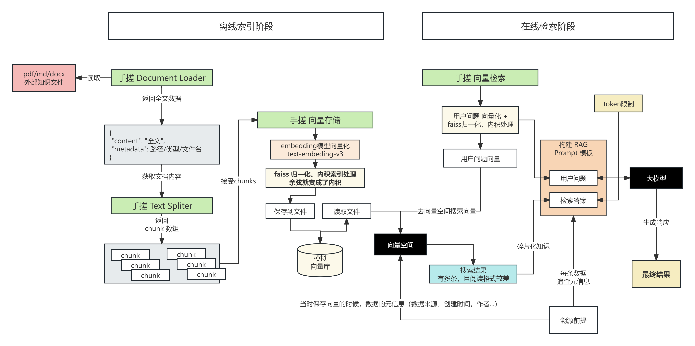

## 核心过程

> `rag_query` 函数是整个系统的顶层入口，它按顺序调用 `search()`、`select_chunks_within_budget()`、`build_rag_prompt()` 和 `chat.completions.create()`，把五步操作封装为一次函数调用：

在 `query_rag.py`* 中加入如下逻辑*

```python
def rag_query(query: str,
              client,
              embed_model: str,
              chat_model: str,
              index: faiss.IndexFlatIP,
              chunks: list[dict],
              top_k: int = 5,
              max_context_tokens: int = 3000) -> dict:
    """
    完整 RAG Pipeline：提问 → 检索 → Prompt → LLM 生成
    返回：{
      "answer":          str,       # LLM 生成的回答
      "sources":         list[dict], # 实际使用的 chunk 列表
      "total_retrieved": int         # 检索到的候选总数
    }
    """
    # Step 1: 检索相关片段
    results = search(query, client, embed_model, index, chunks, top_k=top_k)
    
    # Step 2: Token 预算控制
    selected = select_chunks_within_budget(results, max_tokens=max_context_tokens)

    # Step 3: 构建增强 Prompt
    messages = build_rag_prompt(query, selected)

    # Step 3: 调用 LLM 生成回答
    response = client.chat.completions.create(
        model=chat_model,
        messages=messages
    )
    answer = response.choices[0].message.content

    return {
        "answer":          answer,
        "sources":         results,
        "total_retrieved": len(results)
    }
```

## 完整测试

创建：`rag_pipeline.py`

```python
from document_load_api import load_document
from rag.query_rag import rag_query
from text_spliter_api import split_text
from embedding_api import get_embedding_batch,client
from vector_store import build_faiss_index,save_index,load_index

# 1. 构建数据
def init_data():
    ## 1. 得到文档内容
    document = load_document("../测试物料/员工假期管理制度.pdf")
    ## 2. 对文档内容进行分块
    chunks = split_text(document["content"])

    texts = [c["content"] for c in chunks]

    ## 3. 对所有 chunks 批量向量化（一次 API 调用，比循环逐个调用快得多）
    embeddings = get_embedding_batch(texts, client, "text-embedding-v3")

    ## 4. 构建索引并持久化
    index = build_faiss_index(embeddings)

    ## 5. 保存索引和元数据
    save_index(index, chunks, "../faiss_data/rag.index", "../faiss_data/rag_chunks.json")
    return index, chunks


def test_rag_query():
    index, chunks = init_data()
    # 请确认模型名称为当前可用版本（查询日期：2026-02）
    EMBED_MODEL = "text-embedding-v3"   # Qwen Embedding，仍有效；可选升级 text-embedding-v4
    CHAT_MODEL  = "qwen3.5-plus"           # 或 "gpt-5-mini"（GPT-5 家族的轻量变体，更低成本），支持 OpenAI 协议的模型均可

    test_queries = [
        "年假可以申请几天？",                        # 知识库内有答案（PDF）
        "年假的申请流程是什么？",                     # 换一种措辞提问，测试语义检索（PDF）
        "量子纠缠是什么？",                          # 故意超出知识库范围，测试兜底逻辑
    ]

    for q in test_queries:
        print(f"\n{'='*60}")
        print(f"❓ 问题：{q}")
        result = rag_query(q, client, EMBED_MODEL, CHAT_MODEL, index, chunks)

        print(f"✅ 回答：\n{result['answer']}")
        print(f"\n📚 引用来源（检索到 {result['total_retrieved']} 条，实际使用 {len(result['sources'])} 条）：")
        for src in result["sources"]:
            print(f"   - {src['metadata'].get('source')} (score={src['score']:.4f})")

test_rag_query()
```