# 4. 实战：LlamaIndex 套件

索引：保存、查询

索引：加速设置、库

# 快速上手：

## 概念

### 介绍

> ### LlamaIndex 是 构建上下文增强 LLM 应用的框架
> 
> LlamaIndex 对您如何使用 LLM 没有限制。您可以将 LLM 用作自动完成、聊天机器人、代理等等。它只是让使用它们变得更容易。我们提供的工具包括：
> 
> - **数据连接器**从其原生源和格式摄取您的现有数据。
>   - 这些可以是 API、PDF、SQL 以及（更多）其他来源。
> - **数据索引**以易于 LLM 消费且性能良好的中间表示形式来组织您的数据。
> - **引擎**提供对您数据的自然语言访问。例如
>   - `查询引擎`** QueryEngine **是强大的问答界面（例如，一个 RAG 流程）。
>   - `聊天引擎`** ****ChatEngine **是用于与您的数据进行多消息、“来回”交互的对话界面。维护聊天历史
>     - `聊天历史`： OpenAI SDK； 组装 messages 链路
> - **代理（Agent）：**是 LLM 驱动的知识工作者，并通过`工具`进行增强，这些工具从简单的辅助函数到 API 集成等等。
> - `可观测性/评估`** **集成使您能够在良性循环中严格地实验、评估和监控您的应用程序。
> - `工作流`** **允许您将以上所有功能组合到一个事件驱动系统中，这比其他基于图的方法更加灵活。

### 官网

LlamaIndex 有 Python 和 Typescript 两个版本，Python 版的文档相对更完善。

- Python 文档地址：https://docs.llamaindex.ai/en/stable/
- Python API 接口文档：https://docs.llamaindex.ai/en/stable/api_reference/
- TS 文档地址：https://ts.llamaindex.ai/
- TS API 接口文档：https://ts.llamaindex.ai/api/
- LlamaIndex 是一个开源框架，Github 链接：https://github.com/run-llama

### RAG 组件

> ### LlamaIndex 打通了 RAG 核心流程
> 
> **数据源 → 加载 → 解析分块 → 构建索引 → 存储 → 检索 → 后处理重排 → 查询 / 对话引擎 → 生成答案**

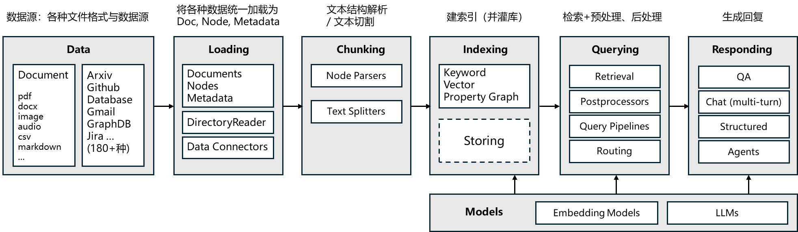

**核心组件：**

Id 2 - 5 : 保证数据入库

Id 6 - 9 : 查询增强

Id 10 - 11：高级流程编排

Id 12 - 14：周边配套

*📊 在线表格（无数据）*

### RAG 技术


### LangChain vs LlamaIndex

> 注意：LlamaIndex 迭代至今，已经和LangChain`功能多部分重叠`。
> 
> 但是我们更多使用 **LangChain **+ **LlamaIndex **组合

*📊 在线表格（无数据）*

## 快速体验

### 功能一：整合LLM

#### 第一步：安装依赖

```python
pip install llama-index-llms-openai llama-index-llms-ollama llama-index-llms-openai-like
```

所有支持的 LLM 列表：https://docs.llamaindex.org.cn/en/stable/module_guides/models/llms/modules/

`llama-index``-``llms`-`openai`/`ollama`/`openai-like`

#### 第二步：聊天

##### 和 openai 交互： 安装：`llama-index-llms-openai`

> 自己在环境变量中配置 `OPENAI_API_KEY` 

```python
from llama_index.llms.openai import OpenAI

## 1. 一行代码： 调用OpenAI模型，
response = OpenAI().complete("你是谁？")
print(response)
```

##### 和 ollama 交互： 安装：` llama-index-llms-ollama`

```python
from llama_index.llms.ollama import Ollama

## 1. 一行代码： 调用 ollama 本地模型，
response = Ollama(model="qwen3.5:4b").complete("你是谁？")
print(response)
```

#### 第三步：多模态

```python
from llama_index.llms.ollama import Ollama

from llama_index.core.llms import ChatMessage, TextBlock, ImageBlock

llm = Ollama(model="qwen3-vl:4b",request_timeout=500)

messages = [
    ChatMessage(
        role="user",
        blocks=[
            ImageBlock(url="https://help-static-aliyun-doc.aliyuncs.com/file-manage-files/zh-CN/20241022/emyrja/dog_and_girl.jpeg"),
            TextBlock(text="图片里面有什么"),
        ],
    )
]

resp = llm.chat(messages)
print(resp.message.content)
```

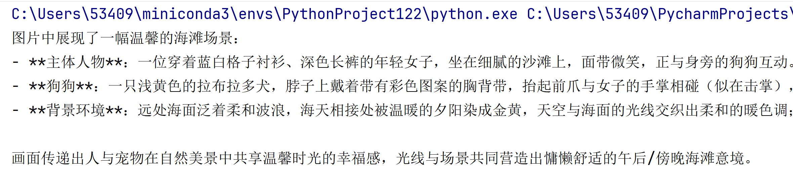

#### 第四步：函数调用（Function Call）

```python
from llama_index.core.tools import FunctionTool
from llama_index.llms.ollama import Ollama

def generate_song(name: str, artist: str) -> dict:
    """Generates a song with provided name and artist."""
    return {"name": name, "artist": artist}

tool = FunctionTool.from_defaults(fn=generate_song)

llm = Ollama(model="qwen3.5:4b",request_timeout=500)
response = llm.predict_and_call(
    [tool],
    "Pick a random song for me",
)
print(str(response))
```

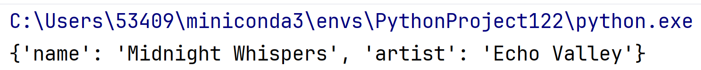

### 功能二：智能体

> 在 LlamaIndex 中，智能体（agent）是一个由 LLM 驱动的**半自治软件单元**，它被赋予一个任务，并执行一系列步骤来解决该任务。它被提供一套工具，这些工具可以是任意函数，也可以是完整的 LlamaIndex 查询引擎。智能体会为完成每个步骤选择最佳可用工具。当每个步骤完成后，智能体会判断任务是否已完成，如果完成，则向用户返回结果；如果需要再采取一步，则循环回到开始。

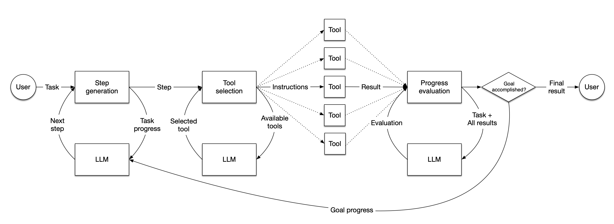

#### 第一步：安装依赖

`pip install llama-index-core llama-index-llms-openai-like llama-index-llms-ollama`

#### 第二步：Agent实现

```python
from llama_index.llms.ollama import Ollama
from llama_index.core.agent.workflow import FunctionAgent

## 定义工具
def multiply(a: float, b: float) -> float:
    """Multiply two numbers and returns the product"""
    print(f"{a} * {b} = {a*b}")
    return a * b


def add(a: float, b: float) -> float:
    """Add two numbers and returns the sum"""
    print(f"{a} + {b} = {a+b}")
    return a + b


## 初始化 llm
llm=Ollama(model="qwen3.5:4b")


## 初始化智能体
workflow = FunctionAgent(
    tools=[multiply, add],
    llm=llm,
    system_prompt="You are an agent that can perform basic mathematical operations using tools.",
)

## 运行智能体（异步模式）
async def main():
    response = await workflow.run(user_msg="What is 20+(2*4)?")
    print(response)


if __name__ == "__main__":
    import asyncio

    asyncio.run(main())
```

## 五步上手：RAG 流水线

- PDF文档需要先转换成Markdown带有标签的格式，有了文本和图片等标签以后，再进行对应部分的操作，会更加的方便。
- 解析得到的 documents 可以直接用于构建 LlamaIndex 的向量索引，这是RAG系统的核心。
- **先来安装如下依赖**

```shell
# openai 官方包
pip install llama-index-embeddings-openai llama-index-llms-openai

# 整合 兼容 openai 规范的第三方平台
pip install llama-index-embeddings-openai-like  llama-index-llms-openai-like

# 整合 ollama
pip install llama-index-embeddings-ollama  llama-index-llms-ollama
```

### 第 1 步：配置全局 LLMs

> 我们这个流程中，没有进行文档切分。
> 
> 查询，是把所有的内容查询出来，交给大模型，进行语言组织。

`pip install llama-parse unstructured nest-asyncio python-multipart llama-index-readers-file`

```python
import httpx
from llama_index.core import VectorStoreIndex
from llama_index.embeddings.ollama import OllamaEmbedding
from llama_index.embeddings.openai_like import OpenAILikeEmbedding
from llama_index.llms.ollama import Ollama
from llama_index.core.settings import Settings
from dotenv import load_dotenv
import os

from llama_index.llms.openai_like import OpenAILike
from llama_index.readers.file import UnstructuredReader

# 加载环境变量
load_dotenv()

# 设置超时
httpx.Timeout(1200.0)

# 设置为全局默认Embedding模型
Settings.embed_model = OpenAILikeEmbedding(
    model_name="text-embedding-v3",
    api_key=os.getenv("API_KEY"),
    api_base=os.getenv("BASE_URL_CHAT")
)

# 设置为全局默认 LLM
Settings.llm = OpenAILike(
    model="qwen3.5-plus",
    api_key=os.getenv("API_KEY"),
    api_base=os.getenv("BASE_URL_CHAT"),
    is_chat_model=True
)
```

### 第 2 步：解析 pdf 文档

```python
# 解析 pdf 文档
documents = UnstructuredReader().load_data(file="pdfs/IBM商业价值研究院：2026年AI引领保险业变革时代报告.pdf")
print(f"文档数量: {len(documents)}")
```

### 第 3 步：创建索引

> 读到文档内容，打成向量，保存到向量库

```python

# 创建索引
index = VectorStoreIndex.from_documents(documents=documents,show_progress=True)
print(f"索引ID: {index.index_id}")
```

### 第 4 步：*生成查询引擎*

```python
# 生成查询引擎
query_engine = index.as_query_engine()
print(f"查询引擎准备好: {query_engine}")
```

### 第 5 步：测试检索增强

```python
# 查询：这是个综合方法。
response = query_engine.query("总结下文档内容")


print(response)
```

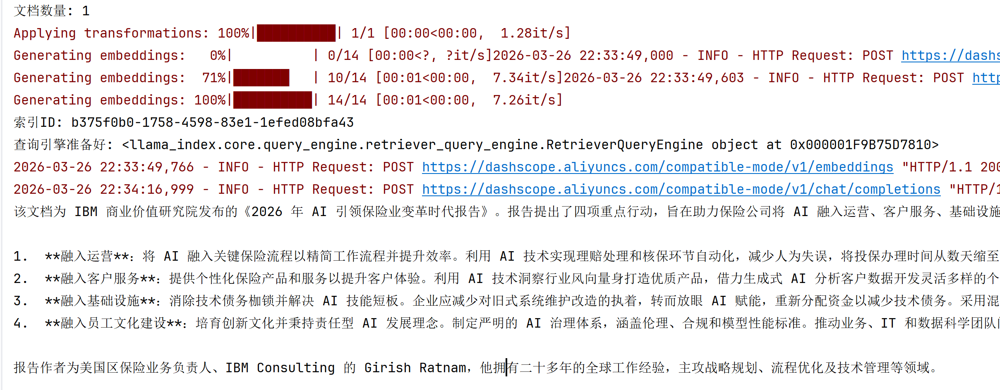

### 思考：上面RAG代码的查询流程

**query () 不是直接问大模型**

而是先从**你的 PDF 里找相关内容** → **再把找到的内容丢给大模型** → **让大模型基于文档回答。**

我们后面所有功能都是对**这四步的深度优化**

```shell
用户问题
    ↓
问题向量化（Embedding）
    ↓
向量检索 → 从PDF里找最相关的文本片段
    ↓
构造 Prompt（问题 + 找到的文档内容）
    ↓
发送给阿里云大模型 qwen3.5-plus
    ↓
大模型基于文档生成总结
    ↓
返回答案
```

## Settings：全局设置

> 全局定制底层默认；替代已废弃的 `ServiceContext`。

## 五大核心

### 数据连接器（Data Connectors）

数据连接器支持将各种数据源注入到 LlamaIndex 中：

- API 接口：连接外部 API 获取数据
- 文档文件：PDF、Word、Markdown 等
- 数据库：SQL、NoSQL 数据库
- 网页内容：爬取网页数据
- 其他格式：CSV、JSON、XML 等

### 数据索引（Data Indexes）

用于将数据转换为 LLM 容易理解和消费的数据格式。支持多种索引类型：

- 向量索引（Vector Store Index）：将文档转换为向量进行相似度检索
- 摘要索引（Summary Index）：生成文档摘要
- 树形索引（Tree Index）：构建层次化的文档结构
- 关键词索引（Keyword Table Index）：基于关键词的快速检索

### 引擎（Engines）

提供查询、对话等主要功能：

- **查询引擎**（Query Engine）：执行自然语言查询
- **对话引擎**（Chat Engine）：支持多轮对话
- 数据增强：结合外部数据增强回答质量

### 数据代理（Data Agents）

智能代理可以自主决策和执行任务：

- 自动选择合适的**工具**
- 链式调用多个操作
- **处理复杂的多步骤任务**

### 应用集成（Application Integrations）

对接生态中的其他框架和工具：

- **LangChain**：与 LangChain 无缝集成
- Flask/FastAPI：快速构建 Web 服务
- OpenAI SDK：与 OpenAI 及兼容生态集成
- Streamlit：构建交互式应用界面

## 组件一览表

*📊 在线表格（无数据）*

# 底层组件：文档解析

> **文档解析**是数据 RAG 的 `ETL` 流程第一步

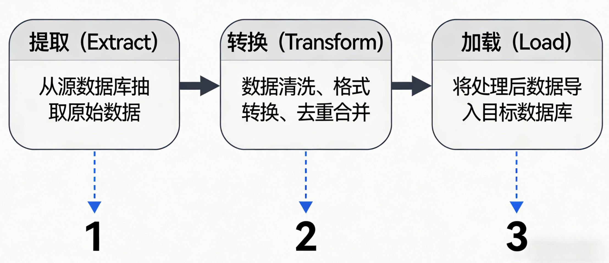

## 基本概念

### 常见解析场景

*📊 在线表格（无数据）*

### 文档解析难点

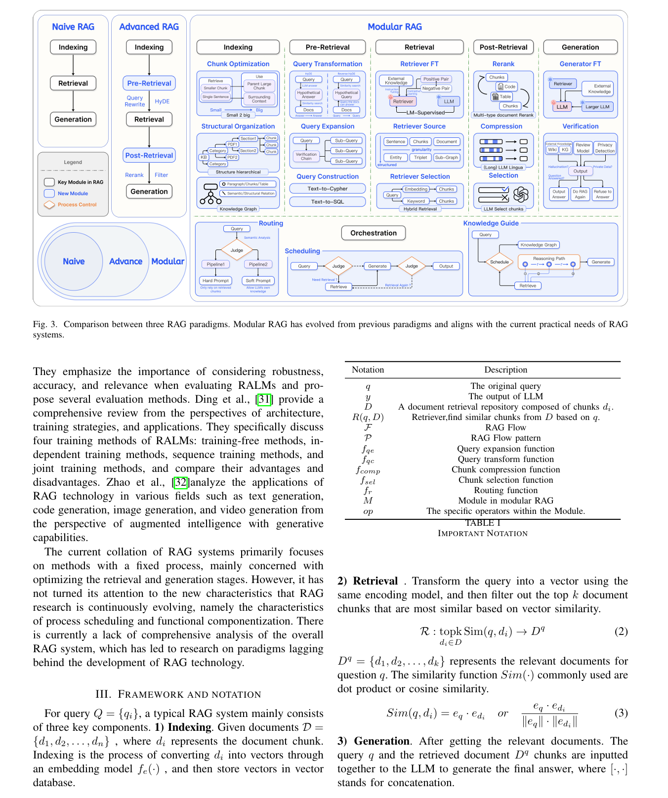

1. **布局解析困难**：PDF文件的布局可能会因为不同的作者、工具或用途而有各种方式
2. **格式错综复杂**：PDF文件中可能包含**文字**、**图像**、**表格**等，导致多样性和复杂性的增加。
3. **复合表格**：纵向/横向合并的复杂表格，在PDF中进行抽象还原是最难处理的问题之一
4. **文本、图片、表格顺序提取**：保证所有元素的顺序性，是上下文关联的一个重要机制
5. **文档结构还原**：还原PDF文件的文档结构，包括标题、目录等信息，为后续自动化处理做好基础。
6. **元数据提取**：在PDF中隐藏的元数据信息是RAG产品的关键数据，比如链接、目录、字体等等
7. **扫描件**：PDF中如果是扫描件，就需要依靠OCR模型来进行有效的提取，这里面还会包含清晰度、模型的稳定性等等问题
8. **Latex公式提取**：在一些特殊领域，PDF文本中包含了Latex等数学公式。通过完整的提取和转换是对RAG问答的有效补充

### 常见方案

文档解析领域，百花齐放，我们不会仅靠某个库就完成所有的功能适配。下面是一些常见选型：

*📊 在线表格（无数据）*

### OCR 领域常见开源方案

> 作为补充：`DeepSeek OCR`、`qwen-vl` 系列模型，都有不错的图文理解能力。
> 
> 我们最终推荐：最好使用 vl 模型，来进行图片内容理解和输出。
> 
> **比如：对于复杂排版 pdf 与 扫描件内容。可以将 pdf 转为高清图片，然后使用vl模型进行理解输出。这样就形成了机器自动化的审核校对。不出现语义不相关或者一些错误内容。**

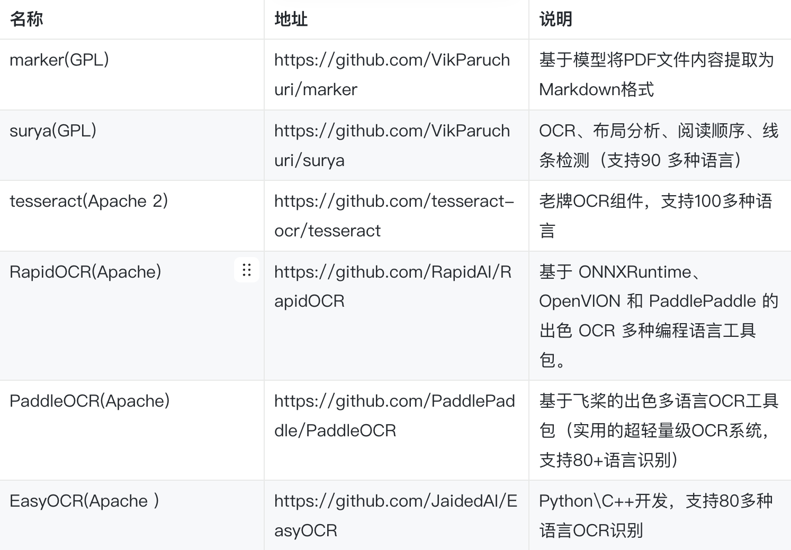

## Unstructured 库：核心底层模块

> `Unstructured.partition`** 函数开始，解析所有文档，得到 list[Element]**

> **Unstructured 是一个开源的「非结构化文档统一处理框架」**，专门用来把 PDF、Word、Excel、图片、PPT、邮件 等各种格式文件，**自动解析成干净、结构化、可直接用于 AI / RAG / ETL 的文本数据**。
> 
> 简单说：**一个库，搞定所有文档解析，不用为每种格式写代码。**
> 
> 项目地址：https://github.com/Unstructured-IO/unstructured

### 基本概念

#### strategy：解析策略

> Unstructured.io 作为集成框架，通过 strategy 参数实现后端自适应切换：

*📊 在线表格（无数据）*

策略选择核心逻辑：**简单纯文本选 fast，复杂结构选 hi_res，扫描件选 ocr_only，通用场景用 auto**。

#### 核心优势

Unstructured 能够将非结构化数据转化为向量数据库可索引的结构化格式，有效解决了RAG系统中"数据输入异构性"这一核心痛点，为下游的知识检索与生成任务提供了标准化数据基础

1. 可以和Agent框架集成（LangChain、LlamaIndex）
2. 也可以解析多种不同的文档形式（比较通用）
3. 主流应用的比较多、适用性比较广
4. **生态协同核心地位**：
  - Unstructured 库可以与 LangChain 主流框架深度集成（如UnstructuredLoader组件）
  - 与 LlamaIndex 深度集成（如UnstructuredReader组件）

### 快速上手

#### 第一步：安装依赖

```python
## 支持处理纯文本（.txt）、HTML（.html）、XML（.xml）和电子邮件（.eml、.msg、.p7s）文件
pip install unstructured

## 仅支持 pdf,docx
pip install "unstructured[pdf,docx]"

## 如果需要处理其他文件类型，还需要安装更多相应的依赖。部分功能依赖 google等在线 API接口
pip install "unstructured[all-docs]"
```

可用的文件类型扩展包括：

- **all-docs**：支持所有文件类型
- **csv**：仅限 .csv 文件
- **docx**：支持 .doc 和 .docx 文件
- **epub**：仅限 .epub 文件
- **image**：支持 .bmp、.heic、.jpeg、.png 和 .tiff 等图像文件
- **md**：仅限 .md 文件
- **odt**：仅限 .odt 文件
- **org**：仅限 .org 文件
- **pdf**：仅限 .pdf 文件
- **pptx**：支持 .ppt 和 .pptx 文件
- **rst**：仅限 .rst 文件
- **rtf**：仅限 .rtf 文件
- **tsv**：仅限 .tsv 文件
- **xlsx**：支持 .xls 和 .xlsx 文件

#### 第二步（选做）：本地高精度解析

> 安装它 = 解锁 Unstructured **完整版本地高精度文档解析能力**
> 
> 普通版 `unstructured` 只能做简单文本提取，这个版本能做**复杂 PDF、扫描件、表格、高精度解析**

```shell
pip install "unstructured[local-inference]"
```

1. **不用联网、不用调用外部 API**所有 OCR、文档布局分析、高精度解析 **全部在你自己电脑 / 服务器本地运行**
2. **自带 hi_res 高精度解析能力**支持识别标题、段落、表格、图片文本
3. **自带完整 OCR 能力**支持扫描版 PDF、图片文字识别（Tesseract + 本地模型）
4. **自带文档 AI 模型**检测文本块、分类元素、表格提取
5. **完全离线可用**

#### 第三步（选做）：第二步的前置准备

##### Windows

直接下载安装：

- **Tesseract**：[https://github.com/UB-Mannheim/tesseract/wiki](https://github.com/UB-Mannheim/tesseract/wiki)
  - 提供图像文本识别能力，是处理扫描版PDF和图片文件的核心组件。
- **Poppler**：https://github.com/oschwartz10612/poppler-windows
  - PDF内容提取底层引擎
- libmagic：跨平台文件类型检测

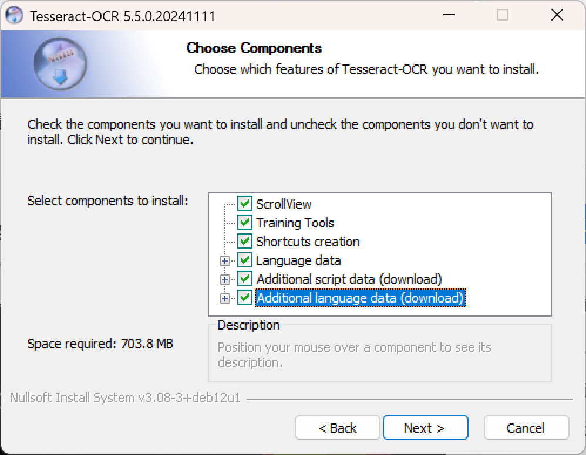

[📎 tesseract-ocr-w64-setup-5.5.0.20241111.exe](<files/tesseract-ocr-w64-setup-5.5.0.20241111.exe>)

[📎 Release-25.12.0-0.zip](<files/Release-25.12.0-0.zip>)

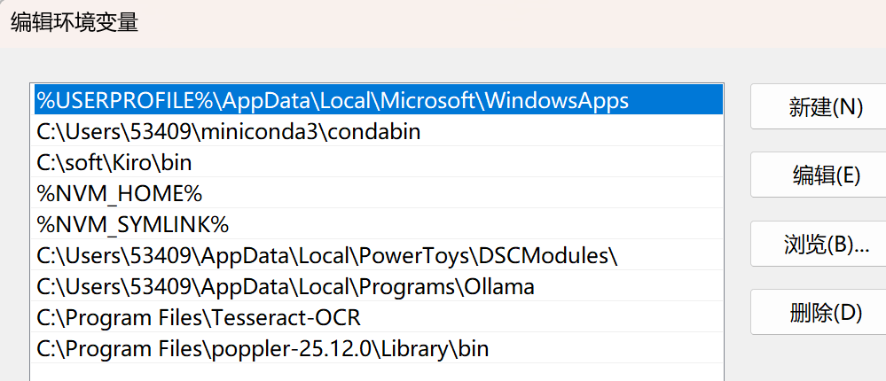

并把它们加入系统环境变量 PATH

##### Linux

```shell
sudo apt-get install -y tesseract-ocr poppler-utils
```

##### Mac

```shell
brew install tesseract poppler
```

##### 最后安装依赖

```shell
pip install "unstructured[local-inference]" unstructured_inference
```

#### 第四步：示例代码

```python
# 示例 1：快速模式
from unstructured.partition.auto import partition

ele = partition("测试物料/辰光Agent平台说明书.md",strategy="fast")
for line in ele:
    print(line)


############################# 以下配好环境自行测试 ######################
# 示例 2：本地高精度解析 PDF（支持扫描件 + 表格）
from unstructured.partition.auto import partition

# 本地高精度解析（自动使用 local-inference 模型）
elements = partition(
    "你的文档.pdf",
    strategy="hi_res",  # 必须用高精度模式
    infer_table_structure=True,  # 开启表格识别
)

# 输出解析后的内容
for elem in elements:
    print(f"类型：{elem.category}")
    print(f"内容：{elem.text}\n")


# 示例 3：纯 ocr 模式
elements = partition(
    "图片.png",
    strategy="ocr_only"
)

text = "\n".join([e.text for e in elements])
print("识别结果：", text)


```

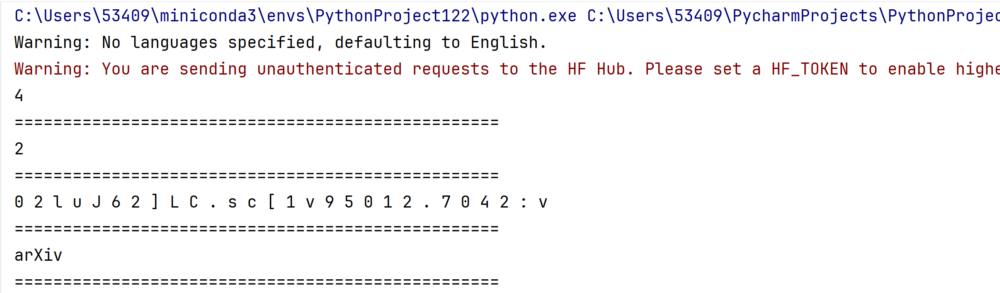

### 设计思想

> **一般来说，这些功能分为几类：**
> 
> - **分区(Partitioning)**：将原始文档分解为标准的结构化元素
> - **清理(Cleaning)**：从文档中删除不需要的文本，例如样板文件和句子片段
> - **暂存(Staging)**：函数格式化下游任务的数据，例如ML推理和数据标记
> - **分块(Chunking)**：功能将文档分割成更小的部分，以便在RAG应用程序和相似性搜索中使用
> - **嵌入(Embedding)**：编码器类提供了一个接口，可以轻松地将预处理的文本转换为向量

#### 元素化切分

```python
# UnstructuredIO核心组件
from unstructured.partition.auto import partition
from typing import List
from unstructured.documents.elements import Element

# 使用partition函数自动检测文件类型并解析,默认strategy策略是auto，还会有fast策略，速度比image-to-text models的快100倍
elements: List[Element] = partition(filename="RAG评估.md", strategy="auto")

# 元素的文本内容
print(elements[0].text)
print("===========================")

# 元素的类型
print(elements[0].category)
print("==================")

# 元素的元数据
print(elements[0].metadata.__dict__)
print("===========================")
```

#### 元数据语义

这些元数据让你能够：

- **精确定位**：知道文本在PDF中的确切位置
- **页面管理**：按页码组织和检索内容
- **多语言处理**：根据语言选择合适的处理策略
- **布局理解**：利用坐标信息进行版面分析

### Partition 实战

#### 通用参数

**partition通用参数如下**：

- **encoding**：指定输入文本／文档读取时使用的字符编码。对于非 UTF-8 文档非常有用
- **include_page_breaks**：如果设置为 True，当文档支持 “分页” 时，输出中会包含 PageBreak 元素，以标识不同页的边界
- **strategy**：指定解析策略，尤其对于 PDF/Image 文档，控制“快速 vs 高保真 vs OCR”方式
- **ocr_languages/languages**：当文档含有图像文字或扫描件时，可指定 OCR 语言包，如 ["eng","deu"]
- **skip_infer_table_types**：可指定跳过表格类型推断的文档类型，减少表格识别错误
- **fields_include**：控制输出 JSON 中包含哪些字段。可用于减小输出大小或过滤敏感字段["element_id","text","type","metadata"]
- **metadata_include / metadata_exclude**：用于控制在输出元素的 metadata 字段中，保留哪些键或者排除哪些键，默认全部输出
- **content_type**：在使用 URL 或文件流时，指定 MIME 类型提示，提高文件类型识别准确性
- **starting_page_number**：当处理文档是某个较大文档的一部分时，可以指定起始页号，用于 metadata

#### 解析：md

```python
from unstructured.partition.md import partition_md
from typing import List
from unstructured.documents.elements import Element

# 使用partition_md函数检测markdown文件类型解析,include_page_breaks若希望在 Markdown 中标识页面断点（少见场景）
elements: List[Element] = partition_md(filename="测试物料/辰光Agent平台说明书.md", languages=["zho"],include_page_breaks=True)

# 元素的元数据
print(elements[0].metadata.__dict__)
print("===========================")

# 元素的文本内容
print(elements[0].text)
print("===========================")

# 元素的类型
print(elements[0].category)
print("===========================")
```

#### 解析：html

```python
from unstructured.partition.html import partition_html
from typing import List
from unstructured.documents.elements import Element

# 使用partition_html函数检测html网页类型解析
elements = partition_html(url="https://docs.unstructured.io/welcome",
                          headers={"User-Agent":"MyBot"},
                          ssl_verify=False,
                          include_page_breaks=False,
                          encoding="utf-8")
#elements: List[Element] = partition_html(url="https://docs.unstructured.io/welcome", languages=["zho"])

# 元素的元数据
print(elements[1].metadata.__dict__)
print("===========================")

# 元素的文本内容
print(elements[1].text)
print("===========================")

# 元素的类型
print(elements[1].category)
print("===========================")
```

**支持 URL 输入、headers、ssl 验证选项**

- 除通用参数外：
  - url：直接给出网页 URL，无需先下载。
  - headers：HTTP 请求头（User-Agent 等）。
  - ssl_verify：是否验证 SSL 证书（False 可用于测试环境）。
  - file/filename/text：支持本地文件、文件流或网页文本输入。
  - content_type：可指定 text/html。

#### 解析：xlsx

```python
from unstructured.partition.xlsx import partition_xlsx
from typing import List
from unstructured.documents.elements import Element

# 使用partition_xlsx函数检测excel文件类型并解析
elements: List[Element] = partition_xlsx(filename="测试物料/电商销售数据.xlsx", languages=["zho"])

# 元素的元数据
print(elements[0].metadata.__dict__)
print("===========================")

# 元素的文本内容
print(elements[0].text)
print("===========================")

# 元素的类型
print(elements[0].category)
print("===========================")
```

#### 解析：csv

```python
from unstructured.partition.csv import partition_csv
from typing import List
from unstructured.documents.elements import Element

# 使用partition_csv函数检测csv文件类型并解析
elements = partition_csv(filename="测试物料/用户下单数据.csv", encoding="gbk")

# 元素的元数据
#print(elements[0].metadata.__dict__)
print("===========================")

# 元素的文本内容
print(elements[0].text[:400])
print("===========================")

# 元素的类型
print(elements[0].category)
print("===========================")
```

#### 解析：doc

```python
from unstructured.partition.docx import partition_docx
from unstructured.partition.doc import partition_doc
from typing import List
from unstructured.documents.elements import Element

# 使用partition_docx函数检测word文件类型并解析，include_page_breaks当文档支持 “分页” 时，以标识不同页的边界
elements = partition_docx(filename="测试物料/LangChain零基础入门教程.docx", encoding="utf-8", include_page_breaks=True)

# 元素的元数据
print(elements[0].metadata.__dict__)
print("===========================")

# 元素的文本内容
print(elements[0])
print("===========================")

# 元素的类型
print(elements[0].category)
print("===========================")
```

#### 解析：图片

```python
from unstructured.partition.image import partition_image
from typing import List
from unstructured.documents.elements import Element

# 使用partition_image函数检测png类型并解析，strategy="ocr_only"使用ocr来进行图片内容文字识别
elements = partition_image(filename="PDF解析截图.png",
                           strategy="ocr_only",
                           languages=["eng","chi_sim"],
                           include_page_breaks=False)

# 元素的元数据
print(elements[0].metadata.__dict__)
print("===========================")

# 元素的文本内容
print(elements[0].text[:400])
print("===========================")

# 元素的类型
print(elements[0].category)
print("===========================")
```

### 核心对象字段

#### Element 对象

返回的Element对象包含以下核心字段：

- **text**：元素的文本内容（表格会以Markdown表格格式呈现）
- **category**：元素类型，如Title、NarrativeText、ListItem、Table等
- **metadata**：元素的元数据

#### Category 元素

- **Title（标题****）**：文档的标题和副标题
- **NarrativeText（叙事文本）**：纯文本的段落
- **Table（表格）**：表格数据
- **Text（段落）**：文本段落
- **Image（图像）**：所有图片
- **Formula（数学公式）**：文本 y = Wx + b
- **Header/Footer（页眉/页脚）**：可以将它们与主要内容区分开来

#### Metadata 元数据

- **页码（page_number）**：该文本块所在的页码（从1开始）
- **坐标信息（coordinates）**：
- **points**：文本块在页面上的边界框坐标（4个角的坐标点）
  - 格式：`[左上, 左下, 右下, 右上]`
  - 单位：像素点
- **system**：坐标系统类型（PixelSpace = 像素坐标系）
- **layout_width/height**：页面的总宽度和高度（像素）
- **语言（languages）**：检测到的文档语言（如`["zho"]` = 中文，ISO 639-3语言代码）
- **文件基本信息**：
- **filename**：原始文件名
- **last_modified**：文件最后修改时间（ISO 8601格式）
- **filetype**：文件MIME类型（如`application/pdf`）

## LlamaIndex 库：功能大整合

```shell
# 核心库安装：LlamaIndex 版本0.14.x
pip install llama-index-core llama-index
# 解析库安装
pip install llama-parse unstructured nest-asyncio python-multipart llama-index-readers-file
pip install "unstructured[md]"
```

### 常用组件

- `SimpleDirectoryReader`
- `LlamaParse`（针对复杂 PDF）：需申请官方key
  - 官方文档申请api_key：[https://llamaindex.org.cn/blog/pdf-parsing-llamaparse](https://llamaindex.org.cn/blog/pdf-parsing-llamaparse)
- `UnstructuredReader`（多格式文档）
- `PandasReader`（表格类文件）

### 功能测试：SimpleDirectoryReader

#### 作用

> **从本地文件夹自动读取所有支持格式的文件，转换成 LlamaIndex 可用的 Document 对象**。

**支持的文件格式**

- 文本：`.txt`, `.md`, `.rst`
- 表格：`.csv`, `.xlsx`, `.xls`
- 文档：`.docx`, `.ppt`, `.pptx`, `.pdf`
- 图片（可配合 OCR）：`.jpg`, `.png`
- 代码：`.py`, `.java`, `.js` 等

**核心功能**

1. **递归读取子文件夹**
2. **自动识别文件类型**
3. **过滤指定文件 / 后缀**
4. **批量加载文件**
5. **兼容 Windows / Mac / Linux**

#### 基础用法：

```python
## 基础使用（读取整个文件夹）
from llama_index.core import SimpleDirectoryReader

# 读取当前目录下所有文件
documents = SimpleDirectoryReader("./测试物料").load_data()

# 查看读取结果
print(f"共读取 {len(documents)} 个文件")
print("第一个文件内容：", documents[0].text[:100])
```

#### 进阶用法

```python
from llama_index.core import SimpleDirectoryReader

# 1. 只读取指定后缀
reader = SimpleDirectoryReader(
    input_dir="./测试物料",
    required_exts=[".pdf", ".md", ".txt"]  # 只加载这三类文件
)

# 2. 递归读取子文件夹
reader = SimpleDirectoryReader(
    input_dir="./测试物料",
    recursive=True  # 开启递归
)

# 3. 排除某些文件
reader = SimpleDirectoryReader(
    input_dir="./测试物料",
    exclude=["test.md", "tmp/*"]
)

documents = reader.load_data()
```

#### 更多 Readers 

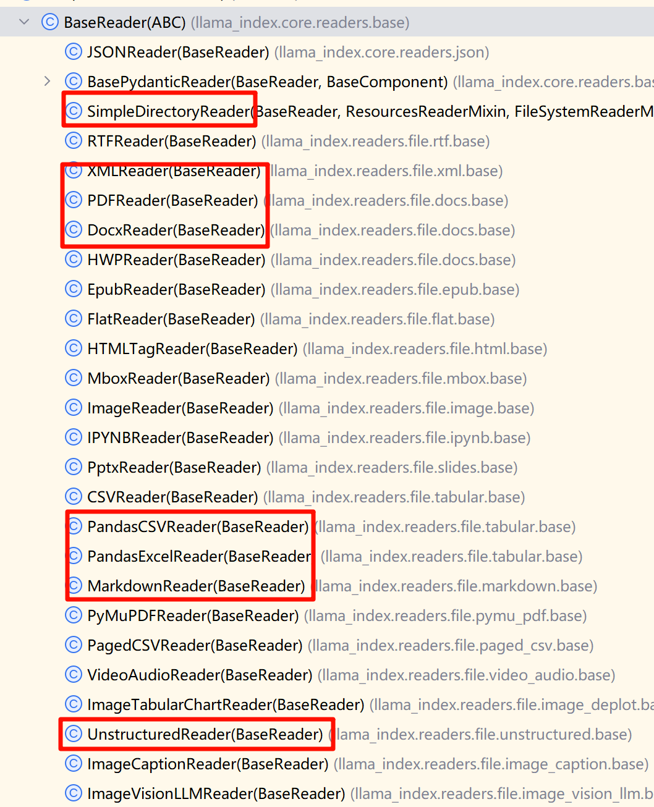

pip uninstall -y setuptools wheel Cython

pip install -U "setuptools==80.9.0" wheel Cython

Pypi 搜索 `llama-index-readers`

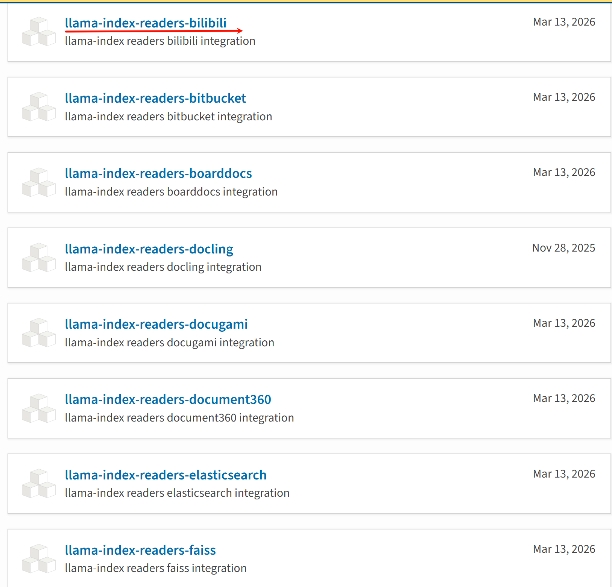

```shell
pip install cython
pip install pyyaml
pip install llama-index-readers-bilibili
```

```python
## 注意： 这个版本的 bilibili_api 已经过时，没法使用了。代码不可运行，仅作为扩展演示使用
from llama_index.readers.bilibili import BilibiliTranscriptReader

loader = BilibiliTranscriptReader()

documents = loader.load_data(
          video_urls=["https://www.bilibili.com/video/BV1yx411L73B/"]
          )
```

> 所有 LlamaIndex Reader **用法几乎一模一样**：
> 
> 1. 导入 Reader
> 2. 创建实例
> 3. 调用 `.load_data()` 传入参数
> 4. 得到 `Document` 列表，可直接用于 RAG 构建索引

### `UnstructuredReader` vs `unstructured.partition`

```python
from llama_index.readers.file import UnstructuredReader

# split_documents=True，将文档按段落拆分。
# 实际上是把 Unstructured.partition() 的 list[Element] 转为 文档 list[Document]
docs = UnstructuredReader().load_data(file="./测试物料/辰光Agent平台说明书.md",
                                      split_documents=False)
for doc in docs:

    print(doc)
```

#### 功能对比

*📊 在线表格（无数据）*

#### 使用哪个

- **LlamaIndex的**`UnstructuredReader` = 快速封装，适合上层应用
- `unstructured.partition` = 底层引擎，适合复杂数据管线
- **在原型阶段用**`UnstructuredReader`**，在生产阶段直接集成**`unstructured`**。**
- 对于复杂文档，必须集成  Paddle-OCR 及 MinerU 之类的大模型方案

## 文档解析：生产级方案

### 各方案指标

> **OmniDocBench  **是文档解析领域最权威的综合基准，涵盖 1355 页、9 类文档（中英文混合），评估文本识别、公式解析、表格还原、阅读顺序等多维度能力。
> 
> https://github.com/opendatalab/OmniDocBench
> 
> **下面的评测得分**：
> 
> 1. **PaddleOCR-VL** 是优选方案，全生态较重量级
> 2. **MinerU2.5** 生态比较好，轻量级部署
> 3. **OpenDoc-0.1B** 是适合边缘节点设备的小模型
> 
> 未来我们的项目，优选 **PaddleOCR-VL/MinerU2.5** 本地化部署方案
> 
> https://github.com/opendatalab/MinerU：适用学术论文/技术报告等 pdf场景
> 
> https://github.com/PaddlePaddle/PaddleOCR：适用手机拍照、纯图文档 场景

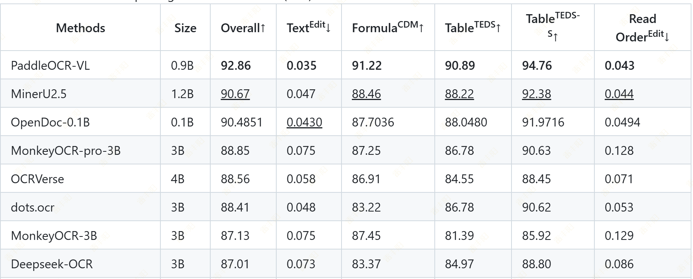

### 常见方案架构

*📊 在线表格（无数据）*

### MinerU

#### 下载体验

> 下载体验：https://mineru.net/

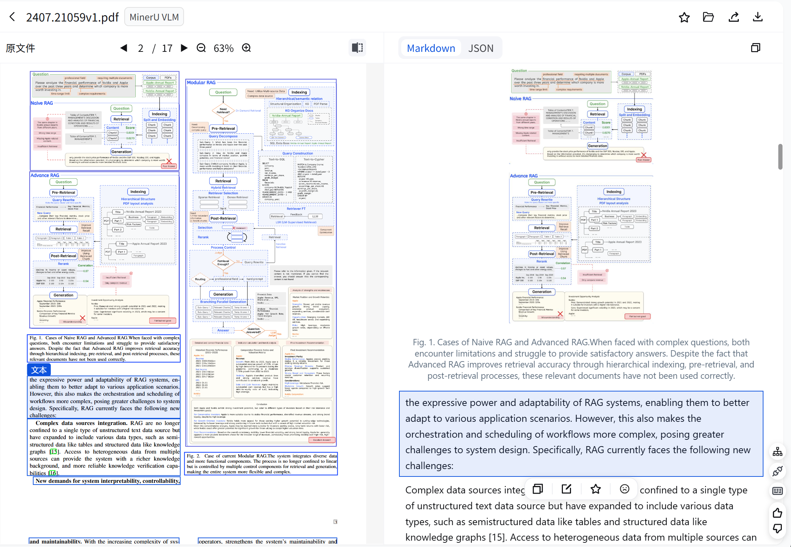

#### 项目集成

https://mineru.net/apiManage/docs

> Docker 部署 Miner U（开箱即用）
> 
> 按照接口文档发送请求

# 实战：Modular RAG 全流程

> 调用 LlamaIndex 中的核心组件，完成 Modular RAG 全流程