# 5. 向量数据库：Milvus

# Milvus 核心用法

https://milvus.io/docs/zh/schema.md

## 快速上手

### 安装

> Windows 下专门准备一个文件夹，创建 `docker-compose.yaml` 文件，内容如下:

```yaml
version: '3.5'

services:
  etcd:
    container_name: milvus-etcd
    image: quay.io/coreos/etcd:v3.5.25
    environment:
      - ETCD_AUTO_COMPACTION_MODE=revision
      - ETCD_AUTO_COMPACTION_RETENTION=1000
      - ETCD_QUOTA_BACKEND_BYTES=4294967296
      - ETCD_SNAPSHOT_COUNT=50000
    volumes:
      - ./data/etcd:/etcd
    command: etcd -advertise-client-urls=http://etcd:2379 -listen-client-urls http://0.0.0.0:2379 --data-dir /etcd
    healthcheck:
      test: ["CMD", "etcdctl", "endpoint", "health"]
      interval: 30s
      timeout: 20s
      retries: 3

  minio:
    container_name: milvus-minio
    image: minio/minio:RELEASE.2024-12-18T13-15-44Z
    environment:
      MINIO_ACCESS_KEY: minioadmin
      MINIO_SECRET_KEY: minioadmin
    ports:
      - "9001:9001"
      - "9000:9000"
    volumes:
      - ./data/volumes/minio:/minio_data
    command: minio server /minio_data --console-address ":9001"
    healthcheck:
      test: ["CMD", "curl", "-f", "http://localhost:9000/minio/health/live"]
      interval: 30s
      timeout: 20s
      retries: 3

  standalone:
    container_name: milvus-standalone
    image: milvusdb/milvus:v2.6.13
    command: ["milvus", "run", "standalone"]
    security_opt:
    - seccomp:unconfined
    environment:
      ETCD_ENDPOINTS: etcd:2379
      MINIO_ADDRESS: minio:9000
      MQ_TYPE: woodpecker
    volumes:
      - ./data/volumes/milvus:/var/lib/milvus
    healthcheck:
      test: ["CMD", "curl", "-f", "http://localhost:9091/healthz"]
      interval: 30s
      start_period: 90s
      timeout: 20s
      retries: 3
    ports:
      - "19530:19530"
      - "9091:9091"
    depends_on:
      - "etcd"
      - "minio"
  
  # Milvus  可视化客户端
  attu:
    container_name: attu
    image: zilliz/attu:latest
    environment:
      MILVUS_URL: standalone:19530
    ports:
      - "8000:3000"
    depends_on:
      - "standalone"
networks:
  default:
    name: milvus
```

> 执行安装命令：

```shell
docker compose -f docker-compose.yaml up -d

# 注意：开启本地翻墙后者docker加速，极端情况下，需要你手动自行下载镜像。 如：
docker pull quay.io/coreos/etcd:v3.5.5
```

### 界面

#### 默认

http://127.0.0.1:9091/webui

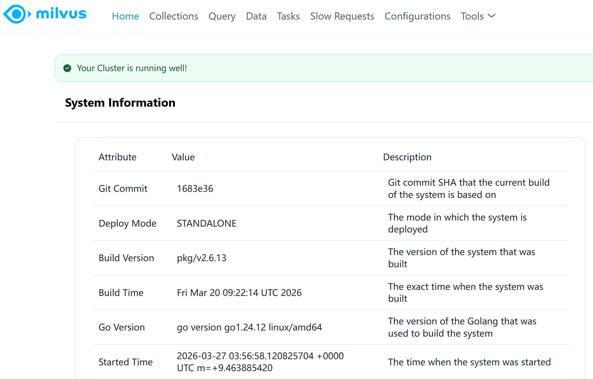

#### Attu

http://localhost:8000/

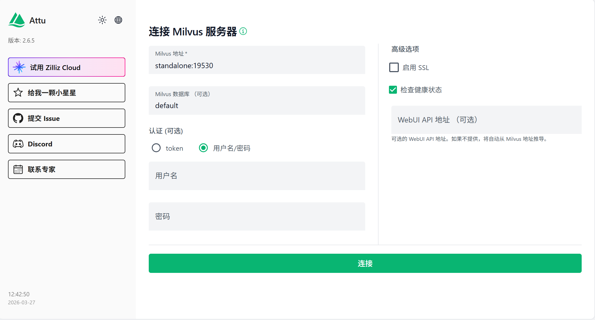

### 核心原理

#### 非结构化数据、Embeddings 和 Milvus

> 非结构化数据（如文本、图像和音频）格式各异，蕴含丰富的潜在语义，因此分析起来极具挑战性。为了**处理这种复杂性，**`Embeddings`**被用来将非结构化数据转换成能够捕捉其基本特征的数字向量**。然后将这些向量存储在向量数据库中，从而实现快速、可扩展的搜索和分析。

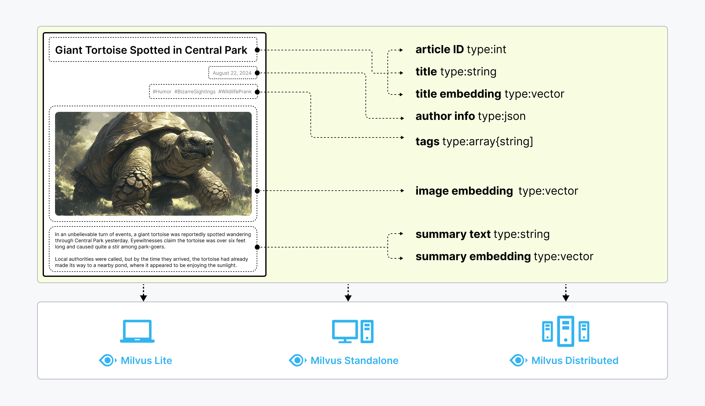

#### 三种部署模式

1. **Milvus Lite** 是一个` Python 库`，数据保存在本地。
2. **Milvus Standalone** 是单机服务器部署，所有组件都捆绑在一个 Docker 镜像中，方便部署。
3. **Milvus Distributed** 可部署在 Kubernetes 集群上，采用云原生架构，专为十亿规模甚至更大的场景而设计。

#### 四层架构详解

> 1. Client SDK & Proxy（接入层）
> 2. Coordinator（控制平面）
> 3. Workers（数据平面：Streaming/Query/Data 节点）
> 4. Durable Storage（持久化存储层）

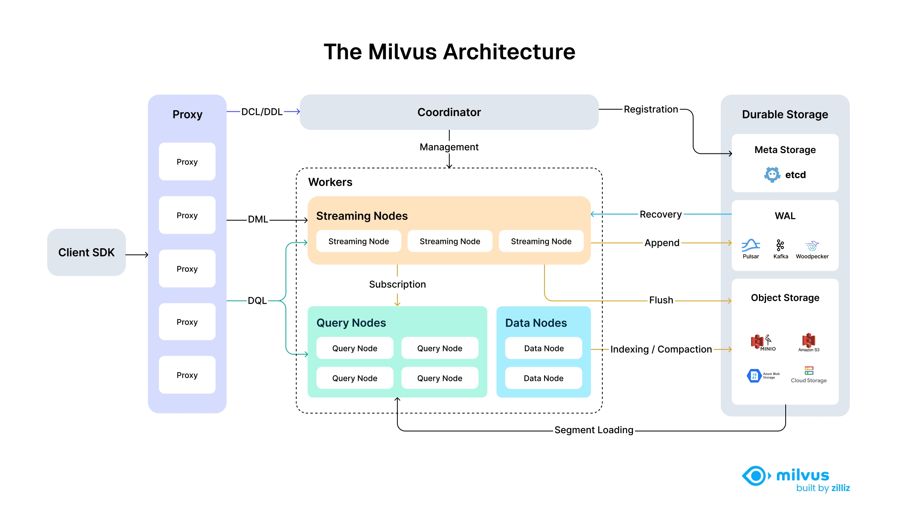

##### 接入层：Client SDK + Proxy

- **Client SDK**：用户侧入口，提供 Python/Java/Go 等语言 SDK，封装所有 Milvus API。
- **Proxy 集群**：无状态网关，可水平扩展，核心职责：
  - 接收并分发 3 种请求：
    - `DCL/DDL`（建库、建表、建索引等元数据操作）
    - `DML`（插入、更新、删除等数据写入操作）
    - `DQL`（向量检索、查询等读操作）
  - 负载均衡、请求校验、结果聚合（MPP【Massively Parallel Processing，大规模并行处理架构】 查询时汇总多个 Query Node 的结果）。

##### 控制平面：Coordinator（协调器）

Milvus 的 “大脑”，所有元数据、调度、集群管理都在这里，核心功能：

- 接收 Proxy 的 `DCL/DDL` 请求，处理集合 / 分区 / 索引的创建与管理。
- 管理所有 Worker 节点（Streaming/Query/Data Node）的注册与生命周期。
- 维护集群拓扑、分配任务、协调数据分片与均衡。
- 所有 Coordinator 的元数据，最终持久化到右侧的 `Meta Storage（etcd）`。

##### 工作节点：Workers（数据平面，核心执行层）

这是 Milvus 实际干活的部分，分为 3 种独立的节点，各司其职：

1. **Streaming Nodes（流节点）**

- **定位**：**实时写入与增量数据管理中心**，是 2.5+ 版本新增的核心组件。
- 数据流：
  1. 接收 Proxy 转发的 `DML`（写入 / 删除）请求。
  2. `Append` 写入 `WAL`（预写日志，如 Pulsar/Kafka），保证数据不丢。
  3. 维护内存中的 `Growing`` Segment`（未封存的热数据），支持实时可见。
  4. 通过 `Subscription` 推送**增量数据**给 Query Nodes，实现 “热数据实时可查”。
  5. 当 Segment 达到**阈值**时，执行 `Flush`，将数据写入 `Object Storage` 并转为 `Sealed Segment`。
  6. 故障时，通过 `Recovery` 从 WAL 恢复数据。

1. **Query Nodes（查询节点）**

- **定位**：向量检索的执行引擎，是 Milvus 读性能的核心。
- 数据流：
  1. 接收 Proxy 转发的 `DQL`（查询 / 检索）请求。
  2. 从 `Object Storage` 加载 `Sealed Segment` 的索引到内存（`Segment Loading`）。
  3. 订阅 Streaming Nodes，实时获取 `Growing Segment` 的增量数据。
  4. 执行混合检索（**热数据** + **冷数据**），返回局部 TopK 结果给 Proxy。

`Growing Segment`：每个segment 假设 512MB，内存占用

`Sealed Segment`：512MB 的 一个实体文件

如果数据很多，可以分区，分区(文件夹)下面又是一个个的 `Segment`（文件）

> Topic -> partition -> log

1. **Data Nodes（数据节点）**

- **定位**：`离线数据处理中心，负责后台任务，不影响线上读写。`做数据的再加工
- 数据流：
  1. 消费 `Sealed Segment`，执行 `Indexing`（构建向量索引）和 `Compaction`（合并小 Segment，优化查询）。
  2. 将处理后的索引文件和数据，写入 `Object Storage` 持久化。

##### 持久化存储层：Durable Storage

Milvus 的数据底座，所有数据和元数据最终都存在这里，分为 3 部分：

1. **Meta Storage（etcd）**：`强一致 KV 存储`，存所有元数据（集合 / 分区 / 节点信息等）。
2. `WAL（Pulsar/Kafka/Woodpecker）`：预写日志，保证写入操作的原子性与可恢复性。最终一致性的表现
3. `Object Storage（S3/MinIO 等）`：存原始向量数据、Segment 文件、索引文件，是 Milvus 存储计算分离的基础。

## 核心概念

| 核心概念 | 定义 | 类比 MySQL | 关键细节 |
| --- | --- | --- | --- |
| 集合（Collection） | Milvus 中存储数据的最高级容器，用于归类不同类型的向量数据，是数据管理的基本单元。 | 类比 MySQL 中的「表」 | 不同类型的向量数据需分开创建集合（如 PDF 文档向量集合、图片向量集合） |
| 字段（Field） | 集合的组成单元，用于存储具体的数据信息，每个集合需包含多种类型的字段。 | 类比 MySQL 中的「列」 | 必配 3 种核心字段： 主键字段（唯一标识）、 向量字段（存储向量）、 元数据字段（存储附加信息） |
| 向量（Embedding） | 将文本、图片等非结构化数据，通过嵌入模型转换后的数值数组，是 Milvus 相似度检索的核心。 | MySQL 不支持向量类型 | 示例：[0.123, 0.456, ...]，维度需与集合配置一致（如：1536 维） |
| 索引（Index） | 用于加速向量检索的结构，避免无索引时的全量扫描，提升查询效率。 | 类比 MySQL 中的「索引」（如 B+ 树索引） | 常用类型： 1. IVF_FLAT：适配中小规模数据，速度快、配置简单 2. HNSW：适配大规模数据，检索速度更快，但占用内存较多 3. IVF_SQ8：内存占用低，检索速度中等，适合资源有限场景 |

### 集合（Collection）

下图显示了一个有 8 列和 6 个实体的 Collection。

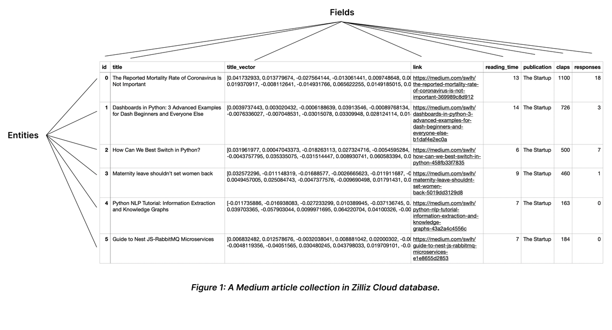

### 模式（Schema）和 字段（Fields）

Collections Schema 有一个主键、至少一个向量字段和几个标量字段。下图说明了如何将文章映射到模式字段列表。

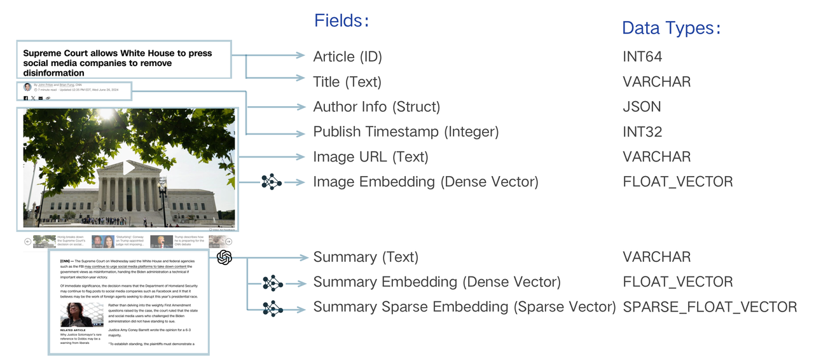

## CRUD实战

### 第一步：安装依赖

```shell
# 驱动 和 milvus 安装的版本要基本对应
pip install pymilvus==2.6.10
```

### 第二步：测试连接

> 创建  `milvus_python_crud.py` 文件

```python
from pymilvus import (
    connections,
    Collection,
    CollectionSchema,
    FieldSchema,
    DataType,
    utility
)
import random


# -------------------------- 1. 连接 Milvus（核心第一步）--------------------------
def connect_milvus():
    """连接 Milvus 服务，新手无需修改参数"""
    try:
        # 断开现有连接（避免重复连接）
        if connections.has_connection("default"):
            connections.disconnect("default")

        # 连接 Milvus（host 为 localhost，port 为 19530，与 Docker 配置一致）
        connections.connect(
            alias="default",
            host="localhost",
            port=19530,
            timeout=30  # 超时时间，单位：秒
        )
        print("✅ 成功连接 Milvus 服务")
    except Exception as e:
        print(f"❌ 连接 Milvus 失败：{str(e)}")
        raise SystemExit(1)

if __name__ == "__main__":
    # 建立连接
    connect_milvus()
```

### 第三步：创建集合

```python
# -------------------------- 2. 创建集合（Create）--------------------------
def create_collection(collection_name="test_collection", dim=1536):
    """
    创建 Milvus 集合（类比 MySQL 创建表）
    :param collection_name: 集合名（自定义）
    :param dim: 向量维度（根据自己的嵌入模型调整，本文用 1536 示例）
    """
    try:
        # 检查集合是否已存在，存在则删除（新手方便测试，生产环境谨慎）
        if utility.has_collection(collection_name):
            utility.drop_collection(collection_name)
            print(f"⚠️  集合 {collection_name} 已存在，已删除")
        
        # 1. 定义字段（必配 3 个核心字段）
        fields = [
            # 主键字段：自动生成，唯一标识每条数据
            FieldSchema(
                name="id",
                dtype=DataType.INT64,
                is_primary=True,
                auto_id=True
            ),
            # 向量字段：存储向量数据，维度为 dim
            FieldSchema(
                name="embedding",
                dtype=DataType.FLOAT_VECTOR,
                dim=dim
            ),
            # 元数据字段：存储附加信息（如文本内容），JSON 类型灵活存储
            FieldSchema(
                name="metadata",
                dtype=DataType.JSON
            )
        ]
        
        # 2. 创建集合 schema（描述集合结构）
        schema = CollectionSchema(
            fields=fields,
            description="Milvus 测试集合（包含主键、向量、元数据）"
        )
        
        # 3. 创建集合
        collection = Collection(
            name=collection_name,
            schema=schema,
            using="default"
        )
        
        # 4. 创建索引（加速检索，新手首选 IVF_FLAT）
        index_params = {
            "index_type": "IVF_FLAT",
            "metric_type": "L2",  # 度量类型：L2（欧氏距离），常用场景
            "params": {"nlist": 128}  # 索引参数，无需修改，适配中小规模数据
        }
        collection.create_index(
            field_name="embedding",  # 对向量字段创建索引
            index_params=index_params,
            index_name="embedding_index"
        )
        
        # 加载集合（必须加载，否则无法检索）
        collection.load()
        print(f"✅ 成功创建并加载集合：{collection_name}")
        return collection
    except Exception as e:
        print(f"❌ 创建集合失败：{str(e)}")
        raise
       
if __name__ == "__main__":
    # 建立连接
    connect_milvus()

    # 创建集合
    collection = create_collection()
```

### 第四步：新增数据

```python
# -------------------------- 3. 插入数据（Insert）--------------------------
def insert_data(collection, data_count=10):
    """
    插入数据到集合（类比 MySQL insert）
    :param collection: 集合对象（create_collection 返回的结果）
    :param data_count: 插入数据条数（自定义，新手用 10 条测试）
    """
    try:
        # 模拟数据：生成 10 条向量 + 元数据（实际场景中，向量由嵌入模型生成）
        insert_data = [
            # 向量字段：生成 1536 维随机向量（模拟嵌入模型输出）
            [random.random() for _ in range(1536)] for _ in range(data_count)
        ]
        metadata_list = [
            # 元数据字段：存储每条向量的附加信息
            {"text": f"测试文本{i}", "source": "milvus_test"} for i in range(data_count)
        ]
        
        # 插入数据（注意：数据顺序要与字段顺序一致：embedding、metadata，主键自动生成）
        result = collection.insert(
            data=[insert_data, metadata_list]
        )
        
        # 刷新数据（确保数据写入磁盘，避免查询不到）
        collection.flush()
        print(f"✅ 成功插入 {data_count} 条数据，插入 ID：{result.primary_keys}")
        return result.primary_keys  # 返回插入的主键 ID，后续更新/删除会用到
    except Exception as e:
        print(f"❌ 插入数据失败：{str(e)}")
        raise
   
if __name__ == "__main__":
    # 建立连接
    connect_milvus()
    
    # 创建集合
    collection = create_collection()
    
    # 插入数据
    insert_data(collection)
```

### 第五步：查询数据

```python
# -------------------------- 4. 查询数据（Read）--------------------------
def search_data(collection, query_vector=None, top_k=3):
    """
    相似度查询（Milvus 核心功能，类比 MySQL select）
    :param collection: 集合对象
    :param query_vector: 查询向量（默认生成随机向量，模拟实际查询场景）
    :param top_k: 返回最相似的 k 条数据
    """
    try:
        # 模拟查询向量（实际场景中，由用户查询文本通过嵌入模型生成）
        if query_vector is None:
            query_vector = [random.random() for _ in range(1536)]
        
        # 定义查询参数
        search_params = {
            "metric_type": "L2",
            "params": {"nprobe": 10}  # 检索参数，无需修改
        }
        
        # 执行相似度查询（指定要返回的字段：metadata）
        results = collection.search(
            data=[query_vector],  # 查询向量（可批量查询，传入列表）
            anns_field="embedding",  # 按向量字段检索
            param=search_params,
            limit=top_k,  # 返回 top_k 条最相似数据
            output_fields=["metadata"]  # 返回元数据字段（按需指定）
        )
        
        # 解析查询结果
        print(f"\n🔍 相似度查询结果（top {top_k}）：")
        for i, result in enumerate(results[0]):
            # 打印：相似度距离（越小越相似）、主键 ID、元数据
            print(f"第{i+1}条：距离={result.distance:.4f}，ID={result.id}，元数据={result.entity.get('metadata')}")
        
        return results
    except Exception as e:
        print(f"❌ 查询数据失败：{str(e)}")
        raise
        
if __name__ == "__main__":
    # 建立连接
    connect_milvus()

    # 创建集合
    collection = create_collection()

    # 插入数据
    insert_data(collection)

    # 查询数据
    search_data(collection)
```

### 第六步：更新数据（autoid模式）

覆盖模式下的**上载请求（upsert）**结合了插入和删除操作。

> 当收到针对现有实体的`upsert` 请求时，Milvus 会插入请求有效载荷中携带的数据，**并同时删除数据中指定原始主键的现有实体。 具体策略如下：**

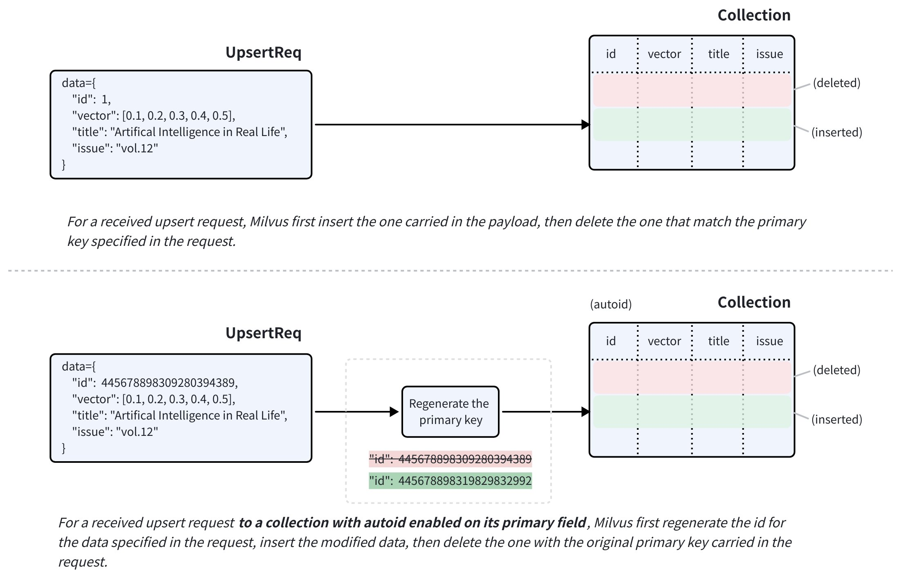

#### 合并更新

可以使用`partial_update` 标志，使上载请求以合并模式运行。

这样就可以在请求有效载荷中只包含需要更新的字段。

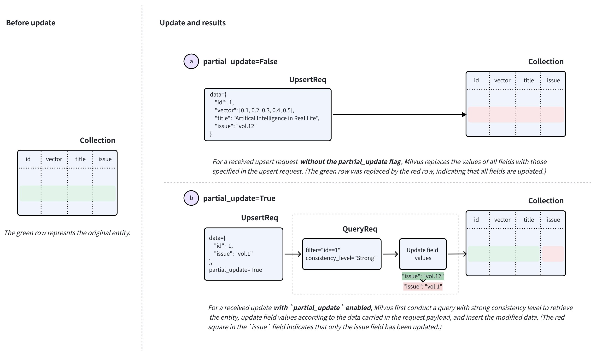

```python
# -------------------------- 5. 更新数据（Update）--------------------------
def update_data(collection, primary_id, new_metadata):
    """
        upsert接口是 Milvus 实现数据更新的核心方式，通过 ID 匹配实现 “存在即更新，不存在即插入”；
        更新操作需先定义包含目标 ID 和新字段值的数据列表，再调用upsert接口执行；
        注意：
        1. 更新时需指定 partial_update=True，否则会插入新数据而不是更新；
        2.
    """
    try:
        # 1. 先查询原数据，获取对应向量（upsert 需传入完整向量+新元数据，向量不变仅更新元数据）
        expr = f"id == {primary_id}"
        res = collection.query(expr=expr, output_fields=["embedding", "metadata"])
        if not res:
            raise ValueError(f"未找到 ID={primary_id} 的数据，无法更新")
        # 提取原向量（保持向量不变，仅更新元数据）
        data = {
            "id": primary_id,
            "metadata": new_metadata
        }

        res = collection.upsert(data=data,partial_update = True)
        collection.flush()
        print(f"✅ 成功更新 ID={primary_id} 的数据，更新条数：{res.upsert_count}，插入条数：{res.insert_count}")
    except Exception as e:
        print(f"❌ 更新数据失败：{str(e)}")
        # 补充报错排查提示，帮助新手定位问题
        if "upsert" in str(e):
            print("⚠️  排查提示：请确认集合创建时已开启 enable_dynamic_field，且主键 ID 存在")
        raise
```

### 第七步：删除数据

```python
# -------------------------- 6. 删除数据（Delete）--------------------------
def delete_data(collection, primary_ids):
    """
    删除数据（按主键删除，类比 MySQL delete）
    :param collection: 集合对象
    :param primary_ids: 要删除的主键 ID 列表（可批量删除）
    """
    try:
        # 按主键筛选删除（支持批量删除，expr 用 in 语法）
        expr = f"id in {primary_ids}"
        result = collection.delete(expr=expr)
        collection.flush()
        print(f"✅ 成功删除 {result.delete_count} 条数据，删除 ID：{primary_ids}")
    except Exception as e:
        print(f"❌ 删除数据失败：{str(e)}")
        raise
```

## 复杂检索

### 基本`ANN`搜索

> ANN（**近似近邻**）和 k-Nearest Neighbors (kNN：<u>**K-最近邻算法**</u>) 搜索是向量相似性搜索的常用方法。
> 
> 1. 在** kNN 搜索**中，必须将向量空间中的`所有向量`与`搜索请求`中携带的查询向量`进行比较`，然后找出最相似的向量，这既耗时又耗费资源。
> 2. 与 kNN 搜索不同，`ANN 搜索`算法`要求提供一个索引文件`，记录向量 Embeddings 的排序顺序。当收到搜索请求时，可以使用索引文件作为参考，快速找到可能包含与查询向量最相似的向量嵌入的**子组**。然后，你可以使用指定的度量类型来测量**查询向量与子组中的向量之间的相似度**，根据与查询向量的相似度对组成员进行排序，并**找出前 K 个组成员**。

#### 准备数据

```python
from pymilvus import MilvusClient, DataType

client = MilvusClient()


client.create_collection("quick_setup",primary_field_name="id",
                         vector_field_name="vector",
                         dimension=5)


data=[
    {"id": 0, "vector": [0.3580376395471989, -0.6023495712049978, 0.18414012509913835, -0.26286205330961354, 0.9029438446296592], "color": "pink_8682"},
    {"id": 1, "vector": [0.19886812562848388, 0.06023560599112088, 0.6976963061752597, 0.2614474506242501, 0.838729485096104], "color": "red_7025"},
    {"id": 2, "vector": [0.43742130801983836, -0.5597502546264526, 0.6457887650909682, 0.7894058910881185, 0.20785793220625592], "color": "orange_6781"},
    {"id": 3, "vector": [0.3172005263489739, 0.9719044792798428, -0.36981146090600725, -0.4860894583077995, 0.95791889146345], "color": "pink_9298"},
    {"id": 4, "vector": [0.4452349528804562, -0.8757026943054742, 0.8220779437047674, 0.46406290649483184, 0.30337481143159106], "color": "red_4794"},
    {"id": 5, "vector": [0.985825131989184, -0.8144651566660419, 0.6299267002202009, 0.1206906911183383, -0.1446277761879955], "color": "yellow_4222"},
    {"id": 6, "vector": [0.8371977790571115, -0.015764369584852833, -0.31062937026679327, -0.562666951622192, -0.8984947637863987], "color": "red_9392"},
    {"id": 7, "vector": [-0.33445148015177995, -0.2567135004164067, 0.8987539745369246, 0.9402995886420709, 0.5378064918413052], "color": "grey_8510"},
    {"id": 8, "vector": [0.39524717779832685, 0.4000257286739164, -0.5890507376891594, -0.8650502298996872, -0.6140360785406336], "color": "white_9381"},
    {"id": 9, "vector": [0.5718280481994695, 0.24070317428066512, -0.3737913482606834, -0.06726932177492717, -0.6980531615588608], "color": "purple_4976"}
]

res = client.insert(
    collection_name="quick_setup",
    data=data
)

print(res)
```

#### ann搜索

```python
from pymilvus import MilvusClient, DataType

client = MilvusClient()


query_vector = [0.3580376395471989, -0.6023495712049978, 0.18414012509913835, -0.26286205330961354, 0.9029438446296592]
res = client.search(
    collection_name="quick_setup",
    anns_field="vector",
    data=[query_vector],
    limit=3,
    search_params={"metric_type": "COSINE"} 
)

for hits in res:
    for hit in hits:
        print(hit)
```

#### 批量搜索

```python
query_vectors = [
    [0.041732933, 0.013779674, -0.027564144, -0.013061441, 0.009748648],
    [0.0039737443, 0.003020432, -0.0006188639, 0.03913546, -0.00089768134]
]

res = client.search(
    collection_name="quick_setup",
    data=query_vectors,
    limit=3,
)

for hits in res:
    print("TopK results:")
    for hit in hits:
        print(hit)
```

#### 输出字段

```bash
query_vector = [0.3580376395471989, -0.6023495712049978, 0.18414012509913835, -0.26286205330961354, 0.9029438446296592]

res = client.search(
    collection_name="quick_setup",
    anns_field="vector",
    data=[query_vector],
    limit=3,
    search_params={"metric_type": "COSINE"},
    output_fields=["color"],
)

for hits in res:
    for hit in hits:
        print(hit)
```

> 打印结果：
> 
> {'id': 0, 'distance': 1.0, 'entity': {'color': 'pink_8682'}}
> 
> {'id': 1, 'distance': 0.6290165185928345, 'entity': {'color': 'red_7025'}}
> 
> {'id': 4, 'distance': 0.5975796580314636, 'entity': {'color': 'red_4794'}}

### 过滤搜索

> **ANN 搜索 **能找到与指定向量嵌入最相似的向量嵌入。但是，搜索结果不一定总是正确的。`可以在搜索请求中包含过滤条件`，以便 Milvus 在进行 `ANN 搜索前`**进行**`元数据过滤`，将搜索范围从整个 Collections 缩小到只搜索符合指定过滤条件的实体。

在 Milvus 中，过滤搜索根据应用过滤的阶段分为两种类型：**标准过滤**和**迭代过滤**。

#### 标准过滤（先过滤，再ann，再topK）

> **先过滤，再搜索**：先找出所有符合标量条件的实体，然后只在这个范围内进行向量相似度搜索

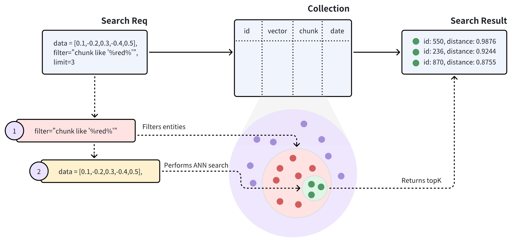

搜索请求携带`chunk like "%red%"` 作为过滤条件，表明 Milvus 应在`chunk` 字段中包含`red` 的所有实体内进行 ANN 搜索。具体来说，Milvus 会执行以下操作：

- 过滤符合搜索请求中过滤条件的实体。
- 在过滤后的实体中进行 ANN 搜索。
- 返回前 K 个实体。

#### 迭代过滤（边搜索，边过滤）

> 反复进行向量搜索，每搜出一批结果，就逐一检查是否符合标量条件，直到凑够`limit`要求的数量

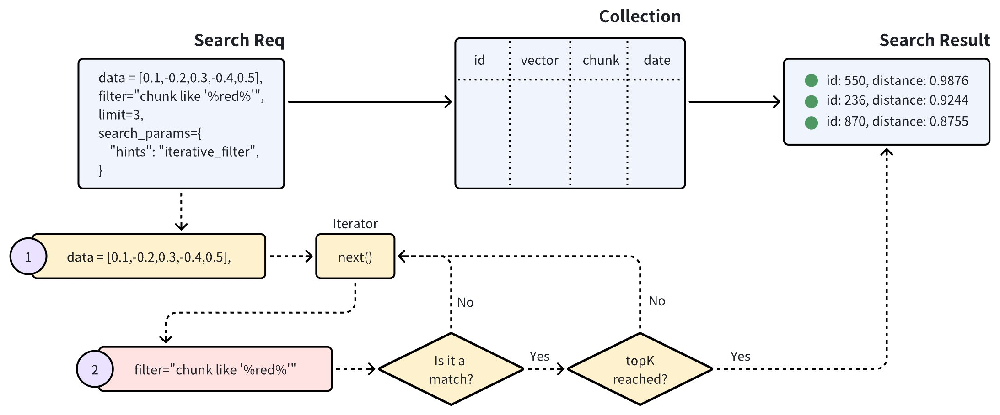

如上图所示，使用迭代过滤的搜索以迭代的方式执行向量搜索。迭代器返回的每个实体都要经过标量过滤，这个过程一直持续到达到指定的 topK 结果为止。

#### 测试代码

> 准备数据

```json
data = [
    {"id": 0, "vector": [0.3580376395471989, -0.6023495712049978, 0.18414012509913835, -0.26286205330961354, 0.9029438446296592], "color": "pink_8682", "likes": 165},
    {"id": 1, "vector": [0.19886812562848388, 0.06023560599112088, 0.6976963061752597, 0.2614474506242501, 0.838729485096104], "color": "red_7025", "likes": 25},
    {"id": 2, "vector": [0.43742130801983836, -0.5597502546264526, 0.6457887650909682, 0.7894058910881185, 0.20785793220625592], "color": "orange_6781", "likes": 764},
    {"id": 3, "vector": [0.3172005263489739, 0.9719044792798428, -0.36981146090600725, -0.4860894583077995, 0.95791889146345], "color": "pink_9298", "likes": 234},
    {"id": 4, "vector": [0.4452349528804562, -0.8757026943054742, 0.8220779437047674, 0.46406290649483184, 0.30337481143159106], "color": "red_4794", "likes": 122},
    {"id": 5, "vector": [0.985825131989184, -0.8144651566660419, 0.6299267002202009, 0.1206906911183383, -0.1446277761879955], "color": "yellow_4222", "likes": 12},
    {"id": 6, "vector": [0.8371977790571115, -0.015764369584852833, -0.31062937026679327, -0.562666951622192, -0.8984947637863987], "color": "red_9392", "likes": 58},
    {"id": 7, "vector": [-0.33445148015177995, -0.2567135004164067, 0.8987539745369246, 0.9402995886420709, 0.5378064918413052], "color": "grey_8510", "likes": 775},
    {"id": 8, "vector": [0.39524717779832685, 0.4000257286739164, -0.5890507376891594, -0.8650502298996872, -0.6140360785406336], "color": "white_9381", "likes": 876},
    {"id": 9, "vector": [0.5718280481994695, 0.24070317428066512, -0.3737913482606834, -0.06726932177492717, -0.6980531615588608], "color": "purple_4976", "likes": 765}
]

client.insert(
    collection_name="quick_setup",
    data=data
)
```

##### 标准过滤

```python
query_vector = [0.3580376395471989, -0.6023495712049978, 0.18414012509913835, -0.26286205330961354, 0.9029438446296592]

res = client.search(
    collection_name="quick_setup",
    data=[query_vector],
    limit=5,
    filter='color like "red%" and likes > 50',
    output_fields=["color", "likes"]
)

for hits in res:
    print("TopK results:")
    for hit in hits:
        print(hit)
```

> 输出：
> 
> TopK results:
> 
> {'id': 4, 'distance': 0.5975796580314636, 'entity': {'color': 'red_4794', 'likes': 122}}
> 
> {'id': 6, 'distance': -0.24996188282966614, 'entity': {'color': 'red_9392', 'likes': 58}}

##### 迭代过滤

```python
query_vector = [0.3580376395471989, -0.6023495712049978, 0.18414012509913835, -0.26286205330961354, 0.9029438446296592]

res = client.search(
    collection_name="quick_setup",
    data=[query_vector],
    limit=5,
    filter='color like "red%" and likes > 50',
    output_fields=["color", "likes"],
    search_params={
        "hints": "iterative_filter"
    }
)

for hits in res:
    print("TopK results:")
    for hit in hits:
        print(hit)
```

> 代码输出：
> 
> TopK results:
> 
> {'id': 4, 'distance': 0.5975796580314636, 'entity': {'color': 'red_4794', 'likes': 122}}
> 
> {'id': 6, 'distance': -0.24996188282966614, 'entity': {'color': 'red_9392', 'likes': 58}}

### 范围搜索

> 相似度在某个范围内的所有数据

执行范围搜索请求时，Milvus 以 ANN 搜索结果中与`查询向量最相似`的向量为圆心，以搜索请求中指定的半径为外圈半径，以range_filter为内圈半径，画出两个同心圆。所有相似度得分在这两个同心圆形成的环形区域内的向量都将被返回。这里，range_filter可以设置为0，表示将返回指定相似度得分（半径）范围内的所有实体。

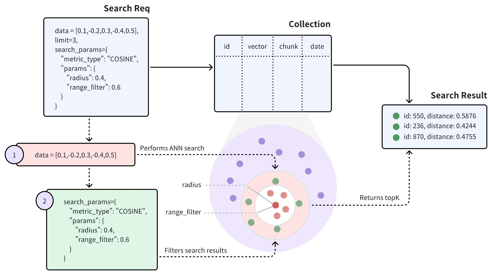

上图显示，范围搜索请求包含两个参数：**半径 和 range_filter**。收到范围搜索请求后，Milvus 会执行以下操作：

- 使用指定的度量类型（COSINE）查找与查询向量最相似的所有向量嵌入。
- 过滤与查询向量的距离或得分在半径和range_filter参数指定范围内的向量嵌入。
- 从筛选出的实体中返回前 K个实体。

#### 参数设置坑点

设置radius和range_filter的方法因搜索的度量类型而异。下表列出了在不同度量类型下设置这两个参数的要求。

| 度量类型 | 名称 | 设置半径和范围筛选器的要求 |
| --- | --- | --- |
| L2 | L2 距离越小，表示相似度越高。 | 要忽略最相似的向量 Embeddings，请确保range_filter <= 距离 <radius |
| IP | IP 距离越大，表示相似度越高。 | 要忽略最相似的向量嵌入，请确保radius < 距离 <=range_filter |
| COSINE | COSINE 距离越大，表示相似度越高。 | 要忽略最相似的向量嵌入，请确保radius < 距离 <=range_filter |
| JACCARD | Jaccard 距离越小，表示相似度越高。 | 要忽略最相似的向量嵌入，请确保range_filter <= 距离 <radius |
| HAMMING | 汉明距离越小，表示相似度越高。 | 要忽略最相似的向量嵌入，请确保range_filter <= 距离 <radius |

#### 测试代码

```bash
query_vector = [0.3580376395471989, -0.6023495712049978, 0.18414012509913835, -0.26286205330961354, 0.9029438446296592]

res = client.search(
    collection_name="quick_setup",
    data=[query_vector],
    limit=3,
    search_params={
        "params": {
            "radius": 0.4,
            "range_filter": 0.6
        }
    }
)

for hits in res:
    print("TopK results:")
    for hit in hits:
        print(hit)
```

### 分组搜索

> 对结果再分组； group_by

**假设一个 Collections 存储了多个文档（用docId 表示）**。在将文档转换成向量时，为了尽可能多地保留语义信息，每份文档都会被分割成更小的、易于管理的段落（或块），并作为单独的实体存储。即使文档被分割成较小的段落，用户通常仍希望识别哪些文档与他们的需求最相关。

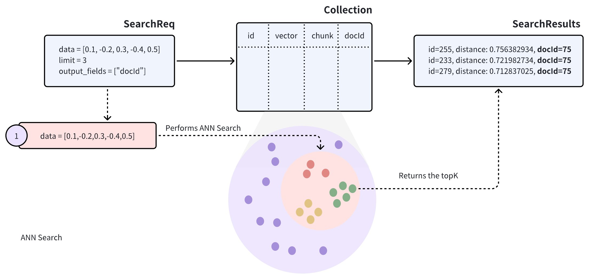

> 在对此类 Collections 执行近似近邻 (ANN) 搜索时，搜索结果可能包括同一文档中的多个段落，有可能导致其他文档被忽略，这可能与预期用例不符。

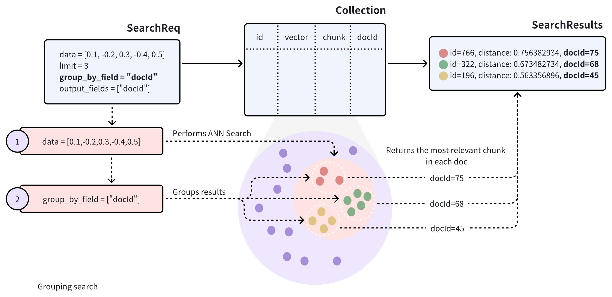

为了提高搜索结果的多样性，**可以在搜索请求中添加**`group_by_field`** 参数来启用分组搜索**。如图所示，可以将`group_by_field` 设置为`docId` 。收到此请求后，Milvus 将

- 根据提供的查询向量执行 ANN 搜索，找到与查询最相似的所有实体。
- 按指定的`group_by_field` 对搜索结果进行分组，如`docId` 。
- 根据`limit` 参数的定义，返回每个组的顶部结果，并从每个组中选出最相似的实体。

> 默认情况下，分组搜索每个组只返回一个实体。如果要增加每个组返回结果的数量，可以使用`group_size` 和`strict_group_size` 参数进行控制。

#### 测试数据

```python
from pymilvus import MilvusClient, DataType

client = MilvusClient()

client.create_collection("my_collection",
                         primary_field_name="id",
                         vector_field_name="vector",
                         dimension=5)

data = [
        {"id": 0, "vector": [0.3580376395471989, -0.6023495712049978, 0.18414012509913835, -0.26286205330961354, 0.9029438446296592], "chunk": "pink_8682", "docId": 1},
        {"id": 1, "vector": [0.19886812562848388, 0.06023560599112088, 0.6976963061752597, 0.2614474506242501, 0.838729485096104], "chunk": "red_7025", "docId": 5},
        {"id": 2, "vector": [0.43742130801983836, -0.5597502546264526, 0.6457887650909682, 0.7894058910881185, 0.20785793220625592], "chunk": "orange_6781", "docId": 2},
        {"id": 3, "vector": [0.3172005263489739, 0.9719044792798428, -0.36981146090600725, -0.4860894583077995, 0.95791889146345], "chunk": "pink_9298", "docId": 3},
        {"id": 4, "vector": [0.4452349528804562, -0.8757026943054742, 0.8220779437047674, 0.46406290649483184, 0.30337481143159106], "chunk": "red_4794", "docId": 3},
        {"id": 5, "vector": [0.985825131989184, -0.8144651566660419, 0.6299267002202009, 0.1206906911183383, -0.1446277761879955], "chunk": "yellow_4222", "docId": 4},
        {"id": 6, "vector": [0.8371977790571115, -0.015764369584852833, -0.31062937026679327, -0.562666951622192, -0.8984947637863987], "chunk": "red_9392", "docId": 1},
        {"id": 7, "vector": [-0.33445148015177995, -0.2567135004164067, 0.8987539745369246, 0.9402995886420709, 0.5378064918413052], "chunk": "grey_8510", "docId": 2},
        {"id": 8, "vector": [0.39524717779832685, 0.4000257286739164, -0.5890507376891594, -0.8650502298996872, -0.6140360785406336], "chunk": "white_9381", "docId": 5},
        {"id": 9, "vector": [0.5718280481994695, 0.24070317428066512, -0.3737913482606834, -0.06726932177492717, -0.6980531615588608], "chunk": "purple_4976", "docId": 3},
]

client.insert(
    collection_name="my_collection",
    data=data
)
print("测试数据插入完成")
```

#### 测试代码

```sql
query_vectors = [
    [0.14529211512077012, 0.9147257273453546, 0.7965055218724449, 0.7009258593102812, 0.5605206522382088]]

# Group search results
res = client.search(
    collection_name="my_collection",
    data=query_vectors,
    limit=3,
    group_by_field="docId",
    output_fields=["docId"]
)
print(res)

# Retrieve the values in the `docId` column
doc_ids = [result['entity']['docId'] for result in res[0]]
print(doc_ids)
```

#### 设置组大小

```python

res = client.search(
    collection_name="my_collection", 
    data=query_vectors, # query vector
    limit=5, # number of groups to return
    group_by_field="docId", # grouping field
    group_size=2, # p to 2 entities to return from each group
    strict_group_size=True, # return exact 2 entities from each group
    output_fields=["docId"]
)
```

在上面的示例中

- `group_size`:指定每个组要返回的实体数量。例如，设置`group_size=2` 意味着每个组（或每个`docId` ）最好返回两个最相似的段落（或块）。如果未设置`group_size` ，系统将默认为每组返回一个结果。
- `strict_group_size`:这个布尔参数控制着系统是否应严格执行`group_size` 设置的计数。当`strict_group_size=True` 时，系统将尝试在每个组中包含`group_size` 所指定的实体的确切数量（例如两个段落），除非该组中没有足够的数据。默认情况下（`strict_group_size=False` ），系统会优先满足`limit` 参数指定的组数，而不是确保每个组都包含`group_size` 实体。在数据分布不均衡的情况下，这种方法通常更有效。

### 主键搜索

> 请使用主键为1、2、4的实体中存储的向量作为查询向量，去搜索其他向量

#### 基本主键搜索

要进行基本的主键搜索，只需用主键替换查询向量即可。

```python
from pymilvus import MilvusClient, DataType

client = MilvusClient()
res = client.search(
    collection_name="quick_setup",
    anns_field="vector",
    ids=[1, 2, 4], # a list of primary keys
    limit=3,
    search_params={"metric_type": "COSINE"}
)

for hits in res:
    for hit in hits:
        print(hit)
```

> 输出：
> 
> {'id': 1, 'distance': 0.9999998807907104, 'entity': {}}
> 
> {'id': 7, 'distance': 0.7408552169799805, 'entity': {}}
> 
> {'id': 0, 'distance': 0.6290165185928345, 'entity': {}}
> 
> {'id': 2, 'distance': 1.0, 'entity': {}}
> 
> {'id': 4, 'distance': 0.9353200197219849, 'entity': {}}
> 
> {'id': 7, 'distance': 0.7733054161071777, 'entity': {}}
> 
> {'id': 4, 'distance': 1.0, 'entity': {}}
> 
> {'id': 2, 'distance': 0.9353201389312744, 'entity': {}}
> 
> {'id': 5, 'distance': 0.8381294012069702, 'entity': {}}

#### 使用主键进行过滤搜索

```python
from pymilvus import MilvusClient, DataType

client = MilvusClient()
res = client.search(
    collection_name="quick_setup",
    ids=[1, 2, 4], #
    filter='color like "red%" and likes > 50',
    output_fields=["color", "likes"],
    limit=3,
)
for hits in res:
    for hit in hits:
        print(hit)
```

#### 使用主键进行范围搜索

```python
from pymilvus import MilvusClient, DataType

client = MilvusClient()
res = client.search(
    collection_name="quick_setup",
    ids=[2, 4, 6],
    limit=3,
    search_params={
        "params": {
            "radius": 0.4,
            "range_filter": 0.6
        }
    }
)

for hits in res:
    for hit in hits:
        print(hit)
```

#### 使用主键进行分组搜索

```python
from pymilvus import MilvusClient, DataType

client = MilvusClient()
res = client.search(
    collection_name="my_collection",
    ids=[1, 2, 3],
    limit=3,
    group_by_field="docId",
    output_fields=["docId"]
)

for hits in res:
    for hit in hits:
        print(hit)
```

### 多向量**混合搜索**

> 在许多应用中，可以通过**标题**和**描述**等丰富的信息集或文本、图像和音频等**多种模式来搜索对象**。例如，如果**文本**或图片与搜索查询的**语义相符**，就可以搜索包含一段文本和一张**图片**的推文。**混合搜索****将这些不同领域的搜索结合在一起，从而增强了搜索体验**。Milvus 允许在**多个向量场****上进行搜索，同时进行多个近似近邻（ANN）搜索**，从而支持这种搜索。如果要同时搜索文本和图像、描述同一对象的多个文本字段或密集和稀疏向量以提高搜索质量，多向量混合搜索尤其有用。

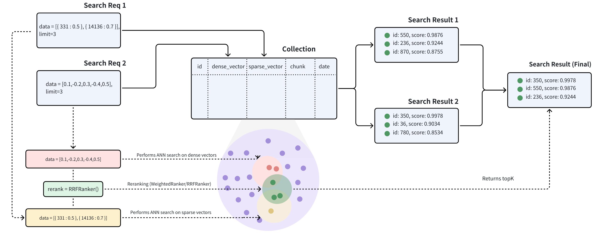

多向量混合搜索集成了不同的搜索方法或跨越了各种模态的 Embeddings：

- `稀疏-密集`**向量搜索**：
  - [<u>密集向量</u>](https://milvus.io/docs/zh/dense-vector.md)是捕捉语义关系的绝佳方法，而[<u>稀疏向量</u>](https://milvus.io/docs/zh/sparse_vector.md)则是精确匹配关键词的高效方法。混合搜索结合了这些方法，既能提供广泛的概念理解，又能提供精确的术语相关性，从而改善搜索结果。通过利用每种方法的优势，混合搜索克服了单独方法的局限性，为复杂查询提供了更好的性能。以下是结合语义搜索和全文搜索的混合检索的详细[<u>指南</u>](https://milvus.io/docs/zh/full_text_search_with_milvus.md)。
  - [<u>稀疏向量</u>](https://milvus.io/docs/zh/sparse_vector.md)<u>: 可以做</u><u>**全文检索**</u>
- **多模态向量****搜索**：多模态向量搜索是一种功能强大的技术，可以跨文本、图像、音频等各种数据类型进行搜索。这种方法的主要优势在于它能将不同的模式统一为一种无缝、连贯的搜索体验。例如，在`产品搜索`中，用户可能会输入一个文本查询来查找用文本和图像描述的产品。通过混合搜索方法将这些模式结合起来，可以提高搜索准确性或丰富搜索结果。

#### 案例

让我们考虑一个真实世界的使用案例，其中每个产品都包含文字描述和图片。

根据可用数据，我们可以进行三种类型的搜索：

- **语义文本搜索**：这涉及使用密集向量查询产品的文本描述。可以使用[<u>BERT</u>](https://zilliz.com/learn/explore-colbert-token-level-embedding-and-ranking-model-for-similarity-search?_gl=1*d243m9*_gcl_au*MjcyNTAwMzUyLjE3NDMxMzE1MjY.*_ga*MTQ3OTI4MDc5My4xNzQzMTMxNTI2*_ga_KKMVYG8YF2*MTc0NTkwODU0Mi45NC4xLjE3NDU5MDg4MzcuMC4wLjA.#A-Quick-Recap-of-BERT)和[<u>Transformers</u>](https://zilliz.com/learn/NLP-essentials-understanding-transformers-in-AI?_gl=1*d243m9*_gcl_au*MjcyNTAwMzUyLjE3NDMxMzE1MjY.*_ga*MTQ3OTI4MDc5My4xNzQzMTMxNTI2*_ga_KKMVYG8YF2*MTc0NTkwODU0Mi45NC4xLjE3NDU5MDg4MzcuMC4wLjA.)等模型或[<u>OpenAI</u>](https://zilliz.com/learn/guide-to-using-openai-text-embedding-models) 等服务生成文本嵌入。
- **全文搜索：**在这里，我们使用**稀疏向量**的**关键词匹配**来查询产品的文本描述。[<u>BM25</u>](https://zilliz.com/learn/mastering-bm25-a-deep-dive-into-the-algorithm-and-application-in-milvus)等算法或[<u>BGE-M3</u>](https://zilliz.com/learn/bge-m3-and-splade-two-machine-learning-models-for-generating-sparse-embeddings?_gl=1*1cde1oq*_gcl_au*MjcyNTAwMzUyLjE3NDMxMzE1MjY.*_ga*MTQ3OTI4MDc5My4xNzQzMTMxNTI2*_ga_KKMVYG8YF2*MTc0NTkwODU0Mi45NC4xLjE3NDU5MDg4MzcuMC4wLjA.#BGE-M3)或[<u>SPLADE</u>](https://zilliz.com/learn/bge-m3-and-splade-two-machine-learning-models-for-generating-sparse-embeddings?_gl=1*ov2die*_gcl_au*MjcyNTAwMzUyLjE3NDMxMzE1MjY.*_ga*MTQ3OTI4MDc5My4xNzQzMTMxNTI2*_ga_KKMVYG8YF2*MTc0NTkwODU0Mi45NC4xLjE3NDU5MDg4MzcuMC4wLjA.#SPLADE)等稀疏嵌入模型可用于此目的。
- **多模态图像搜索**：这种方法使用带有密集向量的文本查询对图像进行查询。可以使用` ``CLIP`` `等模型生成图像嵌入。

#### 创建具有多个向量场的 Collections

##### schema定义

- `id`:作为存储文本 ID 的主键。该字段的数据类型为`INT64` 。
- `text`:用于存储文本内容。该字段的数据类型为`VARCHAR` ，最大长度为 1000 字节。`enable_analyzer` 选项设置为`True` ，以便于全文检索。
- `text_dense`:用于存储文本的密集向量。该字段的数据类型为`FLOAT_VECTOR` ，向量维数为 768。
- `text_sparse`:用于存储文本的稀疏向量。该字段的数据类型为`SPARSE_FLOAT_VECTOR` 。
- `image_dense`:用于存储产品图像的密集向量。该字段的数据类型为`FLOAT_VETOR` ，向量维数为 512。

由于我们将使用内置的 **BM25 算法**对文本字段进行**全文检索**，因此有必要在 Schema 中添加 Milvus`Function` 。

```sql
from pymilvus import (
    MilvusClient, DataType, Function, FunctionType
)

client = MilvusClient(
)

schema = client.create_schema(auto_id=False)

schema.add_field(field_name="id", datatype=DataType.INT64, is_primary=True, description="product id")
schema.add_field(field_name="text", datatype=DataType.VARCHAR, max_length=1000, enable_analyzer=True, description="raw text of product description")
schema.add_field(field_name="text_dense", datatype=DataType.FLOAT_VECTOR, dim=768, description="text dense embedding")
schema.add_field(field_name="text_sparse", datatype=DataType.SPARSE_FLOAT_VECTOR, description="text sparse embedding auto-generated by the built-in BM25 function")
schema.add_field(field_name="image_dense", datatype=DataType.FLOAT_VECTOR, dim=512, description="image dense embedding")

bm25_function = Function(
    name="text_bm25_emb",
    input_field_names=["text"],
    output_field_names=["text_sparse"],
    function_type=FunctionType.BM25,
)
schema.add_function(bm25_function)
```

##### 创建索引

定义完 Collections Schema 后，下一步就是配置向量索引并指定相似度指标。在给出的示例中

- `text_dense_index`：为文本密集向量字段创建了`AUTOINDEX` 类型的索引，其度量类型为`IP` 。
- `text_sparse_index`：为文本稀疏向量场创建了`SPARSE_INVERTED_INDEX`类型的索引，其度量类型为`BM25` 。
- `image_dense_index`：为图像密集向量场创建了`AUTOINDEX` 类型的索引，其公制类型为`IP` 。

```python
index_params = client.prepare_index_params()

index_params.add_index(
    field_name="text_dense",
    index_name="text_dense_index",
    index_type="AUTOINDEX",
    metric_type="IP"
)

index_params.add_index(
    field_name="text_sparse",
    index_name="text_sparse_index",
    index_type="SPARSE_INVERTED_INDEX",
    metric_type="BM25",
    params={"inverted_index_algo": "DAAT_MAXSCORE"}, # or "DAAT_WAND" or "TAAT_NAIVE"
)

index_params.add_index(
    field_name="image_dense",
    index_name="image_dense_index",
    index_type="AUTOINDEX",
    metric_type="IP"
)
```

##### 创建 Collections

使用前两个步骤中配置的 Collection Schema 和索引创建名为`demo` 的 Collection。

```python

client.create_collection(
    collection_name="demo",
    schema=schema,
    index_params=index_params
)
```

##### 插入数据

- `id`代表产品 ID 的整数
- `text`：包含产品描述的字符串
- `text_dense`一个包含 768 个浮点数值的列表，表示文本描述的密集 Embeddings
- `image_dense`代表产品图片密集嵌入的 512 个浮点数值的列表

```python
import random

def generate_dense_vector(dim):
    return [random.random() for _ in range(dim)]

data=[
    {
        "id": 0,
        "text": "Red cotton t-shirt with round neck",
        "text_dense": generate_dense_vector(768),
        "image_dense": generate_dense_vector(512)
    },
    {
        "id": 1,
        "text": "Wireless noise-cancelling over-ear headphones",
        "text_dense": generate_dense_vector(768),
        "image_dense": generate_dense_vector(512)
    },
    {
        "id": 2,
        "text": "Stainless steel water bottle, 500ml",
        "text_dense": generate_dense_vector(768),
        "image_dense": generate_dense_vector(512)
    }
]

res = client.insert(
    collection_name="demo",
    data=data
)


```

#### 混合搜索

##### 步骤 1：创建多个 AnnSearchRequest 实例

混合搜索是通过在`hybrid_search()` 函数中创建多个`AnnSearchRequest` 来实现的，其中每个`AnnSearchRequest` 代表一个特定向量场的基本 ANN 搜索请求。因此，在进行混合搜索之前，有必要为每个向量场创建一个`AnnSearchRequest` 。

此外，通过在`AnnSearchRequest` 中配置`expr` 参数，可以为混合搜索设置过滤条件。

搜索请求将针对以下向量场：

- `text_dense` **语义文本搜索**，允许基于意义而非直接关键词匹配进行上下文理解和检索。
- `text_sparse`**全文搜索或关键词匹配**，侧重于文本中精确匹配的单词或短语。
- `image_dense`**多模态文本到图片搜索**，根据查询的语义内容检索相关产品图片。

> 参数`limit` 设置为 2 时，每个`AnnSearchRequest` 会返回 2 个搜索结果。在本示例中，创建了 3 个`AnnSearchRequest` 实例，总共产生了 6 个搜索结果。

```python
import random

from pymilvus import AnnSearchRequest

def generate_dense_vector(dim):
    return [random.random() for _ in range(dim)]


query_text = "white headphones, quiet and comfortable"
query_dense_vector = generate_dense_vector(768)
query_multimodal_vector = generate_dense_vector(512)

search_param_1 = {
    "data": [query_dense_vector],
    "anns_field": "text_dense",
    "param": {"nprobe": 10},
    "limit": 2
}
request_1 = AnnSearchRequest(**search_param_1)

search_param_2 = {
    "data": [query_text],
    "anns_field": "text_sparse",
    "param": {"nprobe": 10},
    "limit": 2
}
request_2 = AnnSearchRequest(**search_param_2)

search_param_3 = {
    "data": [query_multimodal_vector],
    "anns_field": "image_dense",
    "param": {"nprobe": 10},
    "limit": 2
}
request_3 = AnnSearchRequest(**search_param_3)

reqs = [request_1, request_2, request_3]
```

##### 步骤 2：配置 Rerankers 策略

要对** ANN 搜索结果集**进行`合并和重新排序`，选择适当的重新排序策略至关重要。

Milvus 提供多种重排策略。有关这些重排机制的更多详情，请参阅[<u>加权排名器</u>](https://milvus.io/docs/zh/weighted-ranker.md)或[<u>RRF 排名器</u>](https://milvus.io/docs/zh/rrf-ranker.md)。

在本例中，由于没有特别强调特定的搜索查询，我们将使用 RRFRanker 策略。

> **RRFRanker（Reciprocal Rank Fusion Ranker，互易排名融合排名器）**是 Milvus 中用于混合搜索的一种重排序策略。它的`核心思想`是：**不依赖原始相似度分数，而是根据结果在**`不同检索方式中`**的**排名位置**来重新计算综合得分（100分制）。**
> 
> 它就像一个`“民主投票”`机制：每个检索方式都把自己认为最好的结果排在前面，RRFRanker 则综合这些排名，让在多个结果集中都排名靠前的文档脱颖而出。
> 
> **RRF：小标准，**
> 
> threshold：0.7；

> **加权排名器（WeightedRanker）是 Milvus 中另一种混合搜索重排序策略**。与 RRFRanker 基于排名位置不同，WeightedRanker 基于各检索路径的归一化相似度分数进行加权求和。
> 
> 简单来说：你可以给不同的检索方式分配权重（比如给稠密向量检索 **0.7 权重**，给全文检索 **0.3 权重**），然后按加权后的分数重新排序。

```python
from pymilvus import  Function, FunctionType
ranker = Function(
    name="rrf",
    input_field_names=[], # Must be an empty list
    function_type=FunctionType.RERANK,
    params={
        "reranker": "rrf",
        "k": 100  # Optional
    }
)
```

##### 步骤 3：执行混合搜索

在启动混合搜索之前，请确保已加载 Collections。如果集合中的任何向量字段缺少索引或未加载到内存中，执行混合搜索方法时就会出错。

```python
client = MilvusClient(
)
res = client.hybrid_search(
    collection_name="demo",
    reqs=reqs,
    ranker=ranker,
    limit=2
)
for hits in res:
    print("TopK results:")
    for hit in hits:
        print(hit)
```

> 输出：
> 
> TopK results:
> 
> {'id': 1, 'distance': 0.029702968895435333, 'entity': {}}
> 
> {'id': 0, 'distance': 0.019607843831181526, 'entity': {}}

### 全文检索

【ElasticSearch：倒排索引】：复杂搜索最终还是进化到 **BM25**

**Milvus 提供由 BM25 相关性算法驱动的全文搜索**，BM25 是信息检索系统中广泛采用的评分功能，Milvus 将其集成到搜索工作流中，以提供准确的相关性排名文本结果。

Milvus 的全文搜索遵循以下工作流程：

1. **原始文本输入**：插入文本文档或使用纯文本提供查询，无需嵌入模型。
2. **文本分析**：Milvus 使用[<u>分析器</u>](https://milvus.io/docs/zh/analyzer-overview.md)将您的文本处理成可**索引**和**搜索**的有意义术语。
3. **BM25 函数处理**：一个内置函数可将这些术语转换为针对 **BM25 评分优化**的**稀疏向量**表示。
4. **Collections 存储**：Milvus 将生成的稀疏向量存储在一个 Collections 中，以便快速检索和排序。
5. **BM25 相关性评分**：在搜索时，Milvus 应用 BM25 评分函数计算文档相关性，并返回与查询词最匹配的排序结果。

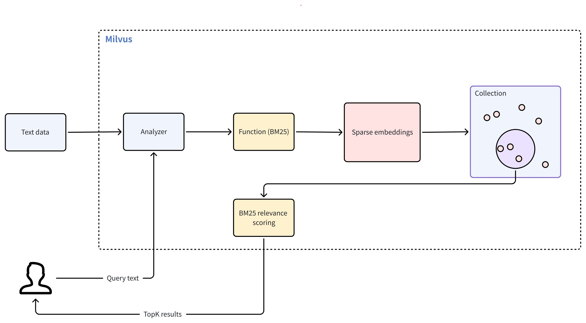

#### 创建测试数据

##### **Schema定义**

- **主字段**：唯一标识 Collections 中的每个实体。
- **文本字段(**`VARCHAR`**)**：存储原始文本文档。必须设置`enable_analyzer=True` ，以便 Milvus 处理文本，进行 BM25 相关性排序。默认情况下，Milvus 使用 `standard`[<u> 分析器</u>](https://milvus.io/docs/zh/standard-analyzer.md)进行文本分析。要配置不同的分析器，请参阅[<u>分析器概述</u>](https://milvus.io/docs/zh/analyzer-overview.md)。
- **稀疏向量场(**`SPARSE_FLOAT_VECTOR`**)**：存储由 BM25 函数自动生成的稀疏嵌入。

```python
from pymilvus import MilvusClient, DataType, Function, FunctionType

client = MilvusClient(
)

schema = client.create_schema()

schema.add_field(field_name="id", datatype=DataType.INT64, is_primary=True, auto_id=True) # Primary field
schema.add_field(field_name="text", datatype=DataType.VARCHAR, max_length=1000, enable_analyzer=True) # Text field
schema.add_field(field_name="sparse", datatype=DataType.SPARSE_FLOAT_VECTOR) # Sparse vector field; no dim required for sparse vectors
```

##### 定义BM25 函数

BM25 函数将标记化文本转换为支持 BM25 评分的稀疏向量。

```python
bm25_function = Function(
    name="text_bm25_emb", # Function name
    input_field_names=["text"], # Name of the VARCHAR field containing raw text data
    output_field_names=["sparse"], # Name of the SPARSE_FLOAT_VECTOR field reserved to store generated embeddings
    # highlight-next-line
    function_type=FunctionType.BM25, # Set to `BM25`
)

schema.add_function(bm25_function)
```

| 参数 | 参数 |
| --- | --- |
| name | 函数名称。该函数将text 字段中的原始文本转换为 BM25 兼容的稀疏向量，这些稀疏向量将存储在sparse 字段中。 |
| input_field_names | 需要将文本转换为稀疏向量的VARCHAR 字段的名称。对于FunctionType.BM25 ，该参数只接受一个字段名称。 |
| output_field_names | 存储内部生成的稀疏向量的字段名称。对于FunctionType.BM25 ，该参数只接受一个字段名称。 |
| function_type | 要使用的函数类型。必须为FunctionType.BM25 。 |

> 如果多个`VARCHAR` 字段需要 BM25 处理，则为每个字段定义一个 BM25 函数，每个函数都有唯一的名称和输出字段。

##### 配置索引

```json
index_params = client.prepare_index_params()

index_params.add_index(
    field_name="sparse",

    index_type="SPARSE_INVERTED_INDEX",
    metric_type="BM25",
    params={
        "inverted_index_algo": "DAAT_MAXSCORE",
        "bm25_k1": 1.2,
        "bm25_b": 0.75
    }

)
```

| 参数 | 说明 |
| --- | --- |
| field_name | 要索引的向量字段的名称。对于全文搜索，这应该是存储生成的稀疏向量的字段。在本示例中，将值设为sparse 。 |
| index_type | 要创建的索引类型。AUTOINDEX 允许 Milvus 自动优化索引设置。如果需要对索引设置进行更多控制，可以从 Milvus 中稀疏向量可用的各种索引类型中进行选择。更多信息，请参阅[Milvus 支持的索引](https://milvus.io/docs/zh/index.md#Indexes-supported-in-Milvus)。 |
| metric_type | 该参数的值必须设置为BM25 ，专门用于全文搜索功能。 |
| params | 特定于索引的附加参数字典。 |
| params.inverted_index_algo | 用于构建和查询索引的算法。有效值： 1. "DAAT_MAXSCORE" (默认）：使用 MaxScore 算法优化的一次文档 (DAAT) 查询处理。MaxScore 通过跳过可能影响最小的术语和文档，为高k值或包含大量术语的查询提供更好的性能。为此，它根据最大影响分值将术语划分为基本组和非基本组，并将重点放在对前 k 结果有贡献的术语上。 2. "DAAT_WAND":使用 WAND 算法优化 DAAT 查询处理。WAND 算法利用最大影响分数跳过非竞争性文档，从而评估较少的命中文档，但每次命中的开销较高。这使得 WAND 对于k值较小的查询或较短的查询更有效，因为在这些情况下跳过更可行。 3. "TAAT_NAIVE":基本术语一次查询处理（TAAT）。虽然与DAAT_MAXSCORE 和DAAT_WAND 相比速度较慢，但TAAT_NAIVE 具有独特的优势。DAAT 算法使用的是缓存的最大影响分数，无论全局 Collections 参数（avgdl）如何变化，这些分数都保持静态，而TAAT_NAIVE 不同，它能动态地适应这种变化。 |
| params.bm25_k1 | 控制词频饱和度。数值越高，术语频率在文档排名中的重要性就越大。取值范围[1.2, 2.0]. |
| params.bm25_b | 控制文档长度的标准化程度。通常使用 0 到 1 之间的值，默认值为 0.75 左右。值为 1 表示不进行长度归一化，值为 0 表示完全归一化。 |

##### 创建 collections & 插入数据

```python
client.create_collection(
    collection_name='my_demo',
    schema=schema,
    index_params=index_params
)
client.insert('my_demo', [
    {'text': 'information retrieval is a field of study.'},
    {'text': 'information retrieval focuses on finding relevant information in large datasets.'},
    {'text': 'data mining and information retrieval overlap in research.'},
])
```

#### 执行检索

```python
from pymilvus import MilvusClient, DataType, Function, FunctionType

client = MilvusClient(
)

res = client.search(
    collection_name='my_demo',
    data=['whats the focus of information retrieval?'],
    anns_field='sparse',
    output_fields=['text'], # Fields to return in search results; sparse field cannot be output
    limit=3,
)

for hits in res:
    for hit in hits:
        print(hit)
```

#### 常见问题

##### 能否在全文检索中输出或访问 BM25 函数生成的稀疏向量？

**不能**，BM25 函数生成的稀疏向量不能在全文检索中直接访问或输出。详情如下：

- BM25 函数在内部生成稀疏向量，用于排序和检索
- 这些向量存储在稀疏字段中，但不能包含在`output_fields`
- 您只能输出原始文本字段和元数据（如`id`,`text` ）。

```python
# ❌ This throws an error - you cannot output the sparse field
client.search(
    collection_name='my_collection', 
    data=['query text'],
    anns_field='sparse',
    output_fields=['text', 'sparse']  # 'sparse' causes an error
    limit=3,
    search_params=search_params
)

# ✅ This works - output text fields only
client.search(
    collection_name='my_collection', 
    data=['query text'],
    anns_field='sparse',
    output_fields=['text']
    limit=3,
    search_params=search_params
)
```

##### 既然无法访问稀疏向量场，为什么还要定义它？

稀疏向量字段作为内部搜索索引，类似于用户不直接交互的数据库索引。

设计原理：

- **关注点分离**：你处理文本（输入/输出），Milvus 处理向量（内部处理）
- **性能**：预先计算的稀疏向量可在查询时快速进行 BM25 排序
- 用户体验：将复杂的向量操作符抽象为简单的文本界面

# Milvus 进阶原理

## 度量类型（metrics_type）

> 相似度 用于衡量向量之间的相似性。选择合适的`距离度量`有助于显著提高**分类**和**聚类**性能。
> 
> https://milvus.io/docs/zh/metric.md

Milvus 支持这些类型的相似性度量：

欧氏距离 (`L2`)、内积 (`IP`)、余弦相似度 (`COSINE`)、`JACCARD`,`HAMMING` 和`BM25` （专门为稀疏向量的全文检索而设计）。

### 字段支持

| 字段类型 | 维度范围 | 支持的度量类型 | 默认度量类型 |
| --- | --- | --- | --- |
| FLOAT_VECTOR | 2-32,768 | COSINE,L2 、IP | COSINE |
| FLOAT16_VECTOR | 2-32,768 | COSINE,L2 、IP | COSINE |
| BFLOAT16_VECTOR | 2-32,768 | COSINE,L2 、IP | COSINE |
| INT8_VECTOR | 2-32,768 | COSINE,L2 、IP | COSINE |
| SPARSE\_FLOAT\_VECTOR | 无需指定维度。 | IP,BM25 （仅用于全文检索） | IP |
| BINARY_VECTOR | 8-32,768*8 | HAMMING,JACCARD 、MHJACCARD | HAMMING |

- 对于`SPARSE\_FLOAT\_VECTOR` 类型的向量场，仅在执行全文检索时使用`BM25` 类型。有关详细信息，请参阅[<u>全文搜索</u>](https://milvus.io/docs/zh/full-text-search.md)。
- 对于`BINARY_VECTOR` 类型的向量字段，维度值 (`dim`) 必须是 8 的倍数。

### 度量含义

| 度量类型 | 相似性距离值的特征 | 相似性距离值范围 |
| --- | --- | --- |
| L2 | 值越小表示相似度越高。 | [0, ∞) |
| IP | 值越大，表示相似度越高。 | [-1, 1] |
| COSINE | 数值越大，表示相似度越高。 | [-1, 1] |
| JACCARD | 值越小，表示相似度越高。 | [0, 1] |
| MHJACCARD | 根据 MinHash 签名位估算 Jaccard 相似度；距离越小 = 越相似 | [0, 1] |
| HAMMING | 值越小表示相似度越高。 | [0，dim(向量) |
| BM25 | 根据术语频率、反转文档频率和文档规范化对相关性进行评分。 | [0, ∞) |

## 不同索引

| 索引名称 | 全称 | 核心原理 | 速度 | 内存占用 | 精度 | 主要适用场景 |
| --- | --- | --- | --- | --- | --- | --- |
| IVF_FLAT | 倒排文件-原始向量 | 聚类 + 暴力搜索 | 中等 | 高 | 最高 | 数据量适中、追求精度 |
| IVF_SQ8 | 倒排文件-标量量化 | IVF聚类 + 标量量化压缩 | 中等 | 中 | 较高 | 内存有限、精度要求高 |
| IVF_PQ | 倒排文件-乘积量化 | IVF聚类 + 乘积量化压缩 | 中等 | 极低 | 可控（可调） | 超大规模（亿级）、内存极度受限 |
| IVF_RABITQ | 倒排文件-RaBitQ量化 | IVF + 极低比特量化 | 中等 | 极低 | 较高 | 极低内存、追求高精度/压缩比 |
| HNSW | 分层可导航小世界 | 多层图结构 + 贪心搜索 | 极快 | 极高 | 最高 | 延迟敏感、追求速度、内存充足 |
| HNSW_SQ | HNSW-标量量化 | HNSW图 + 标量量化 | 快 | 中 | 较高 | 平衡速度与内存 |
| HNSW_PQ | HNSW-乘积量化 | HNSW图 + 乘积量化 | 快 | 低 | 中等 | 大内存限制下的速度优化 |
| HNSW_PRQ | HNSW-乘积残差量化 | HNSW图 + 乘积残差量化 | 快 | 低 | 较高 | 高压缩比下的精度优化 |
| DISKANN | 磁盘图索引 | 基于SSD的图索引 | 较快 | 极低（内存） | 较高 | 单机内存不足、利用磁盘 |
| SCANN | 可扩展最近邻 | 量化 + 维度重排 + SIMD加速 | 快 | 低 | 较高 | CPU高吞吐、平衡内存与速度 |
| AISAQ | 自适应索引分片 | 自适应分片 + 非对称量化 | 快 | 低 | 较高 | 分布式、数据分布不均匀 |
| GPU_CAGRA | CUDA加速图索引 | 针对GPU优化的图结构 | 极快 | 高（显存） | 最高 | 极低延迟、高吞吐、依赖GPU |
| GPU_IVF_FLAT | GPU-倒排文件-原始 | GPU并行计算IVF_FLAT | 快 | 高（显存） | 最高 | GPU环境下、追求精度 |
| GPU_IVF_PQ | GPU-倒排文件-乘积量化 | GPU并行计算IVF_PQ | 快 | 中（显存） | 较高 | GPU环境下、节省显存 |
| GPU_BRUT_FORCE | GPU-暴力搜索 | 全量距离计算 | 慢（但GPU并行） | 高（显存） | 最高 | 数据量小（<10万）、追求绝对精度 |

## 一致性策略

> Milvus 提供了**四种可调的一致性级别**，让你能根据业务场景在数据一致性和查询性能之间进行灵活权衡。默认使用的是 Bounded（有界一致性）级别

| 级别 | 核心机制 | 适用场景 | 特点 |
| --- | --- | --- | --- |
| Strong（强） | 保证查询能看到所有已写入的最新数据 | 对数据准确性要求极高的场景，如订单支付、财务系统、功能测试 | 一致性最高，但查询延迟也最大(TSO) |
| Bounded （有界） | 允许数据在一定时间范围内存在不一致，但保证不会读到过于陈旧的数据 | 需要在一致性和延迟间取得平衡，如视频/商品推荐系统 | 默认级别，提供可控的延迟，可容忍短暂的数据不一致 |
| Session（会话） | 保证同一个客户端（会话）写入的数据，能立即被自己读到 | 同一会话内需要即时看到自己操作的场景，如图书管理系统中删除一条记录后刷新页面 | 保证了自身操作的可见性，性能优于强一致性 |
| Eventually（最终） | 不保证立即读到最新数据，所有副本数据最终会达成一致 | 对数据实时性要求不高，但追求极致的查询速度和高吞吐量，如获取商品评论、评分 | 一致性最弱，但查询延迟最低、性能最好 |

## 核心流程

> Dim = 1024； 1024维度的数据有 1w，分成 nlist=128 个小聚类，每次搜 nprob = 10 个聚类

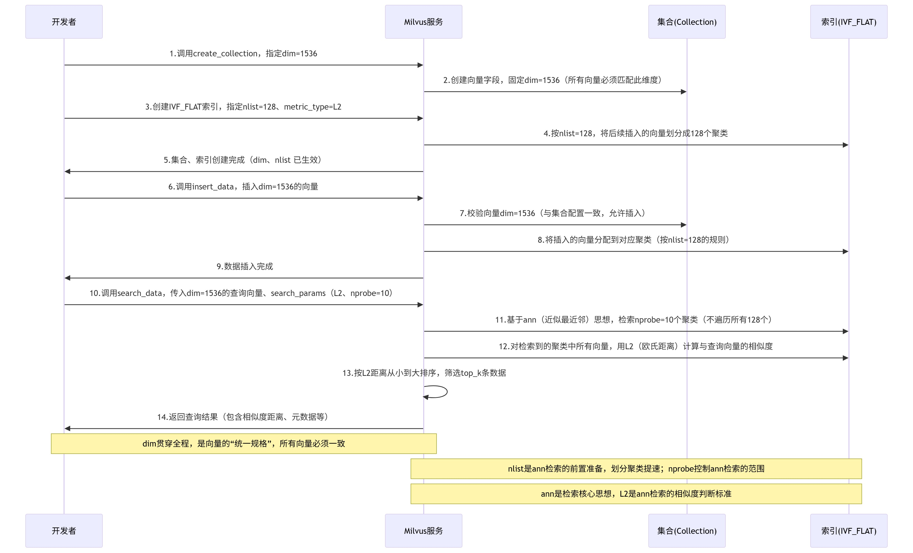

## Milvus 支持的搜索类型

Milvus 支持各种类型的搜索功能，以满足不同用例的需求：

- [<u>ANN 搜索</u>](https://milvus.io/docs/zh/single-vector-search.md#Basic-search)：查找最接近查询向量的前 K 个向量。
- [<u>过滤搜索</u>](https://milvus.io/docs/zh/single-vector-search.md#Filtered-search)：在指定的过滤条件下执行 ANN 搜索。
- [<u>范围搜索</u>](https://milvus.io/docs/zh/single-vector-search.md#Range-search)：查找查询向量指定半径范围内的向量。
- [<u>混合搜索</u>](https://milvus.io/docs/zh/multi-vector-search.md)：基于多个向量场进行 ANN 搜索。
- [<u>全文搜索</u>](https://milvus.io/docs/zh/full-text-search.md)：基于 BM25 的全文搜索。
- [<u>Rerankers</u>](https://milvus.io/docs/zh/weighted-ranker.md)：根据附加标准或辅助算法调整搜索结果顺序，完善初始 ANN 搜索结果。
- [<u>获取</u>](https://milvus.io/docs/zh/get-and-scalar-query.md#Get-Entities-by-ID)：根据主键检索数据。
- [<u>查询</u>](https://milvus.io/docs/zh/get-and-scalar-query.md#Use-Basic-Operators)使用特定表达式检索数据。

## 优化

### 如何为 IVF 索引设置`nlist` 和`nprobe` ？

设置`nlist` 需要根据具体情况而定。

1. 根据经验，`nlist` 的推荐值是`4 × sqrt(n)` ，其中`n` 是段中实体的总数。
2. 每个段的大小由`datacoord.segment.maxSize` 参数决定，默认设置为 512 MB。将`datacoord.segment.maxSize` 除以每个实体的大小，即可估算出数据段 n 中实体的总数。
3. `nprobe` 的设置取决于数据集和场景，需要在**准确性**和**查询性能**之间进行权衡。

<u>**我们建议通过反复试验找到理想值。**</u>

### 哪些因素会影响 CPU 占用率？

当 Milvus 正在建立索引或运行查询时，CPU 使用率会增加。

一般来说，除了使用 Annoy（在单线程上运行）外，索引构建都是 CPU 密集型工作。

运行查询时，CPU 使用率受`nq`（n-query） 和`nprobe` 的影响。

当`nq` 和`nprobe` 较小时，并发量较低，CPU 占用率也较低。

### 同时插入数据和搜索会影响查询性能吗？

插入操作不占用 CPU。但是，由于**新的数据段**可能还没有达到**建立索引的阈值**，Milvus 会采用**暴力搜索**，这将严重影响查询性能。

`rootcoord.minSegmentSizeToEnableIndex` 参数决定了段的索引建立阈值，默认设置为 1024 行。更多信息请参阅[<u>系统配置</u>](https://milvus.io/docs/zh/system_configuration.md)。

### 为 VARCHAR 字段建立索引能否提高删除速度？

为 VARCHAR 字段**建立索引**可以加快 "**按表达式删除** "操作的速度，但仅限于特定条件下：

- 反转索引：该索引有助于非主键 VARCHAR 字段上的`IN` 或`==` 表达式。
- Trie 索引：该索引有助于对非主键 VARCHAR 字段进行前缀查询（如`LIKE prefix%` ）。

不过，**为 VARCHAR 字段建立索引不会加快速度**：

- **按 ID 删除**：当 VARCHAR 字段是主键时。
- **不相关的表达式**：当 VARCHAR 字段不是删除表达式的一部分时。