# 6. 手搓：Modular RAG（LlamaIndex 版）

# 基本思路

## 技术

- **框架**: LlamaIndex
- **LLM**: OpenAI LIKE API 对接的其他 llm 模型
- **向量数据库**: Milvus
- **Embedding**: OpenAI LIKE API 对接的其他嵌入模型（text-embedding-v3）
- **重排序**: OpenAI LIKE API 对接的其他 reranker 模型

> - **Qwen3.5**：https://modelscope.cn/collections/Qwen/Qwen35
> - **Qwen3-Embedding**：https://modelscope.cn/collections/Qwen3-Embedding-3edc3762d50f48
> - **Qwen3-Reranker**：https://modelscope.cn/collections/Qwen3-Reranker-6316e71b146c4f

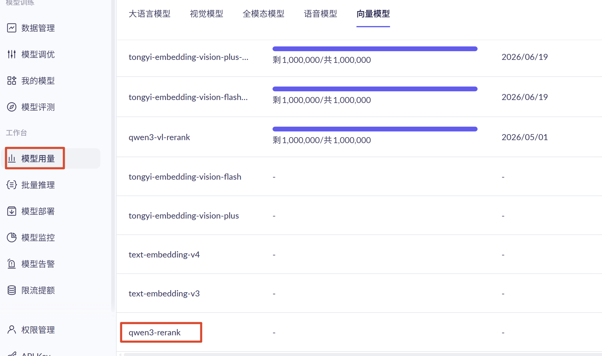

## 架构

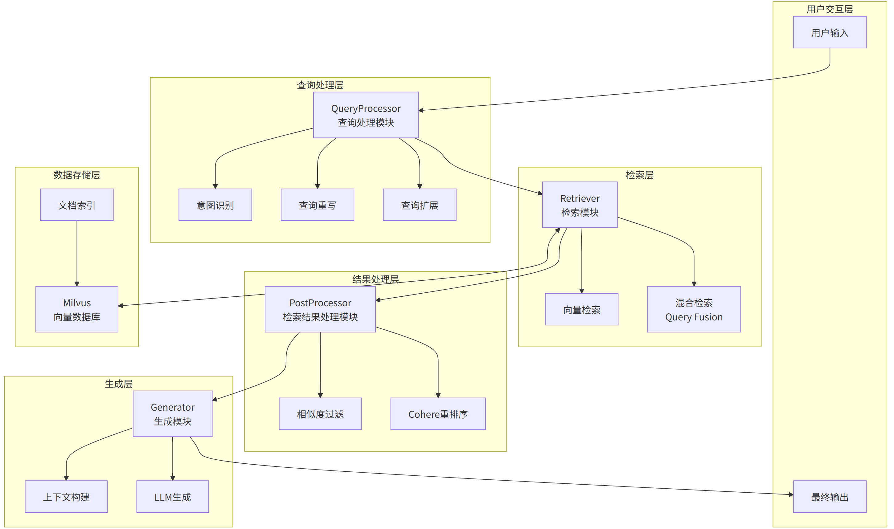

## 模块

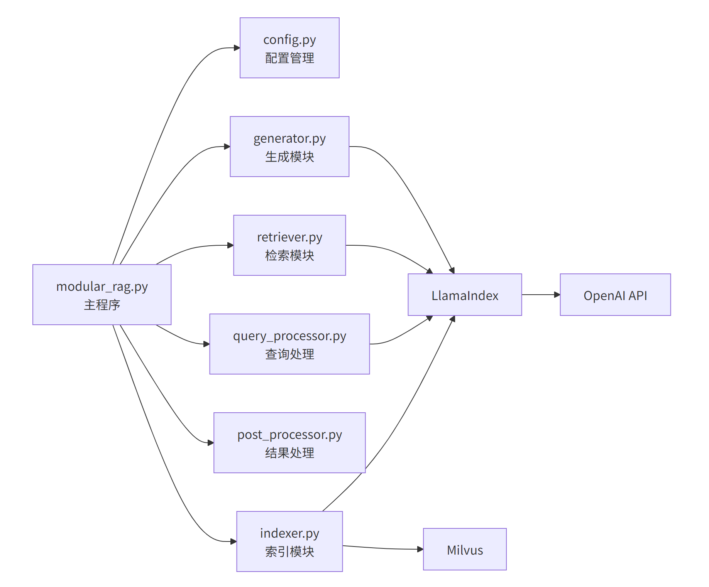

## 全景图

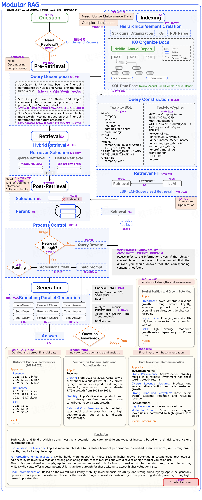

## 流程

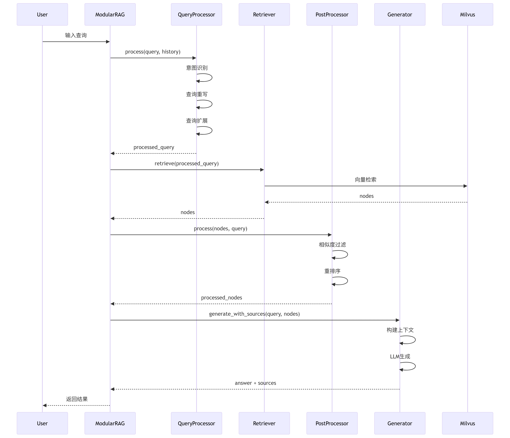

# 代码实战

## 安装依赖

```shell
pip install llama-index llama-index-readers-file unstructured
pip install llama-parse nest-asyncio python-multipart "unstructured[md]"
pip install llama-index-vector-stores-milvus 
pip install llama-index-embeddings-openai-like
pip install llama-index-llms-openai-like
pip install llama-index-postprocessor-dashscope-rerank
pip install dashscope python-dotenv pymilvus

```

## 环境变量

创建 `.env` 文件

```properties
BASE_URL_CHAT=https://dashscope.aliyuncs.com/compatible-mode/v1
BASE_URL_RESPONSE=https://dashscope.aliyuncs.com/api/v2/apps/protocols/compatible-mode/v1
BASE_URL=http://localhost:11434/v1
API_KEY=sk-ccd167dc0a7e446e8f5f0f8d45c31a78
LLM_MODEL=qwen3.5-flash
EMBEDDING_MODEL=text-embedding-v3
RERANK_MODEL=qwen3-rerank

MILVUS_URI=http://localhost:19530
MILVUS_COLLECTION_NAME=modular_rag_docs
MILVUS_DIM=1024
```

## 配置类：`config.py`

创建` config.py `文件

```c++
import os
from dotenv import load_dotenv

load_dotenv()

class Config:
    API_KEY = os.getenv("API_KEY")
    BASE_URL = os.getenv("BASE_URL_CHAT", "https://api.openai.com/v1")

    EMBEDDING_MODEL = os.getenv("EMBEDDING_MODEL", "text-embedding-3-small")
    LLM_MODEL = os.getenv("LLM_MODEL", "qwen3.5-plus")
    RERANK_MODEL = os.getenv("RERANK_MODEL","qwen3-rerank")

    MILVUS_URI = os.getenv("MILVUS_URI", "http://localhost:19530")
    MILVUS_COLLECTION_NAME = os.getenv("MILVUS_COLLECTION_NAME", "modular_rag_docs")
    MILVUS_DIM = os.getenv("MILVUS_DIM", "1024")

    CHUNK_SIZE = 1024
    CHUNK_OVERLAP = 200
    TOP_K = 10
    RERANK_TOP_N = 5
```

## 离线：索引模块：indexer.py

```python
from llama_index.core import  VectorStoreIndex, StorageContext, Settings, Document
from llama_index.core.node_parser import SentenceSplitter, SentenceWindowNodeParser, MarkdownNodeParser
from llama_index.core.schema import BaseNode
from llama_index.embeddings.openai_like import OpenAILikeEmbedding
from llama_index.llms.openai_like import OpenAILike
from llama_index.readers.file import UnstructuredReader
from llama_index.vector_stores.milvus import MilvusVectorStore
from rag.config import Config


class Indexer:
    def __init__(self):
        Settings.llm = OpenAILike(
            model=Config.LLM_MODEL,
            api_key=Config.API_KEY,
            api_base=Config.BASE_URL,
            is_chat_model=True,
            is_function_calling_model=True,
            timeout=300
        )
        Settings.embed_model = OpenAILikeEmbedding(
            model_name=Config.EMBEDDING_MODEL,
            api_key=Config.API_KEY,
            api_base=Config.BASE_URL,
            timeout=300
        )
        self.vector_store = MilvusVectorStore(
            uri=Config.MILVUS_URI,
            collection_name=Config.MILVUS_COLLECTION_NAME,
            dim=Config.MILVUS_DIM
        )
        self.storage_context = StorageContext.from_defaults(vector_store=self.vector_store)

    def load_documents(self, file: str) -> list[Document]:
        reader = UnstructuredReader()
        return reader.load_data(file=file,split_documents=False)

    def split_documents(self, documents: list[Document]) -> list[BaseNode]:

        # 语义拆分器
        parser = SentenceSplitter(
            chunk_size=Config.CHUNK_SIZE,
            chunk_overlap=Config.CHUNK_OVERLAP
        )

        # 语义窗口拆分器
        window_parser = SentenceWindowNodeParser(
            sentence_splitter=parser,
            window_size=3,
            window_metadata_key="window",
            original_text_metadata_key="original_text",
            include_metadata=True,
            include_prev_next_rel=True,
        )

        # markdown 拆分器； 测试各种拆分器的用法
        return MarkdownNodeParser().get_nodes_from_documents(documents=documents,show_progress=True)

    def build_index(self, nodes):
        index = VectorStoreIndex(
            nodes,
            storage_context=self.storage_context,
            show_progress=True
        )
        return index

    def index_documents(self, directory: str):
        print(f"😄从 {directory} 中加载文档...")
        documents = self.load_documents(directory)
        print(f"👌已加载 {len(documents)} 个文档")

        print("🔓开始将文档拆分成段落...")
        nodes = self.split_documents(documents)
        print(f"👌已拆分成 {len(nodes)} 个段落")

        print("📚开始构建索引...")
        index = self.build_index(nodes)
        print("👌索引构建完成!")


        return index

    def load_existing_index(self) -> VectorStoreIndex:
        return VectorStoreIndex.from_vector_store(
            self.vector_store,
            storage_context=self.storage_context
        )
```

## 实时：查询前处理：`query_processor.py`

### 职责

- **用户意图识别(问题分类)：再后来配合 touter 路由，把问题派发给指定 Agent**
  - `factual` - 事实性问题
  - `explanatory` - 解释说明类
  - `comparative` - 比较类问题
  - `creative` - 创造性回答
  - `conversational` - 日常对话
- 客服系统
  - 售后
  - 售前
  - 其他
- 查询重写（考虑对话历史： 把**这个**电脑内存有多大。 换成 **苹果**电脑内存有多大）
- 查询扩展：生成多个子问题

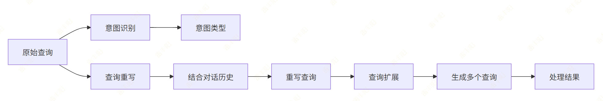

### 代码

```python
from llama_index.core import Settings
from llama_index.llms.openai_like import OpenAILike
from config import Config
from typing import List, Dict


class QueryProcessor:
    def __init__(self):
        self.llm = OpenAILike(
            model=Config.LLM_MODEL,
            api_key=Config.API_KEY,
            api_base=Config.BASE_URL,
            is_chat_model=True,
            is_function_calling_model=True
        )

    def recognize_intent(self, query: str) -> str:
        prompt = f"""分析以下用户查询的意图，从以下选项中选择一个最合适的：
- factual: 事实性问题，需要准确答案
- explanatory: 需要解释或说明的问题
- comparative: 比较性问题
- creative: 需要创造性回答的问题
- conversational: 日常对话或闲聊

查询: {query}

只返回意图类型，不要其他内容："""

        response = self.llm.complete(prompt)
        return response.text.strip().lower()

    def rewrite_query(self, query: str, history: List[Dict] = None) -> str:
        if not history or len(history) == 0:
            return query

        history_context = "\n".join([
            f"用户: {msg['content']}" if msg['role'] == 'user' else f"助手: {msg['content']}"
            for msg in history[-3:]
        ])

        prompt = f"""根据以下对话历史，将当前用户查询重写为更完整、更明确的查询。

对话历史：
{history_context}

当前查询: {query}

重写后的查询（只返回查询内容）："""

        response = self.llm.complete(prompt)
        return response.text.strip()

    def expand_query(self, query: str) -> List[str]:
        prompt = f"""为以下查询生成 3 个相关的扩展查询，以提高检索的全面性。

原查询: {query}

每行一个扩展查询，不要编号："""

        response = self.llm.complete(prompt)
        expanded = [line.strip() for line in response.text.strip().split('\n') if line.strip()]
        return [query] + expanded[:3]

    def process(self, query: str, history: List[Dict] = None) -> Dict:
        # 识别意图
        intent = self.recognize_intent(query)
        print(f"👌意图识别完成，结果：{intent}")
        # 重写查询
        rewritten = self.rewrite_query(query, history)
        print(f"✏️查询重写完成，结果：{rewritten}")
        # 扩展查询
        expanded = self.expand_query(rewritten)
        print(f"🔍扩展查询完成，结果：{expanded}")

        return {
            "original": query,
            "rewritten": rewritten,
            "expanded": expanded,
            "intent": intent
        }

def test():
    processed_query = QueryProcessor().process("介绍下辰光Agent平台")
    print(f"⬇️处理后的查询：\n {processed_query}")
```

## 实时：检索模块：`retriver.py`

### 职责

- 向量相似度检索
- Query Fusion 混合检索

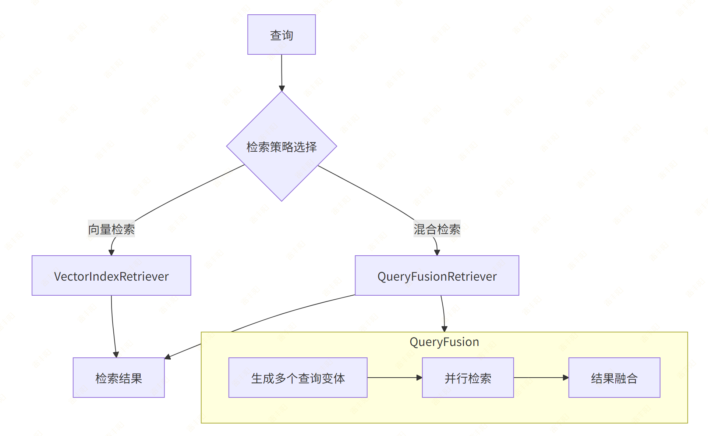

### 代码

```python
from llama_index.core import VectorStoreIndex, Settings
from llama_index.core.retrievers import VectorIndexRetriever, QueryFusionRetriever
from llama_index.core.query_engine import RetrieverQueryEngine
from config import Config
from typing import List, Dict

class Retriever:
    def __init__(self, index: VectorStoreIndex):
        self.index = index
        self.vector_retriever = VectorIndexRetriever(
            index=index,
            similarity_top_k=Config.TOP_K
        )

    def vector_search(self, query: str):
        return self.vector_retriever.retrieve(query)

    def hybrid_search(self, query: str):
        query_fusion_retriever = QueryFusionRetriever(
            [self.vector_retriever],
            similarity_top_k=Config.TOP_K,
            num_queries=3,
            use_async=True,
            verbose=True
        )
        return query_fusion_retriever.retrieve(query)

    def retrieve(self, processed_query: Dict, use_hybrid: bool = True):
        if use_hybrid:
            return self.hybrid_search(processed_query["rewritten"])
        else:
            return self.vector_search(processed_query["rewritten"])

```

> 功能测试

```python
def test():
    from rag.indexer import Indexer
    # 加载已存在的索引
    index = Indexer().load_existing_index()
    print(f"👌已加载索引： {index.index_id}")

    # 创建检索器
    retriever = Retriever(index)
    results = retriever.retrieve({"rewritten": "介绍下辰光Agent平台"},use_hybrid=True)
    print(f"🌏检索结果： {results}")


test()
```

## 实时：结果处理模块：`post_processor.py`

### 职责

- **相似度阈值过滤**
- 重排序（可选）

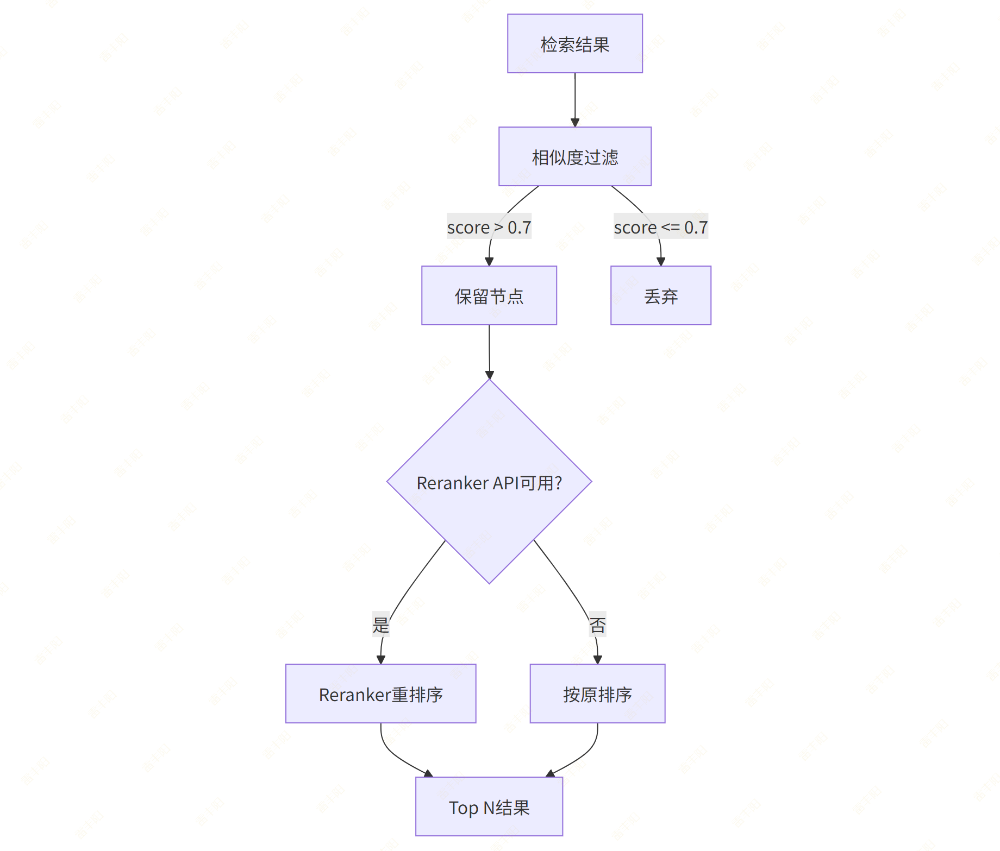

### 代码

```python
from llama_index.core.postprocessor import SimilarityPostprocessor
from llama_index.core.schema import NodeWithScore
from llama_index.postprocessor.dashscope_rerank import DashScopeRerank

from config import Config
from typing import List

class PostProcessor:
    def __init__(self):
        self.similarity_filter = SimilarityPostprocessor(similarity_cutoff=0.7)
        self.reranker = None
        if Config.API_KEY:
            try:
                self.reranker = DashScopeRerank(
                    api_key=Config.API_KEY,
                    top_n=Config.RERANK_TOP_N,
                    model=Config.RERANK_MODEL,
                )
            except Exception as e:
                print(f"❌️ DashScope reranker模型:{Config.RERANK_MODEL} 初始化失败: {e}")

    def filter_low_similarity(self, nodes) -> List[NodeWithScore]:
        return self.similarity_filter.postprocess_nodes(nodes)

    def rerank(self, nodes, query: str) -> List[NodeWithScore]:
        if self.reranker:
            return self.reranker.postprocess_nodes(nodes, query_str=query)
        return nodes[:Config.RERANK_TOP_N]

    def process(self, nodes, query: str) -> List[NodeWithScore]:
        filtered = self.filter_low_similarity(nodes)
        reranked = self.rerank(filtered, query)
        return reranked
```

## 实时：生成模型：`generator.py`

### 职责

- **上下文构建**
- **LLM 答案生成**
- **源文档引用**

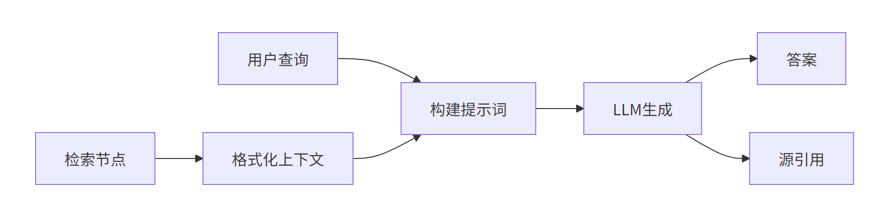

### 代码

```python
from llama_index.core import Settings
from llama_index.llms.openai_like import OpenAILike
from llama_index.core.prompts import PromptTemplate
from config import Config
from typing import List, Dict

QA_PROMPT_TEMPLATE = """你是一个专业的问答助手。请根据以下上下文信息来回答用户的问题。

上下文信息：
{context_str}

用户问题：{query_str}

请根据上下文信息回答问题。如果上下文中没有相关信息，请如实说明，不要编造答案。

回答："""


class Generator:
    def __init__(self):
        self.llm = OpenAILike(
            model=Config.LLM_MODEL,
            api_key=Config.API_KEY,
            api_base=Config.BASE_URL,
            is_chat_model=True,
            is_function_calling_model=True,
            temperature=0.7
        )
        self.qa_prompt = PromptTemplate(QA_PROMPT_TEMPLATE)

    def build_context(self, nodes) -> str:
        context_parts = []
        for i, node in enumerate(nodes, 1):
            context_parts.append(f"[文档 {i}]\n{node.text}\n")
        return "\n".join(context_parts)

    def generate(self, query: str, nodes, stream: bool = False):
        context_str = self.build_context(nodes)
        prompt = self.qa_prompt.format(
            context_str=context_str,
            query_str=query
        )

        if stream:
            return self.llm.stream_complete(prompt)
        else:
            response = self.llm.complete(prompt)
            return response.text

    # 构建答案和检索文档来源
    def generate_with_sources(self, query: str, nodes):
        answer = self.generate(query, nodes)
        sources = []
        for i, node in enumerate(nodes, 1):
            sources.append({
                "id": i,
                "content": node.text[:200] + "..." if len(node.text) > 200 else node.text,
                "score": node.score,
                "metadata": node.metadata
            })
        return {
            "answer": answer,
            "sources": sources
        }
```

## Modular RAG 封装：`modular_rag.py`

```python
import os

from rag.indexer import Indexer
from rag.query_processor import QueryProcessor
from rag.retriver import Retriever
from rag.post_processor import PostProcessor
from rag.generator import Generator


class ModularRAG:
    def __init__(self):
        self.indexer = Indexer()
        self.query_processor = QueryProcessor()
        self.post_processor = PostProcessor()
        self.generator = Generator()

        # 尝试加载已有索引
        try:
            self.index = self.indexer.load_existing_index()
            self.retriever = Retriever(self.index)
        except Exception as e:
            print(f"⚠️ 未能加载已有索引 (可能还未建立): {e}")
            self.index = None
            self.retriever = None

    def load(self, file_path: str):
        """加载文档并构建索引"""
        self.index = self.indexer.index_documents(file_path)
        self.retriever = Retriever(self.index)

    def query(self, query_str: str, history: list = None):
        """处理查询并生成回答"""
        if not self.retriever:
            return {"answer": "请先加载文档构建索引！", "sources": []}

        print("\n[1/4] 开始处理查询...")
        processed_query = self.query_processor.process(query_str, history)

        print("[2/4] 开始检索文档...")
        nodes = self.retriever.retrieve(processed_query)

        print("[3/4] 开始后处理(重排/过滤)...")
        processed_nodes = self.post_processor.process(nodes, processed_query["rewritten"])

        print("[4/4] 开始生成回答...")
        response = self.generator.generate_with_sources(processed_query["rewritten"], processed_nodes)
        return response
```

## 测试：`rag_test.py`

```python
from rag.modular_rag import ModularRAG

if __name__ == "__main__":
    print("初始化 RAG 系统中，请稍候...")
    rag = ModularRAG()
    history = []

    print("\n🤔你好，我是你的项目小帮手，你可以向我提问，我会尽力回答。")
    while True:
        print("\n=== 菜单 ===")
        print("1：加载文档/目录")
        print("2：查询问题")
        print("3：退出")
        choice = input("请选择操作 (1/2/3): ").strip()

        if choice == "1":
            file_path = input("请输入要加载的文档或目录路径: ").strip()
            if os.path.exists(file_path):
                try:
                    rag.load(file_path)
                    print("✅ 文档加载并建立索引成功！")
                except Exception as e:
                    print(f"❌ 加载文档失败: {e}")
            else:
                print("❌ 路径不存在，请检查后重试。")

        elif choice == "2":
            if not rag.retriever:
                print("⚠️ 请先加载文档(选项1)！")
                continue

            query_str = input("请输入您的问题: ").strip()
            if not query_str:
                continue

            try:
                result = rag.query(query_str, history)
                print("\n" + "=" * 50)
                print(f"🤖 回答: {result['answer']}")
                print("=" * 50)
                print("📚 参考来源:")
                for source in result.get("sources", []):
                    # 获取前50个字符作为摘要
                    content_preview = str(source.get('content', '')).replace('\n', ' ')[:50]
                    score = source.get('score', 0)
                    print(f"  - [{source.get('id', '?')}] {content_preview}... (相关度: {score:.4f})")
                print("=" * 50)

                # 记录对话历史，保留最近的几轮即可
                history.append({"role": "user", "content": query_str})
                history.append({"role": "assistant", "content": result['answer']})
                if len(history) > 6:  # 保留最近3轮对话
                    history = history[-6:]
            except Exception as e:
                print(f"❌ 查询失败: {e}")

        elif choice == "3":
            print("👋 再见！")
            break

        else:
            print("⚠️ 无效的选择，请重新输入。")
```

## 一些细节

### 分块器

> 快速选择参考表

| 文档类型 | 推荐切分器 | 理由 |
| --- | --- | --- |
| 通用 Markdown | MarkdownNodeParser ⭐ | 保持结构和代码块 |
| 技术文档（含代码） | MarkdownNodeParser | 保护代码块 |
| 纯代码文件 | CodeSplitter ⭐ | 按语法结构分块 |
| 一般文本 | SentenceSplitter | 简单高效 |
| 需要高准确率 | SentenceWindowNodeParser | 上下文完整 |
| 超长文档/书籍 | HierarchicalNodeParser | 多层次分块 |
| 追求最高质量 | SemanticSplitterNodeParser | 语义感知 |
| HTML 网页 | HTMLNodeParser | 解析 HTML 结构 |
| JSON 数据 | JSONNodeParser | 处理 JSON 结构 |

#### SentenceWindowNodeParser（句子窗口） ⭐ 推荐用于高准确率

**适用场景：** 需要高准确率、长文档、复杂问题

**特点：**

- ✅ 每个 chunk 以一个句子为中心
- ✅ 中心句子前后包含若干句子（窗口）
- ✅ 保留更完整的上下文信息
- ✅ 检索更准确

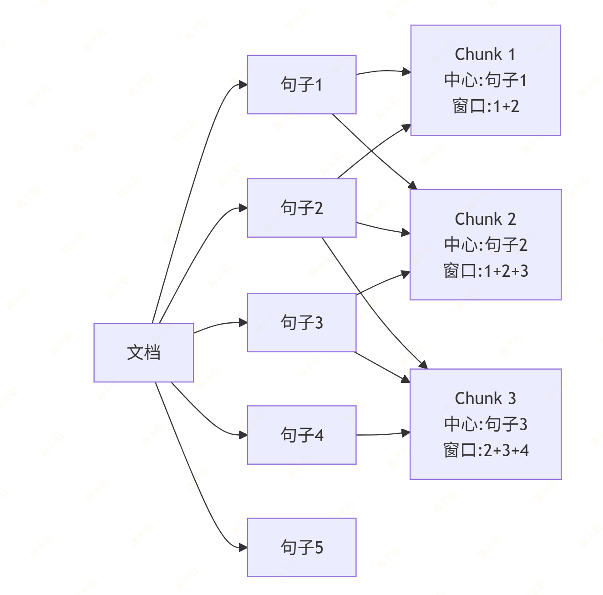

#### HierarchicalNodeParser（层级节点）⭐ 推荐用于长文档

**适用场景：** 超长文档、书籍、论文

**特点：**

- ✅ 多层次分块（如：段落 → 章节 → 全文）
- ✅ 支持不同层级的检索
- ✅ 适合处理很长的文档

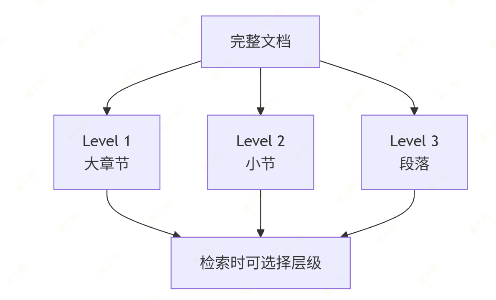

#### SemanticSplitterNodeParser（语义化切分）⭐ 最智能

**适用场景：** 需要语义感知、高准确率场景

**特点：**

- ✅ 使用 Embedding 模型检测语义边界
- ✅ 在语义变化处分割
- ✅ 最智能的分块方式
- ⚠️ 计算成本较高（需要多次调用 Embedding）

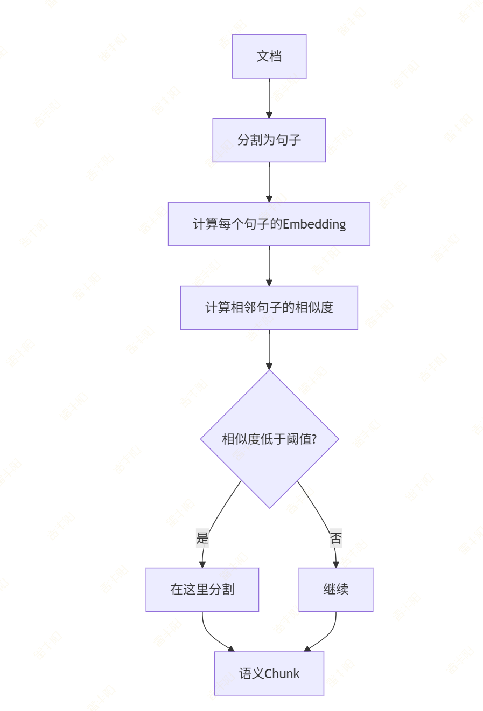

### 存储上下文：StorageContext

| 优先级 | 参数 | 使用场景 | 作用 |
| --- | --- | --- | --- |
| ⭐⭐⭐ | vector_store | 几乎所有生产环境都需要 | 向量检索 |
| ⭐⭐ | persist_dir | 开发、测试环境常用 | 不安装中间件，本地测试 |
| ⭐ | docstore | 需要持久化文档内容 | 使用 MongoDB 存储文档，Milvus 存储向量 |
| ⭐ | index_store | 需要持久化索引元数据 | 用于存储索引的元数据（如索引结构、配置等） |
| 🔵 | graph_store | 知识图谱场景 | 如：neo4j |
| 🔵 | image_store | 多模态场景 | 多模态 RAG、图像问答、图文混合检索 |
| 🔵 | fs | 云存储场景 | 如：使用 S3 持久化，Pinecone 作为向量数据库 |

### 检索前后处理

**检索前**：查询重写、查询扩展、意图识别...

**检索**：多路召回...

**检索后**：结果去重、加权融合（例如 rewritten 权重高于 expanded）

### `QueryFusionRetriever`** **

**工作原理**：

1. **接收原始查询**：获取用户输入的查询
2. **生成扩展查询**：使用内部的查询扩展机制，基于原始查询生成多个不同角度的查询变体（这里是3个）
3. **并行检索**：使用这些扩展查询并行地从向量数据库中检索相关文档
4. **结果融合**：将多个查询的检索结果进行融合，产生最终的检索结果

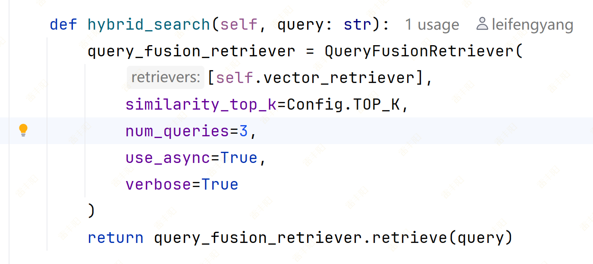

`num_queries=3`** 的具体作用**：

- 指示 `QueryFusionRetriever` 为每个原始查询生成3个扩展查询
- 这些扩展查询会从不同角度表达相同的信息需求
- 通过多维度检索，可以捕获更多相关信息，提高召回率
- 最终融合的结果通常比单个查询的结果更全面、更准确

> QueryFusionRetriever 采用 **Reciprocal Rank Fusion (RRF)** 算法来融合多个查询的结果。
> 
> 具体步骤如下：
> 
> 1. **并行检索**：使用每个扩展查询并行地从向量数据库中检索相关文档
> 2. **结果收集**：收集所有查询的检索结果，每个结果都有其在各自查询中的排名
> 3. **RRF 融合**：Reciprocal Rank Fusion (RRF) 排序融合
> 4. **重新排序**：根据融合分数对所有文档进行重新排序
> 5. **返回结果**：返回融合后的 Top-K 结果

# 进化：Agentic RAG 的雏形

> 在 LlamaIndex 中，将 RAG 变成 Agent 的能力，核心逻辑如下：
> 
> 1. **构建查询引擎（Query Engine）**：这是传统的 RAG 流程，包括加载文档、文本分块、生成向量索引、构建检索器等。
> 2. **封装为工具（Tool）**：使用 `QueryEngineTool` 将上述的 Query Engine 包装成一个大模型可调用的工具，并提供明确的名称和功能描述。
> 3. **构建 Agent（AgentWorkflow / ReActAgent）**：将这个工具传给 Agent，Agent 会利用大模型的 Function Calling 或 ReAct 能力，在需要了解背景知识时自主调用该工具。

## 自定义 RAG Engine：`agent_rag.py`

```python
from typing import Any, Optional
from pydantic import Field, ConfigDict

from llama_index.core.query_engine import CustomQueryEngine
from llama_index.core.base.response.schema import Response
from llama_index.core.tools import QueryEngineTool, ToolMetadata

# 导入项目中的模块
from rag.indexer import Indexer
from rag.post_processor import PostProcessor
from rag.generator import Generator
from rag.retriver import Retriever
from rag.query_processor import QueryProcessor


class MyAgenticRAG(CustomQueryEngine):
    """
    继承 CustomQueryEngine，必须遵循 Pydantic BaseModel 的规则。
    """
    # 1. 允许传入任意类型的 Python 对象（你的自定义类）
    model_config = ConfigDict(arbitrary_types_allowed=True)

    # 2. 将组件声明为类属性（Pydantic 字段），使用 Field 延迟初始化
    indexer: Indexer = Field(default_factory=Indexer)
    query_processor: QueryProcessor = Field(default_factory=QueryProcessor)
    post_processor: PostProcessor = Field(default_factory=PostProcessor)
    generator: Generator = Field(default_factory=Generator)

    # 允许为 None，并在下方的模型验证后逻辑中初始化
    retriever: Optional[Retriever] = None
    index: Optional[Any] = None

    # 3. 替代 __init__：使用 Pydantic 的模型后初始化方法
    def model_post_init(self, __context: Any) -> None:
        """Pydantic 实例化后自动调用，用于加载索引和检索器"""
        try:
            self.index = self.indexer.load_existing_index()
            self.retriever = Retriever(self.index)
        except Exception as e:
            print(f"⚠️ 未能加载已有索引 (可能还未建立): {e}")
            self.index = None
            self.retriever = None

    # 4. 重写 custom_query 方法（核心逻辑不变）
    def custom_query(self, query_str: str) -> Response:
        if not self.retriever:
            return Response(response="⚠️ 请先加载文档构建索引！")

        print(f"\n🐻AgenticRAG[1/4] 开始处理查询: {query_str}")
        processed_query = self.query_processor.process(query_str, [])

        print(f"🐻AgenticRAG[2/4] 开始检索文档...")
        nodes = self.retriever.retrieve(processed_query)

        print(f"🐻AgenticRAG[3/4] 开始后处理(重排/过滤)...")
        processed_nodes = self.post_processor.process(nodes, processed_query["rewritten"])

        print(f"🐻AgenticRAG[4/4] 开始生成回答...")
        # 假设 generator.generate_with_sources 返回字典: {"answer": "...", "sources": [...]}
        gen_result = self.generator.generate_with_sources(processed_query["rewritten"], processed_nodes)

        # 5. 建议将结果包装为 LlamaIndex 原生的 Response 对象
        # 这样 Tool 和 Agent 就能完美解析你的返回文本和引用的节点
        return Response(
            response=str(gen_result.get("answer", "")),
            source_nodes=gen_result.get("sources", [])  # 将检索并过滤后的节点附加为来源
        )


def get_agentic_rag_engine() -> QueryEngineTool:
    """
    获取辰光Agent的RAG引擎工具。
    :return: 一个QueryEngineTool对象，用于查询《辰光Agent》相关文档。
    """
    rag = MyAgenticRAG()
    rag_tool = QueryEngineTool(
        query_engine=rag,
        metadata=ToolMetadata(
            name="chenguang_docs_search",
            description="用于查询《辰光Agent》相关的架构、功能、操作指南和内部文档。当用户问题涉及辰光平台细节时调用此工具。"
        )
    )
    return rag_tool
```

## 测试：`agent_test.py`

```python
from llama_index.core.agent import FunctionAgent
from llama_index.core.tools import FunctionTool
from llama_index.llms.openai_like import OpenAILike

from rag.agentic_rag import get_agentic_rag_engine
from rag.config import Config
import asyncio

def multiply(a: float, b: float) -> float:
    """计算两个数字的乘积"""
    print(f"🔧调用：multiply({a}, {b})")
    return a * b


def build_agent():
    # 获取 RAG 引擎工具
    rag_tool = get_agentic_rag_engine()

    # 实例化 Agent，将工具列表传入
    calc_tool = FunctionTool.from_defaults(fn=multiply)
    agent = FunctionAgent(
        tools=[rag_tool, calc_tool],  # 可以传入多个工具
        llm=OpenAILike(
            model=Config.LLM_MODEL,
            api_key=Config.API_KEY,
            api_base=Config.BASE_URL,
            is_chat_model=True,
            is_function_calling_model=True,
            temperature=0.7
        ),
        system_prompt="你是一个有用的智能助手。你可以进行数学计算，并且能够搜索公司内部知识库来回答问题。",
    )
    return agent


# ⚠️ 将交互逻辑放入异步 main 函数中
async def main():
    agent = build_agent()

    while True:
        query_str = input("请输入您的问题: ").strip()
        if not query_str:
            continue
        if query_str == "exit":
            print("👋 再见！")
            break

        try:
            # ⚠️ 一定使用 await 来等待异步执行结果
            response = await agent.run(query_str)

            # 1. 测试日常闲聊（不需要调用工具）: 你好，我是张三。
            # 2. 测试工具调用（调用 calc_tool 计算 2 * 3）: 计算 2 * 3
            # 3. 测试 RAG 能力（Agent 会自动调用 rag_tool）: 辰光Agent平台用什么技术实现的？

            print(f"✅ 回答: {response}")
        except Exception as e:
            print(f"❌ 查询失败: {e}")

if __name__ == "__main__":
    # ⚠️ 使用 asyncio.run() 启动异步事件循环
    asyncio.run(main())
```