# 2. 高阶：LangChain

# 中间件

> 中间件是一种拦截机制。可以在目标方法运行之前/之后 进行一定的拦截与功能定制

```python
from langchain.agents import create_agent
from langchain.agents.middleware import SummarizationMiddleware, HumanInTheLoopMiddleware

agent = create_agent(
    model="gpt-4.1",
    tools=[...],
    middleware=[
        SummarizationMiddleware(...),
        HumanInTheLoopMiddleware(...)
    ],
)
```

## Agent Loop：智能体循环

### 基本原理

> Agent 循环包括`调用模型`、`选择要执行的工具`，然后在`不再调用任何工具时结束`：


> **中间件在每个步骤前后都暴露了**`钩子`


1. 用户发起请求
  1. Agent 执行前
  2. Model 执行前
  3. Model 执行
  4. Model 执行后
  5. 工具调用；循环至 b
  6. Agent 执行后
2. 返回最终答案

四大类时机

1. Agent 前后
2. Model 前后
3. Model 执行期间
4. Tool 执行期间

### AgentMiddleware 类

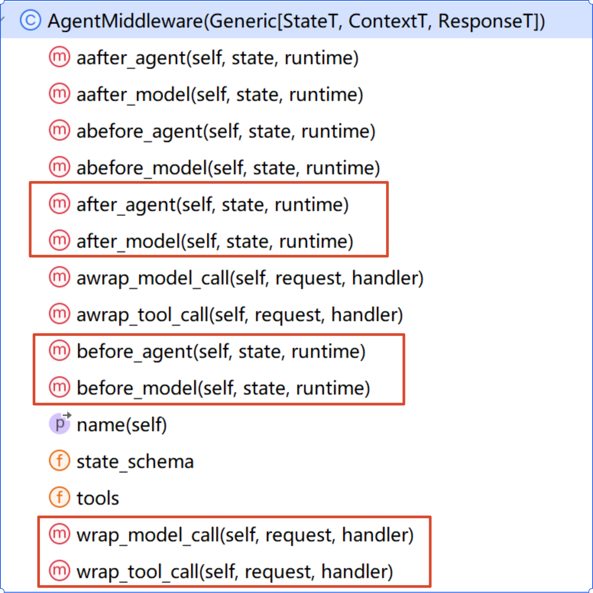

## 内置中间件

## 自定义中间件

### 两种钩子

> 两种方式：
> 
> 1. **Node-style hooks  节点式钩子**：在特定执行点运行
> 2. **Wrap-style hooks  包装式钩子**：在每次调用前后运行

#### Node-style hooks  节点式钩子

*📊 在线表格（无数据）*

#### Wrap-style hooks  包装式钩子

### 创建方式

> 所有中间件均可使用两个**预留参数**：  
> 
> 1. `state: AgentState`, 
> 2. `runtime: Runtime`**（短期】长期、context）**

#### 基于装饰器的中间件（写一个注解）

1. `@before_agent` - 在智能体启动前运行（每次调用执行一次）
2. `@before_model` - 在每次模型调用前运行
3. `@after_model` - 在每次模型响应后运行
4. `@after_agent` - 在智能体完成后运行（每次调用执行一次）
5. `@wrap_model_call` - 使用自定义逻辑包装每个模型调用
6. `@wrap_tool_call` - 使用自定义逻辑包装每个工具调用
7. `@dynamic_prompt` - 生成动态系统提示词

测试：

```python
from langchain.agents.middleware import (
    before_model,
    wrap_model_call,
    AgentState,
    ModelRequest,
    ModelResponse,
)
from langchain.agents import create_agent
from langgraph.runtime import Runtime
from typing import Any, Callable
from dotenv import load_dotenv
load_dotenv()


@before_model
def log_before_model(state: AgentState, runtime: Runtime) -> dict[str, Any] | None:
    print(f"☀️About to call model with {len(state['messages'])} messages")
    return None

@wrap_model_call
def retry_model(
    request: ModelRequest,
    handler: Callable[[ModelRequest], ModelResponse],
) -> ModelResponse:
    for attempt in range(3):
        try:
            print(f"☀️Model call attempt {attempt + 1}/3")
            return handler(request)
        except Exception as e:
            if attempt == 2:
                raise
            print(f"Retry {attempt + 1}/3 after error: {e}")

agent = create_agent(
    model="deepseek-chat",
    middleware=[log_before_model, retry_model]
)

resp = agent.invoke({
    "messages": [{"role": "user", "content": "你好"}],
})

print(resp)
```

#### 基于类的中间件（写一个类）

测试：

```python
from langchain.agents import create_agent
from langchain.agents.middleware import (
    AgentMiddleware,
    AgentState
)
from langgraph.runtime import Runtime
from typing import Any, Callable
from dotenv import load_dotenv
load_dotenv()

class LoggingMiddleware(AgentMiddleware):
    def before_model(self, state: AgentState, runtime: Runtime) -> dict[str, Any] | None:
        print(f"☀️About to call model with {len(state['messages'])} messages")
        return None

    def after_model(self, state: AgentState, runtime: Runtime) -> dict[str, Any] | None:
        print(f"☀️Model returned: {state['messages'][-1].content}")
        return None

    async def abefore_model(
        self, state: AgentState, runtime: Runtime
    ) -> dict[str, Any] | None:
        # Async version of before_model
        return None

    async def aafter_model(
        self, state: AgentState, runtime: Runtime
    ) -> dict[str, Any] | None:
        # Async version of after_model
        print(f"Model returned: {state['messages'][-1].content}")
        return None


agent = create_agent(
    model="deepseek-chat",
    middleware=[LoggingMiddleware()]
)

resp =agent.invoke({
    "messages": [{"role": "user", "content": "你好"}],
    "user_preferences": {"style": "technical", "verbosity": "detailed"},
},config={"configurable": {"thread_id": "my_123"}})
print(resp)
```

## 自定义 `state_schema`

如果你的中间件需要在**多个钩子间追踪状态**，可以通过**自定义属性扩展 Agent 的状态**。这使得中间件能够：

1. **跨执行跟踪状态**，如：维护在整个 Agent 执行生命周期中持续存在的计数器、标志或其他值
2. **在钩子间共享数据**，如：将信息从 `before_model` 传递到 `after_model` ，或在不同的中间件实例之间传递
3. **实现横切关注点**，如：添加如速率限制、使用跟踪、用户上下文或审计日志等功能，而无需修改核心代理逻辑
4. **做出条件决策**：利用累积状态来决定是否继续执行、跳转到不同节点或动态修改行为

### 装饰器写法

```python
from langchain.agents import create_agent
from langchain.messages import HumanMessage
from langchain.agents.middleware import AgentState, before_model, after_model
from typing_extensions import NotRequired
from typing import Any
from langgraph.runtime import Runtime
from dotenv import load_dotenv
load_dotenv()


class CustomState(AgentState):
    model_call_count: NotRequired[int]
    user_id: NotRequired[str]


@before_model(state_schema=CustomState, can_jump_to=["end"])
def check_call_limit(state: CustomState, runtime: Runtime) -> dict[str, Any] | None:
    count = state.get("model_call_count", 0)
    print(f"☀️Model call count: {count}")
    if count > 10:
        return {"jump_to": "end"}
    return None


@after_model(state_schema=CustomState)
def increment_counter(state: CustomState, runtime: Runtime) -> dict[str, Any] | None:
    return {"model_call_count": state.get("model_call_count", 0) + 1}


agent = create_agent(
    model="deepseek-chat",
    state_schema=CustomState,
    middleware=[check_call_limit, increment_counter],
    tools=[],
)

# 自定义 state 值，并执行
result = agent.invoke({
    "messages": [HumanMessage("Hello")],
    "model_call_count": 0,
    "user_id": "user-123",
})
print(f"☀️Result:  {result['messages'][-1].content}")
```

### 类写法

```python
from langchain.agents import create_agent
from langchain.messages import HumanMessage
from langchain.agents.middleware import AgentState, AgentMiddleware, hook_config
from typing_extensions import NotRequired
from typing import Any
from dotenv import load_dotenv
load_dotenv()


class CustomState(AgentState):
    model_call_count: NotRequired[int]
    user_id: NotRequired[str]


class CallCounterMiddleware(AgentMiddleware[CustomState]):
    state_schema = CustomState

    # 装饰器指定 jump_to 规则
    @hook_config(can_jump_to=["end"])
    def before_model(self, state: CustomState, runtime) -> dict[str, Any] | None:
        count = state.get("model_call_count", 0)
        if count > 10:
            return {"jump_to": "end"}
        return None

    def after_model(self, state: CustomState, runtime) -> dict[str, Any] | None:
        return {"model_call_count": state.get("model_call_count", 0) + 1}


agent = create_agent(
    model="deepseek-chat",
    middleware=[CallCounterMiddleware()],
    tools=[],
)

# Invoke with custom state
result = agent.invoke({
    "messages": [HumanMessage("Hello")],
    "model_call_count": 13,
    "user_id": "user-123",
})
print(f"☀️Result:  {result['messages'][-1].content}")
```

## 多中间件执行顺序

```python
agent = create_agent(
    model="gpt-4.1",
    middleware=[middleware1, middleware2, middleware3],
    tools=[...],
)
```

> 规则：
> 
> 1. `before_*` 钩子：从第一个到最后一个
> 2. `wrap_*` 钩子：嵌套（首个中间件包裹所有其他中间件）
> 3. `after_*` 钩子：从后到前（反向）

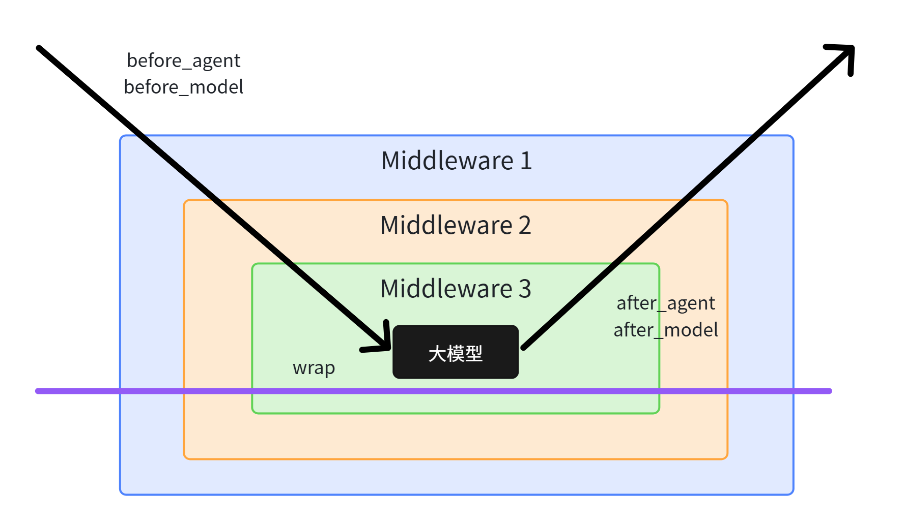

1. **前置钩子按顺序运行**：
  1. `middleware1.before_agent()`
  2. `middleware2.before_agent()`
  3. `middleware3.before_agent()`
2.  **智能体循环开始**：
  1. `middleware1.before_model()`
  2. `middleware2.before_model()`
  3. `middleware3.before_model()`
3. **包装钩子如同函数调用般嵌套：**
  1. `middleware1.wrap_model_call()` → `middleware2.wrap_model_call()` → `middleware3.wrap_model_call()` → 模型
4. **后置钩子按****相反****顺序执行：**
  1. `middleware3.after_model()`
  2. `middleware2.after_model()`
  3. `middleware1.after_model()`
5. 代理循环结束：
  1. `middleware3.after_agent()`
  2. `middleware2.after_agent()`
  3. `middleware1.after_agent()`

## 提前跳出

要从中间件提前退出，返回一个包含 `jump_to` 的字典即可

### 装饰器写法

```python
from langchain.agents.middleware import after_model, hook_config, AgentState
from langchain.messages import AIMessage
from langgraph.runtime import Runtime
from typing import Any


@after_model
@hook_config(can_jump_to=["end"])
def check_for_blocked(state: AgentState, runtime: Runtime) -> dict[str, Any] | None:
    last_message = state["messages"][-1]
    if "BLOCKED" in last_message.content:
        return {
            "messages": [AIMessage("I cannot respond to that request.")],
            "jump_to": "end"
        }
    return None
```

### 类写法

```python
from langchain.agents.middleware import AgentMiddleware, hook_config, AgentState
from langchain.messages import AIMessage
from langgraph.runtime import Runtime
from typing import Any

class BlockedContentMiddleware(AgentMiddleware):
    @hook_config(can_jump_to=["end"])
    def after_model(self, state: AgentState, runtime: Runtime) -> dict[str, Any] | None:
        last_message = state["messages"][-1]
        if "BLOCKED" in last_message.content:
            return {
                "messages": [AIMessage("I cannot respond to that request.")],
                "jump_to": "end"
            }
        return None
```

## 更多示例

参考阅读官方示例：https://docs.langchain.com/oss/python/langchain/middleware/custom#examples

# Guardrails：防护栏

> 还是需要中间件

> 护栏通过在 Agent 执行的关键节点**验证和过滤内容**，帮助我们构建`安全合规`**的人工智能应用**。
> 
> 它们能够`检测敏感信息`、`执行内容策略`、`验证输出`，并在不安全行为引发问题之前加以预防。

常见应用场景包括

1. **防止个人信息泄露**： `PII`（Personally Identifiable Information） leakage
2. `检测并阻止提示注入攻击`
3. `拦截不当或有害内容`
4. `执行业务规则和合规要求`
5. `验证输出质量和准确性`

## 内置护栏

### PII detection：个人身份信息检测

> LangChain 提供了内置中间件，用于检测和处理对话中的个人身份信息（PII）。该中间件能够检测常见的 PII 类型，如电子邮件、信用卡号、IP 地址等。

**内置的 PII 类型：**

- `email` - 电子邮件地址
- `credit_card` - 信用卡号码（经 Luhn 算法验证）
- `ip` - IP 地址
- `mac_address` - MAC 地址
- `url` - URLs   `url` - 网址

**配置参数：**

```python
from langchain.agents import create_agent
from langchain.agents.middleware import PIIMiddleware
from dotenv import load_dotenv
load_dotenv()

agent = create_agent(
    model="deepseek-chat",
    middleware=[
        # Redact emails in user input before sending to model
        PIIMiddleware(
            "email",
            strategy="redact",
            apply_to_input=True, # 对用户输入进行脱敏处理。发给大模型前进行脱敏
        ),
        # Mask credit cards in user input
        PIIMiddleware(
            "credit_card",
            strategy="mask",
            apply_to_input=True,
        ),
        # Block API keys - raise error if detected
        PIIMiddleware(
            "ip",
            # detector=r"sk-[a-zA-Z0-9]{32}",
            strategy="block", # 阻止API密钥被发送到模型； 默认会报错
            apply_to_input=True,
        ),
    ],
)

# When user provides PII, it will be handled according to the strategy
result = agent.invoke({
    "messages": [{"role": "user",
                  "content":
        "我的邮箱是 john.doe@example.com，信用卡号是 5105-1051-0510-5100，"
                                             }]})

print(f"☀️Result:  {result['messages'][-1].content}")
```

### Human-in-the-loop：人工介入

> 后面我们详细演示

```python
from langchain.agents import create_agent
from langchain.agents.middleware import HumanInTheLoopMiddleware
from langgraph.checkpoint.memory import InMemorySaver
from langgraph.types import Command


agent = create_agent(
    model="gpt-4.1",
    tools=[search_tool, send_email_tool, delete_database_tool],
    middleware=[
        HumanInTheLoopMiddleware(
            interrupt_on={
                # Require approval for sensitive operations
                "send_email": True,
                "delete_database": True,
                # Auto-approve safe operations
                "search": False,
            }
        ),
    ],
    # Persist the state across interrupts
    checkpointer=InMemorySaver(),
)

# Human-in-the-loop requires a thread ID for persistence
config = {"configurable": {"thread_id": "some_id"}}

# Agent will pause and wait for approval before executing sensitive tools
result = agent.invoke(
    {"messages": [{"role": "user", "content": "Send an email to the team"}]},
    config=config
)

result = agent.invoke(
    Command(resume={"decisions": [{"type": "approve"}]}),
    config=config  # Same thread ID to resume the paused conversation
)
```

## 自定义护栏

> 对于更复杂的防护措施，**可以自定义中间件**，让其在 Agent 执行前后运行。
> 
> 从而能够完全控制验证逻辑、内容过滤和安全检查。
> 
> **总结：使用中间件方式**

### Before Agent

#### 装饰器语法

```python
from typing import Any

from langchain.agents.middleware import before_agent, AgentState, hook_config
from langgraph.runtime import Runtime
from dotenv import load_dotenv
load_dotenv()

banned_keywords = ["伊朗", "以色列", "战区"]

@before_agent(can_jump_to=["end"])
def content_filter(state: AgentState, runtime: Runtime) -> dict[str, Any] | None:
    """Deterministic guardrail: Block requests containing banned keywords."""
    # Get the first user message
    if not state["messages"]:
        return None

    first_message = state["messages"][0]
    if first_message.type != "human":
        return None

    content = first_message.content.lower()

    # Check for banned keywords
    for keyword in banned_keywords:
        if keyword in content:
            # Block execution before any processing
            return {
                "messages": [{
                    "role": "assistant",
                    "content": "您的请求包含不适当的内容，我无法处理。请重新提交。"
                }],
                "jump_to": "end"
            }

    return None

# Use the custom guardrail
from langchain.agents import create_agent

agent = create_agent(
    model="deepseek-chat",
    tools=[],
    middleware=[content_filter],
)

# This request will be blocked before any processing
result = agent.invoke({
    "messages": [{"role": "user", "content": "讲解下俄乌冲突"}]
})
print(result["messages"][-1].content)
```

#### 类语法

```python
from typing import Any

from langchain.agents.middleware import AgentMiddleware, AgentState, hook_config
from langgraph.runtime import Runtime

class ContentFilterMiddleware(AgentMiddleware):
    """Deterministic guardrail: Block requests containing banned keywords."""

    def __init__(self, banned_keywords: list[str]):
        super().__init__()
        self.banned_keywords = [kw.lower() for kw in banned_keywords]

    @hook_config(can_jump_to=["end"])
    def before_agent(self, state: AgentState, runtime: Runtime) -> dict[str, Any] | None:
        # Get the first user message
        if not state["messages"]:
            return None

        first_message = state["messages"][0]
        if first_message.type != "human":
            return None

        content = first_message.content.lower()

        # Check for banned keywords
        for keyword in self.banned_keywords:
            if keyword in content:
                # Block execution before any processing
                return {
                    "messages": [{
                        "role": "assistant",
                        "content": "I cannot process requests containing inappropriate content. Please rephrase your request."
                    }],
                    "jump_to": "end"
                }

        return None

# Use the custom guardrail
from langchain.agents import create_agent

agent = create_agent(
    model="gpt-4.1",
    tools=[search_tool, calculator_tool],
    middleware=[
        ContentFilterMiddleware(
            banned_keywords=["hack", "exploit", "malware"]
        ),
    ],
)

# This request will be blocked before any processing
result = agent.invoke({
    "messages": [{"role": "user", "content": "How do I hack into a database?"}]
})
```

### After Agent

#### 装饰器语法

```python
from langchain.agents.middleware import after_agent, AgentState, hook_config
from langgraph.runtime import Runtime
from langchain.messages import AIMessage
from langchain.chat_models import init_chat_model
from typing import Any
from dotenv import load_dotenv
load_dotenv()

safety_model = init_chat_model("deepseek-chat")

@after_agent(can_jump_to=["end"])
def safety_guardrail(state: AgentState, runtime: Runtime) -> dict[str, Any] | None:
    """Model-based guardrail: Use an LLM to evaluate response safety."""
    # Get the final AI response
    if not state["messages"]:
        return None

    last_message = state["messages"][-1]
    if not isinstance(last_message, AIMessage):
        return None

    # Use a model to evaluate safety
    safety_prompt = f"""Evaluate if this response is safe and appropriate.
    Respond with only 'SAFE' or 'UNSAFE'.

    Response: {last_message.content}"""

    result = safety_model.invoke([{"role": "user", "content": safety_prompt}])

    if "UNSAFE" in result.content:
        last_message.content = "I cannot provide that response. Please rephrase your request."

    return None

# Use the safety guardrail
from langchain.agents import create_agent

agent = create_agent(
    model="deepseek-chat",
    tools=[]
)

result = agent.invoke({
    "messages": [{"role": "user", "content": "how to make explosives?"}]
})

print(result["messages"][-1])
```

#### 类语法

```python
from langchain.agents.middleware import AgentMiddleware, AgentState, hook_config
from langgraph.runtime import Runtime
from langchain.messages import AIMessage
from langchain.chat_models import init_chat_model
from typing import Any

class SafetyGuardrailMiddleware(AgentMiddleware):
    """Model-based guardrail: Use an LLM to evaluate response safety."""

    def __init__(self):
        super().__init__()
        self.safety_model = init_chat_model("gpt-4.1-mini")

    @hook_config(can_jump_to=["end"])
    def after_agent(self, state: AgentState, runtime: Runtime) -> dict[str, Any] | None:
        # Get the final AI response
        if not state["messages"]:
            return None

        last_message = state["messages"][-1]
        if not isinstance(last_message, AIMessage):
            return None

        # Use a model to evaluate safety
        safety_prompt = f"""Evaluate if this response is safe and appropriate.
        Respond with only 'SAFE' or 'UNSAFE'.

        Response: {last_message.content}"""

        result = self.safety_model.invoke([{"role": "user", "content": safety_prompt}])

        if "UNSAFE" in result.content:
            last_message.content = "I cannot provide that response. Please rephrase your request."

        return None

# Use the safety guardrail
from langchain.agents import create_agent

agent = create_agent(
    model="gpt-4.1",
    tools=[search_tool, calculator_tool],
    middleware=[SafetyGuardrailMiddleware()],
)

result = agent.invoke({
    "messages": [{"role": "user", "content": "How do I make explosives?"}]
})
```

## 组合多个护栏

```python
from langchain.agents import create_agent
from langchain.agents.middleware import PIIMiddleware, HumanInTheLoopMiddleware

agent = create_agent(
    model="gpt-4.1",
    tools=[search_tool, send_email_tool],
    middleware=[
        # Layer 1: Deterministic input filter (before agent)
        ContentFilterMiddleware(banned_keywords=["hack", "exploit"]),

        # Layer 2: PII protection (before and after model)
        PIIMiddleware("email", strategy="redact", apply_to_input=True),
        PIIMiddleware("email", strategy="redact", apply_to_output=True),

        # Layer 3: Human approval for sensitive tools
        HumanInTheLoopMiddleware(interrupt_on={"send_email": True}),

        # Layer 4: Model-based safety check (after agent)
        SafetyGuardrailMiddleware(),
    ],
)
```

# Runtime：运行时

## 机制

LangChain 的 `create_agent` 底层运行在 LangGraph 的 Runtime 之上。

LangGraph 公开了一个包含以下信息的 `Runtime` 对象：

1. **Context：上下文**：静态信息，如用户 ID、数据库连接或其他代理调用所需的依赖项
2. **Store：存储**：用于长期记忆的 BaseStore 实例
3. **Stream writer: 流式写入器：**一个用于通过 `"custom"` 流模式流式传输信息的对象
4. **state：短期记忆**：存储了历史消息列表，动态变量等

## 访问运行时数据

### 工具内部

工具内容，可以：

- 访问上下文： context 
- 读取或写入长期记忆：store
- 使用自定义流输出数据（例如，工具进度/更新）：streamwriter

```python
from dataclasses import dataclass
from langchain.tools import tool, ToolRuntime  

@dataclass
class Context:
    user_id: str

@tool
def fetch_user_email_preferences(runtime: ToolRuntime[Context]) -> str:
    """Fetch the user's email preferences from the store."""
    user_id = runtime.context.user_id  
    # runtime.state
    preferences: str = "The user prefers you to write a brief and polite email."
    if runtime.store:
        if memory := runtime.store.get(("users",), user_id):
            preferences = memory.value["preferences"]

    return preferences
```

### 中间件内部

```python
from dataclasses import dataclass

from langchain.messages import AnyMessage
from langchain.agents import create_agent, AgentState
from langchain.agents.middleware import dynamic_prompt, ModelRequest, before_model, after_model
from langgraph.runtime import Runtime


@dataclass
class Context:
    user_name: str

# Dynamic prompts
@dynamic_prompt
def dynamic_system_prompt(request: ModelRequest) -> str:
    user_name = request.runtime.context.user_name  
    system_prompt = f"You are a helpful assistant. Address the user as {user_name}."
    return system_prompt

# Before model hook
@before_model
def log_before_model(state: AgentState, runtime: Runtime[Context]) -> dict | None:
    print(f"Processing request for user: {runtime.context.user_name}")
    return None

# After model hook
@after_model
def log_after_model(state: AgentState, runtime: Runtime[Context]) -> dict | None:
    print(f"Completed request for user: {runtime.context.user_name}")
    return None

agent = create_agent(
    model="gpt-5-nano",
    tools=[...],
    middleware=[dynamic_system_prompt, log_before_model, log_after_model],
    context_schema=Context
)

agent.invoke(
    {"messages": [{"role": "user", "content": "What's my name?"}]},
    context=Context(user_name="John Smith")
)
```

# Context Engineering：上下文工程

智能体可以访问的**上下文数据**

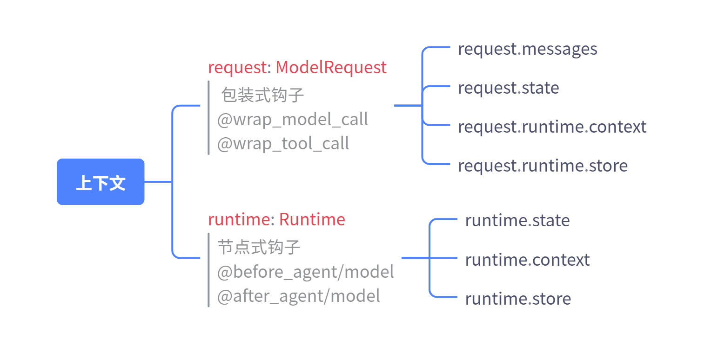

```python

@before_model
def log_before_model(state: AgentState, runtime: Runtime) -> dict[str, Any] | None:
    print(f"☀️About to call model with {len(state['messages'])} messages")
    return None

@wrap_model_call
def retry_model(
    request: ModelRequest,
    handler: Callable[[ModelRequest], ModelResponse],
) -> ModelResponse:
    for attempt in range(3):
        try:
            print(f"☀️Model call attempt {attempt + 1}/3")
            return handler(request)
        except Exception as e:
            if attempt == 2:
                raise
            print(f"Retry {attempt + 1}/3 after error: {e}")
```

# MCP：Model Context Protocol

> 为了调用各种地方的各种工具

> **MCP (Model Context Protocol)** 是一个标准化协议，让 LangChain 智能体（Agent）能像插 USB 一样，**即插即用**各类外部工具（如计算器、天气、文件系统）。
> 
> LangChain 的 Agent 可以使用 `langchain-mcp-adapters` 库来**调用 MCP 服务器上定义的工具**。

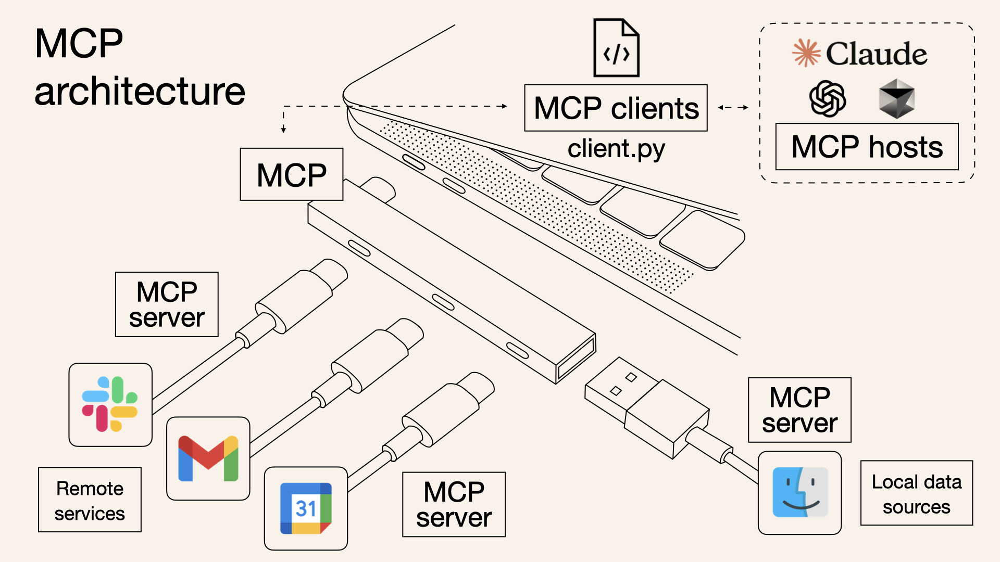

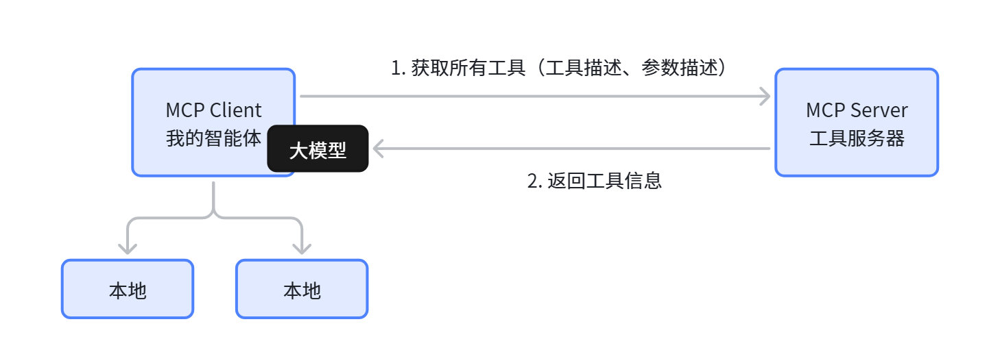

## 快速上手

### 自定义 MCP Server

```python
pip install fastmcp
```

#### 流式 Http 方式 

```python
from fastmcp import FastMCP

mcp = FastMCP("Weather")

@mcp.tool()
async def get_weather(location: str) -> str:
    """获取指定位置的天气信息"""
    return f"{location} 今天是晴天☀️"
@mcp.tool()
async def add(a: int, b: int) -> int:
    """两数相加"""
    return a + b


if __name__ == "__main__":
    mcp.run(transport="streamable-http")
```

#### Stdio 方式

```python
from fastmcp import FastMCP

mcp = FastMCP("Math")

@mcp.tool()
def add(a: int, b: int) -> int:
    """Add two numbers"""
    return a + b

@mcp.tool()
def multiply(a: int, b: int) -> int:
    """Multiply two numbers"""
    return a * b

if __name__ == "__main__":
    mcp.run(transport="stdio")
```

### 使用 apifox 测试

#### http方式

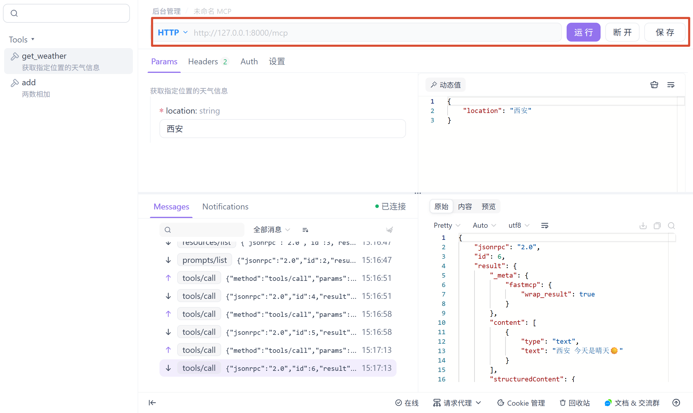

#### Stdio 方式

> 全局安装 pip install fastmcp；
> 
> 防止你的项目用隔离环境，导致外部环境没有依赖，从而启动不了

注意：`python  C:\\Users\\53409\\PycharmProjects\\langchain-demo\\mcp_test\\mcp_math.py`

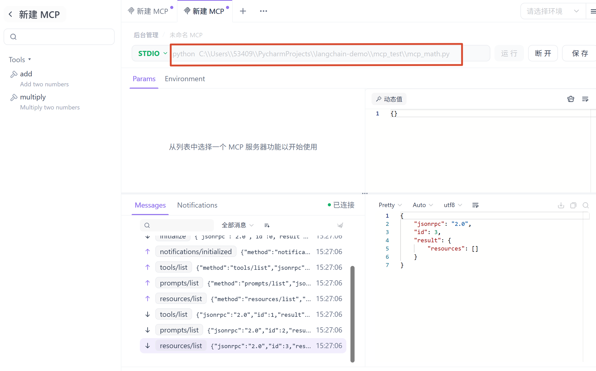

### 使用代码

```python
# 安装依赖
pip install langchain-mcp-adapters
```

```python
import asyncio
from langchain_mcp_adapters.client import MultiServerMCPClient
from langchain.agents import create_agent
from dotenv import load_dotenv
load_dotenv()

async def main():
    client = MultiServerMCPClient(
        {
            "math": {
                "transport": "stdio",  # Local subprocess communication
                "command": "python",
                # Absolute path to your math_server.py file
                "args": ["C:\\Users\\53409\\PycharmProjects\\langchain-demo\\mcp_test\\mcp_math.py"],
            },
            "weather": {
                "transport": "http",  # HTTP-based remote server
                # Ensure you start your weather server on port 8000
                "url": "http://localhost:8000/mcp",
            }
        }
    )

    tools = await client.get_tools()
    agent = create_agent(
        "deepseek-chat",
        tools
    )
    math_response = await agent.ainvoke(
        {"messages": [{"role": "user", "content": "计算 (3 + 5) x 12"}]}
    )
    weather_response = await agent.ainvoke(
        {"messages": [{"role": "user", "content": "查询 西安 的天气"}]}
    )
    print(math_response)
    print("="*50)
    print(weather_response)

if __name__ == "__main__":
    asyncio.run(main())
```

## 使用拦截器

```python
import asyncio
from langchain_mcp_adapters.client import MultiServerMCPClient
from langchain.agents import create_agent
from dotenv import load_dotenv
from langchain_mcp_adapters.interceptors import MCPToolCallRequest


load_dotenv()

async def logging_interceptor(
    request: MCPToolCallRequest,
    handler,
):
    """Log tool calls before and after execution."""
    print(f"【🔧调用】: {request.name} 参数为: {request.args}")
    # 还可以修改参数
    modified_request = request
    if request.name == "add":
        modified_args = {k: v * 2 for k, v in request.args.items()}
        modified_request = request.override(args=modified_args)

    result = await handler(modified_request)
    print(f"【🔧返回】: {request.name} 返回结果: {result}")
    return result

async def main():
    client = MultiServerMCPClient(
        {
            "math": {
                "transport": "stdio",  # Local subprocess communication
                "command": "python",
                # Absolute path to your math_server.py file
                "args": ["C:\\Users\\53409\\PycharmProjects\\langchain-demo\\mcp_test\\mcp_math.py"],
            },
            "weather": {
                "transport": "http",  # HTTP-based remote server
                # Ensure you start your weather server on port 8000
                "url": "http://localhost:8000/mcp",
            }
        },
        tool_interceptors=[logging_interceptor],
    )

    tools = await client.get_tools()
    agent = create_agent(
        "deepseek-chat",
        tools
    )
    math_response = await agent.ainvoke(
        {"messages": [{"role": "user", "content": "计算 (3 + 5) x 12"}]}
    )
    weather_response = await agent.ainvoke(
        {"messages": [{"role": "user", "content": "查询 西安 的天气"}]}
    )
    print(math_response)
    print("="*50)
    print(weather_response)

if __name__ == "__main__":
    asyncio.run(main())
```

## Tavily：Web搜索工具

登录：https://app.tavily.com/home

生成MCP链接：https://mcp.tavily.com/mcp/?tavilyApiKey=tvly-dev-xxxxxxxxxx

> 注意：
> 
> 1. 由于目前用的**是 dev 模式**。所以不会搜索成功。仅能获取到工具。必须充值才可以开通 **生产api_key**
> 2. 必须使用 astream 或者  ainvoke 来异步执行。

```python
import asyncio
from langchain_mcp_adapters.client import MultiServerMCPClient
from langchain.agents import create_agent
from dotenv import load_dotenv
from langchain_mcp_adapters.interceptors import MCPToolCallRequest


load_dotenv()

async def main():
    client = MultiServerMCPClient(
        {
            "tavily": {
                "transport": "http",
                "url": "https://mcp.tavily.com/mcp/?tavilyApiKey=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",
            }
        }
    )

    tools = await client.get_tools()
    print(f"Tools: {tools}")
    agent = create_agent(
        "deepseek-chat",
        tools
    )

    response =  agent.astream(
        {"messages": [{"role": "user", "content": "英伟达最新股价"}]},
        stream_mode="messages"
    )

    async for chunk in response:
        print(chunk[0].content,end='')

if __name__ == "__main__":
    asyncio.run(main())
```

## MCP 广场

https://www.modelscope.cn/mcp

### 百度地图

https://modelscope.cn/mcp/servers/@baidu-maps/mcp

```python
# 全局安装, 且当前项目环境也要安装
pip install mcp-server-baidu-maps

# 启动命令
python -m mcp_server_baidu_maps
```

> 百度地图开放平台，开通 apikey：https://lbsyun.baidu.com/apiconsole/key

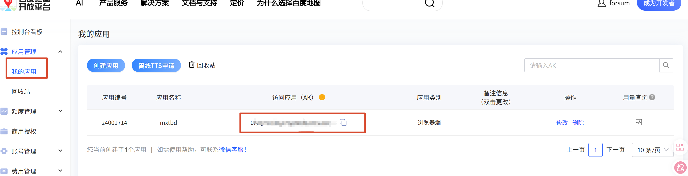

#### apifox测试

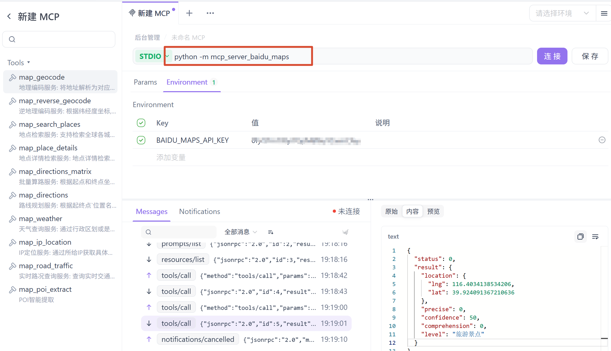

#### 代码测试

> **非企业用户**，仅能测试简单功能，比如获取地理位置坐标

```python
import asyncio
from langchain_mcp_adapters.client import MultiServerMCPClient
from langchain.agents import create_agent
from dotenv import load_dotenv
from langchain_mcp_adapters.interceptors import MCPToolCallRequest


load_dotenv()

async def main():
    client = MultiServerMCPClient(
        {
            "baidu-maps": {
                "transport": "stdio",
                "command": "python",
                "args": ["-m", "mcp_server_baidu_maps"],
                "env": {
                    "BAIDU_MAPS_API_KEY": "0fyQ7m1lRyi7GpM6f6uYCwmCAyxG2d4G"
                }
            }
        }
    )

    tools = await client.get_tools()
    print(f"Tools: {tools}")
    agent = create_agent(
        "deepseek-chat",
        tools
    )

    response =  agent.astream(
        {"messages": [{"role": "user", "content": "故宫的地理位置坐标是多少?"}]},
        stream_mode="messages"
    )

    async for chunk in response:
        print(chunk[0].content,end='')

if __name__ == "__main__":
    asyncio.run(main())
```

### bing搜索

https://modelscope.cn/mcp/servers/rainerWJY/bing-cn-mcp-enhanced

```python
## 安装依赖
npm install -g bing-cn-mcp-enhanced
```

### 智谱联网搜

https://modelscope.cn/mcp/servers/ZhipuAI/Zhipu-Web-Search

```python
import asyncio
from langchain_mcp_adapters.client import MultiServerMCPClient
from langchain.agents import create_agent
from dotenv import load_dotenv

load_dotenv()


async def main():
    client = MultiServerMCPClient(
        {
            "zhipu-web-search-sse": {
                "transport": "sse",
                "url": "https://open.bigmodel.cn/api/mcp/web_search/sse?Authorization=f1102c29960e4211b0ad6067c180a238.zVeZeIG6jwsISN4T"
            }
        }
    )

    tools = await client.get_tools()
    print(f"Tools: {tools}")
    agent = create_agent(
        "deepseek-chat",
        tools
    )
    #
    response =  agent.astream(
        {"messages": [{"role": "user", "content": "英伟达最新股价是多少?"}]},
        stream_mode="messages"
    )
    #
    async for chunk in response:
        print(chunk[0].content,end='')


if __name__ == "__main__":
    asyncio.run(main())
```

> 我没充钱，所以

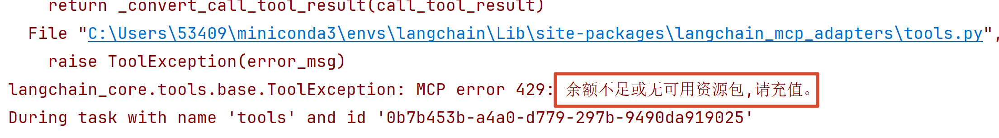

# Human-in-the-loop：`HITL`（人机协同）

> **人机协同**（HITL，有些文档也叫` HIL`）中间件允许为 Agent 工具调用添加人工监督。
> 
> 当模型提出可能需要审查的操作时，例如写入文件或执行 SQL，该**中间件**可以暂停执行并等待决策。
> 
> **本质：中间件实现**

## 中断决策

中间件定义了三种内置方式，供人类在中断时进行响应：

每个工具可用的决策类型取决于在 `interrupt_on` 中配置的策略

## 配置中断

```python
import os
from typing import Optional
from dotenv import load_dotenv

load_dotenv()

# --------------------------
# 3个工具
# --------------------------
from langchain_core.tools import tool

@tool
def write_file(file_path: str, content: str) -> str:
    """
    写入文件到本地
    Args:
        file_path: 文件路径
        content: 文件内容
    """

    return f"✅ 写入文件成功：{file_path}\n内容：{content[:50]}..."

@tool
def execute_sql(sql: str) -> str:
    """
    执行SQL语句
    Args:
        sql: 要执行的SQL
    """

    return f"✅ 执行SQL成功：{sql}\n影响行数：1"

@tool
def read_data(query: str) -> str:
    """
    安全读取数据
    Args:
        query: 查询语句
    """

    return f"✅ 读取数据成功：{query}\n结果：[1,2,3,4,5]"


# --------------------------
# 官方代码：创建带 人机在环 的 Agent
# --------------------------
from langchain.agents import create_agent
from langchain.agents.middleware import HumanInTheLoopMiddleware
from langgraph.checkpoint.memory import InMemorySaver


# 创建Agent
agent = create_agent(
    model="deepseek-chat",
    tools=[write_file, execute_sql, read_data],
    middleware=[
        HumanInTheLoopMiddleware(
            interrupt_on={ # 什么时候中断
                "write_file": True, # 所有决策 (approve, edit, reject) 都要人工审核
                "execute_sql": {"allowed_decisions": ["approve", "reject"]}, # 只允许 approve 或 reject
                "read_data": False, # 读取数据无需人工审核
            },
            # 中断消息前缀 —— 会与工具名称和参数组合，构成完整消息
            # 例如："待审批执行工具：execute_sql，查询语句为 'DELETE FROM...'"
            # 可在单个工具的中断配置中指定 description 字段，以此覆盖该前缀
            description_prefix="待审批执行工具",
        ),
    ],
    checkpointer=InMemorySaver(), # 短期记忆
)
```

## 响应中断

> 1. 执行 Agent 时，它会持续运行直至完成或触发中断。
> 2. 当工具调用匹配在 `interrupt_on` 中配置的策略时，将触发中断。
> 3. 使用 `version="v2"` 时，结果是一个包含 `interrupts` 属性的 `GraphOutput` ，该属性存储需要审核的操作。
> 4. 随后，可以将这些操作提交给审核者，并在获得决策后恢复执行。

```python
from langgraph.types import Command
# 人机协同交互机制依托 LangGraph 的持久化层实现。
# 必须提供线程 ID，将当前执行任务与对话线程相关联，
# 从而实现对话的暂停与恢复（人工审核环节需要此功能）
config = {"configurable": {"thread_id": "some_id"}}
# 运行流程，直至触发中断节点。
result = agent.invoke(
    {
        "messages": [
            {
                "role": "user",
                "content": "从 records 表中删除 id 为 1 的记录",
            }
        ]
    },
    config=config,
    version="v2",
)

# 打印中断信息，后来这些东西展示到前端
print(result.interrupts)

decision = input("请输入您的决策（approve or reject）：")


# 此处应该根据前端提交的操作，构造不同的 Command，来恢复会话
resp = agent.invoke(
    Command(
        resume={"decisions": [{"type": decision}]}  # or "reject"
    ),
    config=config, # 使用与中断节点相同的线程 ID，恢复暂停的对话流程
    version="v2",
)

print(resp)
```

## 流式输出

```python
# Stream agent progress and LLM tokens until interrupt
for chunk in agent.stream(
    {"messages": [{"role": "user", "content": "从 records 表中删除 id 为 1 的记录"}]},
    config=config,
    stream_mode=["updates", "messages"],
    version="v2",
):
    if chunk["type"] == "messages":
        # LLM token
        token, metadata = chunk["data"]
        if token.content:
            print(token.content, end="", flush=True)
    elif chunk["type"] == "updates":
        # Check for interrupt
        if "__interrupt__" in chunk["data"]:
            print(f"\n\nInterrupt: {chunk['data']['__interrupt__']}")

#
decision = input("请输入您的决策（approve or reject）：")

# Resume with streaming after human decision
for chunk in agent.stream(
    Command(resume={"decisions": [{"type": decision}]}),
    config=config,
    stream_mode=["updates", "messages"],
    version="v2",
):
    if chunk["type"] == "messages":
        token, metadata = chunk["data"]
        if token.content:
            print(token.content, end="", flush=True)
```

# Long-term memory：长期记忆

> 长期记忆使智能体能够在不同对话和会话间存储和召回信息。
> 
> 与仅限于单个线程的短期记忆不同，长期记忆能够跨线程持久保存，并可在任意时刻被召回。
> 
> 1. `runtime.``store`：长期记忆，使用 `store`定义
> 2. `runtime.``state`：短期记忆，使用 `checkpointer`定义

```python
from langgraph.store.memory import InMemoryStore
from langgraph.checkpoint.memory import InMemorySaver

# InMemoryStore saves data to an in-memory dictionary. Use a DB-backed store in production use.
store = InMemoryStore()
checkpointer = InMemorySaver()

agent = create_agent(
    "claude-sonnet-4-6",
    tools=[],
    store=store,
    checkpointer=checkpointer
)
# 未来可以在中间件或者工具中访问记忆
```

# Agent Chat UI

> 前端不会的同学听：https://www.bilibili.com/video/BV14t421M7CL

> LangChain 官方套件

> Agent Chat UI 是一个基于 Next.js 的应用程序，为与任何 LangChain 智能体交互提供对话式界面。它支持`实时聊天`、`工具可视化`以及`时间旅行调试`和状态分叉等高级功能。
> 
> 是使用LangChain开发智能体期间，最好用的前端测试页面，能无缝对接 `create_agent`创建的智能体

## 创建前端

> 提前安装好 node.js 环境

```python
# 创建项目
npx create-agent-chat-app --project-name my-chat-ui
cd my-chat-ui

# 安装依赖并启动
npm install
npm run dev
```

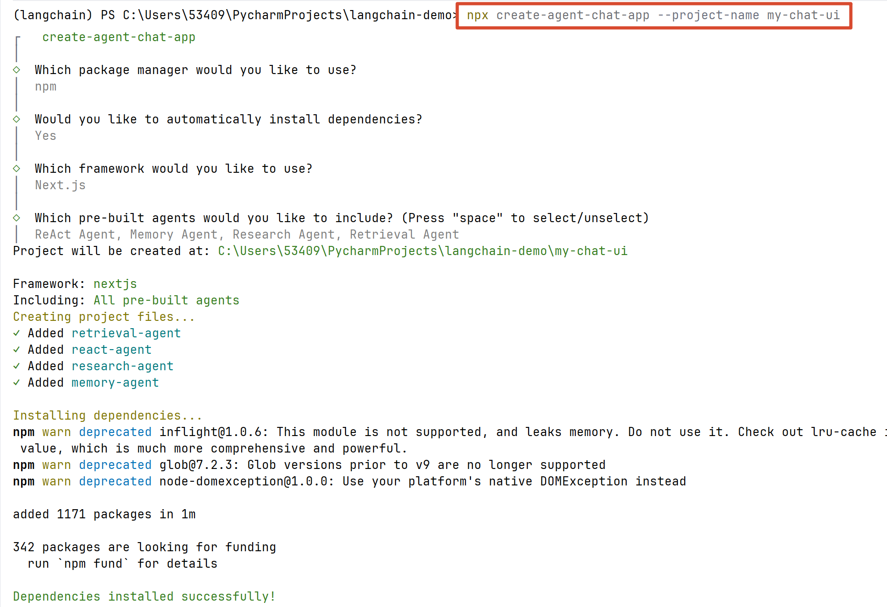

## 欢迎页面

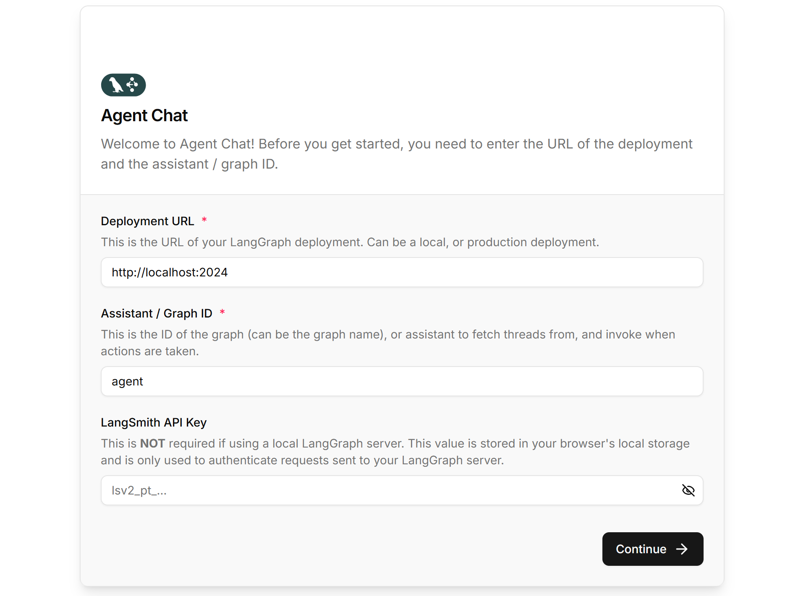

## 创建本地智能体

### 安装 LangGraph CLI

LangGraph CLI 提供了一个本地开发服务器（也称为代理服务器）

```python
pip install --upgrade "langgraph-cli[inmem]"
```

### 创建智能体

```python
from langchain.agents import create_agent

def send_email(to: str, subject: str, body: str):
    """发送邮件"""
    email = {
        "to": to,
        "subject": subject,
        "body": body
    }
    # ... 发送邮件的逻辑

    # 返回发送结果
    return f"Email sent to {to}"

agent = create_agent(
    "deepseek-chat",
    tools=[send_email],
    system_prompt="你是一个邮件助手，总是使用 send_email 工具发送邮件。",
)
```

### 创建 `langgraph.json`

```json
{
  "dependencies": ["."],
  "graphs": {
    "agent": "./myagent.py:agent"
  },
  "env": ".env"
}
```

配置项详解：https://docs.langchain.com/langsmith/cli#configuration-file

- `dependencies`：项目需要的所有依赖。
  - `. `代表仅使用 本地Python包
  - `./ `代表使用项目下，`requirements.txt` 依赖（也支持`pyproject.toml`, `setup.py`）
- `graphs`：Agent 编译的 graph 位置；
  - `./``your_package``/``your_file.py``:variable`
- `env`：环境变量文件位置

## 运行

> 启动后端的智能体。`langsmith `会自动根据` langgraph.json` 中配置的智能体路径和名字，运行它们

```python
langgraph dev
```

## 连接

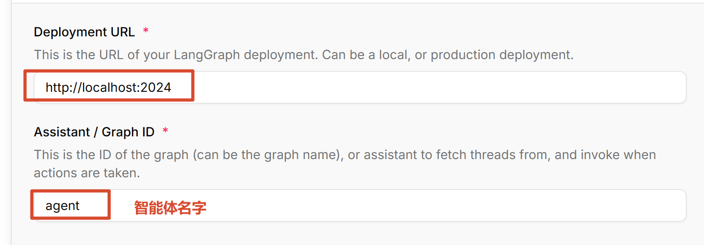

## 测试效果

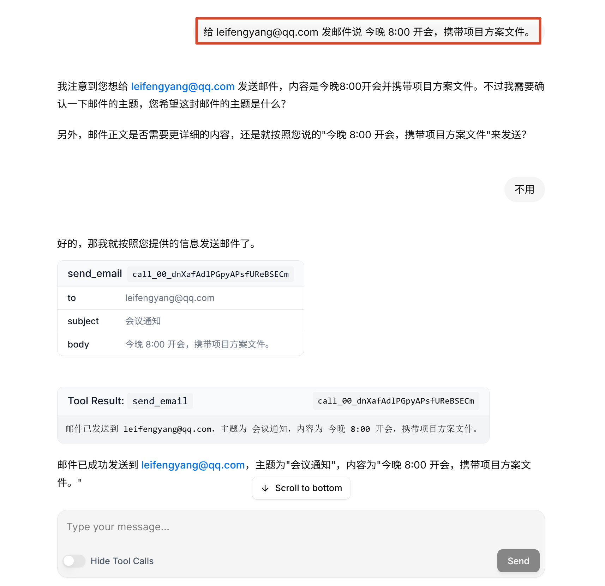

# MultiAgent：多智能体

> 多个智能体共同协作完成任务；
> 
> 核心机制：`主Agent` 协调**多个 **`SubAgent`，每个 `SubAgent `对于 `主Agent` 来说就**是一个工具**；
> 
> **多智能体设计的核心是**`上下文工程`**（Context Engineering）：**决定每个智能体能访问哪些信息。系统的质量取决于确保每个智能体都能获取其任务所需的正确数据。

## Subagent：子智能体

> 在子Agent架构中，**一个**`中央主代理`**（通常称为**`监督者`**）通过将**`子代理`**作为工具调用来协调它们**。
> 
> - 主代理决定调用哪个子代理、提供什么输入以及如何组合结果。
> - `子代理是无状态的`——它们不记得过去的交互，所有`对话记忆`都由`主代理`维护。这提供了`上下文隔离`：每个子代理调用都在一个干净的上下文窗口中工作，防止主对话中的上下文膨胀。

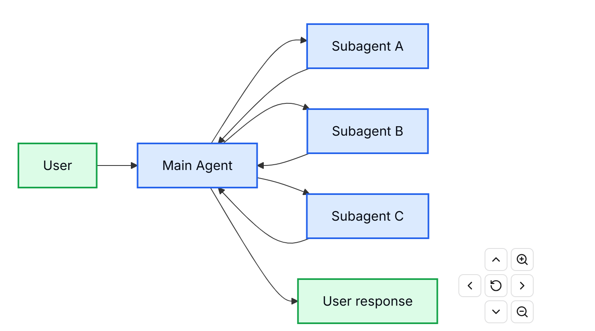

### 核心逻辑

```python
from langchain.tools import tool
from langchain.agents import create_agent

# 1. 创建子智能体
subagent = create_agent(model="deepseek-chat", tools=[])

# 2. 包装子智能体为工具
@tool("research", description="Research a topic and return findings")
def call_research_agent(query: str):
    result = subagent.invoke({"messages": [{"role": "user", "content": query}]})
    return result["messages"][-1].content

# 3. 创建主智能体
main_agent = create_agent(model="deepseek-chat", tools=[call_research_agent])
```

### 完整案例：个人商务助手

**监督者模式（supervisor pattern）**是一种多智能体架构，其中`中央监督者智能体`协调专门的 `worker 智能体`

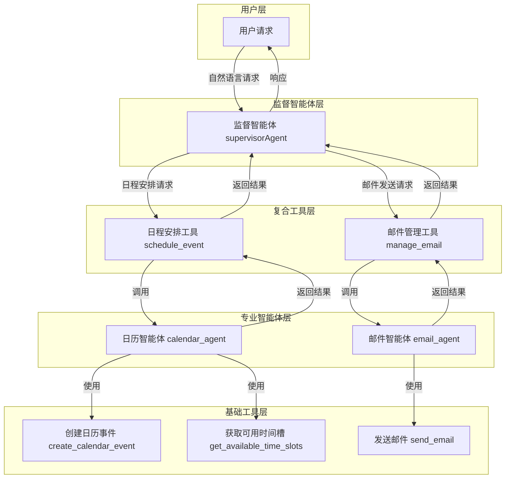
```mermaid
flowchart TD
    subgraph 用户层
        User[用户请求]
    end

    subgraph 监督智能体层
        SupervisorAgent[监督智能体 supervisorAgent]
    end

    subgraph 复合工具层
        ScheduleEvent[日程安排工具 schedule_event]
        ManageEmail[邮件管理工具 manage_email]
    end

    subgraph 专业智能体层
        CalendarAgent[日历智能体 calendar_agent]
        EmailAgent[邮件智能体 email_agent]
    end

    subgraph 基础工具层
        CreateCalendarEvent[创建日历事件 create_calendar_event]
        GetAvailableTimeSlots[获取可用时间槽 get_available_time_slots]
        SendEmail[发送邮件 send_email]
    end

    User -->|自然语言请求| SupervisorAgent
    SupervisorAgent -->|日程安排请求| ScheduleEvent
    SupervisorAgent -->|邮件发送请求| ManageEmail
    ScheduleEvent -->|调用| CalendarAgent
    ManageEmail -->|调用| EmailAgent
    CalendarAgent -->|使用| CreateCalendarEvent
    CalendarAgent -->|使用| GetAvailableTimeSlots
    EmailAgent -->|使用| SendEmail
    CalendarAgent -->|返回结果| ScheduleEvent
    EmailAgent -->|返回结果| ManageEmail
    ScheduleEvent -->|返回结果| SupervisorAgent
    ManageEmail -->|返回结果| SupervisorAgent
    SupervisorAgent -->|响应| User
```

#### 准备模型

```python
import os
from langchain.chat_models import init_chat_model


model = init_chat_model("gpt-5.2")
```

#### 创建基础工具

```python

from langchain.tools import tool

@tool
def create_calendar_event(
    title: str,
    start_time: str,       # ISO 格式: "2024-01-15T14:00:00"
    end_time: str,         # ISO 格式: "2024-01-15T15:00:00"
    attendees: list[str],  # 邮箱地址列表
    location: str = ""
) -> str:
    """ 创建日历事件，要求使用精确的 ISO 日期时间格式。 """
    # 注意：这里假设事件创建成功，实际应用中需要调用日历API，如Google Calendar API、Outlook API等
    return f"事件已创建: {title} 从 {start_time} 到 {end_time}，包含 {len(attendees)} 个参会人，地点为 {location}"


@tool
def send_email(
    to: list[str],  # 邮箱地址列表
    subject: str,
    body: str,
    cc: list[str] = []
) -> str:
    """ 通过电子邮件 API 发送邮件，要求使用格式规范的邮箱地址。 """
    return f"邮件已发送到 {', '.join(to)} - 主题为 {subject}，内容为 {body[:20]}"


@tool
def get_available_time_slots(
    attendees: list[str],
    date: str,  # ISO 格式: "2024-01-15"
    duration_minutes: int
) -> list[str]:
    """ 查询指定参会人员在特定日期的日程空闲情况 """
    # 注意：这里假设时间槽查询成功，实际应用中需要调用日历API，如Google Calendar API、Outlook API等
    return ["09:00", "14:00", "16:00"]
```

#### 创建：日历`子Agent`

```python
from langchain.agents import create_agent


CALENDAR_AGENT_PROMPT = (
    "你是一名日程安排助手。 "
    "解析自然语言形式的日程预约请求（例如 “下周二下午两点”）， "
    "将其转换为标准的 ISO 日期时间格式。 "
    "必要时调用get_available_time_slots接口核查时段是否可用。"
    "若无合适时段，终止操作并在回复中告知该时段不可用。"
    "若有合适时段，调用create_calendar_event工具创建事件。"
    "务必在最终回复中确认已安排的日程信息。"
)

calendar_agent = create_agent(
    model,
    tools=[create_calendar_event, get_available_time_slots],
    system_prompt=CALENDAR_AGENT_PROMPT,
)
```

#### 测试：日历`子Agent`

```sql
query = "安排一场团队会议，时间为下周二下午 2 点，时长 1 小时，通知 zhangsan@qq.com、lisi@qq.com、wangwu@qq.com"

for step in calendar_agent.stream(
    {"messages": [{"role": "user", "content": query}]}
):
    for update in step.values():
        for message in update.get("messages", []):
            message.pretty_print()
```

> 输出结果

```yaml
================================== Ai Message ==================================

我来帮您安排下周二下午2点的团队会议。首先，我需要确定下周二的具体日期，然后查询参会人员的可用时间段。

今天是2024年12月27日（周五），下周二应该是2024年12月31日。让我先查询这个时间段是否可用。
Tool Calls:
  get_available_time_slots (call_00_oVKD91Th38SVzx1pbkPokUDA)
 Call ID: call_00_oVKD91Th38SVzx1pbkPokUDA
  Args:
    attendees: ['zhangsan@qq.com', 'lisi@qq.com', 'wangwu@qq.com']
    date: 2024-12-31
    duration_minutes: 60
================================= Tool Message =================================
Name: get_available_time_slots

["09:00", "14:00", "16:00"]
================================== Ai Message ==================================

很好！查询结果显示下周二（2024年12月31日）下午2点（14:00）是可用的时间段。现在我来创建这个日历事件。
Tool Calls:
  create_calendar_event (call_00_vx9gYP4GsYhvLJrXNf17HWL2)
 Call ID: call_00_vx9gYP4GsYhvLJrXNf17HWL2
  Args:
    title: 团队会议
    start_time: 2024-12-31T14:00:00
    end_time: 2024-12-31T15:00:00
    attendees: ['zhangsan@qq.com', 'lisi@qq.com', 'wangwu@qq.com']
================================= Tool Message =================================
Name: create_calendar_event

事件已创建: 团队会议 从 2024-12-31T14:00:00 到 2024-12-31T15:00:00，包含 3 个参会人，地点为 
================================== Ai Message ==================================

✅ **日程安排已确认！**

**会议信息：**
- **会议主题：** 团队会议
- **日期时间：** 2024年12月31日（周二）下午2:00 - 3:00
- **参会人员：** 
  - zhangsan@qq.com
  - lisi@qq.com  
  - wangwu@qq.com
- **会议时长：** 1小时

会议已成功创建并通知所有参会人员。
```

#### 创建：邮件`子Agent`

```python
EMAIL_AGENT_PROMPT = (
    "你是一名电子邮件助手。"
    "根据自然语言指令撰写专业商务邮件。"
    "提取收件人信息，并拟定合适的主题与正文。"
    "使用 send_email 接口发送邮件。"
    "务必在最终回复中确认已发送的邮件内容。"
)

email_agent = create_agent(
    model,
    tools=[send_email],
    system_prompt=EMAIL_AGENT_PROMPT,
)
```

#### 测试：邮件`子Agent`

```c++
def test_email_agent():
    query = "向 design_team@qq.com 发送提醒，告知其审阅新的模型样机"

    for step in email_agent.stream(
        {"messages": [{"role": "user", "content": query}]}
    ):
        for update in step.values():
            for message in update.get("messages", []):
                message.pretty_print()
```

#### 将子智能体封装为工具

> 现在将每个 `Subagent `包装成可供 `master `调用的工具。这是创建`分层系统`的关键架构步骤。
> 
> `Master `将看到`schedule_event`这样的高级工具，而非`create_calendar_event`这类低级工具

```python
@tool
def schedule_event(request: str) -> str:
    """借助自然语言安排日历日程。
    当用户需要创建、修改或查询日历预约时使用此功能。
    负责处理日期时间解析、空闲状态核查以及日程创建工作。
    输入：自然语言形式的日程安排请求（例如：下周二下午 2 点与设计团队开会）
    """
    result = calendar_agent.invoke({
        "messages": [{"role": "user", "content": request}]
    })
    return result["messages"][-1].text


@tool
def manage_email(request: str) -> str:
    """通过自然语言发送电子邮件。
     当用户需要发送通知、提醒或任何邮件沟通时使用该功能。负责提取收件人信息、生成邮件主题以及撰写邮件内容。
     输入：自然语言形式的邮件发送请求（例如：发送会议提醒给他们）
    """
    result = email_agent.invoke({
        "messages": [{"role": "user", "content": request}]
    })
    return result["messages"][-1].text
```

#### 创建 `Supervisor Agent`（监督者）

```python
SUPERVISOR_PROMPT = (
    "你是一名乐于助人的私人助理。 "
    "你可以安排日历日程并发送邮件。"
    "将用户的请求拆解为对应的工具调用，并整合处理结果。 "
    "若一项请求包含多个操作，需按顺序调用多个工具完成。"
)

supervisor_agent = create_agent(
    model,
    tools=[schedule_event, manage_email],
    system_prompt=SUPERVISOR_PROMPT,
)
```

#### 测试：`Supervisor Agent`

```sql
query = "安排团队每日站会，时间为明天上午9点，会议时长30分钟，通知 zhangsan@qq.com、lisi@qq.com、wangwu@qq.com"

for step in supervisor_agent.stream(
    {"messages": [{"role": "user", "content": query}]}
):
    for update in step.values():
        for message in update.get("messages", []):
            message.pretty_print()
```

```markdown
================================== Ai Message ==================================

我来帮您安排团队每日站会并发送通知。首先安排会议，然后发送邮件通知。
Tool Calls:
  schedule_event (call_00_j6bIASvSPiNpb1ewNHE1bR7Q)
 Call ID: call_00_j6bIASvSPiNpb1ewNHE1bR7Q
  Args:
    request: 安排团队每日站会，时间为明天上午9点，会议时长30分钟
================================= Tool Message =================================
Name: schedule_event

我需要为您安排团队每日站会。不过，为了检查明天上午9点是否可用，我需要知道参会人员有哪些。请告诉我需要邀请哪些团队成员参加会议？
================================== Ai Message ==================================

我需要先知道参会人员才能安排会议。根据您的邮件通知需求，参会人员应该是 zhangsan@qq.com、lisi@qq.com、wangwu@qq.com。让我重新安排会议：
Tool Calls:
  schedule_event (call_00_HaYhqTUyEPNty4R273h6F85T)
 Call ID: call_00_HaYhqTUyEPNty4R273h6F85T
  Args:
    request: 安排团队每日站会，时间为明天上午9点，会议时长30分钟，邀请 zhangsan@qq.com、lisi@qq.com、wangwu@qq.com 参加
================================= Tool Message =================================
Name: schedule_event

✅ **日程安排已确认**

**会议信息：**
- **标题：** 团队每日站会
- **日期：** 2025年1月17日（明天）
- **时间：** 上午9:00 - 9:30（30分钟）
- **参会人员：** zhangsan@qq.com、lisi@qq.com、wangwu@qq.com
- **状态：** 已成功创建日历事件

所有参会人员在明天上午9点都有空闲时间，会议已成功安排。
================================== Ai Message ==================================

现在会议已经安排好了，接下来发送邮件通知参会人员：
Tool Calls:
  manage_email (call_00_een2wleFP8MbZwvGTFtGRWrX)
 Call ID: call_00_een2wleFP8MbZwvGTFtGRWrX
  Args:
    request: 发送邮件给 zhangsan@qq.com、lisi@qq.com、wangwu@qq.com，主题：团队每日站会通知，内容：各位同事好，明天（1月17日）上午9:00-9:30将举行团队每日站会，请准时参加。会议已安排到您的日历中。
================================= Tool Message =================================
Name: manage_email

邮件已成功发送！

**发送确认：**
- **收件人：** zhangsan@qq.com、lisi@qq.com、wangwu@qq.com
- **主题：** 团队每日站会通知
- **正文内容：**
```
各位同事好，

明天（1月17日）上午9:00-9:30将举行团队每日站会，请准时参加。

会议已安排到您的日历中。

谢谢！

此致
敬礼
```

邮件已成功发送给三位收件人，通知他们明天上午9:00-9:30的团队每日站会安排。
================================== Ai Message ==================================

完成！我已经成功为您安排了团队每日站会并发送了邮件通知：

1. **会议安排**：明天（1月17日）上午9:00-9:30的团队每日站会已成功创建，所有参会人员（zhangsan@qq.com、lisi@qq.com、wangwu@qq.com）都有空闲时间。

2. **邮件通知**：已向三位参会人员发送了会议通知邮件，包含会议时间、日期和提醒信息。

所有操作都已顺利完成！
```

#### 使用`Agent Chat UI`测试

> **问题**：安排团队每日站会，时间为明天上午9点
> 
> **效果**：基于 LangChain 提供的自动上下文与消息历史管理能力，我们还可以逐步完善需求

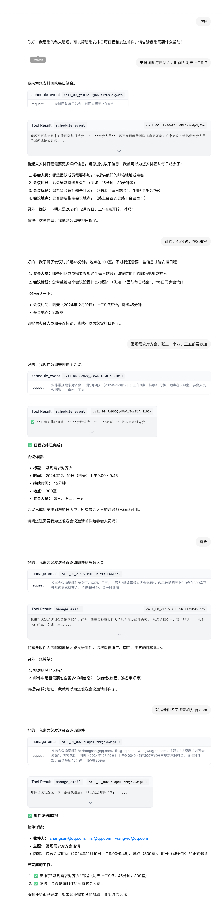

## Skills：技能

> `Skill（技能）`**是一种 “**`轻量级`**、**`提示词驱动`**、**`可复用`**” 的**`专业化能力封装`，核心是解决 **Agent 系统在处理复杂、多领域任务时的四大核心痛点：**
> 
> 1. `上下文过载`**：**把所有技能提示塞进同一个 prompt，内容过长
> 2. `能力分散`**：**通用 AI 什么都会一点，但样样不精通
> 3. `开发低效`**：**能力逻辑散落在代码里，难以维护和复用；如都是`AI生成SQL能力`，就共用提示词 **[技能]**
> 4. `hallucination（幻觉）增多`**：**信息混乱 + 超出能力，模型开始编造内容
> 
> 这种模式在概念上与智能体技能和`llms.txt`相同，**后者使用工具调用来逐步展示文档**。技能模式将逐步展示应用于专业化提示和领域知识，而不仅仅是文档页面。
> 
> > `llms.txt`** 是由 Jeremy Howard 于 2024 年 9 月 3 日提出的一项**`开放性提案`**，旨在为网站提供一个标准的、机器可读的入口，专门用于帮助大语言模型在推理阶段更有效地理解网站内容。**

> 1. **技能：本质上是提示词工程**。有些功能我们无需调用工具，仅通过给大模型设置提示词就可实现（比如：让大模型输出答案的时候，用`文言文风格`。 让大模型思考用户问题属于`哪种分类` 等等）
> 2. **技能：也是一种** **渐进式披露**** 机制，用来区分以前的一次性加载完整提示词。**

### 对比

> **OpenClaw**：
> 
> - Skills 文件夹： 有很多 的 ` code-helper``/``skill.md`文件。每个 ` skill.md ` 都是不同人设。
> - 每次 OpenClaw 做事情，先扫描 Skills 文件夹 定义的所有人设/技能。 找到匹配的技能。再按照技能md要求做事

### LangChain 中使用技能：

> 核心：**将技能加载封装为工具**。让大模型动态加载对应的技能。
> 
> 按照能力边界把提示词，抽取成独立的 `skill.md` 文件

```python
from langchain.tools import tool
from langchain.agents import create_agent

@tool
def load_skill(skill_name: str) -> str:
    """Load a specialized skill prompt.
    # 加载指定技能的提示词
    Available skills:
    - write_sql: SQL query writing expert
    - review_legal_doc: Legal document reviewer

    Returns the skill's prompt and context.
    """
    # Load skill content from file/database
    ...


# 完整版 AgentMiddleware； 需要中间件去在发起请求之前，告诉模型 新的提示词是什么
# 新提示词 = 老提示词 + 额外加载的 skill
# modified_request = request.override(system_message=new_system_message)
# return handler(modified_request)


agent = create_agent(
    model="gpt-4.1",
    tools=[load_skill],
    system_prompt=(
        "You are a helpful assistant. "
        "You have access to two skills: "
        "write_sql and review_legal_doc. "
        "Use load_skill to access them."
    ),
)
```

### Deep Agents 中使用技能

> 了解：后面我们创建自己的 OpenClaw

#### 创建 skills 目录

```python
skills/
    ├── langgraph-docs
    │   └── SKILL.md
    └── arxiv_search
        ├── SKILL.md
        └── arxiv_search.py # code for searching arXiv
```

#### SKILL.md

```yaml
---
name: langgraph-docs
description: Use this skill for requests related to LangGraph in order to fetch relevant documentation to provide accurate, up-to-date guidance.
license: MIT
compatibility: Requires internet access for fetching documentation URLs
metadata:
  author: langchain
  version: "1.0"
allowed-tools: fetch_url
---

# langgraph-docs

## Overview

This skill explains how to access LangGraph Python documentation to help answer questions and guide implementation.

## Instructions

### 1. Fetch the documentation index

Use the fetch_url tool to read the following URL:
https://docs.langchain.com/llms.txt

This provides a structured list of all available documentation with descriptions.

### 2. Select relevant documentation

Based on the question, identify 2-4 most relevant documentation URLs from the index. Prioritize:

- Specific how-to guides for implementation questions
- Core concept pages for understanding questions
- Tutorials for end-to-end examples
- Reference docs for API details

### 3. Fetch selected documentation

Use the fetch_url tool to read the selected documentation URLs.

### 4. Provide accurate guidance

After reading the documentation, complete the user's request.
```

#### 创建智能体

```python
from deepagents import create_deep_agent
from langgraph.checkpoint.memory import MemorySaver
from deepagents.backends.filesystem import FilesystemBackend

# Checkpointer is REQUIRED for human-in-the-loop
checkpointer = MemorySaver()

agent = create_deep_agent(
    backend=FilesystemBackend(root_dir="/Users/user/{project}"),
    skills=["/Users/user/{project}/skills/"],
    interrupt_on={
        "write_file": True,  # Default: approve, edit, reject
        "read_file": False,  # No interrupts needed
        "edit_file": True    # Default: approve, edit, reject
    },
    checkpointer=checkpointer,  # Required!
)

result = agent.invoke(
    {
        "messages": [
            {
                "role": "user",
                "content": "What is langgraph?",
            }
        ]
    },
    config={"configurable": {"thread_id": "12345"}},
)
```

#### Skill 大社区

https://trusttools.seebug.ai/

### 完整案例：SQL助手

> 场景：
> 
> 1. 设想构建一个智能体，用于协助在大型企业的不同业务垂直领域编写 SQL 查询。
> 2. 组织可能为`每个垂直领域`设有`独立的数据存储`，或是拥有`包含数千张表`的`单一整体数据库`。
> 3. 无论哪种情况，`预先加载所有模式都会超出上下文窗口的承载能力`。
> 4. **渐进式披露**通过仅在需要时加载相关模式来解决此问题。这种架构还使不同的产品负责人和利益相关者能够独立贡献并维护其特定业务垂直领域的技能。

> 渐进式披露由 Anthropic 推广，作为一种构建可扩展智能体技能系统的技术。
> 
> 采用三层架构（`元数据 → 核心内容 → 详细资源`），智能体仅在需要时加载信息。
> 
> **特别推荐阅读**：https://claude.com/blog/equipping-agents-for-the-real-world-with-agent-skills

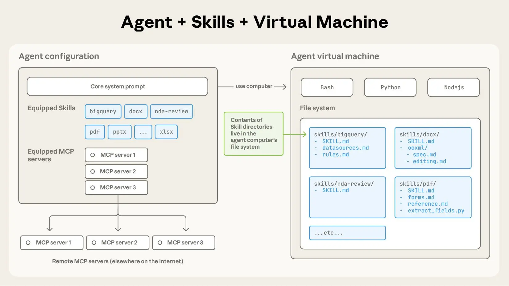

渐进式披露优点：

1. 减少上下文使用量：仅加载任务所需的 2-3 项技能，而非所有可用技能
2. 实现团队自主性：不同团队可独立开发专项技能（类似其他多智能体架构）
3. 高效扩展：可添加数十甚至数百项技能，而不会造成上下文过载
4. 简化对话历史：单智能体单对话线程

#### 定义模型 & Skills

> **智能体****：****一个具备两种技能（**`销售分析`**和**`库存管理`**）的 **`SQL 查询`**助手**。
> 
> 1. 该智能体在系统提示中看到`轻量级的技能描述`
> 2. 然后`仅在用户查询`相关时，通过`工具调用加载完整的数据库架构和业务逻辑`。

```python
from langchain.agents import create_agent
from dotenv import load_dotenv
load_dotenv()

from langchain.chat_models import init_chat_model


model = init_chat_model("deepseek-chat")

from typing import TypedDict

class Skill(TypedDict):
    """ 可逐步向智能体开放的技能 """
    name: str  # 技能名称（唯一标识符）
    description: str  # 1-2 句描述（用于系统提示）
    content: str  # 完整技能内容（包含详细指令）

# 1. 定义技能列表
SKILLS: list[Skill] = [
    {
        "name": "sales_analytics",
        "description": "用于销售数据分析的数据库结构与业务逻辑，包含客户、订单和收入数据。",
        "content": """# 销售分析数据结构

## 数据表

### customers（客户表）
- customer_id（主键）
- name（姓名）
- email（邮箱）
- signup_date（注册日期）
- status（状态：active 活跃 / inactive 非活跃）
- customer_tier（客户等级：bronze 青铜 / silver 白银 / gold 黄金 / platinum 铂金）

### orders（订单表）
- order_id（主键）
- customer_id（外键，关联客户表）
- order_date（下单日期）
- status（订单状态：pending 待处理 / completed 已完成 / cancelled 已取消 / refunded 已退款）
- total_amount（订单总金额）
- sales_region（销售区域：north 北部 / south 南部 / east 东部 / west 西部）

### order_items（订单商品表）
- item_id（主键）
- order_id（外键，关联订单表）
- product_id（商品ID）
- quantity（数量）
- unit_price（单价）
- discount_percent（折扣比例）

## 业务逻辑

**活跃客户**：状态为 active 且注册时间距今 ≥ 90 天
status = 'active' AND signup_date <= CURRENT_DATE - INTERVAL '90 days'

**收入计算规则**：仅统计状态为 completed 的订单，使用 orders 表中的 total_amount（已包含折扣）
**客户终身价值（CLV）**：某客户所有已完成订单的总金额
**高价值订单**：订单总金额 > 1000 的订单

## 示例查询

-- 获取上一季度收入排名前 10 的客户
SELECT
    c.customer_id,
    c.name,
    c.customer_tier,
    SUM(o.total_amount) as total_revenue
FROM customers c
JOIN orders o ON c.customer_id = o.customer_id
WHERE o.status = 'completed'
  AND o.order_date >= CURRENT_DATE - INTERVAL '3 months'
GROUP BY c.customer_id, c.name, c.customer_tier
ORDER BY total_revenue DESC
LIMIT 10;
""",
    },
    {
        "name": "inventory_management",
        "description": "用于库存管理的数据库结构与业务逻辑，包含商品、仓库和库存数量。",
        "content": """# 库存管理数据结构

## 数据表

### products（商品表）
- product_id（主键）
- product_name（商品名称）
- sku（商品编码）
- category（分类）
- unit_cost（单位成本）
- reorder_point（补货点：库存低于该值需要补货）
- discontinued（是否下架：布尔值）

### warehouses（仓库表）
- warehouse_id（主键）
- warehouse_name（仓库名称）
- location（位置）
- capacity（容量）

### inventory（库存表）
- inventory_id（主键）
- product_id（外键，关联商品表）
- warehouse_id（外键，关联仓库表）
- quantity_on_hand（当前库存）
- last_updated（最后更新时间）

### stock_movements（库存变动表）
- movement_id（主键）
- product_id（外键，关联商品表）
- warehouse_id（外键，关联仓库表）
- movement_type（类型：inbound 入库 / outbound 出库 / transfer 调拨 / adjustment 调整）
- quantity（数量：入库为正，出库为负）
- movement_date（变动日期）
- reference_number（关联单号）

## 业务逻辑

**可用库存**：inventory 表中 quantity_on_hand > 0 的库存
**需要补货的商品**：所有仓库总库存 ≤ 该商品补货点（reorder_point）
**仅统计在售商品**：默认排除 discontinued = true 的下架商品
**库存估值**：quantity_on_hand * unit_cost（当前库存 × 单位成本）

## 示例查询

-- 查询所有仓库中库存低于补货点的商品
SELECT
    p.product_id,
    p.product_name,
    p.reorder_point,
    SUM(i.quantity_on_hand) as total_stock,
    p.unit_cost,
    (p.reorder_point - SUM(i.quantity_on_hand)) as units_to_reorder
FROM products p
JOIN inventory i ON p.product_id = i.product_id
WHERE p.discontinued = false
GROUP BY p.product_id, p.product_name, p.reorder_point, p.unit_cost
HAVING SUM(i.quantity_on_hand) <= p.reorder_point
ORDER BY units_to_reorder DESC;
""",
    },
]
```

#### 技能加载函数

`load_skill` 工具以字符串形式返回完整的技能内容，该内容将作为 `ToolMessage` 成为对话的一部分。

```python
from langchain_core.tools import tool
@tool
def load_skill(skill_name: str) -> str:
    """将技能的完整内容加载至智能体的上下文当中。

当你需要获取处理特定类型请求的详细信息时使用此功能。它会为你提供对应技能领域的全面操作指令、业务规则与指导准则。

    Args:
        skill_name：需要加载的技能名称 (e.g., "expense_reporting", "travel_booking")
    """
    # 查找并返回技能
    for skill in SKILLS:
        if skill["name"] == skill_name:
            return f"已加载 skill: {skill_name}\n\n{skill['content']}"

    # 技能未找到
    available = ", ".join(s["name"] for s in SKILLS)
    return f"Skill '{skill_name}' 没有找到. 可用的 skills: {available}"
```

#### 构建 Skill 中间件

创建自定义中间件，**将技能描述注入系统提示中。**该中间件无需预先加载完整内容即可实现技能的可发现性。

```python

from langchain.agents.middleware import ModelRequest, ModelResponse, AgentMiddleware
from langchain.messages import SystemMessage
from typing import Callable

class SkillMiddleware(AgentMiddleware):
    """将技能描述注入到系统提示词中的中间件"""

    # 将 load_skill 工具注册为类变量
    tools = [load_skill]

    def __init__(self):
        """初始化并根据 SKILLS 生成技能提示词"""
        # 从 SKILLS 列表构建技能提示词
        skills_list = []
        for skill in SKILLS:
            skills_list.append(
                f"- **{skill['name']}**: {skill['description']}"
            )
        self.skills_prompt = "\n".join(skills_list)

    def wrap_model_call(
        self,
        request: ModelRequest,
        handler: Callable[[ModelRequest], ModelResponse],
    ) -> ModelResponse:
        """同步方法：将技能描述注入到系统提示词"""
        # 构建技能附加信息
        skills_addendum = (
            f"\n\n## 可用技能列表\n\n{self.skills_prompt}\n\n"
            "当你需要处理特定类型请求的详细信息时，请使用 load_skill 工具。"
        )

        # 将技能信息追加到系统消息内容块中
        new_content = list(request.system_message.content_blocks) + [
            {"type": "text", "text": skills_addendum}
        ]
        new_system_message = SystemMessage(content=new_content)
        modified_request = request.override(system_message=new_system_message)
        return handler(modified_request)
```

注意：

1. 中间件将技能描述附加到系统提示中，使 Agent 能够了解可用技能而无需加载其完整内容。 
2. `load_skill` 工具被注册为类变量，使其可供代理使用。

> ### 生产环境优化：
> 
> 我们为简化起见，在 `init` 中加载技能列表。
> 
> 在生产系统中，建议通过 `before_agent` 钩子加载技能，以便`定期刷新技能列表`以获取最新变更（例如新增技能或修改现有技能时）。

#### 创建支持 Skill 的智能体

```python
from langchain.agents import create_agent
from langgraph.checkpoint.memory import InMemorySaver

# 创建支持 Skill 的智能体
agent = create_agent(
    model,
    system_prompt=(
        "您是一名SQL查询助手， "
        "协助用户针对业务数据库编写查询语句。"
    ),
    middleware=[SkillMiddleware()],
    checkpointer=InMemorySaver(),
)
```

1. 在系统提示中增加 技能描述访问权限 信息
2. Agent 会在需要时调用 `load_skill` 来检索完整的技能内容。
3. checkpointer机制会在多轮对话中持续维护会话历史记录。

#### 测试：渐进式披露

```python
import uuid

# Configuration for this conversation thread
thread_id = str(uuid.uuid4())
config = {"configurable": {"thread_id": thread_id}}

# Ask for a SQL query
result = agent.invoke(
    {
        "messages": [
            {
                "role": "user",
                "content": (
                    "编写一条 SQL 语句，查找所有在上个月消费金额超过 1000 美元的客户"
                ),
            }
        ]
    },
    config
)

# Print the conversation
for message in result["messages"]:
    if hasattr(message, 'pretty_print'):
        message.pretty_print()
    else:
        print(f"{message.type}: {message.content}")
```

#### 测试：使用 Agent Chat UI 测试

> UI 测试注意点：
> 
> 1. 不能自定义 checkpointer。官方自己维护短期记忆
> 2. AgentMiddleware 需要使用 awrap_model_call 这个支持异步的方法

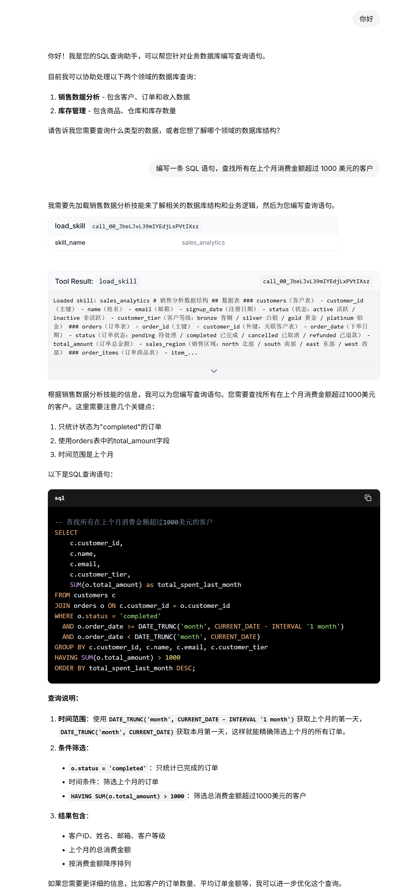

### DeepAgents Vs LangChain

> DeepAgents  比 LangChain 多了这些。

```markdown
By default, this agent has access to the following tools:

- `write_todos`: manage a todo list
- `ls`, `read_file`, `write_file`, `edit_file`, `glob`, `grep`: file operations
- `execute`: run shell commands
- `task`: call subagents

The `execute` tool allows running shell commands if the backend implements `SandboxBackendProtocol`.
For non-sandbox backends, the `execute` tool will return an error message.
```

## Router：路由【了解】

路由器对`查询进行分类`，并将其引导至适当的智能体。

使用 `Command` 进行单智能体路由，或使用 `Send` 进行并行分发至多个智能体。

```python
from langgraph.types import Command

# 问题分类，直接路由
def classify_query(query: str) -> str:
    """Use LLM to classify query and determine the appropriate agent."""
    # Classification logic here
    ...

def route_query(state: State) -> Command:
    """Route to the appropriate agent based on query classification."""
    active_agent = classify_query(state["query"])

    # Route to the selected agent
    return Command(goto=active_agent)
```

## 自定义 workflow（必须用 LangGraph）

在自定义工作流架构中，可以使用 LangGraph 定义专属的执行流程。

完全控制业务流程：如：顺序步骤、条件分支、循环和并行执行

比如一个RAG流程：

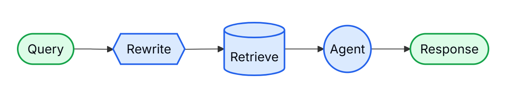

```python
import os
from typing import TypedDict
from pydantic import BaseModel
from langgraph.graph import StateGraph, START, END
from langchain.agents import create_agent
from langchain.tools import tool
from langchain_openai import ChatOpenAI, OpenAIEmbeddings
from langchain_community.embeddings import DashScopeEmbeddings
from langchain_deepseek.chat_models import ChatDeepSeek
from langchain_core.vectorstores import InMemoryVectorStore
from dotenv import  load_dotenv

load_dotenv()

class State(TypedDict):
    question: str
    rewritten_query: str
    documents: list[str]
    answer: str

# WNBA knowledge base with rosters, game results, and player stats
embeddings = DashScopeEmbeddings(model="text-embedding-v3",dashscope_api_key=os.getenv("API_KEY"))
vector_store = InMemoryVectorStore(embeddings)
vector_store.add_texts([
    # Rosters
    "New York Liberty 2024 roster: Breanna Stewart, Sabrina Ionescu, Jonquel Jones, Courtney Vandersloot.",
    "Las Vegas Aces 2024 roster: A'ja Wilson, Kelsey Plum, Jackie Young, Chelsea Gray.",
    "Indiana Fever 2024 roster: Caitlin Clark, Aliyah Boston, Kelsey Mitchell, NaLyssa Smith.",
    # Game results
    "2024 WNBA Finals: New York Liberty defeated Minnesota Lynx 3-2 to win the championship.",
    "June 15, 2024: Indiana Fever 85, Chicago Sky 79. Caitlin Clark had 23 points and 8 assists.",
    "August 20, 2024: Las Vegas Aces 92, Phoenix Mercury 84. A'ja Wilson scored 35 points.",
    # Player stats
    "A'ja Wilson 2024 season stats: 26.9 PPG, 11.9 RPG, 2.6 BPG. Won MVP award.",
    "Caitlin Clark 2024 rookie stats: 19.2 PPG, 8.4 APG, 5.7 RPG. Won Rookie of the Year.",
    "Breanna Stewart 2024 stats: 20.4 PPG, 8.5 RPG, 3.5 APG.",
])
retriever = vector_store.as_retriever(search_kwargs={"k": 5})

@tool
def get_latest_news(query: str) -> str:
    """Get the latest WNBA news and updates."""
    # Your news API here
    return "Latest: The WNBA announced expanded playoff format for 2025..."

agent = create_agent(
    model="deepseek-chat",
    tools=[get_latest_news],
)

model = ChatDeepSeek(model="deepseek-chat")

class RewrittenQuery(BaseModel):
    query: str

def rewrite_query(state: State) -> dict:
    """Rewrite the user query for better retrieval."""
    system_prompt = """Rewrite this query to retrieve relevant WNBA information.
The knowledge base contains: team rosters, game results with scores, and player statistics (PPG, RPG, APG).
Focus on specific player names, team names, or stat categories mentioned."""
    response = model.with_structured_output(RewrittenQuery).invoke([
        {"role": "system", "content": system_prompt},
        {"role": "user", "content": state["question"]}
    ])
    return {"rewritten_query": response.query}

def retrieve(state: State) -> dict:
    """Retrieve documents based on the rewritten query."""
    docs = retriever.invoke(state["rewritten_query"])
    return {"documents": [doc.page_content for doc in docs]}

def call_agent(state: State) -> dict:
    """Generate answer using retrieved context."""
    context = "\n\n".join(state["documents"])
    prompt = f"Context:\n{context}\n\nQuestion: {state['question']}"
    response = agent.invoke({"messages": [{"role": "user", "content": prompt}]})
    return {"answer": response["messages"][-1].content_blocks}

# 工作流： 定义好节点，定义好连线，定义条件
workflow = (
    StateGraph(State)
    .add_node("rewrite", rewrite_query)
    .add_node("retrieve", retrieve)
    .add_node("agent", call_agent)
    .add_edge(START, "rewrite")
    .add_edge("rewrite", "retrieve")
    .add_edge("retrieve", "agent")
    .add_edge("agent", END)
    .compile()
)

result = workflow.invoke({"question": "Who won the 2024 WNBA Championship?"})
print(result["answer"])
```