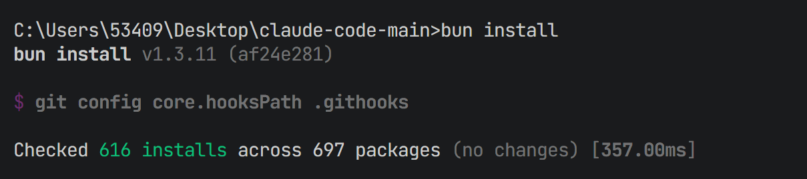
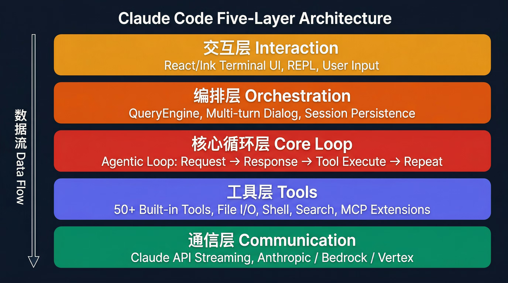
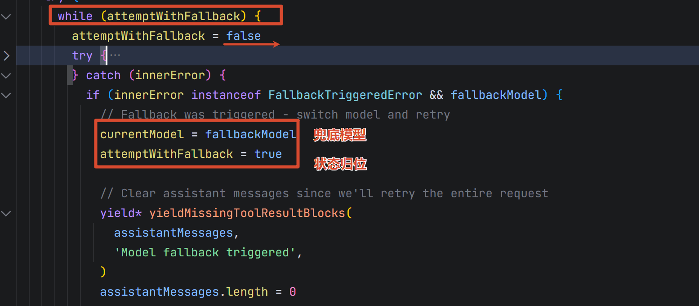
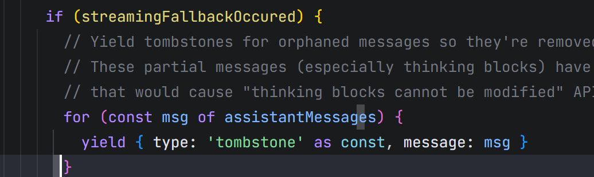
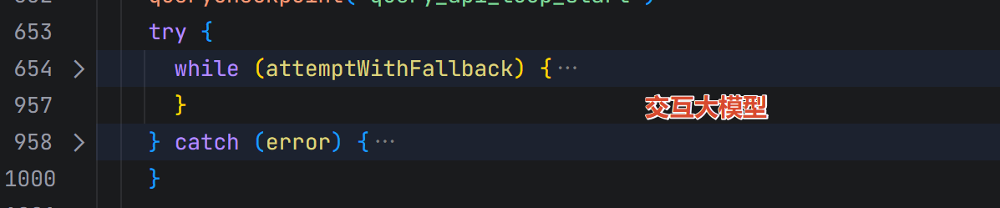
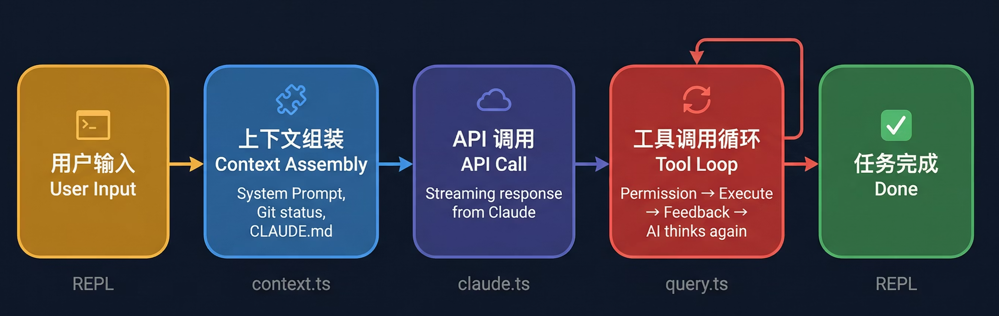
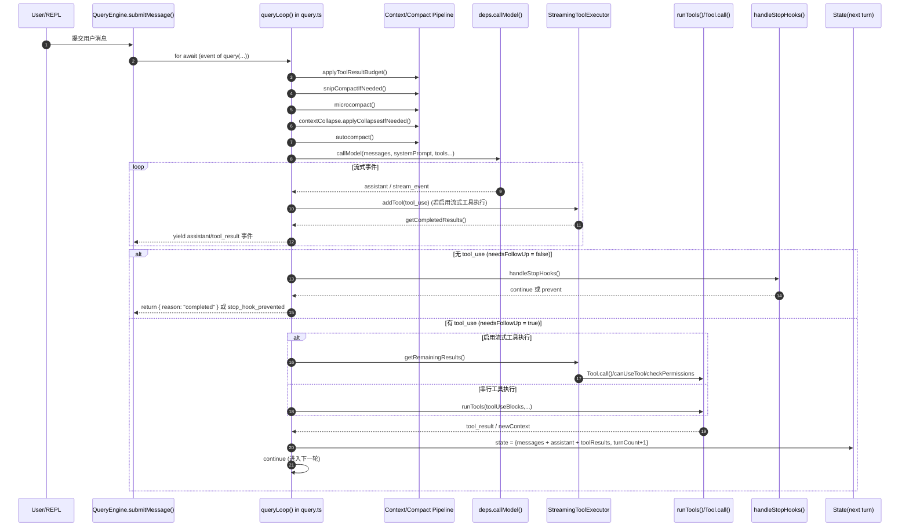
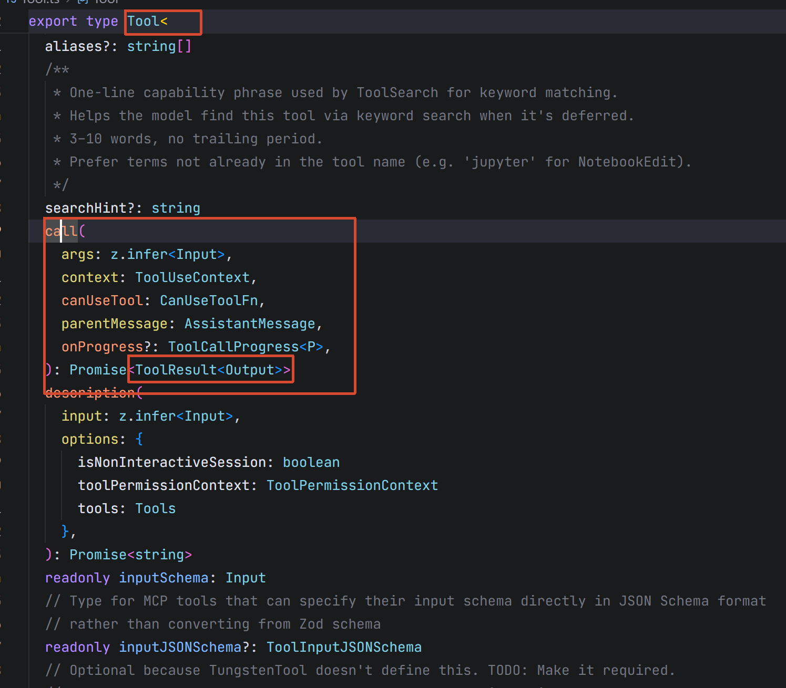
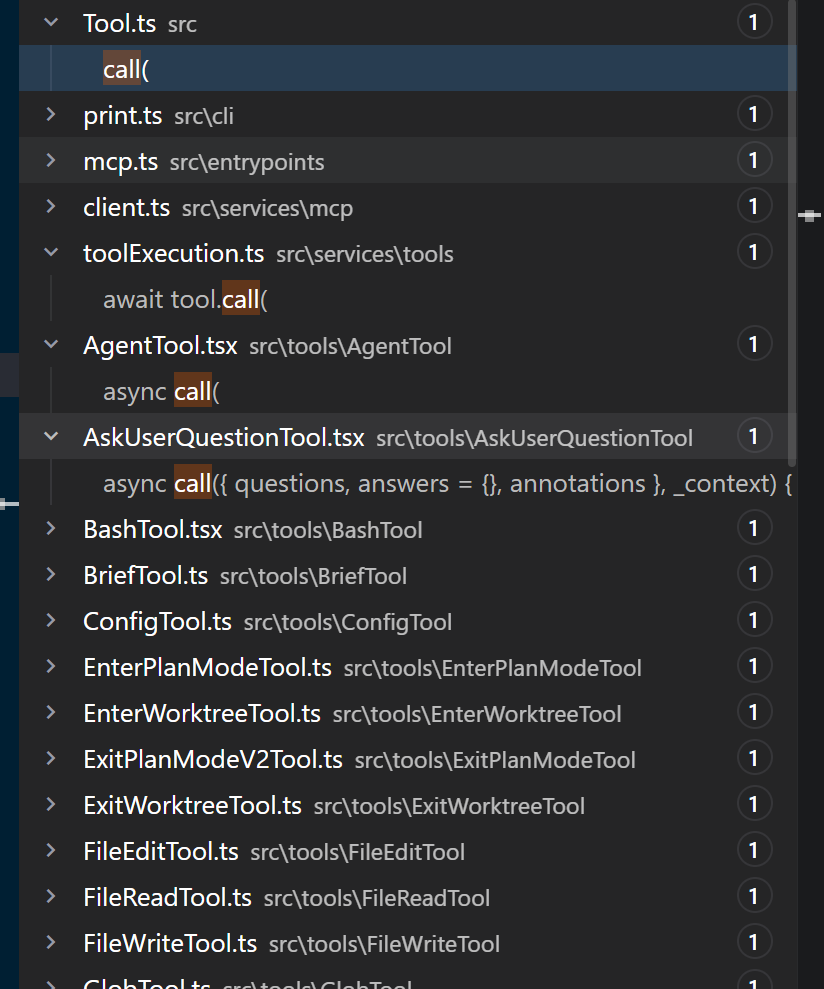

# 5. Claude Code 源码分析

# 基本用法

## 安装 claude code

> 注册并获取 api_key： https://api.xty.app/register?aff=PuZD

```python
npm install -g @anthropic-ai/claude-code
# 验证安装成功
claude --version

# ps 永久设置环境变量
setx ANTHROPIC_BASE_URL "https://claude.xty.app"
setx ANTHROPIC_API_KEY "sk-xxxxxxx"
```

## 下载 cc-switch

> 一键切换 cc 底层模型

https://github.com/farion1231/cc-switch/releases/tag/v3.12.3

> 用户目录 .claude 文件夹。以后 claude code工作期间所有的内容都在这里保存。

# 源码环境

## 下载源码

> 使用 git clone，或者直接下载 zip

https://github.com/claude-code-best/claude-code

## 安装依赖

> 如果是下载的 zip 包。必须先 git init 初始化为git 仓库。然后执行以下流程

```python
# 安装 bun 构建工具
npm install -g bun

# 安装项目依赖
bun install

```



## 启动项目

```python
# 开发模式, 看到版本号 888 说明就是对了
bun run dev

# 构建: 构建出的版本 bun 和 node 都可以启动, 
bun run build
```

> 启动报错，因为要默认连接 anthropic 授权

## 自定义 api_key

> 申请网站：
> 
> 1. https://api.xty.app/register?aff=PuZD

```python
# ps 永久设置环境变量
setx ANTHROPIC_BASE_URL "https://www.vibeapi.cn"
setx ANTHROPIC_API_KEY "sk-xxxxxxx"

bun run dev
```

## 使用自定义的 api_key

`/config` 配置：搜索 api_key，选择 use custom api_key，空格切换状态。

## 其他用法

`/status`：查看状态

`/model`：定制模型

## 源码概览

`Claude Code` 多Agent能力：

1. `工作流中的直接调用`： runSummaryAgent：直接在合适的时机运行会话总结的Agent
2. `Skill技能会被封装成子Agent`：类似工具调用去来执行

| 文件夹 | 主要功能 | 代表文件 | 与 Agent/运行流关系 |
| --- | --- | --- | --- |
| __tests__ | 核心单元测试 | src/__tests__/Tool.test.ts | 验证工具协议与执行行为 |
| assistant | Assistant 能力开关与入口封装 | src/assistant/index.ts | Agent 启用条件、门控逻辑 |
| bootstrap | 启动阶段状态初始化 | src/bootstrap/state.ts | 运行前构建全局 AppState |
| bridge | CLI/UI/远端会话桥接层 | src/bridge/replBridge.ts | 串联 REPL 事件、会话和远端通信 |
| buddy | Buddy 形态与提示词 | src/buddy/prompt.ts | 提供同伴式交互能力 |
| cli | CLI 运行时与子命令处理支撑 | src/cli/print.ts | 命令行模式下输入输出与生命周期 |
| commands | 各 slash/CLI 命令实现集合 | src/commands/help/index.ts | 用户触发动作的显式入口 |
| components | React/Ink UI 组件层 | src/components/App.tsx | 消息渲染、状态展示、交互控件 |
| constants | 常量与策略配置 | src/constants/prompts.ts | 提示词、限制、系统字段集中定义 |
| context | React Context 状态容器 | src/context/stats.tsx | 跨组件共享运行态数据 |
| daemon | 后台守护进程入口 | src/daemon/main.ts | 长驻任务与后台协作 |
| entrypoints | 多入口启动文件 | src/entrypoints/cli.tsx | CLI/init/MCP 的引导层 |
| hooks | 自定义 React Hooks | src/hooks/useTextInput.ts | 输入、任务、IDE、语音等行为编排 |
| ink | 内建 Ink 渲染/终端引擎扩展 | src/ink/renderer.ts | 终端 UI 渲染基础设施 |
| jobs | 异步作业与分类任务 | src/jobs/classifier.ts | 自动分类与辅助决策 |
| keybindings | 快捷键语法、匹配与校验 | src/keybindings/parser.ts | 人机交互效率层 |
| memdir(长期记忆) | 项目记忆系统（MEMORY.md 等） | src/memdir/memdir.ts | 跨会话记忆加载、筛选、注入 |
| proactive | 主动建议/主动行为入口 | src/proactive/index.ts | 非被动问答式辅助 |
| query | query() 循环的子模块 | src/query/deps.ts | token 预算、停止钩子、状态转移 |
| schemas | 配置/协议 schema | src/schemas/hooks.ts | 约束输入结构、防止脏数据 |
| screens | 顶层界面屏幕 | src/screens/REPL.tsx | 用户交互主界面 |
| server | 本地服务与会话服务端 | src/server/server.ts | 连接管理、日志、锁 |
| services | 对外能力服务层（API/MCP/OAuth/LSP） | src/services/api/claude.ts | 模型调用、协议适配、第三方接入 |
| skills | Skill 机制与内置技能 | src/skills/bundled/index.ts | 可复用的“高阶动作”封装 |
| src | 兼容/迁移层的次级源码镜像 | src/src/utils/api.ts | 历史路径兼容与过渡实现 |
| state | 全局状态存储与选择器 | src/state/AppStateStore.ts | Agent 运行态核心状态中心 |
| tasks | 任务对象、停止、标签逻辑 | src/tasks/stopTask.ts | Todo/后台任务管理 |
| tools | 各工具 UI 与适配层 | src/tools/AgentTool/UI.tsx | Agent 调用工具时的呈现与行为 |
| types | 全局 TypeScript 类型定义 | src/types/tools.ts | 统一协议、降低耦合 |
| upstreamproxy | 上游代理转发 | src/upstreamproxy/relay.ts | 网络/请求中继 |
| utils | 最大的通用能力库 | src/utils/systemPrompt.ts | git、文件、计划、token、模型等底层能力 |
| vim | Vim 编辑动作模型 | src/vim/motions.ts | Vim 模式键位与编辑语义 |

# 架构

## 五层架构



*📊 在线表格（无数据）*

## queryLoop核心逻辑

1. 接收用户的查询请求； query
2. 去 `memory`(用户记忆 .claude/CLAUDE.md) 中，找相关内容; `startRelevantMemoryPrefetch`
3. 准备一些核心数据：`messages`、pendingToolUseSummary、`toolUseContext`等
4. 去 找 skill 技能：`startSkillDiscoveryPrefetch`
5. 查询检查点： `queryCheckpoint`; 记录程序运行到的步骤，方便后续崩溃恢复
6. 准备消息（判断是否需要进行压缩，如果需要`消息压缩`，压缩完消息后返回）：messagesForQuery；`getMessagesAfterCompactBoundary`； 
7. `applyToolResultBudget`： 准备工具调用相关的消息； 找工具
  1. `一堆工具`。把工具的信息构造好。要一起发给大模型
  2. 大模型将来从工具中决定调用哪些；
8. `microcompact`：消息`微压缩`； 
  1. 删除无用工具返回字段
  2. 如果有历史工具调用结果，也会压缩历史消息
9. 构建一个完整的系统提示词：`asSystemPrompt`
10. 对所有东西（系统提示词、用户问题、工具上下文...）`自动压缩`：`autocompact`
11. `finalContextTokensFromLastResponse`：任务上下文的 token预算
12. `buildPostCompactMessages`：后置消息压缩
13. **使用兜底模式**：调用模型
  1. 正常调用



- 兜底调用：返回 tombstone（墓碑消息）； 程序中断，等待恢复



- 工具在线程池中被调度调用；
  - 调用的结果会压到`消息表`：

## 13 步以后的详情

### 第13步（参考 `queryLoop `里面的分析）



1. 大模型执行完成后：大模型返回了消息；如果消息中包含工具调用。cc还要在线程池后台做工具调用
2. **用户主动中断**：等待所有工具调用完成，组装最终的结果；（后台工具）
3. 其他命令、skill信息都更新完成后。返回新的 state。进入新的轮次

## 四大核心设计原则

### 流式优先 (Streaming-first)

所有 API 通信都是流式的——`deps.callModel()` 返回 **AsyncGenerator**，用户看到 AI “逐字打出”回答。StreamingToolExecutor **在流式过程中就开始并行执行工具，不等流结束。**

**模型降级 Fallback 时**，已收集的 assistantMessages 被标记为 **tombstone(墓碑)** 并清空，重试整个流式请求。

看到 `queryLoop`：查询循环；


### 工具即能力 (Tool as Capability)

每个工具是 `Tool<Input, Output, Progress>` 结构化类型，通过 `buildTool()` 工厂创建。

`getTools()` 在每次 API 调用时组装（非全局缓存），因为 `isEnabled()` 可能随运行时状态变化。

MCP 工具通过 `mcpInfo` 字段标记来源，支持 server 级别的 blanket deny（全盘否认）。

### 权限即边界 (Permission as Boundary)

每次工具调用经过 `validateInput() → checkPermissions()` 双重检查。

权限规则从 5 个来源汇聚（session → project → user → managed → default），支持工具名、命令模式、路径前缀等匹配方式。

Plan Mode 通过 `prepareContextForPlanMode()` 切换为只读模式，退出时自动恢复。

### 上下文即记忆 (Context as Memory)

System Prompt 由 `fetchSystemPromptParts()` 动态组装，包含 `CLAUDE.md`、git 状态、日期、MCP 服务器列表。Auto-compact 在每轮迭代前评估 token 阈值，**超出时触发压缩**。压缩后的**摘要**通过 `buildPostCompactMessages()` **替换原始消息**，`taskBudgetRemaining` 跨压缩边界累计。

## 数据流分析



整个系统的运转可以浓缩为一条核心数据流，以下是每一步对应的源码路径：

### 用户输入 → REPL

`src/screens/REPL.tsx` 是基于 React/Ink 的终端 UI 组件。用户输入经 `processUserInput()`（`src/utils/processUserInput/processUserInput.ts`）处理，支持斜杠命令、文件附件、图片等。

### QueryEngine 编排

`src/QueryEngine.ts` 是 REPL 与 `query()` 之间的中间层，管理：

- 会话状态：消息数组、工具权限上下文（`ToolPermissionContext`）、文件历史快照
- 成本追踪：`accumulateUsage()` / `getTotalCost()` 累计 token 用量
- Transcript 持久化：`recordTranscript()` 将对话序列化到磁盘，支持 `--resume`
- 文件历史：`fileHistoryMakeSnapshot()` 在修改前创建快照，支持 undo

关键方法：`queryEngine.query()` 构造 `QueryParams`，调用 `query()` 异步生成器。

### Agentic Loop（`src/query.ts`）

`query()` 是一个 `AsyncGenerator`，`while(true)` 循环的每次迭代包含：

```python
① 上下文预处理管道：
   applyToolResultBudget → snipCompact → microcompact → contextCollapse → autocompact

② 流式 API 调用：
   deps.callModel() → AsyncGenerator<StreamEvent | Message>
   收集 assistantMessages[]、toolUseBlocks[]

③ 工具执行：
   StreamingToolExecutor（并行） 或 runTools（串行）
   → toolResults[]

④ 终止/继续判定：
   needsFollowUp ? continue : return { reason }
```

完整的状态机通过 `State` 类型（`src/query.ts:204`）在迭代间传递，包含 10 个字段（messages、autoCompactTracking、maxOutputTokensRecoveryCount 等）

### 工具层（`src/tools.ts` → `src/Tool.ts`）

`getAllBaseTools()`（`src/tools.ts:191`）组装 50+ 工具列表，经过 `filterToolsByDenyRules()` 权限过滤后传给 API。

每个工具实现 `Tool<Input, Output, Progress>` 接口（`src/Tool.ts:362`），核心方法链：

`validateInput()`** → **`canUseTool()（UI 层）`**→ **`checkPermissions() `**→ **`call()`** → **`ToolResult`

### 通信层（`src/services/api/claude.ts`）

API 客户端支持 4 种 Provider：

- Anthropic Direct：默认
- AWS Bedrock：`ANTHROPIC_BEDROCK_BASE_URL`
- Google Vertex：`ANTHROPIC_VERTEX_PROJECT_ID`
- Azure：通过自定义 base URL

`deps.callModel()` 发起流式请求，返回 `BetaRawMessageStreamEvent` 事件流。支持 Prompt Cache（`cache_control`）、thinking blocks、multi-turn tool use。

# 调用链

## 主链路

`用户输入 -> REPL -> QueryEngine -> query() Agentic Loop -> callModel -> 工具执行 -> 状态落盘/回写 -> UI 下一轮`：

`src` 根目录中的关键文件（如 `main.tsx`、`QueryEngine.ts`、`query.ts`、`tools.ts`）承担主流程，不属于某个子文件夹，但在调用链中处于核心位置。

*📊 在线表格（无数据）*

## `queryLoop()` 的一次迭代



*📊 在线表格（无数据）*

> 大总结： 
> 
> 1. **各种压缩消息**（分层压缩机制）
> 2. **把消息发给大模型**：（完整的用户消息、提示词、skill技能、工具列表）
> 3. 获取各种结果（AI消息，工具执行）
>   1. 把所有工具丢给线程池执行，并等待得到结果
>   2. 封装**所有的结果**
> 4. 进入**下一轮**

# 短期记忆

**短期记忆**的三种常见形态

*📊 在线表格（无数据）*

## 触发时机与流程

*📊 在线表格（无数据）*

## **会话内消息****记忆**

> 会话内消息记忆，不包含 `session-memory/summary.md` 的异步摘要机制。

### 核心点

*📊 在线表格（无数据）*

### 单turn流程

| 步骤 | 触发点 | 关键函数 | 输入消息集 | 输出消息集 | 记忆状态变化 |
| --- | --- | --- | --- | --- | --- |
| 1 | 用户提交 prompt | submitMessage() | 历史 mutableMessages + 当前输入 | messagesFromUserInput | 新输入先写入 mutableMessages |
| 2 | 进入模型循环前 | const messages = [...this.mutableMessages] | 最新会话数组 | query 初始消息快照 | 形成本轮“读取视图” |
| 3 | queryLoop 启动 | state.messages = params.messages | 上一步快照 | state.messages | 状态机获得本轮基线记忆 |
| 4 | 调模型前预处理 | applyToolResultBudget -> snip -> microcompact -> collapse | state.messages | messagesForQuery | 记忆压缩/整形，得到可发送窗口 |
| 5 | 模型流式返回 | deps.callModel() + assistantMessages.push(...) | messagesForQuery | assistant 增量块 | 本轮 assistant 记忆先进入临时缓冲 |
| 6 | 工具流式/批量执行 | StreamingToolExecutor 或 runTools() + toolResults.push(...) | tool_use 块 | tool_result/attachment | 本轮工具记忆进入临时缓冲 |
| 7 | 轮末附加上下文 | getAttachmentMessages(...) | messagesForQuery + assistant + toolResults | 额外 attachment | 文件变更/队列通知并入本轮记忆 |
| 8 | 组装下一轮状态 | state = { messages: [...messagesForQuery, ...assistantMessages, ...toolResults], ... } | 本轮全部缓冲 | 新 state.messages | 本轮结果正式变成下一轮“短期记忆” |
| 9 | QueryEngine 消费事件 | for await (const message of query(...)) | query 事件流 | messages.push(...) / this.mutableMessages.push(...) | 会话容器与状态机保持一致 |
| 10 | transcript 落盘 | recordTranscript(messages) | 最新消息序列 | 持久化记录 | 会话内记忆可恢复、可重放 |

### 几个不变量

*📊 在线表格（无数据）*

## **Session Memory 抽取**

> Session Memory 抽取本质是：**在**`主对话每轮后`**，用**`阈值驱动`**的、**`串行化`**(队列)的、最小权限 forked-agent 流程，把“会话增量信息”沉淀到 **`summary.md`**，并为后续 SM-compact 提供可复用的高密度短期记忆。 **
> 
> 排队的优点就是：（并行变串行）
> 
> 1. 无文件锁竞争；
> 2. 消息是有顺序；

### Session Memory 抽取核心代码（按职责）

*📊 在线表格（无数据）*

### 抽取流程

*📊 在线表格（无数据）*

### 抽取判定逻辑拆解（`shouldExtractMemory`）

| 判定维度 | 代码实现 | 默认语义 | 目的 |
| --- | --- | --- | --- |
| 初始化阈值 | hasMetInitializationThreshold(currentTokenCount) | 上下文达到一定规模后才启用 | 避免会话初期“信息太少”就抽取 |
| 增量 token 阈值 | hasMetUpdateThreshold(currentTokenCount) | 相比上次抽取有足够上下文增长 | 避免重复总结同一批内容 |
| 工具调用阈值 | toolCallsSinceLastUpdate >= getToolCallsBetweenUpdates() | 工具交互足够多时优先触发 | 在“工具密集阶段”及时提炼经验 |
| 对话自然断点 | !hasToolCallsInLastAssistantTurn(messages) | 最后一轮不再 tool_use 时可触发 | 倾向在语义断点做抽取，减少中途噪声 |
| 最终条件 | (token阈值 && tool阈值) OR (token阈值 && 最后一轮无tool) | token 阈值始终必需 | 兼顾“信息量”与“抽取时机” |

### 与后续 SM-Compact 的衔接点

*📊 在线表格（无数据）*

## **Session Memory 参与**`压缩回灌`

> Session Memory 参与压缩回灌的本质是：**在**`自动压缩点`**优先用 **`summary.md`** 替代“**`重新总结整段历史`**”，再拼接一段经过 API 不变量保护的**`近期原始上下文`**，从而**`以更低成本保持会话连续性`**；若任何条件不满足，立即无损回退到传统 compact。**
> 
> > 每一轮结束进行 转录压缩总结内容，落盘 到 `summary.md`

关注几点：

1. 何时触发 SessionMemory-compact
2. 如何把 `summary.md` 回灌进主对话消息链
3. 失败时如何回退到传统 compact

### 核心代码

*📊 在线表格（无数据）*

压缩：本轮压缩 + 抽取上轮数据

`100字` + `1000 字` = `120 字`

### 详细流程

| 步骤 | 触发点 | 关键函数 | 输入 | 输出 | 状态变化 |
| --- | --- | --- | --- | --- | --- |
| 1 | queryLoop 预处理阶段判断需压缩 | autoCompactIfNeeded(messages, ...) | 当前会话消息数组 | 压缩决策 | 进入 autocompact 主路径 |
| 2 | 命中压缩条件后优先尝试 SM 路径 | trySessionMemoryCompaction(messages, agentId, threshold) | 当前消息、agentId、阈值 | CompactionResult \| null | 决定走 SM-compact 或回退 |
| 3 | 进入 SM 路径前防竞争 | waitForSessionMemoryExtraction() | 抽取状态 | 等待完成或超时继续 | 避免读到半写 summary.md |
| 4 | 读取摘要与边界信息 | getSessionMemoryContent() + getLastSummarizedMessageId() | summary.md、上次摘要消息 id | 摘要文本 + 边界指针 | 为“保留哪些原消息”做准备 |
| 5 | 无可用摘要则放弃 SM | !sessionMemory 或 isSessionMemoryEmpty(...) | 文件不存在/仅模板 | null | 回退到 legacy compact |
| 6 | 计算保留消息起点 | calculateMessagesToKeepIndex(messages, lastSummarizedIndex) | 全量消息、边界点、阈值配置 | startIndex | 选出要保留的近期上下文 |
| 7 | 修复工具/thinking 连续性 | adjustIndexToPreserveAPIInvariants(...) | 候选切分点 | 调整后的切分点 | 防止 API 约束被破坏 |
| 8 | 组装 SM 压缩结果 | createCompactionResultFromSessionMemory(...) | 摘要文本、保留消息、hook结果 | CompactionResult | 形成 boundary + summary + keep-tail |
| 9 | 重建 post-compact 消息链 | buildPostCompactMessages(compactionResult) | CompactionResult | 新消息序列 | Session Memory 完成“回灌” |
| 10 | 阈值复核（自动压缩场景） | postCompactTokenCount < autoCompactThreshold | 新消息 token 数 | 通过/失败 | 失败则回退到 legacy compact |
| 11 | 成功收尾 | setLastSummarizedMessageId(undefined) + runPostCompactCleanup() | 压缩结果 | wasCompacted: true | 清理状态，交由主循环替换消息 |
| 12 | 主循环继续 | query.ts 中使用 buildPostCompactMessages(...) 结果 | 压缩后消息链 | 下一轮请求输入 | 摘要记忆 + 近期执行上下文共同进入下一轮 |

### 回退分支（何时不用 Session Memory 回灌）

| 场景 | 触发条件 | 行为 |
| --- | --- | --- |
| 功能开关关闭 | shouldUseSessionMemoryCompaction() 返回 false | 直接走传统 compactConversation(...) |
| Session Memory 文件不存在 | getSessionMemoryContent() 返回 null | 回退传统 compact |
| Session Memory 仍是模板 | isSessionMemoryEmpty(...) 为 true | 回退传统 compact |
| 边界消息找不到 | lastSummarizedMessageId 在当前 messages 中不存在 | 回退传统 compact |
| SM 后 token 仍过高 | postCompactTokenCount >= autoCompactThreshold | 回退传统 compact |
| 运行异常 | trySessionMemoryCompaction 捕获错误 | 记录事件后回退传统 compact |

# 长期记忆

> Claude Code 的`长期记忆`是一个**文件化、可筛选、按需注入**的系统：记忆先沉淀到 `memdir`，每轮再通过语义检索挑选**少量高相关**内容`回灌到上下文`，从而实现跨会话连续性而不显著增加推理负担。

## 核心代码

*📊 在线表格（无数据）*

## 长期记忆主流程（读取与注入）

> 读取以前做过的事情，和用户这次问题所有相关性高的消息

> 长期记忆的数据，会被作为大模型的系统提示词；
> 
> selectRelevantMemories：依赖大模型判定memory内容和用户query的相关性数据

*📊 在线表格（无数据）*

## 长期记忆`写入流程`（抽取与沉淀）

| 步骤 | 触发点 | 关键函数 | 输入 | 输出 | 说明 |
| --- | --- | --- | --- | --- | --- |
| 1 | 回合结束后的抽取时机 | extractMemories 服务链路 | 最新会话消息 | 待写记忆候选 | 识别“代码中不可推导”的信息 |
| 2 | 类型化与格式化 | memoryTypes 规则 + frontmatter 结构 | 候选记忆文本 | 标准化 markdown 记忆文件 | 保持记忆结构可检索 |
| 3 | 写入目录与索引更新 | memdir 相关写入逻辑 | 新记忆内容 | 记忆文件 + MEMORY.md 索引更新 | 新记忆可在后续会话被召回 |

## 为什么它是长期记忆

| 设计点 | 代码体现 | 目的 |
| --- | --- | --- |
| 文件化存储 | memdir/*.ts 统一读写 markdown | 持久化、可审计、易迁移 |
| 轻量语义召回 | findRelevantMemories() + sideQuery | 不做全量注入，降低 token 开销 |
| 预取并行化 | startRelevantMemoryPrefetch() | 记忆检索隐藏在主流程耗时里 |
| 去重与抗噪 | alreadySurfaced/recentTools | 提升召回有效信息密度 |
| 与主循环解耦 | 以 attachment 注入而非强耦合状态 | 不破坏 query 主状态机 |

# 工具调用

> Claude Code 的工具调用是一个**协议统一 + 权限前置 + 并发分批 + 消息闭环**的执行系统：模型提出 `tool_use`，运行时按权限与并发规则执行，并把 `tool_result` 回写到消息链中驱动下一轮推理。

## 核心代码

| 职责 | 核心代码位置 | 说明 |
| --- | --- | --- |
| 工具抽象协议 | src/Tool.ts：Tool<Input, Output> | 定义 inputSchema/call/checkPermissions/isReadOnly/isConcurrencySafe 等统一接口 |
| 内置工具注册 | src/tools.ts：getAllBaseTools() | 声明系统可用工具全集 |
| 权限过滤 | src/tools.ts：filterToolsByDenyRules()、getTools() | 在模型看到工具前做 deny 过滤 |
| 内置+MCP 合池 | src/tools.ts：assembleToolPool() | 合并 built-in 与 MCP 并去重排序 |
| 单轮工具执行入口 | src/query.ts：runTools(...) / StreamingToolExecutor | 执行本轮 tool_use |
| 串行/并行编排 | src/services/tools/toolOrchestration.ts | 按 isConcurrencySafe 分批并发或串行 |
| 单个工具执行细节 | src/services/tools/toolExecution.ts | 解析输入、权限检查、调用 tool、产出 tool_result |
| 结果并回消息链 | src/query.ts：toolResults.push(...) + state = {...} | 工具结果成为下一轮模型输入 |

## 工具调用详细流程（函数级）

*📊 在线表格（无数据）*

工具接口声明





## 保护机制

*📊 在线表格（无数据）*

## 工具调用中的数据形态

*📊 在线表格（无数据）*

`分层可导航小世界`：HNSW

**DDD完全形态：**

1. **分包**：按照领域分包
2. **事件驱动**：业务所有的状态变化（反馈到持久层），都需要事件驱动
3. **CommandQueryRS**：**命令**和**查询**进行职责分离
  1. Command： -> 领域对象（业务Service） -> 领域实体（对应数据库）

# Skills 

> Claude Code 的 `Skills`是建立在`命令系统`之上的**可参数化、可治理、可模型调用的能力模板层**：
> 
> 它通过统一 `Command` 管线装载，通过 `SkillTool` 暴露给模型，并持续受权限系统约束。

## 核心代码

*📊 在线表格（无数据）*

## Skills 装载流程（构建期/会话期）

*📊 在线表格（无数据）*

## 模型调用 Skills 流程（运行期）

> Skill 就是一些 固化的 skill.md 提示词。告诉大模型怎么做事
> 
> 1. 每轮对话，去磁盘加载skill
> 2. 把 skill 追加到 msg 发给大模型

*📊 在线表格（无数据）*

## Skills 与 Commands 的关系

*📊 在线表格（无数据）*

# HITL（Human In The Loop）: 人机协同

> `Claude Code` 的 HITL 不是单一弹窗，而是一条`规则引擎`** + **`模式约束`** + **`工具专属检查`** +**` 交互审批`** + **`持久化学习`的完整决策链，确保自动化效率和安全边界可同时成立。

1. 工具调用如何进入审批流
2. 权限规则如何产生 `allow/ask/deny`
3. `计划模式（Plan Mode）`如何构成`双审批闸门`

## 核心代码

*📊 在线表格（无数据）*

## HITL 主流程（工具调用审批）

*📊 在线表格（无数据）*

## Plan Mode 的 HITL 闭环

*📊 在线表格（无数据）*

## 决策来源与优先级

*📊 在线表格（无数据）*