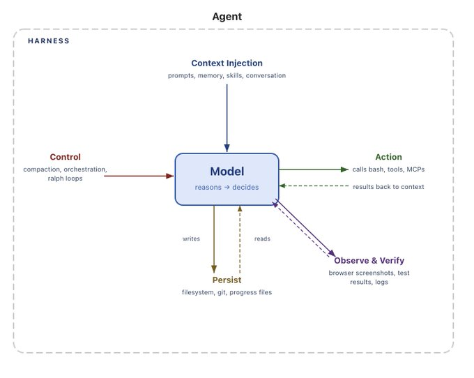
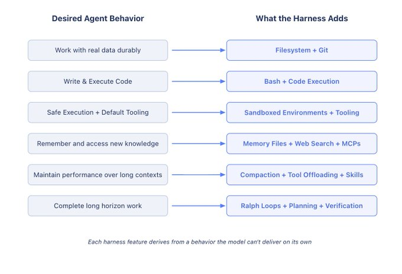
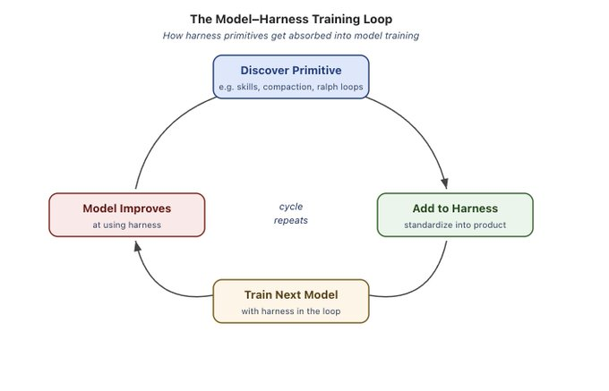
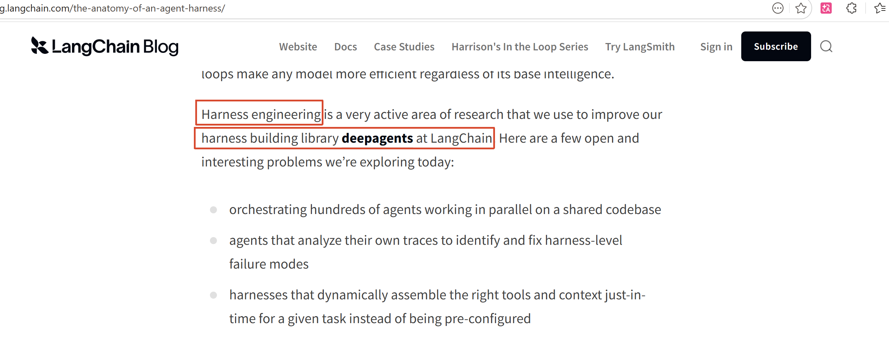

# 6. Harness 工程

# 什么是 Harness

⭐⭐⭐⭐⭐强烈建议阅读：https://blog.langchain.com/the-anatomy-of-an-agent-harness/

> Harness（框架） 这个词来自马术——缰绳、马鞍、嚼子——一整套用来驾驭强壮但不可预测动物的装备。
> 
> **映射到 AI Agent 领域**：
> 
> - **模型** = 马：强大、快速，但自己不知道往哪跑
> - **Harness **= 缰绳系统：约束、反馈回路、文档、工具编排、生命周期管理
> - **工程师 **= 骑手：不再亲自写代码，而是设计让 Agent 可靠写代码的「环境」
> 
> **老公式: ** <u>**Agent = Model + **</u><u>**（工具 + 记忆 + ReAct + Skills + 提示词）harness**</u>
> 
> **新公式：Agent = Model + Harness**

| 时间 | 事件 | 关键人物 |
| --- | --- | --- |
| 45962 | Anthropic 发布长时 Agent Harness 工程报告 | Anthropic 工程团队 |
| 46023 | Phil Schmid 预言”Agent Harness 将定义2026年” | Phil Schmid |
| 46058 | Mitchell Hashimoto 首次命名”Harness Engineering” | HashiCorp 联合创始人 |
| 46064 | OpenAI 发布百万行代码实验报告，标题使用”Harness Engineering” | OpenAI Codex 团队 |
| 46070 | Martin Fowler 网站发布权威评析 | Birgitta Böckeler / Thoughtworks |
| 46082 | LangChain 发布”Agent Harness 解剖学”，实证仅改Harness排名从Top30升至Top5 | LangChain 团队 |

# Harness 核心定义

## 智能体（Agent）= 大模型（Model）+ 控制框架/驾驭系统（Harness）

> 1. `模型`负责提供智能与推理能力
> 2. `控制框架`是模型之外的所有代码、配置、执行逻辑，负责让模型的智能真正可用

## 控制框架包含内容

1. 系统提示词、工具 / 技能、多智能体协作协议
2. 文件系统、沙箱、浏览器等基础环境
3. 编排逻辑（子智能体创建、任务交接、模型路由）
4. 确定性执行钩子 / 中间件（内容压缩、任务续跑、格式校验）

## **If you're not the model, you're the harness.**

# 为什么需要 Harness

原生大模型仅能处理文本 / 图像等输入并输出文本，**无法独立完成实用任务**：

- 无法持久化状态、跨会话保存工作
- 无法执行代码、安装依赖、搭建环境
- 无法获取实时知识、访问外部数据控制框架就是为弥补这些缺陷而设计的配套系统。

# 控制框架核心组件与作用

## 文件系统：持久存储与上下文管理

> 通过提供可持久化的文件读写空间，让模型超出上下文窗口限制保存与复用数据，并作为多智能体共享协作的中间载体。

- 解决模型上下文窗口有限、无法长期保存数据的问题
- 作为智能体工作区，可读写代码、文档，支持多智能体协作
- 结合 Git 实现版本管理、回滚错误、分支实验

## `Bash + 代码执行`：通用工具能力

> 向模型开放命令行与代码执行权限，使其能按需编写、运行代码来动态解决问题，不再依赖人工预先定义的固定工具。

- `替代为每个场景单独开发工具`，让`模型自主编写并执行代码`解决问题
- 模型可动态创建工具，不再局限于预设工具集，是自主解题的核心方案

## 沙箱环境：安全执行与验证

> 在隔离、可销毁的虚拟环境中运行模型生成的代码与操作，保证安全性与可扩展性，并预装基础工具链支持自检与调试。

- 提供隔离、安全的运行环境，避免本地执行风险
- 按需创建、销毁环境，支持大规模任务并行
- 预装运行时、CLI、浏览器等工具，支持模型自检、测试、排错

## 记忆与搜索：持续学习

> 利用`文件系统存储`会话知识实现长期记忆，并通过`搜索工具`拉取实时外部信息，弥补模型训练数据过时与知识有限的问题。

- 通过文件系统实现持久记忆，会话间复用知识
- 集成网页搜索等工具，突破模型训练数据时间限制，获取最新信息

## 上下文治理：对抗上下文退化

> 通过摘要压缩、大结果离线存储、技能延迟加载等策略，控制上下文长度与噪声，维持模型在长对话中的推理效率。

- `上下文压缩`：窗口占满时智能摘要、卸载冗余信息
- `工具输出卸载`：大体积结果`存入文件`，避免污染上下文
- `技能按需加载`：防止启动时加载过多工具导致性能下降

## 长时程自主执行

> 基于文件与 Git 持久化任务状态，通过循环机制强制模型续跑任务，并结合任务拆解与自检验证，实现长时间跨度的复杂任务闭环完成。放大工具权限 + 取消人工介入

- 依托文件系统 + Git 跨会话追踪进度
- 通过 `Ralph 循环`强制模型续跑任务，避免提前终止
  - 拦截退出，发现退出以后，结果检验，没有预期就继续
- 支持规划拆解任务 + 自检验证，保证复杂任务完成质量

# Harness 的未来：

## Model-Harness 协同训练

模型训练会结合 Harness 设计；

如今的智能体产品，如 Claude Code 和 Codex，**都通过模型与 Harness 框架的闭环训练进行后处理**。这有助于模型在执行框架设计者认为其本应擅长的操作上有所提升，例如文件系统操作、bash 命令执行、任务规划，或通过子智能体并行处理工作。

这就形成了一个`反馈循环`。**有用的基础组件被发现、添加到工具集中，然后在训练下一代模型时被使用**。随着这个循环不断重复，模型在其训练所用的工具集内会变得越来越强大。

## Harness Engineering 发展方向

> 随着模型能力不断增强，目前由 Harness框架 承担的部分功能将逐渐被模型吸收。**模型将在规划、自我验证和长期一致性**方面具备更强的`原生能力`，从而减少对上下文注入等外部干预的需求。

# DeepAgents：LangChain中的harness落地

1. 协调数百个代理在共享代码库上并行工作
2. 通过分析自身运行轨迹来识别和修复框架层面故障模式的智能体
3. 能够根据具体任务需求即时动态组装合适工具与上下文环境的框架，而非预先配置的固定方案

> **模型蕴含智能，而框架（harness）则是让这份智能得以发挥作用的系统。**