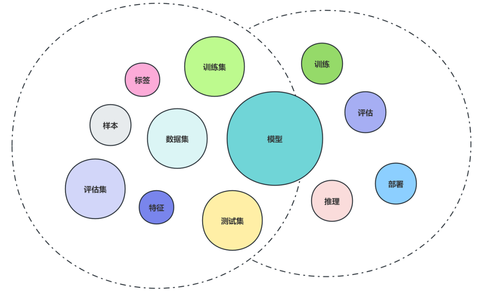
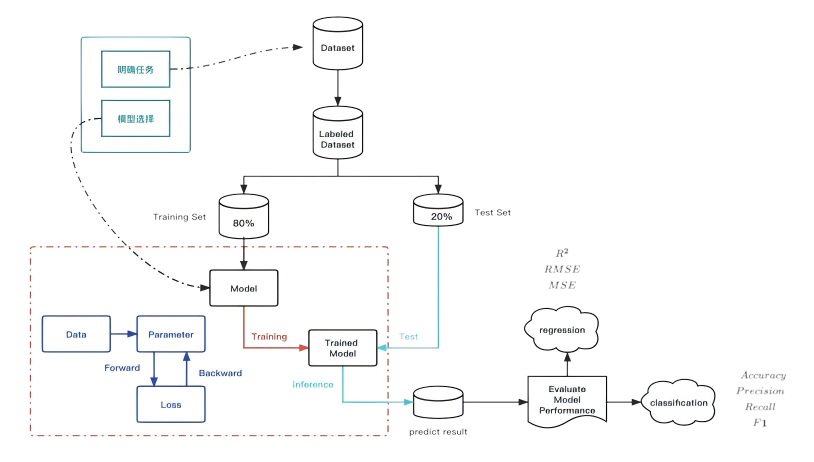
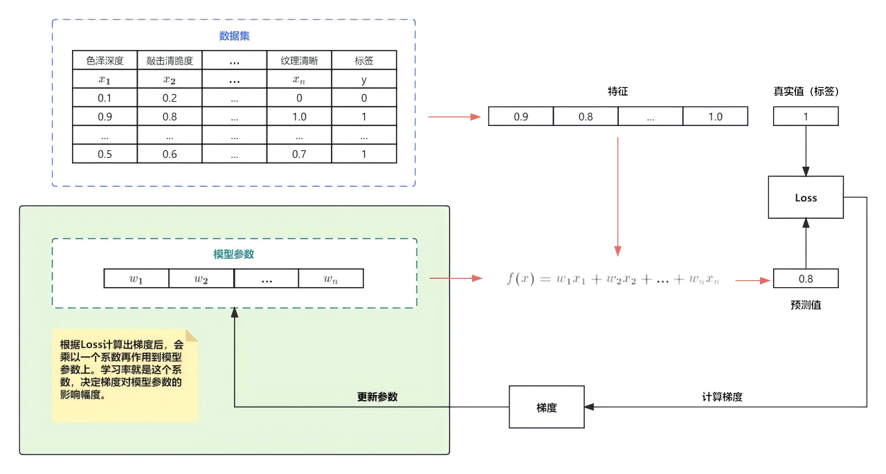

# 1. 《机器学习》快速搞定

## 基本数学

1. 导数与偏导数 
2. 矩阵与张量 
3. 概率 
4. 概率分布 
5. 似然函数

## 机器学习

### 基本概念（lr/epoch/batch_size）

### 基本流程

### 核心点

- 过拟合与⽋拟合 
- ⽅差与偏差 
- 正则化 
- 梯度下降算法 
- 混淆矩阵 
- PRF9. AUC & ROC 
- KNN（代码实现） 
- 逻辑回归 
- 朴素⻉叶斯 
- 极⼤似然估计 
- 集成学习-XGBoost 
- 聚类算法（K-means & DBScan） 
- 机器学习的完整训练过程