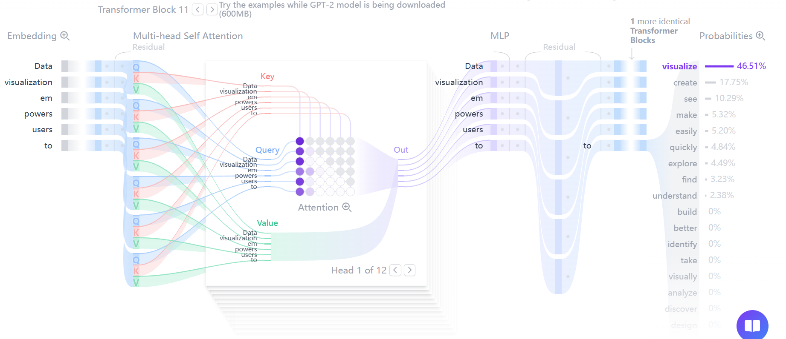
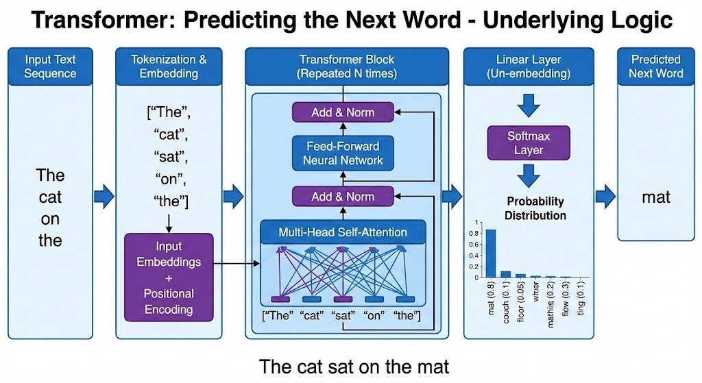
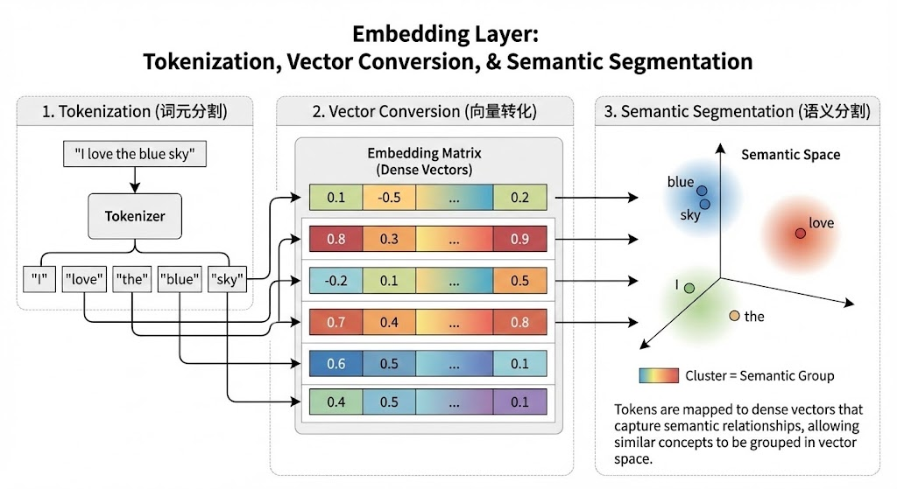
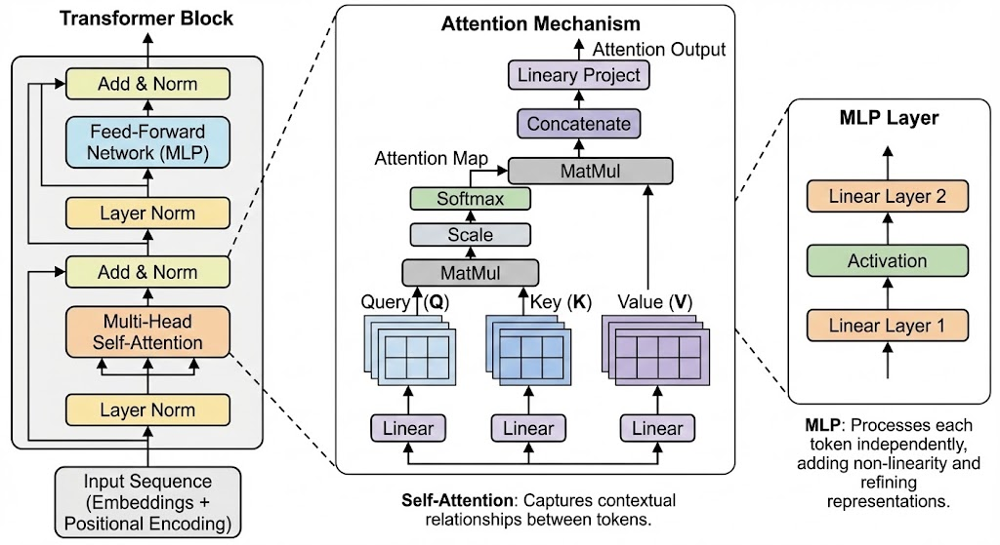
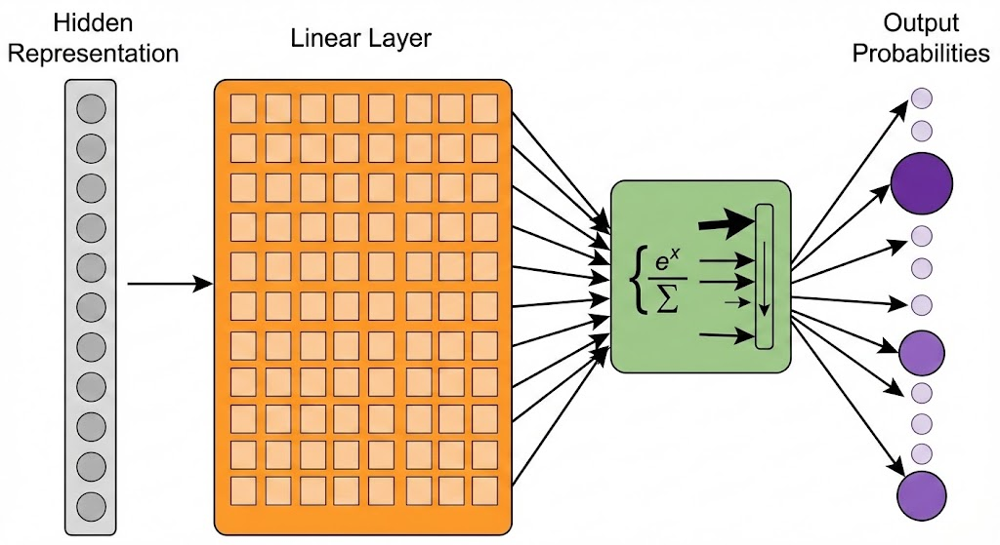

# 1. 什么是 Transformer

## Transformer 的诞生

2017 年 Vaswani 团队在《Attention Is All You Need》中提出 Transformer，彻底改变 NLP 领域。此前 RNN/LSTM 处理长文本时像 "健忘的人"—— 读到句尾会忘记句首内容，而 Transformer 通过自注意力机制实现 "全局记忆"，就像人阅读时能随时关联前后文。

> 原始论文
> 
> https://arxiv.org/html/1706.03762v7#S3

## 如何预测下一个词

Transformer 的文本生成本质是 "概率游戏"：

1. 输入句子 "今天天气"，模型分析每个词的关联
2. 计算 "今天" 与 "天气" 的关联度，判断 "天气" 后最可能跟 "晴朗"、"寒冷" 等词
3. 通过 softmax 函数输出每个候选词的概率，选概率最高的作为预测结果

**类比理解**：就像猜谜语时，根据前半句 "床前明月光"，结合诗词规律预测下句是 "疑是地上霜"，Transformer 通过学习海量文本的词语关联规律，实现更精准的 "猜词"。

## 三大核心组件

### 嵌入层：文字变数字的魔法工厂

- **词元分割**：把 "我爱北京" 拆成 ["我", "爱", "北京"]（或子词 "北"+"京"），类似把句子拆成乐高积木
- **向量转换**：每个词元转为 100-1024 维的数字向量，比如 "苹果" 的向量可能在 "水果" 维度值高，"红色" 维度值低
- **语义捕捉**：相似词的向量距离近，如 "爸爸" 和 "父亲" 的向量在空间中接近

### Transformer 块：信息处理的智能工厂

#### ① 注意力机制：词语间的 "对话系统"

- **核心作用**：让每个词 "听" 到其他所有词的信息
- **工作示例**：处理 "猫追老鼠" 时，"追" 会同时关注 "猫"（谁在追）和 "老鼠"（被追对象），就像课堂讨论时学生同时听老师和同学说话

#### ② MLP 层：词语表示的 "精加工车间"

- **处理流程**：注意力输出的向量先经过非线性变换（类似把原材料塑形），再映射到新空间（如从 "动物" 维度转向 "动作" 维度）
- **类比**：把 "猫追老鼠" 的原始信息加工成 "一只黑猫快速追逐小老鼠" 的更丰富表达

### 输出概率层：答案揭晓的 "投票站"

- **线性层**：将处理后的向量转换为词表长度的维度（如 5 万词就转 5 万维）
- **softmax 函数**：将数值转为 0-1 的概率，类似投票后统计每个候选人的得票率
- **应用场景**：机器翻译时，该层会计算 "hello" 翻译成 "你好" 的概率是否高于 "哈喽"

## Transformer 的优缺点

### 三大优势：

1. **并行加速：闪电般的处理速度**RNN 像排队买票，每次只能处理一个人；Transformer 像 10 个窗口同时售票，处理 1000 词的句子时速度快数百倍。
2. **长距离记忆：过目不忘的大脑**处理 "三年前小明在巴黎买的书" 时，能直接关联 "巴黎" 和 "书"，而 LSTM 可能需要分阶段记忆，容易遗漏关联。
3. **百变星君：万能的任务适配**换个训练数据，就能从翻译模型变写作助手，就像同一台机器既能生产汽车零件，也能生产家电零件。

### 三大挑战：

1. **计算量大：吃显卡的 "怪兽"**处理 1000 词的句子需要计算 100 万次词语关联，相当于同时运行 100 个大型游戏，需要高端 GPU 支持。
2. **数据饥渴：海量知识的 "吃货"**训练一个基础 Transformer 需要数亿单词的语料（相当于 10 万本小说），数据不足时容易 "学偏"。
3. **顺序感知缺失：需要 "路标" 的旅行者**处理 "小明吃苹果" 和 "苹果吃小明" 时，若无位置编码会认为两者相同，位置编码就像给词语标上 "第 1 个"" 第 2 个 " 的路标。