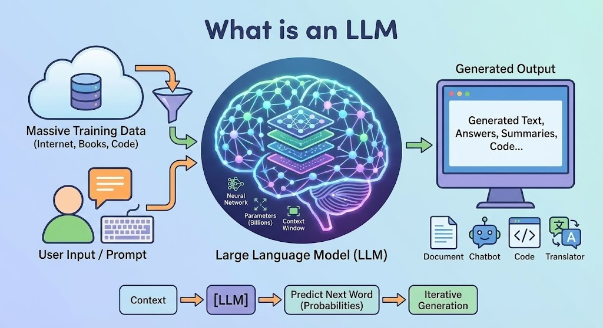

# 3. 什么是 LLM

> LLM 是「大型语言模型」（Large Language Model）的缩写，它是 Transformer 架构的「超级进化体」—— 就像从普通汽车进化到航天飞机，LLM 通过「参数规模爆炸式增长」和「训练技术迭代」，让机器拥有了接近人类的语言理解与生成能力。 

#### LLM 的核心特征

1. **参数规模：从百万到万亿的质变**  
  - 基础 Transformer 可能只有 1 亿参数（类似一本百科全书的知识点），而 LLM（如 GPT-4）拥有 1.8 万亿参数 —— 相当于把全球图书馆的知识压缩进数字大脑。这种规模带来「涌现能力」：当参数超过千亿级，模型会突然获得原本小模型不具备的推理、逻辑分析能力（比如理解隐喻、解决数学题），就像人类大脑发育到一定阶段突然理解抽象概念。  
2. **上下文理解：超长文本的「记忆大师」**  
  - 通过改进的注意力机制（如 Rotary Positional Embedding），LLM 能处理数万词的上下文（比如整本小说），而普通 Transformer 早期只能处理几千词。例如，GPT-4 可以记住几十页对话的细节，还能根据前文伏笔续写故事。  
3. **自监督学习：无师自通的「知识猎手」**  
  - LLM 的训练不需要人工标注数据，而是像人类通过读书自学一样，用「遮住一部分文本让模型预测」的方式（如 MLM 掩码语言模型），从海量网页、书籍、论文中自学语言规律。例如，GPT-3 训练时吃掉了 5000 亿单词的语料，相当于读完人类历史上 90% 的公开文本。  

---

#### LLM 的能力突破

传统 Transformer 像「高级猜词机器」，而 LLM 具备了「类人智能」的雏形：  

- **逻辑推理**：能解数学题、分析法律条款，甚至模拟科学实验步骤（如 GPT-4 能通过医学执照考试）。  
- **多模态理解**：不仅懂文字，还能「看图片+读文字」（如 GPT-4V 能分析漫画中的幽默梗）、「听语音+生成回复」，实现「图文音」一体化处理。  
- **角色模拟**：根据指令扮演不同身份（如医生、诗人、代码工程师），生成符合角色设定的内容，甚至能模拟人类的情绪语气。  
- **工具调用**：连接外部工具（如计算器、数据库），实现「用语言操控世界」，比如用户说「订明天去上海的机票」，LLM 能直接调用API完成预订。  

---

#### LLM 的应用

1. **生产力革命**：  
  - 办公：自动生成 PPT 文案、总结会议纪要、检查代码漏洞（如 GitHub Copilot）。  
  - 创作：写小说、谱曲、生成广告文案，甚至有团队用 LLM 完成了电影剧本初稿。  
2. **教育与医疗**：  
  - 教育：当「24 小时家教」，根据学生水平定制习题并讲解（如 Khan Academy 的 AI 助教）。  
  - 医疗：分析医学影像报告、辅助诊断疾病（需人类医生复核），甚至生成个性化康复建议。  
3. **日常交互**：  
  - 智能助手：Siri、ChatGPT 等能理解复杂指令（如「用李白的风格写一首关于人工智能的诗」），还能记住用户偏好（如你喜欢的咖啡口味）。  
  - 社交陪伴：与孤独老人聊天、陪孩子学英语，甚至模拟宠物的「内心独白」。  

---

#### LLM 的挑战

1. **「幻觉」问题：一本正经地胡说八道**  
  - 模型可能编造不存在的知识（如声称「爱因斯坦获得过诺贝尔文学奖」），因为它的「知识」来自训练数据的概率统计，而非真实世界验证。  
2. **计算资源黑洞**  
  - 训练一个万亿参数模型需要数千块顶级 GPU 运行数月，能耗相当于一个小镇的用电量，普通机构根本玩不起，导致技术垄断在少数大厂手中。  
3. **伦理风险**  
  - 生成虚假新闻、伪造身份诈骗（如用 LLM 模拟某人声音打电话诈骗），或因训练数据含偏见（如性别歧视、种族偏见），导致模型输出歧视性内容。  
4. **人类失业焦虑**  
  - 基础文案、客服、数据标注等岗位可能被 LLM 替代，就像工业革命时期纺织女工面对蒸汽机的冲击，社会需要重新思考「人类独特价值」的定位。  

---

#### LLM 的未来

如今，LLM 就像一个正在快速成长的「数字少年」：它能帮人类处理繁琐工作，却也可能因能力过强引发担忧。科学家们正在探索「对齐技术」（如让模型始终遵循人类价值观），就像给高速行驶的汽车装上刹车系统。或许未来，LLM 会成为嵌入生活每个角落的「超级助理」—— 帮学生写作业（但教会他们思考）、帮医生做手术（但最终决策由人掌控），而人类则腾出精力去创造、去感受、去探索更广阔的未知世界。  

毕竟，Transformer 教会机器「关注一切」，而 LLM 正在学习「理解一切」，但真正的智慧，或许永远藏在人类那些无法被参数化的情感与想象之中。