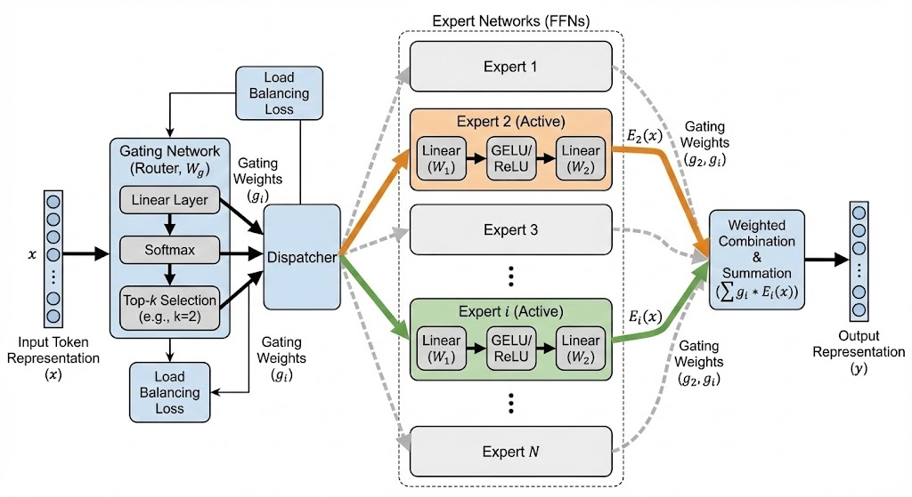
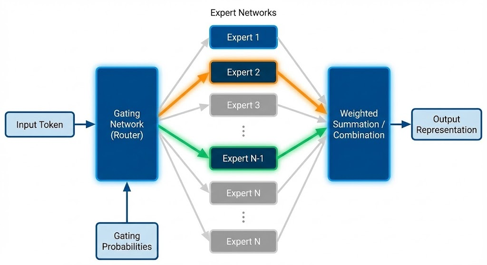

# 4. 什么是 MoE 模型

> 混合专家模型（Mixture of Experts, MoE）是Transformer架构的稀疏化扩展，通过“专家模块”与“门控路由”机制实现动态计算。其核心设计是将传统Transformer的前馈网络（FFN）替换为多个独立的“专家”子网络，并通过门控网络动态决定输入令牌（token）应路由至哪些专家。每个专家仅处理部分输入，形成“稀疏激活”特性，使模型在保持高性能的同时显著降低计算量。  

### 关键技术组件

1. **专家（Experts）**：由多个独立神经网络（如前馈网络）组成，每个专家专注于处理输入空间的特定部分。例如，在语言模型中，不同专家可能分别擅长处理语义、数值或专业术语。  
2. **门控网络（Router）**：基于输入数据计算路由权重，通过Top-K策略（如Top-2）选择激活的专家。该组件与模型其他部分共同训练，确保路由策略优化任务性能。 

 

---

### 核心技术特性

1. <u>**稀疏计算**</u><u>：</u>仅激活部分专家处理输入，理论计算量随激活专家数量线性降低。例如，8专家MoE模型在Top-2路由下，实际计算量约为全激活模型的1/4。  
2. <u>**负载均衡机制**</u>：通过辅助损失和专家容量阈值，避免令牌集中分配至少数专家，确保训练稳定性。容量因子定义专家可处理的最大令牌数，平衡计算资源分配。  

---

### 优势与挑战

| **核心优势** | **关键挑战** |
| --- | --- |
| 1. **参数高效扩展**：可构建万亿级参数模型（如1.6万亿参数的Switch Transformers），远超稠密模型算力限制。 2. **预训练加速**：同计算预算下预训练速度比稠密模型快4倍（如Switch Transformers对比T5-XXL）。 3. 推理优化：实际计算量小，如Mixtral 8x7B推理等效于120亿参数稠密模型。 | 1. 显存需求：需加载所有专家参数，例如8×70亿参数的MoE需等效470亿参数的显存。 2. 训练稳定性：门控网络易导致梯度波动，需通过Router z-loss等技术优化。 3. 微调难度：稀疏模型易过拟合，需结合指令微调或冻结非专家层。 |

---

### 负载均衡

MoE 的核心工程挑战是负载不均。如果总是同一小撮专家被选中，就会出现：

- <u>训练不稳：</u>热门专家梯度拥挤，冷门专家得不到足够更新；
- <u>资源浪费：</u>显存里放着很多专家，但很少被用上。

常见的均衡策略：

1. <u>**负载均衡损失（辅助正则）**</u>

- 在主任务损失外，加一个鼓励“专家重要性分布更均匀”的项（如基于每个专家处理的 Token 量计算变异系数）。
- 也会设置“专家容量上限”（Capacity），超过上限的 token 要么丢弃、要么延迟/重分配。
- 好处：简单直接，易融入现有训练管线。
- 代价：正则系数敏感，过大压制主任务，过小平衡不足。

1. <u>**Noisy Top-K**</u>

- 在路由打分上加噪声（如高斯/Gumbel），引入探索，避免过于确定性地总选同一批专家。
- 好处：实现轻量。
- 代价：噪声强度难拿捏；分布极端时效果有限。

1. <u>**无辅助损失的偏置路由（Router Bias）**</u>

- 思路：不引入额外损失，改为在线监控各专家负载，用一个“偏置项”动态调节路由打分的可选性：
  - 过载专家降低偏置，负载不足的提高偏置；
  - 偏置只用于 Top-K 选择，不用于后续加权。
- 好处：训练更稳，不额外干扰主损失。
- 代价：实现上需要精细的监控和更新逻辑（比如序列级的拆分策略）。

---

### 推理时到底怎么跑

当每个 token 选出 Top-K 专家后，推理通常这样执行：

- 把选择了同一位专家的 token 聚成一组，形成多个“专家批次”；
- 各专家并行处理自己那一组 token；
- 按路由权重把结果“送回原位”，完成聚合，进入下一层。

工程上的关键点：

- 通信与并行：多卡/多机环境里，专家常常做专家并行（Expert Parallelism），跨设备做 All-to-All 交换，这里是重要瓶颈，需要和张量并行、流水并行等方案合理配合。
- 容量与丢弃：容量过小会丢 token 影响效果，过大又浪费。实际会配合“容量因子”“丢弃/回退策略”调优。
- 路由稳定性：温度、噪声、负载偏置等超参都影响稳定性与吞吐。

---

### 两个典型实践方向

- DeepSeekMoE 的思路
  - “小参数多专家”：把每个专家做得更轻，但把专家数量拉得更多；一次激活的专家数也可相应放大（更灵活的组合）。
  - “共享专家隔离”：设置一组共享专家承接“共识知识”，作为常驻专家，降低路由冗余。
  - 经验表明：在同等或更少计算量下，能达到与更大密集模型相近甚至更好的效果；随着规模扩展，性价比优势明显。
- LoRAMoE 的结合
  - 冻结主干 FFN，仅用低秩适配器（LoRA）作为“专家”进行参数高效微调。
  - 一部分专家专注“世界知识”迁移，一部分服务下游任务适配；通过路由器协调，并加局部平衡约束，兼顾泛化与专精。

---

### 何时用 MoE，何时用密集模型？

- 更适合 MoE 的场景
  - 数据/任务异质性强、风格分布广；
  - 需要巨大容量但有严格的推理预算；
  - 分布式训练/推理基础设施成熟，能承受 All-to-All 等通信开销。
- 更适合密集模型的场景
  - 规模较小或任务相对单一；
  - 基础设施受限，不便做复杂并行与路由优化；
  - 极致低延迟场景，路由与分发开销可能不划算