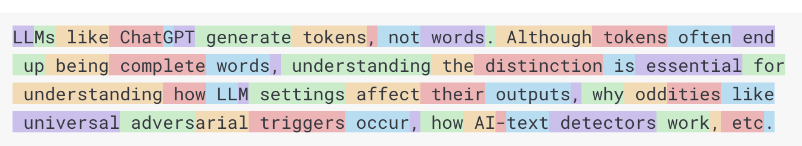

# 5. Token与分词

> 0.75 个单词约为一个 token；
> 
> 作为参考，莎士比亚的全部作品共计约90万词，相当于约120万词元。

### **什么是Token与Tokenization？**

在大语言模型（LLM）中，Token是语言处理的基本单元，类似于构成文本的“原子”。而 Tokenization（分词）是将文本字符串转换为Token序列，或反之将Token还原为文本的过程。  

例如，在Llama 2论文中提到的“2万亿Token训练数据”，就是指模型处理了2万亿个这样的语言原子。Token可以是一个字符（如“a”）、一个子词（如“ing”）、一个完整单词（如“apple”），甚至是一个短语，具体取决于分词策略。  

**Tokenizer（分词器）** 是独立于LLM的模块，有自己的训练数据集。例如，OpenAI的`tiktoken`就是一个开源分词器，用于处理输入文本并生成Token序列。  

---

### **为什么 Tokenization 如此重要？**

Tokenization 直接影响LLM的性能和行为，许多看似与模型架构相关的“奇怪现象”，本质上源于分词逻辑：  

- **拼写与基础任务缺陷**：LLM可能拼错单词或无法反转字符串，因为分词可能将单词拆分成不完整的子词。  
- **非英语语言表现不佳**：日语、中文等语言的分词更复杂，Token序列更长，导致上下文窗口浪费（如同样内容消耗更多Token）。  
- **代码与结构化数据处理**：Python代码的缩进空格会被拆分为多个Token，增加计算负担；JSON比YAML消耗更多Token（如同一配置的Token数：JSON 46 vs YAML 29），影响模型理解效率和API成本。  

---

### **Tokenization的核心流程**

##### **1. 预训练阶段：构建词汇表**

- **收集语料库**：获取大量文本数据（如网页、书籍等）。  
- **初始分词**：用基础方法（如按空格、标点拆分）生成初步Token。  
- **选择分词算法**：常用算法包括Byte Pair Encoding（BPE）、WordPiece、SentencePiece等。  
- **生成子词词汇表**：通过算法合并高频Token对，形成更高效的子词单元（如“un”+“der”→“under”）。  
- **分配ID**：每个唯一Token对应一个整数ID（如“hello”→ID 123）。  

---

##### **2. 实时分词过程**

- **文本转换**：将输入文本拆分为词汇表中的Token。  
- **ID映射**：每个Token转为对应的整数ID。  
- **添加特殊Token**：如` <|endoftext|>`表示文本结束，用于对话分隔。  

---

### **从莎士比亚到现代分词：一个简化示例**

以莎士比亚作品为例，字符级分词的逻辑如下：  

- 词汇表包含26个大小写字母、标点等共65个字符，每个字符对应一个ID（如“a”→1，“b”→2）。  
- 文本“hello”会被拆分为字符Token序列：[“h”, “e”, “l”, “l”, “o”]，对应ID序列[8, 5, 12, 12, 15]。  

**现代分词（子词级）** 则更高效：例如“encoding”可能被拆分为“encod”和“ing”，而非单个字符。这种方法能捕获常见词缀，减少词汇表规模并提升模型泛化能力。  

---

### **Tokenization的核心挑战**

1. **语言差异性**：  
  - 非英语语言（如中文、日语）的分词更依赖字符或子词，Token序列更长。例如，同样内容的日语文本可能比英语多消耗30%的Token，导致上下文窗口不足。  
2. **代码与格式处理**：  
  - Python代码的缩进空格会被拆分为独立Token（如4个空格→4个Token），浪费计算资源。  
  - JSON因引号和逗号等冗余符号，比YAML消耗更多Token（见前文示例）。  
3. **大小写与上下文敏感**：  
  - “Python”和“python”可能被视为不同Token，模型需额外学习它们的语义关联。  

---

### **Byte Pair Encoding（BPE）：现代分词的核心算法**

BPE最初用于文本压缩，后被GPT、RoBERTa等模型采用，其核心逻辑如下：  

1. **初始词汇表**：从字符级开始（如ASCII字符，共256个）。  
2. **迭代合并高频Token对**：  
  - 例如，初始语料中“hug”“pug”“hugs”的字符拆分是[“h”“u”“g”]、[“p”“u”“g”]、[“h”“u”“g”“s”]。  
  - 高频对“u”+“g”会被合并为“ug”，加入词汇表；下一步合并“h”+“ug”为“hug”，形成三字符Token。  
3. **平衡词汇量与压缩率**：  
  - 词汇表过大会增加嵌入层计算量，过小则无法有效压缩文本。现代模型（如GPT-4）的词汇表约10万Token，每个Token平均对应4字节文本。  

**BPE的优势**：  

- 可逆无损：可将Token还原为原始文本。  
- 泛化性强：能处理未登录词（OOV），如“unhug”会被拆分为已知子词“un”+“hug”。  

---

### **Tokenization vs Embeddings：别混淆这两个概念**

| **维度** | **Tokenization** | **Embeddings** |
| --- | --- | --- |
| **目的** | 将文本转为Token序列（离散ID） | 将Token ID转为语义向量（连续表示） |
| **阶段** | 预处理（模型输入前） | 模型内部处理（输入层） |
| **作用** | 结构化文本，降低计算复杂度 | 捕获语义关系（如“国王”与“王后”的向量距离近） |
| **输出** | 例如：“hello”→ID 123 | 例如：ID 123→[0.1, 0.3, -0.2, ...]（128维向量） |