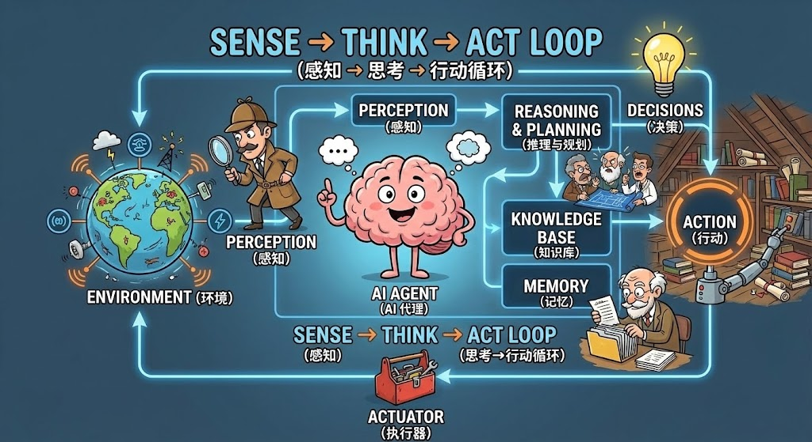

# 8. 什么是 AI Agent

### Agent 的基础概念

当下，你会发现似乎人人都在谈论 AI Agent，但似乎大家又说不清楚 AI Agent 到底是什么，这是因为 AI Agent 是当下 AI 技术爆发的浪潮下的一个阶段性产物，它并没有一个明确的定义，下面我们来尝试给它下一个定义。

> “Agent” 是一个名词（n.），词根 “-ag-” 源于拉丁语 “agere”（表示 “做、行动”），核心逻辑是 “主动执行动作或传递作用的主体 / 媒介”。

Agent 在实际的英文语境中，常作为后缀（-agent）或核心词，与前缀、名词结合形成复合词，含义多围绕 “特定领域的 “代理人、媒介” 展开：

- Real estate Agent：房产经纪人（核心：处理房产交易的代理人）
- Travel Agent：旅行社代理人（核心：帮客户安排旅行的媒介）
- Insurance Agent：保险代理人（核心：销售保险、处理理赔的角色）
- Talent Agent：艺人经纪人（核心：代表艺人洽谈工作、管理事务）
- FBI Agent：联邦调查局特工（核心：代表政府执行执法任务）

---

不管是房产经纪人、政府特工，本质都是 “帮人做特定事的角色”。那 AI Agent，就是基于 AI 技术的 “代理人” ，它可以借助 AI 技术帮人们更顺利、更专业的完成某些领域的事情。这里有两个值得关注的点：

- **第一个是自主决策性：**在以上的几个案例中，Agent 都是用来形容一个 “人” 的，这意味着它不是一个冰冷的机器，没有特定的流程化，而是能够完全自主决策、自主规划的生命体。而 AI Agent ，虽然并不是一个真正的人类，但它却拥有真的人类的做事方式，也能够自主决策和规划，能够自己决定要做什么。
- **第二个是领域专业性：**在以上的几个案例中，其实每种角色的技能都是局限在特定领域下的，比如你无法让 FBI 的特工去很好的完成艺人经纪人的角色，而他们在各自的领域都能表现的很专业。AI Agent 也是一样，它们一般也都有自己更擅长的领域。比如 DeepResearch 是比较擅长信息检索的 Agent、Claude Code 是比较擅长代码编写的 Agent，即使是自己号称是通用 Agent 的 Manus，其实最擅长的领域还是做调研报告，在编程领域上和 Claude Code 也没法比。

---

> 所以，关于 AI Agent 的概念我们可以概括为：基于 AI 技术，以 “主动执行动作或传递作用” 为核心逻辑的“智能代理人”，它具备类人类的自主决策与规划能力，且通常聚焦特定领域并展现专业能力，可协助人们更顺利、专业地完成特定领域事务。

如果说传统AI是“答题机器”，那么Agent就是“会做事的智能体”。  

- **传统AI与Agent的区别**：普通大语言模型像“一次性写手”，你给一个提示，它直接生成结果，中间不会调整思路。而Agent更像人类做事的流程：比如写文章时，它会先列大纲，发现需要资料就联网搜索，写完初稿后自我检查修改，反复优化直到满意——这种“规划-执行-反思”的闭环，让Agent拥有了接近人类的任务处理逻辑。  
- **学术定义**：Agent（智能体）是基于大语言模型（LLM）构建的可执行程序，它能独立拆解任务、调用工具（如计算器、数据库、API）、存储记忆（记录历史对话和数据），并通过“规划-行动-反馈”的循环自主完成复杂目标，无需人类持续干预。  

---

### Agent 的核心能力

Agent的工作逻辑离不开四个支柱：  

1. **规划（Planning）**：把复杂任务拆分成子步骤。比如用户让“做一份季度营销方案”，Agent会先分解为“市场调研→目标设定→策略设计→预算规划”等阶段，按顺序执行。  
2. **记忆（Memory）**：存储历史对话和数据，避免重复工作。比如你之前让Agent整理过客户邮箱，下次它会直接调用该数据，无需重新收集。  
3. **工具（Tools）**：突破语言模型局限。比如计算“12345×67890”时，Agent会自动调用计算器；需要实时数据时，会访问搜索引擎或API接口。  
4. **行动（Action）**：根据规划执行具体操作，如发送邮件、生成PPT、编写代码，甚至控制硬件设备（如智能家居）。  

---

### Agent 的典型形态

根据吴恩达在BULIT2024演讲中的分类，Agent可分为四大类型：  

1. <u>**Reflection（自我反思型）**</u>：像“程序员+审查员”的组合。比如写代码时，Agent先生成一版，再用另一个“审查员”角色检查漏洞，反馈后修改，反复迭代直到代码正确。这种自我优化机制适用于高质量内容生成、法律文件分析等场景。  
2. <u>**Tool use（工具调用型）**</u>：让Agent拥有“外挂工具包”。比如ChatGPT调用插件：用Coupert找优惠券，用Edx查询课程，用计算器处理复杂运算。工具调用让Agent突破“纯语言能力”，实现数据分析、实时查询等功能。  
3. <u>**Planning（任务规划型）**</u>：处理需要多步协作的复杂任务。比如用户说“把舞蹈动作转成语音教程”，Agent会拆分步骤：用Openpose模型提取动作→用Vision模型转成图片→用GPT模型生成文字说明→用FastSpeech转成语音，全程自动串联工具和模型。  
4. <u>**Multi-Agent Collaboration（多智能体协作）**</u>：模拟人类团队分工。比如清华大学的ChatDev项目，把软件开发拆解为“CEO（决策）、CTO（设计）、程序员（编码）、测试员（验证）”等角色，每个Agent负责特定环节，通过对话协作完成整个项目，就像一家虚拟软件公司。  