# 1. EasyDataSet 训练数据集

> [Easy Dataset](https://github.com/ConardLi/easy-dataset) 是一个专为创建大型语言模型（LLM）微调数据集而设计的应用程序。它提供了直观的界面，用于上传特定领域的文件，智能分割内容，生成问题，并为模型微调生成高质量的训练数据。支持使用 OpenAI、DeepSeek、火山引擎等大模型 API 和 Ollama 本地模型调用。

# 主要任务：使用 Easy Dataset 生成微调数据

## 安装 Easy Dataset

### 方法一：使用安装包

如果操作系统为 Windows、Mac 或 ARM 架构的 Unix 系统，可以直接前往 Easy Dataset 仓库下载安装包：https://github.com/ConardLi/easy-dataset/releases/latest

### 方法二：使用 Dockerfile

```shell
# 1. 拉取代码
git clone https://github.com/ConardLi/easy-dataset.git
cd easy-dataset

# 2. 构建镜像
docker build -t easy-dataset .

# 3. 运行容器
docker run -d  -p 1717:1717  -v ./easy-dataset/db:/app/local-db  --name easy-dataset  easy-dataset
```

### 方法三：使用 NPM 安装

1. 下载 Node.js 和 pnpm

前往 Node.js 和 pnpm 官网安装环境：https://nodejs.org/en/download | https://pnpm.io/

使用以下代码检查 Node.js 版本是否高于 18.0

```shell
# 1. 拉取代码
git clone https://github.com/ConardLi/easy-dataset.git
cd easy-dataset

# 2. 安装依赖
pnpm install

# 3. 启动 Easy Dataset 应用
pnpm build
pnpm start
```

## 下载示例数据

本教程准备了一批互联网公司财报作为示例数据，包含五篇国内互联网公司 2024 年二季度的财报，格式包括 txt 和 markdown。可以使用 git 命令或者直接访问[仓库链接](https://github.com/llm-factory/FinancialData-SecondQuarter-2024)下载。

```shell
git clone https://github.com/llm-factory/FinancialData-SecondQuarter-2024.git
```

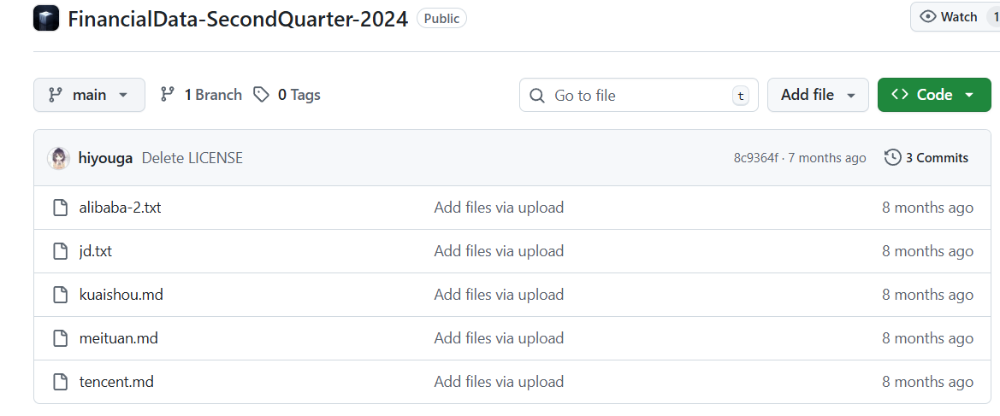

数据均为纯文本数据，如下为节选内容示例。

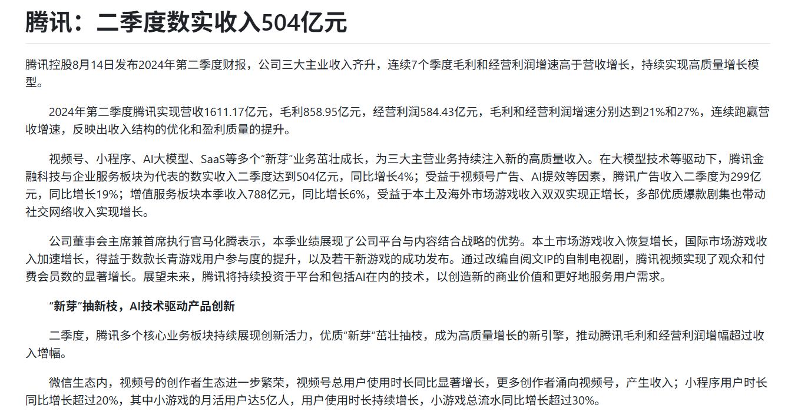

## 生成微调数据

### 创建项目并配置参数

1. 在浏览器进入 Easy Dataset 主页后，点击**创建项目**


1. 首先填写**项目名称**（必填），其他两项可留空，点击确认**创建项目**

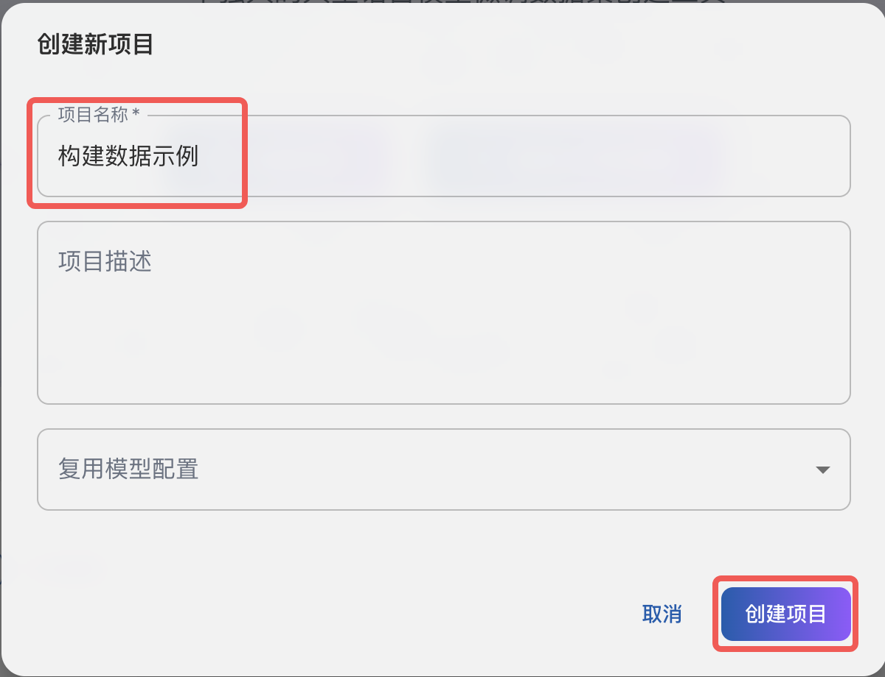

1. 项目创建后会跳转到**项目设置**页面，打开**模型配置**，选择数据生成时需要调用的大模型 API 接口

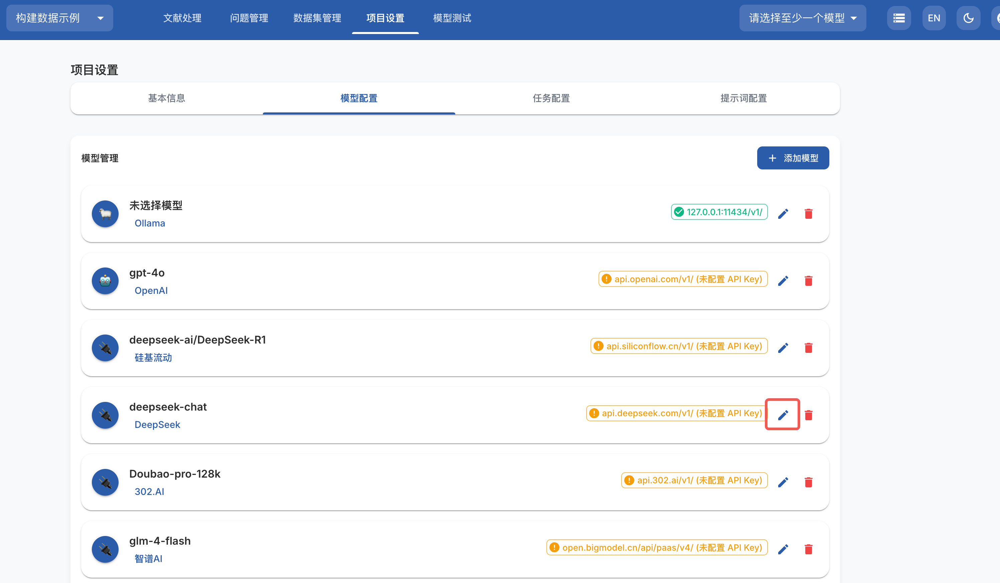

1. 这里以 DeepSeek 模型为例，修改模型**提供商**和**模型名称**，填写 **API 密钥**，点击**保存**后将数据保存到本地，在右上角选择配置好的模型

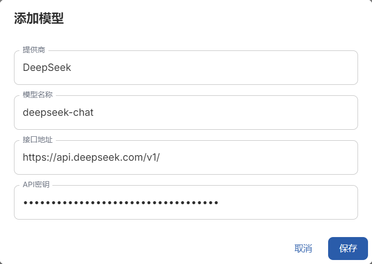


1. 打开**任务配置**页面，设置文本分割长度为最小 500 字符，最大 1000 字符。在问题生成设置中，修改为每 10 个字符生成一个问题，修改后在页面最下方**保存任务配置**

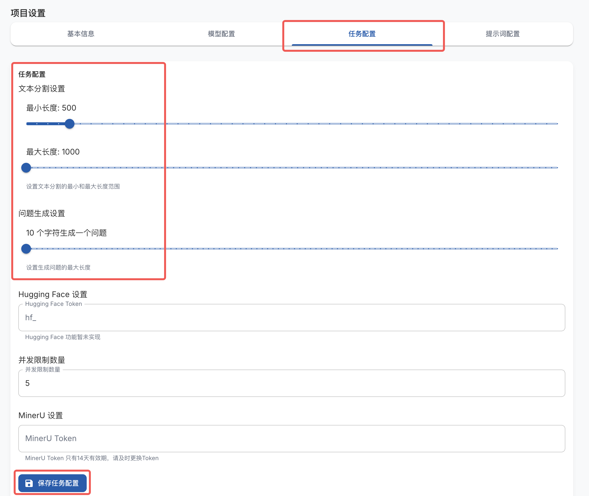

### 处理数据文件

1. 打开**文献处理**页面，选择并上传示例数据文件，选择文件后点击**上传并处理文件**

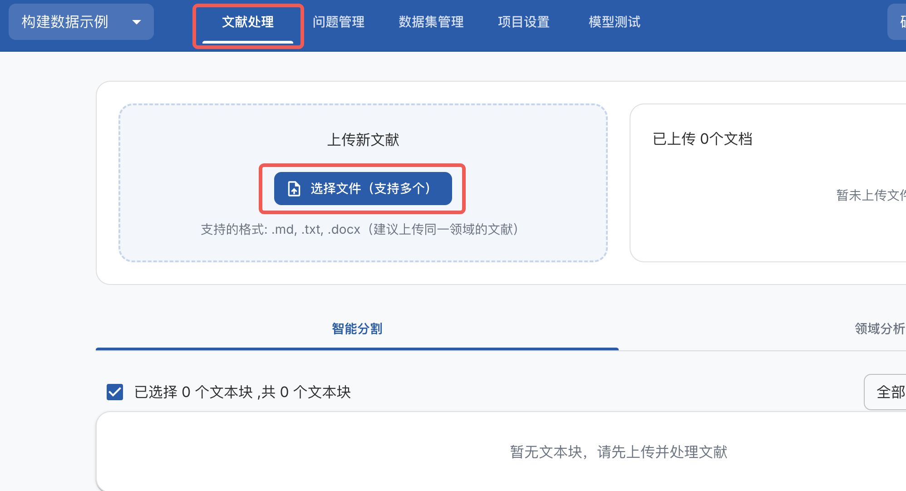

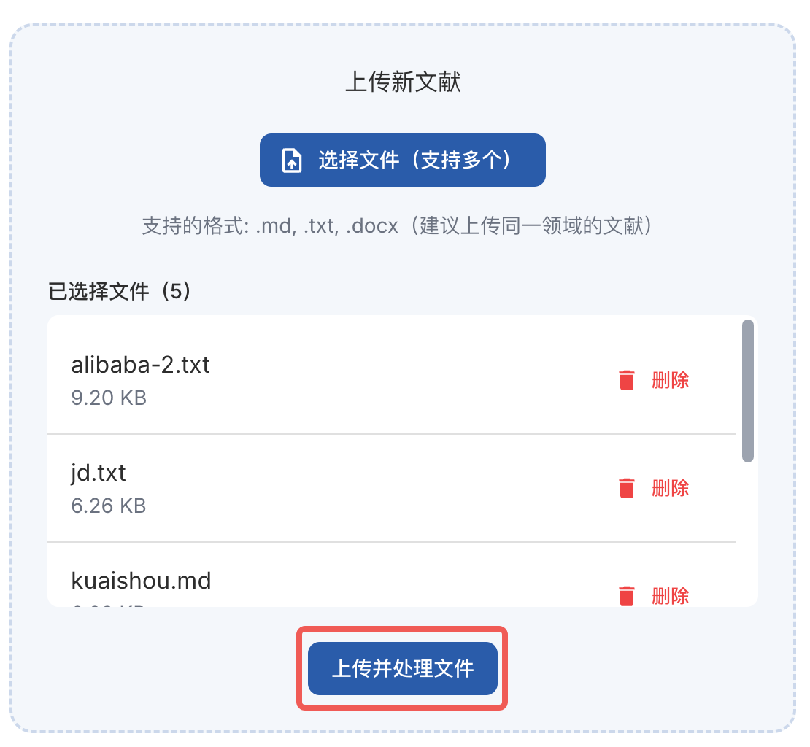

1. 上传后会调用大模型解析文件内容并分块，耐心等待文件处理完成，示例数据通常需要 2 分钟左右

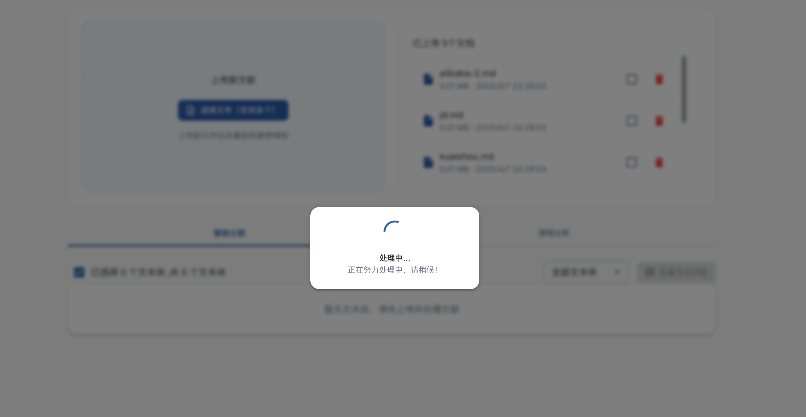

### 生成微调数据

1. 待文件处理结束后，可以看到文本分割后的文本段，选择全部文本段，点击**批量生成问题**

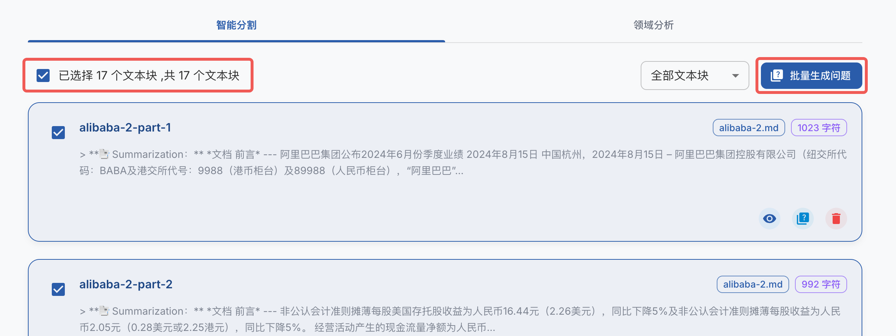

1. 点击后会调用大模型根据文本块来构建问题，耐心等待处理完成。视 API 速度，处理时间可能在 20-40 分钟不等

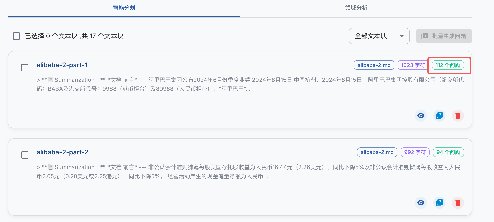

1. 处理完成后，打开**问题管理**页面，选择全部问题，点击**批量构造数据集**，耐心等待数据生成。视 API 速度，处理时间可能在 20-40 分钟不等

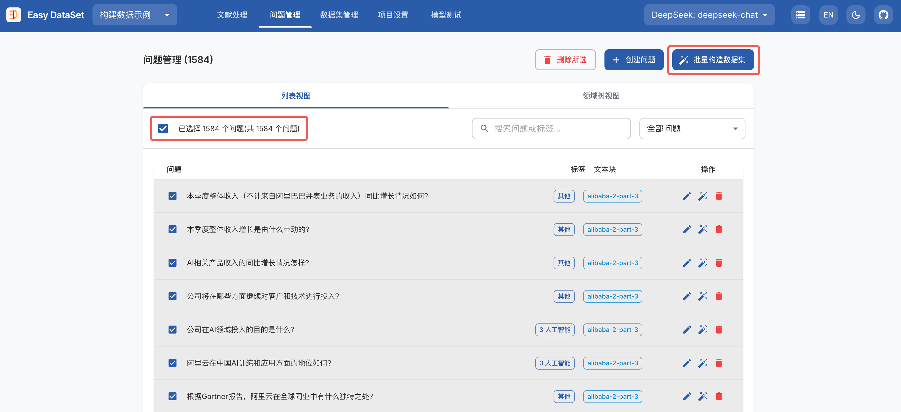

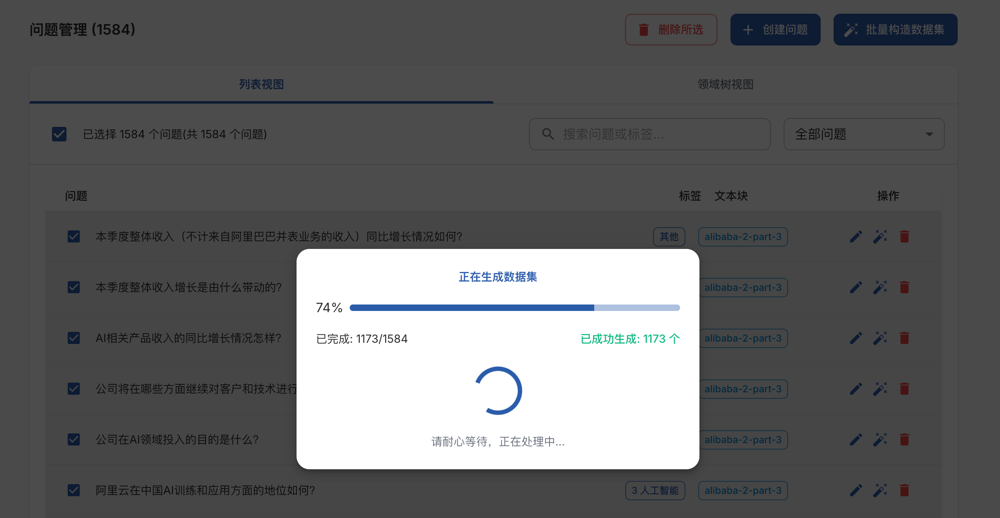

如果部分问题的答案生成失败，可以重复以上操作再次生成。

### 导出数据集到 LLaMA Factory

1. 答案全部生成结束后，打开**数据集管理**页面，点击**导出数据集**

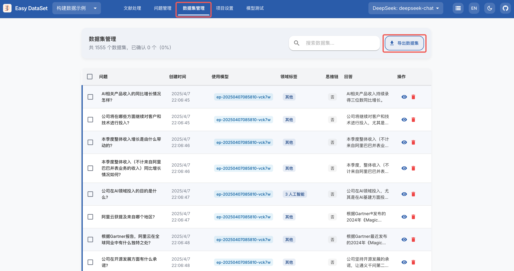

1. 在导出配置中选择**在 LLaMA Factory 中使用**，点击**更新 LLaMA Factory 配置**，即可在对应文件夹下生成配置文件，点击**复制**按钮可以将配置路径复制到粘贴板。

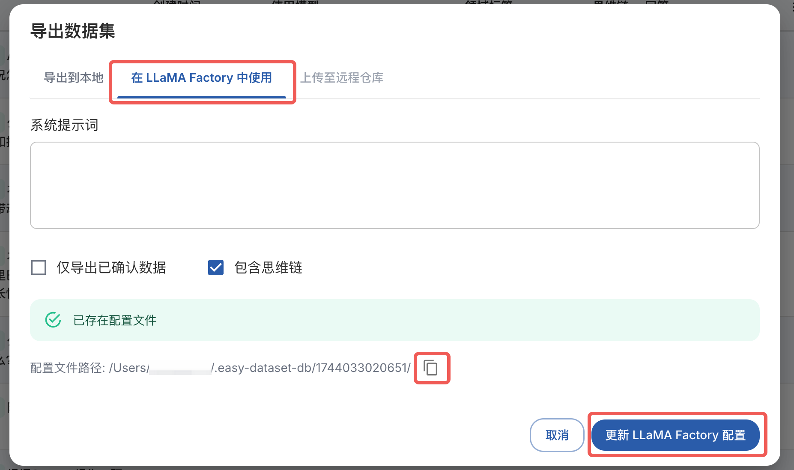

1. 在配置文件路径对应的文件夹中可以看到生成的数据文件，其中主要关注以下三个文件
  1. `dataset_info.json`：LLaMA Factory 所需的数据集配置文件
  2. `alpaca.json`：以 Alpaca 格式组织的数据集文件
  3. `sharegpt.json`：以 Sharegpt 格式组织的数据集文件

其中 alpaca 和 sharegpt 格式均可以用来微调，两个文件内容相同。

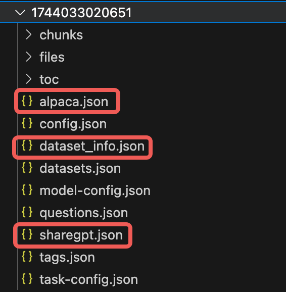