# 2. LLaMA Factory 大模型微调

> [LLaMA Factory](https://github.com/hiyouga/LLaMA-Factory) 是一款开源低代码大模型微调框架，集成了业界最广泛使用的微调技术，支持通过 Web UI 界面零代码微调大模型，目前已经成为开源社区最热门的微调框架之一，GitHub 星标超过 4.6 万。支持全量微调、LoRA 微调、以及 SFT 和 DPO 等微调算法。

# 主要任务：使用 LLaMA Factory 微调 Qwen2.5-3B-Instruct 模型

访问：https://www.anaconda.com/download

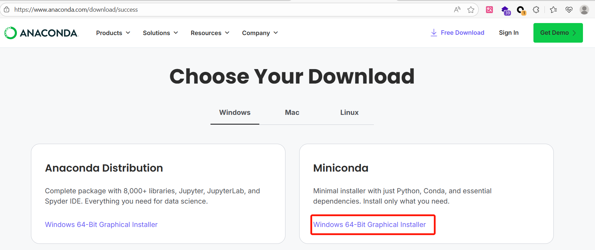

## 安装 LLaMA Factory

1. 创建实验所需的虚拟环境（可选）

```bash
conda create -n llamafactory python=3.10
```

1. 从 GitHub 拉取 LLaMA Factory 仓库，安装环境依赖

```bash
git clone --depth 1 https://github.com/hiyouga/LLaMA-Factory.git
cd LLaMA-Factory
pip install -e ".[torch,metrics,modelscope]"
```

1. 运行 `llamafactory-cli version` 进行验证。若显示当前  LLaMA-Factory 版本，则说明安装成功

```bash
----------------------------------------------------------
| Welcome to LLaMA Factory, version 0.9.2                |
|                                                        |
| Project page: https://github.com/hiyouga/LLaMA-Factory |
----------------------------------------------------------
```

## 启动微调任务

1. 确认 LLaMA Factory 安装完成后，运行以下指令启动 LLaMA Board

```bash
CUDA_VISIBLE_DEVICES=0 USE_MODELSCOPE_HUB=1 llamafactory-cli webui
```

环境变量解释：

- CUDA_VISIBLE_DEVICES：指定使用的显卡序号，默认全部使用
- USE_MODELSCOPE_HUB：使用国内魔搭社区加速模型下载，默认不使用

启动成功后，在控制台可以看到以下信息，在浏览器中输入 http://localhost:7860 进入 Web UI 界面。

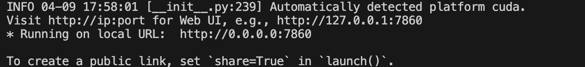

1. 进入 Web UI 界面后，选择模型为 Qwen2.5-3B-Instruct，模型路径可填写本地绝对路径，不填则从互联网下载

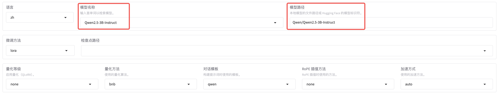

1. 将**数据路径**改为使用 Easy Dataset 导出的配置路径，选择 Alpaca 格式数据集

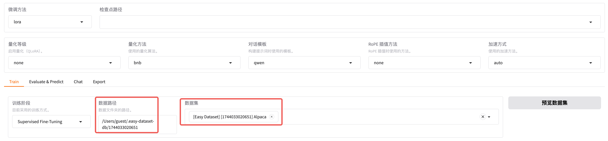

1. 为了让模型更好地学习数据知识，将**学习率**改为 1e-4，**训练轮数**提高到 8 轮。批处理大小和梯度累计则根据设备显存大小调整，在显存允许的情况下提高批处理大小有助于加速训练，一般保持批处理大小×梯度累积×显卡数量等于 32 即可

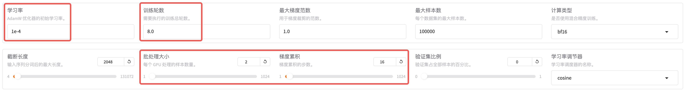

1. 点击其他参数设置，将**保存间隔**设置为 50，保存更多的检查点，有助于观察模型效果随训练轮数的变化

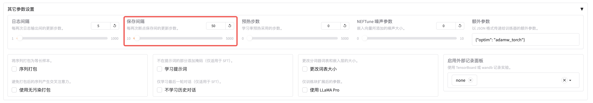

1. 点击 LoRA 参数设置，将 **LoRA 秩**设置为 16，并把 **LoRA 缩放系数**设置为 32

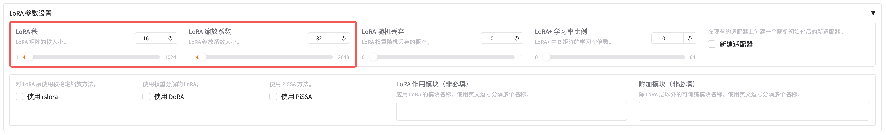

1. 点击**开始**按钮，等待模型下载，一段时间后应能观察到训练过程的损失曲线

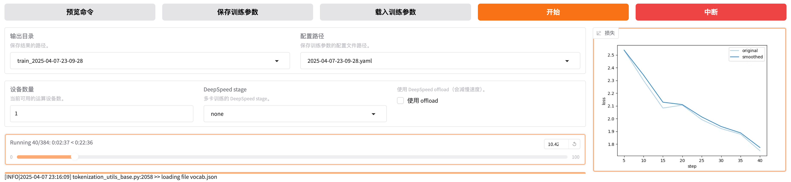

1. 等待模型训练完毕，视显卡性能，训练时间可能在 20-60 分钟不等

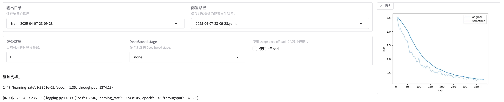

## 验证微调效果

1. 选择**检查点路径**为刚才的输出目录，打开 **Chat** 页面，点击**加载模型**

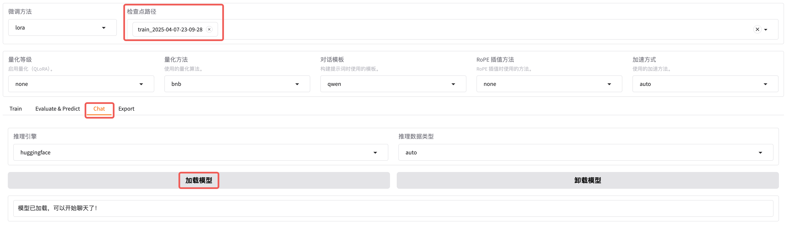

1. 在下方的对话框中输入问题后，点击提交与模型进行对话，经与原始数据比对发现微调后的模型回答正确

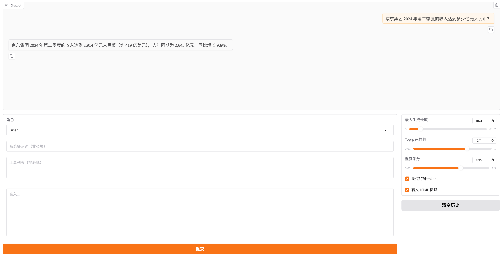

1. 点击**卸载模型**将微调后的模型卸载，清空**检查点路径**，点击**加载模型**加载微调前的原始模型

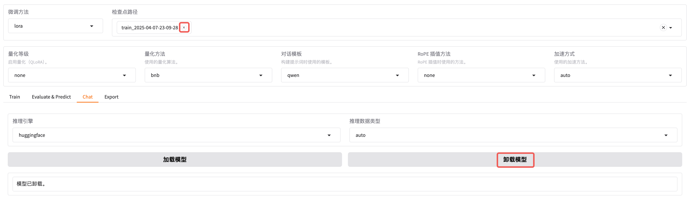

1. 输入相同的问题与模型进行对话，发现原始模型回答错误，证明微调有效

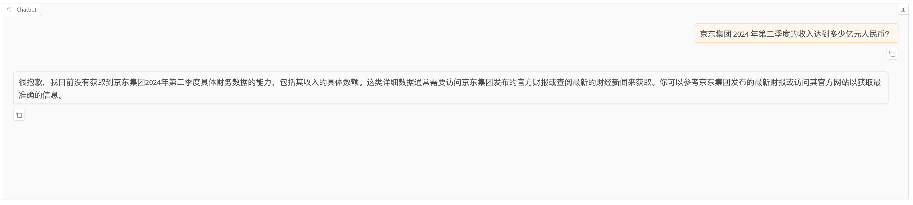

> 3B 模型的微调效果相对有限，此处仅用作教程演示。如果希望得到更好的结果，建议在资源充足的条件下尝试 7B/14B 模型。

欢迎大家关注 GitHub 仓库：

- Easy Dataset: https://github.com/ConardLi/easy-dataset
- LLaMA Factory: https://github.com/hiyouga/LLaMA-Factory