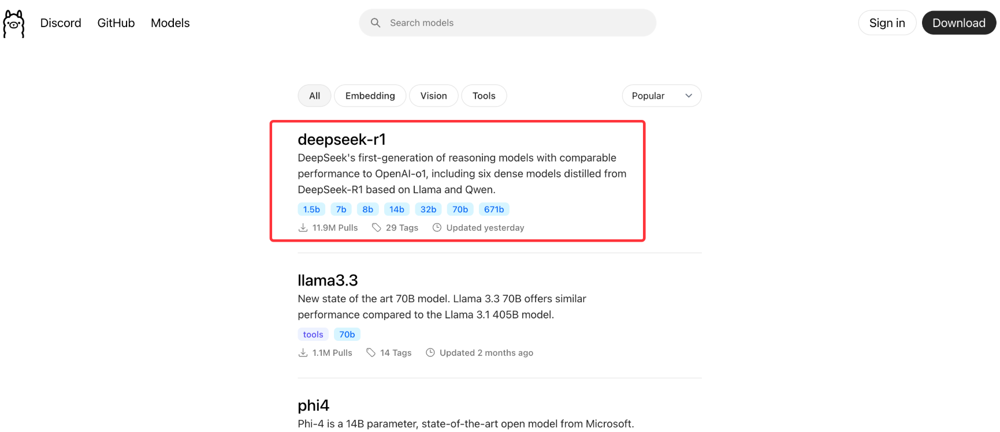
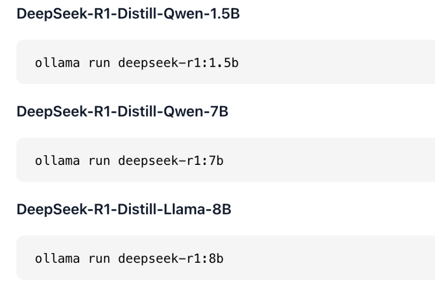
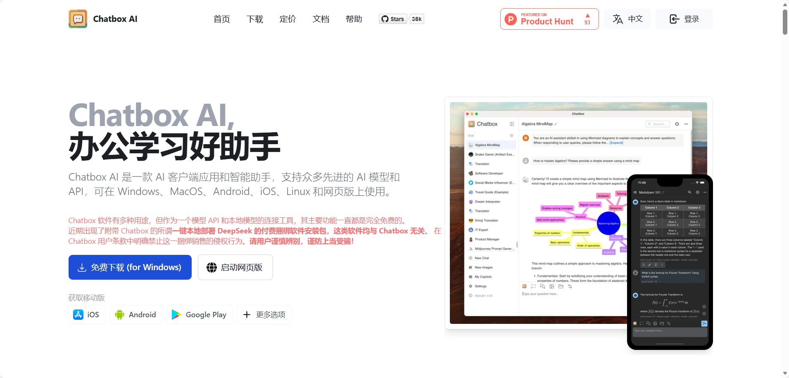
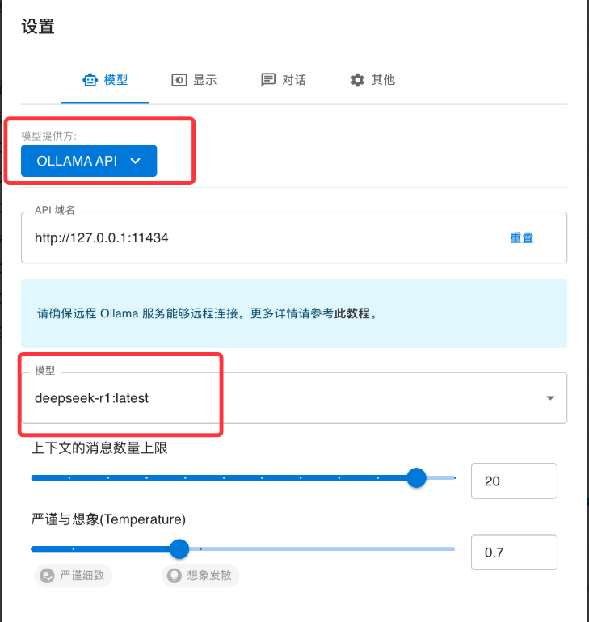
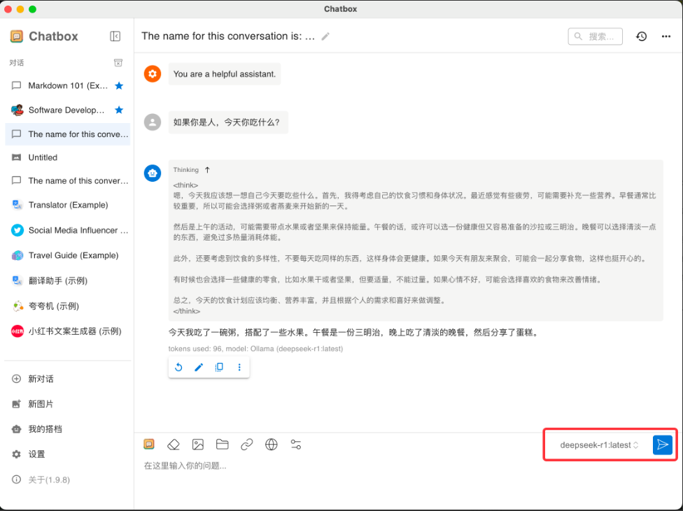
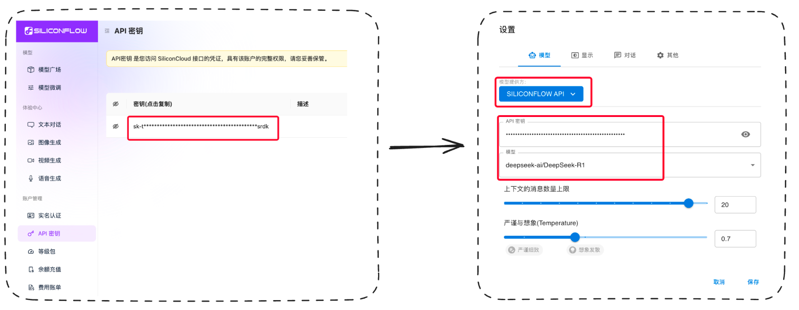
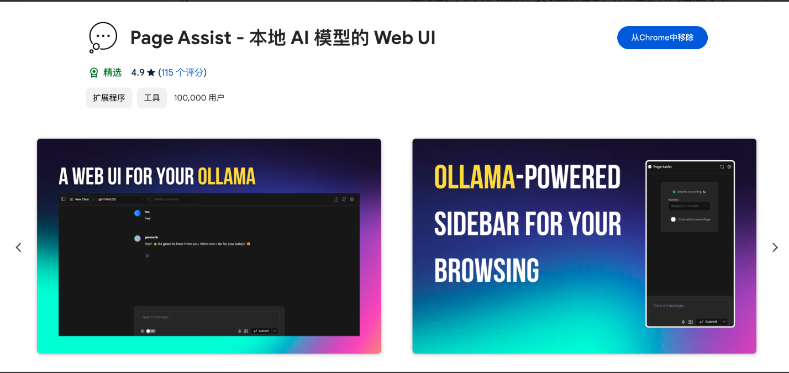
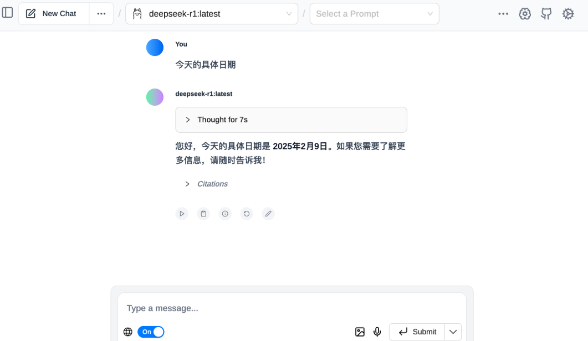

# 4. Ollama 本地部署实战

## 通过 Ollama 本地部署 DeepSeek

### Ollama 介绍

目前市面上主流的，成本最低的部署本地大模型的方法就是通过 Ollama 了，`Ollama` 是一个开源的本地大语言模型运行框架，专为在本地机器上便捷部署和运行大型语言模型（LLM）而设计。

核心功能：

- 简化部署：`Ollama` 简化了在 Docker 容器中部署大型语言模型的过程，即使是非专业用户也能轻松管理和运行这些复杂的模型。
- 模型管理：支持多种流行的大型语言模型，如 `Llama、Falcon` 等，并提供丰富的命令行工具和用户友好的 `WebUI` 界面。
- 模型定制：用户可以通过 `Modelfile` 文件自定义模型参数和行为，实现模型的个性化设置。

技术优势：

- 轻量级与可扩展：`Ollama` 保持较小的资源占用，同时具备良好的可扩展性，允许用户根据硬件条件和项目需求进行优化。
- API 支持：提供简洁的 API 接口，方便开发者集成到各种应用程序中。
- 兼容 `OpenAI` 接口：`Ollama` 支持 `OpenAI` 的 API 标准，可以作为 `OpenAI` 的私有化部署方案。

使用场景：

- 本地开发：开发者可以在本地环境中快速部署和测试大型语言模型，无需依赖云端服务。
- 数据隐私保护：用户可以在本地运行模型，确保数据不离开本地设备，从而提高数据处理的隐私性和安全性。
- 多平台支持：`Ollama` 支持 `macOS、Windows、Linux` 以及 `Docker` 容器，具有广泛的适用性。

`Ollama` 的目标是让大型语言模型的使用更加简单、高效和灵活，无论是对于开发者还是终端用户。

---

### Ollama 安装和使用

`Ollama` 的下载和安装非常简单，尤其是对于 MAC 用户：

打开浏览器，访问 `Ollama` 官方网站：`https://ollama.com/download`，下载适用于 `Mac` 的安装包。

下载完成后，直接双击安装包并按照提示完成安装。

安装完成后，我们直接打开命令行执行 `ollama --version` 判断是否安装成功：

`ollama` 会在我们本地服务监听 11434 端口：

然后我们可以直接使用 `ollama run 模型名称` 来下载和运行我们想要的模型。

---

### Ollama 支持的模型

`ollama` 支持的模型列表，我们可以到 https://ollama.com/search 查看：

可以看到第一个支持的就是最近最火的 `DeepSeek` 模型，已经有接近 1200 万次下载了，另外 `ollama` 还支持下面这些主流模型：

| 模型名称 | 简介 |
| --- | --- |
| **Llama** | 由Meta开发的通用语言模型，擅长多种语言任务，如文本生成、问答等。Llama 3.1（8B参数）是其较受欢迎的版本之一，文件大小约4.7GB。 |
| **Qwen** | 阿里云推出的模型，具备强大的语言理解和生成能力。Qwen 2（7B参数）文件大小约4.4GB，适合多种应用场景。 |
| **Gemma** | 谷歌推出的模型，注重语言的准确性和逻辑性。Gemma 2（9B参数）文件大小约5.5GB，适合需要高精度的语言任务。 |
| **Mistral** | 以高效和性能平衡著称，适合资源有限的设备。Mistral（7B参数）文件大小约4.1GB。 |
| **Phi** | 专注于生成高质量文本，适合创意写作等任务。Phi 3（3.8B参数）文件大小约2.3GB。 |
| **GLM** | 智谱推出的模型，适合中文处理任务。GLM 4（9B参数）文件大小约5.5GB。 |
| **CodeLlama** | 专为代码生成和理解优化的模型，适合编程辅助等场景。CodeLlama（7B参数）文件大小约3.8GB。 |
| **LLaVA** | 结合视觉和语言能力的模型，适合多模态任务。LLaVA（7B参数）文件大小约4.5GB。 |

在模型详情页我们可以看到目前支持的模型的不同版本（具体的参数含义我们在上见介绍过了），包括每个模型展用的磁盘大小：注意这里不是说你磁盘有这么大就够了，满血版（671b）虽然只需要 404GB 的磁盘空间，对内存、显卡、CPU 等其他硬件也有极高要求。

然后，直接在控制台使用 `ollama run 模型名称` 来下载我们想要的模型就可以了：

下载完成后可以直接在命令行运行：

目前我们已经拥有了一个基础的本地模型，但是这种交互方式太不友好了，下面我们通过一些工具来提升我们本地模型的使用体验。

---

## Chatbox + Ollama：丝滑使用，交互友好

目前市面上有很多可以在本地与 AI 模型交互的客户端，我认为做的较好的还是 `Chatbox`。

### Chatbox 的安装和使用

> `Chatbox` 是一款开源的 AI 客户端，专为与各种大型语言模型进行交互而设计。它支持包括 Ollama 在内的多种主流模型的 API 接入，无论是本地部署的模型，还是其他服务提供商的模型，都能轻松连接。此外，Chatbox 提供了简洁直观的图形界面，让用户无需复杂的命令行操作，就能与模型进行流畅的对话。它支持了目前市面上所有主流模型，并且兼容多个平台，交互体验也比较好，目前在 Github 上已经有接近 `29K Star`。

使用方式也比较简单，官方（https://chatboxai.app/zh）直接下载适合你系统的客户端：

下载后打开客户端，模型提供方选择 `Ollama API`，API 域名就是我们上面提到了本地 11434 端口的服务，另外它可以自动识别你的电脑上已经通过 `Ollama` 安装的模型：

然后就可以在聊天窗选择到你的本地模型了：

### Chatbox + SiliconFlow 体验满血 R1

当然，通过 `Chatbox` + `SiliconFlow` 你也可以很方便的体验满血版的 `DeepSeek R1` ，这里顺便提一下，我们只需要注册 `SiliconFlow`（https://cloud.siliconflow.cn/account/ak） 后获取到 API 密钥，然后将其配置到模型设置里：

就可以直接使用在 `SiliconFlow` 部署的满血 `DeepSeek R1` 了，不过注意免费额度用完就需要付费了。

继续回到本地模型， 我们发现 `Chatbox` 提供了联网功能，但是 `DeepSeek R1` 模型是没办法联网的：

想要让本地模型联网我们还得靠一个浏览器插件。

---

## Page Assist + Ollama - 实现本地模型联网

这里我们使用到的浏览器插件叫 `Page Assist`（https://chromewebstore.google.com/detail/page-assist-%E6%9C%AC%E5%9C%B0-ai-%E6%A8%A1%E5%9E%8B%E7%9A%84-web/jfgfiigpkhlkbnfnbobbkinehhfdhndo?hl=zh-cn）

> `Page Assist` 是一款开源的浏览器扩展程序，旨在为本地 AI 模型（如 `Ollama`）提供便捷的交互界面。它通过侧边栏或 `Web UI`，让用户可以在浏览网页时直接与本地 AI 模型对话，支持联网搜索以获取最新信息，并兼容多种文档格式（如 `PDF、TXT` 等）。此外，`Page Assist` 支持主流浏览器（如 `Chrome、Edge` 等），所有交互均在本地完成，确保用户隐私安全。

下载后击 `Page Assist` 插件图标，它会自动检测到正在运行的 `Ollama`。在插件界面的上方下拉菜单中，可以自动识别已经安装的模型。在对话框底部有一个地球标志，点击打开即可开启网络搜索功能。

