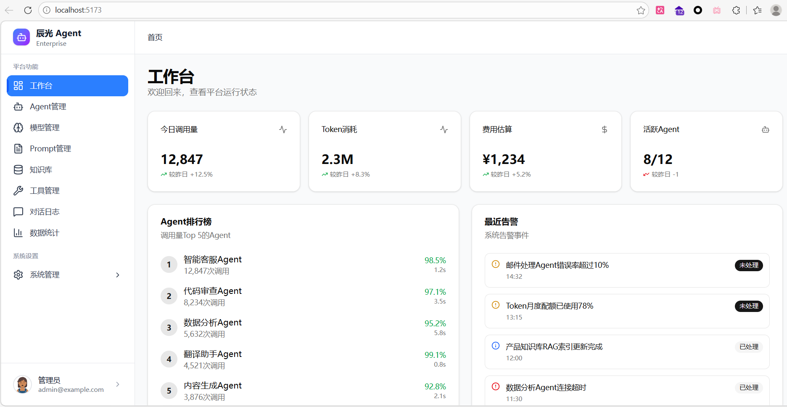
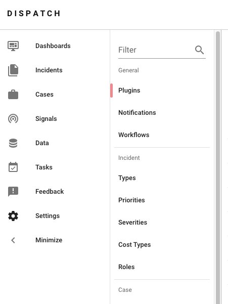
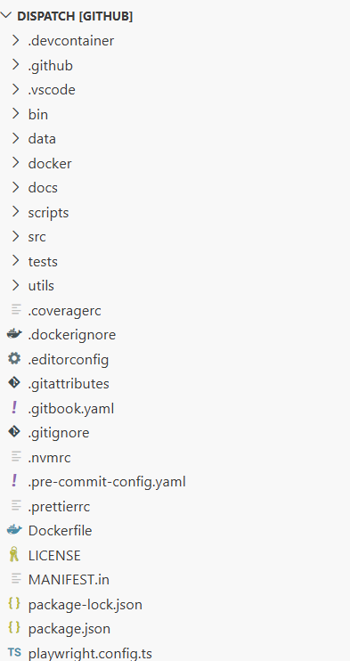
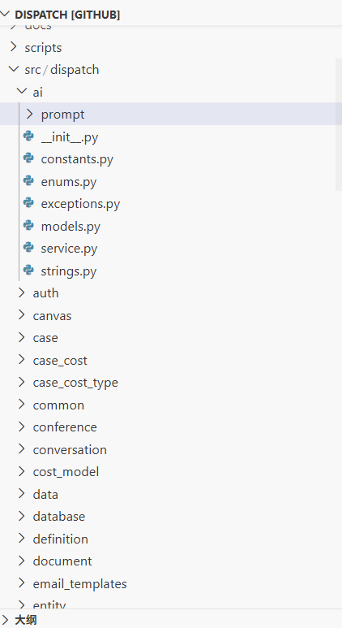
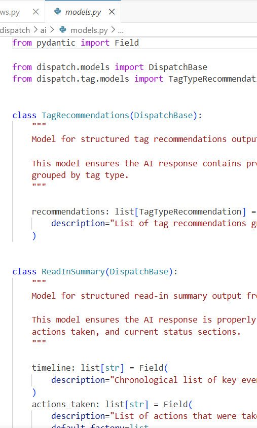
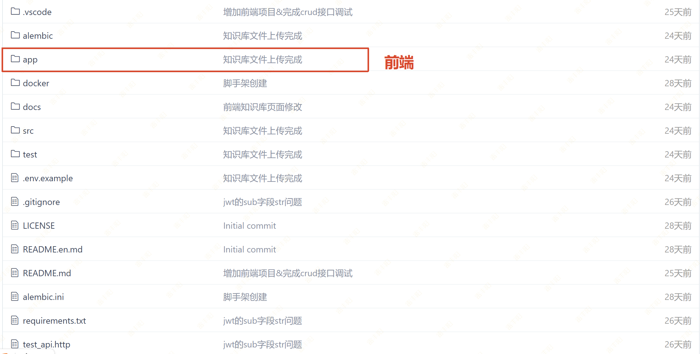

# 1. 【Web项目】- 辰光Agent平台

# 项目概述

## 项目介绍

> **《辰光Agent平台》****是企业内部****整合、管理各种大模型****与**`Agent的基础平台`。重点功能：
> 
> 1. 基于`RBAC用户权限`配置
> 2. 各厂商模型整合配置
> 3. Agent配置、提示词模板
> 4. 模型 & Agent 功能测试页
> 5. 数据信息统计



> 项目开源地址：https://gitee.com/leifengyang/chenguang-agent-platform/

## 技术栈

### FastAPI 全栈模板（官方）

- **后端**：
  - ⚡ [**FastAPI**](https://fastapi.tiangolo.com/zh) 用于 Python 后端 API。
  - 🧰 [SQLModel](https://sqlmodel.tiangolo.com/) 用于 Python 与 SQL 数据库的交互（ORM）。
  - 🔍 [Pydantic](https://docs.pydantic.dev/)，FastAPI 使用，用于数据验证与配置管理。
  - 💾 [PostgreSQL](https://www.postgresql.org/) 作为 SQL 数据库。
- **前端：**
  - 🚀 [React](https://react.dev/) 用于前端。
  - 💃 使用 TypeScript、hooks、Vite 以及现代前端技术栈的其他部分。
  - 🎨 [Tailwind CSS](https://tailwindcss.com/) 与 [shadcn/ui](https://ui.shadcn.com/) 用于前端组件。
  - 🤖 自动生成的前端客户端。
  - 🧪 [Playwright](https://playwright.dev/) 用于端到端测试。
  - 🦇 支持暗黑模式。
- **功能**：
  - 🔒 默认启用安全的密码哈希。
  - 🔑 JWT（JSON Web Token）认证。
  - 📫 基于邮箱的密码找回。
  - ✅ 使用 [Pytest](https://pytest.org/) 进行测试。
- **运维**：
  - 🐋 [Docker Compose](https://www.docker.com/) 用于开发与生产。
  - 📞 [Traefik](https://traefik.io/) 用作反向代理/负载均衡。
  - 🚢 使用 Docker Compose 的部署指南，包括如何设置前端 Traefik 代理以自动处理 HTTPS 证书。
  - 🏭 基于 GitHub Actions 的 CI（持续集成）与 CD（持续部署）。

> **FastAPI 编写了一个模板项目；可以基于此项目进行改造**
> 
> GitHub 仓库： [Full Stack FastAPI Template](https://github.com/tiangolo/full-stack-fastapi-template)
> 
> 生态其他相关框架：https://fastapi.tiangolo.com/zh/external-links/#github-repositories

### 项目技术选型

> **开发模式**：`手动开发`、`VibeCoding`、 `Git`
> 
> **语言&框架**：`Python 3.13.x` 、`FastAPI`
> 
> **包与环境管理**：`conda + pip + requirements.txt`
> 
> **数据库与ORM**：`MySQL`、`asyncmy`、`SQLAlchemy 2.0（异步）`、`Alembic`
> 
> **认证系统**：`自实现RBAC`
> 
> **缓存服务**：`Redis`
> 
> **AI模型基座**：`Ollama`、`云平台模型`
> 
> **容器化**：`Docker`、`Docker Compose`
> 
> **前端**：`Vite`、`React`、`开发好的项目 + VibeCoding 功能修改`
> 
> **架构设计**：`领域架构模式（非MVC模式分层）`

- **MVC模式：先分技术层(api/model)，再分业务模块层(user/order...)**

| 功能 | java包 | java包内部 | fastapi模块 | fastapi模块内部 |
| --- | --- | --- | --- | --- |
| 视图 | controller | UserController OrderController.. | api | user.py、order.py |
| 数据传输 | dto | UerDTO、OrderDTO | schema | user.py、order.py |
| 业务逻辑 | service + impl | User/OrderService、 User/OrderServiceImpl | service | user.py、order.py |
| 数据库操作 | dao / mapper | UserMapper... | crud | user.py、order.py |
| 实体模型 | model / entity | UserEnity、OrderEntity | model | user.py、order.py |

- **领域设计模式：先分业务模块层，再分技术层**

| 功能 | java包 | java包内部 | fastapi模块 | fastapi模块内部 |
| --- | --- | --- | --- | --- |
| 用户域 | user | UserController、UserEntity、UserMapper | user | [api.py](http://api.py)、[model.py](http://model.py)、[service.py](http://service.py)、[crud.py](http://crud.py) |
| 订单域 | order | OrderController、OrderEntity、OrderMapper | order | api.py、model.py、service.py、crud.py |

## 工程架构

### 模式一：扁平化结构（按技术层次划分）

> 说明：**本模式适合小型/早期项目用于快速起步或教学示例**，在项目进入多人协作或业务复杂度提升后，应尽快演进到混合模式结构。

```python
backend/
├── main.py                 # 应用入口
├── config.py              # 配置管理
├── pyproject.toml         # 项目配置和依赖（使用 uv 管理）
├── uv.lock                # 锁定的依赖版本（使用 uv 生成）
│
├── app/
│   ├── __init__.py
│   │
│   ├── api/               # API 路由层
│   │   ├── __init__.py
│   │   ├── router.py      # 路由统一注册
│   │   ├── users.py       # 用户路由
│   │   ├── projects.py    # 项目路由
│   │   └── [module].py    # 其他模块路由
│   │
│   ├── core/              # 核心基础设施层
│   │   ├── __init__.py
│   │   ├── config.py      # 配置管理
│   │   ├── exceptions.py  # 异常定义
│   │   ├── handlers.py    # 异常处理器
│   │   ├── response.py    # 响应模型
│   │   ├── security/       # 安全认证
│   │   │   ├── dependencies.py
│   │   │   └── jwt_handler.py
│   │   └── middleware/     # 中间件
│   │
│   ├── db/                # 数据库层
│   │   ├── __init__.py
│   │   ├── base.py        # 基础模型类
│   │   ├── connection.py  # 数据库连接
│   │   ├── models/        # 数据模型
│   │   │   ├── user.py
│   │   │   └── project.py
│   │   └── repositories/  # 仓储层
│   │       ├── user.py
│   │       └── project.py
│   │
│   ├── schemas/           # Pydantic 模式层
│   │   ├── __init__.py
│   │   ├── common/        # 通用模式
│   │   │   ├── response.py
│   │   │   └── pagination.py
│   │   └── modules/       # 业务模块模式
│   │       ├── user/
│   │       │   ├── requests.py
│   │       │   └── responses.py
│   │       └── [module]/
│   │
│   ├── services/          # 业务逻辑层
│   │   ├── __init__.py
│   │   ├── user_service.py
│   │   ├── project_service.py
│   │   └── [module]_service.py
│   │
│   └── utils/             # 工具函数层
│       ├── __init__.py
│       ├── format.py
│       └── validation.py
│
├── tests/                 # 测试目录
│   ├── __init__.py
│   ├── conftest.py
│   └── test_*.py
│
└── scripts/               # 脚本目录
    └── migrations/        # 数据库迁移
```

**特点：**

- ✅ **认知负担低**：按技术类型分类，直观易懂
- ✅ 路径短：`app/services/user_service.py`，导入路径简洁
- ✅ 共享代码集中：通用服务、工具函数天然集中，便于复用
- ✅ **适合小型项目**：结构简单，上手快，开发效率高

**适用场景：**

- 项目初期（< 10 个 API 端点）
- 小型项目（1-2 人团队）
- 功能相对简单，模块边界不清晰
- 快速原型开发

**局限性：**

- ❌ 文件定位困难：`services/` 下文件多时难以快速定位
- ❌ 模块边界模糊：用户相关代码分散在多个目录
- ❌ 并行协作冲突：多人修改同一模块时容易冲突
- ❌ 模块拆分困难：相关代码分散，难以独立拆分

### 模式二：混合模式（功能领域 + 技术层次）

```python
backend/
├── main.py                 # 应用入口
├── config.py              # 配置管理
├── pyproject.toml         # 项目配置
│
├── app/
│   ├── __init__.py
│   │
│   ├── core/              # 核心基础设施层（技术层次）
│   │   ├── __init__.py
│   │   ├── config.py      # 配置管理
│   │   ├── exceptions/    # 异常定义
│   │   │   ├── __init__.py
│   │   │   ├── base.py
│   │   │   └── handlers.py
│   │   ├── response.py    # 响应模型
│   │   ├── schemas.py     # 通用模式
│   │   ├── security/      # 安全认证
│   │   │   ├── dependencies.py
│   │   │   └── jwt_handler.py
│   │   └── middleware/    # 中间件
│   │
│   ├── db/                # 数据库层（技术层次）
│   │   ├── __init__.py
│   │   ├── base.py        # 基础模型类
│   │   ├── connection.py  # 数据库连接
│   │   └── repositories/  # 基础仓储类
│   │       └── base.py
│   │
│   ├── infra/            # 基础服务层（跨模块）
│   │   ├── __init__.py
│   │   ├── storage/       # 存储服务
│   │   │   └── minio_service.py
│   │   ├── cache/         # 缓存服务
│   │   ├── messaging/     # 消息服务
│   │   └── utils/         # 共享工具函数
│   │
│   ├── modules/           # 业务模块层（功能领域）
│   │   ├── __init__.py
│   │   │
│   │   ├── user/          # 用户模块
│   │   │   ├── __init__.py
│   │   │   ├── models.py      # 模块数据模型
│   │   │   ├── schemas.py     # 模块 Pydantic 模式
│   │   │   ├── repositories.py # 模块仓储
│   │   │   ├── services.py    # 模块服务
│   │   │   ├── routers.py     # 模块路由
│   │   │   └── dependencies.py # 模块依赖
│   │   │
│   │   ├── project/       # 项目模块
│   │   │   ├── __init__.py
│   │   │   ├── models.py
│   │   │   ├── schemas.py
│   │   │   ├── repositories.py
│   │   │   ├── services.py
│   │   │   ├── routers.py
│   │   │   └── dependencies.py
│   │   │
│   │   └── [module]/      # 其他业务模块
│   │
│   └── api/               # API 统一注册层
│       ├── __init__.py
│       └── router.py      # 路由统一注册
│
├── tests/                 # 测试目录
│   ├── __init__.py
│   ├── conftest.py
│   └── modules/           # 按模块组织测试
│       ├── user/
│       └── project/
│
└── scripts/               # 脚本目录
    └── migrations/        # 数据库迁移
```

**特点：**

- ✅ 模块边界清晰：相关代码集中，易于理解业务逻辑
- ✅ 支持并行协作：不同模块可并行开发，减少冲突
- ✅ 便于模块拆分：模块自包含，可独立部署
- ✅ 可扩展性强：新模块按相同结构添加，结构清晰

**适用场景：**

- 中大型项目（> 10 个 API 端点）
- 多人团队协作（3+ 人）
- 业务领域清晰，模块边界明确
- 需要模块独立部署或复用

**局限性：**

- ❌ 认知负担增加：需要理解"共享 vs 模块特定"的划分
- ❌ 路径变长：`app/modules/user/services.py`
- ❌ 可能重复：模块间可能有相似代码
- ❌ 决策成本：需要判断代码放在共享层还是模块内

### `netflix-dispatch`

https://netflix.github.io/dispatch/



> 工程结构







### 最佳实践

> 小细节：每个模块下我们都没有写 `__init__.py`。因为 ** Python（>=3.3）可以不放 **`init.py`** 也能 import。这叫命名空间包；**
> 
> **区别：**
> 
> 1. 单从import来说。写与不写 __init__.py 都是一样的。为了项目干净，我们选择不放。
> 2. `__init__.py`的唯一作用，就是可以在文件中写代码（初始化逻辑、导入子模块、定义变量等），包初始化的时候会执行

```bash
fastapi-project
├── alembic/
├── src
│   ├── auth  # auth 模块
│   │   ├── router.py
│   │   ├── schemas.py  # pydantic模型
│   │   ├── models.py  # 数据库模型
│   │   ├── dependencies.py
│   │   ├── config.py  # 本地配置
│   │   ├── constants.py
│   │   ├── exceptions.py
│   │   ├── service.py
│   │   └── utils.py
│   ├── user  # user 模块
│   │   ├── client.py  # 用于外部服务通信的客户端模型
│   │   ├── schemas.py
│   │   ├── config.py
│   │   ├── constants.py
│   │   ├── exceptions.py
│   │   └── utils.py
│   ├── posts # post 模块
│   │   ├── router.py
│   │   ├── schemas.py
│   │   ├── models.py
│   │   ├── dependencies.py
│   │   ├── constants.py
│   │   ├── exceptions.py
│   │   ├── service.py
│   │   └── utils.py
│   ├── core # 核心包
│   │   ├──config.py  # 全局配置
│   │   ├──models.py  # 全局模型
│   │   ├──exceptions.py  # 全局异常
│   │   ├──pagination.py  # 全局模块，如分页
│   │   ├──database.py  # 数据库连接相关内容
│   └── main.py
├── tests/
│   ├── auth
│   ├── user
│   └── posts
├── templates/
│   └── index.html
├── requirements.txt
├── .env
├── .gitignore
├── logging.ini
└── alembic.ini
```

## 开发计划

> 自测功能：**使用**`VibeCoding`**完成数据统计与图表； 整合echarts&数据图表**

## 全部代码

https://gitee.com/leifengyang/chenguang-agent-platform

