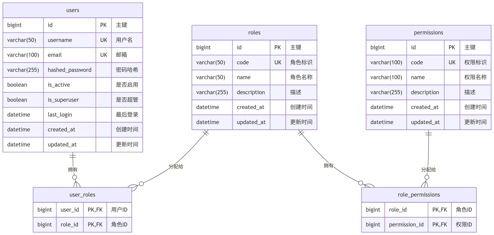
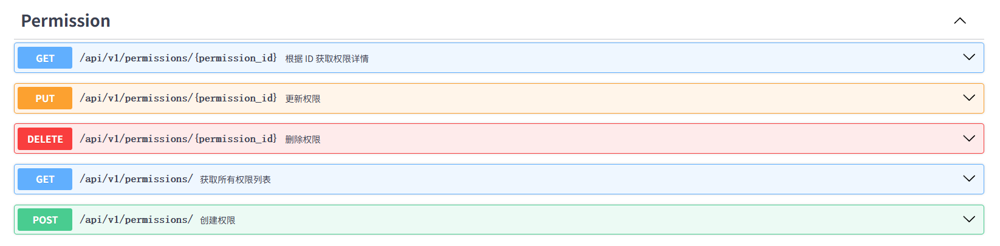
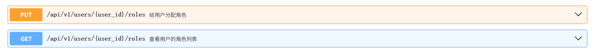

# 2. RBAC权限开发

# 权限模型

## RBAC

> **RBAC **= **Role-Based Access Control****（基于角色的访问控制）**。
> 
> 核心思路很简单：
> 
> - **用户（User）**拥有若干**角色（Role）**
> - **角色（Role）**拥有若干**权限（Permission）**
> - **权限（Permission）：**
>   - **将来可以关联 ****菜单（Menus）****、****按钮（Button）****、****API****、****操作(下载/上传)**** 这些****实体**
>   - **每个实体**都对应一个**权限标识（****权限码****）**
> - **访问接口时**，**检查当前用户是否拥有该接口所需的权限**

> 数据库 ER 图：**3 张业务表 + 2 张关联表 = 共 5 张表。**



## 其他模型

1. ACL（访问控制列表）— 直接给用户绑定资源权限，最简单
2. DAC（自主访问控制）— 资源所有者自主分享，适合协作场景
3. MAC（强制访问控制）— 系统强制分级，适合军事/政府
4. RBAC（基于角色）— 本项目采用，RBAC完整版含 `RBAC0 - 3` 变体
5. ABAC（基于属性）— 策略引擎动态判断，最灵活
6. ReBAC（基于关系）— 资源层级权限传递，适合文件树/组织架构

# 阶段一：模型定义（环境）

> **注意**：
> 
> 前面开发登录接口的时候，我们已经开发了 user 模块。接下来就重点开发 role、permission模块

## 第 1 步：创建 Permission 模型

> 🎯 目标：新增 `permissions` 表，存储系统中所有权限定义

### 创建模块目录

只写 `model.py`，其余文件先创建空文件占位。

```python
src/modules/permission/
├── model.py
├── schema.py
├── repository.py
├── service.py
└── api.py
```

### 编写 model.py

文件：`src/modules/permission/model.py`

定义 `Permission` 类，继承 `BaseModel`，表名 `permissions`，字段如下：

| 字段 | 类型 | 约束 | 说明 |
| --- | --- | --- | --- |
| id | BigInteger | PK, 自增 | 继承自 BaseModel |
| code | String(100) | unique, index | 权限标识，如 user:list |
| name | String(100) | — | 权限名称，如 "用户列表" |
| description | String(255) | nullable | 权限描述 |
| created_at | DateTime | — | 继承自 BaseModel |
| updated_at | DateTime | — | 继承自 BaseModel |

> - `code` 是权限的唯一标识，后续校验权限时用这个字段匹配
> - 命名规范建议 `模块:操作`，如 `user:list`、`user:create`、`role:delete`

```python
from sqlalchemy import String
from sqlalchemy.orm import Mapped, mapped_column
from src.core.base_model import BaseModel

class Permission(BaseModel):
    __tablename__ = "permissions"
    code: Mapped[str] = mapped_column(String(100), unique=True, comment="权限编码")
    name: Mapped[str] = mapped_column(String(100),  comment="权限名称")
    description: Mapped[str] = mapped_column(String(200), nullable=True, comment="权限描述")

```

### Alembic 数据库变更

打开 `alembic/env.py`，在已有的 import 下面加一行：

```python
import src.modules.permission.model  # noqa: F401
```

数据库变更

```python
# 生成数据库变更记录
alembic revision --autogenerate -m "add_permissions_table"

# 执行变更
alembic upgrade head
```

## 第 2 步：创建 Role 模型 + role_permissions 关联表

🎯任务：新增 `roles` 表和 `role_permissions` 关联表

### 创建模块目录

> 只写 `model.py`。

```python
src/modules/role/
├── model.py
├── schema.py
├── repository.py
├── service.py
└── api.py
```

### 编写 Role 模型

> 文件：`src/modules/role/model.py`; 重点定义ORM模型本身和ORM关联表

#### `role_permissions `关联表

使用 SQLAlchemy 的 `Table` 对象快速定义多对多关联表**（可以不使用 ORM 模型类）**：

```sql
from sqlalchemy import Table, Column, BigInteger, ForeignKey
from src.core.base_model import Base

role_permissions = Table(
    "role_permissions",
    Base.metadata,
    Column("role_id", BigInteger, ForeignKey("roles.id", ondelete="CASCADE"), primary_key=True),
    Column("permission_id", BigInteger, ForeignKey("permissions.id", ondelete="CASCADE"), primary_key=True),
)
```

> 核心点：
> 
> - 两个列都设置主键，则形成**联合主键 **`(role_id, permission_id)`，代表联合主键不能重复
> - `ondelete="CASCADE"`：删除角色或权限时自动清理关联记录
> - 使用 `Base.metadata` 而不是 `BaseModel`，因为关联表不需要 id/created_at/updated_at

#### `Role `模型类

继承 `BaseModel`，表名 `roles`，字段如下：

| 字段 | 类型 | 约束 | 说明 |
| --- | --- | --- | --- |
| id | BigInteger | PK, 自增 | 继承自 BaseModel |
| code | String(50) | unique, index | 角色标识，如 admin |
| name | String(50) | — | 角色名称，如 "管理员" |
| description | String(255) | nullable | 角色描述 |
| created_at | DateTime | — | 继承自 BaseModel |
| updated_at | DateTime | — | 继承自 BaseModel |

```python
from sqlalchemy import BigInteger, Column, ForeignKey, String, Table
from sqlalchemy.orm import Mapped, mapped_column, relationship
from src.core.base_model import BaseModel,Base
from src.modules.permission.model import Permission

role_permissions = Table(
    "role_permissions",
    Base.metadata,
    Column("role_id", BigInteger, ForeignKey("roles.id", ondelete="CASCADE"), primary_key=True),
    Column("permission_id", BigInteger, ForeignKey("permissions.id", ondelete="CASCADE"), primary_key=True),
)

class Role(BaseModel):
    __tablename__ = "roles"
    code: Mapped[str] = mapped_column(String(100), unique=True, comment="角色编码")
    name: Mapped[str] = mapped_column(String(100),  comment="角色名称")
    description: Mapped[str] = mapped_column(String(200), nullable=True, comment="角色描述")
    permissions: Mapped[list["Permission"]] = relationship(
        "Permission",
        secondary=role_permissions,
        lazy="selectin",
        # backref="roles",
    )

```

> 核心点
> 
> - `backref="roles"` 取消了配置。从实际业务出发，我们只会用到 `role.permissions` 这样的关系，也就是**经常查看一个角色对应的所有权限**，而不用 `permission.roles` 这样的关系，**没有通过权限去查看对应角色**的场景
> - `secondary=role_permissions` 指定关联表
> - `lazy="selectin"` 表示查询 Role 时自动加载关联的 Permission 列表（异步友好）

### Alembic 数据库变更

打开 `alembic/env.py`，在已有的 import 下面加一行：

```python
import src.modules.role.model  # noqa: F401
```

数据库变更

```python
# 生成数据库变更记录
alembic revision --autogenerate -m "add_roles_table"

# 执行变更
alembic upgrade head
```

## 第 3 步：User-Role 关联

🎯 任务：建立 User 和 Role 的多对多关系，新增 `user_roles` 关联表

### 定义 user_roles 关联表

文件：`src/modules/role/model.py`（在同一个文件中追加）；

在 `role_permissions` 关联表下方，再定义一个关联表：

```sql
user_roles = Table(
    "user_roles",
    Base.metadata,
    Column("user_id", BigInteger, ForeignKey("users.id", ondelete="CASCADE"), primary_key=True),
    Column("role_id", BigInteger, ForeignKey("roles.id", ondelete="CASCADE"), primary_key=True),
)
```

> **思考：为什么放在 **`role/model.py`** 而不是 **`user/model.py`**？**
> 
> > 因为 `user_roles` 和 `role_permissions` 都是角色体系的一部分，放在一起方便管理。也避免循环导入。

### 修改 User 模型

> 文件：`src/modules/user/model.py`；给 User 类新增 `roles` 关系字段：
> 
> - 需要在文件顶部 `from src.modules.role.model import user_roles`
> - `"Role"` 使用字符串形式避免循环导入
> - `lazy="selectin"` 确保异步查询时自动加载角色

```python
from sqlalchemy.orm import relationship
from src.modules.role.model import user_roles

class User(BaseModel):
    __tablename__ = "users"
    # ... 保留原有字段不变 ...

    # 新增：用户拥有的角色列表
    roles: Mapped[list["Role"]] = relationship(
        secondary=user_roles,
        lazy="selectin",
    )
```

### Alembic 数据库变更

User 表之前已经创建，只需要创建  `user_roles `表；直接执行变更即可

```python
# 生成数据库变更记录
alembic revision --autogenerate -m "add_roles_table"

# 执行变更
alembic upgrade head
```

# 阶段二：CRUD接口（基础）

## Permission 模块 CRUD

> 目标：完成权限的增删改查 API，能通过接口管理权限数据

### 第 1 步：定义 Schema

文件：`src/modules/permission/schema.py`；定义以下 Pydantic 模型：

```python
from pydantic import BaseModel

# 定义 pydantic 模型
class PermissionCreate(BaseModel):
    code: str          # 权限标识，如 "user:list"
    name: str          # 权限名称，如 "用户列表"
    description: str | None = None

class PermissionUpdate(BaseModel):
    name: str | None = None
    description: str | None = None
    # code 不允许修改


class PermissionRead(BaseModel):
    id: int
    code: str
    name: str
    description: str | None
    model_config = {"from_attributes": True}
```

### 第 2 步：编写 Repository

文件：`src/modules/permission/repository.py`

继承 `BaseRepository[Permission]`，新增一个自定义查询：

```python
from src.core.base_repository import BaseRepository
from sqlalchemy.ext.asyncio import AsyncSession
from sqlalchemy import select

from src.modules.permission.model import Permission

class PermissionRepository(BaseRepository[Permission]):
    def __init__(self, db: AsyncSession):
        super().__init__(Permission, db)

    async def get_by_code(self, code: str) -> Permission | None:
        # 根据 code 查询权限, code 是唯一的，所以返回值是 Permission 或 None
        return await self.db.scalar(
            select(Permission).filter(Permission.code == code)
        )
```

### 第 3 步：编写 Service

文件：`src/modules/permission/service.py`

#### 结构定义：

> Service 中定义好通用的 增删改查方法就可以了。将来交给 api 调用

```python
from src.core.exceptions import BizException
from src.infra.database import AsyncSession
from src.modules.permission.model import Permission
from src.modules.permission.repository import PermissionRepository
from src.modules.permission.schema import PermissionCreate, PermissionUpdate

class PermissionService:
    def __init__(self, db: AsyncSession):
        self.repo = PermissionRepository(db)

    async def create_permission(self, data: PermissionCreate) -> Permission:
        # 1. 检查 code 是否已存在，已存在则抛 BizException
        # 2. 创建 Permission 对象
        # 3. 调用 repo.create() 保存
        pass

    async def get_permission(self, permission_id: int) -> Permission:
        # 查不到抛 BizException(code=404)
        pass

    async def list_permissions(self) -> list[Permission]:
        # 调用 repo.get_all()
        pass

    async def update_permission(self, permission_id: int, data: PermissionUpdate) -> Permission:
        # 1. 查找权限，不存在抛异常
        # 2. 只更新 data 中非 None 的字段
        # 3. 调用 repo.update()
        pass

    async def delete_permission(self, permission_id: int) -> None:
        # 1. 查找权限，不存在抛异常
        # 2. 调用 repo.delete()
        pass
```

#### 完整代码

```python
from src.core.exceptions import BizException
from src.infra.database import AsyncSession
from src.modules.permission.model import Permission
from src.modules.permission.repository import PermissionRepository
from src.modules.permission.schema import PermissionCreate, PermissionUpdate

class PermissionService:
    def __init__(self, db: AsyncSession):
        self.repo = PermissionRepository(db)

    async def create_permission(self, data: PermissionCreate) -> Permission:
        # 1. 检查 code 是否已存在，已存在则抛 BizException
        existing = await self.repo.get_by_code(data.code)
        if existing:
            raise BizException(code=400, message="权限码已经存在")

        # 2. 创建 Permission 对象
        permission = Permission(
            code=data.code,
            name=data.name,
            description=data.description
        )
        await self.repo.create(permission)
        return permission

    async def get_permission(self, permission_id: int) -> Permission:
        # 查不到抛 BizException(code=404)
        permission = await self.repo.get_by_id(permission_id)
        if not permission:
            raise BizException(code=404, message="权限不存在")
        return permission

    async def list_permissions(self) -> list[Permission]:
        # 调用 repo.get_all()
        return await self.repo.get_all()

    async def update_permission(self, permission_id: int, data: PermissionUpdate) -> Permission:
        # 1. 查找权限，不存在抛异常
        permission = await self.get_permission(permission_id)
        if not permission:
            raise BizException(code=404, message="权限不存在")
        # 2. 只更新 data 中非 None 的字段
        if data.name is not None:
            permission.name = data.name
        if data.description is not None:
            permission.description = data.description
        # 3. 调用 repo.update()
        await self.repo.update(permission)
        return permission

    async def delete_permission(self, permission_id: int) -> None:
        # 1. 查找权限，不存在抛异常
        permission = await self.get_permission(permission_id)
        if not permission:
            raise BizException(code=404, message="权限不存在")
        # 2. 调用 repo.delete()
        await self.repo.delete(permission)
        return None

```

### 第 4 步：编写 API

文件：`src/modules/permission/api.py`；

先编写以下基本接口功能。后面再编写分页查询

| 方法 | 路径 | 说明 |
| --- | --- | --- |
| POST | /api/v1/permissions | 创建权限 |
| GET | /api/v1/permissions | 权限列表 |
| GET | /api/v1/permissions/{permission_id} | 权限详情 |
| PUT | /api/v1/permissions/{permission_id} | 更新权限 |
| DELETE | /api/v1/permissions/{permission_id} | 删除权限 |

> 每个接口的写法参照现有 `user/api.py` 的模式：
> 
> - 通过 `Depends` 注入 Service
> - 返回 `ResponseSchema[PermissionRead]` 或 `ResponseSchema[list[PermissionRead]]`

```python
from fastapi import APIRouter, Depends
from src.core.base_schema import ResponseSchema
from src.infra.database import get_db
from sqlalchemy.ext.asyncio import AsyncSession
from src.modules.permission.schema import PermissionCreate, PermissionRead, PermissionUpdate
from src.modules.permission.service import PermissionService

router = APIRouter(prefix="/permissions", tags=["Permission"])

def get_permission_service(db: AsyncSession = Depends(get_db)) -> PermissionService:
    return PermissionService(db)

@router.get("/{permission_id}", response_model=ResponseSchema[PermissionRead], summary="根据 ID 获取权限详情")
async def get_permission(permission_id: int, service: PermissionService = Depends(get_permission_service)):
    """根据 ID 获取权限"""
    permission = await service.get_permission(permission_id)
    return ResponseSchema(data=PermissionRead.model_validate(permission))

@router.get("/", response_model=ResponseSchema[list[PermissionRead]], summary="获取所有权限列表")
async def list_permissions(service: PermissionService = Depends(get_permission_service)):
    """获取所有权限"""
    permissions = await service.list_permissions()
    return ResponseSchema(data=[PermissionRead.model_validate(p) for p in permissions])

@router.post("/", response_model=ResponseSchema[PermissionRead], summary="创建权限")
async def create_permission(data: PermissionCreate, 
service: PermissionService = Depends(get_permission_service)):
    """创建权限"""
    permission = await service.create_permission(data)
    return ResponseSchema(data=PermissionRead.model_validate(permission))

@router.put("/{permission_id}", response_model=ResponseSchema[PermissionRead], summary="更新权限")
async def update_permission(permission_id: int, data: PermissionUpdate, 
service: PermissionService = Depends(get_permission_service)):
    """更新权限"""
    permission = await service.update_permission(permission_id, data)
    return ResponseSchema(data=PermissionRead.model_validate(permission))

@router.delete("/{permission_id}", response_model=ResponseSchema[None], summary="删除权限")
async def delete_permission(permission_id: int, 
service: PermissionService = Depends(get_permission_service)):
    """删除权限"""
    await service.delete_permission(permission_id)
    return ResponseSchema(data=None)
```

### 第 5 步：注册路由

`src/main.py` 中新增：

```python
from src.modules.permission.api import router as permission_router
app.include_router(permission_router, prefix="/api/v1")
```

### swagger测试



## Role 模块 CRUD + 分配权限

> **目标**：完成角色的**增删改查 **+ 给**角色分配权限**的 API

### 第 1 步：定义 Schema

文件：`src/modules/role/schema.py`

> 注意 `RoleRead` 中嵌套了 `PermissionRead`，需要从 permission 模块导入。

```python
from pydantic import BaseModel
from src.modules.permission.schema import PermissionRead

class RoleCreate(BaseModel):
    code: str              # 角色标识，如 "admin"
    name: str              # 角色名称，如 "管理员"
    description: str | None = None

class RoleUpdate(BaseModel):
    name: str | None = None
    description: str | None = None

class RoleRead(BaseModel):
    id: int
    code: str
    name: str
    description: str | None
    permissions: list[PermissionRead] = []    # 嵌套返回角色拥有的权限
    model_config = {"from_attributes": True}

class RoleAssignPermissions(BaseModel):
    permission_ids: list[int]    # 要分配给该角色的权限 ID 列表
```

### 第 2 步：编写 Repository

文件：`src/modules/role/repository.py`

继承 `BaseRepository[Role]`，新增：

#### 定义结构

```python
class RoleRepository(BaseRepository[Role]):
    def __init__(self, db: AsyncSession):
        super().__init__(Role, db)

    async def get_by_code(self, code: str) -> Role | None:
        # 根据 code 查询角色

    async def get_by_ids(self, ids: list[int]) -> list[Role]:
        # 根据 ID 列表批量查询角色
        # 用于用户分配角色时批量校验角色是否存在
        # stmt = select(Role).where(Role.id.in_(ids))
```

#### 完整代码

```python
from sqlalchemy.ext.asyncio import AsyncSession
from src.core.base_repository import BaseRepository
from src.modules.role.model import Role
from sqlalchemy import select

class RoleRepository(BaseRepository[Role]):
    def __init__(self, db: AsyncSession):
        super().__init__(Role, db)

    async def get_by_code(self, code: str) -> Role | None:
        # 根据 code 查询角色
        stmt = select(Role).where(Role.code == code)
        result = await self.db.execute(stmt)
        return result.scalar_one_or_none()

    async def get_by_ids(self, ids: list[int]) -> list[Role]:
        # 根据 ID 列表批量查询角色
        # 用于用户分配角色时批量校验角色是否存在
        stmt = select(Role).where(Role.id.in_(ids))
        result = await self.db.execute(stmt)
        return result.scalars().all()

```

### 第 3 步：编写 Service

文件：`src/modules/role/service.py`

#### 定义结构

```python
class RoleService:
    def __init__(self, db: AsyncSession):
        self.repo = RoleRepository(db)
        self.permission_repo = PermissionRepository(db)

    async def create_role(self, data: RoleCreate) -> Role:
        # 检查 code 是否已存在
        pass
    async def get_role(self, role_id: int) -> Role:
        # 查不到抛异常
        pass

    async def list_roles(self) -> list[Role]:
        pass

    async def update_role(self, role_id: int, data: RoleUpdate) -> Role:
        pass

    async def delete_role(self, role_id: int) -> None:
        pass

    async def assign_permissions(self, role_id: int, permission_ids: list[int]) -> Role:
        # 这是本节的重点方法！
        # 1. 查找角色，不存在抛异常
        # 2. 根据 permission_ids 批量查询 Permission 对象
        # 3. 校验：如果查到的数量 != 传入的数量，说明有无效 ID，抛异常
        # 4. 直接替换角色的权限列表：role.permissions = permission_list
        # 5. flush + refresh
        # 6. 返回更新后的 role（会自动带上新的 permissions）
        pass
```

#### 完整实现

```python
from src.core.exceptions import BizException
from src.modules.role.schema import RoleUpdate
from src.modules.role.model import Role
from src.modules.role.schema import RoleCreate
from src.modules.permission.repository import PermissionRepository
from src.modules.role.repository import RoleRepository
from sqlalchemy.ext.asyncio import AsyncSession

class RoleService:
    def __init__(self, db: AsyncSession):
        self.repo = RoleRepository(db)
        self.permission_repo = PermissionRepository(db)
    

    async def create_role(self, data: RoleCreate) -> Role:
        # 检查 code 是否已存在
        role = await self.repo.get_by_code(data.code)
        if role:
            raise BizException(f"角色 {data.code}-{data.name} 已经存在")

        role = Role(**data.model_dump())
        role = await self.repo.create(role)
        return role

    async def get_role(self, role_id: int) -> Role:
        # 查不到抛异常
        role = await self.repo.get_by_id(role_id)
        if not role:
            raise BizException(f"角色 {role_id} 不存在")
        return role

    async def list_roles(self) -> list[Role]:
        roles = await self.repo.get_all()
        return roles

    async def update_role(self, role_id: int, data: RoleUpdate) -> Role:
        # 查不到抛异常
        role = await self.get_role(role_id)
        if not role:
            raise BizException(f"角色 {role_id} 不存在")
        role.name = data.name or role.name
        role.description = data.description or role.description
        role = await self.repo.update(role)
        return role

    async def delete_role(self, role_id: int) -> None:
        await self.repo.delete(role)
        return None

    async def assign_permissions(self, role_id: int, permission_ids: list[int]) -> Role:
        # 这是本节的重点方法！
        # 1. 查找角色，不存在抛异常
        role = await self.get_role(role_id)
        if not role:
            raise BizException(f"角色 {role_id} 不存在")
        # 2. 根据 permission_ids 批量查询 Permission 对象
        permission_list = await self.permission_repo.get_by_ids(permission_ids)
        
        # 3. 校验：如果查到的数量 != 传入的数量，说明有无效 ID，抛异常
        if len(permission_list) != len(permission_ids):
            raise BizException(f"权限 ID 列表中包含无效 ID")
        
        # 4. 直接替换角色的权限列表：role.permissions = permission_list
        role.permissions = permission_list

        # 5. flush + refresh
        await self.repo.update(role)
        # 6. 返回更新后的 role（会自动带上新的 permissions）
        return role
```

### 第 4 步：编写 API

文件：`src/modules/role/api.py`

`router = APIRouter(prefix="/roles", tags=["Role"])`

*📊 在线表格（无数据）*

分配权限接口的请求体是 `RoleAssignPermissions`，返回 `ResponseSchema[RoleRead]`。

> 实现如下

```python
from src.modules.role.schema import RoleAssignPermissions
from src.modules.permission.schema import PermissionRead
from src.core.base_schema import ResponseSchema
from src.modules.role.schema import RoleRead
from fastapi import APIRouter, Depends
from sqlalchemy.ext.asyncio import AsyncSession
from src.modules.role.schema import RoleCreate, RoleUpdate, RoleAssignPermissions

from src.modules.role.service import RoleService
from src.infra.database import get_db

router = APIRouter(prefix="/roles", tags=["Role"])

def get_role_service(db: AsyncSession = Depends(get_db)) -> RoleService:
    return RoleService(db)

# POST  /api/v1/roles   创建角色
@router.post("/roles", response_model=ResponseSchema[RoleRead])
async def create_role(role: RoleCreate, service: RoleService = Depends(get_role_service)):
    data = await service.create_role(role)
    return ResponseSchema[RoleRead](data=RoleRead.model_validate(data))

# GET   /api/v1/roles/{role_id} 角色详情（含权限列表）
@router.get("/roles/{role_id}", response_model=ResponseSchema[RoleRead])
async def get_role(role_id: int, service: RoleService = Depends(get_role_service)):
    data = await service.get_role(role_id)
    permissions = [PermissionRead.model_validate(p) for p in data.permissions]

    rd = RoleRead.model_validate(data)
    rd.permissions = permissions
    return ResponseSchema[RoleRead](data=rd)

# GET   /api/v1/roles   角色列表
@router.get("/roles", response_model=ResponseSchema[list[RoleRead]])
async def get_roles(service: RoleService = Depends(get_role_service)):
    data = await service.list_roles()
    return ResponseSchema[list[RoleRead]](data=[RoleRead.model_validate(r) for r in data])

# PUT   /api/v1/roles/{role_id} 更新角色
@router.put("/roles/{role_id}", response_model=ResponseSchema[RoleRead])
async def update_role(role_id: int, role: RoleUpdate, service: RoleService = Depends(get_role_service)):
    data = await service.update_role(role_id, role)
    return ResponseSchema[RoleRead](data=RoleRead.model_validate(data))

# DELETE    /api/v1/roles/{role_id} 删除角色
@router.delete("/roles/{role_id}", response_model=ResponseSchema[None])
async def delete_role(role_id: int, service: RoleService = Depends(get_role_service)):
    await service.delete_role(role_id)
    return ResponseSchema[None](data=None)

# PUT   /api/v1/roles/{role_id}/permissions 给角色分配权限
@router.put("/{role_id}/permissions", response_model=ResponseSchema[RoleRead])
async def update_role_permissions(role_id: int, role_permissions: RoleAssignPermissions, 
        service: RoleService = Depends(get_role_service)):
    data = await service.assign_permissions(role_id, role_permissions.permission_ids)
    return ResponseSchema[RoleRead](data=RoleRead.model_validate(data))
```

### 第 5 步：注册路由

```python
from src.modules.role.api import router as role_router

app.include_router(role_router, prefix="/api/v1")
```

## 用户分配角色 API

### 第 1 步：扩展 User Schema

文件：`src/modules/user/schema.py`

新增一个**带角色信息的用户响应 DTO** 和一个**分配角色的请求 DTO**：

**原有的 **`UserRead`** 保持不变，不影响已有接口。**

```python
class UserWithRolesRead(BaseModel):
    id: int
    username: str
    email: str
    is_active: bool
    roles: list[RoleRead] = []     # 从 role 模块导入 RoleRead
    model_config = {"from_attributes": True}

class UserAssignRoles(BaseModel):
    role_ids: list[int]
```

### 第 2 步：扩展 UserService

文件：`src/modules/user/service.py`

#### Repo

注意：UserService 需要导入并使用 `RoleRepository`。在 `init` 中新增：

```python
from src.modules.role.repository import RoleRepository

class UserService:
    def __init__(self, db: AsyncSession):
        self.repo = UserRepository(db)
        self.role_repo = RoleRepository(db)
```

#### 新增方法

##### 定义：

```python
async def assign_roles(self, user_id: int, role_ids: list[int]) -> User:
    # 1. 查找用户，不存在抛异常
    # 2. 通过 RoleRepository.get_by_ids(role_ids) 批量查询角色
    # 3. 校验数量是否匹配
    # 4. user.roles = role_list（整体替换）
    # 5. flush + refresh
    # 6. 返回 user

async def get_user_with_roles(self, user_id: int) -> User:
    # 和 get_user 一样，但返回的 User 对象会自动带上 roles
    # 因为 User.roles 设置了 lazy="selectin"，所以不需要额外操作
    # 直接复用 get_user 即可
```

##### 实现

```python
    async def assign_roles(self, user_id: int, role_ids: list[int]) -> User:
        
        # 1. 查找用户，不存在抛异常
        user = await self.get_user(user_id)
        if not user:
            raise BizException(code=400, message="用户不存在")
        
        # 2. 通过 RoleRepository.get_by_ids(role_ids) 批量查询角色
        role_list = await self.role_repo.get_by_ids(role_ids)

        # 3. 校验数量是否匹配
        if len(role_list) != len(role_ids):
            raise BizException(code=400, message="角色不存在")

        # 4. user.roles = role_list（整体替换）
        user.roles = role_list
        
        # 5. flush + refresh
        await self.repo.update(user)
        
        # 6. 返回 user
        return user

    async def get_user_with_roles(self, user_id: int) -> User:
        # 和 get_user 一样，但返回的 User 对象会自动带上 roles
        user = await self.get_user(user_id)
        return user
```

### 第 3 步：新增 API 端点

#### 接口设计

文件：`src/modules/user/api.py`

新增两个端点：

| 方法 | 路径 | 说明 |
| --- | --- | --- |
| PUT | /api/v1/users/{user_id}/roles | 给用户分配角色 |
| GET | /api/v1/users/{user_id}/roles | 查看用户的角色列表 |

分配角色接口：

- 请求体：`UserAssignRoles`
- 返回：`ResponseSchema[UserWithRolesRead]`

查看角色接口：

- 返回：`ResponseSchema[UserWithRolesRead]`

#### 接口实现

```python
# PUT   /api/v1/users/{user_id}/roles   给用户分配角色
@router.put("/{user_id}/roles", response_model=ResponseSchema[UserRead], summary="给用户分配角色")
async def assign_roles_to_user(
    user_id: int,
    role_ids: list[int],
    svc: UserService = Depends(get_user_service),
):
    user = await svc.assign_roles(user_id, role_ids)
    return ResponseSchema(data=UserRead.model_validate(user))

# GET   /api/v1/users/{user_id}/roles   查看用户的角色列表
@router.get("/{user_id}/roles", response_model=ResponseSchema[list[UserWithRolesRead]], summary="查看用户的角色列表")
async def get_user_roles(
    user_id: int,
    svc: UserService = Depends(get_user_service),
):
    user = await svc.get_user_with_roles(user_id)
    return ResponseSchema(data=[UserWithRolesRead.model_validate(user)])
```

### Swagger 测试



# 阶段三：权限校验依赖（核心）

> 这是整个 RBAC 系统最关键的一节。我们要在 `src/core/deps.py` 中新增一个可复用的权限校验依赖。

## 设计思路

我们希望在接口上这样使用：

```python
@router.get("/users", dependencies=[Depends(require_permission("user:list"))])
async def list_users(...):
    ...
```

或者在参数中使用：

```python

@router.get("/users")
async def list_users(
    _: User = Depends(require_permission("user:list")),
    svc: UserService = Depends(get_user_service),
):
  ...
```

两种写法都可以，效果一样。

## 实现 require_permission

文件：`src/core/deps.py`

新增一个函数，它返回一个 FastAPI 依赖：

```python
def require_permission(permission_code: str):
    """
    返回一个 FastAPI 依赖函数，用于校验当前用户是否拥有指定权限。

    使用方式：Depends(require_permission("user:list"))
    """
    async def _check(
        current_user: User = Depends(get_current_user),
    ) -> User:
        # 1. 超级管理员直接放行
        if current_user.is_superuser:
            return current_user

        # 2. 收集用户所有权限 code
        #    遍历 current_user.roles，再遍历每个 role.permissions
        #    收集所有 permission.code 到一个 set 中
        user_permissions = set()
        for role in current_user.roles:
            for perm in role.permissions:
                user_permissions.add(perm.code)

        # 3. 检查目标权限是否在集合中
        if permission_code not in user_permissions:
            raise BizException(code=403, message=f"无权限: {permission_code}")

        return current_user

    return _check
```

## 关键点解释

1. `require_permission` 是一个"工厂函数"，接收权限标识字符串，返回一个真正的依赖函数 `_check`
2. `_check` 内部依赖 `get_current_user`，所以会自动完成 JWT 解析 → 查用户 → 校验权限 的完整链路
3. 因为 User.roles 和 Role.permissions 都设置了 `lazy="selectin"`，所以 `current_user.roles` 和 `role.permissions` 在查询 User 时已经自动加载好了，不会有 `lazy loading` 问题
4. 超级管理员（`is_superuser=True`）跳过所有权限检查

## 验证

暂时给一个现有接口加上权限校验来测试：

```python
#src/modules/user/api.py 中临时修改
from src.core.deps import require_permission

@router.get("", response_model=ResponseSchema[list[UserRead]])
async def list_users(
    current_user: User = Depends(require_permission("user:list")),
    svc: UserService = Depends(get_user_service),
):
    ...
```

测试场景：

1. 不带 token 访问 → 应返回 401 "未登录或 token 已过期"
2. 带 token 但用户没有 `user:list` 权限 → 应返回 403 "无权限: user:list"
3. 带 token 且用户是超级管理员 → 正常返回
4. 带 token 且用户拥有 `user:list` 权限 → 正常返回

验证完成后，先把临时修改还原，下一节统一处理。

## 扩展思考：角色校验

> 用同样的方式可以抽取角色校验逻辑。
> 
> 有些方法必须拥有哪个角色才可以执行。

# 阶段四（优化）：分页抽取

## 设计思路

前端表格组件（如 Ant Design、Element Plus）通常需要：

```json
{
  "code": 200,
  "data": {
    "items": [...],
    "total": 120,
    "page": 1,
    "page_size": 20
  }
}
```

> **我们需要设计**：
> 
> 1. 一个通用的分页响应 Schema
> 2. 一个通用的分页查询参数依赖
> 3. BaseRepository 中新增分页 + 搜索方法

## 新增分页响应 Schema

文件：`src/core/base_schema.py`；

在已有的 `ResponseSchema` 下方新增：

```python
class PageResult(BaseModel, Generic[T]):
    """分页结果包装"""
    items: list[T] = []
    total: int = 0
    page: int = 1
    page_size: int = 20
```

注意：分页接口返回类型就是 `ResponseSchema[PageResult[UserRead]]`，嵌套结构。

## 新增分页查询参数依赖

文件：`src/core/deps.py`

新增一个 Pydantic 模型 + 依赖函数，用于统一接收前端传来的分页和搜索参数：

```python
from fastapi import Query

class PageParams:
    """通用分页参数，通过 Depends 注入到接口中"""
    def __init__(
        self,
        page: int = Query(1, ge=1, description="页码，从1开始"),
        page_size: int = Query(10, ge=1, le=100, description="每页条数"),
        keyword: str | None = Query(None, description="搜索关键词"),
    ):
        self.page = page
        self.page_size = page_size
        self.keyword = keyword

    @property
    def offset(self) -> int:
        """计算 SQL OFFSET"""
        return (self.page - 1) * self.page_size
```

使用方式：

```python
@router.get("")
async def list_users(
    params: PageParams = Depends(),  # 快速获取前端带来的所有分页
    svc: UserService = Depends(get_user_service),
):
    result = await svc.list_users(params)
    ...
```

## BaseRepository 新增分页查询方法

文件：`src/core/base_repository.py`

新增一个通用分页方法：

```python
from sqlalchemy import select, func, or_, String
from sqlalchemy.orm import InspectionAttr

class BaseRepository(Generic[T]):
    # ... 保留原有方法 ...

    async def get_page(
        self,
        offset: int = 0,
        limit: int = 20,
        keyword: str | None = None,
        search_fields: list[str] | None = None,
    ) -> tuple[list[T], int]:
        """
        通用分页 + 模糊搜索
        
        参数：
            offset: 偏移量
            limit: 每页条数
            keyword: 搜索关键词
            search_fields: 要搜索的字段名列表，如 ["username", "email"]
        
        返回：
            (数据列表, 总条数) 的元组
        """
        stmt = select(self.model)

        # 如果有关键词且指定了搜索字段，构建 OR 模糊查询
        if keyword and search_fields:
            conditions = []
            for field_name in search_fields:
                column = getattr(self.model, field_name, None)
                if column is not None:
                    conditions.append(column.like(f"%{keyword}%"))
            if conditions:
                stmt = stmt.where(or_(*conditions))

        # 查询总数（复用相同的 WHERE 条件）
        count_stmt = select(func.count()).select_from(stmt.subquery())
        total_result = await self.db.execute(count_stmt)
        total = total_result.scalar_one()

        # 查询分页数据
        stmt = stmt.offset(offset).limit(limit).order_by(self.model.id.desc())
        result = await self.db.execute(stmt)
        items = list(result.scalars().all())

        return items, total
```

要点：

- `search_fields` 由子类调用时传入，不同模块搜索不同字段
- 默认按 `id` 倒序排列（最新的在前面），前端友好
- 返回 `(items, total)` 元组，Service 层负责组装成 `PageResult`

## 各模块 Repository 的搜索字段定义

每个 Repository 子类定义自己的搜索字段，在调用 `get_page` 时传入：

*📊 在线表格（无数据）*

示例（UserRepository）：

```python
class UserRepository(BaseRepository[User]):
    SEARCH_FIELDS = ["username", "email"]

    async def search_page(self, offset: int, limit: int, keyword: str | None) -> tuple[list[User], int]:
        return await self.get_page(
            offset=offset,
            limit=limit,
            keyword=keyword,
            search_fields=self.SEARCH_FIELDS,
        )
```

## Service 层组装分页结果

以 UserService 为例：

```python
from src.core.base_schema import PageResult
from src.core.deps import PageParams

class UserService:
    async def list_users(self, params: PageParams) -> PageResult[User]:
        items, total = await self.repo.search_page(
            offset=params.offset,
            limit=params.page_size,
            keyword=params.keyword,
        )
        return PageResult(
            items=items,
            total=total,
            page=params.page,
            page_size=params.page_size,
        )
```

## API 层使用

以用户列表为例：

```python
@router.get("", response_model=ResponseSchema[PageResult[UserRead]])
async def list_users(
    params: PageParams = Depends(),
    svc: UserService = Depends(get_user_service),
):
    page_result = await svc.list_users(params)
    # 需要把 ORM 对象转成 Pydantic 对象
    page_result.items = [UserRead.model_validate(u) for u in page_result.items]
    return ResponseSchema(data=page_result)
```

**前端请求示例**：

```plain text
GET /api/v1/users?page=1&page_size=20&keyword=张三
GET /api/v1/roles?page=2&page_size=10&keyword=admin
GET /api/v1/permissions?page=1&page_size=50&keyword=user
```

## 验证

```bash
### 不带参数（默认第1页，20条）
GET http://localhost:8000/api/v1/users

### 带分页
GET http://localhost:8000/api/v1/users?page=2&page_size=5

### 带搜索
GET http://localhost:8000/api/v1/users?keyword=admin

### 分页 + 搜索
GET http://localhost:8000/api/v1/users?page=1&page_size=10&keyword=test
```

# 阶段五（优化）：引入RBAC权限缓存逻辑

> 加上缓存的 cache aside逻辑； 
> 
> 1. 先查缓存数据，
> 2. 缓存没有再查库，再保存到缓存中
> 
> 什么时候用 Redis 缓存
> 
> 1. 项目用户量比较大。不能每次请求都去查库
> 2. 业务的数据要共享。项目被部署到多台机器。多台机器就能从Redis缓存中共享数据

> 目标：用 Redis 缓存用户权限列表，避免每次请求都查数据库

## 为什么需要缓存？

当前的权限校验流程：

`每次请求 → 解析 JWT → 查 users 表 → selectin 加载 roles → selectin 加载 permissions → 校验`

**每次请求至少 3 次数据库查询（user + roles + permissions）。对于高频接口，这是不可接受的。**

加缓存后：

```plain text
每次请求 → 解析 JWT → 从 Redis 读取权限集合 → 校验
命中缓存：0 次数据库查询
未命中：查数据库 → 写入 Redis → 校验
```

## 缓存策略设计

同时维护两个 Key，分别缓存权限和角色，方便在不同场景下快速判断：

| Key | Value | 示例 |
| --- | --- | --- |
| user:perms:{user_id} | 用户所有权限 code 的 JSON set | ["user:list","user:read","role:list"] |
| user:roles:{user_id} | 用户所有角色 code 的 JSON set | ["admin","dev"] |

| 项目 | 设计 |
| --- | --- |
| 过期时间 | 30 分钟（与 JWT 有效期一致） |
| 写入时机 | 权限校验时缓存未命中，两个 Key 同时写入 |
| 清除时机 | ① 给用户分配角色时 ② 给角色分配权限时 ③ 用户登出时 |

> 为什么要单独拆分 user:perms:{user_id}、user:roles:{user_id}
> 
> 1. Perms 经常用来判定权限。需要我们能快速的去redis中匹配当前用户是否有此操作权限
> 2. Roles 经常用来判定角色。需要我们能快速的去redis中匹配当前用户是否有此角色

> 两个 Key 同时写入、同时失效，保持一致性。有了 `user:roles` 之后，业务层可以直接用 `SISMEMBER user:roles:{user_id} admin` 判断用户是否属于某个角色，无需再查数据库。

## 实现步骤

### 第 1 步：创建权限缓存工具类

新建文件：`src/utils/permission_cache.py`

```python
import json
from redis.asyncio import Redis

PERM_CACHE_PREFIX = "user:perms:"
ROLE_CACHE_PREFIX = "user:roles:"
CACHE_TTL = 1800  # 30 分钟


class PermissionCache:
    """用户权限 + 角色缓存管理

    维护两个 Key：
      user:perms:{user_id}  →  该用户所有权限 code 的 set，如 {"user:list", "user:read"}
      user:roles:{user_id}  →  该用户所有角色 code 的 set，如 {"admin", "dev"}

    两个 Key 同时写入、同时失效，保持一致性。
    """

    def __init__(self, redis: Redis):
        self.redis = redis

    # ── 权限缓存 ──────────────────────────────────────────────

    async def get_permissions(self, user_id: int) -> set[str] | None:
        """从缓存获取用户权限集合，返回 None 表示缓存未命中。"""
        data = await self.redis.get(f"{PERM_CACHE_PREFIX}{user_id}")
        if data is None:
            return None
        return set(json.loads(data))

    async def set_permissions(self, user_id: int, permissions: set[str]) -> None:
        """将用户权限集合写入缓存。"""
        await self.redis.set(
            f"{PERM_CACHE_PREFIX}{user_id}",
            json.dumps(list(permissions)),
            ex=CACHE_TTL,
        )

    # ── 角色缓存 ──────────────────────────────────────────────

    async def get_roles(self, user_id: int) -> set[str] | None:
        """从缓存获取用户角色集合，返回 None 表示缓存未命中。"""
        data = await self.redis.get(f"{ROLE_CACHE_PREFIX}{user_id}")
        if data is None:
            return None
        return set(json.loads(data))

    async def set_roles(self, user_id: int, roles: set[str]) -> None:
        """将用户角色集合写入缓存。"""
        await self.redis.set(
            f"{ROLE_CACHE_PREFIX}{user_id}",
            json.dumps(list(roles)),
            ex=CACHE_TTL,
        )

    # ── 同时写入两个 Key ──────────────────────────────────────

    async def set_user_cache(
        self,
        user_id: int,
        permissions: set[str],
        roles: set[str],
    ) -> None:
        """一次性写入权限和角色缓存（pipeline，减少 RTT）。"""
        async with self.redis.pipeline(transaction=False) as pipe:
            pipe.set(f"{PERM_CACHE_PREFIX}{user_id}", json.dumps(list(permissions)), ex=CACHE_TTL)
            pipe.set(f"{ROLE_CACHE_PREFIX}{user_id}", json.dumps(list(roles)), ex=CACHE_TTL)
            await pipe.execute()

    # ── 缓存清除 ──────────────────────────────────────────────

    async def delete_user_cache(self, user_id: int) -> None:
        """清除指定用户的权限和角色缓存（两个 Key 一起删）。"""
        await self.redis.delete(
            f"{PERM_CACHE_PREFIX}{user_id}",
            f"{ROLE_CACHE_PREFIX}{user_id}",
        )

    async def delete_user_cache_batch(self, user_ids: list[int]) -> None:
        """批量清除多个用户的权限和角色缓存。"""
        if not user_ids:
            return
        keys = []
        for uid in user_ids:
            keys.append(f"{PERM_CACHE_PREFIX}{uid}")
            keys.append(f"{ROLE_CACHE_PREFIX}{uid}")
        await self.redis.delete(*keys)
```

### 第 2 步：改造 get_current_user 依赖

文件：`src/core/deps.py`

`get_current_user` 需要注入 Redis，并使用 `PermissionCache`：

```python
from redis.asyncio import Redis
from src.infra.redis_cache import get_redis_client
from src.utils.permission_cache import PermissionCache

async def get_current_user(
    token: str = Depends(oauth2_scheme),
    db: AsyncSession = Depends(get_db),
    redis: Redis = Depends(get_redis_client),    # ← 新增
) -> User:
    # ... JWT 解析、查用户逻辑不变 ...

    # 新增：缓存未命中时，同时写入权限和角色两个 Key
    perm_cache = PermissionCache(redis)
    cached_perms = await perm_cache.get_permissions(user.id)
    if cached_perms is None:
        perms: set[str] = set()
        roles: set[str] = set()
        for role in user.roles:
            roles.add(role.code)
            for p in role.permissions:
                perms.add(p.code)
        await perm_cache.set_user_cache(user.id, perms, roles)

    return user
```

### 第 3 步：改造 require_permission 依赖

文件：`src/core/deps.py`

```python
def require_permission(permission_code: str):
    async def _check(
        current_user: User = Depends(get_current_user),
        redis: Redis = Depends(get_redis_client),    # ← 新增
    ) -> User:
        if current_user.is_superuser:
            return current_user

        perm_cache = PermissionCache(redis)
        # 优先从缓存读取权限集合
        user_permissions = await perm_cache.get_permissions(current_user.id)

        if user_permissions is None:
            # 兜底：重新从 ORM 收集并写入两个 Key
            perms: set[str] = set()
            roles: set[str] = set()
            for role in current_user.roles:
                roles.add(role.code)
                for perm in role.permissions:
                    perms.add(perm.code)
            await perm_cache.set_user_cache(current_user.id, perms, roles)
            user_permissions = perms

        if permission_code not in user_permissions:
            raise BizException(code=403, message=f"无权限: {permission_code}")

        return current_user

    return _check
```

如果业务层需要判断用户是否属于某个角色，可以直接读角色缓存：

```plain text
perm_cache = PermissionCache(redis)
user_roles = await perm_cache.get_roles(current_user.id)
if user_roles and "admin" in user_roles:
    # 用户是管理员
    ...
```

### 第 4 步：在角色/权限变更时清除缓存

这是缓存一致性的关键。以下操作需要清除相关用户的缓存：

**(1) 给用户分配角色时 → 清除该用户的缓存**

文件：`src/modules/user/service.py`

```python
class UserService:
    def __init__(self, db: AsyncSession, redis: Redis | None = None):
        self.repo = UserRepository(db)
        self.role_repo = RoleRepository(db)
        self.perm_cache = PermissionCache(redis) if redis else None

    async def assign_roles(self, user_id: int, role_ids: list[int]) -> User:
        # ... 原有逻辑 ...
        # 最后清除缓存（权限和角色两个 Key 一起删）
        if self.perm_cache:
            await self.perm_cache.delete_user_cache(user_id)
        return user
```

对应的 API 工厂函数也要注入 Redis：

```plain text
def get_user_service(
    db: AsyncSession = Depends(get_db),
    redis: Redis = Depends(get_redis_client),
) -> UserService:
    return UserService(db, redis)
```

**(2) 给角色分配权限时 → 清除拥有该角色的所有用户的缓存**

文件：`src/modules/role/service.py`

```python
from sqlalchemy import select
from src.modules.role.model import user_roles

class RoleService:
    def __init__(self, db: AsyncSession, redis: Redis | None = None):
        self.repo = RoleRepository(db)
        self.permission_repo = PermissionRepository(db)
        self.db = db
        self.perm_cache = PermissionCache(redis) if redis else None

    async def assign_permissions(self, role_id: int, permission_ids: list[int]) -> Role:
        # ... 原有逻辑 ...

        # 查找拥有该角色的所有用户 ID
        stmt = select(user_roles.c.user_id).where(user_roles.c.role_id == role_id)
        result = await self.db.execute(stmt)
        affected_user_ids = [row[0] for row in result.fetchall()]

        # 批量清除缓存（权限和角色两个 Key 一起删）
        if self.perm_cache and affected_user_ids:
            await self.perm_cache.delete_user_cache_batch(affected_user_ids)

        return role
```

## 缓存清除场景汇总

| 操作 | 清除范围 | 说明 |
| --- | --- | --- |
| 给用户分配角色 | 该用户 | delete_user_cache(user_id) |
| 给角色分配权限 | 拥有该角色的所有用户 | delete_user_cache_batch(user_ids) |
| 删除角色 | 拥有该角色的所有用户 | 同上 |
| 删除权限 | 拥有该权限的所有用户 | 需要通过 role_permissions → user_roles 两级查询 |
| 用户登出（如果实现） | 该用户 | delete_user_cache(user_id) |

每次清除都会同时删除 `user:perms:{user_id}` 和 `user:roles:{user_id}` 两个 Key，下次请求时统一重建。

## 验证

1. 登录获取 token
2. 第一次访问受保护接口 → 观察日志，应有数据库查询
3. 第二次访问同一接口 → 观察日志，应无数据库查询（命中缓存）
4. 给用户重新分配角色 → 再次访问 → 应重新查询数据库（缓存已清除）

可以在 PermissionCache 的方法中加 logger.debug 日志来观察缓存命中情况。