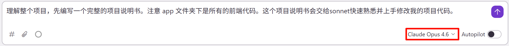
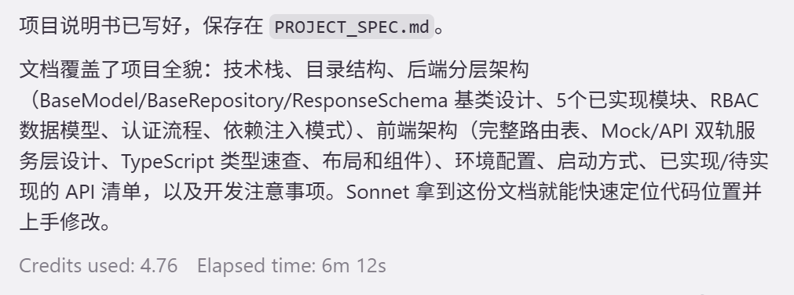
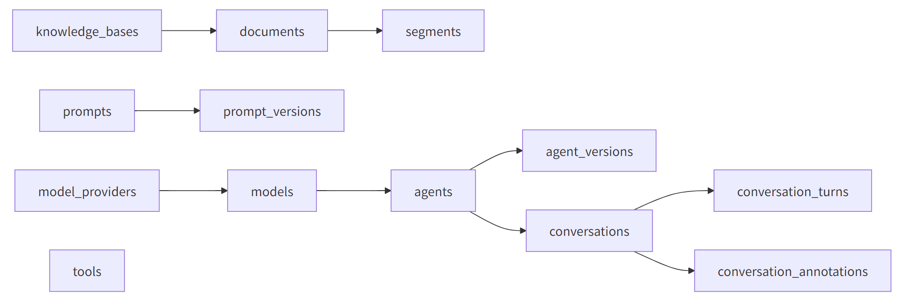
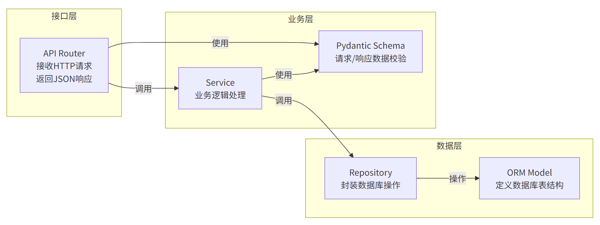

# 3. VibeCoding

# VibeCoding

> 2025年初，AI研究员Andrej Karpathy提出了一个新概念——**Vibe Coding（氛围编程）**。这个词迅速在开发者社区走红，成为2025-2026年最热门的AI开发范式。
> 
> > 自然语言编程
> 
> Vibe Coding就是用描述性语言来编程，而不是一行行写代码。你告诉AI你想要什么功能，然后AI帮你实现出来。

## 如何让Vibe Coding更高效

> 推荐下载 kiro

### 项目说明书

> 1. 可以让大模型总结整个项目的说明书
> 2. 未来其他大模型进行项目编码的时候，参考这个项目说明书
> 3. 每次编码完成后更新说明书
> 4. 即使回话删除或者结束，下次依然可以使用这个说明书，继续进行代码修改
> 
> > 这样可以节省 token，并方便模型恢复记忆。这就是**上下文总结**的功能
> > 
> > 没让模型写一个功能，给项目说明书中**追加功能总结**。

> 提示词：**理解整个项目，先编写一个完整的项目说明书。注意 app 文件夹下是所有的前端代码。这个项目说明书会交给sonnet快速熟悉并上手修改我的项目代码。**





```markdown
# 辰光Agent平台 — 项目说明书

> 本文档旨在帮助开发者快速理解项目全貌，以便高效地阅读和修改代码。

---

## 一、项目概述

辰光Agent平台（Chenguang Agent Platform）是一个企业级 AI Agent 管理平台，提供 Agent 全生命周期管理、知识库(RAG)管理、Prompt 工程、模型管理、工具编排、对话日志分析、数据统计等能力。

项目采用前后端分离架构：
- **后端**：Python FastAPI（异步），位于根目录 `src/`
- **前端**：React 19 + TypeScript + Vite，位于 `app/` 目录
- **基础设施**：Docker Compose 编排 MySQL 8.4 + Redis + MinIO

---

## 二、技术栈

### 后端
| 技术 | 用途 |
|------|------|
| FastAPI 0.135 | Web 框架（异步） |
| SQLAlchemy (async) + asyncmy | ORM + MySQL 异步驱动 |
| Alembic | 数据库迁移 |
| Pydantic v2 + pydantic-settings | 数据校验 / 配置管理 |
| Redis (redis.asyncio) | 缓存（验证码等） |
| PyJWT | JWT 令牌签发/验证 |
| bcrypt | 密码哈希 |
| captcha | 图形验证码生成 |
| Loguru | 日志 |
| Python 3.13 | 运行时 |

### 前端
| 技术 | 用途 |
|------|------|
| React 19 | UI 框架 |
| TypeScript 5.9 | 类型系统 |
| Vite | 构建工具 |
| React Router 7 | 路由 |
| Tailwind CSS 4 | 样式 |
| Shadcn UI (Radix) | 组件库 |
| Lucide React | 图标 |

### 基础设施
| 服务 | 说明 |
|------|------|
| MySQL 8.4 | 主数据库，库名 `chenguang` |
| Redis | 缓存（验证码存储等） |
| MinIO | 对象存储（文档上传等，端口 9000/9001） |

---

## 三、目录结构

```
/                           # 项目根目录
├── src/                    # ===== 后端 Python 代码 =====
│   ├── main.py             # FastAPI 应用入口，注册路由/中间件/异常处理
│   ├── core/               # 核心基础设施
│   │   ├── config.py       # 环境变量配置（pydantic-settings）
│   │   ├── base_model.py   # ORM 基类（id + created_at + updated_at）
│   │   ├── base_repository.py  # 通用 CRUD Repository（泛型）
│   │   ├── base_schema.py  # 统一响应格式 ResponseSchema<T>
│   │   ├── deps.py         # FastAPI 依赖注入（get_current_user）
│   │   ├── exceptions.py   # 业务异常 BizException + 全局异常处理器
│   │   └── logger.py       # Loguru 日志配置（控制台 + 文件轮转）
│   ├── infra/              # 基础设施连接
│   │   ├── database.py     # SQLAlchemy 异步引擎 + 会话工厂 + get_db
│   │   └── redis_cache.py  # Redis 异步连接池 + get_redis_client
│   ├── middlewares/
│   │   └── logging.py      # 请求日志中间件（记录耗时）
│   ├── modules/            # 业务模块（每个模块独立 api/service/repository/schema/model）
│   │   ├── auth/           # 认证（登录）
│   │   ├── captcha/        # 图形验证码
│   │   ├── user/           # 用户管理
│   │   ├── role/           # 角色管理
│   │   └── permission/     # 权限管理
│   └── utils/
│       ├── jwt_utils.py    # JWT 编码/解码
│       └── password_utils.py  # bcrypt 密码哈希/校验
│
├── alembic/                # 数据库迁移脚本
├── alembic.ini             # Alembic 配置
├── docker/
│   └── docker-compose.yaml # MySQL + Redis + MinIO 容器编排
├── requirements.txt        # Python 依赖
├── .env / .env.example     # 环境变量
│
├── app/                    # ===== 前端 React 代码 =====
│   ├── src/
│   │   ├── main.tsx        # 应用入口
│   │   ├── App.tsx         # 路由定义（所有页面路由）
│   │   ├── index.css       # 全局样式（Tailwind + Shadcn 主题变量）
│   │   ├── layouts/
│   │   │   └── DashboardLayout.tsx  # 主布局（侧边栏 + 面包屑 + 内容区）
│   │   ├── components/
│   │   │   └── ui/         # Shadcn UI 组件（button, card, table, dialog 等）
│   │   ├── pages/          # 页面组件（按模块分文件夹）
│   │   │   ├── Dashboard.tsx
│   │   │   ├── Login.tsx
│   │   │   ├── Profile.tsx
│   │   │   ├── Settings.tsx
│   │   │   ├── agent/      # Agent 管理（List/Create/Detail/Test/Versions/Monitor）
│   │   │   ├── model/      # 模型管理（List/Providers）
│   │   │   ├── prompt/     # Prompt 管理（List/Create/Versions）
│   │   │   ├── knowledge/  # 知识库（List/Create/Detail/Documents/Segments/Test）
│   │   │   ├── tool/       # 工具管理（List/Create/Detail）
│   │   │   ├── conversation/  # 对话日志（List/Detail）
│   │   │   ├── analytics/  # 数据统计（Usage/Costs/Evaluation）
│   │   │   └── system/     # 系统管理（Users/Roles/ApiKeys/Audit/Alerts/Settings）
│   │   ├── services/       # 数据服务层（核心设计）
│   │   │   ├── config.ts   # USE_MOCK / API_BASE 环境变量
│   │   │   ├── [module].ts # 各模块服务入口（自动切换 mock/api）
│   │   │   ├── types/      # TypeScript 类型定义（每模块一个文件）
│   │   │   ├── mock/       # Mock 数据实现（开发阶段）
│   │   │   │   ├── data/   # 静态 Mock 数据
│   │   │   │   └── [module].ts
│   │   │   └── api/        # 真实 API 实现（对接后端）
│   │   │       ├── client.ts  # HTTP 客户端封装（fetch）
│   │   │       └── [module].ts
│   │   ├── hooks/
│   │   │   └── use-mobile.ts
│   │   └── lib/
│   │       └── utils.ts    # cn() 工具函数
│   ├── package.json
│   ├── .env                # VITE_USE_MOCK=true
│   └── docs/               # 前端功能设计文档
│       ├── 00-架构总览.md
│       ├── 01~09 各模块设计文档
│       └── 10-API接口规范.md
```

---

## 四、后端架构详解

### 4.1 分层架构

每个业务模块遵循统一的分层结构：

```
modules/{module}/
├── api.py          # 路由层：接收请求，调用 Service，封装响应
├── service.py      # 业务层：业务逻辑，调用 Repository
├── repository.py   # 数据层：继承 BaseRepository，数据库操作
├── model.py        # ORM 模型：继承 BaseModel
└── schema.py       # Pydantic 模型：请求/响应数据结构
```

调用链路：`API (Router) → Service → Repository → Database`

### 4.2 基类设计

**BaseModel**（ORM 基类）：
```python
class BaseModel(Base, TimestampMixin):
    __abstract__ = True
    id: Mapped[int] = mapped_column(BigInteger, primary_key=True, autoincrement=True)
    created_at: Mapped[datetime]  # server_default=func.now()
    updated_at: Mapped[datetime]  # onupdate=func.now()
```

**BaseRepository**（通用 CRUD）：
```python
class BaseRepository(Generic[T]):
    # 提供: get_by_id, get_all, create, update, delete, delete_by_id
```

**ResponseSchema**（统一响应）：
```python
class ResponseSchema(BaseModel, Generic[T]):
    code: int = 200
    message: str = "success"
    data: Optional[T] = None
```

### 4.3 已实现的后端模块

| 模块 | 路由前缀 | 功能 |
|------|---------|------|
| auth | `/api/v1/auth` | 登录（用户名+密码+验证码 → JWT） |
| captcha | `/api/v1/captcha` | 图形验证码生成与校验（Redis 存储） |
| user | `/api/v1/users` | 用户 CRUD、角色分配、获取当前用户 |
| role | `/api/v1/roles` | 角色 CRUD、权限分配 |
| permission | `/api/v1/permissions` | 权限 CRUD |

### 4.4 数据库模型关系

```
User ──M:N──> Role ──M:N──> Permission
     (user_roles)    (role_permissions)
```

- `users` 表：username, email, hashed_password, is_active, is_superuser, last_login
- `roles` 表：code, name, description
- `permissions` 表：code, name, description
- `user_roles` 关联表：user_id, role_id（复合主键）
- `role_permissions` 关联表：role_id, permission_id（复合主键）

### 4.5 认证流程

1. 前端调用 `GET /api/v1/captcha` 获取验证码图片（base64）和 key
2. 前端调用 `POST /api/v1/auth/login` 提交 `{username, password, captcha_key, captcha_code}`
3. 后端校验验证码（Redis）→ 查询用户 → 校验密码（bcrypt）→ 签发 JWT（30分钟有效）
4. 前端后续请求携带 `Authorization: Bearer <token>`
5. 受保护接口通过 `Depends(get_current_user)` 解析 token 获取当前用户

### 4.6 依赖注入模式

```python
# 每个模块的 api.py 中定义 Service 工厂函数
def get_user_service(db: AsyncSession = Depends(get_db)) -> UserService:
    return UserService(db)

# 路由中注入
@router.post("")
async def create_user(data: UserCreate, svc: UserService = Depends(get_user_service)):
    ...
```

---

## 五、前端架构详解

### 5.1 路由结构

路由定义在 `app/src/App.tsx`，采用嵌套路由：

```
/login                          → Login（独立页面，无侧边栏）
/                               → DashboardLayout 包裹
  ├── /                         → Dashboard（工作台）
  ├── /profile                  → Profile（个人信息）
  ├── /settings                 → Settings（个人设置）
  ├── /agents                   → AgentList
  ├── /agents/create            → AgentCreate
  ├── /agents/:id               → AgentDetail
  ├── /agents/:id/edit          → AgentCreate（复用）
  ├── /agents/:id/test          → AgentTest
  ├── /agents/:id/versions      → AgentVersions
  ├── /agents/:id/monitor       → AgentMonitor
  ├── /models                   → ModelList
  ├── /models/providers         → ModelProviders
  ├── /prompts                  → PromptList
  ├── /prompts/create           → PromptCreate
  ├── /prompts/:id              → PromptCreate（复用，编辑模式）
  ├── /prompts/:id/versions     → PromptVersions
  ├── /knowledge                → KnowledgeList
  ├── /knowledge/create         → KnowledgeCreate
  ├── /knowledge/:id            → KnowledgeDetail
  ├── /knowledge/:id/documents  → KnowledgeDocuments
  ├── /knowledge/:id/segments   → KnowledgeSegments
  ├── /knowledge/:id/test       → KnowledgeTest
  ├── /tools                    → ToolList
  ├── /tools/create             → ToolCreate
  ├── /tools/:id                → ToolDetail
  ├── /conversations            → ConversationList
  ├── /conversations/:id        → ConversationDetail
  ├── /analytics/usage          → AnalyticsUsage
  ├── /analytics/costs          → AnalyticsCosts
  ├── /analytics/evaluation     → AnalyticsEvaluation
  ├── /system/users             → SystemUsers
  ├── /system/roles             → SystemRoles
  ├── /system/api-keys          → SystemApiKeys
  ├── /system/audit             → SystemAudit
  ├── /system/alerts            → SystemAlerts
  └── /system/settings          → SystemSettings
```

### 5.2 数据服务层（Mock/API 双轨设计）

这是前端最核心的架构设计。所有页面通过 `services/` 获取数据，不直接引用 Mock。

**切换机制**（`services/config.ts`）：
```typescript
export const USE_MOCK = import.meta.env.VITE_USE_MOCK !== 'false'
export const API_BASE = import.meta.env.VITE_API_BASE || 'http://localhost:8080/api'
```

**服务入口**（以 agent 为例，`services/agent.ts`）：
```typescript
import { USE_MOCK } from './config';
import { mockAgentService } from './mock/agent';
import { apiAgentService } from './api/agent';
export const agentService = USE_MOCK ? mockAgentService : apiAgentService;
```

**目录对应关系**：
```
services/
├── config.ts              # 环境配置
├── types/                 # TypeScript 接口定义（前后端数据契约）
│   ├── common.ts          # ApiResponse, PaginatedResponse, PaginationParams
│   ├── agent.ts           # Agent, AgentConfig, AgentVersion, AgentStats
│   ├── model.ts           # Model, ModelProvider, ModelCapability
│   ├── prompt.ts          # Prompt, PromptVariable, PromptVersion
│   ├── knowledge.ts       # KnowledgeBase, Document, Segment, RetrievalResult
│   ├── tool.ts            # Tool, ToolDetail, FunctionDefinition
│   ├── conversation.ts    # Conversation, ConversationTurn, TurnTrace
│   ├── analytics.ts       # AnalyticsOverview, DailyStats, CostAnalysis, Evaluation
│   ├── dashboard.ts       # DashboardStats, TrendData, AgentRanking, Alert
│   └── system.ts          # User, Role, Permission, ApiKey, AuditLog, AlertRule
├── mock/                  # Mock 实现（带模拟延迟）
│   ├── data/              # 静态 Mock 数据
│   └── [module].ts        # 各模块 Mock Service
├── api/                   # 真实 API 实现
│   ├── client.ts          # HTTP 客户端（fetch 封装，支持 GET/POST/PUT/DELETE）
│   └── [module].ts        # 各模块 API Service
└── [module].ts            # 各模块服务入口（自动选择 mock 或 api）
```

**切换方式**：
```bash
# 使用 Mock 数据（默认，当前状态）
VITE_USE_MOCK=true npm run dev

# 连接真实后端
VITE_USE_MOCK=false VITE_API_BASE=http://localhost:8000/api npm run dev
```

### 5.3 API 客户端

`services/api/client.ts` 封装了基于 fetch 的 HTTP 客户端：
- 支持 GET（带 query params）、POST、PUT、DELETE
- 自动解析 `data` 字段（`response.data || response`）
- 基于 `API_BASE` 环境变量构建请求 URL
- **注意**：当前未实现 token 自动注入（需要补充 Authorization header）

### 5.4 布局

`DashboardLayout.tsx` 提供：
- 左侧固定侧边栏：工作台、Agent管理、模型管理、Prompt管理、知识库、工具管理、对话日志、数据统计、系统管理（可展开子菜单）
- 顶部面包屑导航
- 右上角用户头像下拉菜单（个人信息、设置、退出）
- 内容区通过 `<Outlet />` 渲染子路由

### 5.5 UI 组件

使用 Shadcn UI（基于 Radix UI），已安装的组件：
- alert-dialog, avatar, badge, button, card, dropdown-menu, input, label
- scroll-area, select, separator, sheet, sidebar, skeleton, switch
- table, tabs, textarea, tooltip

---

## 六、前端 TypeScript 类型定义速查

### 通用类型（`types/common.ts`）
```typescript
interface ApiResponse<T> { code: 0; message: 'success'; data: T }
interface PaginatedResponse<T> { data: T[]; total: number; page: number; pageSize: number }
interface PaginationParams { page?: number; pageSize?: number }
```

### Agent（`types/agent.ts`）
- `Agent`：id, name, description, type(conversation|tool|analysis|creative|workflow), status(active|inactive|error|draft), modelId, config(AgentConfig), successRate, callCount7d, version...
- `AgentConfig`：model设置 + prompt设置 + RAG设置 + tools设置 + advanced设置
- `AgentVersion`：版本管理

### Model（`types/model.ts`）
- `Model`：id, name, modelId, providerId, capabilities, contextLength, status, inputPrice, outputPrice...
- `ModelProvider`：type(openai|anthropic|aliyun|azure|local|custom), status, endpoint...

### Prompt（`types/prompt.ts`）
- `Prompt`：id, name, content, variables(PromptVariable[]), version, status(draft|published)...

### Knowledge（`types/knowledge.ts`）
- `KnowledgeBase`：id, name, status(ready|indexing|error|empty), documentCount, segmentCount, embeddingModel...
- `Document`：fileType(pdf|docx|md|txt|html|csv), status(pending|processing|completed|failed)...
- `Segment`：content, wordCount, tokenCount, keywords, hitCount...

### Tool（`types/tool.ts`）
- `Tool`：type(builtin|http_api|custom_function), status(enabled|disabled|error)...
- `ToolDetail`：config(HttpApiConfig|CustomFunctionConfig), functionDefinition...

### Conversation（`types/conversation.ts`）
- `Conversation`：agentId, turnCount, totalTokens, totalCost, satisfaction...
- `ConversationTurn`：role(user|assistant), content, trace(TurnTrace)...
- `TurnTrace`：steps(TraceStep[])，支持链路追踪

### System（`types/system.ts`）
- `User`, `Role`, `Permission`, `ApiKey`, `AuditLog`, `AlertRule`, `ActiveAlert`, `SystemSettings`

---

## 七、环境配置

### 后端环境变量（`.env`）
```env
APP_NAME=辰光Agent
APP_ENV=dev
APP_DEBUG=true
DB_HOST=127.0.0.1
DB_PORT=3306
DB_USER=root
DB_PASSWORD=123456
DB_NAME=chenguang
REDIS_HOST=localhost
REDIS_PORT=6379
REDIS_PASSWORD=123456
REDIS_DB=0
LOG_LEVEL=DEBUG
LOG_DIR=logs
```

### 前端环境变量（`app/.env`）
```env
VITE_USE_MOCK=true
# VITE_API_BASE=http://localhost:8000/api  （连接后端时设置）
```

---

## 八、启动方式

### 基础设施
```bash
docker compose -f docker/docker-compose.yaml up -d
```

### 后端
```bash
pip install -r requirements.txt
# 数据库迁移
alembic upgrade head
# 启动（uvicorn）
uvicorn src.main:app --reload --host 0.0.0.0 --port 8000
```

### 前端
```bash
cd app
npm install
npm run dev
```

---

## 九、API 接口规范

### 后端已实现的接口

| 方法 | 路径 | 说明 |
|------|------|------|
| GET | `/api/v1/captcha` | 获取图形验证码 |
| POST | `/api/v1/captcha` | 校验验证码 |
| POST | `/api/v1/auth/login` | 用户登录 |
| POST | `/api/v1/users` | 创建用户 |
| GET | `/api/v1/users/me` | 获取当前登录用户 |
| GET | `/api/v1/users/{id}` | 获取用户详情（含角色） |
| GET | `/api/v1/users` | 用户列表 |
| PUT | `/api/v1/users/{id}/roles` | 给用户分配角色 |
| GET | `/api/v1/users/{id}/roles` | 查看用户角色列表 |
| POST | `/api/v1/roles/roles` | 创建角色 |
| GET | `/api/v1/roles/roles` | 角色列表 |
| GET | `/api/v1/roles/roles/{id}` | 角色详情（含权限） |
| PUT | `/api/v1/roles/roles/{id}` | 更新角色 |
| DELETE | `/api/v1/roles/roles/{id}` | 删除角色 |
| PUT | `/api/v1/roles/{id}/permissions` | 给角色分配权限 |
| GET | `/api/v1/permissions/` | 权限列表 |
| GET | `/api/v1/permissions/{id}` | 权限详情 |
| POST | `/api/v1/permissions` | 创建权限 |
| PUT | `/api/v1/permissions/{id}` | 更新权限 |
| DELETE | `/api/v1/permissions/{id}` | 删除权限 |
| GET | `/health` | 健康检查 |

### 前端期望的接口（Mock 层已定义，后端待实现）

详见 `app/docs/10-API接口规范.md`，涵盖 Agent、模型、Prompt、知识库、工具、对话、统计等全部模块的 RESTful API。

---

## 十、开发注意事项

### 后端
1. 所有 ORM 模型继承 `BaseModel`，自带 `id`, `created_at`, `updated_at`
2. 所有 Repository 继承 `BaseRepository[T]`，自带基础 CRUD
3. 统一响应格式 `ResponseSchema(code=200, message="success", data=...)`
4. 业务异常使用 `raise BizException(code=xxx, message="xxx")`，会被全局异常处理器捕获并返回 JSON
5. 数据库会话通过 `Depends(get_db)` 注入，自动提交/回滚
6. JWT 密钥硬编码在 `jwt_utils.py` 中（生产环境需移至环境变量）
7. 新增模块时遵循 `api → service → repository → model/schema` 分层
8. 路由注册在 `src/main.py` 的 `create_app()` 中

### 前端
1. 新增页面：在 `pages/` 下创建组件 → 在 `App.tsx` 添加路由 → 在 `DashboardLayout.tsx` 添加菜单项
2. 新增数据服务：在 `types/` 定义类型 → 在 `mock/` 和 `api/` 分别实现 → 在 `services/` 根目录创建切换入口
3. 当前前端登录是 Mock 实现（`Login.tsx` 中直接写死 token），需要对接后端 auth API
4. API 客户端（`api/client.ts`）当前未注入 Authorization header，对接后端时需补充
5. 所有 UI 组件在 `components/ui/` 下，基于 Shadcn UI，可通过 `npx shadcn@latest add [component]` 添加新组件
6. 前端文档在 `app/docs/` 目录下，每个模块有详细的功能设计说明

### 数据库迁移
```bash
# 生成迁移脚本
alembic revision --autogenerate -m "描述本次变更"
# 执行迁移
alembic upgrade head
# 回滚
alembic downgrade -1
```

---

## 十一、当前开发状态

| 部分 | 状态 | 说明 |
|------|------|------|
| 后端 RBAC | ✅ 已完成 | User/Role/Permission 完整 CRUD + 关联 |
| 后端认证 | ✅ 已完成 | 登录 + JWT + 验证码 |
| 后端 Agent/Model/Prompt 等业务模块 | ❌ 待实现 | 前端 Mock 层已定义接口契约 |
| 前端全部页面 | ✅ 已完成 | 使用 Mock 数据，UI 完整 |
| 前端 Mock 数据层 | ✅ 已完成 | 所有模块 Mock Service + 静态数据 |
| 前端 API 数据层 | ⚠️ 骨架已有 | client.ts + 各模块 api service 已定义，待后端实现后对接 |
| 前后端对接 | ❌ 待完成 | Login 页面、token 注入、API 调用均需对接 |

```

### Swagger 文档

如果需要大模型基于写好的后端，修改前端代码。

1. 下载后端项目的 `swagger-openapi.json` 文件
2. 明确告诉大模型 按照 `swagger-openapi.json` 编写前端功能

注意点：后端的API接口一定要描述详细，有精确返回/传参数据类型。

第一次给他限定技术栈：

> 按照 `swagger-openapi.json`  生成前端项目，要求使用 React + Vite + ShadcnUI

## 让AI开始干活

> 1. 根据前端编写指定的后端
> 2. 根据后端编写指定的前端
> 
> 如何控制：
> 
> 1. 让AI生成还有哪些模块哪些功能未完成的大纲
> 2. 按照大纲逐步完成每个模块

# 未完成的功能

## 功能列表

| 模块 | 核心知识点 |
| --- | --- |
| 1. 模型供应商 | 完整的分层架构流程（Model→Schema→Repo→Service→API）、BaseModel/BaseRepository 继承、依赖注入、统一响应格式 |
| 2. 模型管理 | ForeignKey 外键关联、relationship 自动加载、逗号分隔字符串与列表的转换、_to_read 手动映射模式 |
| 3. Prompt管理 | 版本快照设计模式（主表+版本表）、JSON 字段存储灵活数据、发布/回滚流程、版本号递增 |
| 4. 知识库管理 | 三层父子关系、cascade 级联删除、冗余计数字段维护、文件上传（UploadFile）、异步处理概念 |
| 5. 工具管理 | JSON 存储灵活配置、OpenAI Function Calling 格式、启用/禁用状态机、工具测试 |
| 6. Agent管理 | 聚合根设计、JSON 存储复杂配置、生命周期状态机（draft→active→inactive→error）、版本管理复用 |
| 7. 对话日志与统计 | 只读查询模块设计、一对一关系（标注）、链路追踪 JSON 存储、SQL 聚合统计（GROUP BY、SUM、AVG） |

## 完整模块结构

```markdown
src/modules/
├── auth/           ✅ 登录认证
├── captcha/        ✅ 验证码
├── user/           ✅ 用户管理
├── role/           ✅ 角色管理
├── permission/     ✅ 权限管理
├── provider/       📝 模型供应商
├── model/          📝 模型管理
├── prompt/         📝 Prompt管理
├── knowledge/      📝 知识库管理
├── tool/           📝 工具管理
├── agent/          📝 Agent管理
├── conversation/   📝 对话日志
└── analytics/      📝 数据统计
```

## main.py 未来注册的全部路由

```python
# src/main.py 中的 create_app() 函数

# 已有路由
app.include_router(user_router, prefix="/api/v1")
app.include_router(captcha_router, prefix="/api/v1")
app.include_router(auth_router, prefix="/api/v1")
app.include_router(permission_router, prefix="/api/v1")
app.include_router(role_router, prefix="/api/v1")

# 新增路由
app.include_router(provider_router, prefix="/api/v1")      
app.include_router(model_router, prefix="/api/v1")         
app.include_router(prompt_router, prefix="/api/v1")        
app.include_router(knowledge_router, prefix="/api/v1")      
app.include_router(tool_router, prefix="/api/v1")           
app.include_router(agent_router, prefix="/api/v1")         
app.include_router(conversation_router, prefix="/api/v1")  
app.include_router(analytics_router, prefix="/api/v1")     
```

## 数据库迁移执行顺序

> 注意有依赖关系的，统一创建 ORM 对象后，进行迁移。 



## 开发范式

### 每个模块的标准文件清单

```bash
src/modules/{module}/
├── __init__.py         # 空文件
├── model.py            # ORM 模型（数据库表映射）
├── schema.py           # Pydantic 模型（请求/响应校验）
├── repository.py       # 数据库操作（继承 BaseRepository）
├── service.py          # 业务逻辑
└── api.py              # HTTP 路由（FastAPI Router）
```

### 接口范式

> 执行流程



#### 创建操作

1. 前端 POST 
2. API 接收 CreateSchema 
3. Service 校验 
4. 构造 ORM 对象 
5. Repo.create() 
6. 返回 ReadSchema

#### 更新操作

1. 前端 PUT
2. API 接收 UpdateSchema
3. Service 查找对象
4. 逐字段更新非 None 值
5. Repo.update()
6. 返回 ReadSchema

#### 删除操作

1. 前端 DELETE
2. API 接收 ID
3. Service 确认存在
4. Repo.delete_by_id() 
5. 返回成功消息

#### 列表操作

**⚠️ 前置条件：所有列表接口统一使用 **`PageParams`** + **`PageResult`** 分页机制。**

**参考《**[⚙ 2. RBAC权限开发](https://shenma-docs.feishu.cn/wiki/ZKa1whkuDiYpMbkzfpRcdjaHn1f#share-J624dq5dtoHtwyxI9aoch6WBnDd)** - 分页抽取》**

需要先完成以下基础设施：

- `src/core/base_schema.py` 新增 `PageResult[T]`
- `src/core/deps.py` 新增 `PageParams` 类
- `src/core/base_repository.py` 新增 `get_page()` 方法

> **执行流程**
> 
> 1. 前端 GET ?page=1&page_size=20&keyword=xxx
> 2. API 接收 PageParams = Depends()
> 3. Service 调用 Repo.search_page(offset, limit, keyword)
> 4. Repo.get_page() 返回 (items, total)
> 5. Service 组装 PageResult[T](items, total, page, page_size)
> 6. API 返回 ResponseSchema[PageResult[XxxRead]]

#### 注意事项

各模块 Repository 需定义 `SEARCH_FIELDS` 并实现 `search_page()` 便捷方法；

每个 Repository 的搜索字段都不一样

```python
class XxxRepository(BaseRepository[Xxx]):
    SEARCH_FIELDS = ["name", "description"]  # 按模块定义搜索字段

    async def search_page(self, offset, limit, keyword):
        return await self.get_page(offset=offset, limit=limit,
                                   keyword=keyword, search_fields=self.SEARCH_FIELDS)
```