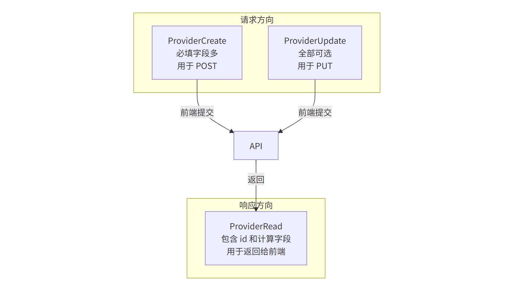
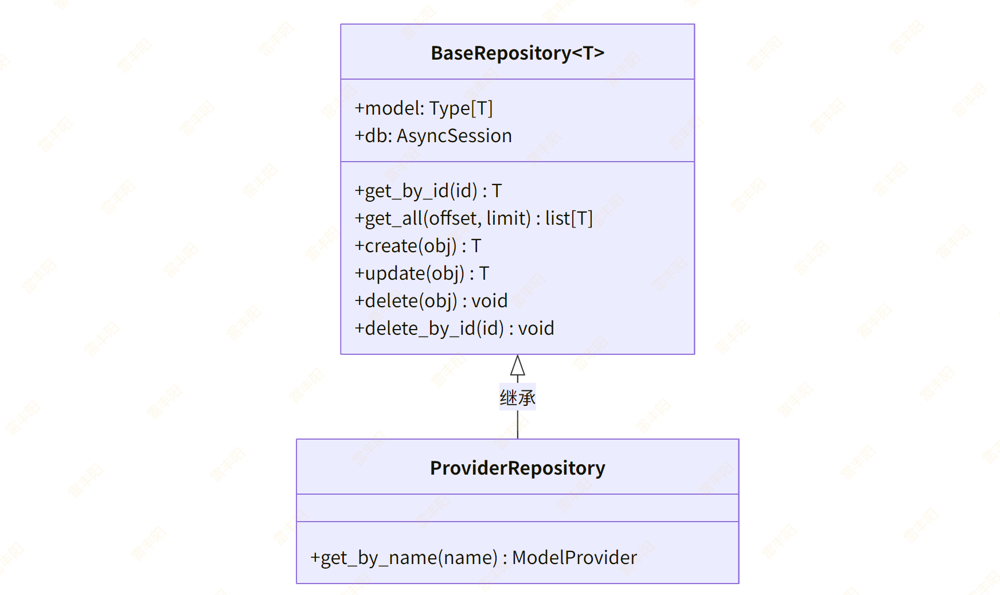
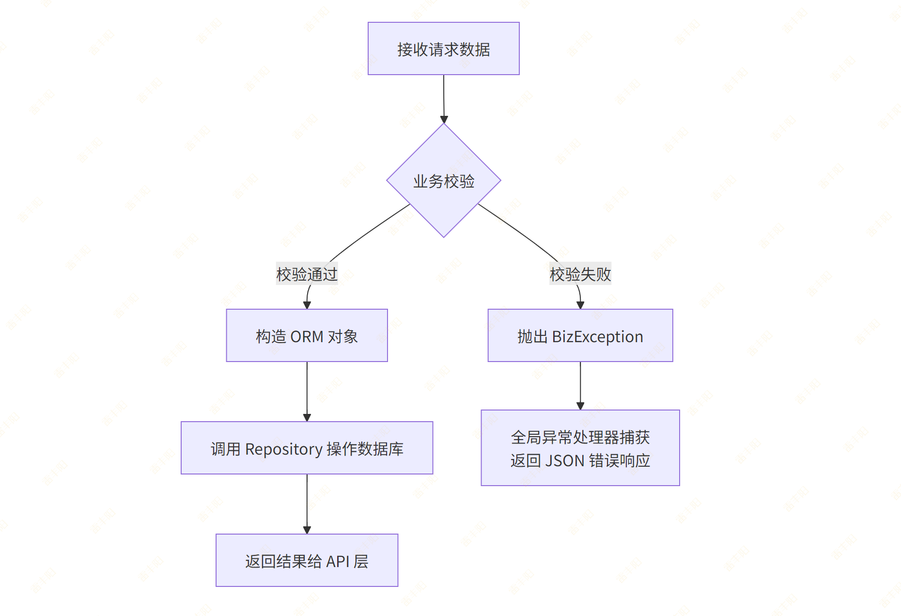
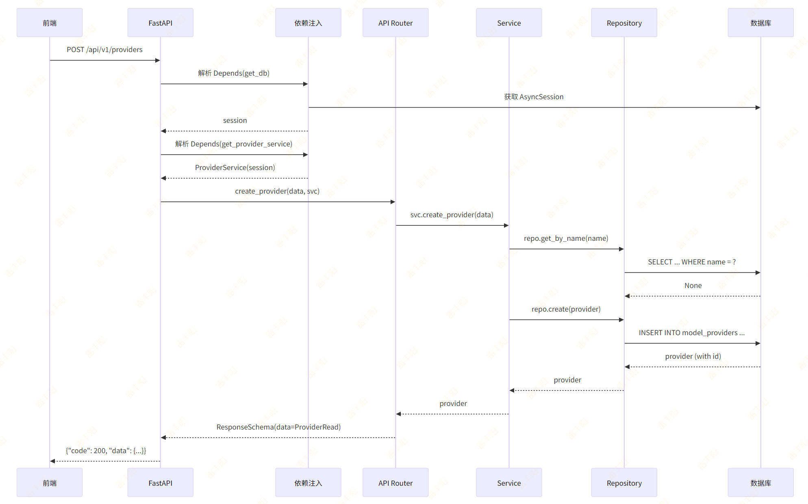

# 4. 模型供应商管理（Model Provider）

# 需求分析

模型供应商的数据结构：

```go
interface ModelProvider {
  id: string
  name: string           // 供应商名称，如 "OpenAI"
  type: 'openai' | 'anthropic' | 'aliyun' | 'azure' | 'local' | 'custom'
  status: 'connected' | 'disconnected' | 'error'
  endpoint: string       // API 端点地址
  modelCount: number     // 关联模型数量（计算字段）
  createdAt: string
  updatedAt: string
}
```

后端需要实现：

| 方法 | 路径 | 说明 |
| --- | --- | --- |
| POST | /api/v1/providers | 创建供应商 |
| GET | /api/v1/providers | 供应商列表 |
| GET | /api/v1/providers/{id} | 供应商详情 |
| PUT | /api/v1/providers/{id} | 更新供应商 |
| DELETE | /api/v1/providers/{id} | 删除供应商 |
| POST | /api/v1/providers/{id}/test | 测试连接 |

# 开发流程

## Step 1 — 创建 ORM Model

> **核心概念**：ORM Model 是 Python 类与数据库表的映射。继承 `BaseModel` 自动获得 `id`、`created_at`、`updated_at` 三个字段。

创建文件 `src/modules/provider/model.py`：

```python
from sqlalchemy import String, Text
from sqlalchemy.orm import Mapped, mapped_column
from src.core.base_model import BaseModel


class ModelProvider(BaseModel):
    """模型供应商表"""
    __tablename__ = "model_providers"

    name: Mapped[str] = mapped_column(String(100), comment="供应商名称")
    type: Mapped[str] = mapped_column(
        String(50), comment="供应商类型: openai/anthropic/aliyun/azure/local/custom"
    )
    status: Mapped[str] = mapped_column(
        String(50), default="disconnected",
        comment="连接状态: connected/disconnected/error"
    )
    endpoint: Mapped[str] = mapped_column(String(500), comment="API端点地址")
    api_key: Mapped[str | None] = mapped_column(
        Text, nullable=True, comment="API密钥（加密存储）"
    )
    description: Mapped[str | None] = mapped_column(
        String(500), nullable=True, comment="供应商描述"
    )
```

**说明**：

- `api_key` 使用 `Text` 类型，因为某些密钥较长；标记为 `nullable=True`，创建时可以不填
- `status` 给了默认值 `disconnected`，新建供应商默认未连接
- 前端的 `modelCount` 是计算字段，不存数据库，后续在 Service 层查询时动态计算

## Step 2 — 生成数据库迁移

> **注意**：Alembic 的 `env.py` 需要能 import 到你的 Model。确保 `alembic/env.py` 中有类似 `from src.core.base_model import Base` 的导入，并且 `target_metadata = Base.metadata`。新增的 Model 文件需要在某处被 import，Alembic 才能检测到。

```bash
# 在项目根目录执行
alembic revision --autogenerate -m "创建model_providers表"
alembic upgrade head
```

## Step 3 — 定义 Pydantic Schema

> **核心概念**：Schema 定义了 API 的输入输出数据结构。`Create` 用于创建请求，`Update` 用于更新请求（字段可选），`Read` 用于响应输出。

创建文件 `src/modules/provider/schema.py`：

```python
from pydantic import BaseModel


class ProviderCreate(BaseModel):
    """创建供应商请求"""
    name: str
    type: str          # openai / anthropic / aliyun / azure / local / custom
    endpoint: str
    api_key: str | None = None
    description: str | None = None


class ProviderUpdate(BaseModel):
    """更新供应商请求 — 所有字段可选"""
    name: str | None = None
    type: str | None = None
    endpoint: str | None = None
    api_key: str | None = None
    description: str | None = None


class ProviderRead(BaseModel):
    """供应商响应"""
    id: int
    name: str
    type: str
    status: str
    endpoint: str
    description: str | None
    model_count: int = 0       # 关联模型数量，Service 层计算后填入

    model_config = {"from_attributes": True}
```

> `model_config = {"from_attributes": True}` 让 Pydantic 可以直接从 SQLAlchemy ORM 对象读取属性，相当于 Java 中的 `BeanUtils.copyProperties()`。

**Schema 三件套的设计模式**：



## Step 4 — 编写 Repository

> Repository 封装所有数据库操作。继承 `BaseRepository[T]` 自动获得 `get_by_id`、`get_all`、`create`、`update`、`delete`、`delete_by_id` 六个基础方法。只需要编写本模块特有的查询。

创建文件 `src/modules/provider/repository.py`：

```python
from sqlalchemy import select, func
from sqlalchemy.ext.asyncio import AsyncSession
from src.core.base_repository import BaseRepository
from src.modules.provider.model import ModelProvider


class ProviderRepository(BaseRepository[ModelProvider]):
    """搜索字段：按名称或类型搜索"""
    SEARCH_FIELDS = ["name", "type"]

    def __init__(self, db: AsyncSession):
        super().__init__(ModelProvider, db)

    async def get_by_name(self, name: str) -> ModelProvider | None:
        """按名称查找供应商（用于创建时去重）"""
        stmt = select(ModelProvider).where(ModelProvider.name == name)
        result = await self.db.execute(stmt)
        return result.scalar_one_or_none()

    async def search_page(
        self, offset: int, limit: int, keyword: str | None
    ) -> tuple[list[ModelProvider], int]:
        """分页 + 搜索（调用 BaseRepository.get_page）"""
        return await self.get_page(
            offset=offset,
            limit=limit,
            keyword=keyword,
            search_fields=self.SEARCH_FIELDS,
        )
```

**继承关系**：



## Step 5 — 编写 Service

> Service 是业务逻辑的核心。它负责参数校验、业务规则、调用 Repository、组装返回数据。API 层不应包含业务逻辑，只做"接收请求 → 调用 Service → 封装响应"。

创建文件 `src/modules/provider/service.py`：

```python
from sqlalchemy.ext.asyncio import AsyncSession
from src.core.exceptions import BizException
from src.core.base_schema import PageResult
from src.core.deps import PageParams
from src.modules.provider.model import ModelProvider
from src.modules.provider.repository import ProviderRepository
from src.modules.provider.schema import ProviderCreate, ProviderUpdate, ProviderRead


class ProviderService:
    def __init__(self, db: AsyncSession):
        self.repo = ProviderRepository(db)

    async def create_provider(self, data: ProviderCreate) -> ModelProvider:
        # 1. 检查名称是否已存在
        existing = await self.repo.get_by_name(data.name)
        if existing:
            raise BizException(code=40001, message=f"供应商 '{data.name}' 已存在")

        # 2. 创建 ORM 对象
        provider = ModelProvider(
            name=data.name,
            type=data.type,
            endpoint=data.endpoint,
            api_key=data.api_key,
            description=data.description,
            status="disconnected",  # 新建默认未连接
        )

        # 3. 保存到数据库
        return await self.repo.create(provider)

    async def get_provider(self, provider_id: int) -> ModelProvider:
        provider = await self.repo.get_by_id(provider_id)
        if not provider:
            raise BizException(code=40002, message="供应商不存在")
        return provider

    async def list_providers(self, params: PageParams) -> PageResult[ProviderRead]:
        """分页查询供应商列表"""
        items, total = await self.repo.search_page(
            offset=params.offset,
            limit=params.page_size,
            keyword=params.keyword,
        )
        return PageResult(
            items=[ProviderRead.model_validate(p) for p in items],
            total=total,
            page=params.page,
            page_size=params.page_size,
        )

    async def update_provider(self, provider_id: int, data: ProviderUpdate) -> ModelProvider:
        provider = await self.get_provider(provider_id)

        # 只更新非 None 的字段
        if data.name is not None:
            provider.name = data.name
        if data.type is not None:
            provider.type = data.type
        if data.endpoint is not None:
            provider.endpoint = data.endpoint
        if data.api_key is not None:
            provider.api_key = data.api_key
        if data.description is not None:
            provider.description = data.description

        return await self.repo.update(provider)

    async def delete_provider(self, provider_id: int) -> None:
        # 先确认存在
        await self.get_provider(provider_id)
        await self.repo.delete_by_id(provider_id)

    async def test_connection(self, provider_id: int) -> dict:
        """测试供应商连接"""
        provider = await self.get_provider(provider_id)

        # TODO: 实际实现时，根据 provider.type 调用对应的 SDK 测试连接
        # 这里先返回模拟结果，后续可替换为真实逻辑
        try:
            # 示例：检查 endpoint 是否可达
            # async with httpx.AsyncClient() as client:
            #     resp = await client.get(provider.endpoint, timeout=10)
            provider.status = "connected"
            await self.repo.update(provider)
            return {"success": True, "message": "连接成功", "latency_ms": 128}
        except Exception as e:
            provider.status = "error"
            await self.repo.update(provider)
            return {"success": False, "message": f"连接失败: {str(e)}"}
```

**Service 层的请求处理流程**：



## Step 6 — 编写 API Router

> API Router 是 HTTP 请求的入口。它的职责很简单：接收请求 → 注入依赖 → 调用 Service → 用 Schema 封装响应。不要在 API 层写业务逻辑。

创建文件 `src/modules/provider/api.py`：

```python
from fastapi import APIRouter, Depends
from sqlalchemy.ext.asyncio import AsyncSession
from src.infra.database import get_db
from src.core.base_schema import ResponseSchema, PageResult
from src.core.deps import PageParams
from src.modules.provider.schema import ProviderCreate, ProviderUpdate, ProviderRead
from src.modules.provider.service import ProviderService

router = APIRouter(prefix="/providers", tags=["模型供应商"])


# 依赖注入：每次请求创建一个 ProviderService 实例
def get_provider_service(db: AsyncSession = Depends(get_db)) -> ProviderService:
    return ProviderService(db)


@router.post("", response_model=ResponseSchema[ProviderRead], summary="创建供应商")
async def create_provider(
    data: ProviderCreate,
    svc: ProviderService = Depends(get_provider_service),
):
    provider = await svc.create_provider(data)
    return ResponseSchema(data=ProviderRead.model_validate(provider))


@router.get("", response_model=ResponseSchema[PageResult[ProviderRead]], summary="供应商列表")
async def list_providers(
    params: PageParams = Depends(),
    svc: ProviderService = Depends(get_provider_service),
):
    page_result = await svc.list_providers(params)
    return ResponseSchema(data=page_result)


@router.get("/{provider_id}", response_model=ResponseSchema[ProviderRead], summary="供应商详情")
async def get_provider(
    provider_id: int,
    svc: ProviderService = Depends(get_provider_service),
):
    provider = await svc.get_provider(provider_id)
    return ResponseSchema(data=ProviderRead.model_validate(provider))


@router.put("/{provider_id}", response_model=ResponseSchema[ProviderRead], summary="更新供应商")
async def update_provider(
    provider_id: int,
    data: ProviderUpdate,
    svc: ProviderService = Depends(get_provider_service),
):
    provider = await svc.update_provider(provider_id, data)
    return ResponseSchema(data=ProviderRead.model_validate(provider))


@router.delete("/{provider_id}", response_model=ResponseSchema, summary="删除供应商")
async def delete_provider(
    provider_id: int,
    svc: ProviderService = Depends(get_provider_service),
):
    await svc.delete_provider(provider_id)
    return ResponseSchema(message="删除成功")


@router.post("/{provider_id}/test", response_model=ResponseSchema[dict], summary="测试连接")
async def test_connection(
    provider_id: int,
    svc: ProviderService = Depends(get_provider_service),
):
    result = await svc.test_connection(provider_id)
    return ResponseSchema(data=result)
```

**FastAPI 依赖注入流程**：



## Step 7 — 注册路由

在 `src/main.py` 中添加路由注册：

```bash
# 在文件顶部添加 import
from src.modules.provider.api import router as provider_router

# 在 create_app() 函数中添加
app.include_router(provider_router, prefix="/api/v1")
```

# 平台 领 api_key

[<u>阿里云百炼控制台</u>](https://bailian.console.aliyun.com)

[<u>百度智能云千帆控制台</u>](https://console.bce.baidu.com/qianfan/overview)

[<u>腾讯云混元控制台</u>](https://console.cloud.tencent.com/hunyuan/start)

[<u>火山引擎方舟控制台</u>](https://www.volcengine.com/experience/ark)

| 平台 | 免费额度 | 重点模型 | 备注 |   |
| --- | --- | --- | --- | --- |
| 智谱 AI | 新用户 2000 万 Tokens | GLM-4.7, 4.6, 4.5 | 永久额度，国产自研强项 | [智谱AI开放平台](https://www.bigmodel.cn/invite?icode=I02TVoifCuOrucbw%2BELzfuZLO2QH3C0EBTSr%2BArzMw4%3D) |
| 硅基流动 | 新用户 2000 万 Tokens | DeepSeek, Llama 等开源模型 | 永久额度，API 响应比较快 | [硅基流动](https://cloud.siliconflow.cn/i/yz0wOmLb) |
| kimi | 新用户送15元代金券 | kimi-k2.5，kimi-k2等开源模型 | 永久代金券，API 响应快 | [kimi开放平台](https://platform.moonshot.cn/) |
| 科大讯飞 | 每个模型 20 万 Tokens | 星火 Ultra, Max, Pro | 涵盖长文本 128K 版本 | [讯飞星火-懂我的AI助手](https://cloud.tencent.com/developer/tools/blog-entry?target=https%3A%2F%2Fxinghuo.xfyun.cn%2F&objectId=2626756&objectType=1&contentType=markdown) |
| 魔搭社区 | 每天 2000 次 调用 | 社区全模型 | 需绑定阿里云，单个模型上限 500 次 | [魔搭社区](https://www.modelscope.cn/) |
| DeepSeek | 按量购买 | DeepSeek | 按量购买 |   |
| Cloudflare | 每天 10,000 神经元 | 各类开源小模型 | 计费模式特殊，适合轻量工具 | [Workers AI Cloudflare](https://www.cloudflare-cn.com/developer-platform/products/workers-ai/) |