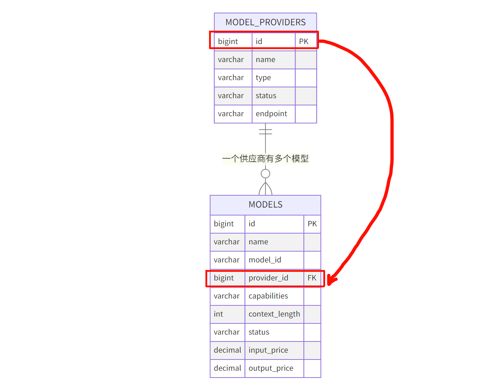
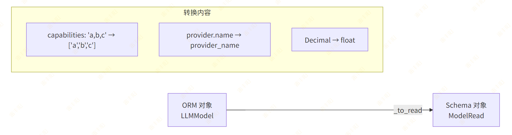
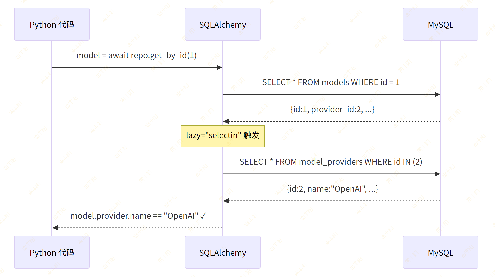

# 5. 模型管理（Model）

# 需求分析

## 数据结构

模型的数据结构：

```typescript
interface Model {
  id: string
  name: string              // 模型显示名称
  modelId: string           // 模型标识符，如 "gpt-4"
  providerId: string        // 所属供应商 ID
  providerName: string      // 供应商名称（关联查询）
  capabilities: ModelCapability[]  // 能力标签
  contextLength: number     // 上下文窗口大小
  status: 'available' | 'unavailable' | 'rate_limited'
  inputPrice: number        // 输入价格
  outputPrice: number       // 输出价格
  currency: string          // 货币单位
  isDefault: boolean        // 是否默认模型
  ...
}
type ModelCapability = 'function_call' | 'vision' | 'long_context' | 'embedding' | 'streaming'
```

后端需要实现：

| 方法 | 路径 | 说明 |
| --- | --- | --- |
| POST | /api/v1/models | 添加模型 |
| GET | /api/v1/models | 模型列表（支持按供应商筛选） |
| GET | /api/v1/models/{id} | 模型详情 |
| PUT | /api/v1/models/{id} | 更新模型 |
| DELETE | /api/v1/models/{id} | 删除模型 |

## 外键关联

模型（Model）属于某个供应商（ModelProvider），这是一个典型的多对一关系：



# 开发流程

## Step 1 — 创建 ORM Model

创建文件 `src/modules/model/model.py`：

```python
from sqlalchemy import String, BigInteger, Integer, Numeric, Boolean, ForeignKey, Text
from sqlalchemy.orm import Mapped, mapped_column, relationship
from src.core.base_model import BaseModel


class LLMModel(BaseModel):
    """大语言模型表"""
    __tablename__ = "models"

    name: Mapped[str] = mapped_column(String(100), comment="模型显示名称")
    model_id: Mapped[str] = mapped_column(
        String(100), unique=True, comment="模型标识符，如 gpt-4"
    )

    # ===== 外键关联 =====
    provider_id: Mapped[int] = mapped_column(
        BigInteger,
        ForeignKey("model_providers.id", ondelete="CASCADE"),
        comment="所属供应商ID"
    )
    # relationship 让你可以通过 model.provider 直接访问供应商对象
    # lazy="selectin" 表示查询模型时自动加载供应商信息（一条额外 SQL）
    provider: Mapped["ModelProvider"] = relationship(
        "ModelProvider", lazy="selectin"
    )

    # ===== 模型属性 =====
    capabilities: Mapped[str | None] = mapped_column(
        String(500), nullable=True,
        comment="能力标签，逗号分隔: function_call,vision,streaming"
    )
    context_length: Mapped[int] = mapped_column(
        Integer, default=4096, comment="上下文窗口大小"
    )
    status: Mapped[str] = mapped_column(
        String(50), default="available",
        comment="状态: available/unavailable/rate_limited"
    )

    # ===== 价格信息 =====
    input_price: Mapped[float] = mapped_column(
        Numeric(10, 6), default=0, comment="输入价格（每1K tokens）"
    )
    output_price: Mapped[float] = mapped_column(
        Numeric(10, 6), default=0, comment="输出价格（每1K tokens）"
    )
    currency: Mapped[str] = mapped_column(
        String(10), default="USD", comment="货币单位"
    )
    is_default: Mapped[bool] = mapped_column(
        Boolean, default=False, comment="是否为默认模型"
    )
    description: Mapped[str | None] = mapped_column(
        Text, nullable=True, comment="模型描述"
    )


# 避免循环导入，在此处导入
from src.modules.provider.model import ModelProvider
```

> **为什么类名叫 **`LLMModel`** 而不是 **`Model`**？**  因为 `Model` 与 Pydantic 的 `BaseModel` 容易混淆，且 SQLAlchemy 的 `DeclarativeBase` 也有 `Model` 概念。使用 `LLMModel` 更清晰。

`capabilities`** 字段的设计选择**：

前端是数组 `['function_call', 'vision']`，数据库存储有两种方案：

| 方案 | 存储方式 | 优点 | 缺点 |
| --- | --- | --- | --- |
| A. 逗号分隔字符串 | "function_call,vision" | 简单，查询方便 | 不支持精确索引 |
| B. JSON 字段 | ["function_call","vision"] | 结构化 | MySQL JSON 查询语法复杂 |
| C. 关联表 | 多对多关系 | 规范化 | 过度设计 |

**这里选择方案 A（逗号分隔），在 Schema 层做转换。**

## Step 2 — 生成数据库迁移

> **注意**：Alembic 的 `env.py` 需要能 import 到你的 Model。确保 `alembic/env.py` 中有类似 `from src.core.base_model import Base` 的导入，并且 `target_metadata = Base.metadata`。新增的 Model 文件需要在某处被 import，Alembic 才能检测到。

```bash
alembic revision --autogenerate -m "创建models表"
alembic upgrade head
```

## Step 3 — 定义 Pydantic Schema

> **核心概念**：Schema 定义了 API 的输入输出数据结构。`Create` 用于创建请求，`Update` 用于更新请求（字段可选），`Read` 用于响应输出。

创建文件 `src/modules/model/schema.py`：

```python
from pydantic import BaseModel


class ModelCreate(BaseModel):
    name: str
    model_id: str
    provider_id: int
    capabilities: list[str] = []
    context_length: int = 4096
    input_price: float = 0
    output_price: float = 0
    currency: str = "USD"
    is_default: bool = False
    description: str | None = None


class ModelUpdate(BaseModel):
    name: str | None = None
    capabilities: list[str] | None = None
    context_length: int | None = None
    status: str | None = None
    input_price: float | None = None
    output_price: float | None = None
    currency: str | None = None
    is_default: bool | None = None
    description: str | None = None


class ModelRead(BaseModel):
    id: int
    name: str
    model_id: str
    provider_id: int
    provider_name: str = ""       # 从关联对象中取
    capabilities: list[str] = []  # 从逗号分隔字符串转换
    context_length: int
    status: str
    input_price: float
    output_price: float
    currency: str
    is_default: bool
    description: str | None

    model_config = {"from_attributes": True}
```

> **注意**：`ModelRead` 中的 `provider_name` 和 `capabilities`（list）无法直接从 ORM 对象自动映射，需要在 Service 层手动构建。

## Step 4 — 编写 Repository

创建文件 `src/modules/model/repository.py`：

```python
from sqlalchemy import select
from sqlalchemy.ext.asyncio import AsyncSession
from src.core.base_repository import BaseRepository
from src.modules.model.model import LLMModel


class ModelRepository(BaseRepository[LLMModel]):
    """搜索字段：按模型名称或模型标识符搜索"""
    SEARCH_FIELDS = ["name", "model_id"]

    def __init__(self, db: AsyncSession):
        super().__init__(LLMModel, db)

    async def get_by_model_id(self, model_id: str) -> LLMModel | None:
        """按模型标识符查找（用于去重）"""
        stmt = select(LLMModel).where(LLMModel.model_id == model_id)
        result = await self.db.execute(stmt)
        return result.scalar_one_or_none()

    async def get_by_provider(self, provider_id: int) -> list[LLMModel]:
        """按供应商查询模型列表"""
        stmt = select(LLMModel).where(LLMModel.provider_id == provider_id)
        result = await self.db.execute(stmt)
        return result.scalars().all()

    async def get_default_model(self) -> LLMModel | None:
        """获取默认模型"""
        stmt = select(LLMModel).where(LLMModel.is_default == True)
        result = await self.db.execute(stmt)
        return result.scalar_one_or_none()

    async def search_page(
        self, offset: int, limit: int, keyword: str | None
    ) -> tuple[list[LLMModel], int]:
        """分页 + 搜索"""
        return await self.get_page(
            offset=offset,
            limit=limit,
            keyword=keyword,
            search_fields=self.SEARCH_FIELDS,
        )
```

## Step 5 — 编写 Service

### 代码

创建文件 `src/modules/model/service.py`：

```python
from sqlalchemy.ext.asyncio import AsyncSession
from src.core.exceptions import BizException
from src.core.base_schema import PageResult
from src.core.deps import PageParams
from src.modules.model.model import LLMModel
from src.modules.model.repository import ModelRepository
from src.modules.model.schema import ModelCreate, ModelUpdate, ModelRead
from src.modules.provider.repository import ProviderRepository


class ModelService:
    def __init__(self, db: AsyncSession):
        self.repo = ModelRepository(db)
        self.provider_repo = ProviderRepository(db)

    def _to_read(self, model: LLMModel) -> ModelRead:
        """将 ORM 对象转换为 Read Schema（处理关联字段和格式转换）"""
        return ModelRead(
            id=model.id,
            name=model.name,
            model_id=model.model_id,
            provider_id=model.provider_id,
            provider_name=model.provider.name if model.provider else "",
            capabilities=model.capabilities.split(",") if model.capabilities else [],
            context_length=model.context_length,
            status=model.status,
            input_price=float(model.input_price),
            output_price=float(model.output_price),
            currency=model.currency,
            is_default=model.is_default,
            description=model.description,
        )

    async def create_model(self, data: ModelCreate) -> ModelRead:
        # 1. 检查 model_id 是否已存在
        existing = await self.repo.get_by_model_id(data.model_id)
        if existing:
            raise BizException(code=41001, message=f"模型 '{data.model_id}' 已存在")

        # 2. 检查供应商是否存在
        provider = await self.provider_repo.get_by_id(data.provider_id)
        if not provider:
            raise BizException(code=41002, message="供应商不存在")

        # 3. 如果设为默认，先取消其他默认
        if data.is_default:
            current_default = await self.repo.get_default_model()
            if current_default:
                current_default.is_default = False
                await self.repo.update(current_default)

        # 4. 创建模型
        model = LLMModel(
            name=data.name,
            model_id=data.model_id,
            provider_id=data.provider_id,
            capabilities=",".join(data.capabilities) if data.capabilities else None,
            context_length=data.context_length,
            input_price=data.input_price,
            output_price=data.output_price,
            currency=data.currency,
            is_default=data.is_default,
            description=data.description,
        )
        model = await self.repo.create(model)
        return self._to_read(model)

    async def get_model(self, model_id: int) -> ModelRead:
        model = await self.repo.get_by_id(model_id)
        if not model:
            raise BizException(code=41003, message="模型不存在")
        return self._to_read(model)

    async def list_models(
        self, params: PageParams, provider_id: int | None = None
    ) -> PageResult[ModelRead]:
        """分页查询模型列表，支持按供应商筛选"""
        if provider_id:
            # 按供应商筛选时，不走通用分页（数据量通常较少）
            models = await self.repo.get_by_provider(provider_id)
            items = [self._to_read(m) for m in models]
            return PageResult(
                items=items,
                total=len(items),
                page=1,
                page_size=len(items),
            )
        else:
            items, total = await self.repo.search_page(
                offset=params.offset,
                limit=params.page_size,
                keyword=params.keyword,
            )
            return PageResult(
                items=[self._to_read(m) for m in items],
                total=total,
                page=params.page,
                page_size=params.page_size,
            )

    async def update_model(self, model_id: int, data: ModelUpdate) -> ModelRead:
        model = await self.repo.get_by_id(model_id)
        if not model:
            raise BizException(code=41003, message="模型不存在")

        if data.name is not None:
            model.name = data.name
        if data.capabilities is not None:
            model.capabilities = ",".join(data.capabilities) if data.capabilities else None
        if data.context_length is not None:
            model.context_length = data.context_length
        if data.status is not None:
            model.status = data.status
        if data.input_price is not None:
            model.input_price = data.input_price
        if data.output_price is not None:
            model.output_price = data.output_price
        if data.currency is not None:
            model.currency = data.currency
        if data.is_default is not None:
            if data.is_default:
                current_default = await self.repo.get_default_model()
                if current_default and current_default.id != model_id:
                    current_default.is_default = False
                    await self.repo.update(current_default)
            model.is_default = data.is_default
        if data.description is not None:
            model.description = data.description

        model = await self.repo.update(model)
        return self._to_read(model)

    async def delete_model(self, model_id: int) -> None:
        model = await self.repo.get_by_id(model_id)
        if not model:
            raise BizException(code=41003, message="模型不存在")
        await self.repo.delete_by_id(model_id)
```

### `_to_read`** 转换方法的作用**：



## Step 6 — 编写 API Router

创建文件 `src/modules/model/api.py`：

```python
from fastapi import APIRouter, Depends, Query
from sqlalchemy.ext.asyncio import AsyncSession
from src.infra.database import get_db
from src.core.base_schema import ResponseSchema, PageResult
from src.core.deps import PageParams
from src.modules.model.schema import ModelCreate, ModelUpdate, ModelRead
from src.modules.model.service import ModelService

router = APIRouter(prefix="/models", tags=["模型管理"])


def get_model_service(db: AsyncSession = Depends(get_db)) -> ModelService:
    return ModelService(db)


@router.post("", response_model=ResponseSchema[ModelRead], summary="添加模型")
async def create_model(
    data: ModelCreate,
    svc: ModelService = Depends(get_model_service),
):
    result = await svc.create_model(data)
    return ResponseSchema(data=result)


@router.get("", response_model=ResponseSchema[PageResult[ModelRead]], summary="模型列表")
async def list_models(
    params: PageParams = Depends(),
    provider_id: int | None = Query(None, description="按供应商筛选"),
    svc: ModelService = Depends(get_model_service),
):
    page_result = await svc.list_models(params, provider_id)
    return ResponseSchema(data=page_result)


@router.get("/{model_id}", response_model=ResponseSchema[ModelRead], summary="模型详情")
async def get_model(
    model_id: int,
    svc: ModelService = Depends(get_model_service),
):
    result = await svc.get_model(model_id)
    return ResponseSchema(data=result)


@router.put("/{model_id}", response_model=ResponseSchema[ModelRead], summary="更新模型")
async def update_model(
    model_id: int,
    data: ModelUpdate,
    svc: ModelService = Depends(get_model_service),
):
    result = await svc.update_model(model_id, data)
    return ResponseSchema(data=result)


@router.delete("/{model_id}", response_model=ResponseSchema, summary="删除模型")
async def delete_model(
    model_id: int,
    svc: ModelService = Depends(get_model_service),
):
    await svc.delete_model(model_id)
    return ResponseSchema(message="删除成功")
```

## Step 7 — 注册路由

在 `src/main.py` 中添加路由注册：

```bash
from src.modules.model.api import router as model_router
# ...
app.include_router(model_router, prefix="/api/v1")
```

# 关键点回顾

## 外键 + relationship 的工作方式



## capabilities 字段的转换

```bash
数据库存储:  "function_call,vision,streaming"
     ↓ split(",")
Python list: ["function_call", "vision", "streaming"]
     ↓ JSON 序列化
前端接收:    ["function_call", "vision", "streaming"]
```