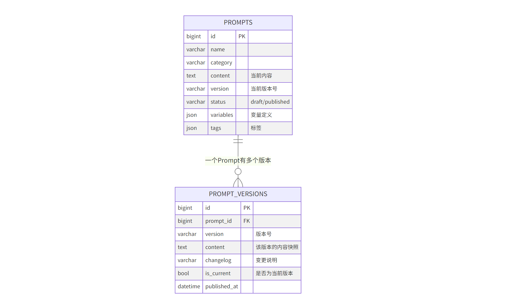
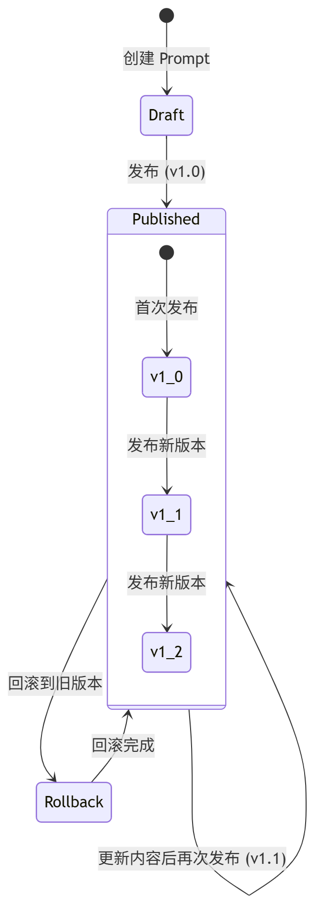
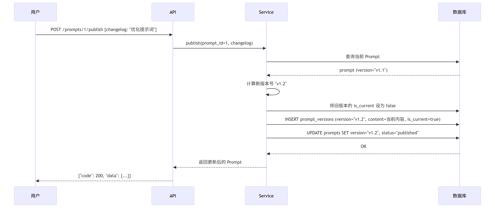
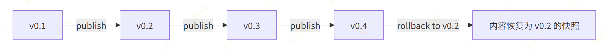
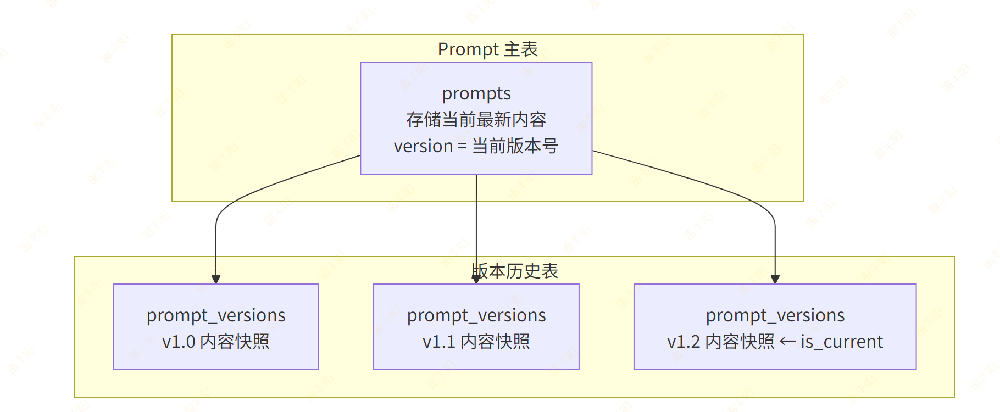

# 6. Prompt & 版本管理

# 需求分析

## 数据结构

模型的数据结构：

```yaml
interface Prompt {
  id: string
  name: string
  description: string
  category: string           // 分类：客服/开发/营销/分析/工具
  tags: string[]
  content: string            // Prompt 正文（支持 {{变量}} 模板语法）
  variables: PromptVariable[]
  version: string            // 当前版本号
  status: 'draft' | 'published'
  usageCount: number
  linkedAgentCount: number   // 关联 Agent 数量（计算字段）
  createdBy: string
}

interface PromptVariable {
  name: string
  type: 'string' | 'number' | 'boolean' | 'text'
  description: string
  defaultValue?: string
  required: boolean
}

interface PromptVersion {
  id: string
  promptId: string
  version: string
  content: string
  changelog: string
  publishedBy: string
  publishedAt: string
  isCurrent: boolean
}
```

**需要实现的接口**：

| 方法 | 路径 | 说明 |
| --- | --- | --- |
| POST | /api/v1/prompts | 创建 Prompt |
| GET | /api/v1/prompts | Prompt 列表 |
| GET | /api/v1/prompts/{id} | Prompt 详情 |
| PUT | /api/v1/prompts/{id} | 更新 Prompt |
| DELETE | /api/v1/prompts/{id} | 删除 Prompt |
| POST | /api/v1/prompts/{id}/publish | 发布新版本 |
| GET | /api/v1/prompts/{id}/versions | 版本列表 |
| POST | /api/v1/prompts/{id}/rollback | 回滚到指定版本 |

## 版本管理设计

### 数据模型



### **核心流程**



### **发布操作的详细流程**



# 开发流程

## Step 1 — 创建 ORM Model

创建文件 `src/modules/prompt/model.py`：

```python
from sqlalchemy import String, Text, BigInteger, ForeignKey, Boolean, JSON, DateTime
from sqlalchemy.orm import Mapped, mapped_column, relationship
from src.core.base_model import BaseModel
from datetime import datetime


class Prompt(BaseModel):
    """Prompt 模板表"""
    __tablename__ = "prompts"

    name: Mapped[str] = mapped_column(String(200), comment="Prompt 名称")
    description: Mapped[str | None] = mapped_column(
        String(500), nullable=True, comment="描述"
    )
    category: Mapped[str] = mapped_column(
        String(50), default="general", comment="分类"
    )
    tags: Mapped[dict | None] = mapped_column(
        JSON, nullable=True, comment="标签列表，JSON 数组"
    )
    content: Mapped[str] = mapped_column(Text, comment="Prompt 正文内容")
    variables: Mapped[dict | None] = mapped_column(
        JSON, nullable=True, comment="变量定义，JSON 数组"
    )
    version: Mapped[str] = mapped_column(
        String(50), default="v0.1", comment="当前版本号"
    )
    status: Mapped[str] = mapped_column(
        String(50), default="draft", comment="状态: draft/published"
    )
    created_by: Mapped[str | None] = mapped_column(
        String(100), nullable=True, comment="创建者"
    )

    # 关联版本列表
    versions: Mapped[list["PromptVersion"]] = relationship(
        "PromptVersion", back_populates="prompt",
        order_by="PromptVersion.id.desc()",
        lazy="selectin",
    )


class PromptVersion(BaseModel):
    """Prompt 版本表"""
    __tablename__ = "prompt_versions"

    prompt_id: Mapped[int] = mapped_column(
        BigInteger, ForeignKey("prompts.id", ondelete="CASCADE"),
        comment="所属 Prompt ID"
    )
    version: Mapped[str] = mapped_column(String(50), comment="版本号")
    content: Mapped[str] = mapped_column(Text, comment="该版本的内容快照")
    changelog: Mapped[str | None] = mapped_column(
        String(500), nullable=True, comment="变更说明"
    )
    is_current: Mapped[bool] = mapped_column(
        Boolean, default=False, comment="是否为当前版本"
    )
    published_by: Mapped[str | None] = mapped_column(
        String(100), nullable=True, comment="发布者"
    )
    published_at: Mapped[datetime | None] = mapped_column(
        DateTime, nullable=True, comment="发布时间"
    )

    # 反向关联
    prompt: Mapped["Prompt"] = relationship("Prompt", back_populates="versions")
```

> **JSON 字段的使用**：
> 
> MySQL 5.7+ 支持 JSON 类型。`tags` 和 `variables` 使用 JSON 存储，好处是：
> 
> - 结构灵活，不需要额外的关联表
> - SQLAlchemy 自动序列化/反序列化为 Python dict/list
> - 适合不需要索引查询的嵌套数据

```python
# 存储时
prompt.tags = ["客服", "对话", "通用"]  # Python list → MySQL JSON
prompt.variables = [{"name": "company", "type": "string", "required": True}]

# 读取时
print(prompt.tags)  # → ["客服", "对话", "通用"]  自动反序列化
```

## Step 2 — 生成数据库迁移

> **注意**：Alembic 的 `env.py` 需要能 import 到你的 Model。确保 `alembic/env.py` 中有类似 `from src.core.base_model import Base` 的导入，并且 `target_metadata = Base.metadata`。新增的 Model 文件需要在某处被 import，Alembic 才能检测到。

```bash
alembic revision --autogenerate -m "创建prompts和prompt_versions表"
alembic upgrade head
```

## Step 3 — 定义 Pydantic Schema

> **核心概念**：Schema 定义了 API 的输入输出数据结构。`Create` 用于创建请求，`Update` 用于更新请求（字段可选），`Read` 用于响应输出。

创建文件 `src/modules/prompt/schema.py`：

```python
from pydantic import BaseModel
from datetime import datetime


class PromptVariableSchema(BaseModel):
    """Prompt 变量定义"""
    name: str
    type: str = "string"       # string / number / boolean / text
    description: str = ""
    default_value: str | None = None
    required: bool = True


class PromptCreate(BaseModel):
    name: str
    description: str | None = None
    category: str = "general"
    tags: list[str] = []
    content: str
    variables: list[PromptVariableSchema] = []


class PromptUpdate(BaseModel):
    name: str | None = None
    description: str | None = None
    category: str | None = None
    tags: list[str] | None = None
    content: str | None = None
    variables: list[PromptVariableSchema] | None = None


class PromptRead(BaseModel):
    id: int
    name: str
    description: str | None
    category: str
    tags: list[str]
    content: str
    variables: list[PromptVariableSchema]
    version: str
    status: str
    created_by: str | None

    model_config = {"from_attributes": True}


class PromptVersionRead(BaseModel):
    id: int
    prompt_id: int
    version: str
    content: str
    changelog: str | None
    is_current: bool
    published_by: str | None
    published_at: datetime | None

    model_config = {"from_attributes": True}


class PublishRequest(BaseModel):
    """发布请求"""
    changelog: str = ""


class RollbackRequest(BaseModel):
    """回滚请求"""
    version_id: int    # 要回滚到的版本 ID
```

> **注意**：`ModelRead` 中的 `provider_name` 和 `capabilities`（list）无法直接从 ORM 对象自动映射，需要在 Service 层手动构建。

## Step 4 — 编写 Repository

创建文件 `src/modules/prompt/repository.py`：

```python
from sqlalchemy import select, update
from sqlalchemy.ext.asyncio import AsyncSession
from src.core.base_repository import BaseRepository
from src.modules.prompt.model import Prompt, PromptVersion


class PromptRepository(BaseRepository[Prompt]):
    """搜索字段：按名称或分类搜索"""
    SEARCH_FIELDS = ["name", "category"]

    def __init__(self, db: AsyncSession):
        super().__init__(Prompt, db)

    async def get_by_name(self, name: str) -> Prompt | None:
        stmt = select(Prompt).where(Prompt.name == name)
        result = await self.db.execute(stmt)
        return result.scalar_one_or_none()

    async def search_page(
        self, offset: int, limit: int, keyword: str | None
    ) -> tuple[list[Prompt], int]:
        """分页 + 搜索"""
        return await self.get_page(
            offset=offset,
            limit=limit,
            keyword=keyword,
            search_fields=self.SEARCH_FIELDS,
        )


class PromptVersionRepository(BaseRepository[PromptVersion]):
    def __init__(self, db: AsyncSession):
        super().__init__(PromptVersion, db)

    async def get_versions_by_prompt(self, prompt_id: int) -> list[PromptVersion]:
        """获取某个 Prompt 的所有版本，按 ID 倒序"""
        stmt = (
            select(PromptVersion)
            .where(PromptVersion.prompt_id == prompt_id)
            .order_by(PromptVersion.id.desc())
        )
        result = await self.db.execute(stmt)
        return result.scalars().all()

    async def clear_current(self, prompt_id: int) -> None:
        """将某个 Prompt 的所有版本的 is_current 设为 False"""
        stmt = (
            update(PromptVersion)
            .where(PromptVersion.prompt_id == prompt_id)
            .values(is_current=False)
        )
        await self.db.execute(stmt)
```

## Step 5 — 编写 Service

### 代码

创建文件 `src/modules/prompt/service.py`：

```python
from datetime import datetime
from sqlalchemy.ext.asyncio import AsyncSession
from src.core.exceptions import BizException
from src.core.base_schema import PageResult
from src.core.deps import PageParams
from src.modules.prompt.model import Prompt, PromptVersion
from src.modules.prompt.repository import PromptRepository, PromptVersionRepository
from src.modules.prompt.schema import (
    PromptCreate, PromptUpdate, PromptRead,
    PromptVersionRead, PublishRequest, RollbackRequest,
)


class PromptService:
    def __init__(self, db: AsyncSession):
        self.repo = PromptRepository(db)
        self.version_repo = PromptVersionRepository(db)

    def _to_read(self, prompt: Prompt) -> PromptRead:
        return PromptRead(
            id=prompt.id,
            name=prompt.name,
            description=prompt.description,
            category=prompt.category,
            tags=prompt.tags or [],
            content=prompt.content,
            variables=prompt.variables or [],
            version=prompt.version,
            status=prompt.status,
            created_by=prompt.created_by,
        )

    async def create_prompt(self, data: PromptCreate, current_user: str = None) -> PromptRead:
        prompt = Prompt(
            name=data.name,
            description=data.description,
            category=data.category,
            tags=data.tags,
            content=data.content,
            variables=[v.model_dump() for v in data.variables],
            version="v0.1",
            status="draft",
            created_by=current_user,
        )
        prompt = await self.repo.create(prompt)
        return self._to_read(prompt)

    async def get_prompt(self, prompt_id: int) -> PromptRead:
        prompt = await self.repo.get_by_id(prompt_id)
        if not prompt:
            raise BizException(code=42001, message="Prompt 不存在")
        return self._to_read(prompt)

    async def list_prompts(self, params: PageParams) -> PageResult[PromptRead]:
        """分页查询 Prompt 列表"""
        items, total = await self.repo.search_page(
            offset=params.offset,
            limit=params.page_size,
            keyword=params.keyword,
        )
        return PageResult(
            items=[self._to_read(p) for p in items],
            total=total,
            page=params.page,
            page_size=params.page_size,
        )

    async def update_prompt(self, prompt_id: int, data: PromptUpdate) -> PromptRead:
        prompt = await self.repo.get_by_id(prompt_id)
        if not prompt:
            raise BizException(code=42001, message="Prompt 不存在")

        if data.name is not None:
            prompt.name = data.name
        if data.description is not None:
            prompt.description = data.description
        if data.category is not None:
            prompt.category = data.category
        if data.tags is not None:
            prompt.tags = data.tags
        if data.content is not None:
            prompt.content = data.content
        if data.variables is not None:
            prompt.variables = [v.model_dump() for v in data.variables]

        prompt = await self.repo.update(prompt)
        return self._to_read(prompt)

    async def delete_prompt(self, prompt_id: int) -> None:
        prompt = await self.repo.get_by_id(prompt_id)
        if not prompt:
            raise BizException(code=42001, message="Prompt 不存在")
        await self.repo.delete_by_id(prompt_id)

    async def publish(
        self, prompt_id: int, data: PublishRequest, current_user: str = None
    ) -> PromptRead:
        """发布新版本"""
        prompt = await self.repo.get_by_id(prompt_id)
        if not prompt:
            raise BizException(code=42001, message="Prompt 不存在")

        # 1. 计算新版本号
        new_version = self._next_version(prompt.version)

        # 2. 将旧版本的 is_current 设为 False
        await self.version_repo.clear_current(prompt_id)

        # 3. 创建版本快照
        version = PromptVersion(
            prompt_id=prompt_id,
            version=new_version,
            content=prompt.content,
            changelog=data.changelog,
            is_current=True,
            published_by=current_user,
            published_at=datetime.now(),
        )
        await self.version_repo.create(version)

        # 4. 更新 Prompt 主表
        prompt.version = new_version
        prompt.status = "published"
        await self.repo.update(prompt)

        return self._to_read(prompt)

    async def get_versions(self, prompt_id: int) -> list[PromptVersionRead]:
        """获取版本列表"""
        versions = await self.version_repo.get_versions_by_prompt(prompt_id)
        return [PromptVersionRead.model_validate(v) for v in versions]

    async def rollback(self, prompt_id: int, data: RollbackRequest) -> PromptRead:
        """回滚到指定版本"""
        prompt = await self.repo.get_by_id(prompt_id)
        if not prompt:
            raise BizException(code=42001, message="Prompt 不存在")

        # 1. 查找目标版本
        target_version = await self.version_repo.get_by_id(data.version_id)
        if not target_version or target_version.prompt_id != prompt_id:
            raise BizException(code=42002, message="版本不存在")

        # 2. 用目标版本的内容覆盖当前内容
        prompt.content = target_version.content
        prompt.version = target_version.version

        # 3. 更新 is_current 标记
        await self.version_repo.clear_current(prompt_id)
        target_version.is_current = True
        await self.version_repo.update(target_version)

        await self.repo.update(prompt)
        return self._to_read(prompt)

    @staticmethod
    def _next_version(current: str) -> str:
        """版本号递增：v1.2 → v1.3"""
        try:
            prefix = current[0]  # "v"
            parts = current[1:].split(".")
            major, minor = int(parts[0]), int(parts[1])
            return f"{prefix}{major}.{minor + 1}"
        except (IndexError, ValueError):
            return "v1.0"
```

### **版本号递增逻辑：**



## Step 6 — 编写 API Router

创建文件 `src/modules/prompt/api.py`：

```python
from fastapi import APIRouter, Depends
from sqlalchemy.ext.asyncio import AsyncSession
from src.infra.database import get_db
from src.core.base_schema import ResponseSchema, PageResult
from src.core.deps import PageParams
from src.modules.prompt.schema import (
    PromptCreate, PromptUpdate, PromptRead,
    PromptVersionRead, PublishRequest, RollbackRequest,
)
from src.modules.prompt.service import PromptService

router = APIRouter(prefix="/prompts", tags=["Prompt管理"])


def get_prompt_service(db: AsyncSession = Depends(get_db)) -> PromptService:
    return PromptService(db)


@router.post("", response_model=ResponseSchema[PromptRead], summary="创建Prompt")
async def create_prompt(
    data: PromptCreate,
    svc: PromptService = Depends(get_prompt_service),
):
    result = await svc.create_prompt(data)
    return ResponseSchema(data=result)


@router.get("", response_model=ResponseSchema[PageResult[PromptRead]], summary="Prompt列表")
async def list_prompts(
    params: PageParams = Depends(),
    svc: PromptService = Depends(get_prompt_service),
):
    page_result = await svc.list_prompts(params)
    return ResponseSchema(data=page_result)


@router.get("/{prompt_id}", response_model=ResponseSchema[PromptRead], summary="Prompt详情")
async def get_prompt(
    prompt_id: int,
    svc: PromptService = Depends(get_prompt_service),
):
    result = await svc.get_prompt(prompt_id)
    return ResponseSchema(data=result)


@router.put("/{prompt_id}", response_model=ResponseSchema[PromptRead], summary="更新Prompt")
async def update_prompt(
    prompt_id: int,
    data: PromptUpdate,
    svc: PromptService = Depends(get_prompt_service),
):
    result = await svc.update_prompt(prompt_id, data)
    return ResponseSchema(data=result)


@router.delete("/{prompt_id}", response_model=ResponseSchema, summary="删除Prompt")
async def delete_prompt(
    prompt_id: int,
    svc: PromptService = Depends(get_prompt_service),
):
    await svc.delete_prompt(prompt_id)
    return ResponseSchema(message="删除成功")


@router.post("/{prompt_id}/publish", response_model=ResponseSchema[PromptRead], summary="发布新版本")
async def publish_prompt(
    prompt_id: int,
    data: PublishRequest,
    svc: PromptService = Depends(get_prompt_service),
):
    result = await svc.publish(prompt_id, data)
    return ResponseSchema(data=result)


@router.get("/{prompt_id}/versions", response_model=ResponseSchema[list[PromptVersionRead]], summary="版本列表")
async def get_versions(
    prompt_id: int,
    svc: PromptService = Depends(get_prompt_service),
):
    results = await svc.get_versions(prompt_id)
    return ResponseSchema(data=results)


@router.post("/{prompt_id}/rollback", response_model=ResponseSchema[PromptRead], summary="回滚版本")
async def rollback_prompt(
    prompt_id: int,
    data: RollbackRequest,
    svc: PromptService = Depends(get_prompt_service),
):
    result = await svc.rollback(prompt_id, data)
    return ResponseSchema(data=result)
```

## Step 7 — 注册路由

在 `src/main.py` 中添加路由注册：

```bash
from src.modules.prompt.api import router as prompt_router
app.include_router(prompt_router, prefix="/api/v1")
```

# 关键点回顾

## 版本快照模式



- 主表始终保存最新内容，方便查询
- 版本表保存历史快照，支持回滚
- `is_current` 标记当前生效版本
- 发布 = 创建快照 + 更新主表版本号
- 回滚 = 用旧快照覆盖主表内容