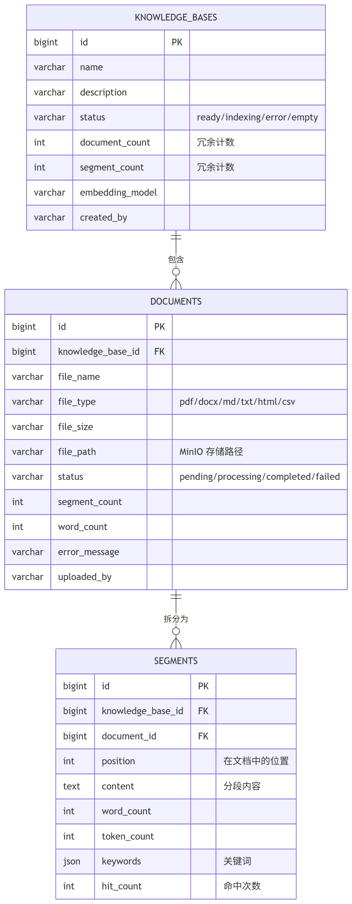
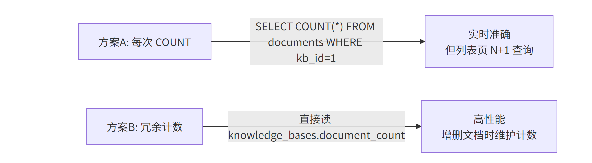
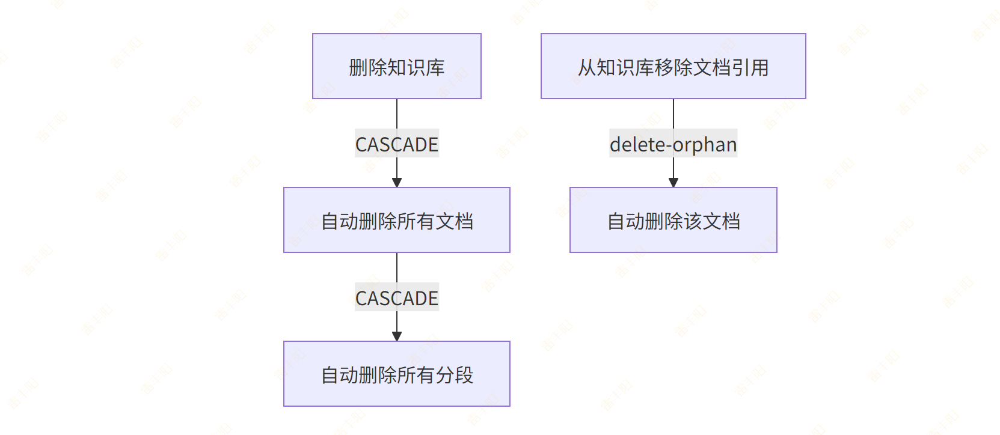
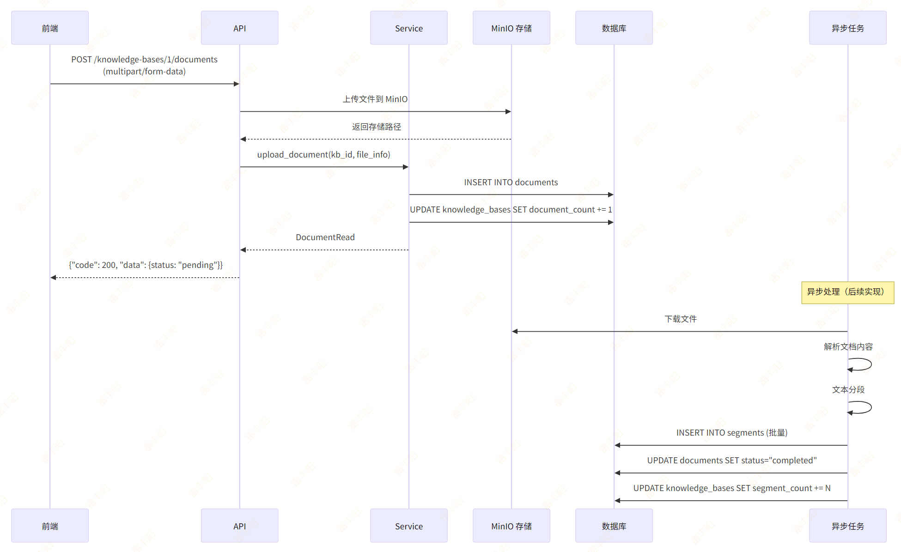
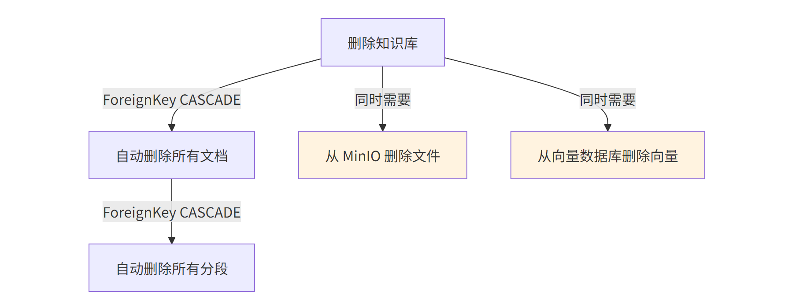
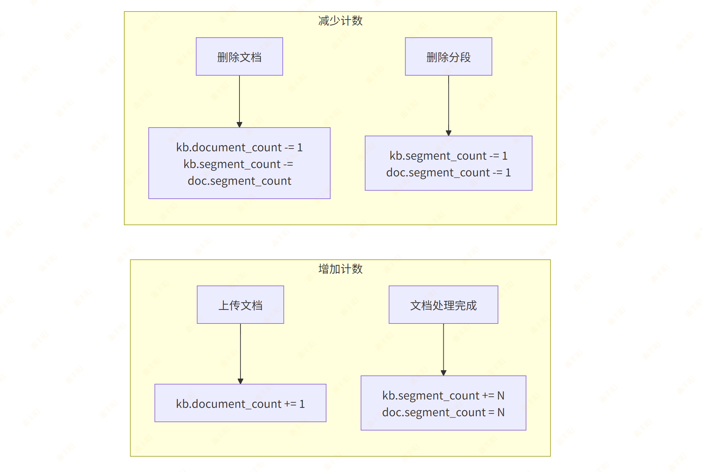

# 7. 知识库管理（Knowledge Base + Document + Segment）

# 需求分析

> 重点：三层父子关系的设计：知识库 → 文档 → 分段。  
> 
> KnowledgeBase（知识库）
> 
>   └── Document（文档）
> 
>         └── Segment（分段/片段）

## **需要实现的接口**：

| 方法 | 路径 | 说明 |
| --- | --- | --- |
| POST | /api/v1/knowledge-bases | 创建知识库 |
| GET | /api/v1/knowledge-bases | 知识库列表 |
| GET | /api/v1/knowledge-bases/{id} | 知识库详情 |
| PUT | /api/v1/knowledge-bases/{id} | 更新知识库 |
| DELETE | /api/v1/knowledge-bases/{id} | 删除知识库 |
| POST | /api/v1/knowledge-bases/{id}/documents | 上传文档 |
| GET | /api/v1/knowledge-bases/{id}/documents | 文档列表 |
| DELETE | /api/v1/knowledge-bases/{kb_id}/documents/{doc_id} | 删除文档 |
| GET | /api/v1/knowledge-bases/{id}/segments | 分段列表 |
| PUT | /api/v1/knowledge-bases/{kb_id}/segments/{seg_id} | 编辑分段 |
| DELETE | /api/v1/knowledge-bases/{kb_id}/segments/{seg_id} | 删除分段 |

## 数据模型设计



## **冗余计数字段的设计**：

`knowledge_bases` 表中的 `document_count` 和 `segment_count` 是冗余字段。为什么不每次 `COUNT(*)` 查询？



**对于列表页展示场景，方案 B 更优。在增删文档时同步更新计数即可。**

# 开发流程

## Step 1 — 创建 ORM Model

创建文件 `src/modules/knowledge/model.py`：

```python
from sqlalchemy import String, Text, BigInteger, Integer, ForeignKey, JSON
from sqlalchemy.orm import Mapped, mapped_column, relationship
from src.core.base_model import BaseModel


class KnowledgeBase(BaseModel):
    """知识库表"""
    __tablename__ = "knowledge_bases"

    name: Mapped[str] = mapped_column(String(200), comment="知识库名称")
    description: Mapped[str | None] = mapped_column(
        String(500), nullable=True, comment="描述"
    )
    status: Mapped[str] = mapped_column(
        String(50), default="empty", comment="状态: ready/indexing/error/empty"
    )
    document_count: Mapped[int] = mapped_column(
        Integer, default=0, comment="文档数量"
    )
    segment_count: Mapped[int] = mapped_column(
        Integer, default=0, comment="分段数量"
    )
    embedding_model: Mapped[str] = mapped_column(
        String(100), default="text-embedding-ada-002", comment="向量化模型"
    )
    created_by: Mapped[str | None] = mapped_column(
        String(100), nullable=True, comment="创建者"
    )

    # 关联文档列表
    documents: Mapped[list["Document"]] = relationship(
        "Document", back_populates="knowledge_base",
        cascade="all, delete-orphan",  # 删除知识库时级联删除文档
    )


class Document(BaseModel):
    """文档表"""
    __tablename__ = "documents"

    knowledge_base_id: Mapped[int] = mapped_column(
        BigInteger, ForeignKey("knowledge_bases.id", ondelete="CASCADE"),
        comment="所属知识库ID"
    )
    file_name: Mapped[str] = mapped_column(String(500), comment="文件名")
    file_type: Mapped[str] = mapped_column(
        String(50), comment="文件类型: pdf/docx/md/txt/html/csv"
    )
    file_size: Mapped[str | None] = mapped_column(
        String(50), nullable=True, comment="文件大小"
    )
    file_path: Mapped[str | None] = mapped_column(
        String(1000), nullable=True, comment="MinIO 存储路径"
    )
    status: Mapped[str] = mapped_column(
        String(50), default="pending",
        comment="处理状态: pending/processing/completed/failed"
    )
    segment_count: Mapped[int] = mapped_column(
        Integer, default=0, comment="分段数量"
    )
    word_count: Mapped[int] = mapped_column(
        Integer, default=0, comment="字数"
    )
    error_message: Mapped[str | None] = mapped_column(
        Text, nullable=True, comment="错误信息"
    )
    uploaded_by: Mapped[str | None] = mapped_column(
        String(100), nullable=True, comment="上传者"
    )

    # 关联
    knowledge_base: Mapped["KnowledgeBase"] = relationship(
        "KnowledgeBase", back_populates="documents"
    )
    segments: Mapped[list["Segment"]] = relationship(
        "Segment", back_populates="document",
        cascade="all, delete-orphan",
    )


class Segment(BaseModel):
    """文档分段表"""
    __tablename__ = "segments"

    knowledge_base_id: Mapped[int] = mapped_column(
        BigInteger, ForeignKey("knowledge_bases.id", ondelete="CASCADE"),
        comment="所属知识库ID"
    )
    document_id: Mapped[int] = mapped_column(
        BigInteger, ForeignKey("documents.id", ondelete="CASCADE"),
        comment="所属文档ID"
    )
    position: Mapped[int] = mapped_column(
        Integer, comment="在文档中的位置序号"
    )
    content: Mapped[str] = mapped_column(Text, comment="分段内容")
    word_count: Mapped[int] = mapped_column(
        Integer, default=0, comment="字数"
    )
    token_count: Mapped[int] = mapped_column(
        Integer, default=0, comment="Token 数"
    )
    keywords: Mapped[dict | None] = mapped_column(
        JSON, nullable=True, comment="关键词列表"
    )
    hit_count: Mapped[int] = mapped_column(
        Integer, default=0, comment="检索命中次数"
    )

    # 关联
    document: Mapped["Document"] = relationship(
        "Document", back_populates="segments"
    )
```

> `cascade="all, delete-orphan"`** 的含义**：



- `all`：所有操作（save, merge, delete 等）级联到子对象
- `delete-orphan`：当子对象从父对象的集合中移除时，自动删除子对象

## Step 2 — 生成数据库迁移

> **注意**：Alembic 的 `env.py` 需要能 import 到你的 Model。确保 `alembic/env.py` 中有类似 `from src.core.base_model import Base` 的导入，并且 `target_metadata = Base.metadata`。新增的 Model 文件需要在某处被 import，Alembic 才能检测到。

```bash
alembic revision --autogenerate -m "创建knowledge_bases、documents、segments表"
alembic upgrade head
```

## Step 3 — 定义 Pydantic Schema

> **核心概念**：Schema 定义了 API 的输入输出数据结构。`Create` 用于创建请求，`Update` 用于更新请求（字段可选），`Read` 用于响应输出。

创建文件 `src/modules/knowledge/schema.py`：

```yaml
from pydantic import BaseModel
from datetime import datetime


# ===== 知识库 =====
class KnowledgeBaseCreate(BaseModel):
    name: str
    description: str | None = None
    embedding_model: str = "text-embedding-ada-002"


class KnowledgeBaseUpdate(BaseModel):
    name: str | None = None
    description: str | None = None
    embedding_model: str | None = None


class KnowledgeBaseRead(BaseModel):
    id: int
    name: str
    description: str | None
    status: str
    document_count: int
    segment_count: int
    embedding_model: str
    created_by: str | None
    created_at: datetime
    updated_at: datetime

    model_config = {"from_attributes": True}


# ===== 文档 =====
class DocumentRead(BaseModel):
    id: int
    knowledge_base_id: int
    file_name: str
    file_type: str
    file_size: str | None
    status: str
    segment_count: int
    word_count: int
    error_message: str | None
    uploaded_by: str | None
    created_at: datetime

    model_config = {"from_attributes": True}


# ===== 分段 =====
class SegmentRead(BaseModel):
    id: int
    knowledge_base_id: int
    document_id: int
    position: int
    content: str
    word_count: int
    token_count: int
    keywords: list[str] | None
    hit_count: int
    created_at: datetime

    model_config = {"from_attributes": True}


class SegmentUpdate(BaseModel):
    content: str | None = None
    keywords: list[str] | None = None
```

> **注意**：`ModelRead` 中的 `provider_name` 和 `capabilities`（list）无法直接从 ORM 对象自动映射，需要在 Service 层手动构建。

## Step 4 — 编写 Repository

创建文件 `src/modules/knowledge/repository.py`：

```python
from sqlalchemy import select, func, or_
from sqlalchemy.ext.asyncio import AsyncSession
from src.core.base_repository import BaseRepository
from src.modules.knowledge.model import KnowledgeBase, Document, Segment


class KnowledgeBaseRepository(BaseRepository[KnowledgeBase]):
    """搜索字段：按名称或描述搜索"""
    SEARCH_FIELDS = ["name", "description"]

    def __init__(self, db: AsyncSession):
        super().__init__(KnowledgeBase, db)

    async def search_page(
        self, offset: int, limit: int, keyword: str | None
    ) -> tuple[list[KnowledgeBase], int]:
        """分页 + 搜索"""
        return await self.get_page(
            offset=offset,
            limit=limit,
            keyword=keyword,
            search_fields=self.SEARCH_FIELDS,
        )


class DocumentRepository(BaseRepository[Document]):
    def __init__(self, db: AsyncSession):
        super().__init__(Document, db)

    async def get_page_by_knowledge_base(
        self, kb_id: int, offset: int = 0, limit: int = 20, keyword: str | None = None
    ) -> tuple[list[Document], int]:
        """按知识库分页查询文档，支持按文件名搜索"""
        stmt = select(Document).where(Document.knowledge_base_id == kb_id)
        if keyword:
            stmt = stmt.where(Document.file_name.like(f"%{keyword}%"))

        # 查总数
        count_stmt = select(func.count()).select_from(stmt.subquery())
        total_result = await self.db.execute(count_stmt)
        total = total_result.scalar_one()

        # 查分页数据
        stmt = stmt.offset(offset).limit(limit).order_by(Document.id.desc())
        result = await self.db.execute(stmt)
        items = list(result.scalars().all())
        return items, total


class SegmentRepository(BaseRepository[Segment]):
    def __init__(self, db: AsyncSession):
        super().__init__(Segment, db)

    async def get_page_by_knowledge_base(
        self, kb_id: int, offset: int = 0, limit: int = 20, keyword: str | None = None
    ) -> tuple[list[Segment], int]:
        """按知识库分页查询分段，支持按内容搜索"""
        stmt = select(Segment).where(Segment.knowledge_base_id == kb_id)
        if keyword:
            stmt = stmt.where(Segment.content.like(f"%{keyword}%"))

        # 查总数
        count_stmt = select(func.count()).select_from(stmt.subquery())
        total_result = await self.db.execute(count_stmt)
        total = total_result.scalar_one()

        # 查分页数据
        stmt = stmt.order_by(Segment.document_id, Segment.position).offset(offset).limit(limit)
        result = await self.db.execute(stmt)
        items = list(result.scalars().all())
        return items, total

    async def get_by_document(self, doc_id: int) -> list[Segment]:
        stmt = (
            select(Segment)
            .where(Segment.document_id == doc_id)
            .order_by(Segment.position)
        )
        result = await self.db.execute(stmt)
        return result.scalars().all()
```

## Step 5 — 编写 Service

### 代码

创建文件 `src/modules/knowledge/service.py`：

```python
from sqlalchemy.ext.asyncio import AsyncSession
from src.core.exceptions import BizException
from src.core.base_schema import PageResult
from src.core.deps import PageParams
from src.modules.knowledge.model import KnowledgeBase, Document, Segment
from src.modules.knowledge.repository import (
    KnowledgeBaseRepository, DocumentRepository, SegmentRepository,
)
from src.modules.knowledge.schema import (
    KnowledgeBaseCreate, KnowledgeBaseUpdate, KnowledgeBaseRead,
    DocumentRead, SegmentRead, SegmentUpdate,
)


class KnowledgeService:
    def __init__(self, db: AsyncSession):
        self.kb_repo = KnowledgeBaseRepository(db)
        self.doc_repo = DocumentRepository(db)
        self.seg_repo = SegmentRepository(db)

    # ===== 知识库 CRUD =====

    async def create_kb(self, data: KnowledgeBaseCreate, current_user: str = None) -> KnowledgeBaseRead:
        kb = KnowledgeBase(
            name=data.name,
            description=data.description,
            embedding_model=data.embedding_model,
            created_by=current_user,
        )
        kb = await self.kb_repo.create(kb)
        return KnowledgeBaseRead.model_validate(kb)

    async def get_kb(self, kb_id: int) -> KnowledgeBaseRead:
        kb = await self.kb_repo.get_by_id(kb_id)
        if not kb:
            raise BizException(code=43001, message="知识库不存在")
        return KnowledgeBaseRead.model_validate(kb)

    async def list_kbs(self, params: PageParams) -> PageResult[KnowledgeBaseRead]:
        """分页查询知识库列表"""
        items, total = await self.kb_repo.search_page(
            offset=params.offset,
            limit=params.page_size,
            keyword=params.keyword,
        )
        return PageResult(
            items=[KnowledgeBaseRead.model_validate(kb) for kb in items],
            total=total,
            page=params.page,
            page_size=params.page_size,
        )

    async def update_kb(self, kb_id: int, data: KnowledgeBaseUpdate) -> KnowledgeBaseRead:
        kb = await self.kb_repo.get_by_id(kb_id)
        if not kb:
            raise BizException(code=43001, message="知识库不存在")

        if data.name is not None:
            kb.name = data.name
        if data.description is not None:
            kb.description = data.description
        if data.embedding_model is not None:
            kb.embedding_model = data.embedding_model

        kb = await self.kb_repo.update(kb)
        return KnowledgeBaseRead.model_validate(kb)

    async def delete_kb(self, kb_id: int) -> None:
        kb = await self.kb_repo.get_by_id(kb_id)
        if not kb:
            raise BizException(code=43001, message="知识库不存在")
        # cascade 会自动删除关联的文档和分段
        await self.kb_repo.delete(kb)

    # ===== 文档管理 =====

    async def upload_document(
        self, kb_id: int, file_name: str, file_type: str,
        file_size: str, file_path: str, current_user: str = None
    ) -> DocumentRead:
        """记录文档上传信息（文件已上传到 MinIO）"""
        kb = await self.kb_repo.get_by_id(kb_id)
        if not kb:
            raise BizException(code=43001, message="知识库不存在")

        doc = Document(
            knowledge_base_id=kb_id,
            file_name=file_name,
            file_type=file_type,
            file_size=file_size,
            file_path=file_path,
            status="pending",
            uploaded_by=current_user,
        )
        doc = await self.doc_repo.create(doc)

        # 更新知识库文档计数
        kb.document_count += 1
        await self.kb_repo.update(kb)

        # TODO: 触发异步文档处理任务（解析 → 分段 → 向量化）
        # 可以使用 Celery / BackgroundTasks / asyncio.create_task

        return DocumentRead.model_validate(doc)

    async def list_documents(self, kb_id: int, params: PageParams) -> PageResult[DocumentRead]:
        """分页查询文档列表"""
        items, total = await self.doc_repo.get_page_by_knowledge_base(
            kb_id, offset=params.offset, limit=params.page_size, keyword=params.keyword,
        )
        return PageResult(
            items=[DocumentRead.model_validate(d) for d in items],
            total=total,
            page=params.page,
            page_size=params.page_size,
        )

    async def delete_document(self, kb_id: int, doc_id: int) -> None:
        doc = await self.doc_repo.get_by_id(doc_id)
        if not doc or doc.knowledge_base_id != kb_id:
            raise BizException(code=43002, message="文档不存在")

        # 更新计数
        kb = await self.kb_repo.get_by_id(kb_id)
        kb.document_count = max(0, kb.document_count - 1)
        kb.segment_count = max(0, kb.segment_count - doc.segment_count)
        await self.kb_repo.update(kb)

        # cascade 会自动删除关联的分段
        await self.doc_repo.delete(doc)

        # TODO: 从 MinIO 删除文件
        # TODO: 从向量数据库删除对应向量

    # ===== 分段管理 =====

    async def list_segments(self, kb_id: int, params: PageParams) -> PageResult[SegmentRead]:
        """分页查询分段列表"""
        items, total = await self.seg_repo.get_page_by_knowledge_base(
            kb_id, offset=params.offset, limit=params.page_size, keyword=params.keyword,
        )
        return PageResult(
            items=[SegmentRead.model_validate(s) for s in items],
            total=total,
            page=params.page,
            page_size=params.page_size,
        )

    async def update_segment(self, kb_id: int, seg_id: int, data: SegmentUpdate) -> SegmentRead:
        seg = await self.seg_repo.get_by_id(seg_id)
        if not seg or seg.knowledge_base_id != kb_id:
            raise BizException(code=43003, message="分段不存在")

        if data.content is not None:
            seg.content = data.content
            seg.word_count = len(data.content)
        if data.keywords is not None:
            seg.keywords = data.keywords

        seg = await self.seg_repo.update(seg)
        return SegmentRead.model_validate(seg)

    async def delete_segment(self, kb_id: int, seg_id: int) -> None:
        seg = await self.seg_repo.get_by_id(seg_id)
        if not seg or seg.knowledge_base_id != kb_id:
            raise BizException(code=43003, message="分段不存在")

        # 更新计数
        kb = await self.kb_repo.get_by_id(kb_id)
        kb.segment_count = max(0, kb.segment_count - 1)
        await self.kb_repo.update(kb)

        doc = await self.doc_repo.get_by_id(seg.document_id)
        if doc:
            doc.segment_count = max(0, doc.segment_count - 1)
            await self.doc_repo.update(doc)

        await self.seg_repo.delete(seg)
```

### **文档上传的完整流程：**



## Step 6 — 编写 API Router

创建文件 `src/modules/knowledge/api.py`：

```python
from fastapi import APIRouter, Depends, UploadFile, File
from sqlalchemy.ext.asyncio import AsyncSession
from src.infra.database import get_db
from src.core.base_schema import ResponseSchema, PageResult
from src.core.deps import PageParams
from src.modules.knowledge.schema import (
    KnowledgeBaseCreate, KnowledgeBaseUpdate, KnowledgeBaseRead,
    DocumentRead, SegmentRead, SegmentUpdate,
)
from src.modules.knowledge.service import KnowledgeService

router = APIRouter(prefix="/knowledge-bases", tags=["知识库管理"])


def get_knowledge_service(db: AsyncSession = Depends(get_db)) -> KnowledgeService:
    return KnowledgeService(db)


# ===== 知识库 CRUD =====

@router.post("", response_model=ResponseSchema[KnowledgeBaseRead], summary="创建知识库")
async def create_kb(
    data: KnowledgeBaseCreate,
    svc: KnowledgeService = Depends(get_knowledge_service),
):
    result = await svc.create_kb(data)
    return ResponseSchema(data=result)


@router.get("", response_model=ResponseSchema[PageResult[KnowledgeBaseRead]], summary="知识库列表")
async def list_kbs(
    params: PageParams = Depends(),
    svc: KnowledgeService = Depends(get_knowledge_service),
):
    page_result = await svc.list_kbs(params)
    return ResponseSchema(data=page_result)


@router.get("/{kb_id}", response_model=ResponseSchema[KnowledgeBaseRead], summary="知识库详情")
async def get_kb(
    kb_id: int,
    svc: KnowledgeService = Depends(get_knowledge_service),
):
    result = await svc.get_kb(kb_id)
    return ResponseSchema(data=result)


@router.put("/{kb_id}", response_model=ResponseSchema[KnowledgeBaseRead], summary="更新知识库")
async def update_kb(
    kb_id: int, data: KnowledgeBaseUpdate,
    svc: KnowledgeService = Depends(get_knowledge_service),
):
    result = await svc.update_kb(kb_id, data)
    return ResponseSchema(data=result)


@router.delete("/{kb_id}", response_model=ResponseSchema, summary="删除知识库")
async def delete_kb(
    kb_id: int,
    svc: KnowledgeService = Depends(get_knowledge_service),
):
    await svc.delete_kb(kb_id)
    return ResponseSchema(message="删除成功")


# ===== 文档管理 =====

@router.post("/{kb_id}/documents", response_model=ResponseSchema[DocumentRead], summary="上传文档")
async def upload_document(
    kb_id: int,
    file: UploadFile = File(...),
    svc: KnowledgeService = Depends(get_knowledge_service),
):
    # 1. 获取文件信息
    file_name = file.filename
    file_type = file_name.rsplit(".", 1)[-1] if "." in file_name else "unknown"
    content = await file.read()
    file_size = f"{len(content) / (1024 * 1024):.2f} MB"

    # 2. TODO: 上传到 MinIO
    # from src.infra.minio_client import upload_file
    # file_path = await upload_file(f"knowledge/{kb_id}/{file_name}", content)
    file_path = f"knowledge/{kb_id}/{file_name}"  # 临时占位

    # 3. 记录到数据库
    result = await svc.upload_document(
        kb_id=kb_id,
        file_name=file_name,
        file_type=file_type,
        file_size=file_size,
        file_path=file_path,
    )
    return ResponseSchema(data=result)


@router.get("/{kb_id}/documents", response_model=ResponseSchema[PageResult[DocumentRead]], summary="文档列表")
async def list_documents(
    kb_id: int,
    params: PageParams = Depends(),
    svc: KnowledgeService = Depends(get_knowledge_service),
):
    page_result = await svc.list_documents(kb_id, params)
    return ResponseSchema(data=page_result)


@router.delete("/{kb_id}/documents/{doc_id}", response_model=ResponseSchema, summary="删除文档")
async def delete_document(
    kb_id: int, doc_id: int,
    svc: KnowledgeService = Depends(get_knowledge_service),
):
    await svc.delete_document(kb_id, doc_id)
    return ResponseSchema(message="删除成功")


# ===== 分段管理 =====

@router.get("/{kb_id}/segments", response_model=ResponseSchema[PageResult[SegmentRead]], summary="分段列表")
async def list_segments(
    kb_id: int,
    params: PageParams = Depends(),
    svc: KnowledgeService = Depends(get_knowledge_service),
):
    page_result = await svc.list_segments(kb_id, params)
    return ResponseSchema(data=page_result)


@router.put("/{kb_id}/segments/{seg_id}", response_model=ResponseSchema[SegmentRead], summary="编辑分段")
async def update_segment(
    kb_id: int, seg_id: int, data: SegmentUpdate,
    svc: KnowledgeService = Depends(get_knowledge_service),
):
    result = await svc.update_segment(kb_id, seg_id, data)
    return ResponseSchema(data=result)


@router.delete("/{kb_id}/segments/{seg_id}", response_model=ResponseSchema, summary="删除分段")
async def delete_segment(
    kb_id: int, seg_id: int,
    svc: KnowledgeService = Depends(get_knowledge_service),
):
    await svc.delete_segment(kb_id, seg_id)
    return ResponseSchema(message="删除成功")
```

## Step 7 — 注册路由

在 `src/main.py` 中添加路由注册：

```bash
from src.modules.knowledge.api import router as knowledge_router
app.include_router(knowledge_router, prefix="/api/v1")
```

# 关键点回顾

## 三层父子关系的级联删除



## 冗余计数的维护时机

