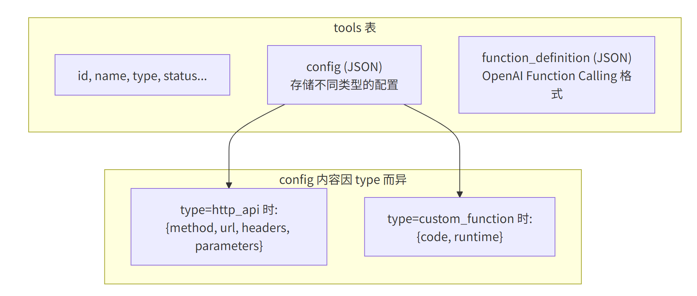
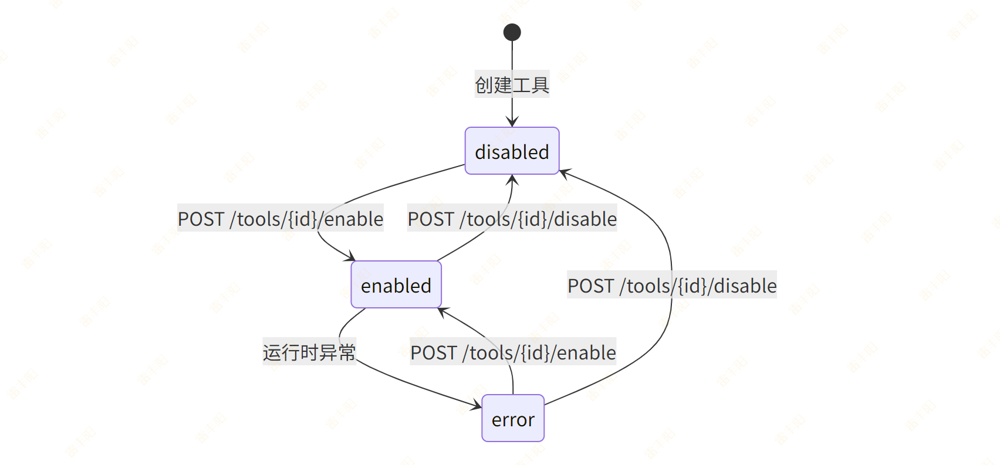

# 8. 工具管理（Tool）

# 需求分析

> 重点：如何用 JSON 字段存储灵活的工具配置（Function Calling 定义）。  

## **数据模型**：

```typescript
interface Tool {
  id: string
  name: string
  description: string
  type: 'builtin' | 'http_api' | 'custom_function'
  status: 'enabled' | 'disabled' | 'error'
  callCount7d: number
  successRate: number
  avgLatency: number
  linkedAgentCount: number
  createdBy: string
}

interface ToolDetail extends Tool {
  config: HttpApiConfig | CustomFunctionConfig
  functionDefinition: FunctionDefinition  // OpenAI Function Calling 格式
}

interface FunctionDefinition {
  name: string
  description: string
  parameters: {
    type: 'object'
    properties: Record<string, { type: string; description: string }>
    required: string[]
  }
}
```

## 需要实现的接口

| 方法 | 路径 | 说明 |
| --- | --- | --- |
| POST | /api/v1/tools | 注册工具 |
| GET | /api/v1/tools | 工具列表 |
| GET | /api/v1/tools/{id} | 工具详情 |
| PUT | /api/v1/tools/{id} | 更新工具 |
| DELETE | /api/v1/tools/{id} | 删除工具 |
| POST | /api/v1/tools/{id}/enable | 启用工具 |
| POST | /api/v1/tools/{id}/disable | 禁用工具 |
| POST | /api/v1/tools/{id}/test | 测试工具 |

## **JSON 字段存储灵活配置**

工具有不同类型（HTTP API / 自定义函数），每种类型的配置结构不同。使用 JSON 字段可以灵活存储：



# 开发流程

## Step 1 — 创建 ORM Model

创建文件 `src/modules/tool/model.py`：

```python
from sqlalchemy import String, Text, Integer, JSON, Numeric
from sqlalchemy.orm import Mapped, mapped_column
from src.core.base_model import BaseModel


class Tool(BaseModel):
    """工具表"""
    __tablename__ = "tools"

    name: Mapped[str] = mapped_column(String(200), unique=True, comment="工具名称")
    description: Mapped[str | None] = mapped_column(
        Text, nullable=True, comment="工具描述"
    )
    type: Mapped[str] = mapped_column(
        String(50), comment="工具类型: builtin/http_api/custom_function"
    )
    status: Mapped[str] = mapped_column(
        String(50), default="disabled", comment="状态: enabled/disabled/error"
    )
    config: Mapped[dict | None] = mapped_column(
        JSON, nullable=True, comment="工具配置（因类型而异）"
    )
    function_definition: Mapped[dict | None] = mapped_column(
        JSON, nullable=True,
        comment="Function Calling 定义（OpenAI 格式）"
    )
    call_count_7d: Mapped[int] = mapped_column(
        Integer, default=0, comment="近7天调用次数"
    )
    success_rate: Mapped[float] = mapped_column(
        Numeric(5, 2), default=0, comment="成功率 %"
    )
    avg_latency: Mapped[int] = mapped_column(
        Integer, default=0, comment="平均延迟 ms"
    )
    created_by: Mapped[str | None] = mapped_column(
        String(100), nullable=True, comment="创建者"
    )
```

## Step 2 — 生成数据库迁移

> **注意**：Alembic 的 `env.py` 需要能 import 到你的 Model。确保 `alembic/env.py` 中有类似 `from src.core.base_model import Base` 的导入，并且 `target_metadata = Base.metadata`。新增的 Model 文件需要在某处被 import，Alembic 才能检测到。

```bash
alembic revision --autogenerate -m "创建tools表"
alembic upgrade head
```

## Step 3 — 定义 Pydantic Schema

> **核心概念**：Schema 定义了 API 的输入输出数据结构。`Create` 用于创建请求，`Update` 用于更新请求（字段可选），`Read` 用于响应输出。

创建文件 `src/modules/tool/schema.py`：

```python
from pydantic import BaseModel


class FunctionDefinitionSchema(BaseModel):
    """OpenAI Function Calling 格式"""
    name: str
    description: str
    parameters: dict  # JSON Schema 格式


class ToolCreate(BaseModel):
    name: str
    description: str | None = None
    type: str                                    # builtin / http_api / custom_function
    config: dict | None = None                   # 工具配置
    function_definition: FunctionDefinitionSchema | None = None


class ToolUpdate(BaseModel):
    name: str | None = None
    description: str | None = None
    config: dict | None = None
    function_definition: FunctionDefinitionSchema | None = None


class ToolRead(BaseModel):
    id: int
    name: str
    description: str | None
    type: str
    status: str
    config: dict | None
    function_definition: dict | None
    call_count_7d: int
    success_rate: float
    avg_latency: int
    created_by: str | None

    model_config = {"from_attributes": True}


class ToolTestRequest(BaseModel):
    """测试工具请求"""
    input: dict  # 测试输入参数


class ToolTestResponse(BaseModel):
    """测试工具响应"""
    success: bool
    output: dict | None = None
    error: str | None = None
    latency_ms: int = 0
```

## Step 4 — 编写 Repository

创建文件 `src/modules/tool/repository.py`：

```python
from sqlalchemy import select
from sqlalchemy.ext.asyncio import AsyncSession
from src.core.base_repository import BaseRepository
from src.modules.tool.model import Tool


class ToolRepository(BaseRepository[Tool]):
    """搜索字段：按名称或描述搜索"""
    SEARCH_FIELDS = ["name", "description"]

    def __init__(self, db: AsyncSession):
        super().__init__(Tool, db)

    async def get_by_name(self, name: str) -> Tool | None:
        stmt = select(Tool).where(Tool.name == name)
        result = await self.db.execute(stmt)
        return result.scalar_one_or_none()

    async def get_enabled_tools(self) -> list[Tool]:
        """获取所有启用的工具"""
        stmt = select(Tool).where(Tool.status == "enabled")
        result = await self.db.execute(stmt)
        return result.scalars().all()

    async def search_page(
        self, offset: int, limit: int, keyword: str | None
    ) -> tuple[list[Tool], int]:
        """分页 + 搜索"""
        return await self.get_page(
            offset=offset,
            limit=limit,
            keyword=keyword,
            search_fields=self.SEARCH_FIELDS,
        )
```

## Step 5 — 编写 Service

### 代码

创建文件 `src/modules/tool/service.py`：

```python
import time
from sqlalchemy.ext.asyncio import AsyncSession
from src.core.exceptions import BizException
from src.core.base_schema import PageResult
from src.core.deps import PageParams
from src.modules.tool.model import Tool
from src.modules.tool.repository import ToolRepository
from src.modules.tool.schema import (
    ToolCreate, ToolUpdate, ToolRead,
    ToolTestRequest, ToolTestResponse,
)


class ToolService:
    def __init__(self, db: AsyncSession):
        self.repo = ToolRepository(db)

    def _to_read(self, tool: Tool) -> ToolRead:
        return ToolRead(
            id=tool.id,
            name=tool.name,
            description=tool.description,
            type=tool.type,
            status=tool.status,
            config=tool.config,
            function_definition=tool.function_definition,
            call_count_7d=tool.call_count_7d,
            success_rate=float(tool.success_rate),
            avg_latency=tool.avg_latency,
            created_by=tool.created_by,
        )

    async def create_tool(self, data: ToolCreate, current_user: str = None) -> ToolRead:
        existing = await self.repo.get_by_name(data.name)
        if existing:
            raise BizException(code=44001, message=f"工具 '{data.name}' 已存在")

        tool = Tool(
            name=data.name,
            description=data.description,
            type=data.type,
            config=data.config,
            function_definition=data.function_definition.model_dump() if data.function_definition else None,
            status="disabled",
            created_by=current_user,
        )
        tool = await self.repo.create(tool)
        return self._to_read(tool)

    async def get_tool(self, tool_id: int) -> ToolRead:
        tool = await self.repo.get_by_id(tool_id)
        if not tool:
            raise BizException(code=44002, message="工具不存在")
        return self._to_read(tool)

    async def list_tools(self, params: PageParams) -> PageResult[ToolRead]:
        """分页查询工具列表"""
        items, total = await self.repo.search_page(
            offset=params.offset,
            limit=params.page_size,
            keyword=params.keyword,
        )
        return PageResult(
            items=[self._to_read(t) for t in items],
            total=total,
            page=params.page,
            page_size=params.page_size,
        )

    async def update_tool(self, tool_id: int, data: ToolUpdate) -> ToolRead:
        tool = await self.repo.get_by_id(tool_id)
        if not tool:
            raise BizException(code=44002, message="工具不存在")

        if data.name is not None:
            tool.name = data.name
        if data.description is not None:
            tool.description = data.description
        if data.config is not None:
            tool.config = data.config
        if data.function_definition is not None:
            tool.function_definition = data.function_definition.model_dump()

        tool = await self.repo.update(tool)
        return self._to_read(tool)

    async def delete_tool(self, tool_id: int) -> None:
        tool = await self.repo.get_by_id(tool_id)
        if not tool:
            raise BizException(code=44002, message="工具不存在")
        await self.repo.delete_by_id(tool_id)

    async def enable_tool(self, tool_id: int) -> ToolRead:
        tool = await self.repo.get_by_id(tool_id)
        if not tool:
            raise BizException(code=44002, message="工具不存在")
        tool.status = "enabled"
        tool = await self.repo.update(tool)
        return self._to_read(tool)

    async def disable_tool(self, tool_id: int) -> ToolRead:
        tool = await self.repo.get_by_id(tool_id)
        if not tool:
            raise BizException(code=44002, message="工具不存在")
        tool.status = "disabled"
        tool = await self.repo.update(tool)
        return self._to_read(tool)

    async def test_tool(self, tool_id: int, data: ToolTestRequest) -> ToolTestResponse:
        """测试工具执行"""
        tool = await self.repo.get_by_id(tool_id)
        if not tool:
            raise BizException(code=44002, message="工具不存在")

        start = time.time()
        try:
            # TODO: 根据 tool.type 执行不同的测试逻辑
            # if tool.type == "http_api":
            #     result = await self._test_http_api(tool, data.input)
            # elif tool.type == "custom_function":
            #     result = await self._test_custom_function(tool, data.input)

            latency = int((time.time() - start) * 1000)
            return ToolTestResponse(
                success=True,
                output={"message": "测试成功", "input": data.input},
                latency_ms=latency,
            )
        except Exception as e:
            latency = int((time.time() - start) * 1000)
            return ToolTestResponse(
                success=False,
                error=str(e),
                latency_ms=latency,
            )
```

### **启用/禁用的状态流转：**



## Step 6 — 编写 API Router

创建文件 `src/modules/tool/api.py`：

```python
from fastapi import APIRouter, Depends
from sqlalchemy.ext.asyncio import AsyncSession
from src.infra.database import get_db
from src.core.base_schema import ResponseSchema, PageResult
from src.core.deps import PageParams
from src.modules.tool.schema import (
    ToolCreate, ToolUpdate, ToolRead,
    ToolTestRequest, ToolTestResponse,
)
from src.modules.tool.service import ToolService

router = APIRouter(prefix="/tools", tags=["工具管理"])


def get_tool_service(db: AsyncSession = Depends(get_db)) -> ToolService:
    return ToolService(db)


@router.post("", response_model=ResponseSchema[ToolRead], summary="注册工具")
async def create_tool(
    data: ToolCreate,
    svc: ToolService = Depends(get_tool_service),
):
    result = await svc.create_tool(data)
    return ResponseSchema(data=result)


@router.get("", response_model=ResponseSchema[PageResult[ToolRead]], summary="工具列表")
async def list_tools(
    params: PageParams = Depends(),
    svc: ToolService = Depends(get_tool_service),
):
    page_result = await svc.list_tools(params)
    return ResponseSchema(data=page_result)


@router.get("/{tool_id}", response_model=ResponseSchema[ToolRead], summary="工具详情")
async def get_tool(
    tool_id: int,
    svc: ToolService = Depends(get_tool_service),
):
    result = await svc.get_tool(tool_id)
    return ResponseSchema(data=result)


@router.put("/{tool_id}", response_model=ResponseSchema[ToolRead], summary="更新工具")
async def update_tool(
    tool_id: int, data: ToolUpdate,
    svc: ToolService = Depends(get_tool_service),
):
    result = await svc.update_tool(tool_id, data)
    return ResponseSchema(data=result)


@router.delete("/{tool_id}", response_model=ResponseSchema, summary="删除工具")
async def delete_tool(
    tool_id: int,
    svc: ToolService = Depends(get_tool_service),
):
    await svc.delete_tool(tool_id)
    return ResponseSchema(message="删除成功")


@router.post("/{tool_id}/enable", response_model=ResponseSchema[ToolRead], summary="启用工具")
async def enable_tool(
    tool_id: int,
    svc: ToolService = Depends(get_tool_service),
):
    result = await svc.enable_tool(tool_id)
    return ResponseSchema(data=result)


@router.post("/{tool_id}/disable", response_model=ResponseSchema[ToolRead], summary="禁用工具")
async def disable_tool(
    tool_id: int,
    svc: ToolService = Depends(get_tool_service),
):
    result = await svc.disable_tool(tool_id)
    return ResponseSchema(data=result)


@router.post("/{tool_id}/test", response_model=ResponseSchema[ToolTestResponse], summary="测试工具")
async def test_tool(
    tool_id: int, data: ToolTestRequest,
    svc: ToolService = Depends(get_tool_service),
):
    result = await svc.test_tool(tool_id, data)
    return ResponseSchema(data=result)
```

## Step 7 — 注册路由

在 `src/main.py` 中添加路由注册：

```bash
from src.modules.tool.api import router as tool_router
app.include_router(tool_router, prefix="/api/v1")
```

# 创建工具的示例请求

```json
{
  "name": "天气查询",
  "description": "查询指定城市的实时天气",
  "type": "http_api",
  "config": {
    "method": "GET",
    "url": "https://api.weather.com/v1/current",
    "headers": {"Authorization": "Bearer xxx"},
    "parameters": [
      {"name": "city", "type": "string", "required": true, "description": "城市名称"}
    ]
  },
  "function_definition": {
    "name": "get_weather",
    "description": "查询指定城市的实时天气信息",
    "parameters": {
      "type": "object",
      "properties": {
        "city": {"type": "string", "description": "城市名称，如：北京"}
      },
      "required": ["city"]
    }
  }
}
```